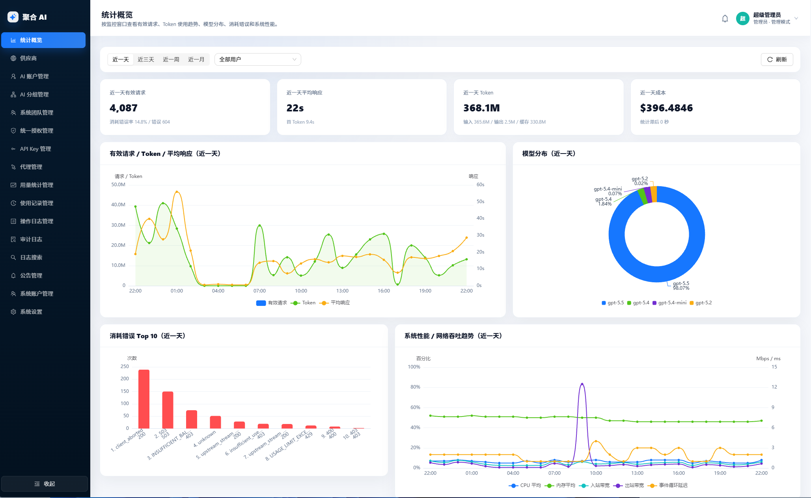

# 聚合 AI

聚合 AI（`juhe-ai`）是一个轻量级 OpenAI 兼容中转、账号调度与授权管理系统。它把客户端固定到一个本地 `/v1` 入口，把上游 OpenAI OAuth 账号、OpenAI API Key 账号、分组、API Key、代理、错误切换、使用记录、审计日志和用量统计放到后台统一维护。

项目适合个人或小团队管理多组 OpenAI 上游账号、多套代理和多个客户端接入场景。客户端只需要配置本服务的 Base URL 和本地 API Key；账号选择、授权边界、代理使用、失败切换、统计记录和排障审计都由后台处理。

> 当前版本聚焦单机轻量部署和 OpenAI 兼容入口：管理面、OpenAI 账号接入、统一授权、网关透传、统计、审计和运维排障链路已经形成完整闭环；更多供应商和多实例能力按后续需求扩展。




## 核心价值

- **一个入口接所有客户端**：Codex、OpenAI SDK 或其他 OpenAI 兼容客户端统一使用本地 `/v1` 和本地 API Key。
- **多账号集中调度**：OpenAI OAuth / API Key 账号统一维护启停、到期、并发、优先级、代理和错误策略。
- **分组隔离调用边界**：分组绑定账号，API Key 绑定分组；调用时只能在绑定分组内选择可用账号。
- **统一授权给用户或团队**：AI 账户和分组可授权给系统账户或系统团队，被授权方只有使用权，没有管理权和凭据查看权。
- **异常自动切换**：账号限流、上游错误、未知异常或流式中断时，可按策略冷却账号并尝试切换同组其他可用账号。
- **完整可观测链路**：使用记录、用量统计、运行日志搜索、系统监控和原始审计日志分别服务计量、趋势、运维和深度排障。

## 能力地图

### 管理与安全

- **系统账户**：内置默认管理员 `admin/admin`；支持 `admin` / `user` 角色、账户创建、停用、删除、重置密码、初始密码提醒和会话失效。
- **登录防护**：登录使用后端一次性图形验证码，并按客户端 IP 和用户名做短时失败限制。
- **系统团队**：管理员可创建团队、启停团队和维护成员；团队用于承接批量资源授权，不改变成员自己的数据归属。
- **全局品牌**：管理员可维护系统名称和图标；登录页和应用壳统一读取公开品牌配置。
- **中文界面**：前端基于 Vue 3、TypeScript 和 Ant Design Vue，页面文案、空态、表单提示和组件 locale 面向中文用户。

### OpenAI 账号接入

- **供应商定义**：内置 OpenAI，默认上游地址为 `https://api.openai.com/v1`，能力包含 `models`、`responses`、流式响应和协议透传。
- **模型价格目录**：供应商页可查看 OpenAI 模型价格快照；网关按模型目录估算成本，未命中模型只记录 Token，不猜测费用。
- **OAuth 账号**：支持手动授权链接创建，也支持直接粘贴 Refresh Token 创建；后台会提前刷新 Access Token，请求前仍保留自动刷新兜底。
- **API Key 账号**：支持填写上游 OpenAI API Key 创建账号；敏感凭据只在编辑弹窗中展示和修改，列表不暴露。
- **账号调度属性**：支持启停、调度开关、超级优先、降级备用、优先级、并发上限、到期时间、代理绑定、错误策略和连接测试。
- **OAuth 额度快照**：OpenAI OAuth 账号从真实网关请求或账户测试响应头被动更新 Codex `5h` / `7d` 额度快照，并在账号列表中展示进度、预计恢复时间和快照状态。

### 分组、API Key 与统一授权

- **分组管理**：每个系统账户自动拥有 OpenAI 默认分组；可创建、编辑分组并绑定同供应商账号，默认分组不允许删除。
- **API Key 管理**：本地网关 API Key 可创建、编辑、禁用、删除、设置到期时间并绑定自有分组或授权分组；列表显示完整本地密钥并提供复制入口。
- **统一授权中心**：AI 账户和分组授权统一收敛到 `统一授权管理` 菜单，支持授权给系统账户或系统团队。
- **稳定授权口径**：同一资源授权给同一用户全生命周期只保留一条最终用户授权记录；个人来源和团队来源重叠时按团队来源生效，历史用量继续合并。
- **授权使用边界**：被授权用户可使用授权 AI 账户、把授权账号加入自己的同供应商分组，或把授权分组绑定到自己的 API Key；不能编辑、删除、查看敏感凭据、修改代理/并发/错误策略或继续转授权。
- **授权消耗统计**：资源所有者可在授权管理里查看授权用户、授权团队和团队成员的消耗聚合；不暴露被授权人的请求快照、客户端 IP、API Key 明文或业务内容。

### OpenAI 兼容网关

- **统一入口**：后端提供 `/v1/*` 网关入口，客户端按 OpenAI 兼容格式请求即可。
- **本地鉴权**：网关只读取 `Authorization: Bearer <本地 API Key>`，不读取后台登录态，也不把上游 OpenAI 密钥作为客户端密钥。
- **调度链路**：网关通过本地 API Key 找到绑定分组，再在分组内选择可用 OpenAI 账号；授权分组和授权账号会按实际调用方记录用量。
- **协议透传**：非管理接口默认按 OpenAI 兼容协议透传到上游，支持普通响应和 SSE 流式响应，并保留必要响应头。
- **错误处理**：账号限流、上游错误、未知异常和流式中断可触发账号临时不可调用、冷却、限流标记或同组账号切换。
- **代理支持**：账号可绑定 HTTP、HTTPS 或 SOCKS5 代理；OAuth token 刷新、账号测试和网关真实转发都会使用账号代理。

### 记录、统计与运维

- **使用记录**：记录请求 ID、客户端 IP、API Key、分组、账号、模型、端点、流式标记、状态码、Token、成本、首 Token 耗时、总耗时、错误摘要和有限快照。
- **用量统计**：按 AI 账户展示近 1 天、近 3 天、近一周、近一月和总用量；授权账户可查看授权用户与团队成员维度的聚合用量。
- **统计概览**：用户可查看自己的有效请求、Token 趋势、模型分布和成本概览；管理员默认查看全局概览，也可筛选指定用户，并额外查看错误分布和系统监控采样。
- **系统监控**：后台采样 CPU、内存、RSS、Heap、事件循环延迟、网络吞吐和数据库大小，并维护小时聚合数据。
- **日志搜索**：管理员可检索最近 3 天普通运行日志索引，按 `traceId`、级别、事件、路径、状态码、客户端 IP 和关键字定位链路。
- **原始审计日志**：管理员可按 `traceId` 查看完整客户端请求、网关上游请求、上游响应和最终返回；完全成功请求默认 10% 采样，非成功、客户端中断、流式中断和中间重试失败链路全量保存。
- **后台 worker**：统计聚合、系统采样、运行日志索引维护、审计日志批量落库、数据清理、账号质量缓存和冷却账号复测在独立后台 worker 进程内执行，避免占用 Web/API 主进程事件循环；OAuth 额度快照不做后台主动刷新。

## 技术栈

- 前端：Vue 3 + TypeScript + Vite + Ant Design Vue + ECharts
- 后端：Node.js + TypeScript + Express + Zod
- 存储：SQLite（使用 Node.js `node:sqlite`）
- 代理：`https-proxy-agent`、`socks-proxy-agent`
- 日志：Pino + SQLite 搜索索引
- 包管理：pnpm workspace
- 发布：前端静态资源由后端托管，支持 Windows、macOS、Linux 发布包

## 项目结构

```text
.
├─ backend/             # Node.js API、网关、后台 worker、SQLite 存储
├─ frontend/            # Vue 管理后台、路由、页面、API 请求层
├─ docs/                # 架构、功能、计划、开发、部署、问题和重构文档
├─ deploy/              # 发布包启动脚本模板
├─ resources/           # README 和品牌相关静态资源
├─ scripts/             # 跨平台打包脚本
└─ release/             # 本地打包产物目录
```

## 环境要求

- Node.js `>= 22.5.0`，部署前建议确认当前 Node 支持 `node:sqlite`。
- pnpm `>= 9.0.0`。
- Windows 默认使用 PowerShell 7（`pwsh`）；macOS / Linux 使用 Bash 启动脚本。

## 本地开发

安装依赖：

```powershell
pnpm install
```

复制本地配置：

```powershell
Copy-Item backend/.env.example backend/.env
Copy-Item frontend/.env.example frontend/.env
```

启动前后端开发服务：

```powershell
pnpm dev
```

默认访问地址：

- 前端管理后台：`http://127.0.0.1:5173`
- 后端管理 API：`http://127.0.0.1:3000/api`
- OpenAI 兼容网关：`http://127.0.0.1:3000/v1`
- 健康检查：`http://127.0.0.1:3000/health` 或 `http://127.0.0.1:3000/api/health`

默认登录账号：

- 用户名：`admin`
- 密码：`admin`
- 首次登录后请立即修改默认密码。

也可以只启动单端：

```powershell
pnpm --filter juhe-ai-backend dev
pnpm --filter juhe-ai-frontend dev
```

后端开发启动时会由 Web/API 主进程自动拉起后台 worker 和本地 DB service 进程。后台 worker 负责统计、监控、日志索引、审计日志批量落库、数据清理、账号质量缓存和冷却账号复测；DB service 承接网关高频 SQLite 读写。OAuth 额度快照只从真实请求或账户测试响应头被动更新。正常情况下不要手动把 `JUHE_AI_PROCESS_ROLE` 改成 `worker` 或 `db-service` 常驻启动。

## 配置说明

项目按“目录可移植”设计，后端读取 `backend/.env`，前端读取 `frontend/.env`，默认 SQLite 文件放在 `backend/data/juhe-ai.sqlite3`。迁移项目时保留 `.env` 和 `backend/data/` 即可继续使用。

常用后端配置：

```dotenv
JUHE_AI_HOST=127.0.0.1
JUHE_AI_PORT=3000
JUHE_AI_PROCESS_ROLE=server
JUHE_AI_DATABASE_PATH=./data/juhe-ai.sqlite3
JUHE_AI_SECRET=juhe-ai-dev-secret-change-me
JUHE_AI_OAUTH_PROXY_URL=
JUHE_AI_LOG_LEVEL=info
JUHE_AI_LOG_DIR=./logs
JUHE_AI_LOG_FILE_ENABLED=true
JUHE_AI_LOG_CONSOLE_ENABLED=true
JUHE_AI_BACKEND_URL=http://127.0.0.1:3000
JUHE_AI_SMOKE_ACCOUNT_NAME=
JUHE_AI_SMOKE_MODEL=gpt-5.4-mini
JUHE_AI_SMOKE_PROMPT=只输出 OK
```

常用前端配置：

```dotenv
VITE_JUHE_AI_BACKEND_TARGET=http://127.0.0.1:3000
VITE_JUHE_AI_API_BASE_URL=/api
VITE_JUHE_AI_GATEWAY_BASE_URL=
```

部署到局域网或服务器时通常需要调整：

- `backend/.env`：把 `JUHE_AI_HOST` 改为 `0.0.0.0`，并按需修改 `JUHE_AI_PORT`。
- `backend/.env`：生产环境必须设置稳定且足够随机的 `JUHE_AI_SECRET`；已有数据库迁移时不能更换，否则 OAuth token、上游 API Key 和代理密码会无法解密。
- `frontend/.env`：同源部署保持 `VITE_JUHE_AI_API_BASE_URL=/api`；分离部署时改为完整后端 `/api` 地址。
- `frontend/.env`：公网或分离部署时建议显式设置 `VITE_JUHE_AI_GATEWAY_BASE_URL=https://你的域名/v1`。

## 客户端接入

1. 登录管理后台。
2. 在 `AI账户管理` 中创建 OpenAI OAuth 或 OpenAI API Key 账号。
3. 在 `AI账户分组` 中确认账号已绑定到目标分组。
4. 在 `API 密钥` 中创建本地 API Key，并绑定目标分组。
5. 在客户端中配置：

```text
Base URL: http://127.0.0.1:3000/v1
API Key : API 密钥页面展示的 sk-... 本地密钥
```

注意事项：

- 客户端填写的是本地网关 API Key，不是上游 OpenAI API Key，也不需要手动加 `Bearer ` 前缀。
- 网关请求不依赖后台登录 Cookie，适合 Codex、OpenAI SDK 或其他 OpenAI 兼容客户端直接接入。
- 如果返回 `Invalid API key`，优先检查 API Key 是否复制完整、是否启用、是否过期以及绑定分组是否可用。
- 如果返回 `No available upstream account`，优先检查分组内是否有启用、未过期、可调度、授权有效且未冷却的账号。

## 测试与验证

代码级检查：

```powershell
pnpm typecheck
pnpm build
```

真实网关烟测：

```powershell
pnpm test:smoke
```

烟测会在项目已启动后自动选择可用 OpenAI 账号和本地 API Key，验证 `/v1/models`、`/v1/responses` 非流式、流式响应以及使用记录入库。需要固定账号或模型时编辑 `backend/.env` 中的 `JUHE_AI_SMOKE_ACCOUNT_NAME`、`JUHE_AI_SMOKE_MODEL` 和 `JUHE_AI_SMOKE_PROMPT`。

用量统计缓存需要重建时可执行：

```powershell
pnpm --filter juhe-ai-backend stats:rebuild
```

更多验证细节见 `docs/develop/测试与验证说明.md`。

## 跨平台发布包

Windows 打包：

```powershell
pnpm package:release:windows
```

macOS / Linux 打包：

```bash
pnpm package:release:mac
pnpm package:release:linux
```

默认生成：

- `release/juhe-ai-release.zip`：推荐给 Windows 目标机器。
- `release/juhe-ai-release.tar.gz`：推荐给 macOS / Linux 目标机器。

目标机器启动：

```powershell
# Windows
pwsh ./start.ps1
```

```bash
# macOS / Linux
bash ./start.sh
```

发布包由后端直接托管 `frontend/dist`，无需额外静态服务器即可访问管理后台。生产常驻运行时需要确认 Web/API 主进程、后台 worker 和本地 DB service 均正常存活。构建和部署前请阅读 `docs/deploy/构建指南.md` 与 `docs/deploy/部署指南.md`。

如需在打包时固定公网网关地址：

```powershell
pwsh ./scripts/package-release.ps1 -FrontendGatewayBaseUrl "https://你的域名/v1"
```

```bash
bash ./scripts/package-release.sh --frontend-gateway-base-url "https://你的域名/v1"
```

## 权限与数据边界

- `admin` 可查看系统账户、系统团队、供应商、代理、统计概览、运行日志、审计日志和全部业务数据；统计概览管理侧默认全部用户，也支持筛选指定用户。
- `user` 默认只看自有 AI 账户、分组、API Key、使用记录、用量统计、统计概览、AI 性能监控、我的团队，以及授权给自己的资源。
- 系统团队只是授权来源和成员集合，不改变成员自己的 API Key、使用记录和业务数据归属。
- 授权只传递使用权，不传递编辑权、删除权、凭据查看权、成员管理权或二次授权权。
- 使用记录按实际 API Key 所属系统账户入库；资源真实总量按 AI 账户 / 分组归属人聚合；授权消耗按“资源 × 用户”聚合。
- 原始审计日志包含完整请求和响应原文，仅管理员可见；对外分享数据库、截图或问题材料前必须注意移除敏感内容。

## 文档入口

- 文档目录规范：`docs/README.md`
- 整体架构：`docs/architecture/架构总览.md`
- 后端架构：`docs/architecture/backend/README.md`
- 前端架构：`docs/architecture/frontend/README.md`
- 核心功能设计：`docs/functions/核心功能设计.md`
- OpenAI 账号接入：`docs/functions/OpenAI账号接入.md`
- 系统团队与统一授权：`docs/functions/系统团队与统一授权设计.md`
- 原始审计日志：`docs/functions/原始审计日志设计.md`
- 接口契约与权限矩阵：`docs/functions/接口契约与权限矩阵.md`
- SQLite 存储说明：`docs/functions/SQLite存储说明.md`
- 安全与日志策略：`docs/functions/安全与日志策略.md`
- 阶段计划归档：`docs/plans/第一阶段计划.md`
- 系统团队与统一授权计划：`docs/plans/计划-0003-系统团队与统一授权新版.md`
- 原始审计日志计划：`docs/plans/计划-0004-原始审计日志.md`
- 后台任务进程隔离计划：`docs/plans/计划-0005-后台任务进程隔离.md`
- 开发安装说明：`docs/develop/安装指南.md`
- 开发运行说明：`docs/develop/运行说明.md`
- 测试与验证说明：`docs/develop/测试与验证说明.md`
- 构建指南：`docs/deploy/构建指南.md`
- 部署指南：`docs/deploy/部署指南.md`

## 当前版本边界

- 当前实现只启用 OpenAI 供应商；其他供应商保留架构扩展空间。
- 对外只兼容 OpenAI `/v1` 协议；后续供应商也优先通过 OpenAI 兼容格式接入客户端。
- 存储默认使用 SQLite，优先服务单机和轻量部署场景。
- 当前版本不引入 Redis、Kafka 或分布式任务队列；后台任务通过独立本地 worker 进程隔离。
- 代理是管理员维护的全局资源，普通用户不进入代理管理页。
- 统计概览同时提供用户侧业务概览和管理员管理概览；系统监控、日志搜索和原始审计日志面向管理员，普通用户以统计概览、使用记录和用量统计查看自己的调用情况。
- 原始审计日志是高权限排障数据，不用于计费和统计；成功请求默认采样，非成功链路全量保存。
- 更复杂的多实例会话、共享验证码存储、供应商插件化和重型网关策略不属于当前轻量部署优先级。
