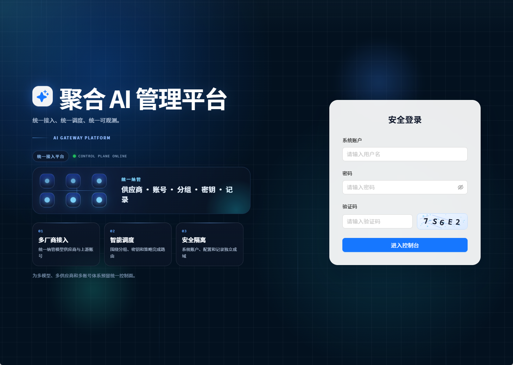
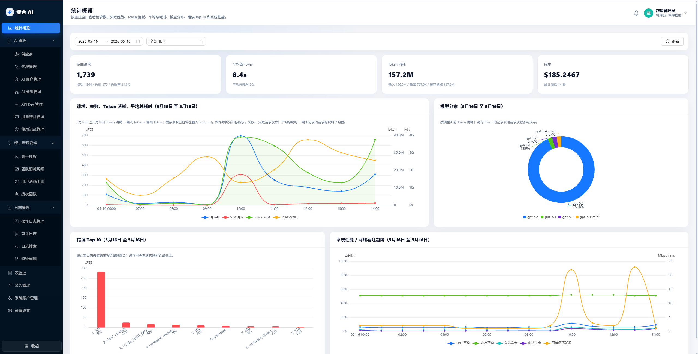
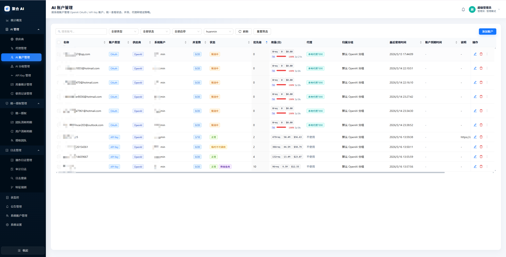

# 聚合 AI（juhe-ai）

> 轻量级 OpenAI 账号稳定调度后台。  
> 让 Codex、OpenAI SDK、Cherry Studio、NextChat 等客户端固定一个 `/v1` 入口，把多账号、高并发调度、授权、审计和排障收进一个本地后台。

聚合 AI 解决的不是“再转发一次请求”，而是把 OpenAI 账号池变成一套 **可管理、可授权、可观测、可恢复** 的稳定服务。

客户端只需要一组配置：

```text
Base URL: http://你的服务器:3000/v1
API Key : 聚合 AI 后台生成的本地 sk-... 密钥
```

OpenAI OAuth、OpenAI API Key、代理、分组、额度、高并发策略、失败切换、统计和审计都留在后台。账号换了、限流了、过期了、代理波动了，客户端尽量不用跟着改。







## 为什么需要它

很多 OpenAI 中转只解决“能不能转发”。真正用起来，更麻烦的是这些事：

- 客户端里散落着上游 Key，换账号就要到处改。
- 多个 OpenAI 账号靠人工记状态，哪个限流、哪个到期、哪个代理慢，很难看清。
- 多人共享账号池时，权限、额度、分组和用量容易混在一起。
- Codex / OpenAI-compatible 客户端遇到断流、EOF、429 或上游异常时，很难判断问题来自客户端、网关、代理还是上游账号。
- 出问题后只有几行运行日志，缺少请求、账号命中、Token、耗时、错误摘要和原始链路审计。

聚合 AI 的重点是：**让客户端入口稳定，让账号池后台可控，让故障链路查得明白。**

## 核心优势

| 能力 | 聚合 AI 怎么做 |
| --- | --- |
| 固定入口 | 客户端长期连接同一个根路径或 `/v1`，不用感知后台账号变化 |
| 账号池调度 | 按分组、授权、状态、并发、优先级、冷却、到期、代理和质量选择账号 |
| 高并发分组 | 个人分组保持稳定亲和，高并发分组支持软并发、分组短队列、每 Key 队列和可选单 IP 保护 |
| 双账号形态 | 同时支持 OpenAI OAuth 账号和 OpenAI API Key 账号 |
| 流式稳定 | 按 SSE 事件和可见输出边界处理失败，避免盲目重试破坏客户端状态 |
| 统一授权 | 系统账户、系统团队、AI 账户、分组和 API Key 形成清晰使用边界 |
| 可观测排障 | 使用记录、统计趋势、AI 性能、模型检测、运行日志、操作日志和原始审计分层追踪 |
| 轻量部署 | Node.js + SQLite 即可运行，不强制 Redis、Kafka 或 PostgreSQL |

## 和普通中转的差别

普通中转更像一根管道：把客户端请求送到上游。

聚合 AI 更像一个账号稳定层：

- **上游凭据不散落**：客户端拿本地 API Key，上游 OAuth token 和 OpenAI API Key 留在后台。
- **账号池不是轮询表**：账号启停、代理、优先级、冷却、到期、错误策略和复测恢复都进入管理闭环。
- **授权不是发一个 Key 就完事**：分组承接账号池，API Key 绑定分组，用户和团队通过统一授权获得使用权。
- **失败不是只看状态码**：请求异常、上游错误、未知失败、流式中断和 Codex 客户端策略分层处理。
- **排障不是猜**：从使用记录到原始审计，可以追到哪个客户端、哪个 Key、哪个分组、哪个账号、哪个上游响应。

## 功能总览

### 账号与调度

- OpenAI OAuth 账号、OpenAI API Key 账号统一管理。
- 支持账号启停、优先级、并发、代理、到期时间、冷却和错误策略。
- API Key 绑定分组，分组绑定账号池，请求进入后自动选择可调度账号。
- 支持个人分组和高并发分组；高并发分组可配置最大单账户排队阈值、最大等待时间和单 IP 并发保护。
- OAuth token 支持请求前懒刷新和后台 worker 保活。

### 授权与隔离

- 支持系统账户、系统团队和普通用户侧资源视图。
- AI 账户或分组可以授权给用户 / 团队使用。
- 授权只传递使用权，不暴露上游凭据管理权。
- 支持 API Key 和统一授权维度的本地额度控制与消耗统计。

### 稳定与排障

- 支持 OpenAI 兼容协议透传和 SSE 流式响应。
- 流式失败按可见输出边界处理，减少重复输出、工具调用错乱和上下文分叉。
- 使用记录保存模型、Token、成本估算、耗时、错误摘要和账号命中。
- 模型检测复用本地网关链路，对 AI 账户执行可信度诊断，并保存脱敏、有界摘要。
- 原始审计记录客户端请求、网关处理、上游请求、上游响应和最终返回，便于定位复杂问题。

### 轻量后台

- Vue 3 + TypeScript + Ant Design Vue 中文管理后台。
- SQLite 本地存储，按业务库、统计数据集域和统计结果库三类职责拆分；统计数据集域由数据集目录库和 usage shard 文件组成，默认适合单机、小服务器、家用主机或轻量云主机。
- Web/网关主进程、background worker、本地 DB service 分离，减少统计、日志和高频 SQLite 访问对主链路的影响。

## 适合谁

- 想给 Codex、OpenAI SDK 或 OpenAI-compatible 客户端提供稳定入口的个人用户。
- 有多个 OpenAI 账号，需要统一调度、代理、分组和排障的小团队。
- 想把上游 Key 收回后台，只给成员发本地 API Key 的工作室。
- 需要查看 Token、成本、耗时、错误、账号命中和原始链路的运维者。
- 想轻量部署，不想先搭 Redis、Kafka、PostgreSQL 和复杂网关集群的人。

## 不适合谁

- 你需要全供应商、多模型、充值支付和公开售卖平台。
- 你需要多实例分布式网关、跨机房队列或强一致计费系统。
- 你希望一个项目同时深度覆盖 OpenAI、Claude、Gemini、Realtime、支付、工单和渠道市场。

聚合 AI 当前选择更窄的路线：聚焦 OpenAI 账号接入、OpenAI 兼容网关、账号池调度、统一授权、统计审计和排障闭环。

## 最快启动

环境要求：

- Node.js 官方 LTS：`22.x >= 22.13.0` 或 `24.x >= 24.11.0`，且内置 SQLite 支持 FTS5
- pnpm `>= 9.0.0`
- Windows 推荐使用 PowerShell 7

在项目根目录执行：

```powershell
pnpm install
Copy-Item backend/.env.example backend/.env
Copy-Item frontend/.env.example frontend/.env
pnpm dev
```

启动后访问：

- 管理后台：`http://127.0.0.1:5173/__aisys__/`
- 后端系统 API：`http://127.0.0.1:3000/__aisys__/api`
- OpenAI 兼容入口：`http://127.0.0.1:3000/v1`

默认管理员：

```text
用户名：admin
密码：admin
```

首次登录后请立刻修改默认密码。

## 最快接入客户端

1. 登录后台。
2. 在 `AI 账户管理` 或 `我的 AI 账户` 添加 OpenAI OAuth 账号或 OpenAI API Key 账号。
3. 在 `API Key 管理` 或 `我的 API Key` 创建一个本地 API Key，并绑定可用分组。
4. 在客户端里填写：

```text
Base URL: http://127.0.0.1:3000/v1
API Key : 后台 API 密钥页面生成的本地 sk-... 密钥
```

注意：客户端填写的是聚合 AI 生成的本地 API Key，不是上游 OpenAI API Key。

## 最快部署

先在构建机器打包：

```powershell
pnpm install
pnpm package:release:windows
```

会生成：

```text
release/juhe-ai-release.zip
release/juhe-ai-release.tar.gz
```

部署到 Windows：

```powershell
Expand-Archive .\juhe-ai-release.zip -DestinationPath . -Force
Set-Location .\juhe-ai-release
pwsh .\start.ps1
```

部署到 macOS / Linux：

```bash
tar -xzf juhe-ai-release.tar.gz
cd juhe-ai-release
bash ./start.sh
```

启动后访问：

```text
http://服务器IP:3000/__aisys__/
```

公网访问、反向代理、端口调整、开机自启和数据迁移见 [部署指南](docs/deploy/部署指南.md)。

## 常用命令

```powershell
# 开发启动
pnpm dev

# 类型检查
pnpm typecheck

# 构建
pnpm build

# 打包发布包
pnpm package:release:windows

# 真实网关烟测
pnpm test:smoke
```

## 技术栈

- 前端：Vue 3 + TypeScript + Vite + Ant Design Vue + ECharts
- 后端：Node.js + TypeScript + Express + Zod
- 存储：SQLite（`node:sqlite`）
- 日志：Pino + SQLite 搜索索引
- 包管理：pnpm workspace

## 文档

- [开发安装说明](docs/develop/安装指南.md)
- [开发运行说明](docs/develop/运行说明.md)
- [测试与验证说明](docs/develop/测试与验证说明.md)
- [构建指南](docs/deploy/构建指南.md)
- [部署指南](docs/deploy/部署指南.md)
- [整体架构](docs/architecture/架构总览.md)
- [核心功能设计](docs/functions/核心功能设计.md)
- [高并发分组调度设计](docs/functions/高并发分组调度设计.md)
- [模型检测设计](docs/functions/模型检测设计.md)
- [客户端稳定性竞品对比](docs/functions/客户端稳定性竞品对比.md)
- [SQLite 存储说明](docs/functions/SQLite存储说明.md)
- [接口契约与权限矩阵](docs/functions/接口契约与权限矩阵.md)

## 当前边界

- 当前主要支持 OpenAI 供应商，其他供应商保留扩展空间。
- 当前定位是单机轻量部署，不默认引入 Redis、Kafka 或分布式任务队列。
- 默认使用 SQLite，业务库、统计数据集目录库、usage shard 目录和统计结果库位于 `backend/data/`；旧记录库不作为运行时回退入口。
- 管理后台和网关由同一个后端服务承载，前端静态资源在发布包中由后端托管。
- 本项目不是支付平台、公开售卖平台或全供应商多模型资产平台；它优先服务 OpenAI 账号池稳定调度和可观测运维。

## Star 支持

如果这个项目对你有帮助，欢迎点一个 Star：

- GitHub：[https://github.com/huanmin123/juhe-ai](https://github.com/huanmin123/juhe-ai)
- Gitee：[https://gitee.com/huanminabc/juhe-ai](https://gitee.com/huanminabc/juhe-ai)

## QQ 群

加群有好用便宜的中转推荐


## 闲聊

想必不少人都好奇，咱们这套工具和sub2api、cap以及各类中转服务究竟有什么区别。直白来讲，**核心差距就在于异常错误处理机制**。

我们聚合方案的设计思路，是在服务端提前拦截所有潜在问题，不会把异常错误直接下发到用户客户端，最大限度保障AI对话正常使用。而市面上多数中转平台以盈利为首要目的，受成本限制，并不会投入资源做深度异常防护，一旦出现接口波动、请求异常，错误会直接传递给客户端，很容易造成对话突然中断。

而且异常处理本身技术门槛极高，绝非简单调试就能搞定。一旦处理不当，会出现会话缓存丢失、会话连接失效、上下文逻辑错乱、请求重复消耗等一系列问题。也正因开发难度大、投入成本高，绝大多数中转服务商都不愿在这块深耕，直接把报错适配的难题丢给用户自行解决。

各类错误码、报错提示五花八门，就连显示200正常状态也可能暗藏异常，相关规则还在不断迭代更新，普通用户根本没办法逐一适配调试。这还只是咱们产品的部分优势。

项目累计打磨了20万行代码，目前已有大量用户实际使用。实测最长可实现连续8小时不间断对话，整体运行稳定性表现优异。

目前产品主要面向个人与小团队场景使用，为了简化启动与部署流程，整体采用一体化封装设计，没有额外搭载高性能中间件、独立缓存组件，有二次改造需求也可以自行调整。本地测试环境下QPS最高可达到500，实际承载上限可根据服务器硬件性能灵活变动。

其实我此前也一直在使用sub2api这类中转工具，并非刻意更换方案，实在是原有工具体验短板太多，迫不得已才选择自研开发。

以往使用过程中问题层出不穷：部署流程繁琐、本地运行频繁掉线；对话中断后只能依靠手动定时器恢复，优先级调度基本形同虚设；不支持手动切换流量、临时调配权重，数据统计、运行日志等配套功能也残缺不全。

相信大家都深有体会：AI对话一旦无故中断，会话就得重新初始化，AI需要重新梳理上下文内容，不仅增加调用成本、耗费大量时间，还带来不小的使用困扰。

使用稳定的服务时，日常可以轻松休闲放松，抽空玩玩游戏、刷视频追剧，回过头就能获取完整对话结果，体验感十分舒心。可要是频繁断连就格外影响效率，发送指令没多久就停止输出，隔许久查看进度寥寥无几，只能反复手动接续对话，一整天都很难完成完整任务。

频繁补发接续指令，还极易打乱上下文逻辑，严重时甚至会触发AI死循环。全程只能守在设备旁紧盯对话进度，根本没法安心做其他事情。

最后也感谢各位的认可与点赞支持！


## 友链:

LINUX DO 社区: https://linux.do/


