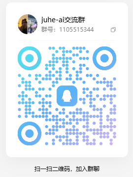

# juhe-ai（聚合 AI）

   

**轻量 OpenAI 兼容中转与账号调度网关**：客户端长期固定一个本地入口和一个本地 API Key；账号凭据、模型能力、分组、路由、授权、用量与审计统一留在后台管理。

一句话：**把上游账号池的波动（限流、OAuth 过期、流式中断、代理抖动）吸收在网关里，让 Codex、Claude Code、OpenAI SDK 和各类兼容客户端少换配置、少断流。**

> ⚠️ **合规提醒**：本项目的部分接入方式（订阅 OAuth / SSO Cookie 等）可能违反上游服务商服务条款，存在账号受限风险。请仅用于个人学习与研究，遵守所用账号与服务商的服务条款及当地法律法规；因使用方式产生的责任由使用者自行承担。

## 适用场景

- 手里有多个上游账号（OAuth 订阅号、API Key、中转站），想给 Codex / Claude Code / OpenAI SDK 等客户端一个**稳定不变的入口**。
- 上游限流、冷却、换号、重新授权频繁，不想每次都去改客户端 Base URL 和 Key。
- 需要把不同用户、团队的用量隔离，并给 API Key / 授权设置美元额度。
- 需要看清每一次请求：命中了哪个账号、为什么选它、失败在链路哪一环。
- 优先从单机轻量部署开始（默认 SQLite 零外部依赖），需要时再切 PostgreSQL + Redis。

## 与 Sub2API / New API / CLIProxyAPI 的区别

这是被问得最多的问题，直接回答。先说结论：**它们都是成熟项目，但目标不同**。juhe-ai 不是“功能最多的网关”，而是个人 / 小团队 / 工作室的**账号稳定层**——主动收窄平台化的宽度，换取三件事：客户端不断流、账号池不被误伤、出了问题查得清。

| | juhe-ai | [Sub2API](https://github.com/Wei-Shaw/sub2api) | [New API](https://github.com/QuantumNous/new-api) | [CLIProxyAPI](https://github.com/router-for-me/CLIProxyAPI) |
| --- | --- | --- | --- | --- |
| 定位 | 轻量账号调度网关 + 完整管理后台 | AI API 网关平台（订阅配额分发与运营） | 大模型网关与 AI 资产管理 | 面向 CLI 的多协议 OAuth 代理 |
| 最适合 | 多个上游账号，给客户端一个稳定入口，后台管得住、查得清 | 做平台、拼车分发、Token 级计费 | 多模型、多渠道资产管理与渠道运营 | 快速把多种 CLI OAuth 变成 API |
| 部署 | 2 个 Go 常驻进程；默认 SQLite，可选 PostgreSQL + Redis | Docker Compose + PostgreSQL + Redis | Docker 单容器起步 | 单二进制 / 容器 |
| 计费 / 支付 | 美元额度与用量统计，无支付 | Token 级计费、内置支付 | 充值额度、商业组件 | 无 |
| 调度重点 | 账号状态 / 冷却 / 会话亲和 / 流式兜底 / 后台自愈 | 智能调度、粘性会话、并发速率限制 | 渠道管理、格式转换面最宽 | 多账户轮询 |
| 排障能力 | 使用记录 + 原始审计全链路内置 | 平台级日志统计 | 平台级日志看板 | 统计依赖生态项目 |

**怎么选：**

- 要做平台、卖配额，需要支付和 Token 级计费 → Sub2API 或 New API 更完整。
- 要多模型、多渠道的资产管理和最宽的格式转换 → New API。
- 要一个轻代理吃多种 CLI OAuth、生态工具多 → CLIProxyAPI。
- 要**少依赖、少配置**，客户端固定一个入口尽量不断，账号状态可解释、故障可回溯 → juhe-ai。

更准确的自我定位：**比通用代理更可管理，比大型平台更轻量，比简单轮询更稳，比单纯转发更懂 OpenAI / Codex 流式失败边界。**逐项机制与源码级对比见 [客户端稳定性竞品对比](docs/functions/客户端稳定性竞品对比.md)（竞品事实以各项目当时 README / 源码为准）。

### 为什么“更稳”：具体机制

稳定性不是口号，是可以逐条核对的设计（细节展开见上文对比文档）：

1. **入口稳定**：客户端只配置本地 Base URL 和本地 API Key。上游换号、限流、冷却、停用、重新授权，都不要求客户端同步改任何配置。
2. **调度不是简单轮询**：选号同时考虑账号状态、冷却、到期、优先级、超级优先、降级备用、质量缓存和会话亲和；会话亲和只影响排序，不绕过授权、额度、状态和并发边界。
3. **未知失败先吸收波动**：下游尚未收到可见输出时，按端点、墙钟和 attempt 预算做有界候选切换；无法确认归属的 opaque 上游错误不写 Key / IP / 账户的跨请求状态，避免一次网络抖动误伤整个账号池；全部候选耗尽时返回稳定的网关错误，不把上游私有错误和响应头原样透传。
4. **流式按“可见输出”边界兜底**：SSE 按事件边界增量解析；`response.created`、心跳、metadata 不算可见输出，不会误触发账号流失败计数；**已写给客户端的内容绝不拼接第二个账号的第二次结果**，不制造重复工具调用和上下文分叉。
5. **慢客户端不拖垮账号**：流式转发尊重 backpressure；客户端主动断开只记录 `downstream_closed` 并释放并发槽，不写账号失败状态。
6. **后台自动恢复**：OAuth token 预刷新 + 请求前懒刷新、冷却账号复测、运行态探针恢复，把“坏一次”变成“可自动回池”，不靠人工频繁启停账号。
7. **审计排障闭环**：使用记录与原始审计分离；失败、中断、流式改写链路全量保留，流式改写同时保存上游原始失败与下游改写后事件——能解释“客户端看到的错误”和“上游真实发生了什么”为什么不同。

## 核心特性

### 网关与路由

- OpenAI 兼容入口：服务根路径与 `/v1`；管理后台与系统 API 在 `/__aisys__/` 下独立承载。
- 五种路由模式：**普通、权重调度、故障回退、轮询、合并**（全池统一调度），全部共享**成本优先 / 速度优先**调度偏好（速度优先含首字慢观察与确认慢后的安全切号）。
- 账户内多上游 Key：单账户保存多个上游 API Key，轮询或平滑加权，Key 级故障隔离——不必为每个 Key 建一个账号。
- 高并发分组：同一 API Key 大量并发时在分组边界内协调账号负载，减少单账号排队。
- 会话亲和：按客户端会话 Header（Codex `session-id`、Claude Code `x-claude-code-session-id`）保持连续性，不提供伪造的通用 Header。
- 来源级保护：IP 级账号回避（某来源在某账号失败但其他来源正常时短 TTL 避让）、认证前探测拦截、认证后错误熔断、全局与用户级请求限制。

### 供应商与账号接入

| 供应商 | 接入方式 |
| --- | --- |
| OpenAI（`gpt`） | API Key；ChatGPT / Codex OAuth（含 service tier、reasoning effort 受控覆盖） |
| 通用 OpenAI-compatible（`openai`） | 任意兼容上游 API Key，可作为临时接入聚合目录 |
| Anthropic（`anthropic`） | API Key；官方 OAuth |
| Gemini（`gemini`） | API Key；AI Studio OAuth；Code Assist / Google One OAuth |
| xAI / Grok（`xai`） | API Key；Grok OAuth；Grok Web SSO Cookie（受控 device flow 转换，不保存 Cookie） |
| DeepSeek（`deepseek`） | API Key（OpenAI 兼容 / Anthropic 兼容双档案） |
| 智谱 GLM（`glm`） | API Key（通用 OpenAI Chat；Coding Plan 的 OpenAI Chat / Anthropic Messages 兼容档案） |
| 混合供应商（`hybrid`） | 保存真实上游凭据，承接跨协议入口适配与模型映射（见下节） |

每个账号支持代理绑定、并发上限、可用时间计划、模型限制、错误处理策略、必填检查模型与请求形态；账户激活、周期健康、冷却恢复全部由后台探针执行，人工测试只出诊断结果、零状态副作用。

### 跨协议桥接

跨协议转换是混合供应商（`hybrid`）账户的能力，不在 API Key 或路由策略上配置；OpenAI v1 普通账号可用模型别名显式声明 `responses -> chat_completions`。当前白名单：

| 下游客户端协议 | 可承接的真实上游协议 |
| --- | --- |
| OpenAI Responses | Chat Completions、Anthropic Messages、Gemini GenerateContent（Responses 上游仅原生直连，不做桥接目标） |
| OpenAI Chat Completions | Anthropic Messages、Gemini GenerateContent |
| Anthropic Messages | OpenAI Chat Completions、Gemini GenerateContent |
| Gemini native（GenerateContent） | OpenAI Chat Completions、Anthropic Messages |

也就是说：Claude Code 客户端可以打到 Chat-only 上游，Codex 可以打到 Anthropic / GLM / DeepSeek 上游——由 hybrid 账户声明真实上游与映射，使用记录同时保留下游模型、上游模型和实际计价模型。

### 授权与多用户

- 系统账户 + 系统团队 + 统一授权：把 AI 账户或分组的使用权授权给用户或团队，只传递使用权、不泄露凭据。
- 授权实例账户：被授权人获得独立账户实例（独立状态、冷却、统计），归属人原账户不受被授权侧使用影响；授权可配置小时 / 日 / 周 / 月 / 总美元额度。
- API Key 额度：n 小时、日、周、月和总美元成本额度，按后台预聚合快照判断，不在请求链路扫明细。

### 可观测性与排障

- 使用记录：请求、模型、token、成本、耗时、错误摘要与命中账号。
- 原始审计：客户端请求 → 网关处理 → 上游请求 → 上游响应 → 最终返回的完整链路；成功请求热窗口 + 稳定采样，失败与中断链路全量保留。
- 统计与监控：用量统计、统计概览、AI 账户性能趋势、健康监控、系统指标、表数据监控。
- 操作日志：谁在什么时候改了什么、影响了谁。
- 模型检测：对账号执行目标模型可信度检测（快速 / 深度探针、可信账户对照），复用网关链路。

### 内置 AI 问答

登录用户可用的平台内置聊天客户端：会话可绑定自己的 API Key / 分组 / 账户；Markdown、LaTeX、Mermaid 渲染；协议无关工具循环；`generate_image` 生图与编辑（图像谱系、原图 / 预览双资产）；手动上下文压缩；对话保留期可配置（默认 3 天）。

### 存储与部署形态

- **standalone（默认）**：纯 SQLite，多库按职责拆分，零外部依赖，单机即用。
- **performance（显式开启）**：PostgreSQL + Redis（缓存 / 运行态 / 队列分实例），面向更高并发。
- 常驻进程只有两个 Go 二进制：`juhe-ai-gateway`（唯一 HTTP 入口）+ `juhe-ai-jobs`（后台任务）；`juhe-ai-maintenance` 仅作一次性 schema / seed CLI。

## 快速开始

### 环境要求

- Go `1.26.x`（可从 `PATH` 调用）
- Node.js `22+` 与 pnpm `9+`
- Windows 环境推荐 PowerShell 7

### 安装与启动

在项目根目录执行：

```powershell
pnpm install
pnpm dev
```

`pnpm dev` 自动拉起 Go `juhe-ai-gateway`、Go `juhe-ai-jobs` 与前端开发服务器；开发数据统一落在 gitignore 的 `.local/dev/`，不污染任何现有数据。

| 服务 | 地址 |
| --- | --- |
| 管理后台 | `http://127.0.0.1:5173/__aisys__/` |
| 系统 API | `http://127.0.0.1:3000/__aisys__/api` |
| 网关入口 | `http://127.0.0.1:3000/v1` |

初始超级管理员为 `admin / admin`（首次登录后请修改密码）。运行流程与环境变量细节见 [开发运行说明](docs/develop/运行说明.md)。

### 接入客户端

1. 进入管理后台，创建或导入 AI 账户，并将账户加入分组。
2. 创建路由策略，选择普通、权重、故障回退、轮询或合并模式（也可先用系统自动创建的默认分组与默认 API Key）。
3. 创建本地 API Key，并绑定该路由策略。
4. 在客户端填入网关地址与本地 API Key：

```text
Base URL: http://127.0.0.1:3000/v1
API Key:  后台创建的本地 API Key
```

客户端使用的是本地 API Key，不是上游供应商的 API Key；上游账号怎么调度、何时切换，客户端无感知。

### 常用命令

```powershell
# 启动开发环境（Go gateway + Go jobs + 前端）
pnpm dev

# 类型检查与静态检查
pnpm typecheck
pnpm lint

# 构建全部工作区 / 构建 Windows 发布包（go-only）
pnpm build
pnpm package:release:windows
```

完整测试矩阵、真实账户验证和性能验证见 [开发测试与验证说明](docs/develop/测试与验证说明.md)。

## 部署

- 默认单机：SQLite standalone，两个 Go 常驻进程即可运行。
- 生产 / 更高并发：PostgreSQL + Redis performance 模式，参考 [Docker Compose 单机部署](docker/single-server/README.md)（配置契约权威）。
- 场景入口（Windows / Linux / macOS、代理、HTTPS、反向代理、备份迁移、排障）：[部署文档](docs/deploy/README.md) 与 [部署指南](docs/deploy/部署指南.md)；systemd / 裸进程直跑差异见 [Linux 直跑说明](docs/deploy/linux/README.md)。

## 架构一览

```text
客户端
  └─ 本地 API Key
       └─ 路由策略（普通 / 权重 / 故障回退 / 轮询 / 合并）
            └─ 分组（账号池边界）
                 └─ AI 账户（凭据、代理、并发、时间计划、错误策略）
                      └─ 供应商 / 协议能力 / 上游凭据
```

- `frontend/`：Vue 3 + TypeScript + Ant Design Vue 管理后台。
- `backend-go/`：Go 三项目。`gateway` 是唯一 HTTP 主入口（管理 API、公开面、`/v1` 网关链、chat）；`jobs` 承载后台任务与探针 / 统计 / retention 任务族；`maintenance` 提供 schema / seed 一次性 CLI。
- 原 Node.js 后端已于 2026-09 完成全量迁移并归档至 `migration-backup/`，当前实现以 Go 为准。

存储、进程职责与网关主链路详见 [架构总览](docs/architecture/架构总览.md) 与 [Go 三项目架构基线](docs/migration/Go三项目架构基线.md)。

## 文档导航

| 主题 | 入口 |
| --- | --- |
| 产品目标、模块边界、网关主链路 | [架构总览](docs/architecture/架构总览.md) |
| 功能契约（账户、路由、协议、存储、审计） | [功能文档目录](docs/functions/README.md) |
| 与 Sub2API / New API / CLIProxyAPI 逐项对比 | [客户端稳定性竞品对比](docs/functions/客户端稳定性竞品对比.md) |
| 本地开发、运行、测试与验证 | [开发文档](docs/develop/README.md) |
| 部署场景与配置 | [部署文档](docs/deploy/README.md) |
| Node→Go 迁移记录 | [迁移文档](docs/migration/README.md) |
| 前端架构 | [前端架构文档](docs/architecture/frontend/README.md) |

## 项目边界

- 默认目标是**可管理的单机 AI 网关**；分布式部署属于显式配置能力，不是默认形态。
- 不做支付、充值、对外售卖；额度体系只用于用量治理与授权控制。
- 跨协议转换归属混合供应商账户，不写成 API Key 或路由策略里的显式桥接规则；客户端画像由网关内部自动识别，不是用户配置项。
- 默认情况下真实上游失败按有界预算切换候选，不做无限重试；`retry_next` 仅是同账户兄弟 Key 的显式重放授权。

## 交流与支持

问题或建议欢迎进 QQ 群交流：`1105515344`



## 许可证

[Apache-2.0](LICENSE)
