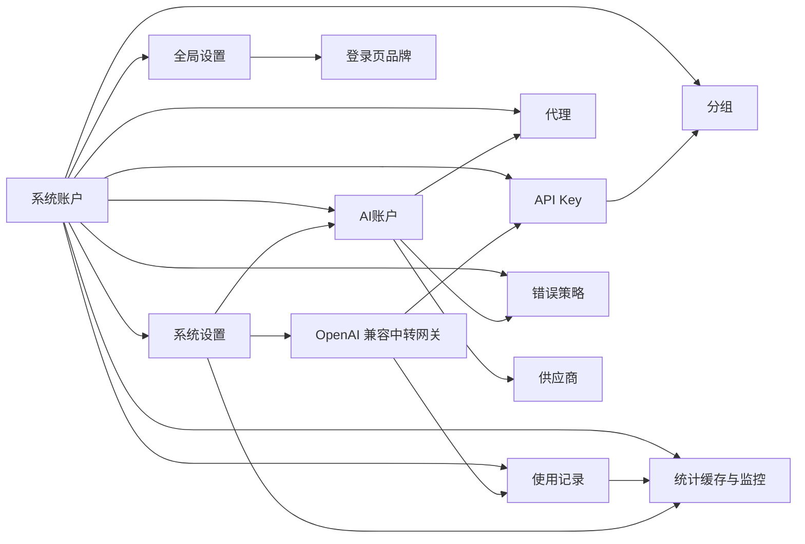

# 整体架构设计

## 产品目标

`juhe-ai` 要做成一个轻量、易扩展的中转管理系统。整体模块先设计完整，但每期只落必要能力，避免一开始就变成重型系统。

## 技术架构

- 前端：Vue 3 + TypeScript + Ant Design Vue
- 后端：Node.js + TypeScript
- API 风格：REST 优先，后续需要实时状态时再补 WebSocket 或 SSE
- 对外中转协议：统一兼容 OpenAI `/v1` 协议；客户端 Base URL 使用本服务的 `/v1` 地址，API Key 使用本地网关密钥
- 存储：SQLite，适合单人自用、低复杂度、低运维成本的场景
- 敏感字段：OAuth token、上游 API Key、本地网关 API Key 加密存储；账户列表不展示上游凭据，编辑弹窗可查看和修改完整凭据；API Key 管理页仍完整展示本地网关 Key 方便自用复制

## 访问控制

- 系统登录账号称为 `系统账户`，负责后台登录、角色控制和数据隔离。
- 第一阶段只保留两种角色：`admin` 和 `user`。
- 默认初始化一个 `admin/admin` 账号，登录成功后对初始密码状态做一次消息提醒。
- `admin` 可以查看全部系统账户、全部业务数据、全部使用记录和全部系统级配置。
- `user` 只能访问自己名下的数据，看不到其他系统账户的归属维度，也不能进入 `系统账户管理`。
- 所有业务数据都必须按 `system_account_id` 做作用域隔离，后端写入和查询都以登录态为准，前端不传系统账户归属字段。
- 登录态建议使用服务端会话加 `HttpOnly Cookie`，便于后续封禁、改角色和强制下线。

## 设置分层

- `global_settings`：平台全局配置，未登录也需要读取，只允许 `admin` 修改。
- `system_settings`：系统账户自己的配置，按 `system_account_id` 隔离，登录后读取和修改。
- 登录页品牌、站点名称、登录文案和视觉主题属于全局配置，不参与用户级隔离。
- 网关调度相关的默认值、偏好和运行参数属于用户级系统设置。

## 模块总览

## 核心关系

- 系统账户是登录和隔离边界，业务数据默认都归属某个系统账户。
- `admin` 可以看所有系统账户的数据；`user` 只能看自己的数据。
- 登录接口需要携带一次性图形验证码，验证码只用于未登录登录防护，不作为业务数据隔离维度。
- 登录防护需要同时按客户端 IP 和用户名记录失败尝试；短时间失败过多时临时限制该 IP 或锁定该用户名。
- 登录页品牌和平台级文案由全局设置控制，只有管理员能改。
- 供应商定义账户创建方式，例如 OpenAI 支持 OAuth 和 API Key；对外请求协议仍统一收敛为 OpenAI 兼容协议。
- 账户属于某个供应商，并选择一种账户类型。
- AI 账户属于某个系统账户，并选择一种账户类型；管理员视角列表需要额外显示系统账户维度，用户视角不显示该列。
- 分组归属于一个供应商；账户主动选择归属分组，分组汇总同供应商账户并代表一组可调度资源。
- API Key 绑定分组，请求进入后只能使用该分组内的账户。
- 代理独立管理，账户按需绑定代理。
- 账号级错误处理策略也按系统账户隔离；AI 账户创建和编辑时只可选择本系统账户内可见的规则。
- 使用记录记录 API Key、分组、账户、接口、供应商、模型、状态、IP、首 token、总耗时和错误；上游请求每一次尝试都会记录，包含重试过程中的失败，并冗余 `system_account_id` 便于隔离查询。
- 使用记录是事实源，统计缓存按 `system_account_id` 分区并由后台定时任务增量汇总，列表页和图表页不直接实时扫描 `usage_records`。
- 全局设置只保存登录页和平台级展示信息；系统设置保存系统账户自己的默认值和运行偏好，不直接替代账号级配置。
- 流熔断只作用于流式响应异常：首包前请求超时、超过空闲超时没有新数据或流被异常中断时，按账号累计失败并临时不可调用。

## SQLite 存储策略

这个项目当前只给个人使用，不需要追求极限并发和分布式能力，所以 SQLite 是默认存储方案。

设计原则：

- 数据库文件默认放在 `backend/data/juhe-ai.sqlite3`
- 运行配置读取项目内 `backend/.env`；数据库文件可通过 `JUHE_AI_DATABASE_PATH` 指定，推荐使用项目内相对路径，不依赖系统环境变量
- 使用 WAL 模式提升本地读写体验
- 不引入复杂 ORM，先用简单 repository 封装 SQL
- 敏感字段加密后存储；自用后台接口按页面需要返回完整密钥
- 后续如果真要迁移 PostgreSQL，只替换 repository 层

当前表：

- `providers`
- `system_accounts`
- `sessions`
- `global_settings`
- `accounts`
- `groups`
- `group_accounts`
- `api_keys`
- `proxy_profiles`
- `error_policies`
- `usage_records`
- `account_usage_snapshots`
- `system_settings`

其中 `accounts`、`groups`、`group_accounts`、`api_keys`、`proxy_profiles`、`error_policies`、`usage_records`、`account_usage_snapshots`、`system_settings` 都需要按 `system_account_id` 隔离；`providers` 和 `global_settings` 维持全局共享。统计缓存表也属于业务数据缓存，必须冗余 `system_account_id` 并按登录态过滤；系统 CPU / 内存这类主机级监控属于全局运维数据，默认仅管理员可见。

统计缓存建议新增：

- `usage_stats_totals`
- `usage_stats_daily`
- `usage_stats_hourly`
- `usage_model_daily`
- `usage_error_daily`
- `system_metrics_samples`
- `system_metrics_hourly`
- `stats_job_state`

## 供应商管理

供应商不是简单字符串，而是能力定义。不同供应商可以有不同的账户创建方式、字段 schema 和测试逻辑。

建议字段：

- `id`：供应商 ID
- `code`：稳定编码，例如 `openai`
- `name`：展示名称
- `enabled`：是否启用
- `base_url`：供应商默认上游地址，例如 OpenAI 固定为 `https://api.openai.com/v1`，不放入系统设置
- `account_types`：支持的账户类型定义
- `capabilities`：支持的能力，例如 responses、chat、models、stream
- `created_at` / `updated_at`

第一期内置：

- `openai`：支持 `oauth` 和 `api_key`

供应商模型目录：

- 模型价格应归属于供应商，而不是散落在网关代码里。
- 第一阶段内置 OpenAI 模型价格快照，字段采用 LiteLLM / `model-price-repo` 的语义，token 单价以 USD/token 存储，接口展示时换算为 USD/1M tokens。
- 供应商页提供“查看模型”入口，展示模型版本、输入/输出/缓存读写/图片价格、上下文窗口和能力标签。
- 网关成本估算复用供应商模型目录；未命中模型时只记录 token，不猜测成本。

## 系统账户管理

系统账户是后台登录账号，负责权限控制和数据隔离。

建议字段：

- `id`
- `username`
- `display_name`
- `password_hash`
- `role`：第一阶段仅 `admin` / `user`
- `status`：`active`、`disabled`
- `must_change_password`
- `last_login_at`
- `created_at` / `updated_at`

系统账户管理页主要给 `admin` 使用，用来查看、创建、停用、重置密码和分配角色。

登录验证码使用后端生成的短时挑战：前端先请求验证码图片和 `captchaId`，登录时提交 `captchaId` 与用户输入；后端无论校验成功或失败都消费该挑战，过期挑战自动失效。第一阶段先使用单进程内存存储，不落 SQLite；后续如果做多实例部署，再替换为共享存储。

登录失败防护采用轻量滑动窗口：同一客户端 IP 在 10 分钟内登录失败 10 次会临时限制 15 分钟；同一用户名在 10 分钟内密码错误 5 次会临时锁定 15 分钟。验证码错误不计入密码错误次数，但会消耗验证码；密码错误会同时计入 IP 和用户名维度；登录成功后清理该 IP 和用户名的失败记录。

## AI账户管理

AI 账户是上游凭据和调度配置的承载对象，归属某个系统账户。

建议字段：

- `id`
- `system_account_id`
- `provider_code`：供应商稳定编码，例如 `openai`
- `name`
- `type`：`oauth` 或 `api_key`
- `status`：`active`、`disabled`、`error`、`rate_limited`、`temporary_unavailable`
- `credentials`：加密后的凭据内容
- `credential_mask`：兼容保留字段；列表不展示凭据，编辑弹窗可展示完整凭据
- `proxy_profile_id`
- `concurrency_limit`
- `current_concurrency`：运行态字段，不建议直接持久化为主状态
- `passthrough_enabled`
- `error_policy_id`
- `priority`
- `schedulable`
- `notes`
- `last_used_at`
- `cooldown_until`：账号临时冷却截止时间；未来时间内不参与调度
- `last_error_message`：最近一次熔断、临时不可调用或失败原因摘要
- `stream_failure_count`：流失败窗口内累计次数
- `stream_failure_window_started_at`：流失败统计窗口起始时间
- `created_at` / `updated_at`

账户列表第一期展示：账户名称、账户类型、供应商、并发数、状态、用量情况、优先级、最近使用时间、操作。管理员视角额外展示 `系统账户` 列；用户视角不展示该列。账号优先级按数字从小到大生效，`0` 优先于 `10`；同分组调度时先尝试优先级更高的账号，当前账号失败或进入冷却后再切换到下一个可用账号。`Access/API Key` 与 `Refresh Token` 不在列表展示，只在编辑弹窗里查看和修改；`Refresh Token` 只对 OAuth 账户有意义。状态语义统一为：正常、停用、错误、限流中、临时不可调用。

OpenAI OAuth 账户还有上游 Codex/ChatGPT 使用窗口限制，不能和 OpenAI API Key 的本地 token / 成本用量混为一类。账户列表的“用量情况”应分两层展示：本地网关统计从统计缓存读取，事实源仍是 `usage_records`，用于请求数、token、成本；OAuth 专属额度进度来自上游返回的 Codex rate-limit 快照，用独立进度条展示 `5h` 与 `7d` 窗口百分比、预计恢复时间和快照更新时间。该进度只表示上游 OAuth 额度占用，不参与 API Key 计费口径。

OpenAI OAuth 额度快照建议单独存储为非敏感运行态，不写进 `credentials`。第一阶段采用 `account_usage_snapshots` 这类轻量表或等价 repository 对象，按 `system_account_id + account_id + kind` 保存 `openai_codex` 快照：原始 primary/secondary header、归一化后的 `codex_5h_*` / `codex_7d_*` 字段、`reset_at`、`window_minutes`、`updated_at`、`source`、`last_attempt_at`、`last_success_at`、`next_refresh_after`、`refresh_status` 和 `last_error_message`。列表接口只返回可展示摘要，不返回 access token、refresh token 或完整请求内容。

账户创建入口保持统一：页面只提供“添加 AI 账户”，弹窗内先选择供应商，再按供应商能力展示账户类型，最后渐进展开具体配置。第一期 OpenAI 支持 `oauth` 与 `api_key` 两种类型；后续 Claude Code、Gemini 等供应商只扩展供应商定义和对应创建表单，不再新增外部入口按钮。

账号级错误处理通过 `credentials.error_handling_rules` 保存为账户内嵌规则；新建和编辑账户都在弹窗内维护规则列表。网关不会把未命中的上游错误透传给客户端：未命中账号规则时，当前账号会临时不可调用并切换到同分组内下一个可用账号。列表不额外展示规则明细，避免挤占用户关心的状态、并发、用量和最近使用时间。

OpenAI OAuth 建议凭据：

- `access_token`
- `refresh_token`
- `expires_at`
- `account_id`

OpenAI API Key 建议凭据：

- `api_key`
- `base_url`

## 分组

分组是调度和授权边界。账户主动选择归属分组，API Key 绑定分组。系统账户创建时后端会同步创建一个 `默认 OpenAI 分组`，用于新用户开箱即用选择 OpenAI 账户和 API Key 的归属边界。

建议字段：

- `id`
- `system_account_id`
- `name`
- `provider_code`：分组所属供应商，默认 `openai`；只允许同一供应商的账户归入该分组
- `description`
- `enabled`
- `account_count`
- `created_at` / `updated_at`

关系表：

- `group_account.group_id`
- `group_account.account_id`
- `group_account.weight`
- `group_account.enabled`

调度顺序以账号 `priority` 升序为主；`group_account.weight` 只作为同优先级下的辅助排序字段。

第一阶段建议：

- 一个账户主动归属到零个或一个分组；调整入口在账户创建 / 编辑表单中
- 每个系统账户默认拥有一个 OpenAI 分组；新建系统账户时同步创建，旧数据通过启动迁移补齐一次
- 一个分组可以汇总多个同供应商账户
- 一个分组只汇总同一 `provider_code` 下的账户，列表只展示数量与聚合状态，不展开账户名称
- 一个 API Key 先绑定一个分组

## API Key 管理

API Key 是对外访问入口，不直接绑定账户，而是绑定分组。

建议字段：

- `id`
- `system_account_id`
- `name`
- `key_hash`
- `key_prefix`
- `status`
- `group_id`
- `expires_at`
- `rate_limit`
- `quota_limit`
- `scopes`
- `last_used_at`
- `created_at` / `updated_at`

注意：

- 明文 API Key 只在创建时返回一次。
- 列表和详情直接展示完整密钥，便于单人自用场景复制和排查。

## 代理管理

代理独立于账户，账户只引用代理配置。

建议字段：

- `id`
- `system_account_id`
- `name`
- `type`：`http`、`https`、`socks5`
- `host`
- `port`
- `username`
- `password_encrypted`
- `enabled`
- `test_status`
- `last_tested_at`
- `created_at` / `updated_at`

## 使用记录

使用记录用于排查、统计和后续计费。网关每次实际发起上游请求都写入一条记录，重试失败、切换账号失败和最终成功都会分别保留。

建议字段：

- `id`
- `system_account_id`
- `request_id`
- `api_key_id`
- `group_id`
- `account_id`
- `endpoint`
- `provider_id`
- `model`
- `stream`
- `status_code`
- `success`
- `client_ip`
- `first_token_ms`
- `duration_ms`
- `input_tokens`
- `output_tokens`
- `cache_read_tokens`
- `cost_usd`
- `error_code`
- `error_message`
- `request_snapshot_json`：失败请求的客户端请求快照
- `response_snapshot_json`：失败请求的网关返回与最后一次上游响应快照
- `created_at`

第一阶段网关已写入请求记录，并从 OpenAI 响应里的 `usage.input_tokens`、`usage.output_tokens`、`usage.input_tokens_details.cached_tokens` 统计 token。使用记录会保存 `METHOD /v1/path` 形式的接口，便于区分 `/v1/models` 这类成功但没有模型和 token 用量的请求。成本统计复用供应商模型目录里的 OpenAI 价格快照做轻量 1:1 估算；未覆盖的模型先只记录 token，不强行猜价格。使用记录接口会派生输入成本、输出成本、输入单价、输出单价、缓存读取成本、账户计费和固定 1x 倍率，用于前端悬浮明细展示，不额外写入数据库。管理员视角可按 `system_account_id` 查看全部记录并显示归属列，用户视角只看自己的记录且不显示归属列。失败记录额外保存请求/响应快照，便于在使用记录页查看当时的请求体、响应体和最后一次上游错误。

## 统计缓存与运维监控

统计层的目标是把“高频读、低频写”的指标提前聚合好，避免列表页和图表页每次都回扫 `usage_records`。`usage_records` 继续作为事实源，后台 worker 按 `system_account_id` 分区和游标增量汇总到缓存表；列表、概览和图表只读缓存。

建议的缓存分层：

- `usage_stats_totals`：按 `system_account_id + scope_type + scope_id` 存累计值，覆盖 `system_account`、`provider`、`group`、`account`、`api_key`、`model`、`endpoint`。
- `usage_stats_daily`：按 `system_account_id + scope_type + scope_id + stat_date` 存天级业务概览，用于今日、昨日和最近 7 天。
- `usage_stats_hourly`：按 `system_account_id + scope_type + scope_id + stat_hour` 存小时趋势，用于近 24 小时和近 7 天。
- `usage_model_daily`：按 `system_account_id + stat_date + model` 聚合请求数、token 和成本，用于模型分布。
- `usage_error_daily`：按 `system_account_id + stat_date + error_group + error_code` 聚合错误，用于错误情况。
- `system_metrics_samples`：主机级运维采样，记录 CPU、内存、RSS、Heap、事件循环延迟、网络入站/出站吞吐、网卡累计收发、数据库大小和统计滞后，默认仅管理员可见。
- `system_metrics_hourly`：把主机采样值做小时级平均、最大值和最小值，供监控图长期查看。
- `stats_job_state`：按 `scope_type + scope_id + job_name` 记录任务游标、上次成功时间、上次错误和处理滞后；用户业务汇总使用 `scope_type = system_account`，主机监控使用 `scope_type = global`。

隔离规则：

- 用户侧统计 API 必须带登录态隐式过滤 `system_account_id`，前端不传归属字段。
- 管理员按系统账户筛选时读取对应 `system_account_id` 的缓存；查看全局汇总时聚合多个系统账户的缓存行，不回扫 `usage_records`。
- 系统账户删除或停用时，应同步停止对应后台任务；删除时级联清理该账户的统计缓存、OAuth 额度快照和任务状态。
- 主机级 CPU / 内存 / 数据库大小不属于用户业务数据，默认只在管理员运维视角展示。

常用指标建议统一这样算：

- 今日请求 = `request_count`
- 平均响应时间 = `duration_ms_sum / request_count`
- 平均首 token 时间 = `first_token_ms_sum / success_count`
- 今日 Token = `input_tokens + output_tokens + cache_read_tokens`
- 模型分布 = 按模型维度的请求数、Token 占比和成本占比
- 错误情况 = `error_rate`、`error_count`、Top 错误分组和 Top 错误码
- 系统监控 = CPU、内存、RSS、Heap、事件循环延迟、数据库文件大小、统计滞后

字段层面建议如下：

- 统计总表至少保存 `system_account_id`、`scope_type`、`scope_id`、`request_count`、`success_count`、`error_count`、`input_tokens`、`output_tokens`、`cache_read_tokens`、`total_cost`、`duration_ms_sum`、`first_token_ms_sum`、`last_used_at`、`last_error_at`、`distinct_client_count`。
- 模型分布表至少保存 `system_account_id`、`model`、`request_count`、`input_tokens`、`output_tokens`、`cache_read_tokens`、`total_cost`。
- 错误分布表至少保存 `system_account_id`、`error_group`、`error_code`、`request_count`、`error_count`。
- 系统采样表至少保存 `cpu_percent`、`memory_used_percent`、`memory_total_bytes`、`memory_free_bytes`、`process_rss_bytes`、`process_heap_used_bytes`、`process_heap_total_bytes`、`event_loop_lag_ms`、`db_file_bytes`、`stats_lag_seconds`。

汇总和保留建议：

- 统计 worker 每 1 分钟按系统账户增量汇总新增 `usage_records`。
- 系统采样每 10 到 30 秒写一次，只写全局主机采样。
- 小时级缓存保留 14 天，日级缓存保留 180 天，总表长期保留，系统采样保留 7 到 14 天。
- 以后如果要做更重的监控图，再把 `system_metrics_samples` 再下沉成更长周期的 rollup，不影响业务统计结构。

### OpenAI OAuth 额度刷新策略

OpenAI OAuth 额度进度不提供用户主动“刷新用量”入口，也不在 AI 账户列表批量即时探测。系统统一通过真实请求的响应头和后台定时器维护快照。

刷新来源优先级：

1. OAuth 账户创建成功后的首次快照刷新，避免新建后长时间等待后台任务。
2. 网关真实转发时被动读取 Codex rate-limit 响应头并保存快照。
3. 账户测试如果真实请求返回了相同响应头，可以作为副作用更新快照，但测试按钮不承担“刷新用量”语义。
4. 后台 `oauth_usage_snapshot_refresh` 定时器按系统账户轮询缺失、过期或接近恢复点的 OAuth 快照。

后台刷新规则：

- worker 按 `system_account_id` 分批处理，仅选择 `provider_code = openai`、`type = oauth`、未停用且仍可调度的账户。
- 每个系统账户内限制并发为 1，全局限制较小并发，并加随机抖动，避免启动时集中探测。
- 快照未过期时不探测；账号处于限流冷却时，`next_refresh_after` 不早于 reset 时间。
- 探测前如果 OAuth access token 即将过期，先用 `refresh_token` 自动刷新授权并写回账户。
- 探测失败写入 `last_error_message`、`last_attempt_at` 和退避后的 `next_refresh_after`，不影响列表读取旧快照。
- 遇到 OAuth 429 时，优先用 Codex header 计算命中的窗口恢复时间；header 不足时再读取响应体里的 `resets_at` / `resets_in_seconds`，并把账号标记为 `rate_limited` 到该时间。

UI 规则：

- AI 账户列表只展示缓存快照、快照更新时间、刷新状态和下次后台刷新时间。
- “更多”菜单不提供“刷新用量”按钮；OAuth 授权刷新也不作为常驻按钮，授权续期由网关请求和后台维护自动完成。
- 快照缺失或过期时显示“等待后台刷新”或“暂无快照”，不要触发前端即时请求。

## 错误处理策略

错误处理策略以账号为主，参考 `sub2api` 的账号内嵌规则：账户创建和编辑时把规则列表保存到 `credentials.error_handling_rules`。系统不提供默认错误处理策略；账号规则未命中的上游错误统一触发当前账号临时不可调用并切换账号重试。

账号规则字段：

- 匹配条件：`status_codes`、`error_codes`、`error_types`、`keywords`，配置多个字段时必须同时命中。
- 排序与开关：`enabled`、`priority`、`name`、`description`。
- 处理动作只保留三种：`rate_limited`（限流）、`temp_unschedulable`（临时不可调用）、`error_disabled`（错误）。
- 限流恢复：`reset_strategy` 支持 `duration`、`daily`、`weekly`，并保留 `duration_hours`、`daily_reset_hour`、`weekly_reset_day`、`weekly_reset_hour`、`reset_timezone`。

动作语义：`rate_limited` 会把账号置为限流中并按恢复策略自动恢复；`temp_unschedulable` 会写入临时不可调用；只有显式配置 `error_disabled` 才会把账号置为错误。

## 系统设置

平台设置和系统账户设置分层管理。

### 全局设置

- `global_settings` 保存登录页品牌、站点名称、登录文案和视觉主题等平台级配置。
- 全局设置未登录也需要读取，只允许 `admin` 修改。

### 系统设置

- `system_settings` 按 `system_account_id` 隔离，保存当前系统账户自己的默认值和运行偏好。
- 用户级设置不直接替代账号级明确配置。

建议配置：

- 默认上游请求超时
- 默认账号并发上限
- 默认临时不可调用时长
- 默认代理策略
- API Key 自动生成规则（内部固定，不在系统设置暴露）
- 自用后台完整密钥展示规则
- 日志保留天数
- 统计 worker 间隔、系统采样间隔和聚合数据保留天数
- OAuth 用量快照后台刷新间隔、快照过期时间、失败退避和刷新并发
- 统计滞后告警阈值，用于运维概览提示缓存是否落后

### 流熔断与账号处理

轻量版参考 `sub2api` 的流超时处理语义，但不引入复杂运行时调度器。当前实现完全基于 SQLite 字段和请求时判断：

- `defaultTemporaryUnschedulableMinutes`：默认 `5` 分钟。未知异常、策略冷却和流熔断都使用这个全局时长。
- `temporaryUnschedulableRetryIntervalSeconds`：默认 `3` 秒。进入临时不可调用前会按这个间隔短暂重试。
- `temporaryUnschedulableRetryAttempts`：默认 `3` 次。超过次数后才标记为临时不可调用。
- `streamCircuitBreakerEnabled`：默认 `true`。启用后累计流式空闲/中断失败。
- `streamRequestTimeoutSeconds`：默认 `180` 秒。流式请求在首个数据块到来前超过该时间，强制切换账号重发。
- `streamIdleTimeoutSeconds`：默认 `30` 秒。流式响应在首个数据块后超过该时间没有新数据，记录一次失败。
- `streamFailureThresholdCount`：默认 `3` 次。
- `streamFailureThresholdWindowMinutes`：默认 `10` 分钟。

处理方式：

- 流熔断达到阈值后一律写入 `accounts.status = 'temporary_unavailable'` 并设置冷却截止时间；首包前请求熔断会先切换账号重发，冷却结束后会自动恢复为正常。
- 未被账户错误处理策略截获的上游非成功响应，会立即把当前账号写入 `defaultTemporaryUnschedulableMinutes` 的临时不可调用状态，并切换到下一个可用账号重试，不把上游错误返回给客户端。
- 未知请求异常会先按 `temporaryUnschedulableRetryIntervalSeconds` 与 `temporaryUnschedulableRetryAttempts` 做短暂重试，仍失败后才进入 `defaultTemporaryUnschedulableMinutes` 的临时不可调用状态并切换账号。
- 命中错误策略里的 `rate_limited` 会标记为限流中；命中 `error_disabled` 才会显式标记为错误。
- 网关请求成功后会清理该账号的失败计数、冷却时间和最近错误，并恢复为正常。
- 账户列表展示五态状态、冷却截止时间和错误摘要；完整 token 仍只在编辑弹窗中查看。

## 中转协议与流程

对外只暴露 OpenAI 兼容的 `/v1/*` 网关入口。开发环境默认 Base URL 是 `http://127.0.0.1:3000/v1`，常用路径包括 `/v1/models`、`/v1/responses` 和 `/v1/chat/completions`。后续新增提供方时，也优先把上游差异适配到 OpenAI 兼容格式，不在客户端侧暴露各厂商私有协议。

当前轻量中转请求链路是：

1. 校验 API Key
2. 找到 API Key 绑定的分组
3. 获取分组内可调度账户
4. 按状态、并发、代理、错误冷却等规则选账号
5. 按供应商和账户类型构造上游请求
6. 根据账号错误策略处理上游响应；未命中则临时不可调用当前账号并切换账号
7. 写入使用记录

## OpenAI OAuth 授权设计

- OAuth 手动授权：生成 PKCE 授权链接，用户复制 localhost 回调 URL，后端校验 `state` 后换取 token。
- Refresh Token 授权：用户粘贴 `refresh_token`，后端刷新后创建 OAuth 账户。
- OAuth 凭据字段：`access_token`、`refresh_token`、`expires_at`、`client_id`、`email`、`base_url`。
- 网关调度：同一分组内可混合 API Key 账户和 OAuth 账户，OAuth 账户使用 `access_token` 透传到上游。
- 自动刷新：OAuth `expires_at` 接近过期时，用 `refresh_token` 刷新并写回 SQLite。

