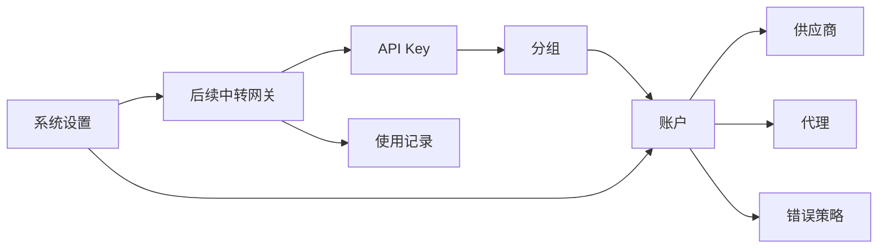

# 整体架构设计

## 产品目标

`sub2api-lite` 要做成一个轻量、易扩展的中转管理系统。整体模块先设计完整，但每期只落必要能力，避免一开始就变成重型系统。

## 技术架构

- 前端：Vue 3 + TypeScript + Ant Design Vue
- 后端：Node.js + TypeScript
- API 风格：REST 优先，后续需要实时状态时再补 WebSocket 或 SSE
- 存储：SQLite，适合单人自用、低复杂度、低运维成本的场景
- 敏感字段：OAuth token、上游 API Key、本地网关 API Key 加密存储；账户列表不展示上游凭据，编辑弹窗可查看和修改完整凭据；API Key 管理页仍完整展示本地网关 Key 方便自用复制

## 模块总览

## 核心关系

- 供应商定义账户创建方式，例如 OpenAI 支持 OAuth 和 API Key。
- 账户属于某个供应商，并选择一种账户类型。
- 分组归属于一个供应商并绑定该供应商下的多个账户，代表一组可调度资源。
- API Key 绑定分组，请求进入后只能使用该分组内的账户。
- 代理独立管理，账户按需绑定代理。
- 使用记录记录 API Key、分组、账户、供应商、模型、状态、耗时和错误。
- 系统设置保存全局默认值，不直接替代账号级配置。
- 流熔断只作用于流式响应异常：超过空闲超时没有新数据或流被异常中断时，按账号累计失败并临时不可调用。

## SQLite 存储策略

这个项目当前只给个人使用，不需要追求极限并发和分布式能力，所以 SQLite 是默认存储方案。

设计原则：

- 数据库文件默认放在 `backend/data/sub2api-lite.sqlite3`
- 可通过 `SQLITE_PATH` 或 `DATABASE_PATH` 指定数据库文件
- 使用 WAL 模式提升本地读写体验
- 不引入复杂 ORM，先用简单 repository 封装 SQL
- 敏感字段加密后存储；自用后台接口按页面需要返回完整密钥
- 后续如果真要迁移 PostgreSQL，只替换 repository 层

当前表：

- `providers`
- `accounts`
- `groups`
- `group_accounts`
- `api_keys`
- `proxy_profiles`
- `error_policies`
- `usage_records`
- `system_settings`

## 供应商管理

供应商不是简单字符串，而是能力定义。不同供应商可以有不同的账户创建方式、字段 schema 和测试逻辑。

建议字段：

- `id`：供应商 ID
- `code`：稳定编码，例如 `openai`
- `name`：展示名称
- `enabled`：是否启用
- `base_url`：默认上游地址
- `account_types`：支持的账户类型定义
- `capabilities`：支持的能力，例如 responses、chat、models、stream
- `created_at` / `updated_at`

第一期内置：

- `openai`：支持 `oauth` 和 `api_key`

供应商模型目录：

- 模型价格应归属于供应商，而不是散落在网关代码里。
- 第一阶段内置 OpenAI 模型价格快照，字段采用 LiteLLM / `model-price-repo` 的语义，token 单价以 USD/token 存储，接口展示时换算为 USD/1M tokens。
- 供应商页提供“查看模型”入口，展示模型版本、输入/输出/缓存读写/图片价格、上下文窗口和能力标签。
- 网关成本估算复用供应商模型目录；未命中模型时只记录 token，不猜测成本。

## 账户管理

账户是上游凭据和调度配置的承载对象。

建议字段：

- `id`
- `provider_code`：供应商稳定编码，例如 `openai`
- `name`
- `type`：`oauth` 或 `api_key`
- `status`：`active`、`disabled`、`error`
- `credentials`：加密后的凭据内容
- `credential_mask`：兼容保留字段；列表不展示凭据，编辑弹窗可展示完整凭据
- `proxy_profile_id`
- `concurrency_limit`
- `current_concurrency`：运行态字段，不建议直接持久化为主状态
- `passthrough_enabled`
- `error_policy_id`
- `priority`
- `schedulable`
- `notes`
- `last_used_at`
- `cooldown_until`：账号临时冷却截止时间；未来时间内不参与调度
- `last_error_message`：最近一次熔断、临时不可调用或失败原因摘要
- `stream_failure_count`：流失败窗口内累计次数
- `stream_failure_window_started_at`：流失败统计窗口起始时间
- `created_at` / `updated_at`

账户列表第一期展示：账户名称、账户类型、供应商、并发数、状态、用量情况、优先级、最近使用时间、操作。`Access/API Key` 与 `Refresh Token` 不在列表展示，只在编辑弹窗里查看和修改；`Refresh Token` 只对 OAuth 账户有意义。

账户创建入口保持统一：页面只提供“添加账户”，弹窗内先选择供应商，再按供应商能力展示账户类型，最后渐进展开具体配置。第一期 OpenAI 支持 `oauth` 与 `api_key` 两种类型；后续 Claude Code、Gemini 等供应商只扩展供应商定义和对应创建表单，不再新增外部入口按钮。

账号级错误处理通过 `error_policy_id` 引用策略；新建账号默认使用系统设置 `defaultErrorPolicyId`，编辑弹窗可改成指定策略或清空后回到运行时默认。列表不额外展示策略，避免挤占用户关心的状态、并发、用量和最近使用时间。

OpenAI OAuth 建议凭据：

- `access_token`
- `refresh_token`
- `expires_at`
- `account_id`
- `organization_id`

OpenAI API Key 建议凭据：

- `api_key`
- `base_url`
- `organization_id`

## 分组

分组是调度和授权边界。分组绑定账户，API Key 绑定分组。

建议字段：

- `id`
- `name`
- `provider_code`：分组所属供应商，默认 `openai`；只允许绑定同一供应商的账户
- `description`
- `enabled`
- `account_count`
- `created_at` / `updated_at`

关系表：

- `group_account.group_id`
- `group_account.account_id`
- `group_account.weight`
- `group_account.enabled`

第一阶段建议：

- 一个账户可以加入多个分组
- 一个分组可以绑定多个账户
- 一个分组只绑定同一 `provider_code` 下的账户，列表只展示数量与聚合状态，不展开账户名称
- 一个 API Key 先绑定一个分组

## API Key 管理

API Key 是对外访问入口，不直接绑定账户，而是绑定分组。

建议字段：

- `id`
- `name`
- `key_hash`
- `key_prefix`
- `status`
- `group_id`
- `expires_at`
- `rate_limit`
- `quota_limit`
- `scopes`
- `last_used_at`
- `created_at` / `updated_at`

注意：

- 明文 API Key 只在创建时返回一次。
- 列表和详情直接展示完整密钥，便于单人自用场景复制和排查。

## 代理管理

代理独立于账户，账户只引用代理配置。

建议字段：

- `id`
- `name`
- `type`：`http`、`https`、`socks5`
- `host`
- `port`
- `username`
- `password_encrypted`
- `enabled`
- `test_status`
- `last_tested_at`
- `created_at` / `updated_at`

## 使用记录

使用记录用于排查、统计和后续计费。

建议字段：

- `id`
- `request_id`
- `api_key_id`
- `group_id`
- `account_id`
- `provider_id`
- `model`
- `stream`
- `status_code`
- `success`
- `duration_ms`
- `input_tokens`
- `output_tokens`
- `cache_read_tokens`
- `cost_usd`
- `error_code`
- `error_message`
- `created_at`

第一阶段网关已写入请求记录，并从 OpenAI 响应里的 `usage.input_tokens`、`usage.output_tokens`、`usage.input_tokens_details.cached_tokens` 统计 token。成本统计复用供应商模型目录里的 OpenAI 价格快照做轻量 1:1 估算；未覆盖的模型先只记录 token，不强行猜价格。

## 错误处理策略

错误处理策略是账号调度和上游错误返回的轻量规则集合，参考 `sub2api` 的“透传 / 自定义错误 / 临时不可调度”语义，但第一阶段只保留可验证的必要动作。

当前内置策略：

- `ep_default_passthrough`：默认透传策略，命中 `4xx/5xx` 后把上游状态码和响应体原样返回，便于排查真实错误。
- `ep_default_safe`：默认安全策略，命中 `4xx/5xx` 后返回本地自定义 `502` 与 `Upstream request failed`，避免把上游细节直接暴露给客户端。

策略规则字段保持 JSON 扩展：`match.statusCode` 支持 `4xx/5xx`、具体状态码和范围；可继续扩展 `keywords`、`error_codes`、`error_types`、`priority`。当前网关已支持动作 `passthrough`、`custom_error`、`retry_next`、`temp_unschedulable/rate_limited/overloaded`（冷却账号）和 `error_disabled`（标记错误并停调度）。

## 系统设置

系统设置只放全局默认值，不要覆盖账号级明确配置。

建议配置：

- 默认上游请求超时
- 默认账号并发上限
- 默认错误处理策略
- 默认临时不可调用时长
- 默认代理策略
- API Key 自动生成规则（内部固定，不在系统设置暴露）
- 自用后台完整密钥展示规则
- 日志保留天数

### 流熔断与账号处理

轻量版参考 `sub2api` 的流超时处理语义，但不引入复杂运行时调度器。当前实现完全基于 SQLite 字段和请求时判断：

- `defaultTemporaryUnschedulableMinutes`：默认 `5` 分钟。未知异常、策略冷却和流熔断都使用这个全局时长。
- `streamCircuitBreakerEnabled`：默认 `true`。启用后累计流式空闲/中断失败。
- `streamIdleTimeoutSeconds`：默认 `180` 秒。流式响应超过该时间没有新数据，记录一次失败。
- `streamFailureThresholdCount`：默认 `3` 次。
- `streamFailureThresholdWindowMinutes`：默认 `10` 分钟。

处理方式：

- 流熔断达到阈值后一律写入 `accounts.cooldown_until`，账号状态保持不变，只在冷却截止前不参与调度。
- 未被账户错误处理策略截获的未知异常，也会按 `defaultTemporaryUnschedulableMinutes` 临时不可调用。
- 网关请求成功后会清理该账号的失败计数、冷却时间和最近错误。
- 账户列表展示状态、冷却截止时间和错误摘要；完整 token 仍只在编辑弹窗中查看。

## 后续中转流程

后续真正接中转时，请求链路建议是：

1. 校验 API Key
2. 找到 API Key 绑定的分组
3. 获取分组内可调度账户
4. 按状态、并发、代理、错误冷却等规则选账号
5. 按供应商和账户类型构造上游请求
6. 根据错误策略处理上游响应
7. 写入使用记录

## OpenAI OAuth 授权设计

- OAuth 手动授权：生成 PKCE 授权链接，用户复制 localhost 回调 URL，后端校验 `state` 后换取 token。
- Refresh Token 授权：用户粘贴 `refresh_token`，后端刷新后创建 OAuth 账户。
- OAuth 凭据字段：`access_token`、`refresh_token`、`expires_at`、`client_id`、`email`、`organization_id`、`base_url`。
- 网关调度：同一分组内可混合 API Key 账户和 OAuth 账户，OAuth 账户使用 `access_token` 透传到上游。
- 自动刷新：OAuth `expires_at` 接近过期时，用 `refresh_token` 刷新并写回 SQLite。
