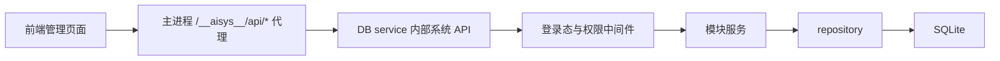
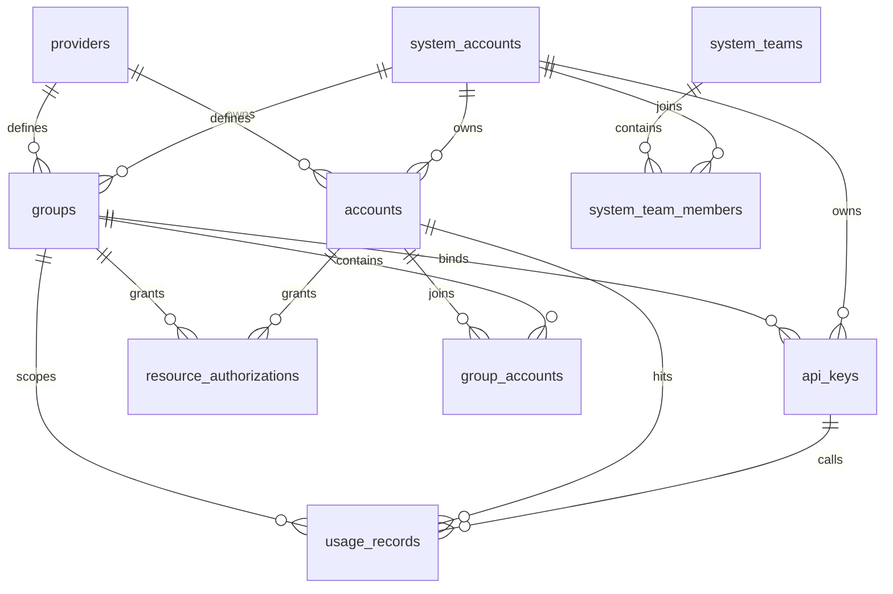

# 后端架构设计

> 面向后端实现、数据库维护和 AI 维护者。
> 本文是后端架构入口，负责说明后端职责边界、目录规划、数据库设计原则和变更落点；具体业务字段、默认参数、专题调研和运行验证仍以功能文档、计划文档和开发文档为准。

## 1. 文件定位

- 本文回答这些问题：
  - 后端整体按什么边界分层
  - 新接口、服务、脚本和存储逻辑应该放在哪里
  - SQLite 数据库如何分区、如何演进、如何处理敏感字段
  - 后端变更前应优先阅读哪些文档
- 本文不替代具体业务架构和阶段计划：
  - [../架构总览.md](../架构总览.md)
  - [../../functions/OpenAI账号接入.md](../../functions/OpenAI账号接入.md)
  - [../../functions/SQLite存储说明.md](../../functions/SQLite存储说明.md)
  - [后台任务使用说明](后台任务使用说明.md)
  - [开发运行说明](../../develop/运行说明.md)
  - [开发测试与验证说明](../../develop/测试与验证说明.md)

## 2. 后端范围

- 后端是 `juhe-ai` 的管理 API、OpenAI 兼容中转网关、账号调度、凭据处理、使用记录、原始审计日志、统计聚合和后台任务承载层。
- 当前后端已覆盖 OpenAI 供应商、系统账户、系统团队、统一授权、AI 账户、分组、API Key、代理、使用记录、原始审计日志、统计缓存、系统设置、后台 worker、DB service 和 OpenAI OAuth/API Key 账号接入闭环。
- 后端只暴露两类入口：系统管理面 `/__aisys__/api/*` 和 OpenAI 兼容网关 `/*` / `/v1/*`；客户端不直接访问上游账号凭据。
- 后端是业务事实源；前端不传系统账户归属字段，不自行决定数据隔离、调度状态或敏感字段展示。

## 3. 技术边界

- 运行时：官方 Node.js LTS，当前支持 `22.x >= 22.13.0` 或 `24.x >= 24.11.0`，且内置 `node:sqlite` 必须可用。
- 语言：`TypeScript`，ESM 模块。
- Web 框架：`Express`。
- 存储：Node 内置 `node:sqlite`，默认按业务库 `backend/data/juhe-ai.sqlite3`、统计数据集库 `backend/data/juhe-ai-dataset.sqlite3` 和统计结果库 `backend/data/juhe-ai-stats.sqlite3` 三个 SQLite 文件运行，不再保留旧记录库回退路径。`usage_records` 分片写入是下一阶段存储边界，启用后数据集库会扩展为目录库加多个 usage shard 文件。
- 配置：后端进程环境变量优先，`backend/.env` 兜底；相对路径按 `backend/` 目录解析。
- 网关协议：对外兼容 OpenAI 根路径和 `/v1/*` 入口，当前只启用 OpenAI 供应商适配。
- 校验：写接口和关键业务入口必须在后端做参数校验；前端表单校验只改善体验。

## 4. 目录规划

| 目录 / 文件 | 职责 | 变更规则 |
| --- | --- | --- |
| `backend/src/server.ts` | Web/API/网关主进程启动、全局中间件、健康检查、系统 API 反向代理、网关挂载、前端静态资源兜底 | 只放应用装配、DB service / worker 看护和请求入口，不沉淀复杂业务逻辑，不直接执行后台任务 |
| `backend/src/config/` | 运行配置读取、路径解析和默认配置 | 新增环境变量时同步 `.env.example`、开发和部署文档 |
| `backend/src/domain/` | 后端对外返回和跨模块共享的领域类型 | 新增或修改 API 结构时同步前端类型和文档 |
| `backend/src/modules/` | 按业务模块组织 routes 和 service | routes 负责 HTTP 边界，service 负责业务副作用和外部请求 |
| `backend/src/modules/gateway/` | OpenAI 兼容中转、账号选择、错误策略、SSE 透传和用量解析 | 不把网关细节泄漏成前端多套复杂选项 |
| `backend/src/modules/background/` | 统计聚合、系统采样、账号质量缓存、冷却账号复测、运行日志索引、审计批量落库和数据清理等后台任务 | 任务注册和执行只允许在独立 background worker 进程内发生，不引入重型分布式队列；新增或调整任务先看 [后台任务使用说明](后台任务使用说明.md) |
| `backend/src/modules/db-service/` | DB service 进程、内部系统 API app、HTTP 代理、IPC 操作和 supervisor | 系统管理 API 与高频 SQLite 读写只在 DB service 或 worker 内执行，主 Web 进程不能回退同步访问 SQLite |
| `backend/src/storage/` | SQLite 连接、当前 schema、seed、repository、加解密 | 所有数据库读写从这里收口，避免 routes 直接写 SQL |
| `backend/src/shared/` | 通用响应、跨模块小工具 | 只放稳定复用能力，不堆业务逻辑 |
| `backend/src/scripts/maintenance/` | 生产或上线可用维护脚本；Mockdata 统一承接可复用本地造数能力 | 发布包统一调用 `backend/dist/scripts/maintenance/*.js`，脚本必须说明会改哪些数据；本地演示、联调、烟测 fallback 和压测夹具等可复用造数都收口到 `mockdata.ts` / `mockdata-fixtures.ts` |
| `backend/src/scripts/regression/` | 本地回归脚本 | 只通过 `pnpm test:*` 调用，不作为生产运维入口 |
| `backend/src/scripts/smoke/` | 真实链路烟测脚本 | 用于发布前验证，不承担迁移或维护职责 |
| `backend/src/types/` | 第三方或运行时类型补充 | 只补缺失类型，不放业务模型 |

### 4.1 模块目录约定

- 新模块默认放在 `backend/src/modules/<module-name>/`。
- 管理 API 路由命名为 `<module-name>.routes.ts`。
- 有外部请求、调度、副作用或复杂规则时拆出 `<module-name>.service.ts`。
- 同一业务对象的数据库访问优先复用 `backend/src/storage/repositories.ts`；当文件继续膨胀到难以维护时，再按“大文件重构指南”拆分 repository，不提前拆出多套并行访问层。
- 模块不要绕过 `auth.middleware.ts` 和 `request-context.ts` 自行信任前端传入的系统账户归属。

### 4.2 当前模块落点

| 模块 | 后端落点 | 说明 |
| --- | --- | --- |
| 登录与系统账户 | `modules/auth/`、`modules/system-accounts/` | 登录、会话、验证码、失败防护和系统账户管理 |
| 供应商 | `modules/providers/` | 当前内置并启用 OpenAI 供应商 |
| AI 账户 | `modules/accounts/` | 账号 CRUD、账号测试、凭据展示边界和调度属性 |
| OpenAI OAuth | `modules/openai-oauth/` | PKCE、refresh token 创建账户和 token 刷新；额度快照由网关响应头被动写入 |
| 分组 | `modules/groups/` | 分组 CRUD、账号绑定、分组授权 |
| API Key | `modules/api-keys/` | 本地网关密钥创建、展示、状态和分组绑定 |
| 代理 | `modules/proxies/` | 服务器级代理配置和账号绑定资源 |
| 错误策略 | `modules/error-policies/`、`modules/gateway/account-error-policy.service.ts` | 账号级错误匹配、冷却、异常标记和切换动作 |
| 使用记录 | `modules/usage-records/` | 请求事实记录查询和快照展示 |
| 原始审计日志 | `modules/audit-logs/` | 审计查询、内存队列、终态入队和批量落库 |
| 统计与监控 | `modules/stats/`、`modules/background/` | 统计缓存读取、增量聚合和系统指标采样 |
| 设置 | `modules/settings/` | 全局设置和系统账户级设置读写 |
| 网关 | `modules/gateway/openai-gateway.routes.ts` | `/*` / `/v1/*` 入口、账号调度、运行态并发占用、上游转发、使用记录写入和审计上下文捕获 |

## 5. 请求分层

### 5.1 管理 API

- 未登录只允许访问登录、公开设置和健康检查等明确入口。
- `/__aisys__/api/*` 由主 Web 进程流式代理到 DB service 内部系统 API；主进程不解析管理 API JSON body，不直接导入管理路由或 repository。
- DB service 内部系统 API 默认先经过 `requireAuth`；供应商、代理、统计和需要管理员权限的接口再叠加 `requireAdmin`。
- 同一 router 如果同时承载管理列表和登录用户可用的轻量辅助接口，不要把 `requireAdmin` 直接挂在整段 mount 上，应把管理员校验下沉到具体管理路由。例如供应商列表需要管理员权限，但供应商模型目录用于普通用户账户表单，必须允许登录用户读取。
- 新增普通用户可见页面调用的接口时，必须在 `backend/src/scripts/regression/scope-boundary-regression.ts` 补普通用户可访问断言；新增 `my-*` 命名空间下仍属于管理员能力的例外时，也要补普通用户 403 断言，避免前端误暴露后才发现。
- routes 层负责解析参数、返回统一响应和 HTTP 状态；业务规则和副作用放到 service 或 repository。
- repository 必须根据当前登录态或显式访问作用域过滤数据，避免普通用户读写其他系统账户资源。
- 管理 API 响应、分页筛选、错误语义和权限摘要见 [接口契约与权限矩阵](../../functions/接口契约与权限矩阵.md)。

### 5.2 网关 API

- 网关入口不使用后台登录态，而使用本地 API Key 作为调用方身份。
- 本地 API Key 校验先按 `key_hash` 命中进程内短 TTL 缓存；命中会刷新空闲 TTL，但最多 5 分钟必须重新查库。禁用、删除、修改 API Key 会主动清理对应缓存。
- API Key 只能访问绑定分组；绑定授权分组时，使用记录必须保留调用方、资源所有者和授权关系。
- 账号选择必须过滤停用、异常、冷却中、账号套餐到期、授权失效和分组未绑定的账号。
- 上游认证由后端替换；客户端提交的上游敏感头不应直接透传。
- 流式响应需要稳定转发 SSE，并在超时、中断和上游异常时按错误策略或默认冷却规则处理。
- 原始审计日志只允许在网关内维护内存捕获上下文，必须等请求结束、失败或客户端中断后终态入队；网关请求链路不能同步写审计表。
- SSE 和其他流式响应不能按 chunk 实时写库，必须在流自然结束、失败、超时或客户端断开后，以终态记录进入审计队列。
- 网关错误保持 OpenAI 兼容结构；网关日志、请求快照、原始审计日志和敏感头处理见 [安全与日志策略](../../functions/安全与日志策略.md) 与 [原始审计日志设计](../../functions/原始审计日志设计.md)。

## 6. 数据库设计

### 6.1 存储原则

- SQLite 是当前唯一持久化存储；不引入 Redis、ClickHouse 或独立任务队列。
- 运行时必须明确区分业务库、统计数据集库和统计结果库：业务库保存系统账户、AI 账户、分组、API Key、授权、设置和公告等可恢复业务数据；统计数据集库保存使用记录、审计、操作日志、运行日志索引和模型检测等事实数据；统计结果库保存统计缓存、额度窗口、账号质量缓存、系统监控、表监控历史和 `stats_job_state`。
- `usage_records` 是请求计量事实源；统计表只做读优化和图表缓存，不替代事实记录。分片落地后，后端仍从统一 repository 入口读写使用记录，routes 和前端不感知 shard 文件。
- `audit_logs`、`audit_log_attempts`、`audit_payload_refs`、`audit_payload_blobs` 和 `audit_error_groups` 是原始审计日志存储，不参与用量统计；写入必须经过内存队列和后台批量落库。
- 日志、审计 payload、导入导出文件和所有可能频繁读取的大文件都必须按 offset / cursor / stream / 分块窗口读取；禁止在运行路径中把完整文件读入内存后再切割、搜索、分页或追增量。
- 持续追新增内容的文件读取必须持久化游标和文件标识，worker 重启后从游标继续；按行处理时只在完整行落地后推进 offset，轮转、截断或文件标识变化时显式重置。
- 启动时通过 `applyBusinessSchema()`、`applyDatasetSchema()` 和 `applyStatsSchema()` 创建当前版本需要的表和索引；旧 `applyRecordSchema()` 已删除。
- 启动时通过 `seedDefaults()` 写入默认管理员、OpenAI 供应商、默认 OpenAI 分组、全局设置和系统设置。
- 新字段必须明确默认值、可空性、展示边界、数据清洗策略和是否需要索引。
- 当前项目未正式上线，本地 SQLite 可以备份后直接清洗或重建；源码只保留当前完整 schema、repository 和 API 逻辑。
- 禁止在后端启动、repository、routes 或前端页面里长期保留一次性迁移、旧数据兼容、临时同步修复、临时表改名或迁移标记代码。
- 需要处理本地旧库时，使用直接 SQL 或临时离线脚本完成；脚本不得接入正常请求路径或启动路径，完成后不作为长期源码保留。
- 正式上线后如需支持用户升级，另开计划设计版本化 schema 演进机制，不能把预上线清库规则和上线升级逻辑混在一起。

### 6.2 表分区

| 分区 | 表 | 作用 |
| --- | --- | --- |
| 登录与权限 | `system_accounts`、`system_sessions` | 后台账号、角色、状态、密码哈希和登录会话 |
| 设置 | `global_settings`、`system_settings` | 平台公开设置和系统账户级运行偏好 |
| 供应商与资源 | `providers`、`accounts`、`proxy_profiles`、`error_policies` | 上游供应商、AI 账户、代理和账号错误策略 |
| 团队、授权与分组 | `system_teams`、`system_team_members`、`resource_authorization_grants`、`resource_authorizations`、`resource_authorization_sources`、`groups`、`group_accounts` | 系统团队、团队成员、授权操作、最终用户授权、授权来源、分组和分组账号绑定 |
| 网关访问 | `api_keys` | 本地网关密钥、分组绑定、状态、过期和配额占位 |
| 请求事实 | `usage_records` | 每次网关尝试的请求、响应、用量、错误和授权归属快照 |
| 原始审计 | `audit_logs`、`audit_log_attempts`、`audit_payload_refs`、`audit_payload_blobs`、`audit_error_groups` | 审计事件、上游尝试、payload 引用、压缩 blob 元数据和重复错误聚合 |
| 账号快照 | `account_usage_snapshots` | OpenAI OAuth / Codex 等账号额度快照和刷新状态 |
| 业务统计 | `usage_stats_minute`、`usage_stats_hourly`、`usage_stats_daily`、`usage_stats_weekly`、`usage_stats_monthly`、`usage_stats_totals`、`usage_model_*`、`usage_error_*`、`usage_latency_*`、`usage_rank_snapshots`、`usage_scope_range_windows`、`usage_quota_hourly_windows`、`usage_overview_summary_windows`、`usage_overview_trend_windows`、`usage_model_rank_windows`、`usage_error_rank_windows`、`ai_performance_summary_windows`、`group_account_stats` | 列表统计、趋势图、模型分布、错误聚合、耗时指标、TopN、额度窗口、范围快照和分组账户状态缓存 |
| 后台任务 | `stats_job_state` | 聚合游标、任务状态、统计滞后和错误信息 |
| 运维监控 | `system_metrics_samples`、`system_metrics_hourly`、`system_metrics_trend_windows` | CPU、内存、进程、事件循环、网络、数据库体积、统计滞后和监控窗口趋势 |

### 6.3 核心关系

- `system_account_id` 是业务数据隔离主线；普通用户只访问自己拥有或被授权使用的资源。
- `providers.code` 是供应商稳定标识；`accounts.provider_code` 和 `groups.provider_code` 以它作为逻辑归属。
- `groups` 是 API Key 的授权边界；`group_accounts` 保存分组与账号的多对多关系。
- `resource_authorizations` 统一记录账户 / 分组授权给系统账户 / 团队的使用权，不授予管理权，也不泄露凭据。
- `usage_records` 冗余账号所有者、分组所有者、统一授权 ID、授权对象类型和访问类型，便于真实资源总量、授权消耗统计和历史追溯。

### 6.4 敏感字段

| 数据 | 存储字段 | 处理规则 |
| --- | --- | --- |
| 系统账户密码 | `system_accounts.password_hash` | 只保存哈希，不可逆展示 |
| 登录会话 token | `system_sessions.token_hash` | 只保存哈希，客户端持有明文 token |
| 上游 API Key / OAuth token | `accounts.credentials_encrypted` | 加密存储，列表只展示掩码，编辑和测试按权限读取完整凭据 |
| 凭据去重指纹 | `accounts.credential_fingerprint` | 用哈希指纹辅助识别重复凭据，不替代密文 |
| 本地网关 API Key | `api_keys.key_hash`、`api_keys.key_secret_encrypted` | 校验用哈希，自用复制需要时按权限展示完整 key |
| 代理密码 | `proxy_profiles.password_encrypted` | 加密存储，列表不明文暴露 |
| 请求与响应快照 | `usage_records.request_snapshot_json`、`usage_records.response_snapshot_json` | 用于排查，必须避免额外写入不必要敏感头 |
| 原始审计 payload | `audit_payload_refs.headers_blob_id`、`audit_payload_refs.body_blob_id`、`audit_payload_blobs.storage_key` | payload 通过引用关联压缩 blob 文件，按原始 hash 精确去重；完整原文仅管理员可读 |

### 6.5 索引与查询

- 高频列表查询按 `system_account_id` 建索引，保证普通用户数据隔离查询不全表扫描。
- 使用记录按 `created_at`、`system_account_id + created_at` 和排序字段建索引，支撑分页、详情和统计游标。
- usage shard 启用后，热写索引只保留明细页、统计游标和常用筛选必需的组合；TopN、趋势、摘要和业务报表必须继续走统计结果库，不能通过给每个 shard 添加大量排序索引解决。
- 授权表按资源、所有者和被授权者建索引，支撑授权列表、撤销和网关调度过滤。
- 统计表按 `system_account_id + scope_type + scope_id + 时间桶` 查询，避免列表页实时扫描 `usage_records`。
- 业务统计、额度、趋势、TopN、摘要和授权报表只能读取 worker 写好的 staged / window / summary 行；如果需要新维度，先补后台增量 job 和索引，不在 API 请求里临时 `SUM/GROUP BY`。
- 新增索引前先确认查询路径和数据规模，避免为低频字段堆积无效索引。

### 6.6 Schema 演进

- 预上线阶段的 `backend/src/storage/schema.ts` 作为 schema 入口，`backend/src/storage/schema/` 下的拆分文件只描述当前完整结构：表、索引、默认约束和外键。
- 新表和索引可以使用 `CREATE ... IF NOT EXISTS` 保持重复启动安全，但不能夹带旧表、旧字段或临时对象处理分支。
- 不写 `ensureColumn()`、启动补列、迁移标记、旧字段适配、临时表改名、一次性清洗分支或“同步旧数据”逻辑到运行时代码。
- 本地库结构变化时，先备份业务库 `backend/data/juhe-ai.sqlite3` 和 `backend/.env`，再通过直接 SQL、临时离线脚本或重建库处理数据；统计数据集库和统计结果库默认不纳入业务备份，真实迁移或灾备快照才需要停机一并备份。
- 需要保留少量本地数据时，按当前模型导出、清洗、导入，不在源码里模拟多个历史版本。
- 正式上线前若要支持外部用户升级，必须先形成独立升级方案和验证计划，再调整本节规则。

## 7. 配置设计

- `JUHE_AI_HOST`：后端监听地址，默认 `127.0.0.1`。
- `JUHE_AI_PORT`：后端监听端口，默认 `3000`。
- `JUHE_AI_DATABASE_PATH`：SQLite 业务库路径，默认 `./data/juhe-ai.sqlite3`。
- `JUHE_AI_DATASET_DATABASE_PATH`：统计数据集库路径，默认 `./data/juhe-ai-dataset.sqlite3`。
- `JUHE_AI_STATS_DATABASE_PATH`：统计结果库路径，默认 `./data/juhe-ai-stats.sqlite3`。
- `JUHE_AI_USAGE_SHARD_ROOT`：usage shard 根目录，分片启用后使用，默认建议 `./data/dataset/usage`。
- `JUHE_AI_USAGE_SHARD_COUNT`：usage shard 数量，分片启用后使用，生产启用后不能直接改小。
- `JUHE_AI_SECRET`：本地敏感数据加密和签名相关密钥，复用旧数据库时必须保持稳定。
- `JUHE_AI_OAUTH_PROXY_URL`：OpenAI OAuth 相关请求可选代理。
- `JUHE_AI_BACKEND_URL`、`JUHE_AI_SMOKE_ACCOUNT_NAME`、`JUHE_AI_SMOKE_MODEL`、`JUHE_AI_SMOKE_PROMPT`：烟测配置。

配置规则：

- 默认从 `backend/.env` 读取，不要求用户设置系统环境变量；同名进程环境变量可临时覆盖 `.env`，用于容器、托管平台、隔离烟测和一次性排障。
- 相对路径按 `backend/` 解析，便于发布包整体迁移。
- 新增配置必须同步 `backend/.env.example`、`docs/develop/` 和 `docs/deploy/` 相关说明。
- 不把供应商密钥、OAuth token、代理密码等敏感业务凭据放进 `.env`；这些应通过后台写入数据库密文字段。

## 8. 后台任务

- 后台任务必须由独立 background worker 进程注册和执行，主 Web 进程不得直接调用 `startBackgroundJobs()` 或导入具体任务实现。
- 新增或调整后台定时任务、worker IPC 消息、队列 flush 或 worker 生命周期时，先按 [后台任务使用说明](后台任务使用说明.md) 执行。
- 主 Web 进程只负责系统 API 代理、网关请求、静态资源和必要的 DB service / worker 启动看护；即使使用 cron 或调度框架，调度器也必须运行在 worker 进程内。
- 当前后台任务包括使用记录增量聚合、分组账户统计缓存刷新、授权到期扫描、系统指标采样、小时级指标聚合、OpenAI OAuth Access Token 保活、冷却账号复测、运行日志索引 flush、原始审计日志批量落库和统一表数据保留期清理。OpenAI OAuth 额度快照主动刷新已移除，改为真实请求或账户测试响应头被动更新。
- 任务状态通过 `stats_job_state` 和相关快照表记录，便于后台显示统计滞后与刷新失败。
- 请求链路产生的审计、运行日志索引或使用记录批量写入数据如需异步处理，应通过有界 IPC 或等价轻量通道投递到 worker；队列上限和丢弃策略不能反向阻塞网关请求。
- 原始审计日志队列是 best-effort 队列，不要求系统重启后恢复；队列溢出和进程重启允许丢失待落库审计记录，但必须不阻塞网关请求。
- 当前版本不引入复杂分布式锁；如果后续支持多实例部署，再评估共享锁、任务归属和幂等边界。
- 后台任务失败应记录错误并等待下一轮重试；worker 崩溃不应导致管理 API 或网关主进程直接退出，主进程或进程管理器应按退避策略重启 worker。

## 9. 开发约束

- 新管理接口：先确认模块归属，再补 route、repository、领域类型、前端 API 和文档。
- 新网关能力：先确认是否改变 `/*` / `/v1/*` 客户端入口、OpenAI `/v1` 上游归一化、错误策略、调度规则或使用记录字段。
- 新审计能力：先确认是否改变原始审计采样、队列、终态入队、SSE 结束后入队或 payload 加密边界。
- 新数据库字段：先写清默认值、数据清洗方案、敏感边界和索引需求。
- 新接口契约或权限变化：先确认 [接口契约与权限矩阵](../../functions/接口契约与权限矩阵.md)。
- 新敏感字段、日志、快照或原始审计变化：先确认 [安全与日志策略](../../functions/安全与日志策略.md) 与 [原始审计日志设计](../../functions/原始审计日志设计.md)。
- 新增或修改错误返回、日志、脚本输出、使用记录错误摘要时，描述性文案必须使用中文；不要翻译 `API Key`、`OAuth`、`HTTP`、`SSE`、header、错误码、状态枚举、路由路径、SQL 常量、缓存 key、OpenAI 事件名或数据库字段值。
- 新外部请求：放在 service 层，支持超时、错误摘要和必要代理配置。
- 新大文件或频繁文件读取需求：必须先设计 offset / cursor / stream 读取方式和单次窗口上限，再落 repository 或 service。
- 新统计需求：优先从 `usage_records` 定义事实，再补后台 worker 增量聚合和预聚合表；禁止在请求路径实时扫明细表或缓存桶做业务汇总。
- 大文件继续膨胀时，按 [大文件重构指南](../大文件重构指南.md) 拆分，不在业务开发中顺手重构无关范围。

## 10. 修改入口

- 涉及后端目录、分层、数据库、脚本或接口时，先看本文和 [功能开发指导](../功能开发指导.md)。
- 涉及数据库表、字段、统计缓存、敏感字段或 schema 演进时，同时看 [SQLite 存储说明](../../functions/SQLite存储说明.md)。
- 涉及管理 API、网关接口、响应结构、错误语义、分页筛选或权限摘要时，同时看 [接口契约与权限矩阵](../../functions/接口契约与权限矩阵.md)。
- 涉及敏感字段、凭据展示、请求快照、原始审计日志、日志脱敏、数据保留或备份迁移时，同时看 [安全与日志策略](../../functions/安全与日志策略.md) 与 [原始审计日志设计](../../functions/原始审计日志设计.md)。
- 涉及 OpenAI OAuth、API Key 账户、上游请求或账号测试时，同时看 [OpenAI 账号接入](../../functions/OpenAI账号接入.md)。
- 涉及后台定时任务、worker IPC、队列 flush、统计聚合或批量清理时，同时看 [后台任务使用说明](后台任务使用说明.md)。
- 涉及透传、请求头、SSE、错误切换或网关行为时，同时看 [中转透传机制调研与定位修正](../../functions/中转透传机制调研与定位修正.md)。
- 涉及运行、联调和验证时，按 [开发运行说明](../../develop/运行说明.md) 和 [开发测试与验证说明](../../develop/测试与验证说明.md) 执行。
