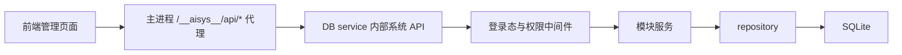
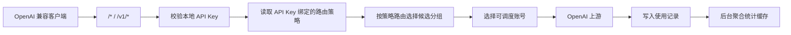
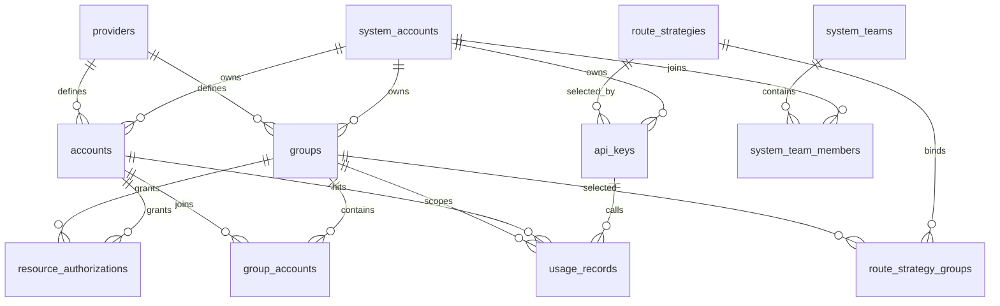

# 后端架构设计

> 面向后端实现、数据库维护和 AI 维护者。
> 本文是后端架构入口，负责说明后端职责边界、目录规划、数据库设计原则和变更落点；具体业务字段、默认参数、专题调研和运行验证仍以功能文档、计划文档和开发文档为准。

## 1. 文件定位

- 本文回答这些问题：
  - 后端整体按什么边界分层
  - 新接口、服务、脚本和存储逻辑应该放在哪里
  - SQLite 数据库如何分区、如何演进、如何处理敏感字段
  - 后端变更前应优先阅读哪些文档
- 本文不替代具体业务架构和阶段计划：
  - [../架构总览.md](../架构总览.md)
  - [../../functions/请求处理分层设计.md](../../functions/请求处理分层设计.md)
  - [../../functions/AI账户错误语义与状态变更边界.md](../../functions/AI账户错误语义与状态变更边界.md)
  - [../../functions/OpenAI账号接入.md](../../functions/OpenAI账号接入.md)
  - [../../functions/Anthropic账号接入.md](../../functions/Anthropic账号接入.md)
  - [../../functions/智谱GLM账号接入.md](../../functions/智谱GLM账号接入.md)
  - [../../functions/DeepSeek账号接入.md](../../functions/DeepSeek账号接入.md)
  - [../../functions/Gemini账号接入.md](../../functions/Gemini账号接入.md)
  - [../../functions/SQLite存储说明.md](../../functions/SQLite存储说明.md)
  - [../../functions/PostgreSQL与Redis高性能模式设计.md](../../functions/PostgreSQL与Redis高性能模式设计.md)
  - [../../functions/可靠统计与读写资源隔离设计.md](../../functions/可靠统计与读写资源隔离设计.md)
  - [../../functions/页面数据缓存与增量更新设计.md](../../functions/页面数据缓存与增量更新设计.md)（历史归档，机制已退场）
  - [../../functions/存储适配接口设计.md](../../functions/存储适配接口设计.md)
  - [../../functions/SQLite单写者写队列治理设计.md](../../functions/SQLite单写者写队列治理设计.md)
  - [后台任务使用说明](后台任务使用说明.md)
  - [后台 Worker 多角色拆分设计](后台Worker多角色拆分设计.md)
  - [AI 工具创建规范](AI工具创建规范.md)
  - [开发运行说明](../../develop/运行说明.md)
  - [开发测试与验证说明](../../develop/测试与验证说明.md)

## 2. 后端范围

- 后端是 `juhe-ai` 的管理 API、OpenAI 兼容中转网关、账号调度、凭据处理、使用记录、原始审计日志、统计聚合和后台任务承载层。
- Go 后端最终拆为三个可独立部署的项目：`gateway` 负责对外 API 和 AI 上游桥接，`jobs` 负责定时探活/复制/统计等周期任务，`maintenance` 负责一次性迁移/回填/诊断。边界、依赖方向和迁移顺序以 [Go 三项目架构基线](../../migration/Go三项目架构基线.md) 为准。
- 当前后端已覆盖 OpenAI-compatible 中转、系统账户、系统团队、统一授权、AI 账户、分组、API Key、代理、OAuth 2.1 / OIDC Provider、使用记录、原始审计日志、统计缓存、系统设置、后台 worker、DB service，以及 `openai`、`gpt`、`anthropic`、`deepseek`、`glm`、`gemini` 内置供应商闭环。供应商、协议和档案矩阵以 [架构总览](../架构总览.md) 与 [功能文档索引](../../functions/README.md) 为准，本文不重复维护展开事实。
- 后端只暴露两类入口：系统管理面 `/__aisys__/api/*` 和 OpenAI 兼容网关 `/*` / `/v1/*`；客户端不直接访问上游账号凭据。
- 后端是业务事实源；前端不传系统账户归属字段，不自行决定数据隔离、调度状态或敏感字段展示。

### 时间字段边界

- 绝对时间在 API、任务回执、内部事件和持久化层统一按 RFC3339 / ISO 瞬时值处理，输出使用 UTC `Z` 或明确数字 offset；后端不得为了页面展示把时间改写为 `Asia/Shanghai` 裸字符串。
- 所有绝对时间输入（包括历史请求或持久化值）都必须携带 `Z` 或明确数字 offset；无 offset 字符串一律拒绝，不提供兼容解析。Vue / 浏览器负责按用户本地时区展示。
- 排班、API Key / AI 账户可用时段、用量统计日界线和日期范围到期日属于业务日历，必须显式传递和校验 IANA timezone；绝对时间契约与业务日历契约不可互相替代。

## 3. 技术边界

- 运行时：当前实现使用官方 Node.js LTS，当前支持 `22.x >= 22.13.0` 或 `24.x >= 24.11.0`；standalone 模式需要内置 `node:sqlite` 可用，performance 模式不应在运行路径加载 SQLite。后续后端目标运行时是 Go，且 Go 必须同时支持 SQLite 与 PostgreSQL/Redis 两种正式模式；模式不决定 Go 是否可用。迁移规则见 [Go 渐进减法迁移目录](../../migration/README.md)、[完整功能接管与 Node 归档迁移规则](../../migration/完整功能接管与Node归档迁移规则.md)、[Go 技术选型与依赖基线](../../migration/Go技术选型与依赖基线.md)、[Go 迁移指标与观测规划](../../migration/Go迁移指标与观测规划.md) 和 [双模式存储目标（保留历史文件名）](../../migration/存储目标与SQLite移除.md)。迁移完成前，本文仍描述当前 Node 后端事实。
- 语言：`TypeScript`，ESM 模块。
- Web 框架：`Express`。
- 存储：默认 standalone 模式使用 Node 内置 `node:sqlite`，按业务库 `backend/data/juhe-ai.sqlite3`、数据集目录库 `backend/data/juhe-ai-dataset.sqlite3`、使用记录目录库 `backend/data/juhe-ai-usage-catalog.sqlite3`、统计结果库 `backend/data/juhe-ai-stats.sqlite3` 和 usage shard 文件运行；显式 performance 模式使用 PostgreSQL 保存事实域和统计域，使用 Redis 保存可丢弃缓存、短 TTL 运行态和 Redis Streams 队列。业务层必须通过 Store Port 访问存储，不能直接感知 SQLite / PostgreSQL / Redis。
- 页面数据：通用 `PageDataChangeStore`、confirm/revision、Redis publisher 和 dirty-domain recovery 已由 PLAN-20260722T123439000Z 删除。页面直接调用业务接口；repository/shared cache 与独立业务快照按各自功能维护。
- 写入边界：standalone 模式下同一个 SQLite 文件必须只有一个运行时写 owner；业务库写入归 DB service，数据集目录库写入归 ingest / log writer，统计结果库写入归 stats writer，usage shard 按 shard 文件串行写。performance 模式下不受 SQLite 文件级写锁限制，但仍必须受 PostgreSQL 连接池、事务范围、热点 key 顺序和 Redis Stream 背压约束。具体规则见 [SQLite 单写者写队列治理设计](../../functions/SQLite单写者写队列治理设计.md)、[PostgreSQL 与 Redis 高性能模式设计](../../functions/PostgreSQL与Redis高性能模式设计.md) 和 [存储适配接口设计](../../functions/存储适配接口设计.md)。
- F2 表存储监控是 Go `juhe-ai-jobs` 内的完整被动功能单元：它直接异步采样并写入专用 `JUHE_AI_TABLE_MONITOR_DATABASE_PATH`（SQLite）或 `juhe_stats`（PostgreSQL）；Node 只读 HTTP 查询，不再注册采样、快照写入或 retention。SQLite 监控库必须与业务、dataset、usage、stats 和 Codex shard 路径不同，Node 连接固定 query-only；该边界不是 Node/Go 开关，也不引入 Redis/Asynq/任务队列。
- 配置：后端进程环境变量优先，`backend/.env` 兜底；相对路径按 `backend/` 目录解析。
- 网关协议：对外兼容 OpenAI 根路径和 `/v1/*` 入口；`openai` 既可以是 `protocol_code`，也可以是通用 `provider_code`，必须通过字段层级区分。当前供应商协议档案不要在本文硬编码，新增或调整时同步 [核心功能设计](../../functions/核心功能设计.md) 和对应供应商接入文档。
- 校验：写接口和关键业务入口必须在后端做参数校验；前端表单校验只改善体验。

## 4. 目录规划

| 目录 / 文件 | 职责 | 变更规则 |
| --- | --- | --- |
| `backend/src/server.ts` | Web/API/网关主进程启动、全局中间件、健康检查、系统 API 反向代理、公开接口代理、网关挂载、前端静态资源兜底 | 只放应用装配、DB service / worker 看护和请求入口，不沉淀复杂业务逻辑，不直接执行后台任务 |
| `backend/src/modules/internal-api/` | 主进程与内部 worker/DB service 之间的受控桥接（例如账户健康检查触发） | 主进程只依赖内部桥接契约，不直接导入 `accounts` 等管理业务模块 |
| `backend/src/config/` | 运行配置读取、路径解析和默认配置 | 新增环境变量时同步 `.env.example`、开发和部署文档 |
| `backend/src/domain/` | 后端对外返回和跨模块共享的领域类型 | 新增或修改 API 结构时同步前端类型和文档 |
| `backend/src/modules/` | 按业务模块组织 routes 和 service | routes 负责 HTTP 边界，service 负责业务副作用和外部请求 |
| `backend/src/modules/gateway/` | OpenAI 兼容中转、请求侧入口保护、账号选择、上游请求准备、账户错误处理策略、SSE 透传和用量解析 | 请求进入上游前的新增处理先按 [请求处理分层设计](../../functions/请求处理分层设计.md) 判断落点；不把网关细节泄漏成前端多套复杂选项 |
| `backend/src/modules/background/` | worker 多角色调度、系统采样、append-only 写入、增量统计、重窗口快照、外部探测、维护清理和 IPC 队列隔离 | 任务注册和执行只允许在对应 worker 进程内发生，不引入重型分布式队列；新增或调整任务先看 [后台任务使用说明](后台任务使用说明.md) |
| `backend/src/modules/db-service/` | DB service 进程、内部系统 API app、HTTP 代理、IPC 操作和 supervisor | 系统管理 API 与网关关键存储操作通过 Store Port 执行；主 Web 进程不能回退同步访问 SQLite，也不能绕过 performance adapter 直接访问 PostgreSQL |
| `backend/src/storage/` | Store Port、SQLite / PostgreSQL adapter、memory / Redis cache、schema、seed、repository helper 和加解密 | 所有数据库、缓存、运行态和队列访问从这里收口；routes 和 service 不能直接写 SQL、拼 Redis key 或打开底层连接 |
| `backend/src/shared/` | 通用响应、跨模块小工具 | 只放稳定复用能力，不堆业务逻辑 |
| `backend/src/scripts/maintenance/` | 生产或上线可用维护脚本；Mockdata 统一承接可复用本地造数能力 | 发布包统一调用 `backend/dist/scripts/maintenance/*.js`，脚本必须说明会改哪些数据；本地演示、联调、烟测 fallback 和压测夹具等可复用造数都收口到 `mockdata.ts` 入口和 `mockdata/` 业务目录 |
| `backend/src/scripts/regression/` | 本地回归脚本 | 只通过 `pnpm test:*` 调用，不作为生产运维入口 |
| `backend/src/scripts/smoke/` | 真实链路烟测脚本 | 用于发布前验证，不承担 schema 迁移或历史结构维护职责 |
| `backend/src/types/` | 第三方或运行时类型补充 | 只补缺失类型，不放业务模型 |

### 4.1 模块目录约定

- 当前 Node 过渡期内必须维护的旧模块仍放在 `backend/src/modules/<module-name>/`；新增长期后端能力默认先按 [Go 渐进减法迁移目录](../../migration/README.md) 判断是否进入 Go 双模式完整功能实现，不再默认新增 Node 模块和 SQLite schema。
- 管理 API 路由命名为 `<module-name>.routes.ts`。
- 有外部请求、调度、副作用或复杂规则时拆出 `<module-name>.service.ts`。
- 当前 Node 过渡期内必须补齐的同一业务对象，存储访问优先定义业务语义 Store Port；长期 Go 目标同时实现 SQLite 与 PostgreSQL/Redis adapter，二者都是正式模式。SQLite 下必须保留 file owner 边界；完成 F3 的 Go 完整功能不能以 Node bridge 充当长期 writer。
- 模块不要绕过 `auth.middleware.ts` 和 `request-context.ts` 自行信任前端传入的系统账户归属。

### 4.2 存储适配边界

- 后端存储边界是 Store Port / Adapter，而不是 routes、service 或 DB service handler 内散落数据库 driver 分支。
- Go 迁移后的长期存储边界已经调整为 PostgreSQL + Redis 单模式；以下 SQLite / memory / standalone adapter 规则只描述当前 Node 过渡事实，不能作为新增 Go 模块的目标。
- routes 和 service 只能调用业务语义接口，例如系统账户、AI 账户、API Key、网关运行态、使用记录、审计日志、统计窗口、维护清理、共享缓存、运行态状态和队列 Port。
- SQLite、PostgreSQL、Redis、Redis Streams、SQL 方言、连接池、事务对象、Redis key 和 Stream consumer group 只允许出现在 adapter 或基础设施层。
- 新增长期 DB / cache / queue / job / system metrics / observability 能力时，先更新 [Go 技术选型与依赖基线](../../migration/Go技术选型与依赖基线.md)、[Go 迁移指标与观测规划](../../migration/Go迁移指标与观测规划.md)、[存储目标与 SQLite 移除](../../migration/存储目标与SQLite移除.md) 和必要功能文档，默认落到 Go + PostgreSQL + Redis。只有明确属于当前 Node 过渡期、且模块尚未迁移时，才允许补临时 Node adapter；这类例外必须写清删除条件，不能继续扩展 standalone / performance 双模式或 Node event-loop / DB service 指标作为长期目标。
- adapter 内部可以复用已有 repository helper，但不允许新业务绕过 Port 直接新增底层 repository 调用。

### 4.3 当前模块落点

| 模块 | 后端落点 | 说明 |
| --- | --- | --- |
| 登录与系统账户 | `modules/auth/`、`modules/system-accounts/` | 登录、会话、验证码、失败防护和系统账户管理 |
| 协议与供应商 | `modules/providers/` | 内置供应商、协议档案、模型目录和供应商 driver；当前矩阵以 `docs/functions/核心功能设计.md` 为准，`openai/v1` 属于协议层 |
| AI 账户 | `modules/accounts/` | 账号 CRUD、账号测试、凭据展示边界和调度属性 |
| OpenAI OAuth | `modules/openai-oauth/` | PKCE、refresh token 创建账户和 token 刷新；额度快照由网关响应头被动写入 |
| OAuth 模拟上游 E2E | `scripts/regression/provider-oauth-mock-upstream-e2e.ts` | 仅在本地回归中严格模拟 OpenAI、Anthropic、Gemini、Grok authorize/token 协议；设计见 [OAuth 模拟上游 E2E 设计](OAuth模拟上游E2E设计.md) |
| 分组 | `modules/groups/` | 分组 CRUD、账号绑定、分组授权 |
| API Key | `modules/api-keys/` | 本地网关密钥创建、展示、状态和路由策略绑定 |
| 代理 | `modules/proxies/` | 服务器级代理配置和账号绑定资源 |
| 账户错误处理策略 | `modules/accounts/account-error-policy-validation.ts`、`modules/gateway/policy/account-error-policy.service.ts` | 账户所有者 / 管理员显式配置的 `credentials.error_handling_rules` 校验；规则只在其声明的客户端、协议和请求范围内匹配，可以覆盖 `generic_*` 的安全推理请求。命中后按 provenance / generation / CAS 直接执行用户配置的状态动作；`retry_next` 仍受请求重放安全门禁，不能让已派发副作用请求再次执行 |
| 使用记录 | `modules/usage-records/` | 请求事实记录查询和快照展示 |
| 原始审计日志 | `modules/audit-logs/` | 审计捕获与查询适配；终态输入一次签名提交 Go F3，Go 是持久化、读取和保留 owner |
| 操作日志 | `modules/operation-logs/` | 管理业务提交后的上下文/脱敏适配；切换前实现由 Node 一次签名提交 Go F4，Go 负责持久化、读取和保留，生产 owner 切换须按 F4 契约执行 |
| 统计与监控 | `modules/stats/`、`modules/background/` | 统计缓存读取、增量聚合和系统指标采样 |
| 设置 | `modules/settings/` | 全局设置和系统账户级设置读写 |
| 网关 | `modules/gateway/routes.ts` | `/*` / `/v1/*` 入口、账号调度、运行态并发占用、上游转发、使用记录写入和审计上下文捕获 |

## 5. 请求分层

### 5.1 管理 API

- 未登录只允许访问登录、公开设置和健康检查等明确入口。
- `/__aisys__/api/*` 和 `/__aipublic__/*` 由主 Web 进程流式代理到 DB service 内部系统 API；主进程不解析管理 / 公开系统 API JSON body，不直接导入管理路由或 repository。代理层只做流式转发，并保留最大 in-flight 请求数和内部超时，避免慢 DB service 把主进程 socket 无限堆积。
- 独立 public-api 进程方案已评估但暂不实施，见 [公开接口独立进程设计](../../functions/公开接口独立进程设计.md) 和 `PLAN-0036`；当前仍以上述 DB service 代理描述为准。
- DB service 内部系统 API 默认先经过 `requireAuth`；供应商管理、代理管理 CRUD / 检测、统计和需要管理员权限的接口再叠加 `requireAdmin`，代理 options 作为登录用户可用的全局选择项不叠加管理员权限。
- 账号测试、模型检测和代理检测都会发起外部网络探测。账号测试使用后台 worker 的独立任务模型：管理 API 只提交任务和 session，执行进入 `JUHE_AI_CONCURRENCY_GLOBAL_MAX` 进程级共享池，排队时间不计入 60 秒运行超时。模型检测和仍由 Node owner 的诊断任务继续共享 DB service 诊断任务 in-flight 上限；J3a 代理延迟检测已由 Go `juhe-ai-jobs` 独占周期、手动管理、投影和 `proxy_profiles` 写回，入口路由直接指向 Go jobs 管理 listener，Node 不保留 adapter、writer、fallback 或 Node 诊断闸门。超过 Node 诊断上限的任务直接返回 `503` 和 `Retry-After`，不在 DB service 事件循环内排队等待。
  - 活动账号测试取消以 worker IPC + 本地 `AbortController` 为即时信号；管理 API 仍先把 `cancel_requested` 写入数据库，再转发 cancel IPC。
  - claim / complete / fail 使用 `status` 与 `cancel_requested` 条件状态转换；取消与完成/失败竞态由 SQLite 与 PostgreSQL repository 在稀有失败分支收口，数据库保持跨进程重启后的最终权威。
  - 正常任务执行路径不得为每个阶段轮询 `is_account_test_task_cancel_requested` 或 `read_account_test_task_cancel_message`，也不得通过提高 DB service timeout、PostgreSQL 连接数或账号测试并发来掩盖积压。
- 同一 router 如果同时承载管理列表和登录用户可用的轻量辅助接口，不要把 `requireAdmin` 直接挂在整段 mount 上，应把管理员校验下沉到具体管理路由。例如供应商列表需要管理员权限，但供应商模型目录用于普通用户账户表单、代理 options 用于普通用户账户代理下拉，必须允许登录用户读取。
- 新增普通用户可见页面调用的接口时，必须在 `backend/src/scripts/regression/scope-boundary-regression.ts` 补普通用户可访问断言；新增 `my-*` 命名空间下仍属于管理员能力的例外时，也要补普通用户 403 断言，避免前端误暴露后才发现。
- routes 层负责解析参数、返回统一响应和 HTTP 状态；业务规则和副作用放到 service 或 repository。
- repository 必须根据当前登录态或显式访问作用域过滤数据，避免普通用户读写其他系统账户资源。
- 管理 API 响应、分页筛选、错误语义和权限摘要见 [接口契约与权限矩阵](../../functions/接口契约与权限矩阵.md)。

### 5.2 网关 API

- 网关入口不使用后台登录态，而使用本地 API Key 作为调用方身份。
- 请求进入上游前的代码必须按 [请求处理分层设计](../../functions/请求处理分层设计.md) 拆分：入口装配、认证前运行态、请求体保护、请求上下文、授权与本地校验、协议与客户端画像、候选账号筛选、调度运行态、派发保护和上游请求准备分别维护；上游返回后的响应转发、响应语义检查、usage 解析和账号响应侧副作用不写进请求 preflight。
- 本地 API Key 校验先按 `key_hash` 命中进程内短 TTL 缓存；命中会刷新空闲 TTL，但最多 5 分钟必须重新查库。禁用、删除、修改 API Key 会主动清理对应缓存。
- API Key 只绑定一条路由策略；路由策略可以绑定并访问调用方自己的一个或多个分组，也可以绑定有效授权给调用方的分组。被授权 AI 账户需要先加入调用方自有分组后再参与自有分组调度，授权分组则按有效分组授权直接参与调度。当前 API Key 模型不保存分组绑定字段。
- 模型列表是固定本地响应，不进入账号调度。普通 `/models` 和 `/v1/models` 默认返回 OpenAI-compatible `object=list + data`；`/v1beta/models` 或明确 Gemini 信号返回 Gemini 原生形态，明确 Anthropic 信号返回 Anthropic 原生形态，单独的 `/models` 路径本身不能推断为 Gemini。
- 模型列表必须先通过 API Key 认证，再读取认证主体可见的供应商目录；未认证请求不得回退公开聚合目录。认证模型列表和 AI 问答从 API Key 路由策略全部 active 分组绑定收集 `provider_code`，并以 Key 所属系统账户读取个人模型。显式空供应商集合返回空列表。网关不按发布时间过滤，`default/codex`、`chat_list:*`、`chat_model:*` 最终发布快照及其预热、重建链路均已退场。
- 账号选择必须过滤停用、异常、冷却中、账号套餐到期、授权失效和分组未绑定的账号。
- 上游认证由后端替换；客户端提交的上游敏感头不应直接透传。
- 流式响应需要稳定转发 SSE。完整 HTTP / SSE 的状态码、错误码、类型和正文只作诊断或用户显式策略输入；普通请求不能直接执行“默认冷却规则”。真实 gateway 上游失败每个请求最多投递一个按账户去重限频的固定模型、固定协议独立健康检查；该二次确认失败按专用阈值 1 只写通用 `temporary_unavailable`，周期健康仍按配置阈值抗抖，不得按状态码或正文派生具体语义；transport 电路仍只接受匹配来源的未完成 transport 独立证据。
- 原始审计日志只允许在网关内维护内存捕获上下文，必须等请求结束、失败或客户端中断后终态作一次签名 RPC 提交 Go F3；网关请求链路不能同步写审计表，也不能恢复 Node queue。
- SSE 和其他流式响应不能按 chunk 实时写库，必须在流自然结束、失败、超时或客户端断开后，以单条终态记录直接提交 F3；该 RPC 失败只记录该条失败，不能终止 listener 或阻塞客户端响应。
- 网关错误保持 OpenAI 兼容结构；网关日志、请求快照、原始审计日志和敏感头处理见 [安全与日志策略](../../functions/安全与日志策略.md) 与 [原始审计日志设计](../../functions/原始审计日志设计.md)。

客户端一次请求从进入网关到返回响应的性能边界：

- 主 Web/网关进程只做内存级保护、运行时快照读取、候选过滤、上游转发、响应透传和异步副作用投递；不得在 server 角色直接同步读取或写入 SQLite。
- API Key 校验、系统账户状态、路由策略分组绑定、分组访问元数据、候选账号和网关设置先命中网关运行时缓存；已加载运行态使用短 TTL 软过期和较长内存保留，软过期后当前请求继续使用内存快照并触发后台刷新，返回前必须在内存中过滤已过期的 API Key、分组授权、账号授权和账号。完全冷 miss 只能通过 DB service 读取，不能回退到本进程 repository。同一个无效 Bearer token 的认证失败结果需要短 TTL 负缓存，避免在来源熔断阈值前把重复坏 token 放大成重复 DB service 请求。IP 封禁策略请求路径只读 server 内存快照和来源级短 TTL 决策缓存，不能按单个 IP 查询 DB service。server 到 DB service 的 IPC pending 请求和 HTTP 代理 in-flight 请求必须有上限，达到上限时快速返回本地不可用或繁忙错误，不能让慢 DB service 把 Web 进程 Promise、socket 和 IPC 消息无限堆积。
- API Key 额度和统一授权额度先查本进程短 TTL 决策缓存；决策缓存 miss 只读取 background worker 被动推送到 server 内存的额度快照，worker 负责按分页窗口构建完整快照。请求链路不能主动通过 DB service 查询统计额度窗口，也不能扫描 `usage_records`、usage shard、审计表或授权明细后现场汇总；快照尚未生成或失效时按现有轻微超额口径短时放行，快照生成后不能因为固定容量截断遗漏启用额度的对象。
- OAuth Access Token 请求前懒刷新是正确性兜底，只允许在命中已选 OAuth 账号且 token 缺失 / 临期时发生；同账号刷新在进程内串行，成功后写入短 TTL 最近刷新缓存，后续同一波请求复用新凭据，不能把每个并发请求都放大成重复的 DB service 重读和写回。OAuth token endpoint 响应体必须有固定字节上限，超限主动中断，不能在刷新路径无界累积 chunk 或拼接完整异常响应。
- 来源熔断、IP 级账号回避、会话亲和、账号当前并发、高并发分组短队列、本地账号短期屏蔽和上游桶避让都是进程内易失运行态，不落库、不跨分组共享分组级队列，也不能变成阻塞数据库查询。
- 大 JSON 请求体解析和 OAuth/Codex 请求体归一化可进入 worker thread，避免阻塞事件循环；解析结果只服务本次请求，不写业务库。
- 使用记录和账号状态副作用必须异步投递到 `ingest-worker`、`stats-worker`、`ops-worker` 或 DB service；J3a 代理延迟检测是 Go owner 例外，由 `juhe-ai-jobs` 直接执行和写回，Node 不提供等价 writer/fallback。J3a 的 Go 管理 handler 在 PostgreSQL 中通过 F4 兼容的受控 append DTO 直接记录操作日志，以避免 Go→Go HTTP；它不是 F4 schema/read/retention owner。其余原始审计和操作日志仍按各自 F3/F4 契约由 Node 一次性 loopback HMAC RPC 交给 Go `juhe-ai-gateway`。server 到 worker / DB service 的 IPC、worker 本地落库队列和账号状态副作用本地队列都必须有数量或字节上限。普通运行日志是例外：业务进程只顺序追加完整 JSONL 文件，`juhe-ai-jobs` 内 F1 按持久化 cursor 直接索引到专用运行日志库，不得另建 Node IPC、内存或 Redis 逐行队列。F1 不能由 Node 开关关闭或回退，且不得借此关闭或清理使用记录。
- 真实上游派发开始后，opaque 非 `2xx`、本地 transport failure、timeout、正文中断或精确协议声明的失败结构都属于当前 attempt，默认直接向客户端返回实际失败；不得按 Key -> 账户 -> 后续分组隐式接管。只有用户显式账户错误策略命中 `retry_next` 时，才允许在 `semanticCommitted = false` 且端点可安全重放的前提下切换候选。已经提交真实协议语义的响应不得再次执行或拼接第二候选。图片使用独立长时限且排除文本 `speed_first` 首 token 机制。

## 6. 数据库设计

### 6.1 存储原则

- standalone 模式下 SQLite 是当前持久化存储；performance 模式显式引入 PostgreSQL 与 Redis。当前不引入 ClickHouse 或独立任务队列。
- 运行时必须明确区分业务库、统计数据集域、F1/F2/F3/F4 专库和统计结果库：业务库保存系统账户、AI 账户、分组、API Key、授权、设置和公告等可恢复业务数据；统计数据集域由数据集目录库、使用记录目录库和 usage shard 文件组成，数据集目录库只保存仍由 Node owner 的公开接口日志和模型检测，使用记录目录库保存 shard 元数据、列表筛选目录和账号 / API Key scope catalog，新写入的使用记录保存到 usage shard 文件；运行日志索引、表监控、原始审计和操作日志分别由 Go F1/F2/F3/F4 专库 owner 写入，Node 只保留输入或查询适配；统计结果库保存统计缓存、额度窗口、账号质量缓存、系统监控、表监控历史和 `stats_job_state`。
- 多进程写入必须按 SQLite 文件级单写者治理。WAL 和 `busy_timeout` 只能吸收短冲突，不能允许多个 worker 长期并发写同一个数据库文件。
- `usage_records` 是请求计量事实源；统计表只做读优化和图表缓存，不替代事实记录。后端仍从统一 repository 入口读写使用记录，routes 和前端不感知 shard 文件。
- 原始审计的 `audit_logs`、`audit_log_attempts`、`audit_payload_refs`、`audit_payload_blobs` 和 `audit_error_groups` 由 Go F3 专库 owner 持久化，不参与用量统计；Node 在请求终态一次签名提交，不能恢复 Node 队列或批量 writer。
- 日志、审计 payload、导入导出文件和所有可能频繁读取的大文件都必须按 offset / cursor / stream / 分块窗口读取；禁止在运行路径中把完整文件读入内存后再切割、搜索、分页或追增量。
- 持续追新增内容的文件读取必须持久化游标和文件标识，worker 重启后从游标继续；按行处理时只在完整行落地后推进 offset，轮转、截断或文件标识变化时显式重置。
- 启动时通过 `applyBusinessSchema()`、`applyDatasetSchema()` 和 `applyStatsSchema()` 创建当前版本需要的表和索引。
- 启动时通过 `seedDefaults()` 写入默认超级管理员、当前内置协议、供应商、供应商协议档案、各启用档案默认分组、全局设置和系统设置；具体矩阵以 [核心功能设计](../../functions/核心功能设计.md) 为准。
- 新字段必须明确默认值、可空性、展示边界、数据清洗策略和是否需要索引。
- 当前项目以最新完整模型为准，本地 SQLite 可以备份后直接清洗或重建；源码只保留当前完整 schema、repository 和 API 逻辑。
- 禁止在后端启动、repository、routes 或前端页面里挂载一次性数据处理、临时同步修复、临时表改名或迁移标记代码。
- 需要处理当前 schema 之外的本地数据时，只能在代码库外按当前 schema 离线重建或一次性整理；相关逻辑不得接入正常请求路径或启动路径，也不作为长期源码保留。

### 6.2 表分区

| 分区 | 表 | 作用 |
| --- | --- | --- |
| 登录与权限 | `system_accounts`、`system_sessions` | 后台账号、角色、状态、密码哈希和登录会话 |
| 设置 | `global_settings`、`system_settings` | 平台公开设置和全局系统运行策略单例 |
| 供应商、账号与运维策略 | `providers`、`accounts`、`proxy_profiles` | 上游供应商、AI 账户、代理和账户级错误处理策略 |
| 团队、授权与分组 | `system_teams`、`system_team_members`、`resource_authorization_grants`、`resource_authorizations`、`resource_authorization_sources`、`groups`、`group_accounts` | 系统团队、团队成员、授权操作、最终用户授权、授权来源、分组和分组账号绑定 |
| 网关访问 | `api_keys`、`route_strategies`、`route_strategy_groups` | 本地网关密钥、路由策略、策略分组绑定、状态、过期和额度配置 |
| 请求事实 | `usage_records` | 每次网关尝试的请求、响应、用量、错误和授权归属快照 |
| 原始审计 | `audit_logs`、`audit_log_attempts`、`audit_payload_refs`、`audit_payload_blobs`、`audit_error_groups` | 审计事件、上游尝试、payload 引用、压缩 blob 元数据和重复错误聚合 |
| 账号快照 | `account_usage_snapshots` | OpenAI OAuth / Codex 等账号额度快照和刷新状态 |
| 业务统计 | `usage_stats_minute`、`usage_stats_hourly`、`usage_stats_daily`、`usage_stats_weekly`、`usage_stats_monthly`、`usage_stats_totals`、`usage_model_*`、`usage_error_*`、`usage_latency_*`、`usage_rank_snapshots`、`usage_scope_range_windows`、`usage_quota_hourly_windows`、`usage_overview_summary_windows`、`usage_overview_trend_windows`、`usage_model_rank_windows`、`usage_error_rank_windows`、`ai_performance_summary_windows`、`group_account_stats` | 列表统计、趋势图、模型分布、错误聚合、耗时指标、TopN、额度窗口、范围快照和分组账户状态缓存 |
| 后台任务 | `stats_job_state` | 聚合游标、任务状态、统计滞后和错误信息 |
| 运维监控 | `system_metrics_samples`、`system_metrics_hourly`、`system_metrics_trend_windows` | 当前 Node 过渡事实包含 CPU、内存、进程、事件循环、网络、数据库体积、统计滞后和监控窗口趋势；完整功能由 Go 接管后改为 Go runtime、PG、Redis、直接异步执行、stats freshness 和网关 SLI，具体见 [Go 迁移指标与观测规划](../../migration/Go迁移指标与观测规划.md) |

### 6.3 核心关系

- `system_account_id` 是业务数据隔离主线；普通用户只访问自己拥有或被授权使用的资源。代理 options 是明确例外，登录用户可以读取全部已启用代理选项，不按系统账户隔离。
- `providers.code` 是供应商稳定标识；`accounts.provider_code` 和 `groups.provider_code` 以它作为逻辑归属。
- `system_settings` 当前按固定系统设置账户 ID 保存全局运行策略单例，不表达每个系统账户的个人偏好。
- `groups` 是策略路由的授权边界；`route_strategy_groups` 保存路由策略与分组的绑定和优先级，`api_keys.route_strategy_id` 保存 API Key 到路由策略的唯一入口，`group_accounts` 保存分组与账号的多对多关系。
- `resource_authorizations` 统一记录账户 / 分组授权给系统账户 / 团队的使用权，不授予管理权，也不泄露凭据。
- `usage_records` 冗余账号所有者、分组所有者、统一授权 ID、授权对象类型和访问类型，便于真实资源总量、授权消耗统计和历史追溯。

### 6.4 敏感字段

| 数据 | 存储字段 | 处理规则 |
| --- | --- | --- |
| 系统账户密码 | `system_accounts.password_hash` | 只保存哈希，不可逆展示 |
| 登录会话 token | `system_sessions.token_hash` | 只保存哈希，客户端持有明文 token |
| 上游 API Key / OAuth token | `accounts.credentials_encrypted` | 加密存储，列表只展示掩码，编辑和测试按权限读取完整凭据 |
| 凭据指纹 | `accounts.credential_fingerprint` | 用哈希指纹辅助排查相同凭据，不替代密文，不承担唯一约束 |
| 本地网关 API Key | `api_keys.key_hash`、`api_keys.key_secret_encrypted` | 校验用哈希，自用复制需要时按权限展示完整 key |
| 代理密码 | `proxy_profiles.password_encrypted` | 加密存储，列表不明文暴露 |
| 请求与响应快照 | `usage_records.request_snapshot_json`、`usage_records.response_snapshot_json` | 用于排查，必须避免额外写入不必要敏感头 |
| 原始审计 payload | `audit_payload_refs.headers_blob_id`、`audit_payload_refs.body_blob_id`、`audit_payload_blobs.storage_key` | payload 通过引用关联压缩 blob 文件，按原始 hash 精确去重；完整原文仅管理员可读 |

### 6.5 索引与查询

- 高频列表查询按 `system_account_id` 建索引，保证普通用户数据隔离查询不全表扫描。
- usage shard 内的使用记录按 `created_at`、`system_account_id + created_at` 和排序字段建索引，支撑分页、详情和统计游标。
- usage shard 热写索引只保留明细页、统计游标和常用筛选必需的组合；TopN、趋势、摘要和业务报表必须继续走统计结果库，不能通过给每个 shard 添加大量排序索引解决。
- 授权表按资源、所有者和被授权者建索引，支撑授权列表、回收 / 归还和网关调度过滤。
- 统计表按 `system_account_id + scope_type + scope_id + 时间桶` 查询，避免列表页实时扫描 `usage_records`。
- 业务统计、额度、趋势、TopN、摘要和授权报表只能读取 worker 写好的 staged / window / summary 行；如果需要新维度，先补后台增量 job 和索引，不在 API 请求里临时 `SUM/GROUP BY`。
- 新增索引前先确认查询路径和数据规模，避免为低频字段堆积无效索引。

### 6.6 Schema 演进

- 预上线阶段的 `backend/src/storage/schema.ts` 作为 schema 入口，`backend/src/storage/schema/` 下的拆分文件只描述当前完整结构：表、索引、默认约束和外键。
- 新表和索引可以使用 `CREATE ... IF NOT EXISTS` 保持重复启动安全；schema 文件只描述当前完整结构，启动路径不做字段探测、列补丁或结构升级模拟。
- 不把升级标记、临时表改名、一次性业务数据同步或长期数据分支写入运行时代码；需要处理既有数据时，在代码库外离线重建为当前 schema。
- 本地库结构变化时，先备份业务库 `backend/data/juhe-ai.sqlite3` 和 `backend/.env`，再按当前 schema 初始化或离线重建；数据集目录库、使用记录目录库、usage shard 和统计结果库默认不纳入业务备份，真实灾备快照才需要停机一并备份。
- 需要保留少量本地数据时，按当前模型导出、清洗、导入，不在源码里模拟多个数据版本。

## 7. 配置设计

- `JUHE_AI_HOST`：后端监听地址，默认 `127.0.0.1`。
- `JUHE_AI_PORT`：后端监听端口，默认 `3000`。
- `JUHE_AI_DATABASE_PATH`：SQLite 业务库路径，默认 `./data/juhe-ai.sqlite3`。
- `JUHE_AI_DATASET_DATABASE_PATH`：统计数据集目录库路径，默认 `./data/juhe-ai-dataset.sqlite3`。
- `JUHE_AI_STATS_DATABASE_PATH`：统计结果库路径，默认 `./data/juhe-ai-stats.sqlite3`。
- `JUHE_AI_USAGE_SHARD_ROOT`：usage shard 根目录，未配置或留空时默认跟随数据集目录库位置生成 `usage-shards`；也可显式配置为 `./data/usage-shards` 或其他独立目录。
- `JUHE_AI_USAGE_SHARD_COUNT`：usage shard 数量，默认 `16`；生产使用后不能直接改小，扩容需要单独设计 rebalance。
- `JUHE_AI_SECRET`：本地敏感数据加密和签名相关密钥，复用当前业务库时必须保持稳定；当前 schema 之外的解密或结构问题按离线修复处理。
- `JUHE_AI_OAUTH_PROXY_URL`：OpenAI OAuth 相关请求可选代理。
- `JUHE_AI_BACKEND_URL`、`JUHE_AI_SMOKE_ACCOUNT_NAME`、`JUHE_AI_SMOKE_MODEL`、`JUHE_AI_SMOKE_PROMPT`：烟测配置。

配置规则：

- 默认从 `backend/.env` 读取，不要求用户设置系统环境变量；同名进程环境变量可临时覆盖 `.env`，用于容器、托管平台、隔离烟测和一次性排障。
- 相对路径按 `backend/` 解析，便于发布包整体迁移。
- 新增配置必须同步 `backend/.env.example`、`docs/develop/` 和 `docs/deploy/` 相关说明。
- 不把供应商密钥、OAuth token、代理密码等敏感业务凭据放进 `.env`；这些应通过后台写入数据库密文字段。

## 8. 后台任务

- 后台任务必须由独立 background worker 进程注册和执行，主 Web 进程不得直接调用 `startBackgroundJobs()` 或导入具体任务实现。
- 新增或调整后台定时任务、worker IPC 消息、队列 flush 或 worker 生命周期时，先按 [后台任务使用说明](后台任务使用说明.md) 执行。
- 涉及多 worker、worker 角色、job registry、任务租约、热点隔离或进程拓扑调整时，先按 [后台 Worker 多角色拆分设计](后台Worker多角色拆分设计.md) 执行；worker 数量不设固定上限，但必须有明确隔离域、队列上限、租约边界和健康指标。
- 主 Web 进程只负责系统 API 代理、网关请求、静态资源和必要的 DB service / worker 启动看护；即使使用 cron 或调度框架，调度器也必须运行在 worker 进程内。
- 当前 Node 后台任务按三类常驻 worker 隔离：使用记录 / 公开接口日志和 dataset / usage shard 维护固定在 `ingest-worker`；系统指标采样、使用记录增量聚合、IP 聚合、分组账户统计缓存、TopN、概览、范围窗口、授权窗口、系统趋势窗口和账号质量固定在 `stats-worker`；OpenAI OAuth Access Token 保活、账号测试、冷却复测、可用时段同步、授权到期扫描和删除清理协调固定在 `ops-worker`。J3a 代理延迟检测不在上述 Node worker 中，已由 Go `juhe-ai-jobs` 完整接管周期/手动执行、结果投影和 `proxy_profiles` 写回；Node 不保留到 Go 的管理 adapter。Go `juhe-ai-jobs` 内 F1 完整接管运行日志索引、cursor、facet 和保留清理，F2 完整接管表数据/表空间监控采样、快照写入和 retention；Go `juhe-ai-gateway` 内 F3 完整接管原始审计持久化、读取和 retention，F4 承接操作日志 schema、读取和保留，J3a 仅以受控 PostgreSQL append DTO 追加自己的管理记录。F1-F4 与 J3a 都不属于 Node worker，且不使用 Node queue、Redis Stream 或 Node fallback。OpenAI OAuth 额度快照主动刷新已移除，改为真实请求或账户测试响应头被动更新。
- 任务状态通过 `stats_job_state` 和相关快照表记录，便于后台显示统计滞后与刷新失败。
- 请求链路产生的使用记录如需异步处理，应通过有界 IPC 或等价轻量通道投递到 `ingest-worker`；原始审计和操作日志分别以一次签名 RPC 交给 Go F3/F4，不得回退 IPC、Redis 或 Node writer。普通运行日志只允许顺序追加角色 JSONL 文件，解析、正则、脱敏、哈希、索引 DTO、数据库调用和 Redis 投递必须留在业务热路径之外。
- 原始审计和操作日志均是 Node 一次直接 RPC 到 Go `juhe-ai-gateway` 的 best-effort 输入；业务成功不等待该旁路写入。进程在 RPC 完成前退出时允许丢失该条旁路记录，但失败必须可观察，不能恢复 Node queue、Redis Stream、IPC 或本地 writer。
- 当前版本不引入复杂分布式锁；如果后续支持多实例部署，再评估共享锁、任务归属和幂等边界。
- 后台任务失败应记录错误并等待下一轮重试；worker 崩溃不应导致管理 API 或网关主进程直接退出，主进程或进程管理器应按退避策略重启 worker。

## 9. 开发约束

- 新管理接口：先确认模块归属，再补 route、repository、领域类型、前端 API 和文档。
- 新网关能力：先确认是否改变 `/*` / `/v1/*` 客户端入口、OpenAI `/v1` 上游归一化、账户错误处理策略、调度规则或使用记录字段。
- 新审计能力：先确认是否改变原始审计采样、队列、终态入队、SSE 结束后入队或 payload 加密边界。
- 新数据库字段：先写清默认值、数据清洗方案、敏感边界和索引需求。
- 新接口契约或权限变化：先确认 [接口契约与权限矩阵](../../functions/接口契约与权限矩阵.md)。
- 新敏感字段、日志、快照或原始审计变化：先确认 [安全与日志策略](../../functions/安全与日志策略.md) 与 [原始审计日志设计](../../functions/原始审计日志设计.md)。
- 新增或修改错误返回、日志、脚本输出、使用记录错误摘要时，描述性文案必须使用中文；不要翻译 `API Key`、`OAuth`、`HTTP`、`SSE`、header、错误码、状态枚举、路由路径、SQL 常量、缓存 key、OpenAI 事件名或数据库字段值。
- 新外部请求：放在 service 层，支持超时、错误摘要和必要代理配置。
- 新大文件或频繁文件读取需求：必须先设计 offset / cursor / stream 读取方式和单次窗口上限，再落 repository 或 service。
- 新统计需求：优先从 `usage_records` 定义事实，再补后台 worker 增量聚合和预聚合表；禁止在请求路径实时扫明细表或缓存桶做业务汇总。
- 大文件继续膨胀时，按 [大文件重构指南](../大文件重构指南.md) 拆分，不在业务开发中顺手重构无关范围。

## 10. 修改入口

- 涉及后端目录、分层、数据库、脚本或接口时，先看本文和 [功能开发指导](../功能开发指导.md)。
- 涉及数据库表、字段、统计缓存、敏感字段或 schema 演进时，同时看 [SQLite 存储说明](../../functions/SQLite存储说明.md)。
- 涉及管理 API、网关接口、响应结构、错误语义、分页筛选或权限摘要时，同时看 [接口契约与权限矩阵](../../functions/接口契约与权限矩阵.md)。
- 涉及敏感字段、凭据展示、请求快照、原始审计日志、日志原文保留、数据保留或备份迁移时，同时看 [安全与日志策略](../../functions/安全与日志策略.md) 与 [原始审计日志设计](../../functions/原始审计日志设计.md)。
- 涉及 GPT OAuth、OpenAI-compatible API Key 账户、上游请求或账号测试时，同时看 [OpenAI 账号接入](../../functions/OpenAI账号接入.md) 和 [请求处理分层设计](../../functions/请求处理分层设计.md)；涉及智谱 GLM 通用 API 或 GLM Coding Plan 时，同时看 [智谱 GLM 账号接入](../../functions/智谱GLM账号接入.md)。
- 涉及后台定时任务、worker IPC、队列 flush、统计聚合或批量清理时，同时看 [后台任务使用说明](后台任务使用说明.md)；涉及多 worker 拆分、热点隔离、任务租约或 worker 角色配置时，同时看 [后台 Worker 多角色拆分设计](后台Worker多角色拆分设计.md)。
- 涉及透传、请求头、SSE、错误切换或网关行为时，同时看 [中转透传机制调研与定位修正](../../functions/中转透传机制调研与定位修正.md)。
- 涉及运行、联调和验证时，按 [开发运行说明](../../develop/运行说明.md) 和 [开发测试与验证说明](../../develop/测试与验证说明.md) 执行。

## 11. 网关账户运行态专题入口

普通路由账户的短窗口热质量、账户电路单飞、同层探索、请求内精准切号、墙钟 handoff、受控半开、控制面交接和有界观测，统一按 [AI 账户短窗口热质量与精准切号设计](../../functions/AI账户短窗口热质量与精准切号设计.md) 与 [PLAN-20260722T160050118Z](../../plans/计划-20260722T160050118Z-AI账户热质量与精准切号实施.md) 执行。热状态只允许使用 memory / Redis runtime adapter；控制面 ledger、revision 和 outbox 属于可重建控制事实，不得把热质量写入业务统计库。当前实现已完成 owner / authorized revision 原子写入、单页/总时限和 cursor fence 的冷启动重建、按账户权威查询渐进服务、容量耗尽共享阻塞哨兵、长期退避 jitter、并发 recovery、maintenance、真实 Redis 多 adapter 和临时 PostgreSQL 验证；全量重建失败只阻塞尚未按账户确认的对象，不能留下永久 `rebuilding` 或无限全局 fail-closed。
