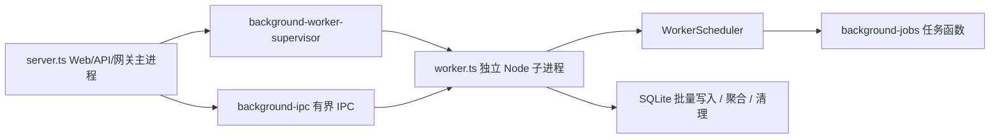

# 后台任务使用说明

> 面向后端开发和维护者。
> 本文说明新版后台定时任务的使用方式、代码落点、进程边界和注意事项。稳定架构边界见 [后端架构设计](README.md) 与 [架构总览](../架构总览.md)；实现验证记录见 [PLAN-0005 后台任务进程隔离](../../plans/计划-0005-后台任务进程隔离.md)。

## 1. 核心原则

- 后台定时任务必须在独立 background worker 进程内注册和执行。
- Web/API/网关主进程只负责 HTTP 请求、网关转发、静态资源、日志旁路投递和 worker 看护。
- 调度器只能触发 worker 进程内的任务函数，不能通过 IPC 让主进程代执行任务。
- 请求链路可以把待处理数据投递给 worker，但批量写库、聚合、清理、外部探测等后台处理权归 worker。
- 当前版本不引入 Redis、Kafka、BullMQ、Agenda 等外部队列；默认使用本地有界 IPC 和 worker 内存队列。server 到 worker 的 IPC 队列、worker 内使用记录 / 审计 / 操作日志 / 维护任务 / 运行日志索引队列都按消息数或估算字节数限流；达到上限时投递函数或本地入队必须快速返回失败、丢弃新副作用或合并同类快照，由各自 dropped / rejected 指标记录，不能让请求进程或 worker 为后台副作用无限堆积内存。

## 2. 当前运行形态



| 文件 | 职责 |
| --- | --- |
| `backend/src/server.ts` | 主进程入口，只启动 Web/API/网关和 `startBackgroundWorkerSupervisor()` |
| `backend/src/worker.ts` | worker 入口，安装 worker 侧队列、日志导入、调度任务 |
| `backend/src/modules/background/background-worker-supervisor.ts` | 主进程内的 worker 启动、退出看护和退避重启 |
| `backend/src/modules/background/background-ipc.ts` | 主进程到 worker 的有界 IPC 消息队列 |
| `backend/src/modules/background/worker-scheduler.ts` | worker 内轻量调度器，支持不可重入和错误隔离 |
| `backend/src/modules/background/background-jobs.ts` | 后台业务任务注册和任务函数 |
| `backend/src/modules/background/data-retention-cleanup.service.ts` | 统一表数据保留期清理任务 |

当前注册任务还包括：

- `proxy-latency-refresh`：固定每 60 秒在 worker 内最多检测 20 个启用代理，检测目标来自已启用供应商默认地址，并更新代理最近检测状态和延迟；该节奏不进入系统设置。
- `table-storage-monitor`：默认每 10 分钟采样业务库、数据集目录库和统计结果库的文件大小、页数、空闲页和表 / 索引数量；表大小、可推导行数和增长趋势按游标轮转采样，默认每轮每个库最多刷新 4 张表，采样历史默认保留最近一月。后台任务通过 `dbstat` 叶子页 cell 数滚动写入行数，不提供精确 `COUNT(*)` 采样分支；usage shard 文件集合观测仍在 PLAN-0030 后续增强阶段。
- `usage-rank-snapshots-refresh`：默认每 30 分钟刷新常用 TopN、概览窗口、额度窗口和授权范围窗口快照；它独立于每分钟用量增量聚合，按功能表分阶段短事务刷新，并在阶段之间让出事件循环，避免把大窗口刷新绑在高频聚合尾部或造成 worker 长时间无响应。
- `client-ip-stats-aggregation`：默认跟随 `statsAggregationIntervalSeconds`，在 worker 内先有限冲刷使用记录队列，再按 usage shard 独立游标读取非 `cooldown_retest` 使用记录，注册来源 IPv4、写入 `client_ip_stats_daily`，并只按本轮 dirty IP 增量刷新常用 `client_ip_usage_range_windows`。该任务不在页面或网关请求路径扫描 `usage_records`，不在请求内重建窗口；非 IPv4 来源不进入 IP 管理聚合。IP 专项单轮处理会额外限制 batch 和最长运行时间，避免 worker 事件循环长时间无响应。
- `api-key-record-cleanup-retry`：默认每 60 秒扫描已删除 API Key 的待清理目标，只处理统计安全游标覆盖到的关联使用记录；游标未追平的记录继续留在待清理表，等待后续重试，避免删除早于统计 / 回填处理。
- `account-quality-refresh`：默认每 10 分钟刷新账号质量缓存；先汇总近 10 分钟真实网关使用记录，只按近窗口样本账号补业务元数据和旧质量行。无新样本账号的 stale 推进、失效质量行和分钟桶清理由固定批次滚动完成，不能一次性加载全部账号或全部质量缓存。账号质量主动探测能力已删除，worker 只处理真实请求样本，避免后续维护中又恢复无业务价值的后台测速请求。
- `openai-oauth-access-token-refresh`：默认每 60 秒扫描仍存在、未删除、有 `refresh_token` 且即将过期的 GPT OAuth 账户，提前 5 分钟刷新 Access Token；扫描不受账户状态和调度标记影响。后台刷新只做 token 保活，不恢复普通冷却状态；连续失败 3 次会把非停用账户标记为 `status = error`、异常类型 `oauth_token_refresh_failed`，后续后台刷新成功会自动恢复该异常。手动停用账户不会被后台刷新失败覆盖成异常。
- `cooldown-account-retest`：默认每 3 秒检查一次冷却到期账号，复测 `temporary_unavailable` / `rate_limited`、仍可调度、已绑定分组且未过期的 GPT 账号；`error`、`disabled` 等硬状态不进入后台复测。复测会优先学习最近真实请求的 `endpoint/model/stream` 元信息生成最小探活请求，不读取或重放用户 prompt、工具参数和完整请求快照；单次复测复用真实网关链路，但候选只包含当前复测账号，失败退避由复测任务自身控制。复测单轮诊断等待固定为 `10s -> 20s -> 30s` 三次真实请求尝试，总等待不超过 60 秒；是否继续只看本次尝试是否成功，不按上游状态码、错误码或错误文案分类。账号进入冷却态后先按 3 秒进入快速恢复通道，连续失败按 `3s -> 6s -> 12s -> 24s -> ...` 翻倍更新 `cooldown_until`；超过快速阈值后退化到慢速恢复，单次等待不超过 `defaultTemporaryUnschedulableMinutes` 表达的最大暂停时间。后台复测成功恢复正常；失败会继续退避复测，超过 `cooldownAccountRetestMaxBackoffHours` 表达的最长自动恢复观察窗口后转为 `cooldown_retest_max_recovery_exceeded` 异常并停止自动复测。恢复探活的使用记录和审计均标记 `traffic_source = cooldown_retest`，写入账号状态的失败摘要使用本次上游真实 `status/code/message`，审计仍使用元信息捕获避免保存完整 payload。worker 运行态会暴露该复活队列的待执行数、运行中数和下次唤醒时间，统计页后台任务表在该任务行内展示摘要。
## 3. 新增定时任务步骤

1. 确认任务是否真的属于后台任务。
   - 属于：统计聚合、批量写库、清理、外部探测、状态扫描、缓存刷新。
   - 不属于：请求必须同步返回的登录、管理面 CRUD、网关选账号、上游请求转发。

2. 把任务实现放在 worker 可导入的模块中。
   - 通用后台任务优先放在 `backend/src/modules/background/background-jobs.ts`。
   - 如果逻辑较大，拆到对应业务模块的 `*.service.ts`，再由 `background-jobs.ts` 导入。
   - 不要从 `server.ts`、routes 或请求中间件导入后台任务实现。

3. 在 `startBackgroundJobs()` 里注册任务。

```ts
scheduler.schedule({
  name: 'example-job',
  intervalMs: settingsNumber('exampleJobIntervalSeconds', 60, 5, 3600) * 1000,
  task: runExampleJob
})
```

4. 任务函数必须自己处理业务错误。

```ts
async function runExampleJob(): Promise<void> {
  try {
    // 批量读取、处理、短事务写入。
  } catch (error) {
    logger.error(errorLogFields(error, { event: 'background_example_job_failed' }), 'Example job failed')
  }
}
```

5. 如果需要配置间隔或批量大小，优先读取系统设置并设置保守上下限。
   - 间隔不要允许小于 5 秒，除非有非常明确的轻量理由。
   - 批量大小要有上限，避免一次任务长时间占用 worker 和 SQLite 写锁。

6. 补充验证记录。
   - 至少执行 `pnpm --filter juhe-ai-backend typecheck`。
   - 涉及前端或接口展示时执行 `pnpm build`。
   - 运行态确认 worker PID 与 server PID 不同，并确认任务日志出现在 worker 侧。

## 4. 请求链路投递到 worker

请求链路只做轻量捕获和投递，不能在主进程内定时 flush。

| 数据 | 主进程 / DB service 入口 | worker 侧处理 |
| --- | --- | --- |
| 使用记录 | `enqueueUsageRecord()` | `enqueueUsageRecordsLocal()` 后批量写 `usage_records` |
| 操作日志 | `recordOperationLog()` / `enqueueOperationLog()` | `enqueueOperationLogsLocal()` 后批量写 `operation_logs`、`operation_log_targets`、`operation_log_viewers` |
| 数据集 / 统计结果维护 | `enqueueRecordMaintenanceJob()` | `enqueueRecordMaintenanceJobsLocal()` 后执行 API Key 关联记录清理、使用记录手动清理、账号用量快照写入等动作 |
| 原始审计日志 | `enqueueAuditLog()` | `enqueueAuditLogsLocal()` 后批量写审计表 |
| 运行日志索引 | `sendRuntimeLogLineToWorker()` | `enqueueRuntimeLogLineLocal()` 后批量写 `runtime_logs` |

IPC 队列有条数和估算字节上限。worker 不可用或积压过高时会快速拒绝新消息，不能为了保证后台数据完整性反向阻塞 Web/API/网关请求。worker 本地队列也必须继续保持硬上限：使用记录、操作日志、维护任务和运行日志索引队列满时丢弃新项并计数；账号用量快照类维护任务按 `accountId + kind + source` 合并为最新值；审计队列溢出时优先丢弃成功样本，保留更多失败排障信息。主进程 fork worker 时必须使用适合 Buffer payload 的 `advanced` IPC 序列化，避免原始审计等大 payload 被 JSON 化后拖慢主进程事件循环。若后续某类数据需要强一致或重启恢复，应另开计划设计本地持久队列。

使用记录、操作日志和数据集 / 统计结果维护队列即使在 drain 模式下也可以限制单次 flush 批数；后台聚合前只做有限批次落库或维护，剩余积压交给后续 timer tick 继续处理，避免 worker 在高峰后一次性同步写库太久。worker 收到 `SIGINT` / `SIGTERM` 或进入 `beforeExit` 时，也只能由 worker 入口统一协调各本地队列做最多 1 批退出 flush；队列模块禁止再注册 `exit` 同步落库钩子，避免进程退出阶段长时间阻塞事件循环或抢先 `process.exit()` 导致其他队列无法收尾。

用量统计聚合和账号质量刷新在读取统计事实前，会先尝试冲刷使用记录队列，但单次只冲刷有限批次；如果用量统计聚合发现队列仍有积压，本轮直接跳过，等待下一轮再推进统计游标。账号质量刷新里的失效账户分钟桶和过期分钟桶也只做小批清理，旧数据可以多轮慢慢删，不能在刷新任务里无上限删除。

## 5. 统一保留期清理

表数据清理统一由 `data-retention-cleanup` 任务负责，每天在 worker 内运行一次。新增需要按时间清理的 SQLite 表时，应优先接入这个任务，不要在业务写入、查询接口、统计聚合或队列 flush 中顺手删除历史数据。

当前清理范围：

| 表 | 默认保留 | 上限 | 说明 |
| --- | --- | --- | --- |
| `runtime_logs` | 3 天 | 3 天 | 普通运行日志搜索索引，不删除 `.log` 文件 |
| `audit_logs`、`audit_log_attempts` | 成功样本 7 天，失败 / 异常事件 30 天 | 固定策略 | 原始审计事件和上游尝试，依赖外键级联清理引用 |
| `audit_payload_refs`、`audit_payload_blobs` | 随事件分层保留 | 固定策略 | payload 引用和压缩 blob 元数据；先清引用，再删无引用 blob 文件 |
| `audit_error_groups` | 30 天 | 固定策略 | 重复错误聚合组 |
| `usage_records` | 7 天 | 7 天 | 自动保留任务只清理已被统计安全游标确认处理过的事实记录；表监控非业务数据硬清理是独立管理员动作，不套用这个安全保留口径 |
| `account_quality_minute_stats` | 24 小时 | 固定策略 | 账号质量短窗口分钟桶，刷新任务也会兜底清理 |
| `usage_stats_minute`、`usage_model_minute`、`usage_error_minute`、`usage_latency_minute` | 48 小时 | 按系统设置上限 | 分钟级统计汇总 |
| `usage_stats_hourly`、`usage_model_hourly`、`usage_error_hourly`、`usage_latency_hourly` | 60 天 | 按系统设置上限 | 小时级统计汇总，覆盖 AI 性能最近 31 天趋势 |
| `usage_stats_daily`、`usage_model_daily`、`usage_error_daily`、`usage_latency_daily` | 400 天 | 按系统设置上限 | 日级统计汇总 |
| `usage_stats_weekly`、`usage_model_weekly`、`usage_error_weekly`、`usage_latency_weekly` | 104 周 | 按系统设置上限 | 周级统计汇总 |
| `usage_stats_monthly`、`usage_model_monthly`、`usage_error_monthly`、`usage_latency_monthly` | 24 个月 | 按系统设置上限 | 月级统计汇总 |
| `usage_rank_snapshots` | 30 天 | 按系统设置上限 | 常用 TopN 快照 |
| `authorization_team_usage_summary_daily`、`authorization_user_usage_summary_daily` | 跟随日级统计 | 按系统设置上限 | 授权日报表缓存 |
| `authorization_team_usage_range_windows`、`authorization_user_usage_range_windows`、`usage_scope_range_windows`、`usage_quota_hourly_windows`、`usage_overview_summary_windows`、`usage_overview_trend_windows`、`usage_model_rank_windows`、`usage_error_rank_windows`、`ai_performance_summary_windows` | 最近 31 天窗口或最近 30 天刷新结果 | 固定策略 | 业务窗口快照，API 只读这些预聚合结果，不在请求时汇总 |
| `account_usage_snapshots` | 30 天未更新 | 固定策略 | 账号额度最新快照，正常按账号主键 upsert |
| `system_metrics_samples` | 7 天 | 7 天 | 系统监控原始采样 |
| `system_metrics_hourly` | 30 天 | 30 天 | 系统监控小时汇总 |
| `system_metrics_trend_windows` | 最近 31 天窗口 | 固定策略 | 系统监控窗口趋势，供概览接口直读 |
| `database_storage_snapshots`、`table_storage_snapshots` | 最近一月 | 最近一月 | 表监控采样历史，采样写入时有轻量兜底清理 |
| `system_sessions` | 到期 | 到期 | 已过期后台登录会话 |

清理任务有两个批量控制设置：`dataRetentionCleanupBatchSize` 和 `dataRetentionCleanupMaxBatchesPerRun`，运行时会把异常偏大的配置钳制到小批上限。实现时要保持“短事务、可重试、可重复执行”，各类保留清理按表独立推进，表间失败不回滚已经完成的前序表，失败表等待下一轮继续，不影响管理 API 或网关请求。

删除资源关联记录时优先查询本批目标 ID，再按依赖顺序删除子表和父表：例如原始审计先删 `audit_payload_refs`、`audit_log_attempts`，再删 `audit_logs`；模型检测先删 `model_check_items`，再删 `model_check_runs`。已删除 API Key / AI 账户的关联数据重试任务每分钟只处理少量目标，单目标内部也只清小批记录，让历史欠账慢慢消化，避免 worker 事件循环被同步删除拖出尖峰。

管理员在表监控页面手动清理非业务数据时，产品口径是“业务库不清，其他统计数据集域按截止时间硬清理”：后端只校验 `cutoffAt` 不能晚于当前时间，然后投递 `non_business_data_cleanup` 维护任务。worker 分批清理数据集目录库、统计结果库、usage shard 和审计 payload 外部文件；数据集目录库和统计结果库普通表按 schema 动态枚举可识别时间列，usage shard 和审计 payload 文件走专门物理删除流程；不等待统计安全游标、不做关联保护、不做旧统计反向扣减。空 usage shard 会同步删除 `.sqlite3`、WAL、SHM 和 journal 文件。这个入口用于管理员主动释放非业务历史数据，不能替代 API Key / AI 账户删除后的关联记录清理，也不进入业务库。

## 6. 任务实现注意事项

- 任务必须可重复执行；同一轮失败后下一轮重试不能造成严重重复副作用。
- 任务要短事务写库，避免长时间占用 SQLite 写锁。
- 批量任务要分批处理，单批大小从设置读取时必须有上下限。
- 外部请求必须有超时、错误摘要和重试边界，不能无限等待。
- 长任务不应并发重入；`WorkerScheduler` 已对同名任务做 `running` guard，任务内部仍要避免启动无管理的并发批处理。
- 日志事件名必须能区分任务，例如 `background_usage_stats_aggregation_failed`。
- 运行日志索引失败只能写 `stderr`，不要用普通 logger 递归制造新日志。
- 运行日志 facets 随索引写入增量维护；小时级索引维护只在 facets 缺失且窗口内有日志时重建，数据保留清理删除索引时同步扣减 facets，不在常规清理后全量 `COUNT/GROUP BY runtime_logs`。
- 日志搜索不维护额外回填任务；运行日志 keyword 只查 `runtime_logs.message`，操作日志 `summaryKeyword` 读取随操作日志写入同步生成的 `operation_log_summary_search_terms` 摘要倒排词项，不能在列表请求里扫描 `operation_logs` 主表字段，也不能把资源名、操作人、模块或动作混入摘要搜索。
- 不要在任务里信任历史授权快照；涉及调度、授权、团队成员状态时必须重新校验当前状态。
- 多实例部署前不能假设只有一个 worker；当前默认单实例，多实例需要共享锁或显式任务归属。

## 7. 禁止事项

- 禁止在 `server.ts`、routes、中间件或网关请求链路里调用 `startBackgroundJobs()`。
- 禁止在主进程里为业务后台任务写 `setInterval`、cron 或调度框架。
- 禁止让 worker 只负责调度，再通过 IPC 回到主进程执行任务函数。
- 禁止在请求链路同步写原始审计日志或批量统计缓存。
- 禁止无上限队列、无上限批量、无上限重试。
- 禁止为了任务方便绕过 repository、权限边界或敏感字段处理规则。

## 8. 允许保留在主进程的定时或超时

以下不属于业务后台定时任务，可以留在主进程：

- HTTP 请求、上游请求、SSE 或接口查询的超时控制。
- worker 状态请求的短超时。
- worker 崩溃后的 supervisor 退避重启 timer。
- 只服务当前请求生命周期的短暂等待。

主进程不应保留统计聚合、日志索引批量写入、审计批量落库、清理、账号复测等业务后台 timer。OAuth 额度快照已改为真实请求或账户测试响应头被动更新，不再有后台刷新 timer。

## 9. 验证清单

新增或修改后台任务后，按以下清单复查：

- `server.ts` 只导入 `startBackgroundWorkerSupervisor()`，没有导入后台任务实现。
- `startBackgroundJobs()` 只在 `worker.ts` 中调用。
- 新任务通过 `WorkerScheduler.schedule()` 注册。
- 任务有不可重入保护、批量上限、错误日志和下一轮重试边界。
- 请求链路只投递到 IPC 或 worker 队列，不在主进程 flush。
- `pnpm --filter juhe-ai-backend typecheck` 通过。
- 运行态 server PID 和 worker PID 不同。
- 人工终止 worker 后，`/__aisys__/health` 仍能响应，worker 能被重新拉起。

## 10. 排查命令

```powershell
rg -n "setInterval|setTimeout|cron|schedule|startBackgroundJobs|startRuntimeLogFileImport|flush.*Queue" backend/src
```

```powershell
Get-NetTCPConnection -LocalPort 3000 |
  Where-Object { $_.State -eq 'Listen' } |
  Select-Object LocalAddress, LocalPort, State, OwningProcess
```

```powershell
Get-CimInstance Win32_Process -Filter "name = 'node.exe'" |
  Where-Object { $_.CommandLine -like '*juhe-ai*backend*worker.ts*' -or $_.CommandLine -like '*juhe-ai*src/server.ts*' -or $_.CommandLine -like '*sub2api-lite*backend*worker.ts*' -or $_.CommandLine -like '*sub2api-lite*src/server.ts*' } |
  Select-Object ProcessId, ParentProcessId, CommandLine
```

## 11. 什么时候需要更新本文

- 新增后台任务类型或新的 worker 消息类型。
- 调整调度器、IPC 队列、worker supervisor 或进程角色配置。
- 引入持久队列、外部队列、分布式锁或多实例任务归属。
- 调整生产常驻运行方式，导致 worker 不再由主进程 fork 或需要独立进程管理器守护。
