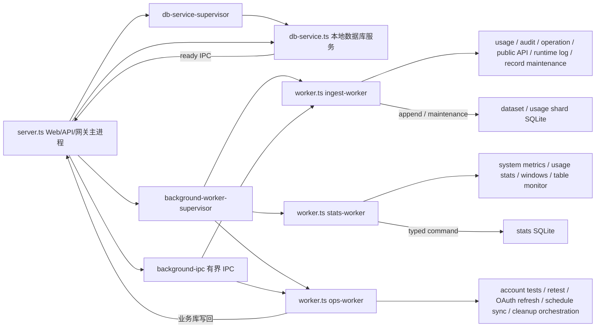

# 后台任务使用说明

> 面向后端开发和维护者。
> 本文说明当前后台任务的运行形态、角色边界、队列规则和验证方式。稳定架构边界见 [后端架构设计](README.md) 与 [架构总览](../架构总览.md)；worker 收敛设计见 [后台 Worker 多角色拆分设计](后台Worker多角色拆分设计.md)；执行计划见 [PLAN-0055 后台 Worker 三角色收敛](../../plans/计划-0055-后台Worker三角色收敛.md) 与 [PLAN-0056 ops-worker 外部 I/O 并发控制](../../plans/计划-0056-opsWorker外部IO并发控制.md)。

## 核心原则

- 当前常驻后台 worker 固定收敛为三类：`ingest-worker`、`stats-worker`、`ops-worker`。DB service 仍是独立进程，不并入 worker。
- 子进程仍统一使用 `JUHE_AI_PROCESS_ROLE=worker`，通过 `JUHE_AI_WORKER_ROLE=ingest-worker|stats-worker|ops-worker` 区分职责；默认 `worker` 只保留统一进程角色命名 / 控制入口语义，不再由 supervisor 常驻拉起。
- 1000 人以内的轻量部署不按 CPU 核数扩 worker；任务按“热写入、重统计、轻运维”隔离，并在单个 worker 内用小批次、异步让出和受控并发处理 I/O。
- 请求链路只做轻量捕获和投递，不在 API route、repository 请求路径或前端实时扫描明细表做统计、额度、趋势或 TopN 汇总。
- 所有后台任务必须遵守 SQLite 单写者边界：业务库写入归 DB service，数据集目录库和 usage shard 写入归 ingest writer，统计结果库写入归 stats writer。非 owner 只能生产 typed command 或通过 IPC 转发。
- standalone 模式下当前不引入 Redis、Kafka、BullMQ、Agenda 等外部队列；server 到 worker 使用本地有界 IPC，worker 内部使用有界内存队列。performance 模式下可通过 PostgreSQL + Redis 共享运行态并提升消费并发，但仍必须保留队列背压、优先级和 dropped / rejected 指标。队列满时必须快速拒绝、丢弃低价值项或合并同类快照，并记录 dropped / rejected 指标。
- `temporary-maintenance-worker` 只保留为按需历史任务入口，不属于常驻拓扑；常规 usage / dataset / stats 维护写入不再 fork 临时 worker。

## 当前运行形态



| 进程 / 角色 | 常驻 | 职责 | 不允许承载 |
| --- | --- | --- | --- |
| `server` | 是 | HTTP、网关转发、静态资源、日志旁路投递、worker 和 DB service 看护 | 定时业务任务、批量统计、批量清理 |
| `db-service` | 是 | 业务库单写者、系统 API typed operation、管理 CRUD 读写 | 数据集目录库、usage shard、stats SQLite 直写 |
| `ingest-worker` | 是 | 使用记录、审计、操作日志、公开接口日志、运行日志索引、运行日志文件导入、record maintenance、dataset / usage shard 清理 | 重统计窗口、账号外部探测、业务库直写 |
| `stats-worker` | 是 | 系统指标采样、事件循环 / 内存采样、用量聚合、IP 聚合、分组账号统计、额度窗口、TopN、概览、范围窗口、授权窗口、账号质量、表监控、统计保留期清理 | 上游网络探测、业务库直写、usage shard 直写 |
| `ops-worker` | 是 | 手动账号测试、账号健康检测、冷却复测、Key 级冷却复测、OAuth token 保活、代理延迟刷新、可用时段同步、授权到期扫描、过期删除账号清理协调 | 高频 append-only 写入、重统计窗口、长事务清理 |
| `temporary-maintenance-worker` | 否 | 按需历史维护任务入口，运行后退出 | 常驻调度、热点队列、系统采样 |

## 任务归属

### ingest-worker

| 任务 / 队列 | 边界 |
| --- | --- |
| `background_worker_usage_records` | 网关事实源，高优先级有界队列，先落 usage shard，再供 stats-worker 按游标读取 |
| `background_worker_audit_logs` | 原始审计 append-only，溢出时优先保留失败 / 异常样本 |
| `background_worker_operation_logs` | 操作日志批量写入，摘要搜索词项随写入维护 |
| `background_worker_public_api_logs` | 公开接口调用明细批量写入 |
| `background_worker_runtime_log_line` / `runtime-log-file-import` | 运行日志索引按 offset / cursor 增量写入，禁止整文件读入内存 |
| `background_worker_record_maintenance` | usage / dataset 维护只进 ingest；stats-only 维护转给 stats writer |
| `api-key-record-cleanup-retry` / `account-record-cleanup-retry` | 已删除资源关联数据小批清理，等待统计安全游标追平 |
| `audit-hot-retention-cleanup` / `runtime-log-index-maintenance` / `data-retention-cleanup` dataset 部分 | 小批多轮，不能压住高优先级写入；PostgreSQL performance 下 `data-retention-cleanup` 只按系统设置投递 record-maintenance 任务 |

### stats-worker

| 任务 | 边界 |
| --- | --- |
| `system-metrics-sample` | 当前 Node 过渡实现写入系统采样、进程事件循环 / RSS / Heap 样本；采样角色固定为 `server`、`ingest-worker`、`stats-worker`、`ops-worker`、`db-service`。Go W6 / W7 接管后按 [Go 迁移指标与观测规划](../../migration/Go迁移指标与观测规划.md) 改为 Go runtime、Asynq queue、worker lag 和 stats freshness 采样，不再写入 Node event-loop 长期指标 |
| `usage-stats-aggregation` | 先确认 ingest facts 已稳定落地，再按 usage shard 游标增量聚合 |
| `client-ip-stats-aggregation` | 只按 dirty IP 增量刷新窗口，不在接口请求内重建 |
| `group-account-stats-refresh` / `account-quality-refresh` | 固定批次滚动处理；账号质量失败预检候选交给 ops 队列 |
| `usage-rank-snapshots-refresh` / `usage-overview-windows-refresh` / `usage-scope-range-windows-refresh` / `authorization-usage-range-windows-refresh` | 重窗口分阶段短事务刷新，阶段之间让出事件循环 |
| `system-metrics-trend-windows-refresh` / `table-storage-monitor` | 低频 stats 写任务，按窗口表直读 |
| `usage-stats-consistency-check` / stats 保留期清理 / deleted-record 统计扣减 | 串行 stats writer typed operation，不能回写到其他 worker |

### ops-worker

| 任务 / 队列 | 边界 |
| --- | --- |
| `manual-account-test-queue` | 手动账户测试本地队列，支持取消、等待上限和运行上限 |
| `account-health-check` | 正常账户低频健康检测，避免一次性加载全部账户；按批量派生保守并发 |
| `cooldown-account-retest` / `account-api-key-cooldown-retest` | 外部 I/O 使用 `p-limit` 受控并发，失败退避；写使用记录仍投递 ingest |
| `openai-oauth-access-token-refresh` | 只做 token 保活，不恢复普通冷却状态；失败写回走 DB service |
| `proxy-latency-refresh` | 低频代理检测，固定批次和超时 |
| `api-key-availability-schedule-status-sync` / `account-availability-schedule-status-sync` | 读取 `next_check_at <= now` 的计划对象，不能全表扫描 |
| `resource-authorization-expiry-sweep` / `expired-deleted-account-cleanup` | 业务库扫描和最终物理删除走 DB service；关联 usage / dataset / stats 清理由 ingest / stats 推进 |

## 并发与让出

- worker 内任务可以对外部 I/O 使用受控并发，例如账号测试、代理检测、OAuth 刷新；并发数必须有上限，并且每批之间让出事件循环。
- `createRetryQueue` 内部使用 `p-limit` 作为异步执行门禁，保留项目自有 snapshot、key 去重、重试和动态 `setConcurrency()` 语义；不要直接用第三方队列替换它。
- `ops-worker` 账号健康检测、账号级冷却复测和 Key 级冷却复测按 batch size 派生并发，上限为 10；账号质量 full diagnostic 失败预检上限为 3。
- SQLite 写入不靠多进程并发解决；同一目标库只允许 owner 串行短事务提交。需要提升吞吐时，先做索引、批量大小、游标窗口和写队列优先级优化。
- 重统计任务必须拆成短阶段，阶段之间检查时间预算并 `await` 让出；不能在一个 tick 内长时间同步 reduce、删除或重建窗口。
- 轻量定时任务可以合并到 `ops-worker`，但必须保留批量上限、超时、错误摘要和下一轮重试边界。

## 请求链路投递

| 数据 | 入口 | worker 侧处理 |
| --- | --- | --- |
| 使用记录 | `enqueueUsageRecord()` | `ingest-worker` 调用本地 usage 队列批量写入 |
| 原始审计 | `enqueueAuditLog()` | `ingest-worker` 批量写 `audit_logs` 和 payload refs |
| 操作日志 | `recordOperationLog()` / `enqueueOperationLog()` | `ingest-worker` 批量写操作日志和摘要索引 |
| 公开接口日志 | DB service 经 server 转发 | `ingest-worker` 批量写 `public_api_logs` |
| 运行日志索引 | `sendRuntimeLogLineToWorker()` | `ingest-worker` 批量写 `runtime_logs` |
| 账号测试 / 取消 | 管理 API 经 IPC 投递 | `ops-worker` 消费本地测试队列 |
| 记录维护 | `enqueueRecordMaintenanceJob()` | usage / dataset 进 ingest；stats command 进 stats writer |

IPC 队列有消息数和估算字节上限。worker 不可用或积压过高时，投递函数必须快速返回失败或记录拒绝计数，不能反向阻塞 Web/API/网关请求。

## 新增或调整任务步骤

1. 先判断任务类型：热写入进 `ingest-worker`，统计 / 监控 / 窗口进 `stats-worker`，外部 I/O / 轻运维 / 状态扫描进 `ops-worker`。
2. 在 `backend/src/modules/background/background-job-registry.entries.ts` 登记任务或队列元数据，明确 `defaultRole`、`hotspot`、`singleOwner`、`shardable` 和写入目标。
3. 在 `startBackgroundJobs()` 按 `runtimeConfig.workerRole` 注册任务，禁止 route、server 或 DB service 直接启动业务 timer。
4. 写库前确认 owner：非 owner 只能发 typed command，不能直接 import repository 绕过 DB service、dataset writer 或 stats writer。
5. 给批量、并发、超时、重试和错误日志设置边界；长任务要可重复执行。
6. 同步接口类型、统计页展示和回归脚本，确保运行态字段只暴露当前三类 worker。

## 验证清单

- `background-worker-supervisor` 只拉起 `ingest-worker`、`stats-worker`、`ops-worker`。
- `worker.ts` 只根据这三类常驻 role 安装对应队列和调度任务。
- `background-ipc` 中使用记录、审计、操作日志、公开接口日志、运行日志和 record maintenance 路由到 `ingest-worker`；账号测试和取消路由到 `ops-worker`；stats write request 路由到 `stats-worker`。
- `/__aisys__/api/stats/system-metrics` 只返回 `ingestWorkerSnapshotAvailable`、`statsWorkerSnapshotAvailable`、`opsWorkerSnapshotAvailable` 和对应 worker runtime；进程事件循环角色固定为 `server`、`ingest-worker`、`stats-worker`、`ops-worker`、`db-service`。
- 该验证清单属于当前 Node worker 拓扑。Go worker 接管后，应以 Go runtime / Asynq / worker lag 验收替换事件循环角色和 `db-service` 检查。
- 前端统计页和设置页只展示写入 worker、统计 worker、运维 worker，不再出现监控 worker、快照 worker、探测 worker 或维护 worker 文案。
- 至少运行后端类型检查和 worker 拓扑 / 运行态相关回归脚本。

常用命令：

```bash
pnpm --filter juhe-ai-backend exec tsc --noEmit
pnpm --filter juhe-ai-backend test:background-metrics-worker-role
pnpm --filter juhe-ai-backend test:background-worker-topology-smoke
pnpm --filter juhe-ai-backend test:runtime-snapshot-unavailable-contract
pnpm --filter juhe-ai-backend test:system-metrics-process-latest
```

## 禁止事项

- 禁止在 `server.ts`、routes、中间件或网关请求链路里调用 `startBackgroundJobs()`。
- 禁止在主进程里为业务后台任务写 `setInterval`、cron 或调度框架。
- 禁止让 worker 只负责调度，再通过 IPC 回到主进程执行任务函数。
- 禁止非 owner worker 直接写目标 SQLite 文件。
- 禁止无上限队列、无上限批量、无上限并发或无上限重试。
- 禁止为了页面统计在请求链路实时扫明细表、缓存桶或大文件。

## 什么时候更新本文

- 新增后台任务类型、worker 消息类型或本地队列。
- 调整 `ingest-worker`、`stats-worker`、`ops-worker` 的职责边界。
- 引入持久队列、外部队列、任务租约、分片 worker 或多实例任务归属。
- 调整系统监控接口、统计页运行态展示或 worker supervisor 进程拓扑。
