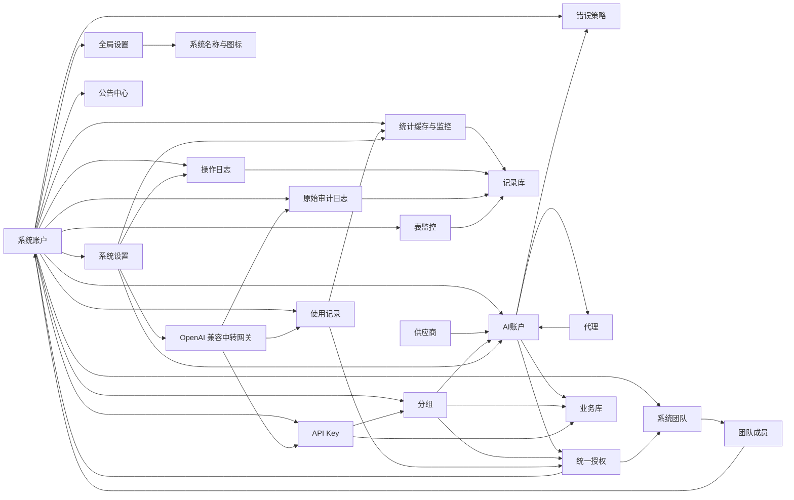

# 整体架构设计

## 文档边界

本文只说明 `juhe-ai` 的产品目标、技术选型、模块边界、跨模块关系和架构约束，不承载具体页面字段、接口清单、默认参数、实现细节或功能验收要求。

具体功能设计、字段说明、接口优先级、运行策略、存储细节和专题调研统一沉淀在 `docs/functions/`，入口见 [功能文档目录](../functions/README.md)。如果功能变化只影响某个模块实现，应优先更新对应功能文档；只有影响模块边界、数据关系、权限安全或网关主链路时，才同步调整本文。

## 产品目标

`juhe-ai` 定位为轻量、易扩展的本地 OpenAI 兼容中转与账号调度系统。它让客户端长期固定连接一个本地入口，把多套中转地址、多组上游账号、多服务商入口和代理策略统一放到后台调度。

系统优先保证：

- 客户端入口稳定：客户端只配置本服务 `/v1` 和本地 API Key。
- 会话体验连续：尽量避免用户频繁切换 Base URL、API Key 或服务商。
- 上游自动切换：账号或供应商异常时，在分组边界内选择可用账号。
- 集中可观测：请求、用量、错误、命中账号和原始链路审计应能被统一记录和追溯。

整体模块已经围绕 OpenAI 账号接入、统一授权、网关调度、统计审计和运维排障形成闭环；后续扩展继续保持轻量边界，避免把单机部署演进成重型系统。

## 技术架构

- 前端：Vue 3 + TypeScript + Ant Design Vue。
- 后端：Node.js + TypeScript。
- API 风格：REST 优先；后续实时状态能力再按需补 WebSocket 或 SSE。
- 对外中转协议：统一兼容 OpenAI `/v1` 协议。
- 存储：SQLite，分为业务库和记录库；业务库保存可恢复核心业务数据，记录库保存日志、统计、审计、运行记录和表监控历史。
- 敏感数据：OAuth token、上游 API Key、本地网关 API Key 和代理密码必须按安全边界处理。
- 运行形态：Web/API/网关主进程、后台任务 worker 进程和本地 DB service 进程分离；后台定时任务必须在独立 Node 进程内调度和执行，网关高频 SQLite 读写优先通过 DB service 异步完成，不能只由主进程的定时器、cron 回调或同步 SQL 承载。
- 大文件和频繁文件读取是项目级性能底线：运行日志、审计 payload、导入导出文件和其他持续增长文件必须按 offset / cursor / stream / 分块窗口处理，不能在运行路径里完整读入内存再切割；追增量任务必须持久化游标并在轮转或截断时重置。

更具体的运行、存储和敏感字段规则见 [SQLite 存储说明](../functions/SQLite存储说明.md) 与 [核心功能设计](../functions/核心功能设计.md)。

## 访问控制边界

- 系统登录账号称为 `系统账户`，是后台登录、角色控制、API Key 调用方和数据隔离边界。
- `系统团队` 是多个系统账户的集合，用于承接团队级资源使用授权；团队不是资源所有者。
- 当前只保留 `admin` 和 `user` 两种角色。
- `admin` 可以查看全部系统账户、系统团队、全部业务数据、全部使用记录、全部操作日志、原始审计日志和全部系统级配置。
- `user` 默认只能访问自己名下的数据；被授权的 AI 账户、分组和团队授权资源只获得使用权，不获得管理权。
- 资源授权统一由授权菜单维护，不再分散在账户页或分组页的独立授权弹窗中；管理侧 `统一授权管理` 和用户侧 `我的授权` 都必须把关系管理和消耗明细分开，`统一授权` / `授权操作` 只管授权关系，团队 / 用户消耗进入对应明细页。
- 团队 / 用户授权消耗明细必须由后台 worker 增量写入专用日摘要表，并刷新最近 31 天的日范围窗口表；页面接口只能按筛选条件直读已成形范围窗口行；不能让前端拿授权列表做本地聚合，也不能在页面请求里回扫 `usage_records` 或临时 `SUM/GROUP BY` 统计缓存。
- 统计汇总是项目级性能底线：业务用量、额度判断、趋势、TopN、摘要卡片和授权报表都只能读取 worker 预聚合结果；API 请求路径不能把明细或缓存行再临时相加，表结构不够时优先新增 staged / window / summary 表并重建统计缓存。
- AI 账户状态中 `error` 统一作为“异常”硬状态，不参与调度；具体异常原因由 `last_error_code` 区分，`last_error_message` 保存排障说明。OAuth Access Token 后台保活不因停用、异常、限流或临时不可调用跳过，但连续 3 次刷新失败会把账户标记为异常。
- 用户侧业务数据写入和查询必须走 `/api/my-*`，以后端登录态决定当前用户作用域，前端不传系统账户归属字段。
- 管理侧业务数据走 `/api/*` 管理入口并显式要求 `admin`；管理员如果筛选某个系统账户，读写作用域必须一致，不能落到当前管理员自己的默认作用域。
- 登录态、系统账户管理、系统团队、登录验证码和失败防护等具体要求见 [核心功能设计](../functions/核心功能设计.md) 与 [系统团队与统一授权设计](../functions/系统团队与统一授权设计.md)。

## 设置分层

- `global_settings`：平台全局配置，承载系统名称和系统图标路径；未登录也需要可读，只允许 `admin` 修改。
- `system_settings`：系统运行策略，按默认管理员作用域保存为全局单例，只允许 `admin` 修改；仅保存当前白名单内的网关、后台任务、操作日志和数据保留策略；原始审计日志捕获、成功采样、队列和正文保全策略固定在后端，不进入系统设置。
- 登录页标题、角标、副标题和视觉边界见 [产品与品牌边界](frontend/产品与品牌边界.md)。
- 网关调度默认值、统计任务参数、OAuth Access Token 预刷新参数、OAuth 额度快照被动更新口径、操作日志配置、原始审计捕获边界和审计保全策略见 [核心功能设计](../functions/核心功能设计.md)、[SQLite 存储说明](../functions/SQLite存储说明.md)、[操作日志设计](../functions/操作日志设计.md)、[原始审计日志设计](../functions/原始审计日志设计.md) 与 [审计日志保全策略设计](../functions/审计日志保全策略设计.md)。

## 模块总览

## 模块边界

| 模块 | 架构职责 | 具体设计文档 |
| --- | --- | --- |
| 系统账户 | 登录身份、角色权限和数据隔离边界 | [核心功能设计](../functions/核心功能设计.md) |
| 系统团队 | 归纳多个系统账户，承接团队级资源使用授权 | [系统团队与统一授权设计](../functions/系统团队与统一授权设计.md) |
| 供应商 | 描述供应商能力、账户类型和模型目录归属 | [核心功能设计](../functions/核心功能设计.md)、[OpenAI 账号接入](../functions/OpenAI账号接入.md) |
| AI 账户 | 承载上游凭据、状态、调度属性和可授权使用资源 | [核心功能设计](../functions/核心功能设计.md)、[OpenAI 账号接入](../functions/OpenAI账号接入.md) |
| 分组 | 调度资源集合和 API Key 授权边界 | [核心功能设计](../functions/核心功能设计.md) |
| 统一授权 | 将 AI 账户或分组的使用权授权给系统账户或系统团队 | [系统团队与统一授权设计](../functions/系统团队与统一授权设计.md)、[SQLite 存储说明](../functions/SQLite存储说明.md) |
| API Key | 对外访问密钥，绑定自有分组或授权分组 | [核心功能设计](../functions/核心功能设计.md)、[系统团队与统一授权设计](../functions/系统团队与统一授权设计.md) |
| 代理 | 服务器级全局运维资源，供账号绑定使用 | [核心功能设计](../functions/核心功能设计.md) |
| 使用记录 | 网关请求事实源，支撑排查、统计和授权用量 | [核心功能设计](../functions/核心功能设计.md)、[SQLite 存储说明](../functions/SQLite存储说明.md) |
| 操作日志 | 记录系统账户对业务资源的增删改、启停、绑定、授权和配置变更，用于追溯谁改了什么以及影响了谁 | [操作日志设计](../functions/操作日志设计.md)、[安全与日志策略](../functions/安全与日志策略.md) |
| 原始审计日志 | 记录客户端请求、网关处理、上游请求、上游响应和最终返回的完整链路，并通过保全策略控制正文压缩、去重、采样和保留 | [原始审计日志设计](../functions/原始审计日志设计.md)、[审计日志保全策略设计](../functions/审计日志保全策略设计.md)、[安全与日志策略](../functions/安全与日志策略.md) |
| 统计缓存与监控 | 从使用记录增量汇总，降低列表和图表读取成本，支撑用量统计、统计概览、AI 账户性能趋势和主机监控 | [核心功能设计](../functions/核心功能设计.md)、[SQLite 存储说明](../functions/SQLite存储说明.md)、[AI 性能监控设计](../functions/AI性能监控设计.md) |
| 表监控 | 采样业务库和记录库的文件大小、空闲页、表大小、行数和增长趋势，用于发现异常增长和容量风险 | [表数据监控设计](../functions/表数据监控设计.md)、[SQLite 存储说明](../functions/SQLite存储说明.md) |
| 错误策略 | 账号级错误处理和网关切换策略边界 | [核心功能设计](../functions/核心功能设计.md) |
| 公告中心 | 面向所有登录用户展示平台公告，并由管理员维护发布内容 | [公告中心设计](../functions/公告中心设计.md) |
| 中转网关 | 校验 API Key、选择分组内账号、转发请求并记录结果 | [核心功能设计](../functions/核心功能设计.md)、[中转透传机制调研与定位修正](../functions/中转透传机制调研与定位修正.md) |
| 幂等与唯一约束 | 防止管理端重复提交、重复创建和重复业务关系，固定内存防重复提交、业务唯一键和数据库唯一约束边界 | [幂等与唯一约束设计](../functions/幂等与唯一约束设计.md)、[SQLite 存储说明](../functions/SQLite存储说明.md) |
| 接口契约与权限 | 管理 API、网关 API、响应结构、错误语义和权限矩阵 | [接口契约与权限矩阵](../functions/接口契约与权限矩阵.md) |
| 安全与日志 | 敏感字段、凭据展示、请求快照、日志脱敏和保留策略 | [安全与日志策略](../functions/安全与日志策略.md) |

## 核心关系

- 系统账户是登录、调用方和隔离边界；业务数据默认归属某个系统账户。
- 系统团队归纳多个系统账户，只承接使用授权，不改变资源归属。
- 全局设置属于平台公开展示资源；系统设置属于平台运行策略，影响网关、后台任务、操作日志和数据保留；原始审计捕获和正文保全策略固定启用，不作为系统设置项暴露。
- 供应商定义账户创建方式和能力边界；账户必须归属某个供应商。
- AI 账户承载上游凭据和调度属性，可以通过统一授权授权给系统账户或系统团队使用。
- 分组汇总同供应商账户，是 API Key 可访问资源的边界。
- API Key 绑定一个分组，请求进入后只能使用该分组内当前可调度且授权仍有效的账户。
- API Key 是一次性接入凭据；列表展示累计用量，可配置 n 小时、日、周、月和总美元成本额度；删除后同步清理该 Key 的使用记录、审计日志和统计缓存，并从相关聚合统计中扣除这把 Key 的历史消耗。
- 代理是服务器级运维资源，不属于普通用户私有配置；代理质量检测以已启用供应商默认地址为目标，最近状态和延迟作为运维参考缓存。
- 公告中心是全员只读、管理员维护的轻量通知模块；用户侧只读取已发布公告，管理员侧负责新增、编辑、发布、下线和删除。
- 使用记录是计量和统计事实源；统计缓存只做读优化，不能替代事实记录。
- 业务库和记录库是明确边界：系统账户、账户、分组、API Key、授权、公告、设置等可恢复业务数据在业务库；使用记录、日志、审计、统计缓存、系统指标、账号质量缓存和表监控历史在记录库。默认备份只覆盖业务库和 `backend/.env`。
- AI 账户性能趋势是账号所有者视角，从使用记录的小时级统计缓存读取；用户侧只看当前用户自有账户，管理侧可按系统账户筛选或读取全局账户缓存。页面默认日期范围为最近 3 天，默认账户池取最近 7 天活跃前 10；搜索追加账户和点击筛选只影响本次查看，不持久化为偏好或运行策略。
- 操作日志是业务状态变更追溯事实，记录成功的增删改、启停、绑定、授权和配置变更；查询、列表、筛选、详情查看和日志查看不属于操作日志。
- 操作日志按影响用户预计算可见范围：普通用户只能查看自己发起、自己资源、自己授权关系、自己团队关系或全局影响相关的安全摘要；管理员可以查看全部操作日志。
- 管理端写操作必须通过前端防连点、后端内存短 TTL 防重复缓存和数据库业务唯一约束兜底，前端重复点击或网络重试不能创建重复业务数据；重复提交拦截不能写第二条操作日志。
- 原始审计日志是排障数据；完全成功请求默认只按 10% 稳定采样保留，用于抽查客户端请求和网关改写，失败、异常、客户端中断、流式中断和重试后成功链路必须保留。正文内容按保全策略压缩、去重和定期清理；它和使用记录分表管理，不参与用量统计。
- 原始审计日志不允许在网关主链路同步写库，只能在请求结束后把终态记录交给后台 worker 批量落库；进程重启导致队列数据丢失是可接受边界。
- 授权只传递使用权，不传递管理权，也不能绕过敏感凭据隔离；授权消耗统计不包含资源归属人自己的自用消耗。统一授权可配置 n 小时、日、周、月和总美元成本额度，避免被授权用户或团队超额使用共享资源。
- 用户接口、管理接口、网关接口和权限摘要必须遵循统一契约；敏感字段、日志和请求快照必须遵循安全策略。

## 后台任务隔离

- 主 Web 进程只承载管理 API、OpenAI 兼容网关、静态资源和必要的请求内状态维护。
- 统计聚合、分组账户统计缓存刷新、系统指标采样、表数据监控采样、授权到期扫描、OpenAI OAuth Access Token 保活、冷却账号复测、运行日志索引 flush、审计日志批量落库和统一表数据保留期清理都属于后台 worker 职责。OpenAI OAuth 额度快照由真实网关响应头被动写入，不再作为后台主动刷新任务。
- 后台任务必须在独立 Node 进程内注册、调度和执行；调度框架只允许运行在 worker 进程内，不能通过 IPC 或回调让主进程代执行任务函数。
- 主进程可以启动、看护和重启 worker，也可以把请求链路产生的轻量消息投递给 worker，但不能导入后台任务实现并直接调用。
- 当前版本不引入 Redis、Kafka 或独立分布式队列；如后续支持多实例部署，再评估共享锁、任务归属和幂等边界。

## 数据库服务隔离

- SQLite 仍是当前默认事实存储，不引入 PostgreSQL、Redis 或其他第三方数据库依赖；当前部署使用业务库 `JUHE_AI_DATABASE_PATH` 和记录库 `JUHE_AI_RECORD_DATABASE_PATH` 两个 SQLite 文件。
- 本地 DB service 是独立 Node 进程，用于承接网关高频数据库读写和账号运行态副作用，目标是避免 Web/API/网关主进程事件循环被 `DatabaseSync` 直接占用。
- DB service 不改变 SQLite 单写者边界；后台 worker 和 DB service 的写入仍必须依赖 WAL、短事务、批量上限和 `busy_timeout` 控制写锁等待。
- 对外 HTTP API 和 `/v1` 协议不因 DB service 变化而改变；DB service 不可用时必须有明确重启、降级或可读错误，不能拖垮主 Web 进程。
- 管理面低频 CRUD 可以继续使用现有 repository；客户请求链路优先迁移 API Key 校验、网关设置读取、分组账号读取、额度缓存读取、账号状态更新和 OAuth 额度快照写入。

## 网关主链路

当前对外主入口是 OpenAI 兼容的 `/v1/*` 网关入口；客户端根路径入口兼容、系统后台迁移到 `/__jhsys/*`、OpenAI `/v1` 路径归一化和 Base URL 拼接规则属于目标设计，见 [客户端网关入口路径兼容设计](../functions/客户端网关入口路径兼容设计.md)。架构层只固定主链路边界：校验本地 API Key、按统计缓存判断 API Key 和统一授权本地额度、定位绑定分组、选择可调度账户、适配上游认证与请求、处理上游响应、记录使用情况、按审计策略捕获完整链路，并在错误策略允许的范围内切换账号；标记为降级备用的账号只在同分组主池账号都不可用或请求失败后进入调度。

网关流式转发必须按增量方式解析 SSE 状态、usage 和失败事件；成功流不应为了常规解析反复拼接完整响应体。`200 + text/event-stream` 内的协议级失败允许按代码内置的流式事件特征规则在写下游前拦截或改写，非 2xx 上游错误响应允许按代码内置的错误响应特征规则原样返回客户端；规则不作为可编辑系统设置项，采用“遇到一个确定一个”的维护方式，并在管理端“特征规则”菜单只读展示。特征命中默认不代表账号健康问题，除非规则显式声明账号策略，否则不得写入临时不可调用。项目内“重试”是总称，未发送可见输出前是客户端自动重试，已发送可见输出后是服务端重放；只有客户端自动重试可以改写 SSE，服务端重放必须遵守临时不可调用的策略重试机制，仍失败时原样返回最后一次上游失败。任何代码规则、日志和审计都必须遵守这个边界。慢客户端读取时必须尊重 `res.write()` backpressure，客户端断开时应尽量关闭上游连接并释放账号并发槽。`/v1` raw body 上限当前保持 `64mb`，用于兼容图片、文件和大上下文请求；JSON 请求体继续正常解析，用于 `model`、`stream`、会话粘滞、统计和审计字段，API Key 上游请求体仍优先 raw bytes 原样转发；`2mb` 只是大 JSON 预警阈值，不作为拒绝阈值，超过后保持客户端连接并进入 worker thread 异步解析，解析完成再继续网关调度 / OAuth Codex 归一化 / 上游转发，同时写入 `gateway_large_json_body_parse` warning 日志，OAuth / Codex 归一化阶段额外写入 `openai_oauth_codex_large_body_parse` warning 日志。

API Key 和统一授权本地美元成本额度以后台统计缓存的 `total_cost_usd` 为判断依据，不在网关请求内扫描使用记录或做强一致扣减；统计任务默认每 1 分钟增量处理，网关校验结果带短 TTL 内存缓存，所以允许轻微超额，下一次统计追平后再拦截。额度命中时网关返回 429，错误文案为“额度已用完，请联系管理员提升额度”。

OpenAI API Key 账号和 OpenAI OAuth 账号在客户端侧都通过 `/v1` 入口访问，但上游适配边界不同：API Key 账号按公开 OpenAI-compatible API 处理，请求体优先 raw passthrough，Header 过滤本地认证、代理链路、协议危险头、SDK / tracing 噪声和客户端传入的 OpenAI 组织 / 项目头；服务端不自动生成或暴露 OpenAI 组织、项目和 Beta 配置项，`OpenAI-Beta` 仅保留客户端显式传入的公开 API 功能语义。OAuth 账号进入内部 `openai_oauth_codex` adapter，面向 ChatGPT / Codex backend 做 endpoint 限制、请求体归一化、Header 白名单和上游会话标识隔离。OAuth 适配器不暴露复杂前端开关，也不承诺公开 Responses API 的全部字段都能原样进入 Codex backend。

透传、请求头处理、SSE 稳定性、流式事件特征拦截、错误兜底、流熔断、OAuth token 刷新、原始审计日志捕获和具体请求链路属于功能设计与实现细节，分别见 [核心功能设计](../functions/核心功能设计.md)、[流式中断与客户端重试调研](../functions/流式中断与客户端重试调研.md)、[OpenAI 账号接入](../functions/OpenAI账号接入.md)、[中转透传机制调研与定位修正](../functions/中转透传机制调研与定位修正.md) 和 [原始审计日志设计](../functions/原始审计日志设计.md)。

## 维护规则

- 本文只更新架构边界、模块关系和跨模块原则。
- 新字段、新接口、页面行为、默认值、任务参数、存储表结构和验证要求统一写入 `docs/functions/`。
- 阶段范围、里程碑或完成标准变化时，同步更新 `docs/plans/`。
- 前端页面、样式、品牌和交互边界变化时，同步更新 `docs/architecture/frontend/`。
