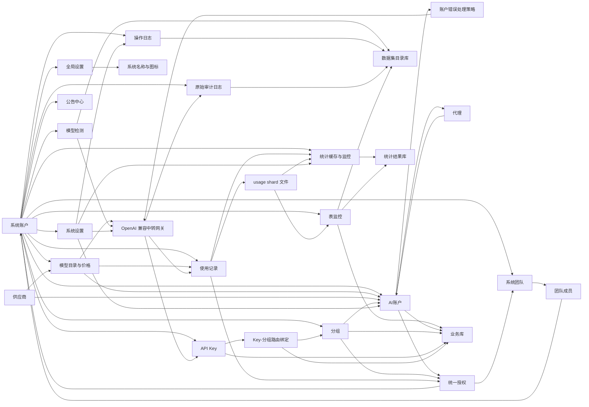

# 整体架构设计

## 文档边界

本文只说明 `juhe-ai` 的产品目标、技术选型、模块边界、跨模块关系和架构约束，不承载具体页面字段、接口清单、默认参数、实现细节或功能验收要求。

具体功能设计、字段说明、接口优先级、运行策略、存储细节和专题调研统一沉淀在 `docs/functions/`，入口见 [功能文档目录](../functions/README.md)。如果功能变化只影响某个模块实现，应优先更新对应功能文档；只有影响模块边界、数据关系、权限安全或网关主链路时，才同步调整本文。

## 产品目标

`juhe-ai` 定位为轻量、易扩展的本地 OpenAI 兼容中转与账号调度系统。它让客户端长期固定连接一个本地入口，把多套中转地址、多组上游账号、多服务商入口和代理策略统一放到后台调度。

系统优先保证：

- 客户端入口稳定：客户端可配置本服务根地址或 `/v1` 地址，并使用本地 API Key。
- 会话体验连续：尽量避免用户频繁切换 Base URL、API Key 或服务商。
- 上游自动切换：账号或首选号池异常时，先按 API Key 号池路由策略选择可用分组，再在分组边界内选择可用账号。
- 来源级影响隔离：同一客户端 IP 对某个账号出现未确认失败且后续账号成功时，可在短 TTL 内只让该来源避让该账号，继续自动切到同分组其他可用账号。
- 来源级错误止损：认证前缺失 Bearer / 无效 token 探测或认证后来源持续制造高置信本地请求错误时，可短 TTL 本地熔断，避免继续消耗认证校验、账号池和网关调度资源；该机制禁止区域性封禁和固定状态码 / 错误码黑名单。
- 高并发体验可控：同一个 API Key 大量并发调用时，可通过高并发分组在分组边界内协调账号负载，减少单账号排队导致的长时间无响应。
- 集中可观测：请求、用量、错误、命中账号和原始链路审计应能被统一记录和追溯。

整体模块已经围绕 OpenAI 账号接入、统一授权、网关调度、统计审计和运维排障形成闭环；默认部署继续保持单机轻量。后续多节点部署只在显式开启分布式配置后进入，首期按“无副本用户分片 + 控制面选主 + 自动路由”推进，避免把当前闭环一次性演进成重型分布式数据库。

## 技术架构

- 前端：Vue 3 + TypeScript + Ant Design Vue。
- 后端：Node.js + TypeScript。
- API 风格：REST 优先；后续实时状态能力再按需补 WebSocket 或 SSE。
- 对外中转协议：客户端入口按 OpenAI-compatible 形态暴露，支持根路径和 `/v1`；`openai/v1` 是协议层语义，`provider_code = openai` 是通用 OpenAI-compatible 供应商语义，二者通过字段所在层级区分。当前内置供应商为 `openai`、`gpt`、`anthropic`、`deepseek` 和 `glm`；`anthropic` 官方直连供应商使用原生 `anthropic/v1` Messages 协议，不能和第三方 Anthropic-compatible 入口混在一个档案里；`glm` 智谱供应商同时包含通用 OpenAI Chat Completions 档案、GLM Coding OpenAI Chat Completions 档案和 GLM Coding Anthropic Messages 档案，必须按不同供应商协议档案隔离；`deepseek` 供应商同时包含 OpenAI-compatible Chat Completions 档案和 DeepSeek Anthropic-compatible Messages 档案，二者按不同 `provider_protocol_profile_id` 和账户接入类型区分。`gpt.parent_code = openai`，继承通用 OpenAI v1 能力并叠加 GPT / Codex 专属能力。通用 OpenAI 兼容 API Key 账号、GPT API Key 账号、Anthropic 官方 API Key 账号、GLM API Key 账号和 DeepSeek API Key 账号按各自上游入口透传，GPT OAuth 账号只支持 Codex adapter 明确列出的 Responses 路径；Anthropic OAuth / Setup Token / Claude Code token 账号链路不纳入当前目标，Claude Code 只作为下游客户端画像，可在官方 Anthropic API Key、DeepSeek Anthropic-compatible API Key 或 GLM Coding Anthropic-compatible API Key 的 `anthropic/v1` 档案内生效，但不能让多个供应商共用账号池、默认分组、模型目录或价格目录；模型目录上，`openai` 作为通用 OpenAI-compatible 聚合目录，会聚合支持 OpenAI 协议的 GPT、DeepSeek、GLM 和自身模型，用于未深度接入但兼容 OpenAI 协议的临时接入；`gpt`、`anthropic`、`glm` 和 `deepseek` 专用供应商目录仍只看各自供应商模型，Anthropic / Messages 模型不进入 `openai` 聚合目录。
- 存储：SQLite，当前按业务库、数据集目录库、使用记录目录库、统计结果库和分片文件运行；业务库保存可恢复核心业务数据，必须在迁移和恢复时保留；数据集目录库保存审计、操作日志、公开接口日志、运行日志索引、模型检测和清理目标；使用记录目录库保存 usage shard 注册表、列表筛选目录和账号 / API Key scope catalog；新写入的 `usage_records` 已按日期与稳定 hash 拆到多个本地 SQLite shard 文件；统计结果库保存统计缓存、额度窗口、账号质量、系统监控、表监控历史和 `stats_job_state`。数据集目录库、使用记录目录库、usage shard 和统计结果库都可以按需要丢弃、清空或重建，具体见 [数据集库分片写入设计](../functions/数据集库分片写入设计.md)。
- 敏感数据：OAuth token、上游 API Key、本地网关 API Key 和代理密码必须按安全边界处理。
- 版本边界：当前项目以最新完整模型为准；出现当前 schema 之外的数据、配置、库结构或状态问题时，由用户按当前 schema 借助 AI 生成一次性离线修复方案，或重建对应数据域。后端、前端、repository、启动路径和网关主链路只维护当前数据契约。
- 运行形态：默认单机部署下，Web/网关主进程、`worker` 控制 / fallback 进程、`metrics-worker`、`ingest-worker`、`stats-worker`、`snapshot-worker`、`probe-worker`、`maintenance-worker` 和本地 DB service 进程分离；使用记录、审计、操作日志、公开接口日志、运行日志索引、模型检测记录、记录维护和数据保留期 dataset / usage shard 清理由 `ingest-worker` 串行执行；系统采样、增量统计、重窗口快照、账号质量、表监控和统计保留期清理由 `stats-worker` 串行写统计库；`metrics-worker`、`snapshot-worker` 保留为常驻隔离角色但不能直接写统计库；正常账号健康检测、账号 / 代理 / OAuth 探测和手动 AI 账户测试必须在 `probe-worker` 内执行；业务库维护写回由 `maintenance-worker` 生产 typed command 后交给 DB service 执行，系统管理 API 与网关业务库读写由 DB service 承接。DB service 只拥有业务库写锁；在 DB service 内触发的数据集目录库或统计结果库写入必须转发给 ingest / dataset writer 或 stats writer，不能在管理路由中直接写非所属库。分布式模式作为显式配置能力，新增控制面 leader、节点心跳、用户 home node 路由和节点内部转发；具体边界见 [分布式部署与用户分片设计](../functions/分布式部署与用户分片设计.md)。
- 公开接口运行形态：`/__aipublic__/*` 当前仍由主 Web/网关进程代理到 DB service。独立 `public-api` 进程和独立端口方案已评估但暂不实施，后续只有在公开接口流量或公网暴露强度明显上升时再参考 [公开接口独立进程设计](../functions/公开接口独立进程设计.md) 重启评估。
- 大文件和频繁文件读取是项目级性能底线：运行日志、审计 payload、导入导出文件和其他持续增长文件必须按 offset / cursor / stream / 分块窗口处理，不能在运行路径里完整读入内存再切割；追增量任务必须持久化游标并在轮转或截断时重置。

## 协议接入五层核心模型与客户端策略层

系统从架构上把“协议”和“供应商”拆开，避免 Anthropic、Gemini、Claude Code、DeepSeek 或其他 OpenAI-compatible 厂商接入时和当前 GPT 逻辑打架。

代码实现必须进一步通过供应商驱动标准约束落点：协议形态进入 `ProtocolDriver`，账号凭据、上游 URL、endpoint mode 和账号测试进入 `ProviderDriver`，模型目录、usage 语义和计费进入独立模型 / 计费驱动，前端展示进入 provider capability adapter。具体接口、代码落点和新增供应商清单见 [供应商驱动分层规范](供应商驱动分层规范.md)。

内部核心模型按五层表达：

| 核心层级 | 当前字段 / 概念 | 说明 |
| --- | --- | --- |
| 协议 | `protocol_code` | 表示接口协议族，例如 `openai`、`anthropic`、后续 `gemini`。协议不是账号池供应商。 |
| 协议版本 | `protocol_version` | 表示协议版本，例如当前 `openai/v1`。 |
| 端点族 | `protocol_endpoint_families.family_code` | 表示同一协议下的接口形态，例如 OpenAI v1 的 `chat_completions`、`responses`。 |
| 账户接口能力 | `credentials.supported_endpoint_modes` | 表示某个上游账户实际支持的端点族与传输形态组合，例如 `chat_json`、`chat_sse`、`responses_json`、`responses_sse`；网关调度和账户测试必须按该矩阵筛选账号。 |
| 供应商 | `provider_code` | 表示账号池、模型目录和价格目录归属；当前内置 `openai` 通用 OpenAI-compatible 供应商、`gpt` 子供应商、`anthropic` 官方 Claude 供应商、`deepseek` 供应商和 `glm` 智谱供应商。`openai` 同时可以是协议代码和供应商代码，但必须通过 `protocol_code` / `provider_code` 字段区分。 |
| 供应商协议档案 | `provider_protocol_profile_id` | 把供应商和协议版本绑定成一个可调度能力档案，例如 `profile_gpt_openai_v1`。账户、分组和账号测试都必须落到该档案。 |

客户端策略是运行时附加层，不作为供应商或协议档案本身的替代项。`client_compatibility` 用于描述下游客户端工具体验、请求体归一化、SSE 失败事件、上下文恢复等客户端侧策略；它不再作为 OpenAI `responses -> chat_completions` 协议转换的唯一开关。候选账号筛选和上游请求准备同时看请求端点族、账户协议档案、账户真实能力和显式模型映射；客户端画像只补充工具体验，不替代协议档案或模型映射。

当客户端协议和上游真实能力不一致时，协议转换必须作为共享 adapter 落在 provider driver 可复用边界内，而不是写成某个供应商的私有分支。OpenAI 协议档案下的 `responses -> chat_completions` 只能由账号模型映射显式触发，映射保存 `sourceModel + sourceEndpointFamily -> upstreamModel + upstreamEndpointFamily`；当前支持 `responses -> chat_completions`，不支持 `chat_completions -> responses`。账户 `supported_endpoint_modes` 仍保存真实上游能力，例如 `chat_sse`，不要为了桥接把账号伪装成原生 `responses_sse`。

当前已落地四个 OpenAI v1 档案和三个 Anthropic v1 档案：`profile_openai_openai_v1` 表示通用 `openai` 供应商使用 OpenAI v1 协议，承载 API Key 透传、OpenAI v1 聚合模型目录和通用协议策略；`profile_gpt_openai_v1` 表示 `gpt` 子供应商使用 OpenAI v1 协议，继承通用 OpenAI-compatible 能力，并叠加 GPT OAuth、Codex Responses、Codex 客户端策略和 GPT 自身模型目录优化；`profile_deepseek_openai_v1` 表示 DeepSeek OpenAI-compatible Chat Completions 档案，默认 Base URL 为 `https://api.deepseek.com`；`profile_deepseek_anthropic_v1` 表示 DeepSeek Anthropic-compatible Messages 档案，默认 Base URL 为 `https://api.deepseek.com/anthropic`，使用 `anthropic/v1` 协议语义但仍归属 `provider_code = deepseek`；`profile_anthropic_anthropic_v1` 表示官方 Anthropic Claude 原生 `anthropic/v1` Messages 档案，当前只允许 `api_key` 账号类型，Anthropic OAuth / Setup Token / Claude Code token 账号链路不纳入当前目标，Claude Code 下游客户端画像通过显式本地 header 识别；`profile_glm_general_openai_v1` 表示智谱通用 GLM API 的 OpenAI Chat Completions 档案；`profile_glm_coding_openai_v1` 表示 GLM Coding Plan 的 OpenAI Chat Completions 档案；`profile_glm_coding_anthropic_v1` 表示 GLM Coding Plan 的 Anthropic Messages 档案，默认 Base URL 为 `https://open.bigmodel.cn/api/anthropic`，使用 `anthropic/v1` 协议语义但仍归属 `provider_code = glm`。后续即使新增另一个同样使用 OpenAI v1 或 Anthropic v1 的供应商，也必须新增自己的 `provider_code` 和 `provider_protocol_profile_id`，不能和 GPT、Anthropic、GLM 或 DeepSeek 共用账号池、分组或价格目录；OpenAI 协议档案供应商的模型可进入通用 `openai` 聚合目录，供通用 OpenAI-compatible 账号和模型映射左侧模型池使用；官方 Anthropic 原生档案只进入自身供应商目录，DeepSeek Anthropic-compatible 只进入 DeepSeek 目录，GLM Coding Anthropic-compatible 只进入 GLM 目录，三者都不进入 `openai` 聚合目录。

响应语义检查策略也遵循这条分层：语义核心可以跨协议复用，但协议字段解析必须落在具体协议适配器里。协议层策略只表达 OpenAI v1、Anthropic native 或后续其他协议自己的通用响应语义；供应商层策略表达 GPT、DeepSeek、GLM、Kimi 或其他供应商在所选协议档案下的局部优化；账户追加规则是最低级供应商处理，因为一个账户只能绑定一个供应商。当前已落地的流式拦截策略只作为旧版本 `200 + SSE` 专项能力保留文档记录；新版本响应语义检查直接替换旧 SSE 拦截器、旧策略表和旧账户字段，不做历史配置迁移或运行时兼容。后续覆盖 OpenAI v1 Chat / Responses、Anthropic native Messages、SSE / JSON、客户端非流式但上游流式或上游强制返回 JSON 时，必须按统一响应语义帧实现，不能把能力绑定到客户端必须开启 `stream`。后续 Anthropic、Gemini 等只有具备独立协议形态时才进入独立协议层；仍使用 OpenAI v1 的国内或自建中转优先作为供应商层处理。

用户侧账户创建流程按“供应商 -> 账户类型 -> 凭据与调度配置”展开；页面不直接展示内部供应商协议档案 ID，但可以用“接入类型 / 客户端兼容”文案承接不同档案选择。内部流程由后端根据供应商和接入类型解析 `provider_protocol_profile_id`，并据此决定端点族、账户类型、测试策略和调度边界。分组同样绑定一个供应商协议档案；账户只能加入相同 `provider_protocol_profile_id` 的分组。API Key 可以绑定多个供应商协议档案分组，但运行时只在当前 Key 已绑定的有界分组集合内调度：普通路由请求带 `model` 时优先在当前 Key 已绑定账号池内匹配账号级模型映射；无映射命中时再用模型目录在当前 Key 绑定供应商集合内唯一命中目标供应商，并只在该供应商档案的绑定分组内执行 API Key 路由策略；无法明确定位时返回本地错误，不猜测全局账号池，也不继续落到默认分组。

网关代码必须把“请求进入上游前”和“上游返回后”分开维护。请求侧只包括入口保护、认证预检、请求体保护、请求上下文、授权额度、协议 / 客户端画像、候选账号筛选、调度运行态、账号派发保护和上游请求准备；返回侧才处理响应头复制、上游传输解码、协议适配、SSE / JSON 响应语义检查、usage 解析、下游协议渲染和响应后的账号副作用。OpenAI v1 适配器覆盖 Chat / Responses；Anthropic native、Gemini native 或其他原生协议必须使用自己的协议适配器，不能复用 OpenAI v1 字段路径。请求侧分层和代码落点见 [请求处理分层设计](../functions/请求处理分层设计.md)；返回侧错误、流式、响应语义检查和账号副作用继续按 [网关错误处理完整链路](../functions/网关错误处理完整链路.md)、[网关异常重试与兜底策略](../functions/网关异常重试与兜底策略.md) 和 [响应语义检查管线设计](../functions/响应语义检查管线设计.md) 维护；[流式拦截策略配置设计](../functions/流式拦截策略配置设计.md) 只作为旧版本背景记录。

更具体的运行、存储和敏感字段规则见 [SQLite 存储说明](../functions/SQLite存储说明.md) 与 [核心功能设计](../functions/核心功能设计.md)。

## 访问控制边界

- 系统登录账号称为 `系统账户`，是后台登录、角色控制、API Key 调用方和数据隔离边界。
- `系统团队` 是多个系统账户的集合，用于承接团队级资源使用授权；团队不是资源所有者。前端菜单中的 `授权团队` / `我的授权团队` 是同一底层模型的授权场景命名，不是另一套团队实体。
- 当前保留 `super_admin`、`admin` 和 `user` 三种角色；默认仅 `admin/admin` 初始化为 `super_admin`，不默认创建普通管理员。
- `super_admin` 和 `admin` 都可以进入管理模式，查看全部系统账户、系统团队、全部业务数据、全部使用记录、全部操作日志、原始审计日志和全部系统级配置。
- `super_admin` 是唯一可以创建、编辑、停用、启用、重置密码和调整系统账户角色的角色；`admin` 在系统账户管理中只能查看列表和选项，不能写入。系统账户管理只允许把用户设为 `admin` 或 `user`，不通过页面或 API 新增、升级其他 `super_admin`。
- `super_admin` 和 `admin` 管理员账户不触发强制修改密码；带有 `mustChangePassword` 标记的普通 `user` 只能访问当前用户、修改密码和退出登录等认证路径，受保护业务 API 必须在后端拒绝。普通用户初始密码改密可直接提交新密码；普通自助改密必须校验当前密码，成功后撤销同账户其他会话。
- `user` 默认只能访问自己名下的数据；被授权的 AI 账户、分组和团队授权资源只获得使用权，不获得管理权。
- 资源授权统一由授权菜单维护，不再分散在账户页或分组页的独立授权弹窗中；管理侧 `统一授权管理` 和用户侧 `我的授权` 都必须把关系管理和消耗明细分开，`统一授权` / `授权操作` 只管授权关系，团队 / 用户消耗进入对应明细页。
- 团队授权不是网关运行时的第二套主体；团队授权进入系统后必须物化或同步到最终用户授权，网关调度只看稳定的用户级授权、调用方系统账户状态、绑定关系、授权实例或分组资源状态和额度缓存。
- AI 账户授权采用“授权实例账户”模型：授权生效后为被授权用户创建独立 `accounts` 行，使用 `authorization_instance_source_account_id` 记录原账户、`authorization_instance_authorization_id` 记录用户级授权、`authorization_instance_owner_system_account_id` 记录资源归属人。被授权用户分组绑定的是这个实例账户 ID，不再绑定归属人的原账户 ID。
- 授权实例账户和归属人原账户是两个独立运行个体，但不是两份资源配置快照。授权实例 `accounts` 行承载被授权侧本地状态、调度开关、冷却、错误、流失败窗口、授权 ID 和用量归属；真实上游资源事实仍从来源账户读取，包括账户类型、上游凭据、`base_url`、支持模型、代理、并发、可用时段和账户追加响应检查规则。归属人原账户的停用、异常、限流 / 临时不可调用、冷却、调度开关、套餐到期、删除或凭据缺失不会覆盖或回写授权实例 `accounts` 行，但会参与授权实例的 `effectiveAvailability` 实际可用性计算；来源不可用时授权实例不进入网关候选，不能开启使用侧调度标记，也不能作为迁移目标。归属人只能在授权列表里暂停、回收、到期或恢复授权关系。被授权侧在当前分组内的排序、超级优先和降级备用写入 `group_accounts.local_priority / local_super_priority_enabled / local_fallback_enabled`，只影响该使用方的该条分组绑定；`group_accounts.account_authorization_id` 只记录实例绑定对应的授权关系。授权暂停 / 过期时被授权人仍可见但不可用，回收 / 归还时被授权人不可见也不可用；授权记录不提供普通删除动作，真实账户删除和授权使用权归还是两个入口，授权实例账户不允许通过账户删除接口伪装成归还。
- 团队 / 用户授权消耗明细必须由后台 worker 增量写入专用日摘要表，并刷新最近 31 天的日范围窗口表；页面接口只能按筛选条件直读已成形范围窗口行；不能让前端拿授权列表做本地聚合，也不能在页面请求里回扫 `usage_records` 或临时 `SUM/GROUP BY` 统计缓存。
- 统计汇总是项目级性能底线：业务用量、额度判断、趋势、TopN、摘要卡片和授权报表都只能读取 worker 预聚合结果；API 请求路径不能把明细或缓存行再临时相加，表结构不够时优先新增 staged / window / summary 表并重建统计缓存。
- 团队授权美元额度必须读取 worker 写入的 `account_authorization_team` / `group_authorization_team` 作用域缓存；网关请求路径不能枚举团队成员或把成员用户授权额度临时求和。
- AI 账户状态中 `error` 统一作为“异常”硬状态，不参与调度；具体异常原因由 `last_error_code` 区分，`last_error_message` 保存排障说明。账户页可以叠加展示“账户到期”“授权到期 / 授权已失效”“授权额度已用完”等有效状态，但这些不是新的物理账户状态；状态筛选只保留“正常、待测试、停用、异常、限流中、临时不可调用”6 个入口，派生状态按 [核心功能设计](../functions/核心功能设计.md) 的账户状态筛选归类表落入现有入口。授权额度耗尽不能写入 `accounts.status = rate_limited`，状态标签仍显示“授权额度已用完”，账户列表和轻量选项的状态筛选归类到现有 `rate_limited`；只有物理上游账号触发限流策略时才把物理账户状态写为“限流中”。OAuth Access Token 后台保活不因停用、异常、限流或临时不可调用跳过，但连续 3 次刷新失败会把账户标记为异常。
- `precheck_pending`、`local_suppressed`、`half_open` 和 `precheck_failed` 只属于网关 / 探测运行态，不新增 `accounts.status` 枚举。手动账户测试和批量账户测试失败不能直接把正常账户写成 `temporary_unavailable`；应先记录测试失败结果并进入事前确认运行态，确认探针仍失败后才写持久临时不可调用并进入冷却复测。待测试账户失败继续保持 `pending_test`，停用账户失败只保留诊断，授权实例只修改被授权侧本地实例状态，不回写授权方原账户。
- 用户侧业务数据写入和查询必须走 `/__aisys__/api/my-*`，以后端登录态决定当前用户作用域，前端不传系统账户归属字段。
- 管理侧业务数据走 `/__aisys__/api/*` 管理入口并显式要求 `super_admin` / `admin`；管理员如果筛选某个系统账户，读写作用域必须一致，不能落到当前管理员自己的默认作用域。
- 登录态、系统账户管理、系统团队、登录验证码和失败防护等具体要求见 [核心功能设计](../functions/核心功能设计.md) 与 [系统团队与统一授权设计](../functions/系统团队与统一授权设计.md)。

## 设置分层

- `global_settings`：平台全局配置，承载系统名称和系统图标路径；未登录也需要可读，只允许 `super_admin` / `admin` 修改。
- `system_settings`：系统运行策略，按默认超级管理员作用域保存为全局单例，只允许 `super_admin` / `admin` 修改；仅保存当前白名单内的网关、后台管理 API 限流、后台任务、操作日志和数据保留策略；原始审计日志捕获、成功采样、队列和正文保全策略固定在后端，不进入系统设置。
- 登录页标题、角标、副标题和视觉边界见 [产品与品牌边界](frontend/产品与品牌边界.md)。
- 网关调度默认值、统计任务参数、OAuth Access Token 预刷新参数、OAuth 额度快照被动更新口径、操作日志配置、原始审计捕获边界和审计保全策略见 [核心功能设计](../functions/核心功能设计.md)、[SQLite 存储说明](../functions/SQLite存储说明.md)、[操作日志设计](../functions/操作日志设计.md)、[原始审计日志设计](../functions/原始审计日志设计.md) 与 [审计日志保全策略设计](../functions/审计日志保全策略设计.md)。

## 模块总览

## 模块边界

| 模块 | 架构职责 | 具体设计文档 |
| --- | --- | --- |
| 系统账户 | 登录身份、角色权限和数据隔离边界 | [核心功能设计](../functions/核心功能设计.md) |
| 系统团队 | 归纳多个系统账户，承接团队级资源使用授权 | [系统团队与统一授权设计](../functions/系统团队与统一授权设计.md) |
| 协议与供应商 | 协议描述接口形态，供应商描述账号池、模型目录和价格目录归属，供应商协议档案绑定两者并约束账户 / 分组 / API Key 号池边界 | [核心功能设计](../functions/核心功能设计.md)、[OpenAI 账号接入](../functions/OpenAI账号接入.md) |
| 模型目录与价格 | 汇总内置模型、管理员全局自定义模型和用户个人自定义模型，支撑 `/v1/models`、价格估算、账号支持模型和账号模型映射 | [自定义模型与模型映射设计](../functions/自定义模型与模型映射设计.md)、[厂商模型目录更新与清洗指南](../functions/厂商模型目录更新与清洗指南.md)、[模型价格与用量统计口径](../functions/模型价格与用量统计口径.md) |
| AI 账户 | 承载上游凭据、状态、调度属性和可授权使用资源 | [核心功能设计](../functions/核心功能设计.md)、[OpenAI 账号接入](../functions/OpenAI账号接入.md) |
| 分组 | 调度资源集合和 API Key 可访问号池边界；分组绑定供应商协议档案，只接收同档案账户；按类型区分个人轻量调度和高并发协同调度 | [核心功能设计](../functions/核心功能设计.md)、[高并发分组调度设计](../functions/高并发分组调度设计.md) |
| 统一授权 | 将 AI 账户或分组的使用权授权给系统账户或系统团队 | [系统团队与统一授权设计](../functions/系统团队与统一授权设计.md)、[SQLite 存储说明](../functions/SQLite存储说明.md) |
| API Key | 对外访问密钥，可绑定一个或多个调用方自有分组号池，并按 API Key 路由策略选择候选号池 | [核心功能设计](../functions/核心功能设计.md)、[API Key 多分组路由设计](../functions/APIKey多分组路由设计.md) |
| 模型检测 | 对 AI 账户执行目标模型可信度检测，复用网关链路并保存有界诊断记录 | [模型检测设计](../functions/模型检测设计.md)、[接口契约与权限矩阵](../functions/接口契约与权限矩阵.md) |
| 代理 | 服务器级全局运维资源，供账号绑定使用 | [核心功能设计](../functions/核心功能设计.md) |
| 使用记录 | 网关请求事实源，支撑排查、统计和授权用量 | [核心功能设计](../functions/核心功能设计.md)、[SQLite 存储说明](../functions/SQLite存储说明.md)、[数据集库分片写入设计](../functions/数据集库分片写入设计.md) |
| 操作日志 | 记录系统账户对业务资源的增删改、启停、绑定、授权和配置变更，用于追溯谁改了什么以及影响了谁 | [操作日志设计](../functions/操作日志设计.md)、[安全与日志策略](../functions/安全与日志策略.md) |
| 原始审计日志 | 记录客户端请求、网关处理、上游请求、上游响应和最终返回的完整链路，并通过保全策略控制正文压缩、去重、采样和保留 | [原始审计日志设计](../functions/原始审计日志设计.md)、[审计日志保全策略设计](../functions/审计日志保全策略设计.md)、[安全与日志策略](../functions/安全与日志策略.md) |
| 统计缓存与监控 | 从使用记录增量汇总，降低列表和图表读取成本，支撑用量统计、统计概览、AI 账户性能趋势和主机监控 | [核心功能设计](../functions/核心功能设计.md)、[SQLite 存储说明](../functions/SQLite存储说明.md)、[AI 性能监控设计](../functions/AI性能监控设计.md) |
| 表监控 | 采样业务库、数据集目录库、使用记录目录库和统计结果库的文件大小、空闲页、表大小、可用历史行数和增长趋势，用于发现异常增长和容量风险；usage shard 文件集合观测仍在后续增强阶段 | [表数据监控设计](../functions/表数据监控设计.md)、[SQLite 存储说明](../functions/SQLite存储说明.md) |
| 账户错误处理策略 | AI 账户 `credentials.error_handling_rules` 内维护上游非 2xx 错误命中后的账户副作用 | [OpenAI 账号接入](../functions/OpenAI账号接入.md)、[核心功能设计](../functions/核心功能设计.md) |
| 公告中心 | 面向所有登录用户展示平台公告，并由管理员维护发布内容 | [公告中心设计](../functions/公告中心设计.md) |
| 中转网关 | 校验 API Key、选择可承接分组号池和分组内账号、转发请求并记录结果 | [核心功能设计](../functions/核心功能设计.md)、[API Key 多分组路由设计](../functions/APIKey多分组路由设计.md)、[中转透传机制调研与定位修正](../functions/中转透传机制调研与定位修正.md) |
| 分布式控制面 | 显式分布式模式下维护节点状态、leader 选举、用户 home node、API Key 路由索引、集群 worker 归属和集群状态观测 | [分布式部署与用户分片设计](../functions/分布式部署与用户分片设计.md) |
| 幂等与唯一约束 | 防止管理端重复提交、重复创建和重复业务关系，固定内存防重复提交、业务唯一键和数据库唯一约束边界 | [幂等与唯一约束设计](../functions/幂等与唯一约束设计.md)、[SQLite 存储说明](../functions/SQLite存储说明.md) |
| 接口契约与权限 | 管理 API、网关 API、响应结构、错误语义和权限矩阵 | [接口契约与权限矩阵](../functions/接口契约与权限矩阵.md) |
| 响应语义检查策略 | 通过协议适配器将 OpenAI v1 Chat / Responses 或后续其他协议的 SSE / JSON / 原生流返回抽取为统一响应语义帧，并在写下游前后按策略处理污染文本、流内错误和异常完成状态；旧流式拦截只作为历史背景 | [响应语义检查管线设计](../functions/响应语义检查管线设计.md)、[流式拦截策略配置设计](../functions/流式拦截策略配置设计.md) |
| 安全与日志 | 敏感字段、凭据展示、请求快照、日志脱敏和保留策略 | [安全与日志策略](../functions/安全与日志策略.md) |

## 核心关系

- 系统账户是登录、调用方和隔离边界；业务数据默认归属某个系统账户。
- 系统团队归纳多个系统账户，只承接使用授权，不改变资源归属。
- 全局设置属于平台公开展示资源；系统设置属于平台运行策略，影响网关、后台任务、操作日志和数据保留；原始审计捕获和正文保全策略固定启用，不作为系统设置项暴露。
- 供应商定义账户创建方式和能力边界；账户必须归属某个供应商。
- 模型目录与价格是网关调度和计费的前置事实：内置模型来自官方目录，管理员可维护全局自定义模型，用户可维护个人自定义模型；`/v1/models`、账号支持模型、模型检测候选、账号模型映射和成本估算都必须从调用方可见的本地模型目录读取。普通 OpenAI-compatible `/v1/models` 返回标准 `object/list + data`，Codex 模型刷新请求返回同一目录派生出的 `{ models: ModelInfo[] }`，这是客户端响应形态分支，不新增模型目录来源。普通跨供应商 API Key 请求带 `model` 时，先在该 Key 已授权账号池内按账号映射匹配 `sourceModel + sourceEndpointFamily`；映射未命中时，再用请求 `model` 在该 Key 已绑定供应商范围内做有界目标档案收窄。PLAN-0044 继续推进客户端模型名全系统唯一和全局模型路由事实，避免通过个人 / 全局 / 内置目录覆盖式去重导致路由不确定。账号模型限制在候选账号池内参与账号候选排序：直接支持请求模型的账号优先，其次是模型映射命中的账号，最后是未声明模型限制的账号；账号模型映射命中后把客户端模型和协议改写为上游模型和协议，并在使用记录中同时保留下游模型、上游模型和实际计价模型。
- AI 账户承载上游资源事实和自有账户调度属性，可以通过统一授权授权给系统账户或系统团队使用；账户授权会创建被授权人的授权实例，实例状态独立，运行时资源事实从来源账户补齐。
- 分组汇总同供应商协议档案账户，是 API Key 可访问的号池边界；个人分组保持轻量稳定调度，高并发分组面向同一个 API Key 大量并发时的账号负载协调。
- 分组和分组之间保持容器隔离。API Key 绑定多个分组时，可以在真实派发前按 API Key 级策略做主备、轮询或权重入口选择，但仍不做跨分组账号混排、跨分组借号、共享分组队列或共享分组等待状态；普通上游失败和已写下游输出后的失败不做服务端透明重放，只有配置化响应检查在写下游前命中、允许服务端重试且当前号池账号耗尽时，才可按本次候选顺序尝试后续分组。新版本响应检查同时覆盖 OpenAI v1 Chat / Responses 的 JSON 和 SSE 场景；旧 `200 + SSE` 流式拦截不作为新版本兼容边界。
- 设计心智模型固定为：API Key 类似域名，分组类似 IP / 容器。多个分组绑定同一个 API Key 后，等价于这个 Key 背后有多个按策略排列的号池容器；网关只协调容器先后，不把账户能力、账户状态、物理并发、短期屏蔽、质量分、账户错误处理策略或会话亲和按分组重做一套。
- 分组是调控维度，账户是资源维度；分组只负责号池分配、路由顺序和容器级等待策略，不能改变账户能力、凭据、代理、状态、冷却、并发、质量、账户错误处理策略或亲和语义。
- 资源所有权、本地绑定和授权使用权必须分开理解：`accounts.system_account_id` / `groups.system_account_id` 表示当前资源行所属系统账户；`group_accounts.system_account_id` 表示某个使用方把账户加入自己的本地分组；`resource_authorizations` 表示授权方授予使用方的稳定使用权。AI 账户授权生效时会为被授权人创建独立账户实例，实例拥有自己的状态、冷却、错误、分组绑定和统计口径；分组内排序、超级优先和降级备用属于 `group_accounts.local_*` 绑定事实；上游凭据、模型能力、代理、并发、可用时段、账户错误处理策略和账户追加响应检查规则从来源账户补齐。归属人原账户的运行态不管理也不回写授权实例，但来源账户可用性是实际调度硬条件：来源停用、异常、限流 / 临时不可调用、冷却未结束、关闭调度、套餐到期、删除或凭据缺失时，授权实例保留自己的历史和本地状态，同时 `effectiveAvailability` 标记为来源侧阻断并退出候选。授权实例实际可用性由权限、本地绑定、最终用户授权、额度、来源账户可用性、授权实例本地状态、账户错误处理策略和网关运行态共同决定。
- API Key 可以绑定调用方自己的一个或多个分组，也可以绑定有效授权给调用方的分组，绑定分组可以来自不同供应商协议档案。当前请求进入后，普通路由先在已绑定分组的账号池内尝试账号模型映射，让 DeepSeek / GLM 等 OpenAI 协议账号可以承接 GPT / Codex 客户端模型名；没有映射命中时再按请求 `model` 尝试筛出目标供应商协议档案分组，并在目标分组集合内按主备、轮询或权重策略选号池。请求带 `model` 但无法通过映射或目录明确定位目标时返回本地错误，不继续使用默认分组。授权暂停、过期、回收、归还或额度不可用时，授权分组绑定配置保留但运行态不可用。
- 模型检测是排障和可信度诊断能力，不直接证明上游物理模型身份；用户侧检测当前用户可使用的 AI 账户，管理侧默认可查看和检测全部系统账户作用域内可管理或可见的 AI 账户，也可按系统账户筛选收窄；可由用户选择可信对比账户做同探针集对照，并在开启可信对比时额外执行隐藏分布相似度对照；检测必须复用本地网关链路，产生的模型请求按既有使用记录、额度和审计规则处理，检测报告只保存脱敏、有界摘要。
- API Key 是一次性接入凭据；列表展示累计用量，可配置 n 小时、日、周、月和总美元成本额度。API Key 生命周期分为停用、业务删除和记录物理清理：停用立即拒绝调用但保留关系；业务删除同步提交并让后续请求立即不可用；历史使用记录进入 usage shard 清理目标，原始审计日志和审计错误组进入数据集目录库清理目标，统计缓存、额度窗口和范围 / 排行窗口由统计结果库反向扣减，不承诺在删除接口内强一致完成；队列投递失败时只保留目标等待后台重试，删除接口不能在 API 进程同步扫描 usage shard、数据集目录库或统计结果库。
- 代理是服务器级运维资源，不属于普通用户私有配置；代理质量检测以已启用供应商默认地址为目标，最近状态和延迟作为运维参考缓存。
- 公告中心是全员只读、管理员维护的轻量通知模块；用户侧只读取已发布公告，管理员侧负责新增、编辑、发布、下线和删除。
- 使用记录是计量和统计事实源；统计缓存只做读优化，不能替代事实记录。
- 业务库、数据集目录库、使用记录目录库、usage shard 和统计结果库是当前明确边界：系统账户、账户、分组、API Key、授权、公告、设置等可恢复业务数据在业务库；新写入的使用记录进入 usage shard 文件，usage shard 注册表和筛选目录进入使用记录目录库；审计、日志、操作日志、模型检测明细和清理目标进入统计数据集目录库；统计桶、额度窗口、范围窗口、排行快照、账号质量结果、系统监控采样、系统监控趋势和表监控历史进入统计结果库。默认备份只覆盖业务库和 `backend/.env`；数据集目录库、使用记录目录库、usage shard 和统计结果库属于可丢弃 / 可重建数据，只有离线取证时才额外停机备份。请求链路和 DB service 不直接写高频数据集明细，使用记录、审计和日志索引等高频写入应投递 background worker 队列；独立 worker 作为消费端负责批量落库、统计聚合、采样和清理。为解决单个数据集目录库文件的 SQLite 写锁上限，`usage_records` 分片写入设计已把统计数据集域扩展为数据集目录库、使用记录目录库和多个 usage shard 文件，但不改变业务库和统计结果库的职责。
- AI 账户性能趋势从使用记录的小时级统计缓存读取；用户侧只看当前用户自己的账户行，包含自有账户和授权实例账户，归属人原账户不混入授权实例调用；管理侧可按系统账户筛选或读取全局账户缓存。页面默认日期范围为最近 3 天，默认账户池取最近 7 天活跃前 10；搜索追加账户和点击筛选只影响本次查看，不持久化为偏好或运行策略。
- 操作日志是业务状态变更追溯事实，记录成功的增删改、启停、绑定、授权和配置变更；查询、列表、筛选、详情查看和日志查看不属于操作日志。业务写入提交成功后再把操作日志投递给 background worker，不能为了记录日志阻塞或回滚已提交业务变更。
- 操作日志按影响用户预计算可见范围：普通用户只能查看自己发起、自己资源、自己授权关系、自己团队关系或全局影响相关的安全摘要；管理员可以查看全部操作日志。
- 管理端写操作必须通过前端防连点、后端内存短 TTL 防重复缓存和数据库业务唯一约束兜底，前端重复点击或网络重试不能创建重复业务数据；重复提交拦截不能写第二条操作日志。
- 原始审计日志是排障数据；完全成功请求默认先进入最近 1 小时热保留窗口，支持按原始内容检索排障，超过热窗口后只保留 10% 稳定采样；失败、异常、客户端中断、流式中断和重试后成功链路必须保留。正文内容按保全策略压缩、去重和定期清理；它和使用记录分表管理，不参与用量统计。
- 统计数据集域写入不允许在网关主链路或 DB service 管理请求中同步写库；使用记录写入 usage shard，usage shard 定位和筛选目录写入使用记录目录库，操作日志、原始审计日志、公开接口日志和运行日志索引写入数据集目录库，这些 append-only 写入只能投递 `ingest-worker` 后由 ingest 队列批量落库；常规数据集维护动作也由 `ingest-worker` 分批清理，涉及统计库的部分再投递 `stats-worker`。统计结果库只承载 worker 预聚合、低频采样和查询结果刷新。API Key 删除后的关联记录清理必须先登记待清理目标，优先投递 ingest 维护队列；投递失败时只记录待重试状态，不能在当前 API 请求进程同步清理 usage shard、使用记录目录库、数据集目录库或统计结果库。进程重启导致队列中的统计数据集域事实丢失或维护延迟是可接受边界，业务库数据仍必须同步提交保证安全。
- 授权只传递使用权，不传递管理权，也不能绕过敏感凭据隔离；授权消耗统计不包含资源归属人自己的自用消耗。统一授权可配置 n 小时、日、周、月和总美元成本额度，避免被授权用户或团队超额使用共享资源。同一资源同一被授权目标再次授权时复用原授权记录，避免用量、绑定和操作追溯被多个授权 ID 切开。
- 用户接口、管理接口、网关接口和权限摘要必须遵循统一契约；敏感字段、日志和请求快照必须遵循安全策略。
- 分布式模式下，系统账户是用户数据分片键；每个系统账户拥有唯一 `home_node_id`，该用户的 AI 账户、分组、API Key、使用记录、统计、审计和操作日志都写入 home node。API Key 请求打到非 home node 时，只能通过全局路由索引流式转发到 home node；转发节点不写业务事实。第一阶段 `replicationFactor = 1`，home node 故障时对应用户不可用，不自动漂移。跨节点统一授权、用户自动迁移和副本自动接管都属于后续独立设计。

## 后台任务隔离

- 主 Web 进程只承载系统后台静态资源、系统 API 反向代理、OpenAI 兼容网关、健康检查和必要的请求内状态维护。
- 后台任务按 SQLite writer owner 隔离：`ingest-worker` 承载使用记录、操作日志、公开接口日志、运行日志索引 flush、运行日志文件导入、审计日志批量落库、记录维护队列和 dataset / usage shard 保留期清理；`stats-worker` 承载系统指标采样落库、用量聚合、IP 聚合、分组账户统计缓存、TopN、概览、范围窗口、授权窗口、系统趋势窗口、账号质量刷新、表数据监控采样和统计保留期清理；`probe-worker` 承载 OpenAI OAuth Access Token 保活、手动 AI 账户测试、正常账号健康检测、代理检测和冷却账号复测；`maintenance-worker` 只负责业务库维护类 typed command 的调度协调，例如授权到期扫描、可用性时间计划同步和过期逻辑删除账号清理；`metrics-worker`、`snapshot-worker` 保留常驻拓扑和控制响应，不得直接写统计库。OpenAI OAuth 额度快照由真实网关响应头被动写入，不再作为后台主动刷新任务。
- 后台任务必须在独立 Node worker 进程内注册、调度和执行；调度框架只允许运行在对应 worker 进程内，不能通过 IPC 或回调让主进程代执行任务函数。
- 主进程可以启动、看护和重启 worker，也可以把请求链路产生的轻量消息投递给 worker，但不能导入后台任务实现并直接调用。
- worker 角色隔离不等于同库并发写入许可；同一个 SQLite 文件必须只有一个写 owner / writer 队列。业务库写入归 DB service，数据集目录库和使用记录目录库写入归 ingest / log writer，统计结果库写入归 stats writer，usage shard 按 shard 文件串行写；具体边界见 [SQLite 单写者写队列治理设计](../functions/SQLite单写者写队列治理设计.md)。
- 当前版本不引入 Redis、Kafka 或独立分布式队列。显式分布式模式下，用户本地任务由各 data node worker 只处理本机 home users；leader 只持有集群级 worker lease，负责节点摘要合并、分片分配和控制面维护，不能扫描其他节点的使用记录明细。

## 易失运行态边界

- SQLite 保存系统账户、资源、授权、API Key、设置、使用记录、统计缓存和可追溯日志等事实；短 TTL 校验缓存、会话亲和、手动迁移目标偏向、当前并发占用、网关运行时快照、IPC 待投递队列、验证码挑战和登录失败滑动窗口属于单节点进程内易失运行态。
- 易失运行态只用于性能、体验和临时调度辅助，不能作为长期账务、权限、授权来源、账号健康或审计事实。服务重启、子进程重启、缓存淘汰或 IPC 队列溢出后，允许这些状态丢失或回到保守默认；请求路径必须重新从 SQLite 事实和预聚合缓存恢复判断。IP 级账号回避状态也属于这类短 TTL 调度态，只影响同一客户端 IP、API Key 和账号组合的候选排序，不按分组切碎；分组只是当前 API Key 的候选容器，不写账号冷却状态。认证前入口保护和认证后 IP 级错误熔断也属于短 TTL 易失运行态，只短路当前窄作用域或当前来源的高置信错误风暴，不写账号状态、不作为审计事实和长期处罚依据。
- 默认单机模式不承诺多实例共享这些进程内状态。显式分布式模式下，短 TTL 调度态、并发占用、验证码 / 登录限频和 worker 队列仍优先保持节点本地，只服务本机 home users；跨节点共享必须先写入 [分布式部署与用户分片设计](../functions/分布式部署与用户分片设计.md)，不能通过临时全局内存、请求时广播或实时扫库实现。

## 数据库服务隔离

- SQLite 仍是当前默认事实存储，不引入 PostgreSQL、Redis 或其他第三方数据库依赖；当前部署使用业务库 `JUHE_AI_DATABASE_PATH`、统计数据集目录库 `JUHE_AI_DATASET_DATABASE_PATH`、使用记录目录库 `JUHE_AI_USAGE_CATALOG_DATABASE_PATH`、统计结果库 `JUHE_AI_STATS_DATABASE_PATH` 和 usage shard 根目录 `JUHE_AI_USAGE_SHARD_ROOT`。需要处理当前 schema 之外的数据时，只能停机离线处理，不进入运行路径。`JUHE_AI_DATASET_DATABASE_PATH` 继续作为非 usage 数据集目录库，usage shard 文件和 usage catalog 位于独立使用记录数据域。
- 本地 DB service 是独立 Node 进程，用于承接系统管理 API、登录态校验、管理面 CRUD、网关高频数据库读写、公开设置读取、运行日志索引查询和账号运行态副作用，目标是避免 Web/API/网关主进程事件循环被 `DatabaseSync` 直接占用。
- DB service 不改变 SQLite 单写者边界；业务库写入由 DB service 同步执行并依赖 WAL、短事务和 `busy_timeout` 控制短写锁等待。统计数据集域高频写入从请求链路剥离到 background writer，其中 usage 明细写入 usage shard，usage 定位目录写入使用记录目录库，非 usage 明细写入数据集目录库；统计结果库写入由 stats-worker typed operation 串行提交，避免 `metrics-worker`、`snapshot-worker` 和 `maintenance-worker` 抢同一个 stats 文件。usage shard 只能由 ingest 写入；统计聚合只读取 shard，不再把派生估算字段回写原始 shard，同一个 shard 文件不得拥有多个并发 writer。
- 对外 HTTP API 和 `/v1` 协议不因 DB service 变化而改变；DB service 不可用时由 supervisor 看护重启，请求链路返回可读错误并短暂快速失败，不能回退到主 Web 进程同步执行这些 SQLite 访问，也不能拖垮主 Web 进程。
- 系统管理 API 由 DB service 内部 HTTP app 承载，主 Web 进程只把 `/__aisys__/api/*` 流式代理过去，不挂载管理路由、不解析管理 API JSON body、不直接导入 repository；客户请求链路中的 API Key 校验、网关设置读取、分组账号读取、额度缓存读取、账号状态更新、OAuth token 刷新持久化、OAuth 额度快照写入，以及 usage / audit 入队，也都不能在 server 角色本地同步读写 SQLite。

## 网关主链路

当前对外主入口是 OpenAI 兼容网关，支持根路径 `/*` 和 `/v1/*`；系统后台、管理 API、健康检查和静态资源统一在 `/__aisys__/*` 下，OpenAI `/v1` 路径归一化和 Base URL 拼接规则见 [客户端网关入口路径设计](../functions/客户端网关入口路径设计.md)。架构层只固定主链路边界：校验本地 API Key、按统计缓存判断 API Key 和统一授权本地额度、读取 API Key 分组路由绑定并按请求 `model` 尝试收窄目标供应商协议档案、按 API Key 路由策略选择可承接分组、按账户模型限制过滤候选账号、选择可调度账户、适配上游认证与请求、处理上游响应、记录使用情况、按审计策略捕获完整链路，并按账户错误处理策略和通用上游失败流程切换账号；当前模型路由只在本 Key 已绑定的有限分组和缓存账号快照内完成，已通过当前 Key 绑定供应商集合索引让同供应商集合热命中按 `model` O(1) 查询，后续全局模型路由索引用于替代当前 Key 级有界目录事实而不是扩大调度范围。API Key 级混合智能路由只作为 API Key 的入口路由模式存在，并按一次性完整闭环交付：网关在普通分组选号前调用低价评分模型得到 `1-10` 等级，按等级选择目标模型，并只在该 API Key 已绑定的真实分组池中筛选可承接分组；该能力不新增混合账户，不改变账户等于真实上游凭据的边界，且必须通过模型亲和和缓存亲和避免频繁切模型破坏上游 KV / prompt cache。标记为降级备用的账号在个人分组中只在同分组主池账号都不可用或请求失败后进入调度。高并发分组在选号时使用分组类型分支：备用账号可在主池排队、软并发已满或明显变慢时按分组策略临时启用以减少等待。API Key 绑定多个分组时，跨分组路由主要发生在调度前的号池选择阶段：当前候选分组没有正常可调度账号或调度前已明确不可承接时，才按本次候选顺序尝试后续分组；这个动作只是改选目标容器，不会把多个分组的队列、分组等待状态或分组内部策略合成一个调度域；账户能力、物理并发、短期屏蔽、亲和状态和质量分仍按真实账户共享。进入真实上游派发后，普通非 2xx 上游失败、未知请求异常和已写下游输出后的响应失败仍只在已选容器内按账号切换和账户错误处理策略处理，不做服务端透明跨分组重放；配置化响应检查在写下游前命中、允许服务端重试且当前分组账号耗尽时，可以按本次候选顺序尝试后续分组，成功后使用记录写实际命中的 `group_id`。代理运行态失败桶只在候选排序层短期避让同代理多账号短窗失败的绑定账号；进程内本地账号屏蔽在候选排序前生效，当前分组所有候选都被屏蔽时先尝试 API Key 后续分组，没有可承接分组则立即返回 `503` 并携带 `Retry-After`，不等待屏蔽释放，也不绕过屏蔽继续打问题账号。IP 级账号回避只在候选排序层短期避让“当前来源近期未确认失败、且已被后续成功账号证明可绕开”的账号，不绕过 API Key、分组、授权、模型限制、额度和账号硬状态。认证后 IP 级错误熔断位于账号调度前，只消费本地校验失败等高置信本地请求错误；上游账号池失败不计入来源熔断；命中后返回本地 `429`，不进入账号调度，也不写账号冷却。

GPT / OpenAI-compatible API Key 账户可以在同一个账户凭据内保存多个上游 API Key。账户内 Key 策略只在系统已经选中该账户后执行，默认轮询，也可按 Key 权重做平滑加权轮询；它不参与分组选号、账户候选排序、授权判断或账户并发边界，因此不会把每个上游 Key 扩展成独立 AI 账户。账户内 Key 故障隔离也只能作为账户内部运行态：当前请求命中某个 Key 且失败时，先对当前 Key 做进程内短避让并切后续账户，不在同一请求内遍历账户内全部 Key；只有跨 IP / 持续失败经过观察期，且没有近期成功证据、失败率足够高，或错误策略明确要求硬处理时，才写入全局 Key 运行态。账户整体是否可承接由账户事实和账户内已确认可用 Key 数量共同派生，具体设计见 [账户内 API Key 故障隔离设计](../functions/账户内APIKey故障隔离设计.md)。

高并发分组不把上游状态码作为默认健康事实，而是优先使用本地运行态和真实请求体验信号，例如当前并发、分组排队、首段等待、请求耗时、近期超时、质量缓存和账号软并发占用。所有上游请求异常和非成功响应都会先把当前账号加入进程内短 TTL 屏蔽并切换后续账号；状态码和错误体只作为账户错误处理策略、审计和排障输入。只有命中账户错误处理策略、流熔断、后台复测或人工操作时，才写入持久账号冷却、限流或异常状态。

“OpenAI 兼容”首先指本地客户端入口和错误结构尽量兼容 OpenAI 协议，不代表所有账户类型都具备同一组上游能力。供应商层的 `openai` 是通用 OpenAI-compatible 账号池归属，协议层的 `openai/v1` 是接口形态；AI 账户、分组、API Key 号池、模型目录和价格目录仍以供应商和供应商协议档案隔离。通用 OpenAI 兼容 API Key 账户和 GPT API Key 账户按公开 OpenAI-compatible API 透传；GPT OAuth 账户进入 Codex adapter，能力受 Codex backend 限制。具体账户类型、路径和限制矩阵见 [OpenAI 账号接入](../functions/OpenAI账号接入.md)。

网关返回侧的目标边界是统一响应语义检查，而不是要求客户端或上游必须使用流式。OpenAI v1 Chat / Responses 的 JSON 和 SSE 返回都应先由 OpenAI v1 协议适配器抽取为可见文本、错误、完成状态、usage 和有限原始 JSON path 等语义帧；后续 Claude / Anthropic native、Gemini native 或其他原生协议必须通过自己的协议适配器抽取同类语义帧。策略按当前分组 / 账户的 `protocol_code + provider_code` 读取并隔离执行；合并顺序为账户追加规则、供应商层管理端策略、协议层管理端策略、协议层默认规则。客户端请求非流式时，网关可以在写出下游前聚合有界响应并检查；若后续启用“上游强制流式、下游还原 JSON”，它也只是传输优化，不能替代 JSON 响应检查兜底。新版本不复用旧 `200 + text/event-stream` 流式拦截器、旧策略表或旧账户规则字段；历史规则由用户在新“响应检查策略”入口重新配置。实现必须遵循 [响应语义检查管线设计](../functions/响应语义检查管线设计.md) 的性能和审计边界。

网关流式转发必须按增量方式解析 SSE 状态、usage 和失败事件；成功流不应为了常规解析反复拼接完整响应体。`200 + text/event-stream` 内的协议级失败按“下游是否已经提交 / 是否已有可见输出”统一处理：下游尚未提交任何 SSE body 时优先服务端内部重试，关闭当前上游、本次请求排除失败账号，继续尝试后续账号 / 后续分组；服务端隐藏重试成功时客户端只看到后续账号成功流。未发送可见输出前不累计账号流失败，已发送可见输出后先做代理运行态归因，同代理多个账号短窗失败时只避让代理绑定账号；未形成代理证据时才进入通用流失败计数，不再维护流式错误码特征白名单。OpenAI Responses 形态 `response.failed/upstream_retryable_error` 仅在服务端可承接账号耗尽后，精确命中 Codex profile、`responses_sse` 和 `x-codex-turn-metadata.turn_id` 时作为最终可见兜底；普通 OpenAI-compatible 客户端写普通失败事件，不承诺保留下游可见原始上游错误码，也不触发 Codex turn 级切号。后续新增其他客户端 profile、失败事件格式或重试策略时，必须先落到客户端策略分层，不能写进通用网关层。非 2xx 上游错误响应不再有代码内置特征规则提前短路，也不再用请求级上游错误缓存短路；任何非成功响应都按同一流水线处理：记录失败、短期屏蔽当前账号、尝试后续账号，全部账号失败时返回网关统一 `service_unavailable` 错误。慢客户端读取时必须尊重 `res.write()` backpressure，客户端断开时应尽量关闭上游连接并释放账号并发槽。`/v1` raw body 入口硬上限当前是 `64mb`，认证预检和可提前识别的图像权限拒绝通过后才读取 body；文本 lane 业务上限为 `8mb`，超过后返回 413；图像生成 lane 保留 `64mb` 上限，避免大图像请求在本地被误拦截。API Key 上游请求体仍在上限内优先 raw bytes 原样转发。JSON body 小于等于 `256KB` 时可在主线程内联解析；超过 `256KB` 且不超过入口硬上限时只在 worker thread 做顶层结构与元数据扫描，提取 `model`、`stream`、Responses `tools/tool_choice` 图像工具信号并保留非法 JSON 早拒绝能力，其中超过 `2MB` 会按大 JSON 请求记录预警，不在主线程构造完整请求对象。只有 OAuth Codex 归一化、禁用图像权限下移除 optional `image_generation` 工具等确实需要改写请求体的路径，才进入 worker thread 完整解析，并写入对应 warning 日志。

网关 raw body 限额是产品能力和主进程保护之间的明确取舍：入口硬上限保留 `64mb` 是为了支持图像生成等真实大请求；文本请求仍通过 lane 级 `8mb` 上限保护。不要为了“主进程少分配 Buffer”把入口硬上限统一改回 `8mb`，否则会直接拦截合法图像生成请求。若后续需要收紧大请求风险，应先补独立图像上传 / 流式转发 / 更细粒度 lane 识别等方案，并用图像请求回归和性能证据验证，不能只改全局 hard limit。

API Key 和统一授权本地美元成本额度以后台统计缓存的 `total_cost_usd` 为判断依据，不在网关请求内扫描使用记录或做强一致扣减；统计任务默认每 1 分钟增量处理，由 worker 按分页窗口构建完整额度快照并被动推送到 server 进程内存，网关校验结果带短 TTL 内存缓存。请求链路不能因额度快照 miss 主动查询统计额度窗口、授权主表或团队授权表；快照尚未生成或失效时允许短时放行，快照生成后不能因为固定容量截断遗漏启用额度的对象。额度命中时网关返回 429，错误文案为“额度已用完，请联系管理员提升额度”。

GPT API Key 账号和 GPT OAuth 账号在客户端侧都可以通过根路径或 `/v1` 入口访问，但上游适配边界不同：API Key 账号按公开 OpenAI-compatible API 处理，请求体优先 raw passthrough，Header 过滤本地认证、代理链路、协议危险头、SDK / tracing 噪声和客户端传入的 OpenAI 组织 / 项目头；服务端不自动生成或暴露 OpenAI 组织、项目和 Beta 配置项，`OpenAI-Beta` 仅保留客户端显式传入的公开 API 功能语义。API Key 账号可选 `codex_responses` 兼容层只作用于 `/responses` 请求；OAuth 账号固定为 `codex_responses` 并进入内部 `openai_oauth_codex` adapter，面向 ChatGPT / Codex backend 做 endpoint 限制、请求体归一化、Header 白名单和上游会话标识隔离。会话亲和、统计和 Codex prompt cache 隔离只按本地系统账户、API Key 和客户端会话边界处理，绑定到实际命中的账户；不把分组、OAuth / API Key 类型或具体上游账号 ID 当作额外分片，避免切组或切号时无意义打散连续性。OAuth 适配器不暴露复杂前端开关，也不承诺公开 Responses API 的全部字段都能原样进入 Codex backend。

透传、请求头处理、SSE 稳定性、响应语义检查、流式兜底、账户错误处理策略、流熔断、IP 级来源保护、OAuth token 刷新、原始审计日志捕获和具体请求链路属于功能设计与实现细节，分别见 [核心功能设计](../functions/核心功能设计.md)、[请求处理分层设计](../functions/请求处理分层设计.md)、[响应语义检查管线设计](../functions/响应语义检查管线设计.md)、[网关错误处理完整链路](../functions/网关错误处理完整链路.md)、[网关异常重试与兜底策略](../functions/网关异常重试与兜底策略.md)、[IP 级账号回避与自动切号设计](../functions/IP级账号回避与自动切号设计.md)、[IP 级错误熔断与恶意请求保护设计](../functions/IP级错误熔断与恶意请求保护设计.md)、[流式中断与客户端重试调研](../functions/流式中断与客户端重试调研.md)、[OpenAI 账号接入](../functions/OpenAI账号接入.md)、[中转透传机制调研与定位修正](../functions/中转透传机制调研与定位修正.md) 和 [原始审计日志设计](../functions/原始审计日志设计.md)；[流式拦截策略配置设计](../functions/流式拦截策略配置设计.md) 只作为旧版本专项能力记录。

## 维护规则

- 本文只更新架构边界、模块关系和跨模块原则。
- 新字段、新接口、页面行为、默认值、任务参数、存储表结构和验证要求统一写入 `docs/functions/`。
- 阶段范围、里程碑或完成标准变化时，同步更新 `docs/plans/`。
- 前端页面、样式、品牌和交互边界变化时，同步更新 `docs/architecture/frontend/`。
