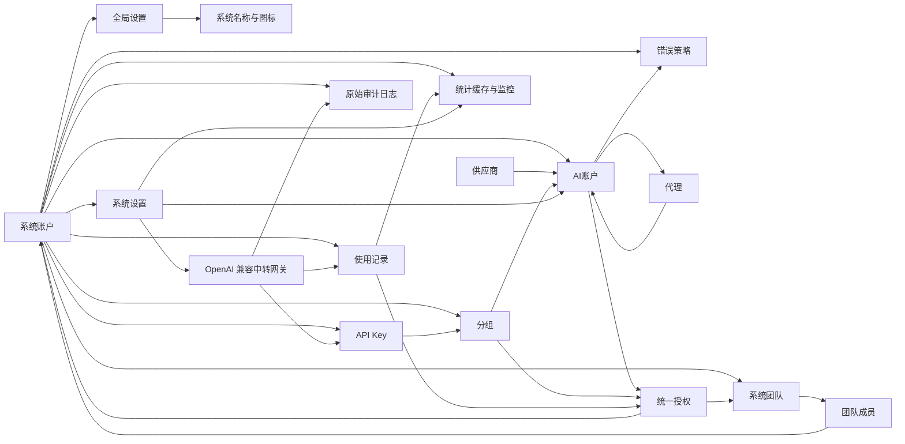

# 整体架构设计

## 文档边界

本文只说明 `juhe-ai` 的产品目标、技术选型、模块边界、跨模块关系和架构约束，不承载具体页面字段、接口清单、默认参数、实现细节或功能验收要求。

具体功能设计、字段说明、接口优先级、运行策略、存储细节和专题调研统一沉淀在 `docs/functions/`，入口见 [功能文档目录](../functions/README.md)。如果功能变化只影响某个模块实现，应优先更新对应功能文档；只有影响模块边界、数据关系、权限安全或网关主链路时，才同步调整本文。

## 产品目标

`juhe-ai` 定位为轻量、易扩展的本地 OpenAI 兼容中转与账号调度系统。它让客户端长期固定连接一个本地入口，把多套中转地址、多组上游账号、多服务商入口和代理策略统一放到后台调度。

系统优先保证：

- 客户端入口稳定：客户端只配置本服务 `/v1` 和本地 API Key。
- 会话体验连续：尽量避免用户频繁切换 Base URL、API Key 或服务商。
- 上游自动切换：账号或供应商异常时，在分组边界内选择可用账号。
- 集中可观测：请求、用量、错误、命中账号和原始链路审计应能被统一记录和追溯。

整体模块先设计完整，但每期只落必要能力，避免一开始变成重型系统。

## 技术架构

- 前端：Vue 3 + TypeScript + Ant Design Vue。
- 后端：Node.js + TypeScript。
- API 风格：REST 优先；后续实时状态能力再按需补 WebSocket 或 SSE。
- 对外中转协议：统一兼容 OpenAI `/v1` 协议。
- 存储：SQLite，优先满足单人自用、低复杂度和低运维成本。
- 敏感数据：OAuth token、上游 API Key、本地网关 API Key 和代理密码必须按安全边界处理。
- 运行形态：Web/API/网关主进程和后台任务 worker 进程分离；后台定时任务必须在独立 Node 进程内调度和执行，不能只由主进程的定时器或 cron 回调承载。

更具体的运行、存储和敏感字段规则见 [SQLite 存储说明](../functions/SQLite存储说明.md) 与 [核心功能设计](../functions/核心功能设计.md)。

## 访问控制边界

- 系统登录账号称为 `系统账户`，是后台登录、角色控制、API Key 调用方和数据隔离边界。
- `系统团队` 是多个系统账户的集合，用于承接团队级资源使用授权；团队不是资源所有者。
- 第一阶段只保留 `admin` 和 `user` 两种角色。
- `admin` 可以查看全部系统账户、系统团队、全部业务数据、全部使用记录、原始审计日志和全部系统级配置。
- `user` 默认只能访问自己名下的数据；被授权的 AI 账户、分组和团队授权资源只获得使用权，不获得管理权。
- 资源授权统一由 `授权管理` 菜单维护，不再分散在账户页或分组页的独立授权弹窗中。
- 业务数据写入和查询都必须以后端登录态决定作用域，前端不传系统账户归属字段。
- 登录态、系统账户管理、系统团队、登录验证码和失败防护等具体要求见 [核心功能设计](../functions/核心功能设计.md) 与 [系统团队与统一授权设计](../functions/系统团队与统一授权设计.md)。

## 设置分层

- `global_settings`：平台全局配置，承载系统名称和系统图标路径；未登录也需要可读，只允许 `admin` 修改。
- `system_settings`：系统账户自己的运行偏好，按 `system_account_id` 隔离。
- 登录页标题、角标、副标题和视觉边界见 [产品与品牌边界](frontend/产品与品牌边界.md)。
- 网关调度默认值、统计任务参数、OAuth 快照刷新参数和原始审计日志参数等具体配置见 [核心功能设计](../functions/核心功能设计.md)、[SQLite 存储说明](../functions/SQLite存储说明.md) 与 [原始审计日志设计](../functions/原始审计日志设计.md)。

## 模块总览

## 模块边界

| 模块 | 架构职责 | 具体设计文档 |
| --- | --- | --- |
| 系统账户 | 登录身份、角色权限和数据隔离边界 | [核心功能设计](../functions/核心功能设计.md) |
| 系统团队 | 归纳多个系统账户，承接团队级资源使用授权 | [系统团队与统一授权设计](../functions/系统团队与统一授权设计.md) |
| 供应商 | 描述供应商能力、账户类型和模型目录归属 | [核心功能设计](../functions/核心功能设计.md)、[第一期 OpenAI 账号接入](../functions/第一期OpenAI账号接入.md) |
| AI 账户 | 承载上游凭据、状态、调度属性和可授权使用资源 | [核心功能设计](../functions/核心功能设计.md)、[第一期 OpenAI 账号接入](../functions/第一期OpenAI账号接入.md) |
| 分组 | 调度资源集合和 API Key 授权边界 | [核心功能设计](../functions/核心功能设计.md) |
| 统一授权 | 将 AI 账户或分组的使用权授权给系统账户或系统团队 | [系统团队与统一授权设计](../functions/系统团队与统一授权设计.md)、[SQLite 存储说明](../functions/SQLite存储说明.md) |
| API Key | 对外访问密钥，绑定自有分组或授权分组 | [核心功能设计](../functions/核心功能设计.md)、[系统团队与统一授权设计](../functions/系统团队与统一授权设计.md) |
| 代理 | 服务器级全局运维资源，供账号绑定使用 | [核心功能设计](../functions/核心功能设计.md) |
| 使用记录 | 网关请求事实源，支撑排查、统计和授权用量 | [核心功能设计](../functions/核心功能设计.md)、[SQLite 存储说明](../functions/SQLite存储说明.md) |
| 原始审计日志 | 记录客户端请求、网关处理、上游请求、上游响应和最终返回的完整链路，用于协议排查和故障复盘 | [原始审计日志设计](../functions/原始审计日志设计.md)、[安全与日志策略](../functions/安全与日志策略.md) |
| 统计缓存与监控 | 从使用记录增量汇总，降低列表和图表读取成本 | [核心功能设计](../functions/核心功能设计.md)、[SQLite 存储说明](../functions/SQLite存储说明.md) |
| 错误策略 | 账号级错误处理和网关切换策略边界 | [核心功能设计](../functions/核心功能设计.md) |
| 中转网关 | 校验 API Key、选择分组内账号、转发请求并记录结果 | [核心功能设计](../functions/核心功能设计.md)、[中转透传机制调研与定位修正](../functions/中转透传机制调研与定位修正.md) |
| 接口契约与权限 | 管理 API、网关 API、响应结构、错误语义和权限矩阵 | [接口契约与权限矩阵](../functions/接口契约与权限矩阵.md) |
| 安全与日志 | 敏感字段、凭据展示、请求快照、日志脱敏和保留策略 | [安全与日志策略](../functions/安全与日志策略.md) |

## 核心关系

- 系统账户是登录、调用方和隔离边界；业务数据默认归属某个系统账户。
- 系统团队归纳多个系统账户，只承接使用授权，不改变资源归属。
- 全局设置属于平台级资源；系统设置属于用户级运行偏好。
- 供应商定义账户创建方式和能力边界；账户必须归属某个供应商。
- AI 账户承载上游凭据和调度属性，可以通过统一授权授权给系统账户或系统团队使用。
- 分组汇总同供应商账户，是 API Key 可访问资源的边界。
- API Key 绑定一个分组，请求进入后只能使用该分组内当前可调度且授权仍有效的账户。
- 代理是服务器级运维资源，不属于普通用户私有配置。
- 使用记录是计量和统计事实源；统计缓存只做读优化，不能替代事实记录。
- 原始审计日志是高权限排障数据，保存完整请求链路原文；它和使用记录分表管理，不参与用量统计。
- 原始审计日志不允许在网关主链路同步写库，只能在请求结束后把终态记录交给后台 worker 批量落库；进程重启导致队列数据丢失是可接受边界。
- 授权只传递使用权，不传递管理权，也不能绕过敏感凭据隔离；授权消耗统计不包含资源归属人自己的自用消耗。
- 管理接口、网关接口和权限摘要必须遵循统一契约；敏感字段、日志和请求快照必须遵循安全策略。

## 后台任务隔离

- 主 Web 进程只承载管理 API、OpenAI 兼容网关、静态资源和必要的请求内状态维护。
- 统计聚合、分组账户统计缓存刷新、系统指标采样、授权到期扫描、OpenAI OAuth 额度快照刷新、冷却账号复测、运行日志索引 flush、审计日志批量落库和统一表数据保留期清理都属于后台 worker 职责。
- 后台任务必须在独立 Node 进程内注册、调度和执行；调度框架只允许运行在 worker 进程内，不能通过 IPC 或回调让主进程代执行任务函数。
- 主进程可以启动、看护和重启 worker，也可以把请求链路产生的轻量消息投递给 worker，但不能导入后台任务实现并直接调用。
- 第一阶段不引入 Redis、Kafka 或独立分布式队列；如后续支持多实例部署，再评估共享锁、任务归属和幂等边界。

## 网关主链路

对外只暴露 OpenAI 兼容的 `/v1/*` 网关入口。架构层只固定主链路边界：校验本地 API Key、定位绑定分组、选择可调度账户、适配上游认证与请求、处理上游响应、记录使用情况、按审计策略捕获完整链路，并在错误策略允许的范围内切换备用账号。

透传、请求头处理、SSE 稳定性、错误兜底、流熔断、OAuth token 刷新、原始审计日志捕获和具体请求链路属于功能设计与实现细节，分别见 [核心功能设计](../functions/核心功能设计.md)、[第一期 OpenAI 账号接入](../functions/第一期OpenAI账号接入.md)、[中转透传机制调研与定位修正](../functions/中转透传机制调研与定位修正.md) 和 [原始审计日志设计](../functions/原始审计日志设计.md)。

## 维护规则

- 本文只更新架构边界、模块关系和跨模块原则。
- 新字段、新接口、页面行为、默认值、任务参数、存储表结构和验证要求统一写入 `docs/functions/`。
- 阶段范围、里程碑或完成标准变化时，同步更新 `docs/plans/`。
- 前端页面、样式、品牌和交互边界变化时，同步更新 `docs/architecture/frontend/`。
