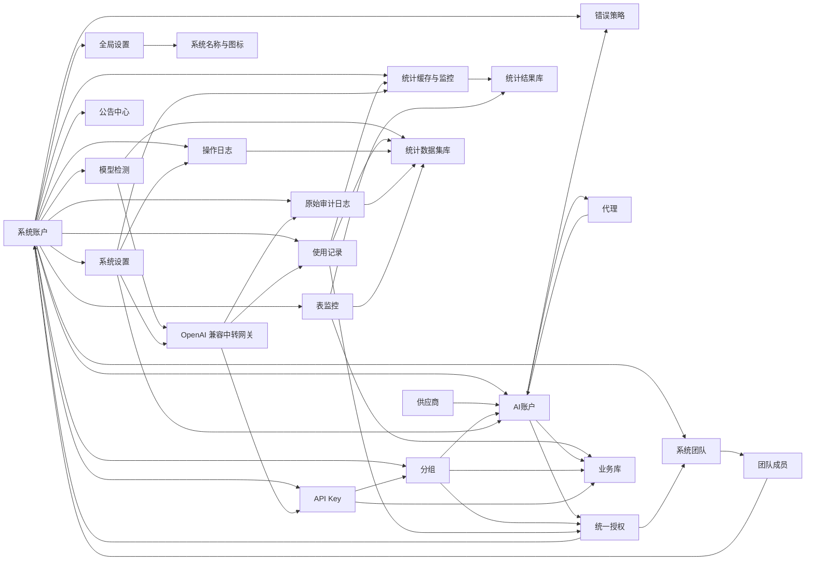

# 整体架构设计

## 文档边界

本文只说明 `juhe-ai` 的产品目标、技术选型、模块边界、跨模块关系和架构约束，不承载具体页面字段、接口清单、默认参数、实现细节或功能验收要求。

具体功能设计、字段说明、接口优先级、运行策略、存储细节和专题调研统一沉淀在 `docs/functions/`，入口见 [功能文档目录](../functions/README.md)。如果功能变化只影响某个模块实现，应优先更新对应功能文档；只有影响模块边界、数据关系、权限安全或网关主链路时，才同步调整本文。

## 产品目标

`juhe-ai` 定位为轻量、易扩展的本地 OpenAI 兼容中转与账号调度系统。它让客户端长期固定连接一个本地入口，把多套中转地址、多组上游账号、多服务商入口和代理策略统一放到后台调度。

系统优先保证：

- 客户端入口稳定：客户端可配置本服务根地址或 `/v1` 地址，并使用本地 API Key。
- 会话体验连续：尽量避免用户频繁切换 Base URL、API Key 或服务商。
- 上游自动切换：账号或供应商异常时，在分组边界内选择可用账号。
- 来源级影响隔离：同一客户端 IP 对某个账号出现未确认失败且后续账号成功时，可在短 TTL 内只让该来源避让该账号，继续自动切到同分组其他可用账号。
- 来源级错误止损：认证前缺失 Bearer / 无效 token 探测或认证后来源持续制造高置信本地请求错误时，可短 TTL 本地熔断，避免继续消耗认证校验、账号池和网关调度资源；该机制禁止区域性封禁和固定状态码 / 错误码黑名单。
- 高并发体验可控：同一个 API Key 大量并发调用时，可通过高并发分组在分组边界内协调账号负载，减少单账号排队导致的长时间无响应。
- 集中可观测：请求、用量、错误、命中账号和原始链路审计应能被统一记录和追溯。

整体模块已经围绕 OpenAI 账号接入、统一授权、网关调度、统计审计和运维排障形成闭环；后续扩展继续保持轻量边界，避免把单机部署演进成重型系统。

## 技术架构

- 前端：Vue 3 + TypeScript + Ant Design Vue。
- 后端：Node.js + TypeScript。
- API 风格：REST 优先；后续实时状态能力再按需补 WebSocket 或 SSE。
- 对外中转协议：客户端入口按 OpenAI-compatible 形态暴露，支持根路径和 `/v1`；实际可用路径按账号类型区分，OpenAI API Key 账号按上游 `/v1` 透传，OpenAI OAuth 账号只支持 Codex adapter 明确列出的 Responses 路径。
- 存储：SQLite，当前按业务库、统计数据集域和统计结果库三个职责运行；业务库保存可恢复核心业务数据，必须在迁移和恢复时保留；统计数据集域由数据集目录库和 usage shard 文件组成，数据集目录库保存审计、操作日志、运行日志索引、模型检测、清理目标和 shard 元数据，新写入的 `usage_records` 已按日期与稳定 hash 拆到多个本地 SQLite shard 文件；统计结果库保存统计缓存、额度窗口、账号质量、系统监控、表监控历史和 `stats_job_state`。统计数据集域和统计结果库都可以按需要丢弃、清空或重建。旧记录库路径不再作为运行时回退入口，具体见 [数据集库分片写入设计](../functions/数据集库分片写入设计.md)。
- 敏感数据：OAuth token、上游 API Key、本地网关 API Key 和代理密码必须按安全边界处理。
- 兼容原则：当前项目以最新完整模型为准，不向下兼容历史版本，也不内置历史数据库兼容；出现旧数据、旧配置、旧库结构或旧状态问题时，由用户按当前 schema 借助 AI 生成一次性离线修复方案，或重建对应数据域，不在后端、前端、repository、启动路径或网关主链路保留历史版本分支。
- 运行形态：Web/网关主进程、后台任务 worker 进程和本地 DB service 进程分离；后台定时任务必须在独立 Node 进程内调度和执行，系统管理 API 与网关高频 SQLite 读写由 DB service 承接，不能只由主进程的定时器、cron 回调、管理路由或同步 SQL 承载。
- 大文件和频繁文件读取是项目级性能底线：运行日志、审计 payload、导入导出文件和其他持续增长文件必须按 offset / cursor / stream / 分块窗口处理，不能在运行路径里完整读入内存再切割；追增量任务必须持久化游标并在轮转或截断时重置。

更具体的运行、存储和敏感字段规则见 [SQLite 存储说明](../functions/SQLite存储说明.md) 与 [核心功能设计](../functions/核心功能设计.md)。

## 访问控制边界

- 系统登录账号称为 `系统账户`，是后台登录、角色控制、API Key 调用方和数据隔离边界。
- `系统团队` 是多个系统账户的集合，用于承接团队级资源使用授权；团队不是资源所有者。前端菜单中的 `授权团队` / `我的授权团队` 是同一底层模型的授权场景命名，不是另一套团队实体。
- 当前只保留 `admin` 和 `user` 两种角色。
- `admin` 可以查看全部系统账户、系统团队、全部业务数据、全部使用记录、全部操作日志、原始审计日志和全部系统级配置。
- `user` 默认只能访问自己名下的数据；被授权的 AI 账户、分组和团队授权资源只获得使用权，不获得管理权。
- 资源授权统一由授权菜单维护，不再分散在账户页或分组页的独立授权弹窗中；管理侧 `统一授权管理` 和用户侧 `我的授权` 都必须把关系管理和消耗明细分开，`统一授权` / `授权操作` 只管授权关系，团队 / 用户消耗进入对应明细页。
- 团队授权不是网关运行时的第二套主体；团队授权进入系统后必须物化或同步到最终用户授权，网关调度只看稳定的用户级授权、调用方系统账户状态、绑定关系、资源状态和额度缓存。
- AI 账户始终是唯一物理上游账户，不因授权来源或被不同用户加入本地分组而复制；被授权用户把授权账户加入的是自己的本地分组绑定，绑定关系记录稳定的最终用户授权 ID。
- 授权账户运行态分两层：物理账户的状态、调度开关、冷却和最近错误是授权来源态，只说明归属人侧当前状态；被授权用户在自己分组里的停用、临时不可调用、最近本地失败和本地调度标记是本地运行态，保存在 `group_accounts.local_*` 字段。账户列表、筛选、选项、手动测试、网关调度和使用侧操作必须以本地运行态作为授权账户的 `status` 口径；来源态只能单独展示，不能覆盖或回写本地运行态，也不能因为归属人停用、冷却或关闭调度而阻断被授权用户调用。真正能阻断授权账户使用的是最终授权状态、账号套餐到期、凭据不可用、本地绑定失效、本地运行态和额度缓存；归属人要停止对外使用权，只能暂停或撤销授权。
- 团队 / 用户授权消耗明细必须由后台 worker 增量写入专用日摘要表，并刷新最近 31 天的日范围窗口表；页面接口只能按筛选条件直读已成形范围窗口行；不能让前端拿授权列表做本地聚合，也不能在页面请求里回扫 `usage_records` 或临时 `SUM/GROUP BY` 统计缓存。
- 统计汇总是项目级性能底线：业务用量、额度判断、趋势、TopN、摘要卡片和授权报表都只能读取 worker 预聚合结果；API 请求路径不能把明细或缓存行再临时相加，表结构不够时优先新增 staged / window / summary 表并重建统计缓存。
- 团队授权美元额度必须读取 worker 写入的 `account_authorization_team` / `group_authorization_team` 作用域缓存；网关请求路径不能枚举团队成员或把成员用户授权额度临时求和。
- AI 账户状态中 `error` 统一作为“异常”硬状态，不参与调度；具体异常原因由 `last_error_code` 区分，`last_error_message` 保存排障说明。账户页可以叠加展示“账户到期”“授权到期 / 授权已失效”“授权额度已用完”等有效状态，但这些不是新的物理账户状态；授权额度耗尽不能写成 `rate_limited`，只有物理上游账号触发限流策略时才进入“限流中”。OAuth Access Token 后台保活不因停用、异常、限流或临时不可调用跳过，但连续 3 次刷新失败会把账户标记为异常。
- 用户侧业务数据写入和查询必须走 `/__aisys__/api/my-*`，以后端登录态决定当前用户作用域，前端不传系统账户归属字段。
- 管理侧业务数据走 `/__aisys__/api/*` 管理入口并显式要求 `admin`；管理员如果筛选某个系统账户，读写作用域必须一致，不能落到当前管理员自己的默认作用域。
- 登录态、系统账户管理、系统团队、登录验证码和失败防护等具体要求见 [核心功能设计](../functions/核心功能设计.md) 与 [系统团队与统一授权设计](../functions/系统团队与统一授权设计.md)。

## 设置分层

- `global_settings`：平台全局配置，承载系统名称和系统图标路径；未登录也需要可读，只允许 `admin` 修改。
- `system_settings`：系统运行策略，按默认管理员作用域保存为全局单例，只允许 `admin` 修改；仅保存当前白名单内的网关、后台任务、操作日志和数据保留策略；原始审计日志捕获、成功采样、队列和正文保全策略固定在后端，不进入系统设置。
- 登录页标题、角标、副标题和视觉边界见 [产品与品牌边界](frontend/产品与品牌边界.md)。
- 网关调度默认值、统计任务参数、OAuth Access Token 预刷新参数、OAuth 额度快照被动更新口径、操作日志配置、原始审计捕获边界和审计保全策略见 [核心功能设计](../functions/核心功能设计.md)、[SQLite 存储说明](../functions/SQLite存储说明.md)、[操作日志设计](../functions/操作日志设计.md)、[原始审计日志设计](../functions/原始审计日志设计.md) 与 [审计日志保全策略设计](../functions/审计日志保全策略设计.md)。

## 模块总览

## 模块边界

| 模块 | 架构职责 | 具体设计文档 |
| --- | --- | --- |
| 系统账户 | 登录身份、角色权限和数据隔离边界 | [核心功能设计](../functions/核心功能设计.md) |
| 系统团队 | 归纳多个系统账户，承接团队级资源使用授权 | [系统团队与统一授权设计](../functions/系统团队与统一授权设计.md) |
| 供应商 | 描述供应商能力、账户类型和模型目录归属 | [核心功能设计](../functions/核心功能设计.md)、[OpenAI 账号接入](../functions/OpenAI账号接入.md) |
| AI 账户 | 承载上游凭据、状态、调度属性和可授权使用资源 | [核心功能设计](../functions/核心功能设计.md)、[OpenAI 账号接入](../functions/OpenAI账号接入.md) |
| 分组 | 调度资源集合和 API Key 授权边界；按类型区分个人轻量调度和高并发协同调度 | [核心功能设计](../functions/核心功能设计.md)、[高并发分组调度设计](../functions/高并发分组调度设计.md) |
| 统一授权 | 将 AI 账户或分组的使用权授权给系统账户或系统团队 | [系统团队与统一授权设计](../functions/系统团队与统一授权设计.md)、[SQLite 存储说明](../functions/SQLite存储说明.md) |
| API Key | 对外访问密钥，只绑定调用方自有分组 | [核心功能设计](../functions/核心功能设计.md)、[系统团队与统一授权设计](../functions/系统团队与统一授权设计.md) |
| 模型检测 | 对 AI 账户执行目标模型可信度检测，复用网关链路并保存有界诊断记录 | [模型检测设计](../functions/模型检测设计.md)、[接口契约与权限矩阵](../functions/接口契约与权限矩阵.md) |
| 代理 | 服务器级全局运维资源，供账号绑定使用 | [核心功能设计](../functions/核心功能设计.md) |
| 使用记录 | 网关请求事实源，支撑排查、统计和授权用量 | [核心功能设计](../functions/核心功能设计.md)、[SQLite 存储说明](../functions/SQLite存储说明.md)、[数据集库分片写入设计](../functions/数据集库分片写入设计.md) |
| 操作日志 | 记录系统账户对业务资源的增删改、启停、绑定、授权和配置变更，用于追溯谁改了什么以及影响了谁 | [操作日志设计](../functions/操作日志设计.md)、[安全与日志策略](../functions/安全与日志策略.md) |
| 原始审计日志 | 记录客户端请求、网关处理、上游请求、上游响应和最终返回的完整链路，并通过保全策略控制正文压缩、去重、采样和保留 | [原始审计日志设计](../functions/原始审计日志设计.md)、[审计日志保全策略设计](../functions/审计日志保全策略设计.md)、[安全与日志策略](../functions/安全与日志策略.md) |
| 统计缓存与监控 | 从使用记录增量汇总，降低列表和图表读取成本，支撑用量统计、统计概览、AI 账户性能趋势和主机监控 | [核心功能设计](../functions/核心功能设计.md)、[SQLite 存储说明](../functions/SQLite存储说明.md)、[AI 性能监控设计](../functions/AI性能监控设计.md) |
| 表监控 | 采样业务库、统计数据集库和统计结果库的文件大小、空闲页、表大小、可用历史行数和增长趋势，用于发现异常增长和容量风险 | [表数据监控设计](../functions/表数据监控设计.md)、[SQLite 存储说明](../functions/SQLite存储说明.md) |
| 错误策略 | 账号级错误处理和网关切换策略边界 | [核心功能设计](../functions/核心功能设计.md) |
| 公告中心 | 面向所有登录用户展示平台公告，并由管理员维护发布内容 | [公告中心设计](../functions/公告中心设计.md) |
| 中转网关 | 校验 API Key、选择分组内账号、转发请求并记录结果 | [核心功能设计](../functions/核心功能设计.md)、[中转透传机制调研与定位修正](../functions/中转透传机制调研与定位修正.md) |
| 幂等与唯一约束 | 防止管理端重复提交、重复创建和重复业务关系，固定内存防重复提交、业务唯一键和数据库唯一约束边界 | [幂等与唯一约束设计](../functions/幂等与唯一约束设计.md)、[SQLite 存储说明](../functions/SQLite存储说明.md) |
| 接口契约与权限 | 管理 API、网关 API、响应结构、错误语义和权限矩阵 | [接口契约与权限矩阵](../functions/接口契约与权限矩阵.md) |
| 安全与日志 | 敏感字段、凭据展示、请求快照、日志脱敏和保留策略 | [安全与日志策略](../functions/安全与日志策略.md) |

## 核心关系

- 系统账户是登录、调用方和隔离边界；业务数据默认归属某个系统账户。
- 系统团队归纳多个系统账户，只承接使用授权，不改变资源归属。
- 全局设置属于平台公开展示资源；系统设置属于平台运行策略，影响网关、后台任务、操作日志和数据保留；原始审计捕获和正文保全策略固定启用，不作为系统设置项暴露。
- 供应商定义账户创建方式和能力边界；账户必须归属某个供应商。
- AI 账户承载上游凭据、模型能力限制和调度属性，可以通过统一授权授权给系统账户或系统团队使用。
- 分组汇总同供应商账户，是 API Key 可访问资源的边界；个人分组保持轻量稳定调度，高并发分组面向同一个 API Key 大量并发时的账号负载协调。
- 资源所有权、本地绑定和授权使用权必须分开理解：`accounts.system_account_id` / `groups.system_account_id` 表示资源归属人；`group_accounts.system_account_id` 表示某个使用方把账户加入自己的本地分组；`resource_authorizations` 表示资源归属人授予使用方的稳定使用权。授权账户生效后默认加入使用方自己的默认分组，授权创建时也可以指定使用方自己的其他同供应商分组，后续仍可手动调整；这不会复制物理账户，也不会改变账户归属人的分组绑定。
- API Key 只能绑定调用方自己的分组，请求进入后只能使用该分组内当前可调度且授权仍有效的账户；授权方的分组不能作为被授权方 API Key 的调度池。
- 模型检测是排障和可信度诊断能力，不直接证明上游物理模型身份；当前只检测 `我的 AI 账户` 中的 AI 账户，可由用户选择可信对比账户做同探针集对照，并在开启可信对比时额外执行隐藏分布相似度对照；检测必须复用本地网关链路，产生的模型请求按既有使用记录、额度和审计规则处理，检测报告只保存脱敏、有界摘要。
- API Key 是一次性接入凭据；列表展示累计用量，可配置 n 小时、日、周、月和总美元成本额度。API Key 生命周期分为停用、业务删除和记录物理清理：停用立即拒绝调用但保留关系；业务删除同步提交并让后续请求立即不可用；历史使用记录、原始审计日志和审计错误组进入数据集库清理目标，统计缓存、额度窗口和范围 / 排行窗口由统计结果库反向扣减，不承诺在删除接口内强一致完成；队列投递失败时只保留目标等待后台重试，删除接口不能在 API 进程同步扫描数据集库或统计结果库。
- 代理是服务器级运维资源，不属于普通用户私有配置；代理质量检测以已启用供应商默认地址为目标，最近状态和延迟作为运维参考缓存。
- 公告中心是全员只读、管理员维护的轻量通知模块；用户侧只读取已发布公告，管理员侧负责新增、编辑、发布、下线和删除。
- 使用记录是计量和统计事实源；统计缓存只做读优化，不能替代事实记录。
- 业务库、统计数据集域和统计结果库是当前明确边界：系统账户、账户、分组、API Key、授权、公告、设置等可恢复业务数据在业务库；新写入的使用记录进入 usage shard 文件，审计、日志、操作日志、模型检测明细和 shard 元数据进入统计数据集目录库；统计桶、额度窗口、范围窗口、排行快照、账号质量结果、系统监控采样、系统监控趋势和表监控历史进入统计结果库。默认备份只覆盖业务库和 `backend/.env`；统计数据集域和统计结果库属于可丢弃 / 可重建数据，只有离线取证时才额外停机备份。请求链路和 DB service 不直接写高频数据集明细，记录类写入应投递 background worker 队列；独立 worker 作为消费端负责批量落库、统计聚合、采样和清理。为解决单个统计数据集库文件的 SQLite 写锁上限，`usage_records` 分片写入设计已把统计数据集域扩展为数据集目录库加多个 usage shard 文件，但不改变业务库和统计结果库的职责。
- AI 账户性能趋势是账号所有者视角，从使用记录的小时级统计缓存读取；用户侧只看当前用户自有账户，管理侧可按系统账户筛选或读取全局账户缓存。页面默认日期范围为最近 3 天，默认账户池取最近 7 天活跃前 10；搜索追加账户和点击筛选只影响本次查看，不持久化为偏好或运行策略。
- 操作日志是业务状态变更追溯事实，记录成功的增删改、启停、绑定、授权和配置变更；查询、列表、筛选、详情查看和日志查看不属于操作日志。业务写入提交成功后再把操作日志投递给 background worker，不能为了记录日志阻塞或回滚已提交业务变更。
- 操作日志按影响用户预计算可见范围：普通用户只能查看自己发起、自己资源、自己授权关系、自己团队关系或全局影响相关的安全摘要；管理员可以查看全部操作日志。
- 管理端写操作必须通过前端防连点、后端内存短 TTL 防重复缓存和数据库业务唯一约束兜底，前端重复点击或网络重试不能创建重复业务数据；重复提交拦截不能写第二条操作日志。
- 原始审计日志是排障数据；完全成功请求默认只按 10% 稳定采样保留，用于抽查客户端请求和网关改写，失败、异常、客户端中断、流式中断和重试后成功链路必须保留。正文内容按保全策略压缩、去重和定期清理；它和使用记录分表管理，不参与用量统计。
- 统计数据集库写入不允许在网关主链路或 DB service 管理请求中同步写库；使用记录、操作日志、原始审计日志、运行日志索引和常规数据集维护动作都只能投递后台 worker 队列后由 worker 批量落库或分批清理。统计结果库只承载 worker 预聚合、低频采样和查询结果刷新。API Key 删除后的关联记录清理必须先登记待清理目标，优先投递 worker；投递失败时只记录待重试状态，不能在当前 API 请求进程同步清理数据集库或统计结果库。进程重启导致队列中的数据集库事实丢失或维护延迟是可接受边界，业务库数据仍必须同步提交保证安全。
- 授权只传递使用权，不传递管理权，也不能绕过敏感凭据隔离；授权消耗统计不包含资源归属人自己的自用消耗。统一授权可配置 n 小时、日、周、月和总美元成本额度，避免被授权用户或团队超额使用共享资源。
- 用户接口、管理接口、网关接口和权限摘要必须遵循统一契约；敏感字段、日志和请求快照必须遵循安全策略。

## 后台任务隔离

- 主 Web 进程只承载系统后台静态资源、系统 API 反向代理、OpenAI 兼容网关、健康检查和必要的请求内状态维护。
- 统计聚合、分组账户统计缓存刷新、系统指标采样、表数据监控采样、授权到期扫描、OpenAI OAuth Access Token 保活、冷却账号复测、操作日志落库、运行日志索引 flush、审计日志批量落库、数据集库维护队列消费、统计结果刷新和统一表数据保留期清理都属于后台 worker 职责。OpenAI OAuth 额度快照由真实网关响应头被动写入，不再作为后台主动刷新任务。
- 后台任务必须在独立 Node 进程内注册、调度和执行；调度框架只允许运行在 worker 进程内，不能通过 IPC 或回调让主进程代执行任务函数。
- 主进程可以启动、看护和重启 worker，也可以把请求链路产生的轻量消息投递给 worker，但不能导入后台任务实现并直接调用。
- 当前版本不引入 Redis、Kafka 或独立分布式队列；如后续支持多实例部署，再评估共享锁、任务归属和幂等边界。

## 易失运行态边界

- SQLite 保存系统账户、资源、授权、API Key、设置、使用记录、统计缓存和可追溯日志等事实；短 TTL 校验缓存、会话亲和、当前并发占用、网关运行时快照、IPC 待投递队列、验证码挑战和登录失败滑动窗口属于单节点进程内易失运行态。
- 易失运行态只用于性能、体验和临时调度辅助，不能作为长期账务、权限、授权来源、账号健康或审计事实。服务重启、子进程重启、缓存淘汰或 IPC 队列溢出后，允许这些状态丢失或回到保守默认；请求路径必须重新从 SQLite 事实和预聚合缓存恢复判断。IP 级账号回避状态也属于这类短 TTL 调度态，只影响同一客户端 IP、API Key、分组和账号组合的候选排序，不写账号冷却状态。认证前入口保护和认证后 IP 级错误熔断也属于短 TTL 易失运行态，只短路当前窄作用域或当前来源的高置信错误风暴，不写账号状态、不作为审计事实和长期处罚依据。
- 当前项目明确按单机轻量部署设计，不承诺多实例共享这些进程内状态。若后续要支持多实例，优先围绕本节抽象并迁移会话亲和、并发占用、验证码 / 登录限频、调度临时态和队列归属，不能把多实例假设反向渗入现有业务模型。

## 数据库服务隔离

- SQLite 仍是当前默认事实存储，不引入 PostgreSQL、Redis 或其他第三方数据库依赖；当前部署使用业务库 `JUHE_AI_DATABASE_PATH`、统计数据集目录库 `JUHE_AI_DATASET_DATABASE_PATH`、统计结果库 `JUHE_AI_STATS_DATABASE_PATH` 和 usage shard 根目录 `JUHE_AI_USAGE_SHARD_ROOT`。旧记录库不作为运行时兼容边界，也不作为内置迁移来源；需要查旧库时只能停机离线处理。`JUHE_AI_DATASET_DATABASE_PATH` 继续作为数据集目录库，usage shard 文件位于独立数据集目录下。
- 本地 DB service 是独立 Node 进程，用于承接系统管理 API、登录态校验、管理面 CRUD、网关高频数据库读写、公开设置读取、运行日志索引查询和账号运行态副作用，目标是避免 Web/API/网关主进程事件循环被 `DatabaseSync` 直接占用。
- DB service 不改变 SQLite 单写者边界；业务库写入仍由 DB service 同步执行并依赖 WAL、短事务和 `busy_timeout` 控制写锁等待。数据集库高频写入从请求链路剥离到 background worker，DB service 只负责受控明细查询、业务库写入、统计结果查询和必要的业务状态读取。usage 分片 writer 只能扩大不同 SQLite 文件之间的并行写入能力，不能让同一个 shard 文件拥有多个并发 writer。
- 对外 HTTP API 和 `/v1` 协议不因 DB service 变化而改变；DB service 不可用时由 supervisor 看护重启，请求链路返回可读错误并短暂快速失败，不能回退到主 Web 进程同步执行这些 SQLite 访问，也不能拖垮主 Web 进程。
- 系统管理 API 由 DB service 内部 HTTP app 承载，主 Web 进程只把 `/__aisys__/api/*` 流式代理过去，不挂载管理路由、不解析管理 API JSON body、不直接导入 repository；客户请求链路中的 API Key 校验、网关设置读取、分组账号读取、额度缓存读取、账号状态更新、OAuth token 刷新持久化、OAuth 额度快照写入，以及 usage / audit 入队，也都不能在 server 角色本地同步读写 SQLite。

## 网关主链路

当前对外主入口是 OpenAI 兼容网关，支持根路径 `/*` 和 `/v1/*`；系统后台、管理 API、健康检查和静态资源统一在 `/__aisys__/*` 下，OpenAI `/v1` 路径归一化和 Base URL 拼接规则见 [客户端网关入口路径兼容设计](../functions/客户端网关入口路径兼容设计.md)。架构层只固定主链路边界：校验本地 API Key、按统计缓存判断 API Key 和统一授权本地额度、定位绑定分组、按账户模型限制过滤候选账号、选择可调度账户、适配上游认证与请求、处理上游响应、记录使用情况、按审计策略捕获完整链路，并在错误策略允许的范围内切换账号；标记为降级备用的账号在个人分组中只在同分组主池账号都不可用或请求失败后进入调度。高并发分组在选号时使用分组类型分支：备用账号可在主池排队、软并发已满或明显变慢时按分组策略临时启用以减少等待。代理运行态失败桶只在候选排序层短期避让同代理多账号短窗失败的绑定账号；进程内本地账号屏蔽在候选排序前生效，所有候选都被屏蔽时进入短等待，等最早屏蔽释放或等待预算耗尽，不再绕过屏蔽继续打问题账号。IP 级账号回避只在候选排序层短期避让“当前来源近期未确认失败、且已被后续成功账号证明可绕开”的账号，不绕过 API Key、分组、授权、模型限制、额度和账号硬状态。认证后 IP 级错误熔断位于账号调度前，只消费本地校验失败等高置信本地请求错误；上游账号池失败不计入来源熔断；命中后返回本地 `429`，不进入账号调度，也不写账号冷却。

高并发分组不把上游状态码作为默认健康事实，而是优先使用本地运行态和真实请求体验信号，例如当前并发、分组排队、首段等待、请求耗时、近期超时、质量缓存和账号软并发占用。所有上游请求异常和非成功响应都会先把当前账号加入进程内短 TTL 屏蔽并切换后续账号；状态码和错误体只作为账号错误处理策略、审计和排障输入。只有命中账号策略、流熔断、后台复测或人工操作时，才写入持久账号冷却、限流或异常状态。

“OpenAI 兼容”首先指本地客户端入口和错误结构尽量兼容 OpenAI 协议，不代表所有账户类型都具备同一组上游能力。OpenAI API Key 账户按公开 OpenAI-compatible API 透传；OpenAI OAuth 账户进入 Codex adapter，能力受 Codex backend 限制。具体账户类型、路径和限制矩阵见 [OpenAI 账号接入](../functions/OpenAI账号接入.md)。

网关流式转发必须按增量方式解析 SSE 状态、usage 和失败事件；成功流不应为了常规解析反复拼接完整响应体。`200 + text/event-stream` 内的协议级失败按“是否已有可见输出”统一处理账号副作用：未发送可见输出前不累计账号流失败，已发送可见输出后先做代理运行态归因，同代理多个账号短窗失败时只避让代理绑定账号；未形成代理证据时才进入通用流失败计数，不再维护流式错误码特征白名单。可见输出前的 OpenAI Responses 形态 `response.failed/upstream_retryable_error` 已收敛到客户端策略层，仅在精确命中 Codex profile、`responses_sse` 和 `x-codex-turn-metadata.turn_id` 时启用；普通 OpenAI-compatible 客户端不走 Codex 专属可重试码，也不触发第 4 次 turn 级切号。后续新增其他客户端 profile、失败事件格式或重试策略时，必须先落到客户端策略分层，不能写进通用网关层。非 2xx 上游错误响应不再有代码内置特征规则提前短路，也不再用请求级上游错误缓存短路；任何非成功响应都按同一流水线处理：记录失败、短期屏蔽当前账号、尝试后续账号，全部账号失败时返回网关统一 `service_unavailable` 错误。慢客户端读取时必须尊重 `res.write()` backpressure，客户端断开时应尽量关闭上游连接并释放账号并发槽。`/v1` raw body 上限当前保持 `64mb`，用于兼容图片、文件和大上下文请求；JSON 请求体继续正常解析，用于 `model`、`stream`、会话粘滞、统计和审计字段，API Key 上游请求体仍优先 raw bytes 原样转发；`2mb` 只是大 JSON 预警阈值，不作为拒绝阈值，超过后保持客户端连接并进入 worker thread 异步解析，解析完成再继续网关调度 / OAuth Codex 归一化 / 上游转发，同时写入 `gateway_large_json_body_parse` warning 日志，OAuth / Codex 归一化阶段额外写入 `openai_oauth_codex_large_body_parse` warning 日志。

API Key 和统一授权本地美元成本额度以后台统计缓存的 `total_cost_usd` 为判断依据，不在网关请求内扫描使用记录或做强一致扣减；统计任务默认每 1 分钟增量处理，网关校验结果带短 TTL 内存缓存，所以允许轻微超额，下一次统计追平后再拦截。额度命中时网关返回 429，错误文案为“额度已用完，请联系管理员提升额度”。

OpenAI API Key 账号和 OpenAI OAuth 账号在客户端侧都可以通过根路径或 `/v1` 入口访问，但上游适配边界不同：API Key 账号按公开 OpenAI-compatible API 处理，请求体优先 raw passthrough，Header 过滤本地认证、代理链路、协议危险头、SDK / tracing 噪声和客户端传入的 OpenAI 组织 / 项目头；服务端不自动生成或暴露 OpenAI 组织、项目和 Beta 配置项，`OpenAI-Beta` 仅保留客户端显式传入的公开 API 功能语义。OAuth 账号进入内部 `openai_oauth_codex` adapter，面向 ChatGPT / Codex backend 做 endpoint 限制、请求体归一化、Header 白名单和上游会话标识隔离。会话亲和、统计和 Codex prompt cache 隔离只按本地系统账户、API Key、分组和客户端会话边界处理，不把 OAuth / API Key 类型或具体上游账号 ID 当作额外分片，避免切号时无意义打散连续性。OAuth 适配器不暴露复杂前端开关，也不承诺公开 Responses API 的全部字段都能原样进入 Codex backend。

透传、请求头处理、SSE 稳定性、流式兜底、错误兜底、流熔断、IP 级来源保护、OAuth token 刷新、原始审计日志捕获和具体请求链路属于功能设计与实现细节，分别见 [核心功能设计](../functions/核心功能设计.md)、[网关错误处理完整链路](../functions/网关错误处理完整链路.md)、[网关异常重试与兜底策略](../functions/网关异常重试与兜底策略.md)、[IP 级账号回避与自动切号设计](../functions/IP级账号回避与自动切号设计.md)、[IP 级错误熔断与恶意请求保护设计](../functions/IP级错误熔断与恶意请求保护设计.md)、[流式中断与客户端重试调研](../functions/流式中断与客户端重试调研.md)、[OpenAI 账号接入](../functions/OpenAI账号接入.md)、[中转透传机制调研与定位修正](../functions/中转透传机制调研与定位修正.md) 和 [原始审计日志设计](../functions/原始审计日志设计.md)。

## 维护规则

- 本文只更新架构边界、模块关系和跨模块原则。
- 新字段、新接口、页面行为、默认值、任务参数、存储表结构和验证要求统一写入 `docs/functions/`。
- 阶段范围、里程碑或完成标准变化时，同步更新 `docs/plans/`。
- 前端页面、样式、品牌和交互边界变化时，同步更新 `docs/architecture/frontend/`。
