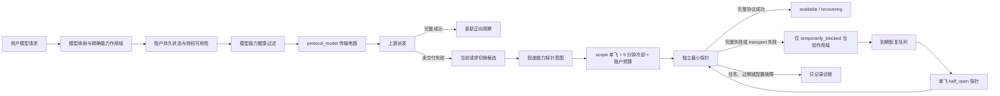

# AI 账户多模型能力健康与精确隔离设计

## 1. 文档定位

本文定义 AI 账户同时支持多个模型时，健康确认、故障隔离、调度过滤、探针单飞、半开恢复、账户级升级、存储、接口和前端展示的完整目标架构。本文是多模型可用性作用域的权威文档；涉及单一 `healthCheckModel`、账户运行态和周期健康检查的既有文档仍负责各自专题，但与本文冲突时，以本文的多模型作用域和状态变更边界为准。

本文描述的是一次性完整交付边界，不按阶段拆分。存储、网关、后台任务、管理接口、前端、迁移和测试必须一起完成后才算落地；只新增表、只触发探针、只做前端展示或只做模型级阻断都不构成可发布结果。

## 2. 问题与结论

一个 AI 账户可以同时支持模型 A、B、C，但现有主动检查只使用一个 `healthCheckModel + healthCheckEndpointMode`：

- B 的真实请求持续失败时，如果后台仍用 A 检查，B 会继续被调度，失败没有形成对 B 的保护。
- B 的失败如果触发检查模型 C，而 C 也失败，系统可能把整个账户写成 `temporary_unavailable`，仍然可用的 A 也被移出调度池。
- 单一检查模型成功只能证明一个模型和一种请求形态成功，不能证明整个账户的全部模型可用。
- 账户级 `active / temporary_unavailable` 无法表达“账户仍可调度，但部分模型不可用”。

目标结论固定为：

1. 保留多模型账户，不把一个物理凭据强制拆成多个账户。
2. 在账户持久状态和传输电路之间新增稀疏的“模型能力健康层”。
3. 单模型失败只影响该模型映射后的真实上游模型及精确协议形态，不能直接修改整个账户状态。
4. 业务请求失败只负责切换候选和投递独立探针；只有独立探针可以确认模型能力不可用或恢复。
5. 不根据 HTTP 状态码、错误码或正文判断账号、权限、限流、封禁、模型下线等具体原因。完整失败响应只表示本次受控探针没有证明该能力可用。
6. 对同一能力作用域实行跨实例单飞、5 分钟业务触发冷却、账户级探针预算和 generation fencing，避免单账户探测风暴。
7. 账户列表展示“可调度 · 部分能力不可用”，模型能力明细展示精确状态；不能再用单个账户标签掩盖局部故障。

## 3. 目标与非目标

### 3.1 目标

- B 模型被确认不可用后，后续 B 请求不再选择该账户；A 模型请求仍可使用该账户。
- 同一波并发失败最多产生一个同作用域探针，不能按请求数量放大。
- 模型别名统一归一到最终真实上游模型，避免同一上游能力被拆成多个健康状态。
- Chat、Responses、Messages、GenerateContent 及 JSON / Streaming 形态可以分别健康、分别隔离、分别恢复。
- standalone 和 performance 使用同一状态机和接口语义，差异只在存储与分布式协调适配器。
- 探针任务故障、过期结果和配置变化不会错误阻断模型或恢复旧配置。
- 当前状态、最近观察、下次恢复时间、作用范围和通用原因均可在前端查看和审计。

### 3.2 非目标

- 不从上游状态码、错误结构或错误文案推断具体账户业务语义。
- 不对账户声明的全部模型做固定周期全量轮询。
- 不把人工测试结果写入生产健康状态。
- 不允许输入模型目录之外的任意字符串创建健康作用域。
- 不以 `usage_records` 错误数量聚合结果直接修改调度状态。
- 不新增一组“模型级 `accounts.status`”；账户持久状态枚举保持不变。

## 4. 术语与三层状态

### 4.1 账户持久状态

`accounts.status` 继续只使用：

- `active`
- `pending_test`
- `disabled`
- `error`
- `rate_limited`
- `temporary_unavailable`

它表达整个账户的管理和全局调度边界，不表达单个模型故障。

### 4.2 模型能力健康状态

模型能力健康状态表达一个账户在一个精确上游能力作用域上的当前可用性：

- `unknown`：没有足够的独立观察；默认不阻断。
- `available`：最近独立探针或可信完整业务成功证明可用。
- `suspect`：业务失败已触发独立探针，但尚无确认结论；作为短时共享软阻断从普通调度排除，其他候选优先，全池均为怀疑态时进入现有 FIFO 有界等待。
- `temporarily_blocked`：独立探针确认当前作用域不可用；正常调度排除。
- `half_open`：阻断到期后仅允许一个恢复探针持有者验证；普通业务请求不抢占该名额。
- `recovering`：已出现一次独立成功，等待第二次独立成功稳定恢复；仍不进入普通调度。

这些状态不写入 `accounts.status`。

### 4.3 传输电路状态

既有 `protocol_model` 传输电路继续处理连接、TLS、读取中断、framing 未完成等本地可验证 transport 事实。它与模型能力健康层职责不同：

- 传输电路回答“当前传输路径是否允许尝试”。
- 模型能力健康回答“独立受控请求是否证明这个模型和请求形态可用”。
- 完整 HTTP / SSE 失败对传输电路保持中性，但可由独立模型能力探针形成通用不可用结论。
- 两层都允许时才可调度；任一层阻断都排除当前候选。

## 5. 核心不变量

1. 单个模型能力探针失败不得直接写 `accounts.status = temporary_unavailable`。
2. 普通业务请求失败不得直接写模型能力负向状态或账户持久状态。
3. 完整 HTTP 4xx、5xx、协议失败或错误正文不得被翻译成凭据失效、限流、封禁、余额不足、模型下线等具体语义。
4. 独立探针的完整失败响应和 transport 失败都只形成 `capability_unavailable` 通用结论；任务、本地执行器、取消和过期结果形成 `unknown`，不得阻断。
5. 同一真实上游模型的多个客户端别名必须共享归一后的能力事实。
6. 不同 endpoint mode 可以独立隔离；`responses_sse` 失败不能自动阻断 `chat_json`。
7. 任意失败结果写回前必须校验账户配置版本、模型映射版本、凭据指纹、scope generation 和探针租约。
8. 人工测试不改变生产健康；“重新检查”只投递受控探针，不直接恢复。
9. `healthCheckModel` 是哨兵模型和激活模型，不是账户全部模型健康的代表。
10. 只有整个账户级事实才能阻断整个账户；无法证明作用范围时取最小作用域。

## 6. 完整架构



最终候选条件为：

```text
accountEffectiveAvailability
AND keyAvailability
AND accountCapabilityHealth(scope).allowsScheduling
AND transportCircuit(scope).allowsScheduling
AND concurrencyAndScheduleAllows
```

任何路由模式都使用同一个候选条件。普通、故障回退、权重、轮询和混合智能只能决定候选排序，不能绕过模型能力阻断。

## 7. 能力作用域

### 7.1 作用域键

逻辑作用域固定为：

```text
accountRuntimeKey
+ providerProtocolProfileId
+ upstreamEndpointMode
+ requestLane
+ normalizedUpstreamModel
```

字段含义：

- `accountRuntimeKey`：物理账户或授权实例的运行隔离键，与现有电路作用域一致。
- `providerProtocolProfileId`：供应商协议档案，防止同一模型名跨协议串状态。
- `upstreamEndpointMode`：最终真实上游请求形态，例如 `responses_sse`、`chat_json`。
- `requestLane`：文本、图像生成、图像编辑等资源和超时语义不同的 lane。
- `normalizedUpstreamModel`：完成模型映射后实际发送给上游的模型 ID。

持久层使用上述字段生成稳定 `scope_hash`，接口使用不可逆 `scopeId`，不能把账户凭据、Base URL 或敏感配置放进键或日志。

### 7.2 模型归一化

能力作用域必须在候选账户完成模型映射和协议桥接目标解析后生成：

```text
clientModel -> account model mapping -> normalizedUpstreamModel
client endpoint -> bridge/driver -> upstreamEndpointMode
```

例如客户端别名 `gpt-latest` 和 `my-gpt` 都映射到 `gpt-5.2` 时，两者共享 `gpt-5.2` 的能力状态。映射目标或 endpoint mode 发生变化时增加 `modelMappingRevision`，旧探针结果不得写入新作用域。

### 7.3 作用域创建限制

- 只为账户 `supportedModels`、有效模型映射目标或后台激活哨兵创建作用域。
- 任意客户端输入且无法映射到目录模型时，不创建持久健康记录，只按现有“不支持模型”路径处理。
- 记录按实际观察稀疏创建，不预生成账户数乘以模型数乘以协议数的笛卡尔积。
- 删除模型、禁用 endpoint mode、修改协议档案或撤销授权时，同事务增加配置版本并使关联作用域失效；后台异步清理历史行。

## 8. 结果契约与证据

### 8.1 普通业务请求

普通业务请求只提供两类允许的作用：

- 完整协议成功：可刷新同作用域的正向观察；如果当前状态是 `available / unknown / suspect`，可以写 `available`，但不能越权清理其他作用域或账户持久状态。
- 在结果尚未交付客户端前失败：当前请求排除该候选并尝试下一候选，同时 best-effort 投递同作用域探针意图。

普通请求的 4xx、5xx、错误正文、空响应、无效协议或 transport 失败都不能直接写 `temporarily_blocked`。请求是否投递探针只依据“该上游尝试未形成完整协议成功且仍处于可安全切号边界”，不依据错误码分类。

客户端取消、下游断开、请求体非法、本地鉴权失败、配额失败、没有真正派发到上游、已向客户端提交不可重试结果均不投递能力探针。

### 8.2 独立能力探针

独立探针只返回四类稳定结果：

| 结果 | 判定 | 状态副作用 |
| --- | --- | --- |
| `complete_success` | 对应协议得到完整成功对象或完成事件 | 正向推进恢复 |
| `capability_unavailable` | 完整失败响应、协议不成功、目录未证明模型存在，或 transport 未完成 | 只负向推进当前能力作用域 |
| `probe_task_failure` | 本地模板、队列、进程、配置读取、取消等探针任务故障 | 不计数、不改健康状态 |
| `stale_or_unknown` | 版本过期、租约失效、无法归因 | 不计数、不改健康状态 |

`capability_unavailable` 内部可以保留 `framing_complete_neutral` 或 `transport_incomplete` 作为技术诊断类，但前端统一显示“该模型能力检查未通过”，不得显示推断出的账号业务原因。

### 8.3 本地账户级事实

下列事实无需通过模型响应推断，允许走账户级现有路径：

- 凭据缺失或无法解密。
- Base URL、代理引用或协议档案配置在本地不可构造。
- 授权关系失效、账户人工停用、套餐到期等系统自身确定的事实。
- 用户显式配置的账户错误策略实际命中，并且策略动作明确要求账户级状态变更。

来自上游的 HTTP、错误码和正文不属于“本地账户级事实”。

## 9. 状态机

### 9.1 正常与怀疑

```text
unknown --独立成功--> available
unknown --完整业务成功--> available
available --业务失败投递成功--> suspect
unknown --业务失败投递成功--> suspect
suspect --独立成功--> available
suspect --完整业务成功且未进入新阻断 generation--> available
suspect --独立失败--> temporarily_blocked
suspect --任务/过期--> unknown 并按任务退避重排
```

进入 `suspect` 不修改账户持久状态，但立即对当前能力建立短时共享软阻断。后续请求选择其他健康候选；如果同模型全池只剩 `suspect`，进入现有 FIFO 有界等待，等待探针结论，不继续并发打入被怀疑能力。探针必须在 30 秒确认窗口内被领取并完成；任务未领取、任务失败或超时则将该作用域恢复为 `unknown` 并按任务退避重排，不能让软阻断无限挂住。

### 9.2 阻断与恢复

```text
temporarily_blocked --blockedUntil 到期--> half_open
half_open --独立失败--> temporarily_blocked，并增加退避
half_open --独立成功--> recovering
recovering --第二次独立成功--> available
recovering --独立失败--> temporarily_blocked
```

默认退避为 5、10、20、30、60 分钟，之后保持 60 分钟；每次配置变更清零旧 generation 和退避，但不会绕过新的激活检查。第一次独立成功后等待至少 30 秒再执行第二次恢复探针，避免瞬时偶发成功立即放量。`recovering` 和 `half_open` 只允许后台探针，不开放普通业务流量；第二次成功后一次性恢复普通调度。

真实业务完整成功如果发生在阻断前已派发的在途请求中，只记录正向观察，不清理已经由更新 generation 建立的阻断。只有匹配当前 generation 的独立探针推进恢复。

### 9.3 并发与 CAS

每次转换必须满足：

- 当前 `state_version` 等于读取版本。
- `config_revision`、`model_mapping_revision` 和 `credential_fingerprint` 未变化。
- 探针持有当前 `lease_token` 和 `probe_generation`。
- 负向结果的观察开始时间早于本次结果且没有更新 generation 的独立成功。

不满足时结果归为 `stale_or_unknown`。

## 10. 业务失败触发与防风暴

### 10.1 单飞键

单飞键为：

```text
capability-probe:{scope_hash}:{probe_generation}
```

standalone 由单进程原子状态和数据库条件写承担；performance 由 Redis `SET NX PX`、due index 和 fenced lease 承担。数据库唯一约束作为最后防线，不能只依赖进程内 Map。

### 10.2 触发冷却

- 同一能力作用域在 5 分钟内最多接受一次业务失败触发的探针意图。
- 已经处于 `temporarily_blocked / half_open / recovering` 时，业务请求不再触发探针，由恢复调度器负责。
- `suspect` 且探针在队列、执行中或 5 分钟冷却内时，只更新有界诊断计数，不再次入队；30 秒确认窗口到期没有有效结果时解除软阻断并记录任务指标。
- 探针任务失败不把冷却无限延长；按任务退避 30 秒、1 分钟、2 分钟，最多 5 分钟重排。

### 10.3 账户与全局预算

- 每个账户同时最多执行 1 个能力探针。
- 每个账户等待中的能力探针最多 16 个；超过后按“阻断到期恢复优先、首次怀疑次之、重复怀疑丢弃”合并。
- worker 全局并发沿用健康任务资源 lane 的有界配置，不能为此建立无上限 Promise。
- 同一请求最多接受一个能力探针意图。候选循环结束时由公平选择器从本请求尚未处于探针中或冷却中的失败作用域选择一个，其他失败只记录本请求诊断；选择器按账户和 scope 轮转，避免总是只检查最后一个失败候选，也避免一次请求放大为多账户探测。
- 队列按账户公平轮转，单个多模型账户不能占满全局探针容量。

## 11. 账户级升级与降级边界

### 11.1 聚合展示不等于持久状态

前端和调度可以派生账户能力摘要：

- `all_available`：至少有一个已观察能力，且没有怀疑、阻断或恢复中的能力。
- `partially_unavailable`：至少一个能力阻断，同时至少一个当前请求可用能力存在。
- `all_capabilities_unavailable`：该账户当前已配置且可路由的全部能力完成全覆盖确认并均被阻断。
- `unknown`：没有足够观察。

摘要不是新的 `accounts.status`。`active + partially_unavailable` 仍是可调度账户，只对命中阻断模型的请求排除。

### 11.2 何时允许整号不可调度

模型能力路径只有在以下条件全部满足时，才允许把整号交给现有账户级 `temporary_unavailable` 状态机：

1. 账户当前没有任何未阻断的可路由能力。
2. 每个不同的 `normalizedUpstreamModel` 至少有一个实际可路由 endpoint mode 被独立探针确认失败；同一模型的多个别名或多个失败请求不能重复计数。
3. 对每个仍可能提供调度能力但尚未有结论的模型，完成一次有界仲裁探针；任一模型成功即终止整号升级，账户保持 `active + partially_unavailable`。
4. 所有结论匹配同一账户配置版本和凭据指纹。
5. 账户当前在途请求归零，避免用旧观察阻断正在成功工作的账户。

仲裁探针按账户预算串行执行，不并发扫描。支持模型很多时仍需要覆盖全部“可路由真实上游模型”，因此系统不会因抽样失败就宣称整号不可用。代价是整号升级更保守，这是保护仍可用模型的必要边界。

本地可验证账户级事实和用户显式策略不受上述模型仲裁限制，但仍只能按各自来源恢复，不能被无关模型成功清理。

### 11.3 单模型账户

单模型账户被独立确认阻断后，能力摘要自然为 `all_capabilities_unavailable`。完成在途归零和同版本仲裁后可以进入现有账户级冷却；即使未完成整号状态写入，模型能力过滤也已经防止失败请求继续命中。

## 12. `healthCheckModel` 与各种探针的最终职责

`healthCheckModel + healthCheckEndpointMode` 保留，但语义收敛为“账户哨兵能力”：

- 新账户激活：哨兵完整成功才能把 `pending_test` 激活；失败只说明哨兵能力不可用，账户保持待检查，不自动猜测其他模型。
- 正常周期健康：检查哨兵能力并更新对应能力状态；哨兵失败不得直接阻断其他模型或整号。
- 请求失败确认：必须检查失败请求归一后的精确能力作用域，不得改用哨兵模型。
- 模型能力恢复：必须检查被阻断的精确能力作用域，不得改用哨兵模型。
- 账户级冷却恢复：只有整号状态来源匹配时使用仲裁目标集；单一哨兵成功不能证明所有能力恢复，恢复时先解除账户级状态，再保留各模型原有阻断。
- API Key 恢复：继续由 Key 专题负责，不把一个 Key 的结果扩散为全部模型或全部 Key 的健康结论。
- 人工测试：用户可从账户支持模型目录中选择模型和合法 endpoint mode，只生成诊断，不写能力状态。

因此，“每小时检查一次”只保证哨兵能力的周期观察，不等于每小时遍历全部模型。其他模型通过真实失败按需触发、阻断到期恢复和用户显式重新检查获得健康事实。

## 13. 调度和重试全链路

1. 网关解析客户端模型、路由策略和候选账户。
2. 对每个候选完成模型映射、桥接目标和真实 endpoint mode 解析，生成能力作用域。
3. 先过滤账户全局不可用、授权失效、调度关闭、时间计划和 Key 不可用。
4. 再读取模型能力健康；`suspect / temporarily_blocked / half_open / recovering` 排除，`available / unknown` 允许。
5. 再应用 `protocol_model` 传输电路、并发和路由排序。
6. 请求未向客户端提交结果前失败时，当前请求排除该账户并尝试下一候选。
7. 候选循环结束后由公平选择器从本请求的失败作用域中接受一个探针意图，其他作用域只记录诊断。
8. 独立探针失败后，后续同模型请求过滤该账户；其他模型请求不受影响。
9. 全池对请求模型都处于怀疑或阻断状态时，沿用现有受控等待和后备分组机制；不能绕过软阻断或硬阻断继续打坏模型。
10. 恢复调度器在到期时执行 half-open 探针，两次独立成功后恢复该模型能力。

模型能力读取必须批量化：候选集合确定后一次批量读取所有 `scope_hash`，不能在候选循环中逐账户访问 Redis 或数据库。standalone 使用进程快照；performance 使用 Redis 批量读和短 TTL 本地缓存，负向状态失效通知优先于 TTL。

## 14. 授权实例边界

- 能力健康以 `accountRuntimeKey` 隔离，归属人原账户与每个授权实例是独立运行个体，避免一个使用方的请求模式影响其他使用方。
- 来源账户的模型目录、模型映射、协议能力和凭据版本仍是配置事实；变化时必须让所有相关授权实例的旧作用域版本失效。
- 来源账户出现本地可验证的全局不可用事实时，所有授权实例通过既有 `effectiveAvailability` 立即停止调度，不逐实例重复探针。
- 同一来源的多个授权实例不能共享可写健康状态，也不能用一个实例的普通业务成功恢复另一个实例。
- performance 可在探针执行层按物理凭据指纹合并同一时刻的完全相同独立探针，但结果必须分别携带各自 generation 写回，不能跨租户泄漏名称、用量或 trace。

## 15. 存储模型

### 15.1 当前事实表

新增 `account_capability_health`，standalone 位于业务 SQLite，performance 位于 PostgreSQL。字段固定为：

| 字段 | 说明 |
| --- | --- |
| `id` | 内部主键 |
| `account_runtime_key` | 运行隔离账户键 |
| `source_account_id` | 物理配置来源，仅内部关联 |
| `provider_protocol_profile_id` | 协议档案 |
| `upstream_endpoint_mode` | 精确上游请求形态 |
| `request_lane` | 请求 lane |
| `normalized_upstream_model` | 真实上游模型 |
| `scope_hash` | 稳定唯一作用域哈希 |
| `status` | 模型能力健康状态 |
| `probe_generation` | 探针代次 |
| `state_version` | CAS 版本 |
| `config_revision` | 账户配置版本 |
| `model_mapping_revision` | 模型映射版本 |
| `credential_fingerprint` | 非敏感凭据版本指纹 |
| `consecutive_probe_failures` | 连续独立失败次数 |
| `consecutive_probe_successes` | 当前恢复连续成功次数 |
| `suspected_at` / `suspected_until` | 首次进入怀疑和短时软阻断截止时间 |
| `blocked_at` / `blocked_until` | 阻断及下次恢复时间 |
| `last_probe_started_at` / `last_probe_finished_at` | 最近探针时间 |
| `last_success_at` | 最近完整成功时间 |
| `last_outcome_class` | 通用结果类 |
| `last_trace_id` | 可定位且脱敏的 trace |
| `created_at` / `updated_at` | 审计时间 |

唯一约束：

```text
UNIQUE(account_runtime_key, scope_hash)
```

必要索引：

- `(status, blocked_until)`：恢复任务到期扫描。
- `(account_runtime_key, status)`：账户能力摘要和详情。
- `(source_account_id, config_revision)`：配置失效清理。
- `(updated_at)`：历史清理和容量治理。

### 15.2 探针意图与租约

standalone 在同一单写者事务中条件创建/合并探针意图；performance 在 Redis 保存短期意图、租约和 due index，PostgreSQL 保存最终当前事实。任何队列 payload 只传 `scopeId + generation + configRevision`，执行时重新读取配置，不传明文凭据。

### 15.3 历史和健康监控

每次独立探针只写一条有界诊断事件到现有数据集 / 日志存储，包含通用 outcome、scopeId、状态前后值、trace 和时间，不保存上游正文。AI 健康监控按小时聚合账户能力摘要：

- 可用能力数
- 确认中能力数
- 阻断能力数
- 恢复中能力数
- 未观察能力数
- 是否存在部分不可用

历史聚合不参与实时调度。明细事件按现有健康日志保留策略清理。

### 15.4 容量

- 仅稀疏保存被观察过的作用域。
- 单账户当前事实软上限 512 行；超过时先删除已不在当前配置版本的行，再删除 30 天未观察且状态为 `available` 的行。
- `temporarily_blocked / half_open / recovering` 不因容量直接删除；必须先失效或恢复。
- `unknown` 不持久化为空行，只有出现探针意图或成功观察后才建行。

## 16. Store Port 与服务边界

稳定端口固定为：

```text
AccountCapabilityHealthStore
  getMany(scopeIds)
  upsertSuspect(intent, expectedVersion)
  claimDueProbe(scopeId, generation, lease)
  applyProbeOutcome(outcome, fencing)
  listByAccount(accountRuntimeKey, query)
  summarizeByAccounts(accountRuntimeKeys)
  invalidateByConfigRevision(accountRuntimeKey, revision)

AccountCapabilityProbeDispatcher
  dispatchFromRequestFailure(context)
  dispatchManualRecheck(scopeId)
  dispatchScheduledRecovery(scopeId)

AccountCapabilityArbitrator
  evaluateAccountWideEligibility(accountRuntimeKey)
  enqueueMissingScopeProbes(accountRuntimeKey)
  applyAccountWideConclusion(accountRuntimeKey, generation)
```

状态机只在领域服务中实现一次。SQLite、PostgreSQL、Redis、网关和 worker 适配器不得各自复制转换条件。

## 17. 内部事件契约

业务失败探针意图最少包含：

```ts
type AccountCapabilityProbeIntent = {
  accountRuntimeKey: string
  sourceAccountId: string
  providerProtocolProfileId: string
  upstreamEndpointMode: string
  requestLane: string
  normalizedUpstreamModel: string
  configRevision: number
  modelMappingRevision: number
  credentialFingerprint: string
  triggerTraceId: string
  trigger: 'request_failure' | 'scheduled_recovery' | 'manual_recheck' | 'account_arbitration'
}
```

禁止包含用户 prompt、附件、上游响应正文、API Key 或 OAuth token。执行器根据当前账户配置构造最小请求；如果当前配置与意图版本不一致，直接返回 `stale_or_unknown`。

## 18. 管理 API

### 18.1 账户列表摘要

账户列表和轻量动态快照增加：

```ts
type AccountCapabilityHealthSummary = {
  aggregate: 'unknown' | 'all_available' | 'partially_unavailable' | 'all_capabilities_unavailable'
  availableCount: number
  confirmingCount: number
  blockedCount: number
  recoveringCount: number
  observedCount: number
  lastObservedAt: string | null
}
```

摘要由后端批量读取，不允许前端逐账户请求详情。

### 18.2 能力明细

```text
GET /__aisys__/api/accounts/:accountId/capability-health
GET /__aisys__/api/my-accounts/:accountId/capability-health
```

支持 `status`、`model`、`endpointMode`、`page`、`pageSize`，返回当前用户有权查看的作用域，不返回凭据指纹和内部来源键。

### 18.3 重新检查

```text
POST /__aisys__/api/accounts/:accountId/capability-health/:scopeId/recheck
POST /__aisys__/api/my-accounts/:accountId/capability-health/:scopeId/recheck
```

- 只能选择明细中已有的 `scopeId`，或由后端根据账户模型目录和 endpoint mode 创建合法 scope。
- 接口只投递探针并返回 `accepted / already_running / cooling_down`，不直接修改状态。
- 同样服从单飞、5 分钟触发冷却和账户预算；管理员不能通过连续点击绕过。
- 不提供任意模型文本输入。

### 18.4 全部重新检查

账户详情提供“检查全部已阻断能力”，后端按账户预算串行投递，最多处理当前已阻断的合法作用域；它不是全量模型扫描，也不能检查从未观察的所有模型。

## 19. 前端完整展示

### 19.1 账户列表

- `active + all_available/unknown`：显示现有“可调度”。
- `active + confirmingCount > 0`：附加显示“模型能力确认中”；它是短时软阻断提示，不覆盖账户持久状态。
- `active + partially_unavailable`：显示“可调度”和“部分模型不可用”两个语义明确的标签。
- `active + all_capabilities_unavailable`：显示“当前请求无可用能力”，并保留真实账户状态，避免误称整号异常。
- `temporary_unavailable` 等账户硬状态仍按现有状态标签展示，能力摘要作为补充，不覆盖硬状态。

列表不直接渲染所有模型；点击能力摘要打开抽屉按需加载明细。

### 19.2 能力明细

表格至少展示：

- 真实上游模型
- 协议 / endpoint mode
- 请求 lane
- 状态
- 最近检查
- 最近成功
- 下次恢复检查
- 通用结果说明
- traceId
- 重新检查操作

状态文案：

| 内部状态 | 前端文案 |
| --- | --- |
| `unknown` | 未观察 |
| `available` | 可用 |
| `suspect` | 正在确认 |
| `temporarily_blocked` | 暂时不可用 |
| `half_open` | 恢复检查中 |
| `recovering` | 恢复确认中 |

前端不得根据 `lastOutcomeClass` 或日志正文二次推断“401、封禁、余额不足”等原因。失败说明统一为“该模型能力检查未通过”，任务故障显示“检查任务未完成，不影响调度结论”。

### 19.3 AI 健康监控

账户小时条保留账户级状态，同时增加部分能力状态统计。某小时内只要至少一个能力可用且至少一个能力不可用，显示“部分能力不可用”，不能把整小时标红为账户不可用。展开后按模型和 endpoint mode 查看探针事件；没有观察的模型显示灰色，不视为成功或失败。

## 20. 配置变更与生命周期

- 新增支持模型：不预建健康行，首次调度视为 `unknown`。
- 删除支持模型：立即使作用域不可路由，异步清理当前事实。
- 修改模型映射：增加映射版本，旧目标状态不转移到新目标。
- 修改 Base URL、代理、协议档案、凭据或 endpoint modes：增加配置版本，所有旧探针结果失效；需要重新激活的变更仍按账户专题进入 `pending_test`。
- 人工停用：能力事实保留但不执行恢复探针；重新启用后先按账户激活规则确认，再恢复到期模型能力探针。
- 删除账户或归还授权：同事务删除/失效当前事实和探针意图，延迟结果因 fencing 无法写回。
- 从 `temporary_unavailable` 恢复账户：只解除匹配来源的整号状态，不批量把模型能力改为 `available`。

## 21. 部署与数据切换

项目不保留旧作用域的运行时双读双写。上线使用一次性完整切换：

1. 停止网关、worker 和 DB service，确认没有在途写入。
2. 备份业务库、数据集库和 performance PostgreSQL schema。
3. 创建 `account_capability_health`、约束、索引和 performance schema contract。
4. 不把旧账户级健康失败机械迁移为某个模型失败；旧数据无法确定精确模型作用域，只保留历史诊断。
5. 清理由旧“请求失败二次确认”路径写入但无法证明整号故障的自动 `temporary_unavailable`，必须按来源码精确筛选；用户显式策略、人工状态和其他来源不得清理。
6. 同一次发布启用新 dispatcher、worker、调度过滤、管理 API 和前端展示。
7. 启动前执行 schema preflight；任何一端仍使用旧账户级请求失败探针时拒绝启动。
8. 启动后检查探针 lane、due index、单飞键、状态表增长和账户摘要一致性。

数据库维护脚本必须支持 `dry-run / execute / verify`，需要显式离线确认环境变量；执行前打印脱敏影响数量和按状态来源的统计，不能打印账户凭据或完整 Base URL。

## 22. 可观测性

日志事件至少包含：

- `account_capability_probe_intent_created`
- `account_capability_probe_intent_deduplicated`
- `account_capability_probe_started`
- `account_capability_probe_finished`
- `account_capability_state_changed`
- `account_capability_probe_stale`
- `account_capability_account_arbitration_started`
- `account_capability_account_escalation_aborted`

指标至少包含：

- 各状态作用域数量
- 请求失败触发意图数、去重数和丢弃数
- 探针排队时间、执行时间和各通用 outcome 数量
- 每账户探针并发和队列深度
- `partially_unavailable` 账户数
- 因模型能力过滤发生的候选排除数
- half-open 成功、失败和恢复耗时
- stale 写回拒绝数

日志和指标只使用内部 ID、scopeId、模型 ID、endpoint mode、通用 outcome 和 traceId，不记录密钥、token、用户正文或上游响应正文。

## 23. 完整测试矩阵

### 23.1 核心场景

1. 账户支持 A、B；B 请求失败触发 B scope 单飞探针，探针失败后只阻断 B，A 继续成功调度。
2. B 的 1000 个并发失败在 5 分钟内只执行一个 B scope 探针。
3. B 的两个客户端别名映射到同一上游模型，只形成一个作用域和一个探针。
4. B 的 `responses_sse` 失败不阻断 B 的 `chat_json`；相同 endpoint mode 的别名共享阻断。
5. 独立探针返回 401、403、429、500、502、503、HTML、畸形 JSON 时全部归为同一通用不可用，不产生具体业务状态。
6. DNS、TLS、超时和读取中断同时推进传输电路和能力探针各自状态，但不重复写账户级结论。
7. 探针任务本地异常、取消、队列超时和旧版本结果不阻断作用域。
8. B 阻断到期只执行一个 half-open 探针；失败退避，连续两次独立成功才恢复。
9. B 阻断期间持续用户请求不再创建探针，由恢复调度器独立推进。
10. 哨兵模型 B 周期检查失败只阻断 B；A 仍可调度，账户列表显示“可调度 · 部分模型不可用”。

### 23.2 账户级边界

11. A 成功、B/C 失败时不得写整号 `temporary_unavailable`。
12. 多个 endpoint mode 都属于同一上游模型时不能按多个模型重复计数。
13. 所有可路由上游模型都被独立确认失败、未决模型完成仲裁、在途归零后，才允许进入整号冷却。
14. 仲裁期间任一模型成功立即终止整号升级，并保留其他模型局部阻断。
15. 本地凭据解密失败可以走账户级配置错误路径，但不能伪装成模型探针失败。
16. 用户显式错误策略写入的账户状态只能由匹配 TTL、恢复动作或人工恢复清理。
17. 整号恢复后，原有 B 模型阻断仍然存在，不能批量清为可用。

### 23.3 调度与路由

18. 普通、权重、轮询、故障回退、混合智能和后备分组都应用同一模型能力过滤。
19. A 请求可选择该账户，B 请求排除；候选摘要和最终 usage 账户一致。
20. B 全池阻断时进入有界等待 / 后备路径，不绕过阻断打回坏账户。
21. `suspect` 有健康候选时立即避让，只有 suspect 候选时进入 FIFO 有界等待；30 秒没有探针有效结论时解除软阻断，且不重复投递。
22. 批量能力读取失败时采取有界保守降级并记录指标，不能逐候选回源造成 N+1。

### 23.4 并发、版本与存储

23. 多网关、多 worker 竞争同一 scope 只有一个租约持有者。
24. 配置、模型映射或凭据在探针途中变化，旧结果被 fencing 拒绝。
25. 账户删除、授权归还后延迟结果无法重建状态行。
26. SQLite 单写者和 PostgreSQL CAS 对同一状态序列产生一致结果。
27. Redis 清空或进程重启后可从持久当前事实重建 due index，不把阻断误恢复。
28. 512 行容量清理不删除有效负向状态，不扫描全库热表。

### 23.5 API 与前端

29. 列表摘要单次批量返回，不出现逐账户请求风暴。
30. 账户能力抽屉权限、分页、筛选、空状态和授权实例隔离正确。
31. “重新检查”重复点击返回 `already_running / cooling_down`，不绕过单飞。
32. 前端状态文案不显示或推断 HTTP 码、错误类型和敏感正文。
33. AI 健康监控同小时 A 成功、B 失败显示部分不可用，不显示整号不可用。
34. 移动端和桌面端标签、表格、抽屉不溢出、不重叠。

### 23.6 回归

35. 单模型账户激活、周期健康、冷却恢复和人工测试行为保持明确且无双探针。
36. 账户内 API Key 恢复、OAuth token 保活、余额查询和模型质量检查不被错误接入模型能力状态机。
37. 完整失败响应仍不推进 transport 电路，也不产生具体账户语义。
38. 使用记录和审计仍记录真实请求失败，但不作为健康状态的直接写源。

## 24. 实现落点

完整实现应覆盖但不限于：

- 网关候选解析、模型映射后 scope 构造和批量能力过滤。
- `request-failure-health-check` 从仅传 `accountId` 改为传精确能力上下文。
- `account-health-check-dispatch` 拆出 capability dispatcher，账户级 dispatcher 只处理账户级来源。
- 共享最小探针执行器接受明确的模型和 endpoint mode，但仍由 purpose policy 决定副作用。
- ops-worker 增加模型能力恢复 due sweep、账户公平队列和仲裁器。
- SQLite / PostgreSQL schema、store port、DB service 请求类型、Redis runtime adapter 和重建逻辑。
- 管理端账户列表摘要、能力明细、重新检查接口和权限校验。
- Vue 账户列表状态、能力抽屉、AI 健康监控小时聚合与前端契约。
- standalone、performance、并发、E2E、回归脚本和离线维护脚本。
- 架构、功能、存储、测试、迁移和生产操作文档同步。

## 25. 完成定义

以下条件必须全部满足，才可声明落地完成：

- 存储、状态机、dispatcher、worker、网关过滤、API 和前端均已实现，没有兼容分支继续把单模型失败写成整号状态。
- 现有请求失败确认路径不再只传 `accountId`，而是传模型映射后的精确能力作用域。
- 同一作用域 5 分钟单飞、账户并发预算、全局有界队列和 fenced CAS 均有自动化并发证据。
- A 可用、B 不可用的端到端场景证明 A 持续可调度、B 被隔离并可自动恢复。
- 完整 4xx/5xx/协议失败只形成通用模型能力结论，不推断错误类型；相关回归全部通过。
- 账户级升级必须通过“无任何可路由能力 + 全覆盖仲裁 + 在途归零”，并有反例测试证明部分失败不会整号退出。
- standalone 与 performance 均通过专项测试，schema preflight、离线迁移 dry-run / execute / verify 完整。
- 前端账户列表、能力明细和 AI 健康监控能展示全部状态，并通过桌面和移动端浏览器验证。
- 所有相关权威文档、接口契约、存储说明和部署检查清单已同步。

在上述条件全部完成前，只能标记为“实施中”，不能以“先上线探针、后补隔离”或“先做模型状态、后补调度过滤”的方式发布。

## 26. 相关文档

- [AI 账户错误语义与状态变更边界](AI账户错误语义与状态变更边界.md)
- [AI 账户检查模型与人工测试设计](AI账户检查模型与人工测试设计.md)
- [账号健康检测设计](账号健康检测设计.md)
- [AI 账户运行态探针恢复设计](AI账户运行态探针恢复设计.md)
- [网关失败归因与自动探针结果设计](网关失败归因与自动探针结果设计.md)
- [AI 账户短窗口热质量与精准切号设计](AI账户短窗口热质量与精准切号设计.md)
- [账户内 API Key 故障隔离设计](账户内APIKey故障隔离设计.md)
- [PostgreSQL 与 Redis 高性能模式设计](PostgreSQL与Redis高性能模式设计.md)
- [SQLite 存储说明](SQLite存储说明.md)
