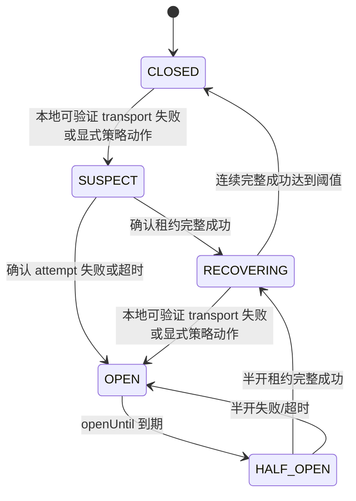

# AI 账户短窗口热质量与精准切号设计

> 当前状态：多 Agent 复核定稿（2026-07-22）。用户已确认实施；执行进度由 [PLAN-0158-20260722T160050118Z](../plans/计划-0158-20260722T160050118Z-AI账户热质量与精准切号实施.md) 跟踪。本文定义目标契约，代码仍在实施中。
>
> 2026-07-22 多 Agent 复核修订稿：同层受控探索、整请求墙钟总预算（默认 270s handoff）、实例级运行态键与物理凭据去重、同层唯一候选最多一轮、生命周期 saga 闭环。
>
> 本文定义普通路由下的账户短窗口热质量、故障单飞、受控半开、请求内精准切号和客户端止损目标。现行实现事实仍以 [策略路由设计](策略路由设计.md)、[普通路由速度优先延迟切换设计](普通路由速度优先延迟切换设计.md)、[AI 账户运行态探针恢复设计](AI账户运行态探针恢复设计.md) 和 [网关异常重试与兜底策略](网关异常重试与兜底策略.md) 为准；本文评审通过并实施时，必须同步收敛其中与本设计冲突的普通失败、优先级边界和半开语义。

## 1. 背景

上游账号的可用性变化以分钟甚至秒为单位：账号可能连续 10 分钟正常，随后 2 小时不可用；也可能前一分钟正常、后一分钟持续超时；偶尔成功一两次不能证明账号已经稳定恢复。日级历史质量无法指导当前请求，甚至会把已经失效的旧成功放大为错误偏好。

现行链路还存在以下组合风险：

- 单个请求先在同一账号原地确认多次，其他并发请求也能同时命中该账号，形成失败风暴。
- 普通失败建立共享软阻断较晚，后台确认生效前，多 IP、多会话仍可重复访问同一异常账号。
- 普通运行态降级和 IP 回避保留账户优先级层，异常高优先级账号可能持续挡住低优先级健康账号。
- 现有质量统计以后台聚合和持久结果为主，不适合作为秒级调度事实；短窗口传输完成率也不能只作为报表字段而不进入可靠性判断。
- 后排账号通常是用户主动保留的兜底资源。跨优先级或备用层的探索会消耗用户不希望使用的额度。
- 同优先级层内如果只有热门账号持续吃流量，其他同层账号会长期没有短窗口样本；账号 1 故障时，调度不知道同层 2、3 谁更可用、谁更快。

因此目标不是增加一个持久化“质量分”，而是建立一套短窗口、易失、原子共享的调度运行态。

## 2. 目标与非目标

### 2.1 目标

- 使用最近 5、10、30 分钟的真实网关流量判断账号当前可靠性和速度，旧历史快速失效。
- performance 模式使用 Redis、standalone 模式使用进程内存保存热状态，不把热质量写入业务库或统计结果库。
- 一个账号出现网关本地可验证的 transport、timeout、读取中断或未完成响应后，只允许一个请求持有确认租约继续验证；其他请求立即排除该账号并重新选号。
- 高优先级账号异常时允许当前请求有界逃逸到下一优先级层，避免客户端被异常主账号长期卡住。
- 为全部客户端恢复全局整请求墙钟预算（默认 270 秒）：服务端切号不得把客户端时间耗尽；到期 handoff 客户端重试重选。
- 保持用户配置的超级优先、账号优先级、备用和分组边界；禁止跨优先级 / 备用层探索，只允许同配置层受控观测。
- 同层受控探索只重分配真实用户请求的一小部分，不制造合成业务流量，也不让冷账号因无样本永远进不了同层排序。
- 明确路由策略是最高业务调度层；账户电路、热质量和切号只能在路由选定的分组与候选范围内工作，保证速度优先继续作为路由层目标覆盖账户偏好。
- 保持多 API Key 隔离、显式账户错误策略、响应检查、客户端画像和流式写出安全边界。

### 2.2 非目标

- 不使用日级、周级或完整历史质量直接参与实时选号。
- 不为了学习质量向后排、低优先级或备用账号发送任何探索流量；也不为无样本账号制造合成业务请求。
- 不做同时请求多个上游后取最快结果的并发抢跑。
- 不用热质量直接修改 `accounts.status`、`schedulable`、`cooldown_until` 或用户配置的优先级。
- 不把请求语义错误、客户端取消或模型能力不匹配升级为账号故障。
- 不在本设计中改变策略路由的分组绑定、权重、轮询、故障回退或混合智能语义。

## 3. 术语与分层

### 3.1 最高层级是路由策略

固定业务层级为：

```text
API Key
-> 路由策略
-> 路由选定的模式、分组顺序与路由目标
-> 选定分组内的 AI 账户调度
-> 真实上游 attempt
```

本文只设计“选定分组内的 AI 账户调度”，不得反向影响路由层：

- 不重新选择或混排路由策略绑定的分组；
- 不改变普通路由单分组边界；
- 不改变权重、轮询、故障回退、混合智能或其他策略路由的分组选择结果；
- 当前分组账户耗尽时，只向路由协调器报告当前分组不可承接；是否进入后续分组由路由策略决定；
- 路由目标与 AI 账户偏好冲突时，路由目标优先。快速模式确认慢后切号可以覆盖账户超级优先、账号优先级、备用、会话亲和和热质量。

账户状态、授权、模型能力、协议能力、额度、并发硬上限和账户电路只回答“这个账户当前能不能执行路由结果”，属于可执行性条件，不是与路由策略竞争的更高业务策略。路由策略不能强制一个实际上不可执行的账号发起请求，账户层也不能借可执行性判断改变路由策略。

### 3.2 普通路由的两种调度偏好

普通路由模式仍为 `normal`，只能绑定一个分组。`normalRoutingConfig.schedulingPreference` 区分：

- `cost_first`：本文简称“普通模式”。优先尊重账户配置、会话亲和和稳定顺序，仅在账号已不可调度或当前请求证明确实失败时切换。
- `speed_first`：本文简称“快速模式”。在硬约束和账户可用性通过后，路由层首字速度目标高于超级优先、账号优先级、备用、会话亲和与热质量；确认进入 `latency_degraded` 的账号可以被同分组未降级硬可承接账号越过。

两者共用账户故障电路、短窗口可靠性、首字定义、计时起点和 `firstByteDeadlineMs`。普通模式把截止时仍无首字解释为本地存活失败；只有快速模式继续启用慢样本累计、`latency_degraded`、确认慢后切号和速度恢复探针。

### 3.3 路由结果内的三类事实

| 类型 | 示例 | 作用域 | 能否跨账户优先级 |
| --- | --- | --- | --- |
| 路由策略目标 | 快速模式的 `latency_degraded` 与安全切号 | 路由策略 + 分组 + 账号 | 可以，路由目标高于账户偏好 |
| 账户可执行性 | 状态、授权、模型能力、并发硬上限、`OPEN`、无租约 `HALF_OPEN` | 路由选定分组内的账号 / Key / 授权实例 | 不是策略排序；不可执行账号不进入可用候选 |
| 账户配置偏好 | 非备用、超级优先、`priority`、会话亲和、热质量 | 分组绑定与请求上下文 | 仅在同等可调度范围内排序 |

路由选定模式与分组后的账户选择流程为：

```text
路由策略目标
-> 账户可执行性过滤
-> 路由目标在可执行候选上的覆盖排序
-> 账户配置层级
-> 同层热质量
-> 会话亲和与稳定顺序
```

这里的账户可执行性过滤不是高于路由策略，而是执行路由结果的必要条件。热质量不能让不可调度账号复活，不能选择路由未选中的分组，也不能把快速模式已确认慢的账号重新排到未降级账号前面。

### 3.4 冲突裁决规则

任何账户调度能力都必须按以下规则处理冲突：

1. 路由策略决定调用范围、分组顺序、路由模式和路由目标；账户层不得反向修改这些结果。
2. 账户层只能在路由结果允许的范围内过滤不可执行账号、执行账户电路和排列可执行候选。
3. 快速模式路由目标与账户优先级、会话亲和或热质量冲突时，快速模式目标胜出。
4. 快速模式选中的账号如果被账户电路判定为不可执行，账户层只能在同一已选路由范围内提供下一个可执行账号；不能强行调用该账号，也不能自行跳到未选分组。
5. 账户层没有可执行候选时，只返回“当前路由范围不可承接”的结构化结果，由路由层决定后续分组、策略 fallback 或最终错误。
6. 显式账户错误策略属于账户所有者的账户侧规则，不能改变路由范围；它只决定当前账号如何处理、是否切下一个账号或建立账户侧持久状态。

账户层返回结果固定区分：

```text
dispatchable {
  accounts
}

temporarily_blocked {
  earliestRetryAtMs
  confirmationInFlight
  blockedAccountIds
  reason
}

hard_exhausted {
  reason
}

request_exhausted {
  attemptedProtocolModelKeys
  attemptedAccountRuntimeKeys
  attemptedPhysicalCredentialKeys
  attemptedKeyFingerprints
  reason
}
```

路由协调器在账户层四类结果之外，还可产生请求级终态：

```text
client_handoff {
  reason
  remainingUntriedCandidatesPossible
  wallRemainingMs
  serverRetryRemainingMs
}
```

- `client_handoff.reason` 至少区分 `gateway_request_wall_budget_exhausted`、`precommit_budget_exhausted`、`server_retry_wait_budget_exhausted`。
- 墙钟到期时**不得**伪装成 `hard_exhausted` 或“号池永久不可用”；`remainingUntriedCandidatesPossible=true` 时明确告诉实现与观测：后续客户端重试仍可重新选号。
- `request_exhausted` 只表示本请求在当前路由范围内已无未尝试可执行候选；墙钟到期但还有未尝试好号时必须用 `client_handoff`，不能用 `request_exhausted` 糊弄。

- `temporarily_blocked` 表示当前路由范围内存在对本请求 waitable 的资源：本请求即将合法取得的 confirmation / half-open / capacity lease，或本请求自身持有的在途 confirmation，或可被事件唤醒的容量队列。外国租约与后台探针不得使本请求阻塞。若阻断账号已被本请求尝试且无合法 self-lease 例外，返回 `request_exhausted`。
- `hard_exhausted` 只表示当前路由范围内已经没有满足能力、授权、状态或其他硬资格的账号，或已经进入确定不可恢复的持久终态；瞬态 attempt 失败、短电路退避和 confirmation 在途不得构成 `hard_exhausted`。
- `request_exhausted` 表示当前请求已尝试完当前路由范围内所有本来可执行的协议作用域账号，且没有对本请求 waitable 的临时阻断；这些账号对其他新请求仍可能是 `CLOSED`，因此该结果不能写共享账号状态。账户层必须把 `attemptedProtocolModelKeys`、`attemptedAccountRuntimeKeys`、`attemptedPhysicalCredentialKeys` 与 `attemptedKeyFingerprints` 作为候选过滤输入。
- 所有路由模式都由路由协调器独占“等待、使用后备分组、执行策略 fallback 或返回最终错误”的决定；账户层不得直接调用分组 fallback。

### 3.5 各路由模式如何消费账户层结果

账户层只报告当前路由已选分组的状态。路由协调器按自身模式消费结果：

| 路由模式 | `dispatchable` | `temporarily_blocked` | `request_exhausted` | `hard_exhausted` |
| --- | --- | --- | --- | --- |
| `normal` | 在唯一分组内派发 | 唯一分组没有立即可派发账号；在共享预算内最多等待 `earliestRetryAtMs`，否则交还客户端 | 本请求的唯一分组终止，交还客户端 | 唯一分组终止，交还客户端 |
| `failover` | 在当前主用或备用分组内派发 | 当前分组此刻不可承接，由路由协调器按既有主用、备用顺序继续；所有允许分组都临时阻断时才考虑有界等待 | 本请求停止扫描当前分组，按既有备用顺序继续 | 当前分组硬耗尽，立即按既有备用顺序继续 |
| `round_robin` | 在本轮路由选中的分组内派发 | 继续本轮稳定环中的后续允许分组；全环临时阻断时才考虑最早到期时间 | 本请求停止扫描当前分组，继续稳定环中的后续允许分组 | 继续本轮稳定环中的后续允许分组 |
| `weighted` | 在本次权重选择的分组内派发 | 由权重路由协调器在本请求剩余允许分组中继续，不能由账户层重写权重或形成持久重分配 | 本请求停止扫描当前分组，由权重路由协调器在剩余允许分组中继续 | 由权重路由协调器在剩余允许分组中继续 |
| `hybrid_smart` | 在评分结果允许的目标模型和分组内派发 | 仅继续评分等级规则已允许的后续目标；账户层不能修改评分、模型档位或扩大分组范围 | 本请求停止扫描当前目标，仅继续评分等级规则已允许的后续目标 | 仅继续评分等级规则已允许的后续目标 |

`temporarily_blocked` 不是让低层强制等待的指令。存在当前路由模式允许的后续分组时，路由协调器优先推进其自身策略；只有**本请求**仍可在预算内合法取得 confirmation / half-open / capacity lease，且所有允许路径都暂时阻断、共享 `ServerRetryBudget` 与 `GatewayRequestWallBudget` 仍有余额时，才等待最近的 `earliestRetryAtMs` 或容量唤醒。墙钟不足时返回 `client_handoff`；既无 waitable 资源也无后续分组时返回 `request_exhausted`。该结果只终止本请求的当前分组扫描，不能影响下一请求的候选。

结果契约补充：

- `waitableByCurrentRequest`：仅当本请求即将合法取得 lease，或本请求自身持有在途 confirmation 时为 true。
- `leaseSource`：`self_request | capacity_event`；不得是后台探针 promise。
- `foreignLeaseInFlight`：其他请求或后台探针持有的 confirmation / half-open 不得被路由协调器 await。看到外国租约时立即换号；无替代候选则交还客户端。
- 并发槽、分组 admission 与事件驱动队列满载归入 `temporarily_blocked`，可带 `wakeSource=capacity_event` 且允许 `earliestRetryAtMs` 为空；禁止伪装为 `hard_exhausted`。

任何分组切换都不创建新预算，也不清空本请求已经尝试的协议作用域、运行态账号、物理凭据与 Key 集合。

运行态键与物理凭据键分离：

- `accountRuntimeKey` 保持实例级：自有账户使用 `accountId`；授权实例使用 `accountId + 使用方系统账户 + 本地分组 + 授权 ID`。电路、热质量、半开租约、恢复探针只按该键隔离，禁止跨授权实例共享故障态。
- `physicalCredentialKey` 仅服务**单请求去重**：`credentialSourceAccountId ?? accountId`。同一请求维护 `attemptedPhysicalCredentialKeys`，阻止同一物理凭据通过另一授权实例或分组绑定被重复打入。
- 物理键不得成为跨租户的共享电路或热质量键。

路由协调器在请求开始时创建不可变 `routePlanSnapshot`，至少包含：

```text
routePlanId
mode
requestAcceptedAtMs
gatewayRequestWallBudgetMs
gatewayRequestWallDeadlineAtMs
firstByteDeadlineMs
requestPrecommitDeadlineAtMs
finalResponseReserveMs
uncommittedAttemptDeadlineAtMs
orderedAllowedTargets
cursor
weightedDecisionToken
hybridScoreDecision
```

### 3.6 三类预算，互不替代

历史实现曾把 270 秒当成整请求绝对墙钟总预算（PLAN-0130），后为支持长会话/生图被改成只累计零可派发等待（PLAN-0134）。结果是：有多个账号可切时，服务端可能把客户端时间耗尽在连续 attempt 上，客户端反而来不及自己重试重选。

本设计恢复**全局通用**的整请求墙钟预算，同时保留等待预算语义。三类预算全部客户端、全部路由模式共用，不是 Codex 特例：

| 预算 | 默认 | 是否暂停 | 计什么 | 到期动作 |
| --- | --- | --- | --- | --- |
| `GatewayRequestWallBudget` | 270 秒墙钟 | **不暂停** | 从请求接入到决策点的绝对墙钟；约束切号、confirmation、探索、rescue、等待与后续 attempt 启动 | 决策点到期则停止服务端继续切号，把可重试错误交还客户端，让客户端重新请求并重新选号 |
| `ServerRetryBudget` | 270 秒累计 | attempt/读取期间暂停 | 仅零可派发、半开等待、并发槽/FIFO 等待 | 可恢复等待交还客户端；不等于硬无号 |
| `routeCoordinationBudget` | 3 秒累计 | fetch/首字/读取期间暂停 | 故障后重新选号、层切换、短等待 | 返回 `temporarily_blocked` 或 `request_exhausted`，由路由协调器解释 |

`GatewayRequestWallBudget` 规则：

1. `gatewayRequestWallDeadlineAtMs = requestAcceptedAtMs + gatewayRequestWallBudgetMs`，默认 `gatewayRequestWallBudgetMs = noAvailableAccountWaitTimeoutSeconds * 1000`（当前 270 秒），请求开始只解析一次，跨分组/主备/轮询/混合智能均不重置。
2. 只在**决策点**强制检查：启动下一个账号 attempt、confirmation、half-open、同层探索、快速模式 rescue、进入可恢复等待、跨分组 fallback。
3. 决策点若 `now + finalResponseReserveMs >= gatewayRequestWallDeadlineAtMs`，或剩余时间不够一次有意义 attempt，则不得再启动新 attempt；路由协调器返回客户端可重试的服务端接管结束（handoff），**不**把账号写成共享硬耗尽。
4. 下游**已提交**可见语义内容后，墙钟预算不再为了“再切一个号”而中断当前流；当前流继续受 lane timeout / idle timeout 约束。墙钟预算的职责是防止把客户端时间烧在切换上，不是截断已经对客户端可见的成功响应。
5. 下游未提交时，墙钟到期可以结束当前无首字/未提交 attempt，并 handoff；不得为了“再试更多号”越过 deadline。
6. 图像等长耗时 lane：单次已取得首字并正常推进的 attempt 可以超过 270 秒完成读取；但**切换阶段**仍受同一墙钟约束。10 个账号连续尝试若累计墙钟超过 270 秒，即使后面还有未试账号，也先交还客户端重试重选，而不是在服务端耗死。
7. 该机制对 Codex、Claude Code、Gemini CLI、generic 客户端一视同仁；动机包含“客户端自身有时间上限”，实现不得做成供应商或画像特例。

`requestPrecommitDeadlineAtMs` 由墙钟预算派生：默认等于 `gatewayRequestWallDeadlineAtMs`，并再预留 `finalResponseReserveMs`（建议 1–2 秒）给最终错误/响应写出。每次 attempt 的有效首字 deadline 必须裁剪为：

```text
min(
  firstByteDeadlineMs,
  max(0, gatewayRequestWallDeadlineAtMs - now - finalResponseReserveMs),
  max(0, requestPrecommitDeadlineAtMs - now - finalResponseReserveMs),
  max(0, uncommittedAttemptDeadlineAtMs - now)
)
```

剩余墙钟或首字前预算不足以完成一次有意义的 attempt 时，禁止 confirmation、half-open、探索或快速切号，直接按当前路由模式 handoff 给客户端。账户结果只能推进 cursor：weighted 不能重新抽样或改变本次权重决策，round-robin 不能重建环，failover 不能跳过既有主备顺序，hybrid 不能重新评分或扩大等级目标。该快照与四类账户结果一起构成 route-coordinator 的实现契约。

## 4. 不跨层探索，同层受控探索

跨优先级 / 备用层的无样本不是需要修复的饥饿；同优先级层内的长期无样本才是调度盲区。

假设分组内配置：

```text
P1: 账号 1、2、3、4
P2: 账号 5、6、7
备用: 账号 8、9
```

### 4.1 流量意图

每个真实上游 attempt 必须带不可变 `dispatchIntent`：

| 意图 | 含义 | 可否跨优先级 | 是否进入业务热质量 |
| --- | --- | --- | --- |
| `primary_service` | 正常服务当前请求 | 否，仅当前最高可调度配置层 | 是 |
| `same_tier_exploration` | 同配置层观测冷 / 缺口账号 | 否，必须精确同层 | 是 |
| `route_rescue` | 故障切号、容量逃逸、快速模式确认慢后切号 | 是，仅限路由目标与失败预算允许 | 是 |
| `circuit_confirmation` | matching-generation confirmation / half-open / recovering canary | 否，只验证当前作用域 | 否，只更新电路 |
| `background_probe` | 后台健康 / 恢复 / 冷却复测 | 否，后台任务 | 否 |

快速模式因 `latency_degraded` 切到低优先级或备用账号属于 `route_rescue`，不是探索。请求一旦因路由目标、容量逃逸、同层唯一候选一轮耗尽或 fallback 离开最高正常可调度配置层，本请求内禁用 `same_tier_exploration`。

### 4.2 边界规则

- P1 存在健康、可承接账号时，**绝不**向 P2 或备用账号发送探索流量。
- 同层探索只能发生在精确相同的账户配置层：`modelMatchRank + fallbackEnabled + superPriorityEnabled + priority`，且位于当前路由已选分组与匹配的 `protocolProfile + requestLane + modelFamily`。
- P1 全部被硬过滤、电路阻断、并发占满，或当前请求在同层唯一候选一轮后仍失败，才进入 P2；这是 `route_rescue`，不是探索。
- 非备用账号不能承接后，才进入备用账号。
- 后台健康检查和恢复探针只验证基础可用性，不属于业务探索，也不进入业务热质量与探索配额。

### 4.3 同层探索配额

探索只重分配已有真实用户请求，不制造合成业务流量。每个精确同层 peer-pool 维护 Redis / 内存原子 credit：

```text
eligible first primary_service dispatch -> credit += 0.05
credit cap = 1
spend 1 credit = 1 same_tier_exploration assignment
```

推荐初始效果：大约每 20 个合格首派发才允许 1 次探索。无时间型自动补水；用户空闲时不产生探索。附加约束：

- 每个客户端请求最多 1 次探索。
- 每个目标账号 / peer-pool 同时最多 1 个在途探索。
- 同一目标探索冷却 60 秒。
- 重试、confirmation、cutover、探针、低层派发都不增加 credit。
- 只有目标并发槽和真实上游派发都成功后才真正扣 credit；派发失败归还 credit。
- performance 模式以 Redis 为共享权威；standalone 用进程内存等价实现。

### 4.4 目标选择与冷账号

覆盖状态：

| 状态 | 条件 | 普通排序 | 探索 |
| --- | --- | --- | --- |
| `cold` | 30 分钟内有效样本 = 0 | 中性，不因缺失得负分或 `+Infinity` | 最高优先 |
| `warming` | 10 分钟内有效样本 1–2 | 参与同层排序但置信度低 | 次优先 |
| `known` | 10 分钟内有效样本 ≥ 3 | 完整热质量排序 | 仅当样本过旧时补观测 |

探索目标选择顺序：零有效样本 > 距 3 个样本缺口最大 > 最久未有效业务观测 > 最久未探索尝试 > 稳定 hash / accountId。只有 `primary_service` / `same_tier_exploration` / `route_rescue` 的有效终态可满足样本缺口并进入业务热质量；`circuit_confirmation` / `background_probe` 只更新电路，不计入热质量样本。取消 / 未知只推进防锤冷却。按 `accountRuntimeKey` 去重。

候选窗不得让同层尾部账号永远不可见。普通 top-candidate 窗口之外保留 pageable `sameTierExplorationCursor`；探索槽通过 DB-service / runtime 快照选取，不在网关热路径新增按请求 DB 查询。

### 4.5 覆盖是有条件的

禁止合成业务探针时，低流量下无法保证所有同层账号都有新鲜样本。设探索份额 `q`、10 分钟流量 `V`、样本缺口 `D`，仅当 `q * V` 在扣掉自然样本后仍能覆盖 `D` 时才能暖齐；否则允许保持 `unknown / cold`，不得借用低优先级层或制造探针。

### 4.6 普通模式与快速模式如何消费观测

| 事实 | `cost_first` | `speed_first` |
| --- | --- | --- |
| 真实用户 attempt（含同层探索与 rescue） | 更新共享可靠性与通用首字，只用于同层排序 | 同左，并额外更新本 `routeStrategyId + groupId` 的慢样本 / `latency_degraded` |
| 路由专属 `latency_degraded` | 不读不写 | 读写 |
| 探索目标已 `latency_degraded` | 可探索，但普通排序仍尊重可靠性 | 不得选为探索目标；已选后变慢按慢样本状态机处理 |
| 后台探针 | 不进入业务热质量与探索配额 | 同左 |

因此：P1 的 1、2、3 在有足够流量时会被同层探索轮转观测；账号 1 出问题后，调度可以立刻偏向同层中近期质量与速度更好的 2 或 3。快速模式尤其依赖这份同层热快照，而不是等故障现场再试错。

## 5. 热质量模型

本文“热质量”默认只表示网关可自动验证的传输完成可靠性与首字速度，不等于上游业务可用性。未配置高级规则时，一个持续快速返回完整 HTTP `401 / 429 / 5xx` 或任意错误正文的账号仍会被视为“传输完整且首字快”；这是“不依赖不可控上游响应语义”的刻意边界，不是遗漏。账户所有者若希望这些响应影响切号、Key 或账号状态，必须在前端高级设置中显式配置规则。

### 5.1 存储边界

- performance：Redis runtime state 是跨节点事实源。
- standalone：单 server 进程内存保存等价状态。
- Redis 不可用时，performance 模式不能静默退回本机内存伪装成共享状态；按运行态基础设施故障处理。
- 热质量桶全部带 TTL，可以丢失并从后续真实流量重新建立；活动电路状态也带 TTL，但不得靠自然过期直接恢复为 `CLOSED`，必须满足第 7 节的 TTL 与 due 索引不变量。
- 现有数据库 `account_quality_scores` 可以继续用于页面、报表和历史排障，但不得成为本设计的实时调度读取依赖。
- standalone 内存实现必须有固定最大条目数和到期清理；建议初始上限 10000 个热质量 key，达到上限时拒绝创建新的细分 key 并退化到已有协议级桶，不能无界增长。
- performance Redis 必须记录 key 创建拒绝、高基数退化、内存压力和写入失败指标；TTL 不是缺少基数保护的替代品。

### 5.2 作用域

自动短电路只消费网关本地可验证的 transport 事实；用户在前端高级设置里显式配置的账户错误策略或响应检查策略可以额外产生用户授权的电路动作。两类输入都先确定作用域，再选择电路 key：

| 作用域 | 典型故障 | 电路范围 |
| --- | --- | --- |
| `key` | 本地 Key 解密 / 装配失败，或用户显式高级策略指定 Key 动作 | 当前 `keyFingerprint` |
| `protocol_model` | 当前请求形态发生 transport、timeout、读取中断或未完成响应 | `accountRuntimeKey + protocolProfile + requestLane + modelFamily` |
| `account` | 多个独立 `protocol_model` 作用域均发生本地可验证失败，或用户显式高级策略指定账号动作 | `accountRuntimeKey`，跨请求、IP、会话和路由实例共享 |
| `upstream_bucket` | 多个不同账号在同一代理 / Base URL / provider 出现 transport、timeout 或读取中断 | 复用现有上游桶健康作用域 |

只有多个独立本地 transport 事实或用户显式高级策略明确指定账号动作时，才写全局 `accountRuntimeKey` 电路。单模型、单 endpoint 或单 Key 故障不能因为共享物理账号而阻断其他模型或另一条快速路由中的健康能力。任何上游状态码、响应头、错误码或正文都不能作为系统自动扩大作用域的证据。

自动从 `protocol_model` 扩大到 `account` 的首轮固定条件为：同一 `accountRuntimeKey` 在 60 秒内至少有 2 个不同 `protocol_model` 作用域分别完成 confirmation 并进入 `OPEN`，合计至少 3 次本地可验证失败，且从最早一条升级证据之后没有该账号的 transport 完整响应。升级证据使用有界 scope set、事件 ID 去重和 account generation 的原子 CAS；任一新的完整响应清除尚未提交的聚合升级证据，但不提前关闭已经建立的 account 电路。实现不得自行把单作用域的并发失败扩大成账号级故障。

热质量按以下维度隔离：

```text
accountRuntimeKey
+ protocolProfile
+ requestLane
+ modelFamily
```

- `requestLane` 至少区分 `text` 与 `image`，避免合法长耗时图像请求污染文本速度。
- `modelFamily` 只能使用模型目录或供应商驱动提供的有界规范化集合；无法稳定归类时统一退化为协议级 `unknown` 桶，不保存原始任意模型字符串形成无界 key。
- 账户优先级、超级优先和备用来自当前分组绑定，不进入质量 key。
- 快速模式 `latency_degraded` 继续使用 `systemAccountId + routeStrategyId + groupId + accountRuntimeKey`，不与通用热质量状态合并。

### 5.3 一分钟环形桶

每个热质量 key 保存最近 30 个一分钟桶，整体 TTL 建议 40 分钟。每个桶只记录有界字段：

```text
attempts
completedResponses
localTransportFailures
timeouts
readInterruptions
incompleteResponses
explicitPolicyFailures
unknownOutcomes
clientCancellations
firstByteSampleCount
firstByteSumMs
firstByteHistogram
lastCompletedAtMs
lastFailureAtMs
```

`firstByteHistogram` 使用固定桶而不是保存原始样本，例如：

```text
<=1s, <=2s, <=5s, <=10s, <=20s, <=30s, <=60s, >60s
```

Redis 更新必须使用原子脚本或等价 Store 操作完成“校验 attemptId 终态幂等键、选择当前分钟桶、递增计数、刷新 TTL、清理过期桶”，禁止每次 attempt 使用 `GET -> 修改 -> SET` 丢失并发增量。每个 `attemptId` 只能提交一次终态；短 TTL 去重键或等价 CAS 必须覆盖 finalizer 重入、队列重放和双 server 重复提交。

逻辑终态键为 `gateway-attempt-terminal:v1:{attemptId}`，保存有界 `terminalOutcomeId / outcomeClass / failureScope / source / createdAtMs`，TTL 至少 1 小时；不得保存上游状态码、响应头或正文。后续质量、电路和 usage 投影都以 `terminalOutcomeId` 去重。

`attempts` 在真实上游派发成功后递增，用于审计实际负载。同一个 attempt 在可靠性计数中只能有一个终态：命中用户显式高级规则的失败动作优先计入 `explicitPolicyFailures`，不再同时计入 `completedResponses`；未命中用户高级规则的完整响应计入 `completedResponses`；形成完整响应前的本地失败计入对应本地失败字段；客户端取消、租约过期但结论未知或进程终止等情况计入 `unknownOutcomes / clientCancellations`。未知和客户端取消不进入完成率分母。这项互斥只服务于用户授权后的质量语义，不允许系统自行解析完整响应。

`localTransportFailures` 是本地失败终态总数，`timeouts / readInterruptions / incompleteResponses` 只是它的互斥诊断子类，计算 `qualityAttempts` 时不得重复相加。

### 5.4 5/10/30 分钟计算

最近 5、10、30 分钟分别计算带先验传输完成率：

```text
qualityAttempts = completedResponses + localTransportFailures + explicitPolicyFailures
adjustedCompletionRate = (completedResponses + 2) / (qualityAttempts + 4)
```

综合可靠性建议：

```text
reliability = completionRate5m * 0.60 + completionRate10m * 0.30 + completionRate30m * 0.10
confidence = min(1, qualityAttempts10m / 10)
effectiveReliability = 0.5 + (reliability - 0.5) * confidence
```

先验和置信度用于防止一个新账号凭一次快速完成直接登顶，也避免无样本账号被默认判死。推荐初始分级：

| 条件 | 可靠性等级 |
| --- | --- |
| 最近 10 分钟有效样本少于 3 | `unknown`（覆盖态 `cold`/`warming`，排序中性） |
| 最近 5 分钟样本至少 3，且 `effectiveReliability >= 0.85` | `healthy` |
| 最近 5 分钟样本至少 3，且 `effectiveReliability < 0.60` | `unhealthy` |
| 其他 | `uncertain` |

可靠性分级只影响同账户配置层内排序；本地可验证的 transport 即时失败是否短暂阻断当前作用域由账户电路决定，不等待统计阈值。这里的“完成率”只表示网关完成了传输，不表示系统认可上游业务内容。

### 5.5 速度信号

热速度只使用真实网关请求的首字样本，输出：

- 5 分钟首字 EWMA；
- 10 分钟固定直方图近似 P95；
- `fast / normal / slow / unknown` 速度等级。

速度信号不能覆盖可靠性、电路和快速模式的 `latency_degraded`。普通模式仅在同一账户配置层、相同可靠性等级内用速度减少不必要等待；快速模式仍由路由自己的阈值、慢样本窗口和恢复状态决定是否跨层覆盖。

## 6. 自动输入与用户高级策略

### 6.1 系统自动机制只认本地可验证事实

系统自动热质量、短电路和切号只能消费以下事实：

- 已经选中账号并准备发起真实 HTTP(S) 请求，但连接、代理建立或请求发送在形成完整上游响应前失败；
- 上游在形成完整响应前达到当前 lane 的 timeout；
- 非客户端取消导致的读取中断、EOF、连接重置或未完成响应；
- 精确流式链路在下游语义尚未提交时发生本地可验证的传输不完整；
- 前序账号发生上述本地失败，后续账号对同一请求形成完整响应，证明本次请求可以通过切号救回；
- 后台探针执行器只返回独立 `TransportProbeOutcome`：`framing_complete / transport_incomplete / unknown`；热电路与速度恢复**禁止**读取 `AccountTestResult.success` 或任何要求 2xx / 协议完成内容的现有 success 字段。

自动机制不维护任何上游状态码、错误码、错误类型、响应头、正文、文案、完成状态或供应商特例白名单。自动退避固定使用本文的本地退避序列，不读取上游 `Retry-After` 或类似提示。

### 6.2 任何完整上游响应默认不进入自动处理

只要通用客户端收到完整上游 HTTP 响应，且没有命中用户显式高级规则，无论状态码、响应头和正文是什么，系统都视为“传输已完成”：

- 原样转发状态、允许的响应头和正文；
- 不自动重试或切号；
- 不轮换账户内 Key；
- 不写 Key、`protocol_model` 或账户短电路；
- 不累计热质量失败，只累计 `completedResponses` 和实际首字时间；
- 不据此写持久账户状态或后台失败结论。

精确客户端画像可以继续完成协议兼容和向客户端渲染协议事件，但不能依据完整响应语义自动重试、切号、轮换 Key、写电路或写账户状态。现有任何 `system_default` 响应检查、默认错误类型表或内置客户端重试规则都不构成用户授权；实施本文时必须停用其账户调度副作用，或改造成由账户所有者在前端显式启用的模板。

### 6.3 用户前端高级设置是唯一响应语义入口

只有账户所有者在前端高级设置中显式配置账户错误处理策略或响应检查策略时，状态码、响应头、错误码、正文、JSON 路径、SSE 事件或完成状态才可以作为该规则的输入。

- 系统只执行规则匹配后用户明确选择的 `retry_next`、Key 避让、账号 TTL 避让、`temporary_unavailable`、`rate_limited`、`error` 或其他已声明动作。
- 规则必须明确适用的客户端画像、协议、账号 / Key 作用域和动作；未配置的响应保持完全不透明。
- 用户规则命中产生的短电路事件标记 `source = explicit_policy`，与系统自动 transport 事件分开统计。
- 用户显式 TTL 和持久状态只能按配置到期、后台复测或人工操作恢复；自动 transport 成功不能提前解除。

统一终态裁决顺序为：客户端取消或结论未知；用户显式高级规则动作；未命中规则的 transport 完整；形成完整响应前的本地失败。系统先以 `attemptId` 原子创建唯一 `attempt-terminal` 记录，选定其中一个分支；热质量、电路和使用记录再以同一 `terminalOutcomeId` 幂等投影，不要求跨多个 Redis key 做脆弱的伪事务。显式失败动作优先于“传输完整”，因此不会先进入 `RECOVERING` 再被同一结果重新打开；未配置规则时则绝不能跳过“完整响应透明”边界。

### 6.4 多 API Key

- 系统自动机制不能因为任意完整上游响应轮换或摘除当前 Key。
- selected Key 在本地解密、装配或读取运行态时失败，可以建立 Key 级本地电路并尝试账户内下一个可执行 Key。
- transport、timeout 或读取中断默认进入当前 `protocol_model` 或 `upstream_bucket` 作用域，不因使用了某个 Key 就自动归咎该 Key。
- 只有用户显式高级策略指定 Key 动作时，才允许根据上游响应内容建立 Key 电路。
- 所有 Key 都因本地可验证原因不可执行，或用户显式策略指定账号级动作时，才推进账户级电路。
- Key、`protocol_model` 和账户电路都使用 generation 与租约，旧结果不能覆盖新配置或新凭据状态。

## 7. 账户电路状态机



### 7.1 状态语义

| 状态 | 普通请求 | 租约请求 | 说明 |
| --- | --- | --- | --- |
| `CLOSED` | 正常候选 | 不需要 | 没有共享故障阻断 |
| `SUSPECT` | 排除并换号 | 仅一个 confirmation lease | 首次本地可验证失败后的即时止损 |
| `OPEN` | 排除并换号 | 不允许 | 等待短退避到期 |
| `HALF_OPEN` | 排除并换号 | 仅一个 probe lease | 到期后的单飞验证 |
| `RECOVERING` | 普通请求排除并换号 | 仅一个 matching-generation recovery canary lease | 防止偶尔成功一次立即恢复全部流量 |

只有未命中用户显式失败动作，并且 transport 层形成完整 HTTP 响应，或 SSE 在未发生读取中断的情况下正常结束，才算账户恢复成功；判定过程不得检查 HTTP 状态码、响应头或业务正文。仅收到响应头、首字节、部分 token、心跳，或请求被客户端取消，都不能关闭电路。

`RECOVERING` 不允许普通请求无租约进入。每次只能有一个匹配当前 generation 的 recovery canary lease；canary 完整成功后原子递增 `recoveringSuccesses`，等待建议 3 秒恢复间隔后再允许下一个独立 lease。连续 3 个不同 lease 完整成功才进入 `CLOSED`。任意本地可验证 transport 失败或用户显式策略失败动作立即进入 `OPEN` 并增加退避；取消、没有形成真实 attempt 或旧 generation 结果只释放租约，不计成功或失败。后台恢复探针和受控真实请求都必须先取得该 lease，且恢复探针不进入业务热质量统计。

### 7.2 Redis 状态

建议逻辑 key：

```text
gateway-circuit:v1:account:{accountRuntimeKey}
gateway-circuit:v1:key:{accountRuntimeKey}:{keyFingerprint}
gateway-circuit:v1:protocol-model:{accountRuntimeKey}:{protocolProfile}:{requestLane}:{modelFamily}
gateway-policy-block:v1:{policyScope}
gateway-hot-quality:v1:{qualityScope}
```

电路值至少包含：

```text
state
failureScope
generation
leaseId
leaseUntilMs
attemptHardDeadlineMs
openUntilMs
backoffLevel
consecutiveFailures
recoveringSuccesses
lastFailureClass
transitionId
dispatchRevision
updatedAtMs
```

状态获取、租约获取、结果提交和 generation 清理必须使用原子 CAS。一次脚本或等价事务同时核对 `state + generation + leaseId + dispatchRevision`，更新 `openUntilMs / leaseUntilMs / attemptHardDeadlineMs / transitionId`、刷新 TTL，并维护 due 索引；不得分步留下 state 与索引不一致。多 server 同时看到到期状态时只能有一个请求从 `OPEN` 取得 `HALF_OPEN` 租约。CAS 冲突、租约争抢、旧结果丢弃和幂等重复提交都必须有独立指标和双节点回归。

confirmation、half-open 和 recovery canary 的初始租约必须一次覆盖该 attempt 的 hard lifetime 加安全余量，`attemptHardDeadlineMs` 之前不得因心跳抖动重新发放同 generation 租约；心跳只能延长租约，不能缩短排他窗口。这样即使事件循环暂停或 Redis 短时不可用，也不会产生第二个昂贵上游验证请求。

活动状态不能依赖 Redis 自然过期来恢复：电路 key 的 TTL 必须至少覆盖 `max(openUntilMs, leaseUntilMs, RECOVERING 最迟可完成时间) + 10 分钟`，并在每次原子转换时刷新。缺失 key 只有在 due 索引也没有成员、没有用户策略阻断且没有在途 fencing 记录时才能按 `CLOSED` 处理。后台任务必须惰性清理“索引有成员但状态缺失”和“状态存在但索引缺失”的孤儿，并记录修复指标。

用户显式 TTL / 持久阻断与自动 transport 电路使用独立状态：`gateway-policy-block` 只由用户规则动作、规则到期、后台复测或人工操作修改；自动电路的 canary 成功只能关闭自动层。最终可执行性取“用户策略阻断层允许”与“自动电路层允许”的交集，任何自动 `CLOSED` 都不能覆盖用户 TTL。

显式策略阻断值至少包含 `blocked / policyId / policyGeneration / expiresAtMs / dispatchRevision / updatedAtMs / source=explicit_policy`。策略服务是唯一 owner；设置、续期、到期清理和人工解除都用 `policyGeneration + dispatchRevision` CAS，并维护独立 TTL / due 索引。自动电路脚本只能读取该层，不能修改、清除或把其缺失解释为用户规则已解除。

账号凭据、代理、协议档案、模型映射或影响真实派发的配置变化必须原子递增 `dispatchRevision`、递增 generation 并清理旧 due 索引。旧 revision 的在途结果只能释放本地资源，不能提交 `OPEN / RECOVERING / CLOSED`。

`lastFailureClass` 只允许保存有界的本地类别，例如 `connect_failed / timeout_before_complete / read_interrupted / incomplete_response / explicit_policy`；不得保存或派生上游状态码、错误码、正文摘要或供应商文案。

### 7.3 推荐初始参数

| 参数 | 建议值 |
| --- | --- |
| confirmation 首字 deadline | 使用本次请求统一的 `firstByteDeadlineMs` |
| 同账号 confirmation 重试 | 最多 1 次 |
| 半开同时请求 | 1 |
| 短退避序列 | `3s -> 5s -> 10s -> 30s -> 60s` |
| 自动运行态最大退避 | 5 分钟 |
| `RECOVERING` 并发 | 1 |
| recovery canary 间隔 | 3 秒 |
| `RECOVERING -> CLOSED` | 连续 3 次完整成功 |
| `RECOVERING` 失败 | 立即重新 `OPEN` 并增加退避 |

用户显式策略建立的 TTL、持久 `temporary_unavailable / rate_limited / error` 和后台持久冷却复测继续使用现有语义；短账户电路是请求热路径保护，不替代账户所有者的显式策略。

### 7.4 完整生命周期闭环

切号只解决“当前请求别再打坏号”；没有状态流转和恢复，高并发下会把波动号池打成“看起来无号可用”。生命周期必须闭环：

```text
可调度(CLOSED + 持久 active)
  -> 即时止损(SUSPECT/OPEN，请求热路径)
  -> 后台核实(recovery_wait / 独立探针)
  -> 软阻断(precheck_pending) 或 速度降级(latency_degraded)
  -> 受控半开 / RECOVERING
  -> 恢复 CLOSED
     或 持久 temporary_unavailable / rate_limited / error
  -> 冷却复测 / 人工恢复
  -> 重新可调度
```

分层职责：

| 层 | 状态 / 机制 | 谁可写 | 对调度影响 | 恢复 |
| --- | --- | --- | --- | --- |
| 请求热路径短电路 | `SUSPECT / OPEN / HALF_OPEN / RECOVERING` | 网关本地 transport 或用户显式策略 | 立即排除普通业务流量；单飞验证 | framing 完整 canary / 到期半开；不读状态码 |
| 后台运行态 | `recovery_wait`、`precheck_pending`、`runtime_degraded` | 仅独立后台探针确认后 | 软阻断普通候选；保留探针与半开 | 探针 framing 完整或匹配 generation 半开成功 |
| 路由速度态 | `latency_degraded` | 仅 speed_first 路由上下文 | 未降级账号优先；账号仍可兜底 | 连续首字达标 / TTL / 手动；不写持久故障 |
| 持久账户状态 | `temporary_unavailable` / `rate_limited` / `error` / `disabled` | 后台确认且并发归零后，或用户显式策略 | 硬不可调度 | 冷却复测、有界探活开关、人工恢复 |
| 用户策略阻断 | `gateway-policy-block` | 仅显式高级规则 | 与自动层取交集 | TTL / 人工；自动成功不能提前解除 |

交接不变量：

1. 普通请求失败最多首次投递 `recovery_wait`；不得直接写 `precheck_pending` 或持久冷却。
2. 短电路成功恢复不能清除用户 TTL，也不能直接把持久异常改成 `active`。
3. 后台探针把运行态升级为持久状态时，必须使用可重放的 `transitionId + generation + dispatchRevision`；重复投递只生效一次。
4. 持久冷却复测与短电路半开不得并发双开同一 `accountRuntimeKey` 的昂贵上游验证；取得 lease 的一方继续，另一方观察或延后。
5. Redis 丢失后不得把“key 不存在”解释为健康可调度；结合 due 索引、policy block、fencing 与持久状态做保守重建。
6. 页面上“可调度”必须是：持久可调度 ∩ 无有效 policy block ∩ 短电路允许普通流量 ∩ 非 `precheck_pending`。任一为假就不能继续显示成正常可调度。
7. 高并发波动期允许大量账号短暂 `OPEN`，但必须靠半开 / 后台复测把它们拉回，而不是让所有请求继续打或全部永久死亡。

### 7.5 控制面持久化、Saga 与唯一 Writer

热质量桶可以完全易失；但 `CLOSED` 以外的活动 circuit incident、最新 `dispatchRevision` watermark 与关闭 tombstone 属于可重建控制事实。

- performance：状态转换必须经可靠队列写入最小持久 incident ledger；Redis 启动后先按 ledger 重建。重建完成前相关作用域返回 `temporarily_blocked(reason=runtime_state_rebuilding)`，不得 fail-open 成健康。
- standalone：进程重启同样从业务库 / 本地 ledger 重建；重建完成前行为同上。
- 若产品明确接受 Redis 丢失后 fail-open，必须删除“活动状态不得因过期恢复”的保证，并写入告警与验收；本文默认不接受。

`dispatchRevision` 跨 DB 与 Redis 不做伪原子事务，采用 outbox saga：

1. 配置事务只负责原子递增持久 `dispatchRevision` 并写入 outbox。
2. Redis 消费 outbox 后以 `runtimeKey + dispatchRevision` 写 revision tombstone，条件清理更旧 circuit / due。
3. 任何首次建 circuit、租约取得和结果提交都必须携带 attempt 派发时 revision，并与当前 watermark 比较；旧 revision 不得创建新状态。
4. 清理事件也必须带 revision，禁止无条件删除。
5. tombstone 至少保留 `max(attempt hard lifetime, 终态去重 TTL, 配置传播窗口)`。

短电路与持久冷却交接：

1. 持久升级使用 `PERSISTING` / `SHADOWED_BY_PERSISTENT` 交接态。
2. DB CAS 必须写入 `circuitIncidentId + dispatchRevision + cooldownObservationGeneration`；成功后 outbox 推进 Redis 为 shadowed / retired。
3. 恢复 DB CAS 原子递增持久状态 revision，再 outbox 关闭或重建对应 circuit。
4. 后台 reconciler 以 DB 为持久状态事实源，修复“DB 已阻断、Redis 未 shadow”和“DB 已恢复、Redis 仍 shadow”。
5. 不得仅依赖进程内 post-commit 清理。

唯一 writer 矩阵：

| Owner | 可写对象 | 禁止 |
| --- | --- | --- |
| `CircuitStore` | 自动 circuit 状态、due、lease | 直接改持久 `accounts.status` |
| Web due sweep / 受控业务 canary | 通过 lease API 提交 transport 证据 | 无 lease 清理 circuit |
| 周期健康检查 | 健康事实；仅在取得当前 circuit lease 后可提交恢复证据 | 无条件 `runtime clear` |
| ops-worker 冷却复测 | 持久冷却状态 + outbox 通知 | 直接删 Redis circuit |
| 人工恢复 / 配置保存 | 持久 revision / tombstone / outbox | 按 accountId 无条件删除运行态 |

恢复证据必须携带：

```text
incidentId
circuitScopeKey
proofScope
terminalOutcomeId
transportComplete
protocolSuccess
observedDispatchRevision
leaseId
```

Key circuit 只接受同 Key 证据；protocol-model circuit 只接受同协议 / lane / modelFamily 或驱动声明可覆盖该作用域的证据；account circuit 关闭需要覆盖导致升级的独立 scope 集合，不能由单一健康模型替代。`transportComplete` 只驱动自动短电路；`protocolSuccess` 继续服务持久健康检查和冷却语义。

未知 / 取消 / owner 丢失终态：

- 状态值至少含 `nextTransitionAtMs / attemptStartedAtMs / upstreamAttemptObserved / leasePurpose / leaseOwnerRunId`。
- 未知或取消只清 lease，并原子设置下一次 due；不得伪造成失败。
- 真实 attempt 已开始但 owner 在 hard deadline 前丢失：记 unknown，到达 due 后由 Web due sweep 或请求 CAS 取得下一 lease。
- lease 释放、超时回收、状态变化和 due 更新必须在同一原子操作完成。

`attempt-terminal` 是不可变事件，不是“全部投影完成”标记。每个 projector 必须有独立幂等 ACK；自动 circuit 的 terminal 创建与 circuit transition 应在同一 Redis 原子操作内完成，或 terminal 进入可靠队列并重放到显式 ACK。读到既有 terminal 时必须继续补齐未完成投影。terminal TTL 不得短于可靠队列最大重放窗口。

每轮故障生成稳定 `incidentId`，状态转换另用 `transitionId`。升级时记录 `parentIncidentId / childIncidentIds / causedByTerminalOutcomeId`；父级 account circuit 只 shadow 子 scope，不隐式关闭子 circuit；父级关闭后仍由子状态决定对应请求是否可派发。`CLOSED` 仅表示“当前自动 circuit 层不再阻断”，不等于账户整体 dispatchable。关闭时原子移除 due 并保留 CLOSED tombstone。

进入 `RECOVERING` 时 `recoveringSuccesses = 0`；只有进入该状态后取得的 3 个不同 recovery-canary lease 完整成功才关闭。confirmation / half-open 进入 `RECOVERING` 的那次成功不计入这 3 次。

## 8. 单飞确认与并发换赛道

一个 `CLOSED` 账号首次出现本地可验证 transport 失败，或命中用户显式高级策略的失败动作时，失败请求原子尝试：

1. 把电路从 `CLOSED` 转为 `SUSPECT`，递增 generation。
2. 获取该 generation 的 confirmation lease。
3. 租约持有者最多再确认一次同账号；确认 attempt 复用本请求解析出的同一 `firstByteDeadlineMs`，并再按 `requestPrecommitDeadlineAtMs / finalResponseReserveMs` 裁剪，不得另设更短或更长 timer。初始租约一次覆盖真实 attempt 的 hard lifetime 与安全余量；心跳只允许延长。账号仍有匹配 generation 且未超过 `attemptHardDeadlineMs` 的在途 attempt 时，禁止其他请求重新取得确认租约。
4. 其他请求读取到 `SUSPECT` 后，不等待外国租约结果，立即排除该账号并在当前分组重新选号；不得 await 后台探针。

动作矩阵：

| 触发 | 是否同账号 confirmation | 后续 |
| --- | --- | --- |
| 系统自动 transport 失败 | 是，matching-generation 最多一次 | 失败后切号 |
| 用户显式 `retry_next` | 否 | 直接下一个账号 / Key 范围外切号 |
| 用户显式 Key 动作 | 否 | 只避让该 Key，尝试同账号未尝试 Key |
| 用户显式 `cooldown / disable` | 否 | 建立 policy block，立即换号 |

故障响应返回前已经发往该账号的在途请求不能撤回；本设计保证失败被观察后的新请求不再继续灌入。

confirmation 重试只允许发生在下游语义尚未提交时。confirmation 与普通 attempt 共用本次请求的 `firstByteDeadlineMs`，不再设置 5 秒 confirmation 专属 deadline，也不被协调等待预算改写。confirmation 是真实上游 attempt，其 fetch 与首字观察期间 `routeCoordinationBudget` 暂停；如果当前请求已经没有首字前 attempt 预算，租约持有者直接换号，不强行确认。首字截止只限制首字前等待：一旦收到可见首字，后续响应读取继续使用当前 lane timeout 和流式 idle timeout；只有 HTTP framing 完整，或 SSE 在没有读取中断的情况下正常结束，才提交恢复结果，且不得检查业务正文。

confirmation 租约到期但没有形成真实上游 attempt、或租约请求被客户端取消时，结论为未知：只释放当前租约并允许下一次受控确认，不能把“没有得到结论”伪造成账号失败并推进退避。

半开租约和 confirmation 租约都禁止同账号原地多轮重试。租约失败只提交一次状态转换和一次结构化日志，其他因电路被排除的请求不重复写上游失败日志。

## 9. 候选分层与请求预算

### 9.1 账户配置层

基础层级继续使用：

```text
modelMatchRank
-> fallbackEnabled
-> superPriorityEnabled
-> priority
```

热质量只允许重排完整层级相同的账号。`cold / unknown` 账号不获得负分或 `+Infinity`，按绑定创建顺序和账号 ID 保持稳定中性顺序；`warming` 参与排序但置信度低；充分样本后的 `known` 才用完整热质量重排。冷账号主要靠同层探索获得样本，不靠跨层探索。

### 9.2 有界优先级逃逸

普通失败不能让客户端依次等待当前层所有异常账号。每个请求维护：

```text
attemptedProtocolModelKeys
attemptedAccountRuntimeKeys
attemptedPhysicalCredentialKeys
attemptedKeyFingerprints
sameAccountConfirmationBudget
currentTierKey
currentTierUniqueAttemptCount
routeCoordinationBudget
```

推荐初始值：

| 预算 | 统一标准 |
| --- | --- |
| 普通同账号原地重试 | 0；仅允许一个 matching-generation confirmation lease |
| confirmation lease 持有者 | 1 |
| 同优先级层本地可验证失败 | 同层所有唯一候选最多一轮；不设固定 2 账号上限 |
| 首字观测 | `normalRoutingConfig.firstByteDeadlineMs`，普通模式和快速模式完全共用；默认 10 秒，范围 10–60 秒 |
| 路由协调等待 | 一个 `routeCoordinationBudget`，初始最多 3 秒 |
| 整请求墙钟总预算 | `GatewayRequestWallBudget`，默认 270 秒绝对墙钟，不暂停；决策点到期 handoff 客户端重试重选 |
| 零可派发等待预算 | `ServerRetryBudget`，默认 270 秒累计，attempt/读取暂停 |

同层规则：当前层内每个唯一 `accountRuntimeKey + protocolProfile + requestLane + modelFamily` 在本请求最多真实 attempt 一次（confirmation / half-open lease 例外一次）。同层唯一候选全部尝试过或均不可执行后，才允许进入下一账户配置层。该行为只影响当前请求，不重写账户优先级。已经 `SUSPECT / OPEN / HALF_OPEN` 的账号不计为本请求真实失败，也不消耗上游 attempt；它们直接从普通候选中移除。

如果当前层所有账号已经处于 `SUSPECT / OPEN / HALF_OPEN`，候选扫描直接进入下一账户配置层，不等待、不重复扫描。进入新层时重置 `currentTierKey / currentTierUniqueAttemptCount`，但不清空全局 `attempted*` 集合。同一个 `accountRuntimeKey + protocolProfile + requestLane + modelFamily` 在 `attemptedProtocolModelKeys` 中只允许出现一次；只有合法 confirmation / half-open lease 可以消费一次例外。只有 account 电路已经建立，或用户显式 account 级动作命中时，才把 `accountRuntimeKey` 加入全局 `attemptedAccountRuntimeKeys`；物理凭据去重写入 `attemptedPhysicalCredentialKeys`。

普通路由在请求开始时只解析一次 `normalRoutingConfig.firstByteDeadlineMs`，普通模式、快速模式、confirmation 和同请求后续账号 attempt 都复用这个值。建议默认 10 秒、允许 10–60 秒，且始终不超过当前 lane first-response timeout。现有 `speedFirstConfig.firstByteThresholdMs` 作为迁移兼容别名读取；目标结构写入公共 `normalRoutingConfig.firstByteDeadlineMs`，迁移完成后删除速度模式专属字段，禁止两个字段同时生效。image 等合法长耗时 lane 继续按 lane 规则决定是否启用首字观测，但一旦启用，也只能产生同一种首字事件。

统一首字协议固定为：真实上游派发时启动一次计时；非流式以首个 body 字节、流式以首个可见语义 chunk 为首字；响应头、SSE heartbeat、空事件和内部缓冲不算；每个 attempt 只产生一次 `observed / deadline_reached / cancelled / unknown` 结果。任何账户层、响应处理层或快速模式都不能再创建第二个首字 timer。

两种模式只在统一结果后的路由动作上不同：`cost_first` 在截止前严格保持超级优先、优先级和会话亲和；截止时仍无首字则由路由层形成一次 `timeout_before_complete`，有替代候选时切号，没有替代候选时结束当前 attempt，不再继续等另一套 120 秒首字 timeout。`speed_first` 在同一截止事件上先记录慢样本，是否切号仍由 `slowTriggerCount`、`latency_degraded`、下游提交状态和请求内切号上限裁决。快速模式不能改变首字 deadline，只能决定事件后的动作。

尝试身份按失败作用域更新：本地 Key 准备失败或用户显式 Key 级动作只加入 `attemptedKeyFingerprints`，允许同一账号尝试另一个未尝试 Key；真实 transport 失败首先加入当前 `attemptedProtocolModelKey`，保持 model / lane / protocol 隔离；account 电路升级或用户显式 account 级动作加入实例级 `attemptedAccountRuntimeKeys`；同一请求额外记录 `attemptedPhysicalCredentialKeys`，阻止同一物理凭据通过另一授权实例再次进入，但不共享电路或热质量。完整响应若没有用户显式动作则直接结束请求，不产生新的尝试身份。

`routeCoordinationBudget` 是普通模式和快速模式共享的单一账户协调预算，统一累计：故障 attempt 结束后的租约等待、confirmation 结果后的重新选号、优先级层切换和零可派发等待。活跃上游 fetch、统一首字观察和响应读取期间暂停；不再存在“故障后切号等待”和“零可派发等待”两套预算。普通模式和快速模式都消费同一个首字观测事件；快速模式只额外使用 `slowTriggerCount`、`maxFirstByteRetriesPerRequest` 和未提交安全窗口决定动作。账户层或快速模式都不能创建第二个首字或协调等待计时器。

3 秒统一协调预算不替代、不缩短 `ServerRetryBudget`，更不替代 `GatewayRequestWallBudget`。协调预算到期时，如果存在可恢复账号，账户层返回 `temporarily_blocked` 及 `earliestRetryAtMs / confirmationInFlight`；如果只是本请求已经没有未尝试候选，则返回 `request_exhausted`；两者都不能伪装成 `hard_exhausted`。路由协调器再依据当前路由模式、后续分组、共享 `ServerRetryBudget` 与整请求墙钟预算决定等待、fallback 或最终 handoff 客户端。

`ServerRetryBudget` 每个网关请求只创建一次，并且只有路由协调器能够启动、暂停和消费它。派发真实 attempt 前暂停；`routeCoordinationBudget` 运行时同步受它约束；跨账号、账户配置层、分组、主备和轮询环均不得重置。单次等待上限固定为 `min(routeCoordinationBudgetRemaining, ServerRetryBudgetRemaining, wallRemainingMs, max(0, earliestRetryAtMs - now))`。

`GatewayRequestWallBudget` 是更高层的硬边界：即使还有未尝试好号，只要墙钟在决策点已到期，也必须 handoff 客户端，让客户端发起新请求重新选号。这与“有号可用却继续在服务端死磕到客户端超时”相对。墙钟耗尽不得写成账户硬耗尽，也不得阻止下一次客户端请求使用这些账号。

预算状态至少包含 `requestId / budgetId / version / remainingMs / activeSinceMs / lastWaitToken`。同一请求的异步分支只能由 route coordinator 使用 `version` CAS 启停；每次等待携带幂等 `waitToken`，重复唤醒、取消回调或 fallback 回调不能重复扣减。账户层只能读取剩余值，不能创建、续期或消费预算。

预算值是首轮建议，实施前需要通过 Mock AI 的 5 个高优先级异常账号、5 个低优先级健康账号场景验证，并根据真实首字分布调整。故障已经形成后，协调等待不得重新放大到客户端自身重试之前无法完成切号的分钟级等待。

## 10. 普通模式行为

普通模式即普通路由 `cost_first`：

1. 接收路由策略已经选定的普通路由唯一分组，不参与分组选择。
2. 在该分组内执行账户可执行性，以及与当前请求匹配的 Key、`protocol_model`、account 和 `upstream_bucket` 电路过滤。
3. 按非备用、超级优先、`priority` 建立账户配置层。
4. 在当前最高可用层内按 `healthy -> uncertain -> warming/cold(中性) -> unhealthy` 排序；缺失样本不得排到最后或得到 `+Infinity`。
5. 相同可靠性等级内使用热速度、会话亲和和稳定顺序。
6. 当前账号发生本地可验证 transport 失败或命中用户显式策略动作后触发单飞确认；其他请求立即选择同层后续账号。
7. 当前请求同层唯一候选一轮耗尽后进入下一账户层；所有账户层不可承接时向路由层报告当前分组耗尽，不自行选择其他分组。
8. 前层账号保持健康时，不访问后层账号；同层可按第 4 节配额做 `same_tier_exploration`，但不得跨层探索。
9. 同层探索只改变同层首派发目标，不削弱超级优先层对后层的屏蔽，也不把探索目标提升为跨层偏好。

质量差本身不允许一个 `CLOSED` 高优先级账号被低优先级账号长期越过；只有账户电路、硬不可用、容量不可承接或当前请求同层一轮失败后的 `route_rescue` 能够触发跨层逃逸。

## 11. 快速模式行为

快速模式即普通路由 `speed_first`。路由策略是最高业务调度层，快速模式的速度目标高于任何 AI 账户偏好；账户可执行性只负责排除无法执行该路由结果的账号。本设计不能削弱现有快速模式。

固定流程：

1. 接收路由策略已经选定的普通路由唯一分组和 `speed_first` 目标，不参与分组或模式选择。
2. 在该分组内通过账户可执行性，以及与当前请求匹配的 Key、`protocol_model`、account 和 `upstream_bucket` 电路移除实际上不能执行的账号。
3. 对剩余可执行候选应用路由层 `latency_degraded`：未降级账号整体优先于已确认慢账号。
4. 未降级候选之间、降级候选之间再按账户配置层和同层热质量排序。
5. 若仍停留在最高正常可调度配置层且探索配额允许，可把首派发改写为同层 `same_tier_exploration` 目标；离开该层后本请求禁用探索。
6. 当前 attempt 首字超过软阈值时，仍按快速模式配置累计慢样本；未达到 `slowTriggerCount` 只观察，不因热质量直接中断。
7. 已确认慢、下游未提交、存在未降级硬可承接候选、未超过 `maxFirstByteRetriesPerRequest` 且整请求首字前预算仍足够时，快速模式可以跨超级优先、账号优先级和备用层切到未降级账号；该动作为 `route_rescue`。
8. 快速模式切号目标不能被热质量重新限制在原账户优先级层，也不能被会话亲和拉回 `latency_degraded` 账号。
9. `latency_degraded` 清理后，后续请求立即回到账户配置和热质量排序；替补账号不能形成长期更强亲和。

账户故障与速度慢必须保持独立：

- `SUSPECT / OPEN / HALF_OPEN` 表示账号当前不能接受普通业务流量，普通模式和快速模式都必须避让。
- `latency_degraded` 表示账号可用但违反当前快速路由的速度目标，只影响启用该快速模式的路由范围。
- 热质量中的速度等级只作为同层细粒度信号，不能代替快速模式的慢样本状态机。
- 快速模式确认慢后的安全切号不消耗账户 confirmation 重试预算；本地可验证 transport 失败或用户显式策略动作也不需要先等待慢样本阈值。

## 12. 流式与客户端边界

- 下游语义提交前可以排除失败账号并重新选号。
- SSE 已写出可见语义内容后，不允许切号拼接另一个账号输出，也不允许重新发送工具调用。
- SSE 心跳、仅响应头或内部缓冲未提交不算完整恢复成功，是否允许切号继续沿用 `downstreamCommitState`。
- 非流式响应只有在完整 body 读取结束后才提交下游；读取中断前不把部分 body 当成成功。
- confirmation / half-open 的流式首个可见语义 chunk 按正常链路立即提交并转发，不为等待完整恢复结果缓存整条流；提交后若读取中断，当前客户端只能结束断流，同时为后续请求重新打开对应电路，不能再切号拼接。
- 精确 Codex、Claude Code、Gemini CLI 客户端可以保持协议事件渲染和客户端侧重试提示，但服务端不能依据完整响应语义自动重试、切号、轮 Key 或写账户状态。
- `generic_*` 的任何完整上游响应继续透明转发，不能建立自动账户电路；只有形成完整响应前的本地 transport 失败，或用户显式高级策略动作，才能建立对应作用域的电路。
- 客户端取消只释放租约和并发，不把账号标为失败；confirmation / half-open 请求被客户端取消时结论为未知，释放当前租约并等待下一次受控验证。

## 13. 与现有机制的关系

| 现有机制 | 保留方式 |
| --- | --- |
| 显式账户错误策略 | 用户配置优先；可直接 `retry_next / cooldown / disable`，不被自动热质量覆盖 |
| 响应检查策略 | 只有用户在前端显式配置时才能读取响应语义；其明确 runtime avoidance 高于普通候选排序 |
| 账户内多 Key 隔离 | 仅本地 Key 准备失败或用户显式 Key 动作建立 Key 电路；所有 Key 不可执行才推进账户层 |
| IP 级账号回避 | 继续作为来源局部辅助，不承担全局异常账号保护 |
| 上游桶健康 | 继续识别代理 / Base URL / provider 公共故障，不替代单账号电路 |
| `recovery_wait / precheck_pending` | 继续负责后台确认和持久状态升级；短账户电路先处理秒级止损 |
| 持久冷却复测 | 继续恢复 `temporary_unavailable / rate_limited`，不进入业务热质量 |
| 历史账户质量统计 | 继续用于展示和分析，不进入实时热路径 |
| 快速模式 `latency_degraded` | 保持路由层最高偏好覆盖，热质量不得改变其跨账户偏好的语义 |

### 13.1 已知现行冲突与迁移要求

本文是目标设计，不代表现行网关已经满足边界。当前 `failure-dispatch`、`upstream-dispatch`、流式结束重试决策和系统默认响应检查仍存在依据完整非 2xx 响应、错误类型或正文自动同号重试、切账号、轮换 Key、写上游桶或写运行态的路径；这些路径与本文及系统核心原则冲突。

实施时必须以行为验收而不是保留旧分支为准：

- 未配置前端高级规则的完整响应只透明转发，现有非 2xx 自动同号重试、自动 `tryNextApiKey`、自动账号回避和上游桶失败写入全部移除。
- `system_default` Codex / Gemini CLI 等响应语义规则不得继续产生服务端账户调度副作用；可以保留协议渲染，或作为用户显式启用的模板。
- 旧的 `same-account retry budget` 不再参与普通候选扫描，只保留 matching-generation confirmation lease 一次验证。
- 现有 preparation / dispatch / routes 多层直接调用 fallback 的路径先收敛为统一 route-coordinator result contract，再接入四类账户结果；否则不能保证跨组预算和尝试集合不被重置。
- 迁移必须增加“完整任意状态响应不自动切号”和“仅用户显式规则允许响应语义动作”的反向回归，防止旧默认规则复活。

短账户电路成功恢复不能提前清除用户显式 TTL，也不能直接把持久异常账号改为 `active`。持久状态恢复仍由后台健康检查、冷却复测或人工操作负责。

显式策略与短电路的精确关系：

- `retry_next` 只是不写持久账户状态；规则命中后可以按用户显式选择建立易失短电路，避免其他请求继续灌入。未配置规则的完整响应不能触发该行为。
- `cooldown / disable` 由显式策略推进持久状态，账户短电路只承担状态写回完成前的即时止损，不能覆盖或撤销持久动作。
- 显式策略 TTL 未到期时，短电路 canary 或普通成功不能提前解除该 TTL。
- 所有路由模式都可以消费 Key / protocol-model / account 电路给出的账户可执行性，但只能在路由已选分组内过滤候选。weighted、round-robin、failover、hybrid 等路由仍由各自协调器解释 `dispatchable / temporarily_blocked / request_exhausted / hard_exhausted`，账户层不改变分组顺序和策略算法。

## 14. 日志与指标

建议新增或统一以下事件：

- `gateway_account_circuit_suspected`
- `gateway_account_confirmation_lease_acquired`
- `gateway_account_confirmation_result`
- `gateway_account_circuit_opened`
- `gateway_account_half_open_lease_acquired`
- `gateway_account_circuit_recovering`
- `gateway_account_circuit_closed`
- `gateway_account_circuit_dispatch_skipped`
- `gateway_priority_tier_escape`
- `gateway_hot_quality_order_applied`
- `gateway_same_tier_exploration_selected`
- `gateway_same_tier_exploration_skipped`

日志去噪原则：

- 真实上游 attempt 继续保留使用记录和审计事实。
- 电路打开后被本地排除的请求不伪造失败使用记录，也不重复输出上游失败 `warn`。
- 相同账号、generation 和失败摘要只在状态转换时输出结构化告警；普通 skip 进入计数指标或 `debug`。
- 首次状态转换前已经并发在途的多个失败 attempt 仍分别保留 usage / audit，但运行日志按 `accountRuntimeKey + generation + failureClass` 聚合，只在首次转换输出一条 `warn`，后续增加聚合计数。现有 response failure 与 usage failure 的双 `warn` 必须收敛为一个状态转换告警，另一个降为结构化审计或 `debug`。
- 每个网关请求结束时记录一次有界调度摘要，包括尝试账号、跳过原因、层级逃逸、最终账号和总首字前等待；不复制完整错误正文。

核心指标：

```text
account_circuit_open_total
account_confirmation_inflight
account_half_open_inflight
account_circuit_skip_total
account_circuit_cas_conflict_total
account_circuit_lease_contention_total
account_circuit_stale_result_total
account_circuit_idempotent_replay_total
account_circuit_revision_mismatch_total
account_circuit_orphan_repair_total
hot_quality_terminal_dedup_total
priority_tier_escape_total
gateway_accounts_attempted_per_request
gateway_precommit_switch_duration_ms
gateway_request_rescued_by_account_switch_total
gateway_hot_quality_state_count
same_tier_exploration_eligible_total
same_tier_exploration_selected_total
same_tier_exploration_skipped_total
same_tier_exploration_credit
same_tier_coverage_lag_ms
same_tier_cold_peer_count
same_tier_cross_tier_violation_total
gateway_request_precommit_budget_exhausted_total
gateway_request_wall_budget_exhausted_total
gateway_request_wall_handoff_total
```

## 15. 验证矩阵

实施时至少覆盖：

1. 同一坏账号被 20 个不同会话、同 IP 同时命中：首次状态转换前已经派发的在途 attempt 允许各自结束；转换完成后只能新增一个 confirmation，其余新请求全部换号，不能把“首轮在途数”误验收为零。
2. 不同 IP、不同 API Key 同时命中同一**自有**账号实例：实例级 `accountRuntimeKey` 电路跨 IP/会话共享，不依赖 IP 回避；不同授权实例即使同源物理凭据也不共享电路。
3. 5 个 P1 全失败、5 个 P2 健康：每个请求在 P1 有界失败后进入 P2，不重复多轮扫描 P1。
4. P1 长期健康：P2 和备用账号不产生任何探索流量；同层 1/2/3/4 在足够流量下按配额轮转观测，故障后能直接偏向近期更好的同层账号。
5. 账号最近 100 次只有 2 次形成完整响应但首字很快：完成可靠性先于速度，不能成为同层首选。
6. 无样本后排账号首次因前层失败被启用：按稳定配置顺序选择，不能因 `unknown` 被判不可用；同层 cold 账号只通过探索或 rescue 获得样本，不能靠跨层探索。
7. 账号好 10 分钟后突然持续超时：首次响应完成前的本地 timeout 立即建立 `SUSPECT`，不等待 5 分钟质量窗口。
8. 半开偶尔成功一次后再次失败：先进入 `RECOVERING`，失败立即重开，不能一次成功清空历史。
9. Redis 双 server 同时抢 confirmation / half-open：同一 generation 只有一个租约成功。
10. 单 Key 本地解密或装配失败但账户内还有可执行 Key：切 Key，不打开账户电路；任意完整 HTTP 响应都不能触发自动 Key 轮换。
11. 通用客户端收到任意完整 HTTP 响应：不论状态码和正文均透明转发，不自动切号或写电路；形成完整响应前的连接失败、timeout 或读取中断才触发对应作用域的保护。
12. 普通模式：健康高优先级账号继续优先，质量只重排同层账号。
13. 快速模式：已确认慢的超级优先账号被未降级低优先级或备用账号越过；热质量和亲和不能拉回慢账号。
14. 快速模式首次单次慢但未确认：只记录慢样本，不因本设计新增的热速度信号强制切号。
15. 快速模式账号在完整响应前发生本地 transport 失败：立即走账户电路和切号，不等待 `slowTriggerCount`；完整 HTTP 响应仍透明转发。
16. SSE 首字前失败可以切号；首字后失败绝不透明重放。
17. 客户端取消 confirmation / half-open：释放租约，不累计账号失败结论。
18. `RECOVERING` 连续三个不同 canary lease 完整成功后才关闭；普通请求不能抢占 canary，取消不计结果。
19. cost-first 的 model A 在完整响应前发生 transport 失败时只打开 `protocol_model` 电路，speed-first 的 model B 仍可使用同账号；多个独立模型作用域均发生本地 transport 失败，或用户显式指定账号级动作时，才允许两个路由都过滤该账号。
20. 普通模式和快速模式均使用同一个 3 秒 `routeCoordinationBudget`：存在可恢复账号时返回 `temporarily_blocked`，仅本请求无未尝试候选时返回 `request_exhausted`；不覆盖共享 `ServerRetryBudget`，后续分组仍由路由协调器决定。
21. 10 个 P1 同时 `OPEN` 时不重复扫描 P1；到期后同 generation 只允许一个半开租约。
22. 大量未知模型名统一进入有界 `unknown` 桶；内存 / Redis 高基数保护和退化指标生效。
23. Redis 不可用：performance 模式记录基础设施故障并保守处理，不回退本机共享假象。
24. 同一个 confirmation / half-open 结果被重复提交：CAS 只生效一次，due 索引与状态一致，并增加幂等重放指标。
25. `normal / failover / round_robin / weighted / hybrid_smart` 分别收到四类账户结果：分组推进、等待和最终错误均由各自路由协调器决定，账户层不能跨分组或重置 `ServerRetryBudget`。
26. 用户显式 `retry_next` 依次尝试完多个仍为 `CLOSED` 的账号：返回 `request_exhausted`，不重复扫描已尝试账号，也不把这些账号写成共享硬耗尽。
27. 旧 generation、错误 leaseId 或重复 transitionId 在新状态提交结果：全部被原子拒绝，不能改写 state、退避、恢复计数或 due 索引。
28. `OPEN` 到期后两个 server 同时调度 `HALF_OPEN / RECOVERING`：只有一个 matching-generation lease 生效，状态值与 due 索引始终原子一致。
29. 普通模式和快速模式针对同一请求解析出相同 `firstByteDeadlineMs`，每个 attempt 只有一个首字 timer；普通模式在截止时形成存活失败并切号，快速模式在同一事件上按慢样本状态机裁决，confirmation 也不能另建 5 秒 timer。
30. 5 个或 10 个 P1 各使用完整 `firstByteDeadlineMs` 时，整请求仍受 `GatewayRequestWallBudget`（默认 270 秒墙钟）约束；决策点到期必须返回 `client_handoff(reason=gateway_request_wall_budget_exhausted, remainingUntriedCandidatesPossible=true)`，不得用 `request_exhausted`/`hard_exhausted` 伪装；即使后面还有未尝试好号，也不得继续服务端切号把客户端时间耗尽。
31. 图像 lane 单次已取得首字的正常长响应可以超过 270 秒完成读取；但切换阶段仍受同一墙钟约束，且下游已提交后不得为了再切号中断当前流。
32. 同层探索不得选中 P2 / 备用；快速模式 `latency_degraded` 切到备用记为 `route_rescue` 并消耗 rescue 预算，不消耗探索 credit。
33. 完整 HTTP `401 / 429 / 5xx` 在 confirmation、half-open 与 recovery probe 中均判定 `framing_complete`，不得因非 2xx 或正文缺少协议完成证据而打开 / 保持电路。
34. 授权实例 A 失败不影响授权实例 B 的电路与热质量；但同一请求内 `physicalCredentialKey` 去重阻止重复打入同一物理凭据。
35. 候选窗尾部同层账号可通过 `sameTierExplorationCursor` 被观测，不被 top-256/512 永久饿死。
36. 同一物理账号以不同授权实例出现在主用和备用分组：实例级电路不共享；本请求用 `attemptedPhysicalCredentialKeys` 阻止重复打入同一物理凭据；显式 Key 级动作仍允许同实例换未尝试 Key。
37. 用户显式失败规则命中一个 framing 完整响应：同一 attempt 只提交 `explicitPolicyFailures` 和对应策略动作，不计 `completedResponses`，不先恢复再重开。
38. circuit key、due 索引或 policy block 发生孤儿：后台惰性修复保持保守状态；活动 `RECOVERING` 不能因 TTL 到期直接变成 `CLOSED`。
39. 凭据、代理或协议配置在 confirmation 在途时更新：旧 `dispatchRevision` 结果被拒绝，不能污染新配置状态。
40. 热质量 finalizer 与队列重放重复提交同一 `attemptId`：一分钟桶只增加一次；取消和未知不进入 `qualityAttempts`。
41. 流式 confirmation 首个语义 chunk 提交后发生读取中断：不缓存整流、不拼接第二账号，当前客户端断流且后续请求重新避让该账号。
42. Redis 丢失 / 重建后，活动电路不得因 key 缺失直接 `CLOSED`；必须结合 due 索引、policy block 与 fencing 记录保守重建，并触发后台修复。

## 16. 落地顺序

### 第零阶段：统一协调边界并移除旧语义副作用

- 建立 route-coordinator result contract，由路由协调器统一消费 `dispatchable / temporarily_blocked / request_exhausted / hard_exhausted`，以及请求级 `client_handoff`。
- 收敛 preparation、dispatch、routes 中分散的直接 fallback、尝试集合和重试预算，确保每请求只有一个 `ServerRetryBudget` 和一个 `GatewayRequestWallBudget`。
- 移除未获用户显式授权的非 2xx / 错误正文自动重试、切号、轮 Key、运行态和上游桶写入。
- 停用 `system_default` 响应规则的服务端账户调度副作用，并建立透明响应反向回归。

### 第一阶段：止损

- 建立账户 / Key 短电路 Store Port 和 memory / Redis adapter。
- 把本地 transport 结果分类和用户显式策略动作接入 `SUSPECT / OPEN`，不建立上游响应语义 classifier。
- 实现 confirmation 单飞和其他请求立即换号。
- 把普通同账号默认原地重试从候选扫描前移除，只保留租约持有者一次确认。
- 覆盖通用完整 HTTP 响应透明转发，以及响应完成前 transport 失败的共享保护。

### 第二阶段：精准切号

- 引入请求内 `attemptedAccountRuntimeKeys / attemptedPhysicalCredentialKeys / attemptedKeyFingerprints`、同层唯一候选一轮和公共 `normalRoutingConfig.firstByteDeadlineMs`。
- 落地 `GatewayRequestWallBudget`、`requestPrecommitDeadlineAtMs / finalResponseReserveMs / uncommittedAttemptDeadlineAtMs` 与 attempt 首字裁剪；明确墙钟预算与 `ServerRetryBudget` 等待预算分离。
- 明确普通模式与快速模式两套候选裁决顺序。
- 更新当前禁止异常账号跨优先级的冲突测试，使其只保护健康账户的配置顺序。
- 保留快速模式确认慢后跨账户偏好的既有行为。

### 第三阶段：热质量

- 建立一分钟环形桶和 5/10/30 分钟计算。
- 在完整账户配置层相同的候选内应用可靠性与速度排序。
- 落地同层受控探索 credit、cold/warming/known 与 `sameTierExplorationCursor`。
- 从热路径移除 `account_quality_scores` 排序依赖，历史质量仅展示。
- 接入 Redis 原子更新、attemptId 终态幂等、内存容量上限、TTL 和运行指标。

### 第四阶段：恢复与观测

- 完成 `HALF_OPEN / RECOVERING`、后台探针、generation / dispatchRevision fencing、TTL 不变量和孤儿索引修复。
- 新增独立 `TransportProbeOutcome`，切断对 `AccountTestResult.success` 的恢复判定。
- 明确短电路与持久 `temporary_unavailable / rate_limited / error`、后台探针确认之间的可重放交接。
- 补齐账户页运行态摘要，但不把内部失败数、租约和来源 IP 暴露成用户配置。
- 增加调度摘要、日志节流、指标和真实双节点 Redis 回归。

每个阶段都必须同时验证普通模式和快速模式；不能先实现通用热质量排序，再让快速模式被动适配。

## 17. 评审重点

本文采用以下推荐默认值，评审时重点确认：

- 同层所有唯一候选最多一轮，不设固定 2 账号上限；
- 普通模式和快速模式共用 `normalRoutingConfig.firstByteDeadlineMs`，默认 10 秒、范围 10–60 秒，只在请求开始时解析一次；两种模式只差首字结果后的动作；
- 整请求恢复全局 `GatewayRequestWallBudget`（默认 270 秒绝对墙钟，决策点 handoff 客户端）；`ServerRetryBudget` 仍只累计零可派发等待；另有首字前裁剪与尾窗保留；
- confirmation 最多一次，使用同一个首字 deadline，不另设 5 秒 timer；租约本身覆盖 attempt hard lifetime；
- 故障切号、重新选号和零可派发等待共用一个 3 秒 `routeCoordinationBudget`；
- 短退避为 `3s -> 5s -> 10s -> 30s -> 60s`；
- `RECOVERING` 连续 3 次完整成功才关闭电路；
- 热质量只重排完整账户配置层相同的账号；
- 禁止跨优先级 / 备用层探索；同层按约 1/20 credit 受控观测，无流量时不补合成请求；
- 快速模式 `latency_degraded` 和确认慢后切号继续优先于账户偏好与热质量。

这些值不新增首轮用户配置项。先通过 Mock AI、高并发和真实短窗口观测验证固定默认，再判断哪些参数确有用户配置价值。
