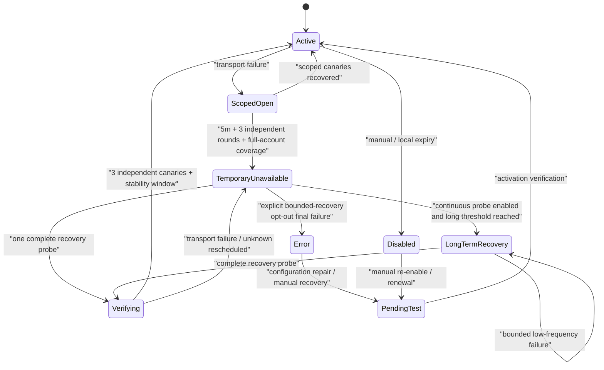

# AI 账户短窗口热质量与精准切号设计

> 当前状态：目标设计，尚未落地实现。
>
> 本文定义普通路由账户调度、短窗口热质量、故障单飞、受控半开、请求内精准切号和探活恢复的统一目标合同。现行实现仍以 [策略路由设计](策略路由设计.md)、[普通路由速度优先延迟切换设计](普通路由速度优先延迟切换设计.md)、[AI 账户运行态探针恢复设计](AI账户运行态探针恢复设计.md)、[网关错误处理完整链路](网关错误处理完整链路.md) 和 [网关异常重试与兜底策略](网关异常重试与兜底策略.md) 为准；实施本文时必须按第 14 节迁移顺序收敛冲突，不能把本文当作现行代码已经满足的事实。

## 1. 决策摘要

本设计先固定以下不可变合同：

1. 路由策略是最高业务调度层。路由先决定模式、分组、分组顺序、目标和路由覆盖；账户层不能重新选组、重抽权重、重建轮询环或自行 fallback。
2. 账户层只在路由允许的目标范围内回答可执行性，并在最终有效候选带内按账户配置层排序。路由目标可以覆盖账户偏好，但账户电路不能被路由偏好绕过。
3. 同一账户配置层使用“所有唯一候选最多一轮”，不再使用固定的“同层失败 2 个账号”预算。5 个 P1 账号中，前 4 个在请求救援准入时间内结束时，游标必须继续到第 5 个；第 5 个仍失败且仍满足时间准入时才允许进入下一层，期限先到则明确返回 deadline_exhausted。
4. 首字统一的是事实和仲裁器，不是一个适用于所有 lane、模式和请求的数值。软观察、lane hard timeout、attempt lifetime、idle timeout 和请求级救援期限必须保持不同原因码。
5. 自动电路只消费网关本地可验证的 transport 事实。完整 HTTP/SSE framing 在未命中用户显式高级规则时透明转发；上游状态码、响应头、错误码和正文不能被内部自动机制解释为切号或账号故障。
6. 运行态分为配置意图、热运行态和持久异常三层。首次 transport 失败先阻断对应 protocol-model 作用域并发起唯一、非阻塞客户端的 canonical confirmation；只有独立作用域证据满足条件，才升级到账号级电路。
7. 热质量保存在 Redis 或进程内存，按最近 5、10、30 分钟计算。质量只能在完全相同的有效账户配置层内排序，不能跨优先级、备用或分组。
8. 同层探索允许存在，但只能是低频、真实业务流量、同一有效层内的首选替换；不增加请求、不访问 P2/备用、不绕过会话亲和、电路、容量和路由覆盖。
9. route coordinator 独占请求级游标、尝试集合、等待预算和跨组推进。routes、preparation、candidate-filter、dispatch 不得各自创建 fallback、重试预算或新的尝试轮次。
10. scoped 电路负责秒级止损，持久 `temporary_unavailable` 只在至少 5 分钟、3 个独立后台轮次和整账号能力覆盖后建立。开启持续探活时长期低频恢复，不因纯 transport 波动持续 7 天就自动判为 `error`；恢复必须经过串行 canary 和渐进放量。

## 2. 背景与目标

上游账号的可用性可能在秒级变化：前 10 分钟正常、随后 2 小时超时，或者前一分钟成功、后一分钟持续失败。日级历史和长期质量无法代表当前请求；偶尔成功两次也不能证明账号已经恢复。

当前生产问题集中在四个方面：

- 同一个物理账号被多个会话、多个 IP 或多个授权实例同时打入，首次失败后仍继续接受新请求。
- 同账号重试、recoverable 重放、容量等待和分组 fallback 分散在多层，导致同一个 P1 被重复扫描，客户端长时间卡住。
- 运行态中 recovery_wait、precheck_pending、半开和 UI 展示的语义不一致，账号实际不可承接但仍显示为可调度。
- 质量统计是历史或后台聚合，不足以指导最近几分钟的选择；后排账号没有样本时又可能永久饥饿。

本文目标是以最小额外请求代价完成以下闭环：

```text
路由策略确定范围
  -> 冻结请求级路由计划
  -> 账户候选过滤与同层游标
  -> 一次真实 attempt
  -> 终态幂等记录
  -> 热质量 / 电路 / 用量投影
  -> 必要时唯一 confirmation 或探活 lease
  -> RECOVERING 三次 canary
  -> CLOSED 或再次 OPEN
```

## 3. 适用范围与非目标

### 3.1 适用范围

- 普通路由 normal 下的 cost_first 和 speed_first。
- 已经由策略路由选定的分组、主备顺序、RR、weighted、hybrid 目标中的账户调度。
- OpenAI 兼容网关的 JSON、SSE、Responses 和协议适配后的真实上游 attempt。
- standalone 的进程内热状态和 performance 的 Redis 共享热状态。

### 3.2 非目标

- 不改变 API Key、路由策略、分组绑定、权重、轮询、主备和 hybrid 的产品语义。
- 不以日级、周级或完整历史质量直接参与实时选号。
- 不为获得质量样本向较低优先级、备用层或其他分组主动发业务流量。
- 不做无条件的多个上游同时抢跑后取最快结果。仅当既有 attempt 已由 speed-first 的显式 handoff 合同发出 abort、且重放门禁允许时，才可在有限取消握手窗口预占下一 attempt；不得以延迟最小者作为隐式胜者，所有已在途语义仍由请求级 winner CAS 决定。
- 不用热质量直接修改 accounts.status、schedulable、cooldown_until 或用户配置的优先级。
- 不使用上游状态码、响应头、错误码、正文或供应商文案建立系统自动故障分类。

## 4. 路由层与账户层边界

### 4.1 固定层级

```text
API Key
  -> 路由策略
    -> 路由模式、分组顺序、目标和覆盖
      -> 路由选定范围内的账户可执行性
        -> 真实上游 attempt
```

路由策略高于账户策略，但“高于”不代表路由可以强制调用已经不可执行的账号。账户层只提供硬可执行性事实；它不能借此扩大或重写路由范围。

### 4.2 请求级路由计划

请求开始时由 route coordinator 创建不可变 routePlanSnapshot：

```text
routePlanId
routeStrategyId
mode
orderedAllowedTargets
weightedDecisionToken
roundRobinDecisionToken
hybridDecision
hybridActionPlan {
  actionSequence
  allowedTargets
  policyRevision
  replayRequirement
}
requestReplayPolicy {
  replayDisposition
  idempotencyScope
  adapterRevision
}
routeObjectivePolicy
groupDispatchPolicyRevision
dispatchRevision
```

快照冻结本次请求的组顺序、权重决定、轮询起点、hybrid action plan、请求重放判定、路由目标策略和允许范围。routeOverrideBand 由 coordinator 汇总冻结 route reducer 或当前选中组的 `groupDispatchReducer` 结果，并结合当前动态运行态求值；它可以让候选暂时不可执行，但不能重新抽样、重建环、重算权重或扩大目标范围。

可变推进状态单独放入 coordinator 独占的 `RouteExecutionState`，不属于 route plan snapshot：

```text
routePlanId
executionVersion
groupCursor
candidateCursorByGroup
pendingBlockedTargets
reservedProtocolModelKeys
attemptedProtocolModelKeys
terminalState
```

RoutePlanSnapshot 创建后按内容生成 planHash，任何层都不能修改；RouteExecutionState 只由 coordinator 以 executionVersion 单写推进。这样“一轮”“回访”和 RR/weighted 不重算才能由明确的数据 owner 证明。

### 4.3 routeOverrideBand 与 baseTierKey

账户候选先经过 route coordinator 汇总出的最终有效覆盖带，再在覆盖带内排序：

```text
routePlanSnapshot
  -> hard eligibility
  -> route / group reducer
  -> routeOverrideBand
  -> baseTierKey
  -> mode-specific affinity / hot quality order
  -> same-tier exploration
```

routeOverrideBand 是 coordinator 汇总对应 route reducer 或选中组 `groupDispatchReducer` 后得到的候选子集和原因，至少记录：

```text
routeObjective
manualMigrationTarget
latencyDegradedTarget
overrideReason
groupDispatchPolicyRevision
```

`routePlanSnapshot` 只冻结允许范围、策略 revision 和路由决定，不冻结瞬时队列、并发或容量快照。账户层不能把手动迁移、快速模式慢目标、高并发 fallback 和账户比较器重新合并成第二个 comparator。不同路由模式已有的相对顺序由对应 route reducer 或选中分组的 `groupDispatchReducer` 产出；动态 reducer 每次只返回当前有效覆盖带和原因，最终推进仍由 coordinator 完成。

baseTierKey 固定为：

```text
modelMatchRank
+ fallbackEnabled
+ superPriorityEnabled
+ priority
```

热质量、会话亲和和同层探索都不能跨越 baseTierKey；快速模式和高并发等既有覆盖若需要跨越，必须由对应 reducer 在 routeOverrideBand 中明确表达，而不是由通用账户层偷偷改变优先级。

同层内部比较顺序按模式固定：

- `cost_first`：有效 session/cache affinity -> 热质量 -> 稳定顺序；soft checkpoint 只能记录样本，不能触发慢切号。
- `speed_first`：先应用路由层 `latency_degraded` 覆盖，再在同一覆盖带和 base tier 内使用热质量、有效 affinity 与稳定顺序；affinity 不能拉回已降级账号。
- 高并发分组：由 `groupDispatchReducer` 保留既有 migration、fallback-on-queue、soft-busy、超级优先、priority 和容量比较；热质量只是其同档输入，coordinator 不复制该比较器。

若 speed_first 当前分组所有硬可承接候选都处于 `latency_degraded`，route reducer 必须返回 `all_latency_degraded_passthrough` 并旁路速度降级覆盖，恢复原始分组内候选顺序；账户层不得把池筛空，也不得借此跨分组/优先级重排。当前已经确认慢的请求仍不能为了 soft handoff 从一个已降级账号切到另一个已降级账号，只能继续原 attempt 或进入通用 transport/期限链路。

### 4.4 模式约束

| 模式 | 路由层负责 | 账户层负责 |
| --- | --- | --- |
| cost_first | 保持组、账户偏好和亲和，只在 transport 失败或显式策略后切号 | 过滤电路、授权、能力、容量和已尝试身份；同层一轮后报告结果 |
| speed_first | 速度目标、latency_degraded、安全窗口和可接受的跨层切号 | 过滤不可执行账号；不得把已确认慢账号复活到覆盖带 |
| failover | 主用、备用和后续分组顺序 | 只报告当前分组结果，不自行进入备用组 |
| round_robin | 本轮环、起点和回访顺序 | 推进当前分组候选游标，不重建环 |
| weighted | 本次权重 token 和允许目标 | 不重抽权重、不把质量写成持久重分配 |
| hybrid_smart | 评分、模型档位、repair/upgrade/return action | 在目标档位内过滤账户；质量 action 必须由 coordinator 执行 |

本文不新增 hybrid action。已有 hybrid 路由在请求开始时把允许的评分、repair、upgrade、return 动作及目标预编为不可变 `hybridActionPlan`；这些是用户显式选择 hybrid 策略后产生的路由动作，不是账户电路动作。动作只能在语义尚未提交、请求可安全重放且响应检查使用有界缓冲时执行，并继续使用同一个请求 hard deadline、route plan 和 attempted 集合。否则返回当前完整响应或唯一失败，不得在响应层临时扩大目标或重算路由。

`replaySafe` 默认拒绝，只有协议适配器明确证明以下条件全部满足才允许 repair/upgrade：

- 请求属于已声明的纯模型推理 endpoint，不是 Files、Uploads、Batches、Fine-tuning、资源创建/删除或未知 endpoint；
- 没有已经执行或可能在上游执行的 hosted tool、外部 action、后台任务、持久 store 写入或其他不可幂等副作用；
- 请求级 `committedAttemptId == null`，服务端尚未对外提交工具调用或可见输出；
- 请求体仍在有界可重放预算内，且 provider adapter 明确返回 `replaySafeBeforeCommit=true`。

未知协议、未知 endpoint、`background/store` 类持久化请求或无法证明副作用边界时，一律不做 hybrid repair/upgrade。用户选择 hybrid 路由不等于自动放宽 replay 安全门槛。

## 5. 候选快照与身份

### 5.1 候选快照

候选快照保留绑定实例，不在 SQL 层提前合并授权实例。每个候选至少包含：

```text
dispatchBindingId
accountId
credentialSourceAccountId
physicalResourceKey
accountRuntimeKey
providerProtocolProfile
requestLane
modelFamily
baseTierKey
routeOverrideBand
stableOrderKey
uniqueCandidateId
candidateSetRevision
dispatchRevision
```

快照冻结候选允许范围、层级和稳定顺序，不冻结动态容量和电路结果；每次真正占用并发槽或发出请求前，必须重新核对持久硬资格、运行态 generation、容量和 dispatchRevision。

### 5.2 三类身份

```text
physicalResourceKey
  = credentialSourceAccountId + provider + upstreamProfile

dispatchBindingKey
  = accountId + systemAccountId + groupId + authorizationId

protocolModelKey
  = physicalResourceKey + protocolProfile + endpoint + requestLane + modelFamily
```

- physicalResourceKey 共享真实凭据、代理、并发和上游资源事实。
- dispatchBindingKey 保留授权实例的本地权限、额度、分组绑定、亲和和策略状态。
- protocolModelKey 用于本请求的真实 transport 去重和作用域电路。

本地权限、配额或绑定失败只写 binding 作用域；真实 transport 故障先写 protocolModelKey 作用域。只有账号级聚合条件满足，或用户显式规则明确指定账号级动作，才升级到物理账号级电路。

这是对现行授权实例运行态隔离的有意迁移，边界固定如下：

| 事实 | 是否跨授权实例共享 | 展示与恢复 |
| --- | --- | --- |
| binding 权限、额度、优先级、备用、亲和、持久状态 | 否 | 只显示在当前授权实例，由当前实例规则恢复 |
| 物理凭据、代理、并发、上游 profile | 是 | 所有引用同一来源资源的实例读取同一物理事实 |
| protocol-model transport 电路 | 仅相同物理资源、协议、endpoint、lane、模型族共享 | 授权实例显示 `source_runtime_blocked` 及来源 scope；共享 canary 恢复 |
| account 聚合电路 | 是，但只能由独立 protocol-model 证据或显式账号动作建立 | 共享 generation 和恢复 lease，不改写各实例持久状态 |
| 5/10/30 分钟热质量 | 仅相同 `physicalResourceKey + protocolProfile + requestLane + mappedModelFamily` 共享 | 只作为当前覆盖带和 base tier 内的短窗口排序输入，不回写 binding 持久状态 |
| `latency_degraded` | 否；固定在 `routeStrategyId + groupId + dispatchBindingKey` 作用域 | 只影响启用该快速目标的策略范围，不传播为物理账号故障 |
| 用户显式策略 block | 按策略配置的 binding/account scope | 自动 canary 不能清理 |

### 5.3 请求级 attempted 集合

同一请求维护以下集合，跨组、fallback、hybrid 和上下文切换都不能清空：

```text
attemptedProtocolModelKeys
reservedProtocolModelKeys
attemptedBindingKeys
attemptedAccountRuntimeKeys
attemptedKeyFingerprints
attemptedPurposes
```

coordinator 在进入异步 dispatch 前先把 identity 原子加入 `reservedProtocolModelKeys`；随后在真正网络派发线性点取得 `dispatchAdmissionToken`，一次性核对 cluster runtime readiness、`runtimeRecoveryEpoch`、当前节点 membership lease、`ownerDomain + lifecycleOwnerEpoch + barrierEpoch`、circuit state/generation、dispatchRevision、eligibilityRevisionVector、warmupGeneration、qualityEpoch 和容量 permit。token 必须携带上述 fence、nodeLeaseId、permitId 和 admissionId；任一 revision 不匹配都在发网前拒绝并要求刷新运行态，不能降级为旧快照派发。设置 draining barrier 与递增 barrierEpoch 必须和禁止该 ownerDomain 新 token 处于同一 CAS；barrier 前只读但尚未取 token 的旧节点会得到 STALE，不能在快照后发网。

取得 token 即定义为“已经在途”，并在同一个原子操作中从 reserved 转入 attempted，同时写入按 attemptId 索引的 admission registry：

```text
attemptId
protocolModelKey
nodeId
nodeLeaseId
runtimeRecoveryEpoch
ownerDomain
lifecycleOwnerEpoch
barrierEpoch
eligibilityRevisionVector
warmupGeneration
qualityEpoch
requestHardDeadlineAt
admittedAtMs
```

终态 CAS 必须关闭对应 registry entry。确认没有发网时才允许释放 reserved；已经取得 token 的请求即使随后失去 Redis，也只能按 unknown/outbox 合同收尾，不能假装没有 admission。SUSPECT 转换只能阻止线性点之后的新 admission，不能撤销之前已经取得 token 的首轮在途请求。

普通业务取得 admission 后加入 attemptedProtocolModelKeys。本地 Key 准备失败或用户明确允许 Key 动作时，只加入 attemptedKeyFingerprints。请求内 half-open、hybrid repair 是带 attemptPurpose 和 lease/generation 的显式例外，不能被普通 attempt 再次占用；background confirmation 属于独立 ProbeIntent，不写入原请求的 attempted 集合。

同一物理协议模型通过不同授权实例或后续分组出现时，本请求仍沿 route plan 访问并独立校验每个 binding 的授权和额度，但不得重复发出同一普通业务 attempt；重复物理目标记录 `duplicate_physical_target` 后推进原路由游标。这是有意的跨组行为迁移，不代表跳过后续不同物理目标。

### 5.4 候选窗口与完整性

当前数据库扫描窗口和 hydrate 窗口不是全量证明。设计要求：

- keyset 必须使用一致候选 revision 和唯一总序，例如 `candidateSetRevision + stableOrderKey + uniqueCandidateId`，而不是 offset 重新排序。
- 页间 revision 变化、无法维持 MVCC snapshot 或唯一总序时立即返回 window_incomplete，不能在新旧候选集合之间继续证明完整耗尽。
- 页面或窗口被截断、hydrate 丢失或 scanLimitReached 时返回 window_incomplete。
- window_incomplete 不能伪装成 hard_exhausted，也不能让请求重新扫描已经 attempted 的身份。
- 只有完整证明当前路由范围没有硬可执行候选时，才允许 hard_exhausted。

## 6. Route coordinator 合同

### 6.1 唯一 owner

route coordinator 是以下状态的唯一 owner：

- route plan、分组和候选游标；
- 请求级 attempted 集合；
- 普通 attempt 和 hybrid repair 的用途预算；
- routeCoordinationBudget 和请求救援墙钟；
- temporarily_blocked 的等待、回访和后续路由推进；
- 语义提交前的切号决定。

账户层、准备层和 dispatch 层不得直接调用分组 fallback，不得创建第二套预算，不得把 recoverable 账号重新塞回同一普通扫描轮次。

### 6.2 账户可用性结果

账户层返回：

```text
dispatchable {
  candidates
  attemptPurposeByCandidate = ordinary | half_open_business_confirmation | half_open_business_canary
  specialLeaseFenceByCandidate
  routeOverrideBand
  runtimeRecoveryEpoch
  circuitGeneration
  dispatchRevision
}

temporarily_blocked {
  earliestRetryAtMs
  confirmationInFlight
  blockedTargets
  queueBlocked
  queueWaitCostMs
  probeLeaseCandidates
  reason
}

request_exhausted {
  reason
  attemptedProtocolModelKeys
  attemptedBindingKeys
  attemptedKeyFingerprints
  completeness
}

hard_exhausted {
  reason
  completeness
}
```

completeness 至少区分 complete、window_incomplete 和 deadline_exhausted。后两者不能被记录为长期账号耗尽。

账户层不得构造最终客户端错误。路由协调器根据当前模式决定继续当前分组、推进既有备用/环/权重/评分目标、在统一预算内等待，或结束请求。

无 probe 的业务 half-open 由 coordinator 按以下确定性算法消费，避免实现自行 hard_exhausted：

1. 先枚举当前 route plan 允许且尚未 ordinary-attempted 的 CLOSED 普通候选；有则照常 ordinary 派发。
2. 若无 ordinary 候选，但存在 matching-generation、route-eligible、replay-safe，且 `recoveryLeaseClass=half_open_business` 的 SUSPECT/OPEN/RECOVERING 目标，则返回 `dispatchable` 且 `attemptPurposeByCandidate=half_open_business_*`，并附带 specialLeaseFence；该候选必须是“若其 CLOSED 本就会被当前游标选中”的目标，不能跨优先级/跨组搜半开。
3. 若 half-open lease 尚未到期且被其他请求持有，返回 `temporarily_blocked` 并填 `probeLeaseCandidates`；路由协调器在统一预算内等待或按模式推进下一目标，不得把该状态记为 hard_exhausted。
4. 若请求不可重放，则不得消费 business half-open；按 7.6 返回 indeterminate 或继续其他 ordinary 候选。
5. 当前分组/层没有任何 ordinary 或合法 special 候选时，才按模式推进后备目标或返回 request_exhausted/hard_exhausted。

### 6.3 同层唯一候选一轮

同一 baseTierKey 的普通业务游标单调前进：

1. CLOSED 且硬资格通过的候选按稳定顺序进入尝试。
2. 已经 SUSPECT / OPEN / OPEN_UNKNOWN / HALF_OPEN / RECOVERING / QUARANTINED 的普通候选直接跳过，不占用普通 attempt；无 probe 时 SUSPECT/OPEN/RECOVERING 仅可按第 7.5/8.2 节成为一次显式 `half_open_business_*` 特殊候选。
3. 容量忙、队列等待或暂时阻断的候选进入 pendingBlockedTargets，不算已尝试；同一候选可被事件驱动地重新检查多次，但只有取得真实 dispatch admission 时才“消费一次”。
4. 真实 transport attempt 发出后，候选永远不能回到本请求的普通游标。
5. 当前层所有唯一候选完成一轮后，且仍有请求救援时间，才进入下一层。
6. 请求救援墙钟先耗尽时，返回 deadline_exhausted，不能声称当前层已经完整耗尽。

因此，5 个 P1 的严格合同是“不允许被固定失败次数提前截断”：只要前 4 个产生终态且仍允许启动救援 attempt，P1 #5 必须取得一次 admission 机会。这里的“到达第 5 个”指真实派发，不承诺第 5 个在任意合法慢时延内完成。前 4 个各自占满 lane hard 或请求 hard deadline 已到期时，系统必须按期限结束并记录 `deadline_exhausted`，不能谎称完整扫描，也不能为了无条件到达第 5 个而缩短已启动 attempt 的 lane hard。

### 6.4 路由回访

pendingBlockedTargets 只能是当前 route plan 已允许的目标子集。回访前必须重新检查：

```text
RequestRescueLedger.committedAttemptId == null
`serverRescueDeadlineAt` 尚未建立，或已建立且未到期
circuit generation / lease 有效
dispatchRevision 未变化
capacity 仍可预占
```

每个 pending entry 固定保存 `candidateRuntimeKey + firstBlockedAtMs + blockReason + nextEligibleAtMs + waitRegistrationId + lastCheckedRevision`。回访后仍 busy/queue-blocked 时保留原 entry，注册在容量释放、circuit due 或绝对 queue deadline 的单次唤醒上；不得推进为 attempted、不得即时自旋，也不得从当前时刻重置 queue wait。若硬资格永久失效则以明确 skip reason 删除；若 nextEligible 已超 request/rescue deadline，则结束为 deadline_exhausted 而不是 hard_exhausted。容量变为可预占时以 candidateRuntimeKey + executionVersion CAS 取得一次 admission，其他重复唤醒只做幂等清理。

回访不能重抽 RR/weighted、扩大 hybrid 目标或重新加入已经 attempted 的候选。

## 7. 首字事件与请求预算

### 7.1 统一事实，不统一所有数值

每个真实 attempt 只创建一个 AttemptArbiter，但保留不同约束：

```text
AttemptArbiter {
  attemptId
  attemptPurpose
  lane
  softCheckpointAt
  laneHardAt
  attemptLifetimeAt
  idleDeadlineAt
  networkWriteState
  requestAbortSignal
  terminalCas
}
```

首字事实定义为：

- 非流式：首个可见 body 字节；
- 流式：首个可见语义 chunk；
- 响应头、SSE heartbeat、空事件、内部缓冲不算首字；
- 每个 attempt 只产生一次 observed / deadline_reached / cancelled / unknown。

统一事件不代表把快速模式软观察、普通 lane hard timeout 和 attempt lifetime 压成同一个数字。任何账户层、响应层或快速模式都不得再次创建首字 timer。

语义提交使用请求级 winner CAS，而不是每个 attempt 各自决定。AttemptArbiter 不保存独立 `semanticCommitted`；所有 guard 只读取 RequestRescueLedger 的 `committedAttemptId` 和 `semanticCommitVersion`。唯一 downstream writer 在首个可见语义事件入队下游响应流之前执行 `trySemanticCommit(attemptId, expectedVersion)`；首次成功原子写入 winner，其他 attempt 永久失去语义写权限。

CAS 失败的 loser 必须立即触发自己的 AbortController、释放容量 permit / reservation / lease，并以 `superseded_before_commit` 提交唯一终态。该终态只进入请求审计和 admission registry 清理，不进入热质量、电路失败、RECOVERING 计数或客户端 usage；不得继续占用并发直到请求 hard deadline。语义 write、soft/hard timer、abort 和切号都必须经过请求级 writer/ledger 互斥；winner 提交后只允许继续该响应、输出协议错误或断流，绝不允许其他 attempt 换号或写入。

### 7.2 四层时间边界

| 边界 | 作用 | 是否写自动账户电路 |
| --- | --- | --- |
| softCheckpoint | 路由观察、速度样本或请求内 handoff | 否 |
| laneHardAt | 首响应/读取未完成的真实 transport 失败 | 是，写对应作用域 |
| attemptLifetimeAt / idleDeadlineAt | 首字后的资源和流式活跃生命周期 | 只有真实读取中断/EOF 才写对应作用域 |
| requestHardDeadlineAt | 请求级最终墙钟，防止无限挂起 | 不把正常慢请求伪装成账号故障 |

另有 serverRescueDeadlineAt，它只决定还能不能启动新的隐藏救援 attempt；已经启动的 attempt 继续遵守自己的 lane hard/lifetime，除非请求 hard deadline 或客户端取消。任何候选均分值只能用于 `speed_first` 在存在替代候选时的 soft handoff 决策，不能改写 laneHardAt。

### 7.3 普通模式与快速模式

- cost_first：soft checkpoint 只记录样本，不触发 handoff；只有真实 transport 失败或用户显式策略动作才切号，继续保持现有成本优先语义。
- speed_first：同一个 soft event 先幂等记录慢样本，再由 slowTriggerCount、latency_degraded、安全写出窗口和模式切号上限决定是否切号。慢样本不能直接打开账户电路。
- 真正的 lane hard timeout、读取中断、EOF 或连接失败才进入 transport 电路和 confirmation。
- 图像、长思考、embedding 等 lane 保留各自 timeout profile；不能因为速度模式的软阈值中断合法长耗时请求。
- 任何模式准备在已有 attempt 之后启动新 attempt 时，都必须通过 7.6 的统一重放授权；速度优先、故障切号和 hybrid 不得各自维护一套更宽松的规则。除显式 speed-first handoff 外，旧 attempt 未终止或未确认不可继续发网时不得与新 attempt 并行；取消确认在有界窗口内失败就保持原 attempt，不抢跑。

### 7.4 请求救援账本

每个请求只有一个 RequestRescueLedger：

```text
RequestRescueLedger {
  requestStartAt
  routePlanCreatedAt
  requestHardDeadlineAt
  serverRescueDeadlineAt // 首个 route upstream attempt admission 后冻结；此前为 null
  coordinationRemainingMs
  activeGroupQueueDeadlineAt
  ordinaryAttemptCount
  hybridRepairRemaining
  reservedDispatchMs
  committedAttemptId
  semanticCommitVersion
  version
}
```

规则：

- 不设一个会截断 RR/weighted 全环或 hybrid 合法 repair 的固定全局 N=6。
- 普通业务的唯一候选上限由 route plan 和同层一轮决定；hybrid repair 使用独立目的预算并共享请求救援墙钟。background confirmation、half-open 和 recovery canary 是 ProbeIntent，不消费客户端请求预算，也不占用该墙钟。
- `serverRescueDeadlineAt` 只限制启动下一 ordinary/hybrid attempt。它在首个 route upstream attempt 取得 admission 时就冻结，即使该 attempt 后来才被证明不可重放；此前只受协调预算、分组队列截止和 request hard deadline 约束。新 attempt 必须满足 `now + reservedDispatchMs < serverRescueDeadlineAt`；首期 `reservedDispatchMs` 固定 5 秒。不得用该保留值硬中断已经取得 admission 的 attempt。
- routeCoordinationBudget 是普通模式和快速模式共同的累计控制面等待预算，初始建议 3 秒，覆盖故障后切号等待、重选号、层级切换和未进入 `activeGroupQueue` 的零可派发协调等待。
- 高并发分组的 admission FIFO 不是上述控制面等待，但每次入队必须冻结绝对 `activeGroupQueueDeadlineAt = min(queueEnqueuedAt + group.maxQueueWaitMs, requestHardDeadlineAt - cleanupGraceMs, (serverRescueDeadlineAt ?? +∞) - reservedDispatchMs)`。回访、虚假唤醒或重新竞争同一队列不得把 60 秒/`maxQueueWaitMs` 从当前时刻重置；server rescue 建立后必须主动缩短既有队列截止并唤醒超时 waiter。队列响应客户端取消，出队后必须重验 circuit generation、dispatchRevision、warmup/资格和容量，不能叠加第二个 no-available 等待。
- 现有 ServerRetryBudget 只能作为该唯一账本的兼容实现；不能再与旧 270 秒 no-available 预算叠加。每请求只创建一次，不能跨组重置。
- 活跃 fetch、首字观察和响应读取不扣协调等待；等待前必须扣除协调成本并保留最小派发时间。
- 任何预算耗尽都只能由 coordinator 产生一次终态，不能继续进入低层等待或重复派发。

requestHardDeadlineAt 必须在请求开始时由单调时钟冻结为有限值；`serverRescueDeadlineAt` 一旦建立必须满足 `serverRescueDeadlineAt <= requestHardDeadlineAt`。它统一控制活动 fetch、group queue、控制面等待和请求内 lease 的 AbortSignal：

- 语义尚未提交时，到期原子取消所有活动分支、释放 reservation/permit/lease，并返回一次网关本地、协议兼容的 timeout 错误；该错误不依赖上游状态码，也不写账号失败。
- 语义已经提交时，到期只终止当前上游和下游响应，不再切号。
- 所有清理必须在有界 cleanup grace 内完成；重复 timer、取消和队列唤醒只能命中同一个 terminal CAS。

为使该合同可配置、可测试，新增请求级和 lane 级系统设置：

| 设置 | 默认值 | 允许范围 | 计算 |
| --- | --- | --- | --- |
| `textRequestMaxLifetimeSeconds` | 1800 | 60-86400 | `requestStart + value` |
| `imageRequestMaxLifetimeSeconds` | 3600 | 60-86400 | `requestStart + value` |
| `serverRescueTailSeconds` | 30 | 10-120 | 首个 route upstream attempt admission 即冻结，追加在该 attempt 的 lane hard 之后；普通/快速和所有 lane 共用 |

如果客户端提供了网关认可且更短的绝对 deadline，则取两者最小值。默认值与现有对应 lane 的 uncommitted attempt lifetime 对齐，但新设置是整个请求的最终 wall-clock 上限，不能被每次换账号、分组或 hybrid action 重置。

`serverRescueDeadlineAt` 在最终 request lane 和不可变 route plan 形成后仍为 `null`；首个 route upstream attempt 取得 admission 时一次性冻结：

```text
serverRescueDeadlineAt = min(
  requestHardDeadlineAt - cleanupGraceMs,
  firstRouteAttemptAdmittedAt
    + laneHardBudgetMs
    + serverRescueTailSeconds * 1000
)
```

首期 `cleanupGraceMs` 固定 1 秒，只用于 terminal CAS 和资源释放，不作为新的等待预算；首个 admission 之前由 `coordinationRemainingMs`、`activeGroupQueueDeadlineAt` 和 `requestHardDeadlineAt` 共同约束。`laneHardBudgetMs` 取该请求 lane 已冻结的真实首字 hard 预算，不能由账户层或模式层重写。

普通模式、快速模式、fallback、RR/weighted 和 hybrid 都不得重建或延长该截止；background confirmation 不受客户端墙钟约束，但受自身 ProbeIntent due/lease/lifetime 约束。它不按剩余候选平均切片，也不设置固定账号尝试数；同层所有唯一候选只要能在时间准入内依次快速形成可重放终态就继续推进。截止到达时，已有 attempt 继续遵守自己的 lane hard/lifetime；它结束后不再切号。没有活动 attempt 且尚未提交语义时，coordinator 返回一次 `deadline_exhausted` 或更具体的 `indeterminate_upstream_outcome`。

协调等待的有效时长固定取以下剩余值的最小值，等待结束后必须重新走 admission CAS：

```text
min(
  coordinationRemainingMs,
  activeGroupQueueDeadlineAt - now,
  (serverRescueDeadlineAt ?? requestHardDeadlineAt) - now - reservedDispatchMs,
  requestHardDeadlineAt - now - cleanupGraceMs
)
```

### 7.5 Confirmation

confirmation 是作用域级的标准诊断 ProbeIntent，不是把同一用户 payload 再发一次，也不是第二套客户端重试循环：

- 首次作用域 transport 失败时，CAS 设置 SUSPECT。仅当该 scope 已具备 scope-exact canonical probe 配置时，才发放 matching-generation `runtime_confirmation` lease；若 probe 配置缺失，只写 nextLeaseAt/due 和 `recoveryLeaseClass=half_open_business`，不得占用一个永远无法执行的 confirmation lease。
- 有 probe 时，lease 持有者提交 canonical health-check payload（固定检查模型、endpoint 和副作用边界），不复用失败业务请求的 body、工具调用或下游 writer。当前失败请求一律不等待 confirmation/业务 half-open，按 7.6 重放授权立即推进下一候选；其他请求也直接换赛道。
- confirmation 使用同一个 `AttemptArbiter` 事实和对应 probe lane 的 hard/lifetime 规则，不另设隐含 5 秒 timer；它有自己的 ProbeIntent due/lease 预算，不扣 `RequestRescueLedger`。
- canonical probe 配置缺失时不伪造失败：作用域保持 SUSPECT/OPEN/RECOVERING 并保留 due。只允许一个“本就会被 route plan 选中”的业务请求，在满足 `committedAttemptId == null + requestReplayPolicy.replay_safe_before_commit|idempotency_protected + matching generation lease` 时，以 `attemptPurpose=half_open_business_*` 取得专用 lease 发网。该 attempt 使用用户 payload，并按第 8.2 节推进 `SUSPECT/OPEN -> RECOVERING` 或 `RECOVERING.successes += 1`；三次独立成功后 CLOSED，失败进入 OPEN。同请求失败后不能串行同账号重试；其他请求继续换赛道。不可重放业务请求不得被当作 half-open。
- confirmation 在语义提交前失败或超时，作用域进入 OPEN；租约未知、客户端取消、进程退出或 lease 超时不计失败，但必须原子清空旧 lease、保留 SUSPECT 并写入 `nextLeaseAtMs` 和 due index，到期后恰好允许一个新 confirmation lease。
- confirmation 成功只能进入 RECOVERING，不能一次成功直接 CLOSED；当前客户端的切号结果不因后台 confirmation 迟到而改写。

### 7.6 发网后的统一重放授权

请求准备阶段由协议适配器产生不可变 `requestReplayPolicy`，默认 `replay_forbidden`。每个 attempt 的本地网络边界只记录以下事实，不读取上游状态码或正文：

```text
networkWriteState = not_started | confirmed_not_sent | possibly_sent
replayDisposition = replay_forbidden | replay_safe_before_commit | idempotency_protected
```

在已经存在普通或特殊 attempt 后，coordinator 必须先满足请求级 `committedAttemptId == null`，再满足以下任一条件才能启动下一 attempt；该 winner guard 对 `confirmed_not_sent` 也不能省略：

1. 前一个 attempt 被本地 transport 证明为 `confirmed_not_sent`；
2. 冻结的 replayDisposition 为 `replay_safe_before_commit`；
3. 适配器证明上游幂等键已透传且覆盖当前 endpoint、请求体和副作用范围，replayDisposition 为 `idempotency_protected`。

`possibly_sent + replay_forbidden` 固定禁止普通切号、speed-first handoff、hybrid repair/upgrade 和跨组 failover。它也禁止把原用户 payload 交给 confirmation；但若作用域已有 canonical `runtime_confirmation` lease，后台探针仍可独立运行，因为它不是该用户请求的重放。若原 attempt 仍活跃则继续等待它自己的 lane/lifetime；若 transport 已结束且结果未知，则只返回一次本地 `indeterminate_upstream_outcome`，不尝试用第二个账号掩盖，也不把完整上游响应解释为失败。

纯模型推理 endpoint 也不是天然可重放。只有适配器同时证明不存在 hosted tool、外部 action、background/store、资源写入或其他不可幂等副作用，且请求体处于有界重放预算内，才能返回 `replay_safe_before_commit`。所有未知协议、未知 endpoint 和无法证明的工具能力默认拒绝。

## 8. 运行态电路与完整生命周期

### 8.1 作用域

| 作用域 | 触发 | 影响 |
| --- | --- | --- |
| binding | 本地权限、额度、绑定配置失败 | 当前授权实例/分组 |
| key | 本地 Key 装配失败或用户显式 Key 规则 | 当前 Key 指纹 |
| protocol_model | transport、lane hard、读取中断、EOF | 物理资源的协议/通道/模型族 |
| account | 多个独立 protocol_model 作用域聚合，或用户显式账号规则 | 物理账号跨请求共享 |
| upstream_fault_incident | 同一来源 owner 下多个 upstream path 的相关 transport 故障 | faultCorrelationId + 明确成员快照；独立事故可并存，不能跨 owner |
| latency_degraded | 快速路由慢样本状态机 | 当前路由策略范围，不是账号不可用 |

单个模型、单条协议或单个 Key 的故障不能自动污染其他健康能力。建议账号级升级至少要求同一物理资源在短窗口内有两个不同 protocol_model 作用域分别 confirmation 失败，并且满足最小独立失败次数；具体阈值通过回归和生产窗口校准，不得按并发数直接升级。

### 8.2 状态机

```text
CLOSED
  | 本地 transport failure / explicit policy
  v
SUSPECT -- confirmation success --> RECOVERING
   |                              |
   +-- confirmation fail --------> OPEN
   +-- unknown/cancel -----------> SUSPECT + nextLeaseAt

OPEN -- backoff due + lease --> HALF_OPEN
  |                               |
  +-- canary success ------------> RECOVERING

OPEN_UNKNOWN -- orphan horizon + lease --> HALF_OPEN
QUARANTINED -- quarantine due + audit lease --> HALF_OPEN

RECOVERING -- 3 independent canaries --> CLOSED
RECOVERING -- transport failure -------> OPEN
RECOVERING -- unknown/cancel ----------> RECOVERING + nextLeaseAt
```

| 状态 | 普通业务 | 特殊 lease | 说明 |
| --- | --- | --- | --- |
| CLOSED | 可派发 | 无 | 允许正常候选排序 |
| SUSPECT | 排除 | 一个 confirmation 或无 probe 时的 business half-open | 首次失败后的即时止损 |
| OPEN | 排除 | 到期后一个 half-open（probe 或无 probe 业务） | 退避中；必须保留 openUntil/nextLease/due |
| OPEN_UNKNOWN | 排除 | 孤儿期限后一个 half-open | admission/终态无法确权，禁止按旧 CLOSED 放流 |
| HALF_OPEN | 排除 | 一个 recovery canary 或 business half-open | 多节点单飞 |
| RECOVERING | 排除 | 一个 matching-generation canary 或无 probe 时的 business half-open | 连续三次稳定恢复；无 probe 不得永久卡住 |
| QUARANTINED | 排除 | 到期后一个 audit canary | scope 级补偿/DLQ 失败，不影响其他 scope |

收到首字、heartbeat 或一次 framing 不完整的成功都不能关闭电路。只有完整 HTTP framing，或 SSE 在没有读取中断的情况下正常结束，才计入 canary 成功；判断不得读取状态码和业务正文。

恢复 lease 类型固定两类，且同一 generation 同时只能存在一个：

1. `canonical_probe_*`：需要 scope-exact 检查模型/endpoint。可覆盖 confirmation、half-open 和 RECOVERING canary。
2. `half_open_business_*`：仅当 canonical probe 配置缺失时启用。允许一个 route-eligible、replay-safe 的业务请求携带用户 payload 完成确认阶梯，覆盖 `SUSPECT / OPEN / RECOVERING`，不得在有 probe 时绕过 probe 合同。

无 probe 时的恢复阶梯与有 probe 等价，只是 payload 来源不同：

- `SUSPECT` 首次业务 half-open 成功 -> `RECOVERING(successes=1)`；
- `OPEN` 到期后业务 half-open 成功 -> `RECOVERING(successes=1)`；
- `RECOVERING` 继续要求不同 lease 的第 2、第 3 次 matching 完整 success 才能 CLOSED；
- 任一次失败回 OPEN 并增加退避；unknown/cancel 只写 nextLeaseAt。

因此“没有 healthCheckModel”不能把账号永久钉在 RECOVERING。只要后续仍有可重放、本就会被路由选中的业务请求，就必须在有界 lease/due 内继续恢复；若长时间没有 route-eligible 业务流量，状态保持排除并保留 due，不得 fail-open 成 CLOSED。

### 8.3 Redis CAS 与租约

电路状态至少包含：

```text
state
failureScope
runtimeRecoveryEpoch
generation
leaseId
leaseOwnerNodeId
leaseOwnerBootId
leaseUntilMs
attemptHardDeadlineMs
openUntilMs
quarantineUntilMs
backoffLevel
consecutiveFailures
recoveringSuccesses
recoveryEpoch
expectedCanaryOrdinal
lastFailureClass
transitionId
nextLeaseAtMs
dispatchRevision
updatedAtMs
```

Redis Lua 或等价原子 Store 必须同时校验和更新：

```text
runtime phase/readiness + runtimeRecoveryEpoch
+ nodeId + bootId + node readiness/heartbeat
+ state + generation + leaseId + transitionId
+ expectedCanaryOrdinal + dispatchRevision
```

同一 generation 只能有一个 confirmation/half-open/recovery lease。leaseId 必须全局唯一且结果只能消费一次；每次重新进入 OPEN 或 RECOVERING 都递增 transitionId/recoveryEpoch，串行 canary 还必须匹配 expectedCanaryOrdinal，旧回调不能污染新恢复轮次。全局 runtimeRecoveryEpoch、节点 bootId 或节点 membership lease 不匹配时，旧 admission、旧 lease 和旧终态只能返回 STALE，不能推进状态。

发放任何 confirmation/half-open/recovery lease 时，必须在同一个 Lua/CAS 中把 `scopeKey + runtimeRecoveryEpoch + generation + transitionId + leaseId + leaseUntilMs` 写入 due ZSET。所有存活节点都可运行共享 lease reaper：用 Redis TIME 领取短期 reaper lease，重新校验完整 fencing 后清理自然过期或持有进程崩溃留下的 lease，并写入下一次可竞争时间。reaper 自身崩溃后由其他节点在其 lease 到期后接管；候选 admission 路径也必须对已过期 lease 做同一套机会式修复。

SUSPECT、OPEN、HALF_OPEN、RECOVERING、OPEN_UNKNOWN 和 QUARANTINED 都禁止出现“没有有效 lease、没有 nextLeaseAtMs/openUntilMs、due index 也没有成员”的永久阻断态。OPEN 必须至少保留 `openUntilMs` 或 `nextLeaseAtMs` 之一并进入 due。取消、未知、进程崩溃和 lease 过期必须通过相同 CAS 清理旧 lease、写下次可竞争时间并维护 due index；到期时仍只有一个节点能取得新 lease。

scope 状态 TTL 必须晚于 `max(nextLeaseAtMs, leaseUntilMs, openUntilMs, quarantineUntilMs) + safetyMargin`。READY 期间若某个 scope 的 state key 与 matching due/tombstone/registry 同时缺失，不得解释为 CLOSED：admission 必须 fail-closed 重建为 `OPEN_UNKNOWN` 并注册有界 half-open due，或拒绝该 scope 直到 inventory digest 修复。只有 CLOSED 状态被显式 CAS 写入且 generation 匹配时才可放流。配置、凭据、代理、协议档案或模型映射变化要递增 dispatchRevision 和 generation，旧结果只能释放资源，不能提交新状态。

### 8.4 探活与恢复

- 后台探活使用有界、成本可控的真实协议请求，只判断 framing/传输是否完成，不读取上游业务语义。
- runtime_probe 和 recovery_canary 不计入业务热质量，也不推进普通探索令牌。
- RECOVERING 的三个 canary 必须是不同 lease、跨时间串行完成，不能在一个请求里连发三次。
- scoped hot recovery 与 persistent Verifying 命中同一 physical scope、healthCheckModel、endpoint mode 和 configRevision 时，共用同一个真实 canary；一次终态可分别按各自 generation 幂等投影，不能为两个状态机重复发网。persistent Verifying 的更强间隔和稳定窗口同时满足 scoped recovery，不再追加第二组三次 canary。
- 任一 canary transport 失败立即回到 OPEN 并增加退避。
- 客户端取消、没有真实 attempt、旧 generation 或未知结果不计成功或失败；当前 generation 的未知结果必须按 8.3 的规则写 nextLeaseAtMs/due index，旧 generation 只能幂等释放自己的资源。

### 8.5 三平面可用性

```text
configuredIntent
  ∩ scheduleWindowAllows(now, scheduleRevision)
  ∩ bindingAndAuthorization
  ∩ sourceResourceAvailability
  ∩ hotCircuitAvailability
  ∩ capacity
  = effectiveAvailability
```

- 配置意图来自业务库，包含启用、优先级、备用和用户策略；时间计划是独立的、有 revision 的资格事实。
- 每次 ordinary、half-open、confirmation、recovery canary、activation 和 incident representative admission 都必须在发网线性点按规范化时区/日历直接求值 `scheduleWindowAllows(now)`，同时匹配 `eligibilityRevisionVector = { schedulingIntentRevision, scheduleRevision, authorizationRevision, quotaRevision, configRevision }`。当前使用 trusted wall clock（performance 优先 Redis TIME，standalone 使用受监控的 UTC 时钟）；边界前已取得 token 的 attempt 允许收尾，边界后的新 token 一律拒绝，未知时间/资格 fail-closed。
- 10 秒 schedule worker 只能异步维护 due、缓存投影、页面摘要和审计，不能单独把 `accounts.status` 改成 active/disabled，也不能成为 admission 的唯一判断源；worker 停止不改变上述线性点。
- 热运行态来自 Redis/进程内存，包含电路、租约、质量和探索令牌。
- 持久异常由人工、后台健康检查或冷却复测推进。

自动 CLOSED 不能覆盖用户显式 TTL 或持久禁用。performance 的账户列表必须批量叠加 Redis runtime overlay，展示状态、原因、generation 和新鲜度；不能只显示持久 schedulable。

### 8.6 持久账户状态与热电路分层

切号、电路和账户持久状态不是同一层。目标模型固定为四个彼此独立的事实面：

| 事实面 | 事实源 | 职责 | 禁止事项 |
| --- | --- | --- | --- |
| 配置意图 | 业务库 `configured_scheduling_enabled`、时间计划、授权、用户策略 | 表示用户是否希望账号在健康时参与调度 | 自动 transport 失败不得改写用户意图 |
| 持久健康状态 | 业务库 `active / pending_test / temporary_unavailable / rate_limited / error / disabled` | 跨进程重启表达整账号的长期资格 | 单个请求、单个模型或单个并发窗口不得直接升级 |
| 热运行态 | Redis / standalone memory 电路、lease、quality、warmup | 秒级止损、分钟级恢复和受控放量 | 不替代路由策略，不回写优先级或备用配置 |
| 有效可用性 | 前三层与容量的实时交集 | 网关过滤和页面展示的唯一读模型 | 不把 `accounts.status = active` 直接等同于可派发 |

现有 `accounts.schedulable` 被激活、冷却、异常和人工路径共同写入，没有可靠 provenance，不能直接重新解释为用户意图。目标 schema 新增独立 `configured_scheduling_enabled`、`scheduling_intent_revision` 和 `scheduling_intent_source`；自动健康状态只更新兼容投影和 effectiveAvailability，永远不改新意图字段。自动进入 `temporary_unavailable` 时保留意图；恢复时只有意图仍开启、授权/时间计划仍有效，才允许重新参与调度。

旧数据迁移必须先完成以下确定性回填，再允许新 owner active：

1. 最新显式启用/停用操作日志或仍有 revision 链的创建/导入 payload 可证明意图时，按该事件和 revision 回填 `user_enabled / user_disabled`；“查不到事件”不是启用证据。
2. 仅凭迁移快照里的 `active + schedulable=1` 或当前 effectiveAvailability 不能证明用户意图：旧健康路径可能曾自动把 pending_test 改 active 并把 schedulable 改为 1，且创建/导入日志可能缺失。只有不可变 intent/revision、完整创建/导入 payload 或可验证的人工启用链同时存在时，才回填 enabled；否则（包括 `active + schedulable=1`、`active + schedulable=0` 和日志缺失）一律 `legacy_unknown`、fail-closed，由所有者确认，不能借“不会扩大切换前流量”猜测启用。
3. `pending_test / temporary_unavailable / rate_limited / error` 当前均被健康状态阻断，旧 schedulable 可能由自动路径改写；没有第 1 条来源时一律 unknown，不能以 0 或 1 猜测恢复后的用户意图。
4. `disabled` 若可由人工停用或本地到期事实唯一归因，则分别回填 disabled 或保留可证明的 enabled 意图并由对应资格继续阻断；旧 worker 因时间计划写入的 disabled 必须迁移回独立 schedule projection，不能伪装成人工停用。授权状态同样是独立资格事实，不反写用户 intent。
5. 任何来源冲突、日志缺失或无法唯一归因的行回填 `scheduling_intent_source=legacy_unknown`，保持 fail-closed，并在页面显示“需确认调度意图”；只能由账户所有者/有权限管理员确认，后台恢复不得自动猜测。确认可支持有审计的批量操作，不能在迁移脚本中静默批量启用。
6. migration dry-run 必须输出各来源计数和 unknown 账号清单，专项覆盖 `active + schedulable=true/false + 日志缺失`、健康检查自动改写和创建/导入来源缺失；先完成 configured intent 的双写、revision 链和 owner 审计，再允许新 owner active。Node/Go、SQLite/PostgreSQL 和授权来源实例都切到新字段后，旧 schedulable 才降为派生兼容列并最终移除权威读。

因此目标语义是 `active + configured_scheduling_enabled=false` 表示用户主动暂停，`temporary_unavailable + configured_scheduling_enabled=true` 表示用户仍希望使用但系统正在恢复。任何实现阶段都不能通过反向填充 schedulable 来恢复用户意图。

持久状态边界固定如下：

| 持久状态 | 普通派发 | 进入条件 | 自动出口 |
| --- | --- | --- | --- |
| `active` | 受热电路和容量过滤后可派发 | 激活/恢复验证完成，配置意图允许 | scoped transport 故障先进入热电路，不直接改持久态 |
| `pending_test` | 禁止 | 新账户、关键连接配置变化、error 人工恢复 | 有界后台激活验证成功后 active；本地确定性配置错误可进入 error |
| `temporary_unavailable` | 禁止，只允许恢复 lease | 整个物理账号在跨时间、跨能力聚合后被证明无可派发路径 | 三次恢复验证和最小稳定窗口通过后 active；失败按 fast/slow/long_term 退避 |
| `rate_limited` | 禁止，只允许策略允许的复测 | 仅用户显式高级规则或人工动作 | 按显式 TTL/恢复规则；系统不得从上游 429 自动建立 |
| `error` | 禁止 | 本地确定性配置损坏、用户显式规则，或用户关闭持续探活后有界最终探针失败 | 修复配置/人工异常恢复后只进入 pending_test，不直接 active |
| `disabled` | 禁止，默认不自动探活 | 用户显式停用或本地确定性资源/凭据到期 | 用户启用、续期或修复后只进入 pending_test；时间计划关闭不写入 disabled，由 admission-time schedule 资格阻断 |

上游完整 HTTP 响应无论 2xx、401、429 还是 5xx，在没有用户显式规则时都只是 transport completed：不能自动进入 `rate_limited`、`temporary_unavailable` 或 `error`。后台健康检查、激活检查、冷却复测和 canary 同样遵守这一边界；只有本地可验证 transport/framing 事实参与自动状态机。

现有 `last_health_check_status_code`、`last_error_code` 等字段如因兼容性继续保存，只能作为原始诊断展示和审计，不得进入候选过滤、promotion、退避、恢复或质量比较；实施时要补反向回归，确保旧 `http_*` / `statusCode` 分支不再偷偷改变账号生命周期。

`pending_test` 使用同一无状态码边界，但必须有完整出口：

- 先执行本地确定性校验；凭据缺失/无法解密、URL/代理配置非法、没有检查模型或协议档案无法构造请求时，可以直接写带明确本地原因的 error。
- 已形成真实请求且获得完整 HTTP/SSE framing 时，自动层只确认 transport 可达，不读取 401/429/5xx 或正文；本地配置校验同时通过后结束 pending_test。账户所有者若希望按响应语义决定激活，必须显式配置高级验证规则。
- DNS/connect/TLS/lane hard/读取中断/framing 不完整属于 transport failure，保持 pending_test 并按 activation generation 进入 fast/slow/long_term due；不能只因持续 24 小时自动 error。
- 任务取消、worker/Redis 故障、配置变化和未发网属于 unknown，只重排 due，不累计失败。人工“重新检查”递增 activation generation 并提升 due 优先级，不能直接 active。
- pending_test transport 持续失败 12 小时后进入每 1 小时 activation long_term；用户停用/删除才停止。修复连接配置后旧 generation 失效，新验证成功再按 configured scheduling intent、时间计划和授权事实进入 active 或保持阻断。

这意味着未配置高级规则的完整 401 可能通过 transport 激活检查并随后透明返回给客户端；这是“不解释不可信上游状态码”的明确代价，不得用隐藏 401 白名单补回。用户需要 401 自动隔离时，必须在前端显式配置对应规则。

### 8.7 从 scoped 故障到整账号临时不可用

首次 transport failure 只打开对应 `protocolModelKey` 的 SUSPECT/OPEN，不直接判死物理账号。创建整账号观察 epoch 时至少保存：

```text
physicalResourceKey
accountHealthGeneration
configRevision
observationStartedAtMs
lastCompletedTransportAtMs
independentFailedScopeKeys
independentFailureRounds
independentSuccessRounds
lastFailureRoundAtMs
bucketNamespace
upstreamPathKey
faultCorrelationId
bucketIncidentGeneration
incidentTopologyRevision
incidentMemberFenceSet[] {
  upstreamPathKey
  pathGeneration
  membershipRole = failed_member | covered_member
}
promotionDecisionId
sagaDecisionVersion
decisionState = none | prepared | fence_confirmed | commit_allowed | committed | cancel_requested | cancelled | compensation_pending | compensated
decisionLeaseId / decisionLeaseUntilMs
nextReconcileAtMs
decisionOwnerBootId
previousPersistentStatus
promotionBlockOwnerDecisionId
committedRecoveryGeneration
runtimeRecoveryEpoch
lifecycleOwnerEpoch
incidentFenceDigest
eligibilityRevisionVector
schedulingIntentRevision
nextEvaluationAtMs
```

从 active 自动升级为持久 `temporary_unavailable` 必须同时满足：

1. 观察持续至少 5 分钟，且存在至少 3 个独立后台失败轮次，轮次间隔至少 2 分钟；同一并发风暴无论有 2 个还是 200 个请求都只折叠为一个观察轮次。
2. 每轮都形成了真实 upstream transport attempt，并以连接失败、lane hard、读取中断、EOF 或 framing 不完整结束；任务取消、探针执行器失败、Redis 失联和未知结果不计失败。
3. 以当前 configRevision、模型映射和 Key 池重新计算后，所有当前可配置派发路径都被 scoped circuit 阻断；单模型、单协议或单 Key 故障只保持局部 OPEN。
4. 账户只有一个可派发能力时，必须由标准账户检查 probe 和该唯一 scope 的独立 confirmation 共同证明；两者必须来自不同 `evidenceIndependenceGroup`/真实 attemptId，不能因同一 ProbeIntent 的多 purpose 投影计数两次。有多个能力时，至少两个不同 protocol-model scope 提供独立证据，且标准检查 probe 同样失败。
5. 当前观察代次尚未完成 matching-generation 的三次独立成功验证。普通业务或旧 in-flight 的单次完整 success 只记录为弱证据，并把下一次 promotion evaluation 至多推迟一个最小轮次间隔；它不能清理 scoped circuit、重置失败轮次或取消观察 epoch。只有三次串行成功 canary 和稳定窗口才能证明恢复，避免“100 次失败、偶尔成功 2 次”的账号长期卡在可调度状态。
6. 当前物理账号没有未关闭普通 admission；最终写库必须同时匹配 `accountHealthGeneration + configRevision + observationStartedAt + schedulingIntentRevision + eligibilityRevisionVector + expectedPersistentStatus + configuredSchedulingEnabled`，以及 `promotionDecisionId + sagaDecisionVersion + runtimeRecoveryEpoch + lifecycleOwnerEpoch + faultCorrelationId + bucketIncidentGeneration + incidentTopologyRevision + incidentFenceDigest`，迟到结果不得覆盖配置修改、人工停用、用户暂停、新观察代次或事故成员变化。
7. 失败未被 upstream incident 相关性吸收。bucket key 第一维固定为来源物理账号 owner 的 `bucketNamespace = sourceAccountOwnerSystemAccountId`；授权给其他主体的 binding 仍归来源 owner，同 namespace 共享，跨 owner 只做遥测，除非用户显式配置 platform-global 故障域。owner 缺失时 fail-closed，不能落入全局默认桶。

   每个真实 attempt 生成不可变 `upstreamPathKey = namespace + provider + normalizedBaseUrl + proxyFingerprint + protocolProfile`，proxy/base URL/provider 只是该路径的 correlation labels，不假设为树。首次失败只创建一个 path incident；correlator 在短窗口看到至少两个不同物理账号/路径共享某 label 时，可用 `faultCorrelationId + incidentTopologyRevision` CAS 把明确的 member path snapshot 合并为一个事故。合并只覆盖 snapshot 中的路径，不能因共享 proxy 节点就把另一 Base URL 的健康路径隐式吸收；独立或无法证明同源的故障保留并行 incident。一个 path 可被多个独立 incident 阻断，但同一 source attempt 在同一 faultCorrelationId 下只计一次、只发一套 canary。

   incident topology 变更必须原子提交 member index、旧 lease 失效和新 due。共槽数据以 bucketNamespace hash tag 执行一次 Lua；无法共槽时使用 durable `incidentTransitionId` saga/staging/reconciler，旧 topology 在全局 commit 前继续权威。所有 admission、probe terminal、reaper 和 promotion fence 都匹配 incidentTopologyRevision + member path generation + incident leaseId；旧成员 lease 不能在合并后继续发网或清理新事故。相同网络波动因此会由 fault incident 暂停账号 promotion，但不会把其他租户或未加入成员快照的路径批量写死。

任一条件不满足时只保留 scoped 热电路和下一次 due，不写持久状态。scoped circuit 在 5 分钟内完成三次恢复 canary 时取消整账号观察 epoch；因此短暂 10 秒、1 分钟或 2 分钟波动会被快速切号隔离，但不会制造大量 `temporary_unavailable`，而零星成功也不会把故障账号错误复活。

账号 promotion 不能把 Redis 桶事实和业务库写入假设成一个事务，必须由业务库 decision 行作为 durable saga 事实源。`(physicalResourceKey, accountHealthGeneration)` 只允许一个非终态 decision；每个 decision 带 `sagaDecisionVersion + decisionLeaseId/ownerBootId/leaseUntil + nextReconcileAtMs`，不依赖 TTL 自动消失：

1. evaluator 先在业务库事务插入 `prepared` decision，冻结 previousPersistentStatus、expected 账号/配置/资格/owner/runtime/incident topology 代际、完整 member fence digest、upstream path snapshot、observationStartedAt 与 `decisionExpiresAt`（首期建议 observationStartedAt + 15 分钟）；此时不改变对外持久健康状态。若已有非终态 decision，只唤醒同一 saga，不创建第二个。
2. reconciler 取得 matching decision lease 后，在 Redis 以同一 decisionId 原子校验并登记全部 fault incident/member fence pending index；同 bucketNamespace 共槽 topology 使用一次 Lua，无法共槽时由数据库 durable fanout outbox 逐目标确认，全部 ack 前不能进入 `fence_confirmed`。Redis 不可用或 fence 未知只续排 nextReconcileAt，并把相关热 scope 保持 OPEN_UNKNOWN/fail-closed。
3. Redis fence 全部确认后，数据库 CAS `prepared -> fence_confirmed -> commit_allowed`；每一步都匹配 sagaDecisionVersion、runtimeRecoveryEpoch、lifecycleOwnerEpoch、faultCorrelationId、bucketIncidentGeneration、incidentTopologyRevision、incidentFenceDigest、eligibilityRevisionVector 和完整 member fence digest。最终提交事务只有在 decision 仍为 `commit_allowed` 时，才可把账号写为 `temporary_unavailable`、设置 `promotionBlockOwnerDecisionId=decisionId`、递增并保存 committedRecoveryGeneration，同时把 decision 置 `committed` 并写 durable commit outbox。
4. 任一 incident/member fence、eligibility、观察条件或 8.7 升级前提在 prepare/confirm/commit 期间变化，都发起 durable cancel。这明确包括：scoped 在 5 分钟内完成三次恢复 canary、独立成功轮次出现、path/incident 恢复、observation epoch 被取消、账号重新出现可派发路径。cancel consumer 必须先在业务库事务按 decisionId 竞争：若尚未提交，写 `cancelled` tombstone，使任何迟到 commit 因 state 不是 commit_allowed 而失败；若已经 committed，则写 `compensation_pending` 和 durable compensation outbox。不能在“数据库尚未 commit”时直接 ACK Redis cancel 后删除证据。`commit_allowed` 前必须重验完整 8.7 条件与 evidence freshness；过期证据只能 cancel/re-evaluate，不能 commit。
5. compensation 只有同时匹配 `promotionBlockOwnerDecisionId + committedRecoveryGeneration + previousPersistentStatus + 全部账号/owner/fence 代际` 才恢复该次 decision 自己造成的持久阻断，并递增 accountHealthGeneration/recoveryGeneration、保留 incident/scoped OPEN，随后 CAS 为 compensated。若人工状态或新 recovery 已接管，补偿只能记 stale，不能覆盖新状态。
6. 数据库 due reconciler 与 Redis decision index 互相修复，逐一覆盖 `prepared 后崩溃`、`DB pending 后崩溃`、`fence_confirmed 后崩溃`、`DB committed 但 Redis 未 finalize`、`cancel/compensation 中崩溃` 和 owner/runtime epoch 切换。DB commit outbox 负责最终清理 Redis pending index；过期 worker lease 只能由 matching decisionVersion 接管。连续失败进入 decision 级 quarantine/DLQ 并保持该账号 fail-closed，同时告警，不能卡住其他账号或静默留在 pending。
7. 人工停用/暂停/启用必须递增 eligibility/意图代际并创建 cancel command；promotion、recovery 和 activation 的 commit 都匹配 expected persistent status 与 eligibilityRevisionVector。未知或不完整 fence 只保留 scoped 热阻断并重排 saga/due，不能猜测成功。

这样既保证同一物理账号只有一个 promotion owner，也消除了“cancel 先消费、旧 worker 后 commit”和任一中间崩溃留下永久 pending/死号的窗口。

授权实例不各自重复升级物理账号：transport 观察和持久健康归属 `physicalResourceKey` 对应的来源账号，所有授权实例只投影 `source_runtime_blocked` 或来源持久状态。binding 权限、额度、显式策略和本地状态仍独立。多 Key 账号只要还有一个 Key 对当前能力硬可用，就不能因其他 Key 故障升级整账号。

### 8.8 临时、长期不可用与恢复闭环

持久 `temporary_unavailable` 不是死亡终态，而是带恢复代次的自动恢复状态。推荐持久保存 `recoveryGeneration + recoveryStage + observationStartedAt + nextProbeAt + failureCount`，并使用同一 physical scope 的唯一 recovery lease：



恢复节奏建议：

- fast：3s -> 5s -> 10s -> 30s -> 60s；
- slow：之后按有界指数退避，最大间隔首期建议 5 分钟，足以覆盖“坏 2 小时后突然恢复”的上游；
- long_term：连续不可用 12 小时后降为每 1 小时一次；开启持续恢复探活时无限期保留低频恢复，不再仅因持续 7 天自动转 error；
- bounded：用户显式关闭 `temporaryUnavailableContinuousProbeEnabled` 时，保留现有 10 分钟有界窗口和最后一次真实 probe；最终失败进入 error 是用户明确选择停止长期探活的结果，不是内部解析上游状态码所得结论。

`long_term` 是 `temporary_unavailable` 的持久恢复阶段，不新增一个会扩散到所有 SQL、API 和前端枚举的“长期不可调度”主状态；页面通过 `recoveryStage=long_term` 展示“长期恢复中”，网关仍按同一持久阻断和 recovery lease 处理。这样既能表达长期不可用，又不会把一个可能在两小时后恢复的上游账号写成不可逆死号。

第一次完整恢复 probe 不能直接把账号恢复为 active。它只进入 Verifying/RECOVERING，并要求 3 个不同 lease 的完整 transport canary、至少间隔 10 秒、总稳定观察不少于 30 秒。任一失败回到 temporary_unavailable 并增加退避；未知/取消只重排 nextProbeAt，不增加失败。

恢复 CAS 成功后才把持久状态改为 active，并在同一数据库事务写入 `recoveryCommitId + warmupRequiredGeneration + warmupState=armed + targetQualityEpoch` 和 durable outbox。该最小持久安全标记不是质量热数据；Redis/standalone memory 只保存它的运行镜像。只要 marker 未被 durable full-ack 清除，运行态缺失、Redis 全量丢失或 standalone 重启都必须 fail-closed 重建 armed，不能把“找不到 warmup key”解释为 full。

warmup 使用真实业务暴露时间而不是空墙钟：

- 只有 eligibilityRevisionVector 全部有效时，首个 ordinary dispatch token 才能把 armed 变为 stage1；取消在发网前不启动计时。`warmupEligibleExposureMs` 只在 matching-generation ordinary attempt 真实在途且资格持续有效的区间增加，没有业务流量时暂停。因此账号恢复后闲置数分钟再进入 20 个会话，仍从 stage1 开始。
- stage1 累计 30 秒真实暴露，最多 1 个 ordinary in-flight；进入 stage2 还必须至少 1 次 matching-generation 完整 transport success。仅挂死/unknown 的在途时间不计暴露，或单独封顶为 10 秒。stage2 再累计 60 秒，容量为 `max(1, floor(configuredConcurrency * 0.25))`。只有总暴露达到 90 秒且至少 3 个 matching-generation ordinary attempt 完整 transport success，才 CAS 为 full 并清除持久 marker；完整响应仍不按状态码解释。
- 任一配置意图、时间计划、授权或持久资格关闭，立即进入 `draining_old_generation`、递增 warmupGeneration 并停止累计。旧 generation ordinary token 固定携带 `warmupGeneration + permitId + physicalAdmissionId`，只释放自己的 permit；新 generation 必须等旧物理 ordinary in-flight 归零后重新 armed，不能与旧请求叠加容量或让迟到完成释放新 permit。
- 每次 dispatch admission CAS 必须同时匹配 warmupGeneration、eligibilityRevisionVector、当前 stage 容量和全物理 in-flight 计数。旧 token、迟到完成或定时器不能推进新 generation。
- warmup 中发生 transport failure 时，同一个 CAS 必须打开 scoped OPEN、递增 accountHealthGeneration 和 warmupGeneration、清空 stage/start/exposure/success count，并进入 draining_old_generation；scoped canary 恢复后只能建立新的 armed generation，不能沿用旧 80 秒进度直接 full。

持久恢复事务为 quality 建立 `targetQualityEpoch`，但不假设数据库与 Redis 原子。durable outbox 以 `recoveryCommitId + expectedOldQualityEpoch + targetQualityEpoch` 驱动 Redis CAS；应用成功前 warmup marker 保持 fail-closed，重复投递幂等。每个 dispatch token 捕获 admission 时的 qualityEpoch，终态只写入该 captured epoch，旧在途 attempt 不得读取 current epoch 后污染新窗口。旧 epoch 的 5/10/30 分钟桶保留诊断但不参与新排序；新 epoch 从无样本中性状态开始，不赠送成功分。scoped 短故障恢复不重置 qualityEpoch，避免波动账号靠频繁开关洗掉最近失败。

人工“恢复正常”也不能直接打开普通流量，只能提升恢复任务优先级或把 error 送入 pending_test。关键连接配置、凭据、代理、协议档案或模型映射变化必须递增 configRevision/generation，取消旧 probe/lease；用户启用、暂停、时间计划或授权变化必须递增 schedulingIntentRevision 或对应资格 revision。promotion、recovery、activation 和任何自动持久状态写都必须校验 expected persistent status、configured intent 与这些 revision；旧结果只能清理自己的资源，不能覆盖人工 disabled/暂停或把账号直接恢复。

### 8.9 恢复容量、全池保护与公平性

业务容量耗尽不能阻断恢复。系统保留独立但有界的 probe admission lane：

- 同一 physicalResourceKey 同时最多 1 个 confirmation/recovery/health probe；同一 protocol-model generation 最多 1 个 lease。
- 同一分组默认最多 1 个恢复 probe；同一进程/worker 共享现有全局完整诊断上限，首期最多 3 路。
- fault incident 按 bucketNamespace + 明确 member path snapshot 维护有界并发和 jitter；同一 source failure 只进入一个 incident，相关路径可合并，独立 incident 可并存。incident 合并会提升 incidentTopologyRevision、失效旧成员 lease，并只签发一套 incident canary；不得把 proxy/base URL/provider 当树后隐式吸收未在 snapshot 中的路径，也不得跨来源 owner 合并。
- due 队列使用 `(nextProbeAt, recoveryStage, lastSuccessfulBusinessAt, stableAccountId)` 的 keyset 公平扫描，并为长期恢复保留轮转份额；高优先账号可较早恢复，但不能让后排账号永久拿不到 probe。
- 探针不占普通 route cursor、不进入业务质量、不生成客户端 usage；但必须占真实物理并发，避免恢复流量绕过账号容量。

所有自动探针入口必须先写统一 `ProbeIntent`，再由一个 coalescer 决定真实派发：

```text
scopeType = protocol_model | physical_account | upstream_fault_incident
scopeKey
physicalResourceKey
bucketNamespace
upstreamPathKey
faultCorrelationId
bucketIncidentGeneration
incidentTopologyRevision
incidentFenceDigest
incidentMemberFenceSet[] { upstreamPathKey, pathGeneration, membershipRole }
protocolProfile / endpointMode / healthCheckModel
configRevision
schedulingIntentRevision
scheduleRevision / scheduleWindowId / scheduleValidUntilMs
authorizationRevision
quotaRevision
eligibilityRevisionVector
configuredSchedulingEnabled
purposeSet = bucket_canary | runtime_confirmation | runtime_canary | persistent_retest | latency_recovery | scheduled_health | activation
evidenceIndependenceGroup
sourceAttemptId
requiredGenerationByPurpose
transitionIdByPurpose
recoveryEpochByPurpose
canaryOrdinalByPurpose
purposeLeaseId / purposeLeaseUntilMs
bucketIncidentGeneration / incidentLeaseId
latencyScopes[] {
  routeStrategyId
  groupId
  dispatchBindingKey
  latencyGeneration
  firstByteThresholdMs
  recoverySuccessTarget
  policyRevision
}
earliestDueAt / latestStartAt
```

`runtime_confirmation`、`runtime_canary`、`persistent_retest` 和 `activation` 默认要求 canonical scope exact match：相同 physicalResourceKey、protocolProfile、endpointMode、requestLane、mappedModelFamily、healthCheckModel、configRevision 和 eligibilityRevisionVector。只有 adapter 生成可审计的 equivalence certificate，证明 endpoint、lane、模型族和副作用边界完全等价时，才允许跨 key 共享一次真实 probe；否则一个 text 健康检查不能投影 image scope 的 generation，canonical probe 缺失时保持 SUSPECT/due。每个 purpose 的 `transitionId + recoveryEpoch + canaryOrdinal + purposeLeaseId` 都是独立身份，coalescer 只能合并同一 ordinal/lease 合同，不能把 ordinal 1 和 ordinal 2 合并成一次成功。

ProbeIntent 入队只代表希望探测，不代表已有发网权限。coalescer 在取得 lease 和最终 dispatch token 两处都必须重新校验 `configuredSchedulingEnabled + eligibilityRevisionVector + scheduleWindowAllows(now)`；任一 revision 变化、用户暂停、时段关闭、授权/额度失效都取消旧 intent/lease并只写 stale/next due，不发付费请求，也不把旧结果投影为 RECOVERING。

只有检查配置和副作用边界完全相同的 intent 才能合并；派发前为每个 purpose 预留 matching generation，终态逐个 CAS 投影。同一真实 `sourceAttemptId` 即使投影多个 purpose，在 promotion 证据中也只属于一个 evidenceIndependenceGroup、只计一次；标准 probe 与 runtime confirmation 在同一 promotion epoch 要满足独立证据时不得合并为同一 attempt。不能合并时按 bucket canary > activation > runtime confirmation > recovery canary > persistent retest > latency recovery > scheduled health 的优先级串行执行，低优先 intent 重新入 due 且保留原始等待年龄。授权实例、周期健康检查、速度恢复、cooldown worker 和 server due sweep 都不得绕过 coalescer 直接执行同一 physical probe。

latency_recovery 即使与 transport canary 复用真实请求，也必须保留每个路由 scope 的首字测量并分别按 `latencyGeneration + policyRevision + firstByteThresholdMs` 判断。完整 framing 只证明 transport 成功；首字超过该策略阈值时不得清理 latency_degraded。不同 route strategy 的阈值可共享一次 firstByteMs 观测，但恢复计数和 CAS 完全隔离，账户电路恢复不能越权恢复快速模式慢状态。

upstream fault incident OPEN 时，coalescer 只签发 matching `bucketNamespace + faultCorrelationId + bucketIncidentGeneration + incidentTopologyRevision + incidentLeaseId` 的唯一 bucket_canary lease，并在 member snapshot 内按稳定轮转选择 path/代表账号。代表必须 `configured_scheduling_enabled=true`、时间计划有效、授权/额度可用于健康检查、非 disabled 且具备 scope-exact 检查模型；用户暂停、时段关闭或其他 owner 的账号不得被拿来消耗上游。代表缺失或配置变化只重排 incident due 并保持 OPEN_UNKNOWN，不能 fail-open。

一次代表 success 只把 incident 推进到 RECOVERING，不能释放所有成员。incident 固定 `failedMemberFenceSet` 和 `coveredMemberSet`：失败成员不超过 3 个时要求全部取得 matching path-generation success，更多时至少轮转 3 个不同 failed path；达到事故级 quorum 后才可关闭 correlation gate。已经有直接失败证据但未被本轮验证的成员必须降为 path-level OPEN_UNKNOWN，之后各自只允许一个 half-open；只有 matching success 的 failed member 和从未出现独立失败证据的 covered member 才可随 incident 关闭释放。任一 member canary 失败使 incident 回 OPEN 并提升 generation；其他独立 incident/scoped OPEN 仍继续阻断该 path。因此健康代表不能替仍坏路径“证明恢复”。

incident 合并/拆分、member index、旧 lease 失效和新 due 必须按第 8.7 节 topology transition 原子或 saga 提交；ProbeIntent、dispatch token、terminal 和 reaper 都重验 topology/fence。incident lease 进入同一 due reaper，worker 崩溃后由 matching generation 接管；账号自身 persistent probe 在 incident 阻断期间挂起但保留原始 due age。

当某分组所有账号都处于 scoped OPEN 或 persistent unavailable 时，路由 coordinator 先按冻结路由计划进入后备/下一层；仍无候选时只允许 matching-generation 的一个 half-open/recovery lease，其他请求在统一预算内等待或返回本地无可用错误。绝不为了“保可用”把全部坏账号 fail-open，也不因为当前业务请求失败而把所有账号批量升级。

### 8.10 与现有状态流转的兼容性裁决

现行机制具备可复用的 DB 状态、cooldown retest、generation guard、due 扫描和页面投影，但不能原样叠加。迁移裁决如下：

| 现行机制 | 裁决 | 目标关系 |
| --- | --- | --- |
| 普通请求只投递 `recovery_wait`，失败期间继续可调度 | 替换调度语义 | 请求可原子建立 scoped SUSPECT 即时止损，但不能直接改持久账号状态 |
| `precheck_pending / precheck_failed` | 合并 | 迁移到 SUSPECT/OPEN/HALF_OPEN/RECOVERING；不得与新电路双重阻断、双重 lease |
| 5 分钟、3 个独立轮次、2 分钟间隔 | 保留并上移 | 只作为整账号持久 temporary_unavailable 的升级门槛，不承担秒级止损 |
| 后台成功直接清理运行态 | 收紧 | 必须匹配 epoch/generation/lease，并走三 canary；普通/周期成功不能越权清理 |
| `temporary_unavailable` 冷却复测 | 复用并增强 | 接入 physical singleflight、fast/slow/long_term、Verifying 和 warmup |
| 持续 7 天 transport 失败自动 `error` | 删除默认路径 | 持续探活开启时长期低频恢复；只有本地确定性错误或显式用户策略进入 error |
| 完整非成功 HTTP 作为后台失败 | 删除 | 完整 framing 是 transport success；状态码/正文只由用户显式高级规则解释 |
| 多 Web 节点可重复运行同一 probe | 替换 | Redis/memory Store 使用 generation lease 和 due reaper，物理 scope 单飞 |
| `schedulable` 随自动健康状态反复改写 | 降级为兼容投影 | 新 `configured_scheduling_enabled` 承担用户意图；完成 backfill/unknown 处置后，effectiveAvailability 承担实际派发判断 |

迁移期间每个 ownerDomain 同时只能有一个 owner：`route_dispatch`、`scoped_runtime`、`activation_pending_test` 和 `persistent_health` 分别受同一 lifecycle state machine 管理。先以 shadow event 对比新旧结果，再一起切换 route/scoped/activation；启用后必须同时关闭旧 precheck gate、旧 activation 24h/状态码 writer 和对应 probe 写入。整账号 promotion 与 cooldown recovery 在后续独立 persistent draining 阶段一起切换，切换前仍由 legacy persistent owner 独占；禁止长期双写后“谁更严格听谁”。

owner 切换使用单一、可审计的 `accountLifecycleOwnerMode = legacy | shadow | draining_scoped_activation | v2_scoped_activation_legacy_persistent | draining_persistent | v2` 和单调 `lifecycleOwnerEpoch`，不能由多个独立 feature flag 拼接。每个 mode 固定映射各 ownerDomain 及其 barrierEpoch；`shadow` 只消费既有终态并计算差异，不签发额外 probe/lease、不影响派发。`v2_scoped_activation_legacy_persistent` 是明确过渡态：route/scoped/activation 由 v2 独占，persistent promotion/cooldown 仍由 legacy 独占。

`draining_scoped_activation` 不得制造“全站 ordinary 无 owner”的长停流窗口。它分两步：

1. 冻结 legacy 对 scoped_runtime/activation 的**新状态写、新 probe/lease 写**，并记录每分片固定 `scopedCutoverSeq`；已取得 admission 的旧 ordinary/special 允许按 hard deadline 收尾。
2. 在 migrationRunId + staging 映射/digest 验证通过后，以同一 lifecycleOwnerEpoch CAS 让 v2 立即接管**新** ordinary/special/activation admission；legacy 只消费 `<= scopedCutoverSeq` 的 terminal fact，不得再发新网。客户端新请求在 cutover CAS 成功后即可走 v2，不得等待旧 image/text 长 attempt 归零。

barrierEpoch 只阻止“错误 owner 的新 token”，不阻止正确 owner。`draining_persistent` 继续只冻结 persistent_health 的新状态写和 lease，route/scoped/activation 的 v2 业务流继续服务。发网 token 必须匹配 ownerDomain/lifecycleOwnerEpoch/barrierEpoch。旧 activation generation/lease 进入交接，v2 接管后只执行第 8.6 节 transport-only、fast/slow/long_term 语义，旧 24 小时自动 error 或状态码 writer 永久失去写权限。

| 旧状态 | v2 映射 |
| --- | --- |
| `recovery_wait` | 保持普通 CLOSED，转换为不阻断的 observation/due intent；不能因为仅有请求信号直接 OPEN |
| `precheck_pending / precheck_failed` | 以旧 generation、失败事实和 dueAt 建立新 OPEN；不能缺省为 CLOSED |
| `pending_test / legacy activation generation` | 保持 pending_test，迁移本地校验结果、attempt/lease/due 和 generation；旧语义/24h 终态不继承，只按 transport-only activation intent 重建 |
| `runtime_degraded` | 按旧 blocking/fallback 事实映射为 SUSPECT 或 OPEN，并保留原因；不提升持久状态 |
| 旧 half-open/探针 lease | 不复用 leaseId；等待其 leaseUntil/attempt hard deadline 排空，写 migration tombstone，随后以新 generation 的 OPEN + nextLeaseAt 接管 |
| `local_suppressed` | 保持显式策略 namespace、TTL 和 owner，不进入自动电路 |
| `latency_degraded` | 保持 routeStrategy/group/binding scope 和 generation，由 latency_recovery intent 接管 |
| legacy ordinary admission / attempt | 纳入 registry 和终态交接；禁止遗漏为“无状态” |

所有 owner 的 terminal fact 先进入 owner-neutral `lifecycleTerminalJournal`。每个分片的 seq 只在记录真正 commit 时分配，禁止预占后用 allocated max 当 HWM；terminal dedup、journal append 和 admission registry close 必须在同一 Lua/数据库事务完成。若本地耐久 outbox 介入，registry 在 journal ack 前保持未关闭。每条记录携 account/scope generation、attemptId、ownerDomain、ownerEpoch、barrierEpoch 和 committedSeq。

`draining_scoped_activation` 在 cutover CAS 前为每个分片写 `scopedCutoverSeq`，证明 `[previousSealedSeq+1, scopedCutoverSeq]` 是无洞连续 committed prefix；旧回调在该前缀之后只能 STALE。超时或无法证明的旧 scope 映射为 OPEN_UNKNOWN/隔离，不能沿用旧 CLOSED。新 ordinary 由 v2 从 cutover 后继续服务，不等待旧 registry 全部终结。

`draining_persistent` 不等待持续增长的 scoped-v2 普通流量。它先冻结 legacy persistent writer/lease，记录每分片固定 `persistentCutoverSeq`；legacy persistent owner 只消费 `<= cutoverSeq` 的 terminal fact，v2 persistent owner 从 `cutoverSeq+1` 幂等接管，普通 dispatch 仍由 v2 scoped domain 服务。旧 recovery lease 到 hard deadline 后要么提交到 cutover 前缀，要么映射 unknown/due；不能用全局“等所有普通流量归零”作为切换条件。

每次迁移创建 durable `migrationRunId` manifest，保存 source/target mode、owner/barrier epoch、snapshotRevision、各分片 sealedSeq/cutoverSeq、mappingDigest 和 staging namespace。状态映射、新 due、tombstone 先写不可见 staging；所有分片 prepared 且 digest/连续前缀验证通过后，才以全局 CAS commit manifest、推进 lifecycleOwnerEpoch、发布 tombstone/映射，并在同一 CAS 中把各 domain 切到明确可服务 mode。任一分片失败或协调器崩溃只能按同一 runId 幂等续跑，或 abort：abort 必须在 owner registry 同一 CAS 清理 staging、回滚/保持 source owner，并解除本轮 barrierEpoch，使 source owner 立即可继续发网；禁止 abort 后 barrier 残留造成持续停流，也禁止留下部分可见 generation/due。

v2 active 后不允许直接翻开关回 legacy。回退必须先停止新 v2 admission、排空 permit/lease、生成反向兼容快照并由所有 live node 确认；无法完成时保持 v2 fail-closed，而不是让旧 owner按空状态放流。

## 9. 热质量与受控同层探索

### 9.1 热数据存储

- performance：Redis 是跨节点热状态事实源。
- standalone：进程内存保存等价状态，固定最大条目数和 TTL 清理。
- Redis state 不可用时，当前节点的 performance `nodeRuntimeReadiness` 固定 fail-closed：禁止所有新 ordinary dispatch、confirmation、half-open、recovery canary 和探索，不得回退本机内存；客户端收到一次明确的网关运行态基础设施错误。仍连通 Redis 的其他节点不能只依赖本机缓存放流，必须继续执行本节的 membership 和 admission registry 校验。
- Redis 维护全局 `runtimeRecoveryEpoch + phase(BOOTSTRAPPING|READY) + revision`。只有 Redis 运行态数据丢失、schema 不兼容或管理员显式全量重建时，才能 CAS 提升 epoch 并进入 BOOTSTRAPPING；普通节点重连、进程重启或 membership 过期不得提升全局 epoch。每次 admission/lease 都实时校验全局 READY 和 epoch，不能使用启动时无限期缓存。
- 每个节点注册 `nodeId + bootId + runtimeRecoveryEpoch + readiness + admissionEnabled + heartbeatUntilRedisMs`。节点启动或重连必须生成新 bootId、清空旧本地运行态并重新注册；只有当前 bootId 为 READY、admissionEnabled=true 且 heartbeat 未过期时，Redis 才签发 token/lease。历史或已过期节点不计入恢复确认，也不能永久阻塞健康节点。
- Redis 在 admission 后、终态 CAS 前失联时，已经在途的响应可以按下游边界收尾，但运行态结论记为 unknown；以同 attemptId 写入不含响应正文和凭据的本地耐久 terminal outbox，重投仍受 terminal dedup 约束，不能伪造 CLOSED/OPEN。该节点立即停止新 admission，旧 bootId 的迟到 outcome 只能按 fencing 返回 STALE。
- admission registry 的存活时间必须覆盖 request hard deadline 和 cleanup grace。其他节点准备向同一 protocol-model scope 派发时，若发现未关闭 registry 的 owner bootId 已过 heartbeat 租约，必须先原子把该 scope 转为 `OPEN_UNKNOWN`/隔离态并递增 generation，再决定是否发放受控 canary；不能继续按旧 CLOSED 放流。心跳 TTL 形成一个明确、有界的故障感知窗口，首期建议 3 秒续约、10 秒过期。
- outbox 写入失败、达到容量上限或检测到上次进程非正常退出时，只允许该节点或可识别的受影响 scope 保持 fail-closed。重连后节点用新 bootId 重放 outbox、修复 admission registry/circuit/due 索引并等待旧 permit 的最大有效期；无法证明终态的 scope 进入 `QUARANTINED`/受控审计 canary。
- 连续重投失败的可识别 scope 进入带 generation、退避、`quarantineUntil` 和 `nextAuditAt` 的 scope 级 DLQ；DLQ 不关闭全局 READY，也不阻塞其他 scope。到期后只允许一个审计 canary；管理员手动重试或清理也必须创建新 generation，不能删除状态造成 fail-open。只有无法识别任何受影响 scope 的损坏记录才保持全局 BOOTSTRAPPING，并要求显式人工重新确权。
- 业务库维护轻量 `lifecycleRecoveryManifest`，只保存候选库存 revision/HWM、physicalResourceKey 与可派发 protocol/endpoint/model scope 派生输入、owner namespace、配置/资格 revision、未终态 promotion saga、warmup marker 和 terminal journal sealed HWM；它不保存 5/10/30 分钟质量桶，也不把短电路状态变成长期业务事实。
- Redis 全量 flush、schema 不兼容或所有节点无法证明运行态连续性时，先提升 runtimeRecoveryEpoch 并保持 BOOTSTRAPPING。rebuild worker 以同一数据库 snapshot/HWM 枚举全部“当前或未来时间计划内可能派发”的来源物理账号及授权派生 scope，对每个 physical account 建立新 epoch 的 account-level OPEN_UNKNOWN/quarantine gate 和 bounded lazy due；无法枚举的动态 model scope 由账号级 gate 覆盖。旧 fault incident 即使无法完整恢复也不能 fail-open，因为其所有成员先被账号 gate 包住；非终态 promotion saga、warmup marker、journal/outbox 再按 decisionId/recoveryCommitId/HWM 幂等重放。
- 重建不主动探索低优先级或备用账号。READY 只要求候选清单的 count/digest 与 manifest HWM 完整匹配、所有实体已有 CLOSED 以外的保守 gate、所有 durable saga/marker 已登记 due；具体账号可在路由真正需要时通过一个 matching half-open lease 懒确权。覆盖不完整、manifest 冲突或 snapshot 后新增实体未被 delta replay 时继续 BOOTSTRAPPING。
- 全局重建完成时，只等待当前 live-membership 集合确认当前 epoch，并确认 manifest/snapshot/delta 覆盖的未确权实体已隔离；不等待历史下线节点，也不要求 scope DLQ 清空。随后按 `runtimeRecoveryEpoch + manifestHwm + revision` CAS 打开 READY。任何 admission、lease 或 terminal outcome 都必须再次校验该 epoch/readiness，因此旧节点、旧 CLOSED 快照或空 Redis key 无法越过恢复栅栏。
- 业务数据库质量表继续用于展示和历史分析，不作为实时调度依赖。

### 9.2 质量维度与窗口

热质量 key：

```text
physicalResourceKey
+ protocolProfile
+ requestLane
+ mappedModelFamily
+ qualityEpoch
```

保存最近 30 个一分钟桶，派生最近 5、10、30 分钟窗口。桶只保存有界计数和首字分布：

```text
businessAttempts
completedTransports
localTransportFailures
timeouts
readInterruptions
incompleteResponses
firstByteHistogram
unknownOutcomes
clientCancellations
lastCompletedAtMs
```

每个 attemptId 先以 gateway-attempt-terminal:v1:{attemptId} 原子落唯一终态，再由质量、电路和 usage 投影幂等更新。不得用 GET -> 修改 -> SET 计数。质量不保存上游状态码、正文、供应商文案或无限模型字符串。

热质量比较器固定为版本化、确定性合同，不能依赖实现自行调权。首期 `qualityComparatorVersion=v1`，只在完全相同的 `routeOverrideBand + baseTierKey + qualityEpoch + qualityKey` 内生效：

1. 先由 scoped circuit 硬过滤；OPEN/SUSPECT/HALF_OPEN/RECOVERING/OPEN_UNKNOWN/QUARANTINED 不得靠质量复活。
2. 再比较 `reliabilityConfidence`。字段互斥合同固定为：
   - `completedTransports`：完整 framing 成功；
   - `localTransportFailures`：互斥子类合计，且只允许恰好归入 `timeouts | readInterruptions | incompleteResponses | otherLocalTransportFailures` 之一；
   - `reliabilityConfidence = completedTransports / max(1, completedTransports + localTransportFailures)`；
   - 子类字段只做诊断，不进分母，避免双重计数。
   仅当有效样本 `completedTransports + localTransportFailures >= 3` 时参与比较；样本不足视为 unknown。
3. reliability 更高者优先；双方都 unknown 时不因无样本互相压到末尾，进入下一步。
4. 再比较最近 5 分钟 `firstByteP50Ms`。histogram 固定边界为 `[0,250,500,1000,2000,5000,10000,30000,60000,120000,+Inf]` 毫秒；p50 取累计计数首次达到 `ceil(total/2)` 的桶上沿，空桶或缺样本时跳过速度比较。Redis 与 standalone 必须使用同一边界和取法。
5. 再比较 `lastCompletedAtMs`，更新者优先。
6. 最后用 `stableOrderKey + uniqueCandidateId` 打破平局。

探针、canary、容量拒绝、客户端取消、unknown 和 superseded 不进入 reliability/speed 分子分母。`business_primary` 与 `business_explore` 都计入业务热质量，但必须分别计数并审计。任何权重或窗口调整必须提升 `qualityComparatorVersion` 并同步双端实现。

### 9.3 同层探索

同层探索只允许改变“本请求下一普通 attempt 的选择顺序”，不是新增请求，也不是后台轮询：

1. 候选必须位于当前 baseTierKey 的剩余未 attempted 普通候选中，并与当前 routeOverrideBand、binding、能力、容量、电路、Key、warmup 和有效 affinity 一致。
2. 已知 OPEN / SUSPECT / HALF_OPEN / RECOVERING / OPEN_UNKNOWN / QUARANTINED 或明确不健康账号不得被探索。
3. 有效 session affinity 默认关闭探索；首期不允许突破 affinity。
4. coordinator 在普通选号前原子判断探索 token。若命中，只允许把一个同层 `unknown/low_sample` 候选提升为“本请求当前首选”；若未命中或该候选随后被跳过/失败，立即回退原稳定顺序，且本请求不得再次探索。
5. 探索不推进、不回退、不重置普通游标，也不允许重新扫描已经 attempted 的候选。它只影响尚未 attempted 的下一次 ordinary selection，并在该候选取得真实 admission 或明确 skip 后结束。
6. 跨请求共享桶 key 为 `systemAccountId + routeStrategyId + groupId + lane + modelFamily + baseTierKey + policyRevision`；请求内幂等 key 才使用 routePlanId。每个共享桶最多一个在途探索，每请求最多一次。
7. 首轮低频标准同时满足“最近 100 个 eligible 请求最多 1 次”和“最近 60 秒最多 1 次”。共享状态保存 eligibleCount、windowStartedAtMs、nextEligibleAtMs、policyRevision 和 `inFlightLease { leaseId, holderAttemptId, runtimeRecoveryEpoch, leaseUntilMs }`。
8. 探索 reservation 必须以唯一 leaseId 原子取得并写入 due index。取得 ordinary dispatchAdmissionToken 后，CAS 把 reservation 转为占用到 nextEligibleAtMs 的 committed cooldown 并清空 inFlightLease；真实 attempt 快速完成也不能提前清除 cooldown。节点发网前崩溃时 reaper 只按 matching leaseId + epoch + policyRevision 回收；旧节点迟到释放不能清掉新 lease。只有取消、资格失效或确认未发网时才允许 matching CAS 回滚。
9. 探索使用正常 ordinary 业务 attempt，不发送额外探针、不改变账户优先级、不写持久状态、不跨 P2/备用。成功计入业务热质量，但不能推进 RECOVERING；失败按真实 transport 作用域处理，不能因“探索”扩大电路范围。
10. 首期不新增用户配置项，默认只在完全相同层内低频启用；后续关闭项属于路由/分组策略，不属于账号。

## 10. 响应语义、流式与客户端边界

### 10.1 自动机制

未命中用户显式高级规则时：

- 完整 HTTP 响应无论状态码、响应头和正文是什么，都视为 transport completed 并透明转发。
- 完整响应不能自动重试、切号、轮换 Key、写账号电路或写上游桶失败。
- 连接失败、lane hard timeout、读取中断、EOF 或未形成完整 framing，才进入对应 transport 作用域。
- generic_* 客户端不能被服务端自动解释响应语义；协议渲染和客户端画像不能成为自动切号授权。

用户显式选择的 hybrid 路由可以按其冻结的 `hybridActionPlan` 执行质量评分、repair 或 upgrade，这是路由策略动作，不是系统自动账号故障判断。它只能在请求级 `committedAttemptId == null`、通过 7.6 的统一重放授权且有界检查完成时执行；完整响应无论评分结果如何都不能写 transport 电路、Key 故障或账号状态。

### 10.2 用户显式规则

只有账户所有者或具备该账户/授权实例策略管理权限的管理员，在前端显式配置的错误策略或响应检查策略，才能读取状态码、响应头、正文、JSON 路径、SSE 事件或完成状态。规则动作标记为 source=explicit_policy，并独立计入策略电路/持久 TTL；自动 transport 成功不能提前清理用户 TTL。

### 10.3 语义提交

- 只有请求级 `RequestRescueLedger.committedAttemptId == null`、server rescue admission 仍开放且通过 7.6 重放授权时，才可在冻结路由计划范围内切号；不存在 attempt-local 的第二份 semanticCommitted 状态。
- SSE 已写出可见语义内容后，禁止透明拼接第二账号、重复工具调用或重放请求。
- SSE heartbeat、响应头、空事件和内部缓冲不算语义提交。
- 非流式实现可在边界安全的前提下缓冲有限首段，但不能要求无界完整 body 缓冲来换号。
- 客户端取消只释放并发和 lease，不把账号标记为失败；confirmation/half-open 取消结论为未知，并按第 8.3 节写入下一次 lease 的 due index。

## 11. 与现有机制的关系

| 现有机制 | 目标关系 |
| --- | --- |
| 显式账户错误策略 | 保留，优先级高于自动热质量；可执行 retry_next / cooldown / disable |
| 账户内多 Key | 本地 Key 准备失败或显式 Key 动作才可换 Key；完整响应不能自动轮 Key |
| IP 级账号回避 | 保留为窄作用域辅助，不承担共享账号故障保护 |
| 上游桶健康 | 继续识别代理/Base URL/provider 公共故障，不替代单账号电路 |
| recovery_wait / precheck_pending | 按 8.10 一次性交接到 scoped circuit/observation；v2 active 后旧 gate、lease 和 probe writer 全部停用 |
| 持久冷却复测 | 复用现有队列、退避和 CAS 基础；按 8.8-8.10 收敛为物理账号单飞、三 canary、渐进放量和持续低频恢复，不进入业务热质量 |
| 历史质量统计 | 保留展示和分析，不参与实时候选读取 |
| latency_degraded | 保持路由层状态，只影响启用该快速目标的范围 |
| system_default 响应规则 | 保留协议渲染能力，但不得产生未授权的账户调度副作用 |
| 高并发分组 FIFO | 保留分组 `maxQueueWaitMs` 和 group reducer；队列绝对截止必须夹住 request hard 与已建立的 server rescue 尾窗，回访不重置，不并入 3 秒控制面等待 |
| 授权实例运行态 | binding/额度/持久状态继续隔离；相同物理 protocol-model 的 transport 电路按来源资源共享，并投影 `source_runtime_blocked` |

### 11.1 必须迁移的现行冲突

当前 failure-dispatch、upstream-dispatch、流式结束重试决策和默认响应检查仍可能依据完整非 2xx、错误类型或正文自动重试、切号、轮 Key、写上游桶或写运行态。实施时必须：

- 停用未获用户显式授权的响应语义副作用；
- 收敛 routes、preparation、candidate-filter、dispatch 的直接 fallback；
- 用 route-coordinator 统一 attempted、预算、游标和跨组推进；
- 在 route plan 冻结协议适配器的 requestReplayPolicy，让 ordinary failover、speed handoff 和 hybrid 共用发网后重放门禁；background confirmation 使用 canonical health payload，不能拿该门禁为用户 payload 开例外；
- 删除旧 same-account retry budget；confirmation 只通过 canonical `runtime_confirmation` ProbeIntent 一次例外，不能恢复为同一用户请求的串行重试；
- 更新“recovery_wait 仍可调度”的旧测试契约，使首次作用域 transport 故障可以即时阻断新流量；
- 补齐 Redis runtime overlay，避免网关与管理页面对可调度状态产生分歧。
- 为跨授权物理 transport 去重补迁移开关、`duplicate_physical_target` 审计和 binding 独立授权回归；不把来源电路回写为授权实例持久状态。
- 将高并发 group reducer 的动态队列/容量判断接入 coordinator，但保留 `maxQueueWaitMs` 作为组级队列上限；3 秒只控制重选号、层切换和未进入 `activeGroupQueue` 的零可派发协调等待。
- 为 performance 增加 runtime epoch/readiness、节点 membership、admission registry、lease/due reaper、terminal outbox 和 scope 级 DLQ；所有 admission/lease CAS 都必须带 fencing。
- 在 settings repository、schema defaults、管理 API 和验证脚本中落地 request hard deadline 与 `serverRescueTailSeconds`（默认 30 秒，追加在首个 route attempt 的 lane hard 后），不能只在运行时代码写隐藏常量。
- 删除 `maxFirstByteRetriesPerRequest=2`、通用最多 4 个账户、同账户普通 retry budget 和任何等价固定账号 cap 的运行时读取；同步清理/迁移 route schema、API、前端、导入导出、默认值和测试。历史配置只记录为 deprecated，不能继续截断同层唯一候选一轮；confirmation lease 和 Key 级本地准备例外不重建普通账号 cap。
- 将 `precheck_pending / precheck_failed / recovery_wait` 的调度 owner 原子迁移到 scoped circuit；新 gate 开启时同步关闭旧 gate、旧 lease 和旧 probe 写入，禁止双写。
- 将 5 分钟、3 个独立失败轮次保留为整物理账号 promotion 门槛，并增加全能力覆盖、标准检查 probe、成功证据、上游桶相关性、在途归零和 accountHealthGeneration CAS。
- 将所有自动 `mark_*DisabledByFailure` / `mark_*TemporaryUnavailable` 调用收敛到 scoped circuit 与 promotion owner；只有本地确定性错误或用户显式策略可以调用持久 error/disable 写路径。
- 复用 cooldown retest 队列但删除持续探活开启时“纯 transport 失败满 7 天自动 error”；增加 long_term 低频恢复、Verifying 三 canary 和 30/90 秒渐进放量。
- 新增并回填 `configured_scheduling_enabled` 作为配置意图，将旧 `schedulable` 降为兼容投影；页面和网关统一读取持久状态 + runtime overlay + warmup + capacity 的 effectiveAvailability。

## 12. 日志、指标与可观测性

建议事件：

```text
gateway_route_plan_created
gateway_attempt_started
gateway_attempt_terminal
gateway_account_circuit_suspected
gateway_account_confirmation_lease_acquired
gateway_account_confirmation_result
gateway_account_circuit_opened
gateway_account_half_open_lease_acquired
gateway_account_circuit_recovering
gateway_account_circuit_closed
gateway_account_circuit_dispatch_skipped
gateway_priority_tier_escape
gateway_same_tier_exploration
gateway_window_incomplete
```

关键指标：

```text
account_circuit_open_total
account_confirmation_inflight
account_half_open_inflight
account_circuit_cas_conflict_total
account_circuit_lease_contention_total
account_circuit_stale_result_total
hot_quality_terminal_dedup_total
gateway_accounts_attempted_per_request
gateway_precommit_switch_duration_ms
gateway_request_rescued_by_account_switch_total
gateway_same_tier_exploration_total
gateway_window_incomplete_total
gateway_coordination_budget_exhausted_total
gateway_semantic_commit_conflict_total
gateway_dispatch_admission_rejected_total
gateway_runtime_terminal_outbox_pending
gateway_runtime_recovery_epoch_total
gateway_runtime_orphan_admission_total
gateway_runtime_scope_quarantined_total
gateway_replay_forbidden_total
gateway_attempt_superseded_total
gateway_exploration_lease_reaped_total
account_health_promotion_suppressed_total
account_temporary_unavailable_total
account_recovery_stage_transition_total
account_recovery_probe_lease_conflict_total
account_recovery_warmup_rejected_total
upstream_bucket_correlated_failure_total
```

日志只在状态转换和请求终态输出结构化摘要。被电路排除的请求不伪造上游失败 usage，也不重复打印同一上游错误正文；摘要只记录候选身份、作用域、原因码、generation、游标和预算，不记录上游响应正文。

## 13. 验收矩阵

实施必须覆盖以下场景，普通模式和快速模式都要分别验证：

1. 20 个同 IP、多会话同时命中同一坏账号：已在途请求允许结束；首次状态转换后只允许一个 canonical `runtime_confirmation`，满足重放门禁的失败客户端和后续新请求全部换赛道；不可重放请求只返回一次 indeterminate，不能串行复用同一用户 payload。
2. 不同 IP、不同 API Key 命中同一物理资源：按物理作用域共享电路，不依赖 IP 回避阈值。
3. 5 个 P1 中前 4 个在 `serverRescueDeadlineAt - reservedDispatchMs` 前快速失败、第 5 个健康：必须给第 5 个一次 admission，不得因固定失败预算提前进入 P2；时间准入不再满足时只能返回 deadline_exhausted。
4. 5 个 P1 全部快速失败、P2 健康且仍满足时间准入：P1 只扫描一轮，随后按路由计划进入 P2，不重复扫描 P1。
5. P1 长期健康：P2 和备用不产生探索流量。
6. 同层后排账号无样本：只在同层 token 允许时把一个同层 unknown/low_sample 候选提升为本请求下一 ordinary 首选，不推进游标重扫、不跨优先级、不消耗备用资源。
7. 一个账号 10 分钟后持续 transport timeout：第一次作用域失败立即 SUSPECT，新请求不再灌入，不等待质量窗口。
8. 偶尔成功两次后再次失败：保持 RECOVERING 语义，三次独立 canary 前不能关闭。
9. 两个 Redis server 同时抢 confirmation/half-open：同一 generation 只有一个 lease 成功。
10. 单 Key 本地装配失败且另一个 Key 可用：只切 Key，不打开账号电路；完整响应不能自动轮 Key。
11. 通用客户端收到完整 401/429/5xx：透明转发，不自动切号、不写自动电路。
12. cost-first 合法慢请求：soft checkpoint 只记录样本，不切号、不误写账号故障；只有 transport 失败才遵守 lane hard 后切换。
13. speed-first 已确认慢的超级优先账号：未降级候选可按路由覆盖越过；热质量和 affinity 不得拉回慢账号。
14. speed-first 单次慢但未达到阈值：只记慢样本，不强制切号。
15. SSE 首字前 transport 失败只有在 `confirmed_not_sent` 或 requestReplayPolicy 允许时可以切号；首字后读取中断绝不拼接第二账号。
16. 客户端取消 half-open，或 background confirmation 的 worker 被取消：只释放 lease，不累计失败；同一 CAS 写入 nextLeaseAtMs/due index，后续恰好允许一个新 lease。
17. 同一物理账号通过主用和备用授权实例出现：同请求不重复发普通 protocol-model attempt。
18. 256 窗口或扫描窗口截断：返回 window_incomplete，不能 hard_exhausted。
19. hybrid repair/upgrade：使用独立 purpose budget，但不重建 route plan、不清空 attempted、不绕过语义提交或统一重放边界。
20. 高并发队列等待：使用冻结的 `min(queueEnqueuedAt + group.maxQueueWaitMs, requestHardDeadlineAt-cleanupGrace, (serverRescueDeadlineAt ?? +∞)-reservedDispatchMs)`，不扣 3 秒控制面账本；回访不得重置等待，救援截止提前时立即唤醒，出队后重新校验 revision/circuit/warmup/资格/capacity。
21. Redis 不可用：失联节点禁止新 dispatch、confirmation、half-open、canary 和探索，不回退本机内存；仍连通节点按 membership/admission registry 把失联节点的未决 scope 转为 OPEN_UNKNOWN，不按旧 CLOSED 放流。
22. 同一 attempt 终态重复提交：质量桶和电路只投影一次，CAS 冲突可观测。
23. 配置 revision 在 confirmation 期间变化：旧结果不能污染新 generation。
24. performance 账户列表：显示 Redis runtime overlay 的状态、原因和新鲜度，与网关候选一致。
25. 四个 P1 悬挂时：救援期限只禁止启动新 attempt 或触发有替代的 speed handoff，不缩短已启动 lane hard；若仍有期限，P1 #5 获得 admission。
26. 所有候选悬挂或阻断：requestHardDeadline 到期在有界 cleanup grace 内 abort queue/fetch/lease，并只返回一次网关本地 timeout。
27. SSE 语义事件入队与切号同时发生：`trySemanticCommit` 与 write/abort 互斥，提交后绝不换号。
28. 旧 canary 回调在新 RECOVERING epoch 到达：transitionId、recoveryEpoch、leaseId 和 expectedCanaryOrdinal CAS 拒绝旧结果。
29. 两个救援 attempt 同时产生首个语义事件：请求级 committedAttemptId 只能绑定一个 winner，另一个永远不能写下游。
30. Redis 在 admission 后失联并发生进程重启：新 bootId、耐久 outbox、membership/admission registry 和 runtimeRecoveryEpoch fencing 阻止旧 CLOSED 快照放行；可识别 scope 完成重放/孤儿修复/受控探活前保持隔离。
31. hybrid 请求包含 hosted tool、background/store 或未知 endpoint：replaySafe 默认拒绝，不执行 repair/upgrade。
32. 同层候选快速返回：探索仍受“100 个 eligible 请求且 60 秒”双门槛约束，不能连续消耗后排账号。
33. 普通或 speed-first 请求已可能发网且包含 hosted tool/store/未知副作用：禁止换号，也禁止把该用户 payload 交给 confirmation，返回 indeterminate_upstream_outcome；若已有 canonical probe lease，后台探针仍可独立运行，不能在两个上游重复执行用户副作用。
34. 两个 attempt 同时争夺 SSE winner：loser CAS 失败后立即 abort、释放容量并提交 superseded_before_commit，不进入质量或电路。
35. confirmation/half-open 持有节点进程崩溃：due reaper 或 admission 机会式修复在 lease 到期后只放出一个新 lease，状态不能永久卡住。
36. 单节点 Redis 非对称断连：其 membership 过期后，其他节点在新 admission 前先隔离未关闭 registry 对应 scope；健康无关 scope 继续服务。
37. 某个 scope 的 outbox 永久重投失败：仅该 scope 进入 QUARANTINED/DLQ 并按退避审计，live membership 过期节点和该 DLQ 都不能永久关闭全局 READY。
38. 探索 lease 持有节点在发网前崩溃或旧节点迟到释放：matching epoch/policyRevision/leaseId 才能回收，新 lease 不被旧回调删除；已发网 cooldown 不因快速完成提前释放。
39. server rescue tail 默认 30 秒：首个真实派发取得 admission 后，按该请求 lane 的 hard 首字预算追加尾窗；普通/快速、fallback、RR/weighted 和 hybrid 均不重置。尾窗结束后已启动 image/text attempt 继续按 lane hard 运行，但结束后不再启动新 attempt；首个 attempt 之前只受协调/队列/request hard 预算约束。
40. 20 个并发在 10 秒内同时 transport 失败：只建立一个 scoped failure round 和一个 confirmation lease，不直接写 temporary_unavailable；5 分钟内恢复后取消账号 promotion epoch。
41. 单模型、单协议或单 Key 持续失败但同物理账号另一路径健康：只保持 scoped OPEN，整账号仍可通过健康路径调度，不得进入 temporary_unavailable。
42. 单能力账号连续波动：只有标准检查 probe、独立 confirmation、5 分钟和 3 个间隔轮次全部满足，且未完成 matching-generation 三次成功 canary，才能进入 temporary_unavailable；旧在途/普通零星成功只按弱证据处理。
43. 同一来源 owner 下多个 upstream path 相关失败：建立一个带 faultCorrelationId/member snapshot 的 incident，暂停成员账号持久 promotion；incident 恢复或补偿后账号不被批量留在死亡状态，其他 owner 不受影响。
44. temporary_unavailable 账号坏 2 小时后恢复：slow 阶段仍公平获得单飞 probe，首次成功进入 Verifying，三次独立 canary 和稳定窗口后才 active。
45. 开启持续恢复探活的账号 transport 失败持续 7 天：进入每小时 long_term 恢复，不自动转 error；其他健康账号和 due 队列不被该账号阻塞。
46. 用户显式关闭持续恢复探活：10 分钟内按现有有界退避复测，只有到期后的真实最终 probe 失败才进入 error；worker 停机不能仅凭墙钟伪造 error。
47. 恢复探针成功后 20 个业务会话同时到达：warmup stage1 累计 30 秒真实在途暴露只允许 1 个 ordinary，stage2 再累计 60 秒最多 `max(1,floor(25%))` 配置并发；空闲墙钟不推进，且至少三次 matching 完整 success 后才 full。
48. warmup 中再次 transport 失败：同一 CAS 打开 scoped OPEN，递增 accountHealthGeneration/warmupGeneration，清空 stage/exposure/success 并排空旧 permit；恢复后只能从新 armed 开始，旧 canary/业务终态不能直接 full。
49. 人工恢复、配置修改、停用与迟到 probe 竞争：error 只进入 pending_test，configRevision/accountHealthGeneration CAS 拒绝旧结果，disabled 和 configured scheduling intent 不被覆盖。
50. 授权实例共享同一来源物理账号：只运行一套 physical promotion/recovery；各 binding 的权限、额度和显式策略保持隔离，不产生 N 倍探活。
51. due 队列同时包含大量 fast 和 long_term 账号：keyset 轮转为 long_term 保留份额，后排账号最终获得 probe，且每物理账号、分组、provider 的并发上限均生效。
52. 新 scoped/activation migration gate 开启：旧 recovery_wait/precheck gate、旧 activation 24h/状态码 writer 和对应探针写入同时关闭；shadow 阶段只比较不影响派发，任何阶段不存在双 lease、双重阻断或两套 pending_test 终态。
53. 一个账号在 100 次 transport failure 中偶尔完成 2 次旧 in-flight success：不能清理 scoped OPEN、不能取消 promotion epoch；只有 matching-generation 三 canary 才能进入恢复验证。
54. pending_test 探针收到完整 401/429/5xx 且无显式高级规则：只按 transport completed 结束自动 transport 验证，不因状态码写 error/rate_limited；显式规则存在时仅按该规则处理。
55. pending_test 连续 transport failure 超过 24 小时：保持 pending_test long_term 并公平复测，不自动 error；unknown 不累计，本地确定性配置错误才进入 error。
56. schedulable 旧数据迁移：操作日志/状态来源可唯一归因的行正确回填 configured intent；`active + schedulable=false + 日志缺失` 及其他冲突行保持 legacy_unknown/fail-closed，后台成功不能因“无停用日志”猜测后复活。
57. upstream fault incident OPEN：只有 matching namespace/faultCorrelationId/incident generation/topology/lease 的 bucket_canary 可发网；代表账号必须满足 configured intent、时间计划、授权和 scope-exact 健康检查配置，缺失或 worker 崩溃会重排 due。一次成功只进 RECOVERING，failed member 按直接证据释放，未验证成员保持 path OPEN_UNKNOWN，不产生逐账号并发风暴。
58. speed-first latency_degraded 与 transport OPEN 同时恢复：同一真实 probe 可共享 firstByteMs，但分别校验 routeStrategy/group/binding/latencyGeneration/threshold；transport 成功且首字仍慢时不得清理 latency_degraded。
59. legacy precheck_pending/pending_test activation 在 owner 切换时有在途 probe：draining_scoped_activation 按 barrierEpoch + sealedSeq 排空，分别映射为新 OPEN 或 transport-only activation due；迟到成功/旧 24h error 不能写新 generation，映射失败时 source owner 保持权威。
60. 历史 `maxFirstByteRetriesPerRequest=2`、通用 4 账号上限和同账号 retry 配置仍存在：v2 路径不得读取；5 个 P1 快速失败场景仍扫描全部唯一候选一轮，schema/API/UI 标记并删除 deprecated 字段。
61. 多个并发回访同一 route plan：RoutePlanSnapshot.planHash 始终不变，只有 coordinator 以 executionVersion 推进 cursor/pending/attempted；版本冲突不能重建 RR/weighted 决策或重复派发。
62. 账号恢复后没有业务流量，数分钟后 configured intent/时段/授权关闭，再过数分钟重新开启并同时到达 20 个会话：warmup 不能空跑到 full；新 eligibility 以新 warmupGeneration 从 stage1 开始，最多一个 ordinary in-flight。
63. promotion evaluator 已捕获 incident member fence 后，incident topology/eligibility 在数据库提交前后变化：promotion decision 必须通过 DB cancelled tombstone 拒绝迟到 commit，或由 matching block owner 补偿，不能留下永久 temporary_unavailable；最终状态按 decisionId/sagaVersion/incident/account/config/eligibility generation 收敛。
64. proxy/base URL/provider 形成重叠图：同一次 source failure 只建立一个 path incident；correlator 只能按 faultCorrelationId 合并显式 member snapshot，不能把共享 proxy 但不同 Base URL 的健康路径隐式吸收。incident topology 切换必须失效旧 lease/due 并只保留一套恢复；独立故障允许独立 incident，代表账号不能来自其他 owner 或用户暂停账号。
65. draining 期间旧节点仍有普通 attempt transport 终态：domain barrierEpoch 使未取 token 的旧节点 STALE；已登记 attempt 的 terminal append/dedup/registry close 原子进入无洞 journal，所有分片 sealedSeq 与 migration manifest 在 owner CAS 前验证，迟到结果不能让 v2 以旧 CLOSED 放流。
66. 用户在 promotion/recovery/activation 评估期间暂停、启用或手动 disabled：schedulingIntentRevision、资格 revision 和 expected persistent status 的 CAS 必须拒绝迟到自动写，不能覆盖人工意图。
67. text 首个 attempt 在 120 秒 lane hard 失败、救援尾窗在 150 秒结束，随后进入 60 秒高并发 FIFO：队列绝对截止必须夹到 145 秒且不得在回访时重置；145 秒前出槽可继续派发，之后立即结束，不能白等到 180 秒。
68. schedule worker 停机并跨越关闭/开启边界：每次 ordinary/special/probe admission 直接按 scheduleRevision 与当前时间 fail-closed/开放；worker 只影响投影，不能让关闭时段继续放流或开启后永久 disabled。
69. promotion saga 分别在 prepared、Redis fence ack、commit_allowed、DB committed/Redis 未 finalize、cancel 和 compensation 后崩溃重启：decision lease/due/reconciler 必须幂等继续；cancel 先于迟到 commit 时 cancelled tombstone 必须获胜，commit 先赢则 durable compensation 收敛。
70. 空闲账号已有 scoped/incident OPEN、warmup marker 和 prepared decision 时 Redis 全量 flush：新 runtime epoch 保持 BOOTSTRAPPING，按 lifecycleRecoveryManifest + DB snapshot/HWM 将全候选重建为 OPEN_UNKNOWN、重放 saga/marker；覆盖 digest 完整后才 READY，空 key 不能当 CLOSED。
71. owner A 的两个账号发生相关故障，owner B 使用相同 provider/base URL 且健康：incident key、member set、lease/due、promotion fence 和代表池都按来源 owner namespace 隔离，A 的授权 binding 共享 A 状态，但不得阻断或消耗 B。
72. proxy P1 同时服务 U1/U2，U1 故障而 U2 健康；另有独立 P1 故障：faultCorrelationId 只合并显式 path member snapshot，独立 incident 可并存。健康代表成功不能释放未验证 failed member；quorum 后其 path 保持 OPEN_UNKNOWN，旧 topology lease 不能发网。
73. DB 已 active 且 warmupRequired marker 存在时 standalone 重启或 Redis warmup key 丢失：必须重建 armed/fail-closed；旧 generation permit 先排空，quality outbox 以 recoveryCommitId CAS，迟到 attempt 只写捕获的旧 qualityEpoch。
74. `draining_persistent` 期间 scoped-v2 普通流量持续产生终态：legacy persistent 只消费 `<= persistentCutoverSeq`，v2 从下一序列接管；切换不能等待普通流量归零，也不能重复/漏消费终态。
75. 单能力账号的一次真实 probe 同时投影 scheduled_health 与 runtime_confirmation：promotion evidence 按 sourceAttemptId/evidenceIndependenceGroup 只能计一次，必须另有独立 attempt 才满足“标准 probe + confirmation”。
76. 无 healthCheckModel 的单能力账号：transport 失败后不发放无法执行的 confirmation lease；后续 route-eligible 且可重放业务请求以 half_open_business 进入 SUSPECT/OPEN/RECOVERING 阶梯，三次独立成功后必须回到 CLOSED 可调度，不得永久卡在 RECOVERING。
77. 分组只剩 1 个 SUSPECT 且无 probe：coordinator 返回 half_open_business dispatchable 或 temporarily_blocked.probeLeaseCandidates，不得静默 hard_exhausted 或跨组乱跳。
78. draining_scoped_activation 期间存在 30 分钟 image 在途：cutover CAS 后新普通请求立即由 v2 服务，不得等待旧 attempt hard deadline 归零。
79. migration abort：同一 owner registry CAS 必须解除 barrierEpoch 并保持/回滚 source owner 可服务，禁止 abort 后持续停流。
80. READY 下单个 scope 的 state key 与 due/tombstone 同时消失：admission 重建 OPEN_UNKNOWN 或拒绝该 scope，不得按 CLOSED 放流。
81. prepared promotion 后 scoped 三 canary 恢复或 observation 取消：decision 必须 cancelled tombstone，迟到 commit 失败，不得写入 temporary_unavailable。
82. warmup 仅有挂死/unknown 在途、0 次完整 success：不得进入 stage2 或 full。
83. reliability 样本中 timeout 只计一次 localTransportFailures，子类不得再次进入分母；histogram p50 使用固定边界。

## 14. 落地顺序

### 第零阶段：合同与反向回归

- 建立 immutable RoutePlanSnapshot、RouteExecutionState、route-coordinator result、RequestRescueLedger、AttemptArbiter、requestReplayPolicy 和 lifecycle owner epoch 类型。
- 先补完整响应透明、状态码不参与任何自动机制、发网后重放默认拒绝、同层五账号一轮、请求级 semantic winner 和旧固定 cap 退场的反向回归。
- 明确 legacy/shadow/draining/v2 状态和失败回滚；阶段验收不得依赖后续阶段补安全门。

### 第一阶段：先落安全边界

- 在保持 legacy 路由/状态 owner 的前提下，先启用统一 requestReplayPolicy、请求级 semantic winner、loser abort、有限 request hard deadline 和 server rescue deadline。
- 停用所有未获用户显式授权的状态码/正文调度副作用、自动 retry_next、自动 Key/账号状态写入；显式高级规则保留独立 source/namespace。
- 收敛 routes、response finalization 和 hybrid 的重放入口，使任何未来 confirmation/handoff 在代码上只能调用已经生效的统一 guard。
- 本阶段不启用新 confirmation、电路 gate、promotion 或额外 probe；因此可以独立发布和回滚。

### 第二阶段：shadow 基础设施与意图迁移

- 建立 coordinator/执行状态、memory/Redis Store Port、runtime epoch/readiness、node membership、admission registry、generation/lease/CAS、due reaper、ProbeIntent coalescer、fault incident 和 latency scope，但全部保持 shadow，不影响派发且不额外发网。
- 新增 configured scheduling intent 字段，按 8.6 做 dry-run、确定性 backfill、unknown 清单和 Node/Go/SQLite/PostgreSQL 双读校验；unknown 未处理前不得进入 v2 active。
- shadow 复用 legacy 已发生的 attempt/probe 终态比较候选、状态和 due 结果；不允许 v1/v2 两套 probe 同时真实执行。

### 第三阶段：scoped 与 activation owner 原子切换

- 按 8.10 进入 `draining_scoped_activation`：冻结 legacy 新状态/probe/lease 写并记录 scopedCutoverSeq，而不是停止所有 ordinary 直到 hard deadline；旧 precheck gate、旧 24h/状态码 activation writer 同步失去写权限。按 migrationRunId 映射 recovery_wait/precheck/runtime_degraded/latency/pending_test activation generation 和 due。
- 在同一个 lifecycleOwnerEpoch CAS 中启用 route coordinator、scoped circuit admission、非阻塞 canonical confirmation、OPEN/HALF_OPEN（仅 scoped）、统一 ProbeIntent scoped 部分及 transport-only activation fast/slow/long_term；整账号 promotion 与 persistent cooldown recovery 继续由 legacy persistent owner 独占，不能在本阶段关闭旧恢复出口。
- 进入 `v2_scoped_activation_legacy_persistent` 后，dispatch admission 在发网前成为唯一 scoped/activation 线性点，绑定 runtime/node/owner/barrier/circuit/eligibility/warmup/quality/capacity fence 和 registry entry；legacy persistent owner 不能写 scoped/activation gate，旧 activation 迟到结果只能 STALE。
- 切换前置条件是第一阶段 replay/status 安全门已 active、第二阶段 shadow/意图迁移无阻断差异；任一节点/分片失败保持 legacy，不允许部分切换。

### 第四阶段：persistent owner 原子切换与完整恢复

- 在 scoped/activation v2 已稳定后再次按 8.10 进入 `draining_persistent`，只冻结 legacy persistent promotion/cooldown 新写和 lease；保留 scoped v2 对客户端的止损，以固定 persistentCutoverSeq 交接旧 recovery lease/探针终态，不能等待持续普通流量归零。
- 在同一个新的 lifecycleOwnerEpoch CAS 中启用 physical accountHealthGeneration 和 promotion observation；同一并发风暴折叠为单轮，标准 probe、跨能力覆盖、三次成功、fault incident/member fence 和在途归零共同守门，同时关闭 legacy persistent owner。
- 复用已经由 v2 owner 接管的 cooldown 队列和 ProbeIntent，启用 fast/slow/long_term/bounded、Verifying 三 canary、qualityEpoch 和基于真实业务暴露的 30/60 秒 warmup。阶段完成后 owner mode 才为完整 `v2`。
- 删除持续探活开启时纯 transport 7 天自动 error；保留用户显式 bounded 终态和本地确定性 error；pending_test long_term 已由第三阶段 activation owner 独占。
- 补齐页面/网关 effectiveAvailability、意图 unknown、long_term、warmup 和 next probe 展示。

### 第五阶段：热质量与同层探索

- 建立一分钟桶、5/10/30 分钟派生、terminal dedup 和 Redis 原子更新。
- 在 routeOverrideBand + baseTierKey 内接入质量排序。
- 接入带 epoch/policyRevision/leaseId/due 回收的低频同层探索 token；探针、canary 与业务探索样本分流。

### 第六阶段：响应语义和管理闭环

- 补齐 performance runtime overlay、状态原因、新鲜度、node membership、scope quarantine/DLQ 和孤儿修复。
- 删除 legacy 状态/store/schema/API/UI 读取和 deprecated 账号 cap 配置，保留可审计迁移记录；不能在这里才关闭第一阶段安全副作用。
- 完成双节点 Redis fail-closed/非对称断连、fault incident/latency ProbeIntent、SSE semantic commit/loser abort、hybrid replay policy、高并发和长 lane 组合回归。

每个阶段都必须同时验证 cost_first 和 speed_first，不能先实现通用热质量再让快速模式被动适配。

## 15. 待校准参数

以下是首轮建议，不得在没有 Mock AI、短窗口生产观测和双节点回归前固化为用户配置：

| 参数 | 首轮建议 |
| --- | --- |
| 控制面协调等待总预算 | 3 秒，普通/快速统一；不包含高并发 admission FIFO |
| 高并发队列 | 冻结绝对 `min(queueEnqueuedAt + group.maxQueueWaitMs, requestHardDeadlineAt-cleanupGrace, (serverRescueDeadlineAt ?? +∞)-reservedDispatchMs)`；回访不重置 |
| confirmation 次数 | 每个作用域、每 generation 最多 1 个 background ProbeIntent；不复用用户 payload、不占客户端请求预算 |
| scoped hot RECOVERING canary | 串行 3 次，间隔建议 3 秒；如同时承担 persistent Verifying，使用更强的 10 秒/30 秒合同 |
| 自动退避 | 3s -> 5s -> 10s -> 30s -> 60s，上限建议 5 分钟 |
| 整账号持久升级 | 至少 5 分钟、3 个独立后台失败轮次，轮次至少间隔 2 分钟；另需全能力覆盖和标准 probe |
| 恢复验证 | 3 个独立 canary，至少间隔 10 秒，总稳定窗口至少 30 秒 |
| 恢复 warmup | stage1 累计 30 秒真实在途暴露且最多 1 路，并至少 1 次完整 success 才进 stage2；stage2 再累计 60 秒且 `max(1,floor(25%))`；满 90 秒且 3 次完整 success 后 full；挂死/unknown 不计或封顶，空闲不推进 |
| 长期恢复 | 连续不可用 12 小时后每 1 小时一次；持续探活开启时不设纯 transport 7 天死亡终点 |
| 全局完整诊断 | 复用现有有界上限，首期每进程/worker 最多 3 路；每物理账号和分组最多 1 路 |
| 同层探索 | 每请求最多 1 次；共享桶最近 100 eligible 请求且 60 秒最多 1 次 |
| 文本请求 hard deadline | 默认 1800 秒，范围 60-86400 秒 |
| 图像请求 hard deadline | 默认 3600 秒，范围 60-86400 秒 |
| 请求救援尾窗 | 默认 30 秒，范围 10-120 秒；首个真实 admission 后按冻结 lane hard 追加，所有模式共用且不重置 |
| 新派发预留 | 固定 5 秒；首个 attempt 前按 request/group 预算，建立后须满足 `now + 5s < serverRescueDeadlineAt` 才能启动下一 attempt |

调参不能改变以下不变量：路由优先、同层普通候选最多一轮、语义提交后不拼接、状态必须 CAS、完整响应不自动解释、热数据不落业务库。

## 16. 评审结论

本文替代旧版以下结论：固定同层失败数 2、单一公共硬首字 10 秒、协调预算与 270 秒预算叠加、完全禁止同层探索、首次失败直接账号级封锁和固定全局 attempt cap。

本文保留：路由策略最高级、普通/快速模式职责分离、透明响应边界、短窗口热质量、账户配置层优先级、受控半开、三次恢复 canary、持久状态与热运行态分离。

在代码实现、回归通过和双节点验证完成前，本文只作为实施合同，不能作为“生产已经具备该行为”的说明。
