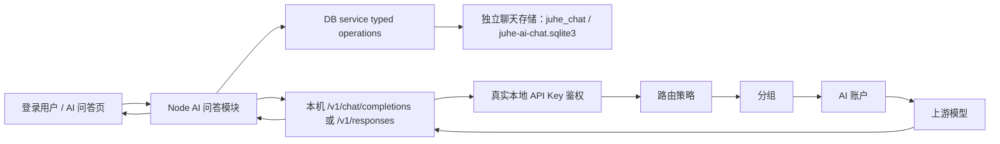

# AI 问答设计

> 本文定义 `juhe-ai` 第一版 AI 问答功能的目标架构、页面交互、接口、存储、流式协议、安全边界和验收口径。
> 当前状态：AI 问答 MVP、Tiptap 输入、Responses 原生工具、版本化系统提示、极简 Markdown 消息流和最近纯文本成功轮次重编辑均已在隔离分支实现；上下文隔离、主动压缩和图片资产链路尚未实现，目标设计见 [AI 问答上下文管理设计](AI问答上下文管理设计.md) 与 PLAN-0095。

## 1. 功能定位

AI 问答是登录用户使用自己 API Key 的平台内置客户端，不是第二套网关、第二套调度系统或独立 Agent 平台。聊天负责客户端体验，审计负责网关调用留痕，两者是相互独立的模块边界。

模型请求必须携带会话绑定的本地 API Key，重新进入现有 `/v1/chat/completions` 或 `/v1/responses` 网关入口，并继续遵守：

- `API Key -> 路由策略 -> 分组 -> AI 账户 -> 供应商 / 协议能力`。
- API Key 状态、过期、时间计划、额度和并发限制。
- 分组与账户调度、模型限制、代理、切号、错误处理和响应语义检查。
- 使用记录、计费、原始审计、来源 IP 和 trace 追踪。

AI 问答模块只新增登录用户会话、消息持久化、上下文组装、站内流式传输和前端展示，不复制网关调度与用量统计。从网关视角看，AI 问答就是一个使用真实 API Key 的普通 OpenAI Chat 客户端。

## 2. 已确认决策

| 事项 | 决策 |
| --- | --- |
| 后端范围 | 第一版只在现有 Node 后端实现，不等待 Go 迁移，也不为 Go 写兼容分支 |
| 模型协议 | 普通模型使用 Chat Completions；具备 Responses 能力的模型使用 `/v1/responses`，工具字段由网关透传 |
| API Key | 新建会话时选择当前用户自己的 API Key，会话创建后固定且不可更换 |
| 模型 | 每轮都可以切换，但只能选择该 API Key 当前可用模型 |
| 上下文 | 服务端管理；当前版本使用最近完整成功轮次，下一阶段改为独立 checkpoint + recent suffix，并始终使用模型最大有效窗口 |
| 输入 | 使用 Tiptap 3 最小编辑器，支持 Markdown 文本、撤销/重做、图片粘贴预览和 `/` 命令入口 |
| 输出 | 支持安全 Markdown、列表、表格、代码块、LaTeX、Mermaid 和 HTTPS Markdown 图片 |
| 消息列表 | 必须使用支持动态高度的虚拟列表和游标分页 |
| 工具 | 不手写搜索、天气或 Shell；透传模型/上游原生 Responses tools，并展示工具事件 |
| 历史操作 | 只支持重新编辑最近一个完整用户轮次；不支持任意历史分支、分享或多人会话 |
| 数据模式 | standalone 使用独立 `juhe-ai-chat.sqlite3`，performance 使用独立 `juhe_chat` schema；两者使用同一业务契约 |
| 容量门禁 | 每个用户最近 7 天聊天正文默认最多 2 GiB；超限后禁止继续发送，但允许读取、停止和删除 |

## 3. MVP 范围

### 3.1 本次包含

- 用户侧菜单“AI 问答”和路由 `/my-chat`。
- 新建、查看、分页加载和删除自己的会话。
- 会话绑定自己的一个 API Key，绑定后不可更换。
- 按 API Key 获取可用模型，并允许每轮切换模型。
- Markdown 编辑、撤销/重做、图片粘贴预览、纯文本提问、流式回答、停止生成和中文错误提示。
- Responses 内置工具事件透传与工具过程展示；不在本模块执行未注册的本地工具。
- 最近 7 天消息存储、完整轮次上下文和后台有界清理。
- Markdown、GFM 列表 / 表格、代码高亮、LaTeX、Mermaid 和 HTTPS 图片展示。
- 动态高度虚拟列表、顶部加载历史、底部跟随和滚动位置保持。
- 幂等发送、同会话单生成、异常流恢复和 trace 关联。

### 3.2 本次不包含

- 同源图片资产上传和上下文图片卸载尚未实现；当前受限 Data URL 方案已确认会触发请求体上限，将由 PLAN-0095 的 multipart 资产链路替换。
- 文件附件、知识库、本站自建联网搜索和语音输入；Responses 可使用上游实际支持的 Hosted Web Search。
- MCP、Skill、站内 Function Tool、工具审批和工具执行 worker。
- system prompt、temperature、top_p 等高级模型参数的用户配置；产品内置 Markdown 默认提示不开放给用户编辑。
- 自动摘要和结构化长期记忆尚未实现；PLAN-0095 只在现有 7 天数据保留边界内提供模型上下文压缩，不延长页面消息保留期。
- 任意历史消息编辑、消息分支、指定旧回答重新生成、会话分享、多人协作。
- 管理员读取其他用户聊天正文的管理页面或接口。
- Go 后端实现或 Node / Go 双写。

站内工具执行、MCP、Skill 和产物进入后续独立计划；模型原生工具事件使用当前聊天消息的结构化内容字段，不把第三方 Agent 运行时引入本项目。

## 4. 总体架构



### 4.1 进程边界

- DB service 的 System API 进程承载 AI 问答 HTTP / SSE 路由、上下文组装和本机网关流转发，以复用现有登录 session、权限和 SQLite 单写者边界；该进程在一轮生成期间持有上游 SSE，但不直接绕过网关访问供应商。
- 主 Node Web 进程在通用 System API 代理之前为 `/my-chat` 挂载独立代理池，使用独立 128 路准入和 15 分钟流超时；聊天长连接不占用普通管理接口的 256 路 / 30 秒代理池。
- 主进程不直接读写数据库。登录会话校验、会话 CRUD、消息事务和清理全部通过 DB service typed operations 完成。
- DB service 的数据库 typed operation 不持有上游 SSE；长连接只存在于 System API 的 Chat route，数据库事务在上游请求前后分别短时执行。
- `ops-worker` 执行过期消息清理和异常 `streaming` 状态恢复；主 Web 进程不启动定时任务。

### 4.2 网关边界

- AI 问答是平台内置客户端；loopback HTTP 只是服务端代客户端发起请求的传输方式，不代表网关内部特权调用。
- Chat 模块从受控存储读取会话绑定 API Key 的完整密钥，仅在服务端内存中短暂使用。
- 前端只接触 API Key ID、名称、前后缀和状态，不接触完整密钥。
- 模型请求通过 loopback HTTP 调用当前主服务 `/v1/chat/completions` 或 `/v1/responses`，不得直接调用供应商 Base URL。协议选择必须以候选账户的实际端点模式和本轮模型映射为准，不能只凭候选查询返回非空判断支持。
- 内部请求仍使用真实 `Authorization: Bearer <本地 API Key>`，不得使用内部 identity 绕过网关鉴权。
- 网关是模型可用性、额度、路由、账户候选、代理和错误切换的最终裁决者；Chat 模块不重复实现或缓存第二套调度规则。
- 认证、额度、并发、调度、计费、使用记录、原始审计和错误处理与其他客户端完全一致；不得因请求来自 AI 问答而跳过或弱化其中任何环节。

## 5. 身份、权限与 API Key

### 5.1 登录身份

- 所有 `/__aisys__/api/my-chat/*` 接口使用现有登录 Cookie。
- 主进程通过 DB service 的窄 typed operation 校验登录 session，得到当前 `systemAccountId` 和角色摘要。
- 所有 repository 操作都必须显式携带当前 `systemAccountId`，不能只凭会话 ID 查询。
- `admin` 和 `super_admin` 在 AI 问答页面也只操作自己的会话，不获得跨用户读取能力。

### 5.2 API Key 规则

- 会话只能绑定当前登录用户拥有、已启用且未过期的 API Key。
- 创建会话时保存 `api_key_id` 和 `api_key_name_snapshot`。
- 会话创建后不支持更换 API Key；需要更换时新建会话。
- API Key 改名后列表可以显示当前名称；Key 被删除后回退显示名称快照。
- API Key 停用、过期、额度耗尽、路由不可用或被删除时，历史消息仍可读，但不能继续发送。
- API Key 刷新密钥但 ID 不变时，会话继续使用刷新后的当前密钥。

### 5.3 模型规则

- 模型下拉数据来自该 API Key 进入本地 `/v1/models` 后的实际结果。
- 模型可以逐轮切换，`chat_conversations.last_model` 只用于恢复界面最近选择，不锁定会话模型。
- 发送时由网关对模型、路由策略和候选账户做最终校验；Chat 模块不维护第二份长期模型缓存。
- 模型已下线或当前路由不能承接时返回网关错误，不悄悄换成其他模型。

## 6. 用户体验与页面设计

### 6.1 页面布局

AI 问答路由使用沉浸布局：隐藏全局 Header、清除内容区外边距，工作区占满可用视口。桌面端使用左侧单行会话栏和右侧对话区；移动端会话列表进入抽屉。模型、思考级别、服务等级和上下文大小放在输入框底部，不占用独立顶部栏。

```text
┌───────────────┬────────────────────────────────────┐
│ 新建对话       │                                    │
│ 会话 A         │        动态高度虚拟消息列表          │
│ 会话 B         │                                    │
│               │                                    │
│               ├────────────────────────────────────┤
│ 会话 C         │ 输入消息                           │
│               │ 模型 / 思考 / 服务 / 上下文    发送 │
└───────────────┴────────────────────────────────────┘
```

### 6.2 新建会话

1. 用户点击“新建对话”并选择自己的 API Key；没有可用 Key 时禁用创建。
2. `POST /conversations` 立即创建会话，绑定后不允许更换 API Key。
3. 创建成功后按会话读取模型列表并选择最近模型或首个可用模型。
4. 空会话属于正常可删除会话，不为其引入请求路径扫描或特殊兼容逻辑。

### 6.3 发送与停止

- `Enter` 发送，`Shift + Enter` 换行；输入法组合输入期间不得误发送。
- 服务端接受轮次并发出 `message.started` 后，前端投影用户消息和助手生成中状态；接受前不伪造已提交消息。
- 生成、停止或待确认期间统一禁止再次发送、编辑和切换会话，避免请求上下文跨会话漂移。
- 点击停止时先中止当前 `fetch`，再调用 `POST /conversations/:id/stop` 让服务端权威收口；停止 HTTP 与旧发送对账完成前保持门禁。
- 客户端断流或终态不确定时按 `clientMessageId` 刷新对账；无法确认时进入后台重试的待确认状态，不能直接恢复草稿造成重复计费。

### 6.4 会话列表

- 按 `last_message_at DESC, id DESC` 稳定排序。
- 会话标题取第一条仍在保留期内的用户消息首个非空行，去除控制字符并压缩空白，最多 60 个字符。
- 会话列表只显示单行标题并省略超长内容，不显示日期分组或时间。
- 右键菜单提供重命名、置顶 / 取消置顶、详情和删除；详情承载 API Key、最近模型、状态与时间等低频信息。
- 删除会话需要二次确认；删除聊天表中的会话和消息，不删除 API Key、使用记录或原始审计。

## 7. 前端虚拟列表

### 7.1 选型

MVP 使用 `@tanstack/vue-virtual`，不复制参考客户端中与 Agent 状态深度耦合的自研虚拟列表。

参考项目可借鉴：

- 动态高度测量和稳定 item key。
- 流式消息增长时的底部锚定。
- prepend 历史后的可见位置恢复。
- 未闭合 Markdown 尾部稳定化和异步渲染序号。
- Markdown、表格、代码、LaTeX、Mermaid 的样式与回归用例。

不直接复制的原因：

- 参考组件与原项目滚动容器、Agent 消息类型和大量内部工具状态耦合。
- 当前只需要原生工具的低噪投影、Tiptap 输入和结构化消息块，不引入完整 Agent 运行时。
- 引入成熟虚拟化库能缩小维护面，但仍需为聊天动态高度补自己的锚定控制。

### 7.2 行为约束

- 每条消息使用稳定 `messageId` 作为虚拟项 key。
- 使用 `ResizeObserver` 测量 Markdown、图片、KaTeX 和 Mermaid 异步渲染后的真实高度。
- 只重新测量发生变化的流式助手消息，不重建全部列表。
- 流式 delta 先进入内存 buffer，按动画帧或约 50ms 合批更新 Vue 状态。
- Markdown 渲染按约 100ms 节流；消息完成后立即做一次最终渲染。
- 用户位于底部容差范围内时自动跟随；主动向上滚动后停止抢占滚动，并显示“回到底部”图标按钮。
- 顶部加载前记录首个可见 `messageId` 和像素偏移，prepend 后恢复锚点。
- 历史消息使用 `beforeSequenceNo` 游标分页，不能一次加载最近 7 天全部消息。
- 首屏默认读取最新 50 条；当前页面为减少顶部往返首次读取 100 条，后续历史同样最多 100 条，虚拟列表 overscan 保持有界。

## 8. 富文本渲染

### 8.1 依赖

- `marked`：Markdown 与 GFM 基础解析。
- `DOMPurify`：最终 HTML 清洗。
- `highlight.js`：常用代码语言高亮，按需注册语言。
- `katex`：行内和块级 LaTeX。
- `mermaid`：流程图、时序图等图表。
- `@tiptap/core`、`@tiptap/vue-3`：输入编辑器内核和 Vue 绑定。
- Tiptap 最小扩展集：StarterKit（含基础 History）、Placeholder 和自定义行内图片附件节点；命令列表由本地轻量状态驱动，不引入 Suggestion、CharacterCount 或通用 Image 扩展。

不引入 LangChain、Mastra、完整 Chat 平台或 Agent UI 运行时。Tiptap 只负责编辑状态，不负责模型调用、工具执行或会话持久化。

### 8.2 支持范围

- 标题、段落、粗体、斜体、删除线、引用和水平线。
- 有序列表、无序列表、任务列表和表格。
- 行内代码、围栏代码块、语言标识、高亮、复制和代码区横向滚动。
- 行内与块级 LaTeX。
- Mermaid 流程图、时序图、状态图等 Mermaid 自身支持的安全图表。
- HTTPS Markdown 图片、懒加载和安全替代文本；原生 HTML 图片也必须经过同一 HTTPS-only 策略。

### 8.3 流式稳定化

- 未闭合代码围栏、LaTeX 块、链接或 Mermaid 围栏不做破坏性猜测。
- Mermaid 只在代码围栏闭合或消息终态后渲染；生成中显示源码占位。
- 每次异步渲染携带递增序号，旧任务完成后不得覆盖新文本的结果。
- 渲染失败回退为已转义的纯文本或源码，不显示空白消息。

### 8.4 安全策略

- Markdown 原始 HTML 不作为可信内容，最终输出始终经过 DOMPurify。
- 链接只允许 `http`、`https` 和 `mailto`，外链使用新窗口并附加 `noopener noreferrer`。
- 图片只允许 HTTPS，设置 `loading=lazy`、`decoding=async` 和 `referrerpolicy=no-referrer`。

### 8.5 AIComposer 编辑器

输入区改为独立 `AIComposer.vue`，不再继续扩展 `a-textarea`。编辑器使用 Tiptap 3 / ProseMirror 的事务和历史栈，业务层只维护聊天需要的内容投影。

- `Enter` 发送，`Shift+Enter` 换行；输入法组合状态期间不发送。
- 撤销、重做、选区、粘贴和拖放由编辑器内核处理。
- 文本以 Markdown 语义输入；图片是行内编辑节点，保持“文字、图片、文字”的原始顺序。
- 图片 Data URL 只存在编辑器快照和本轮结构化请求中，不拼入 `content_text`；单张不超过 4 MiB，最多 4 张。编辑器直接复用 Data URL 预览，不额外创建跨轮次滞留的 Blob URL。
- `/` 触发命令建议菜单；第一阶段命令只产生结构化输入意图，不执行本地命令。
- 发送前保存 Tiptap JSON 快照；发送成功清空编辑器，失败恢复快照，停止生成不恢复已经提交的用户消息。
- 编辑器输出转换为 `input_text` / `input_image` 内容块；纯文本请求仍可降级为现有 `content` 字段。
- 输入框不显示独立工具栏；撤销/重做使用编辑器原生快捷键，图片通过粘贴或 `/image`，交互说明合并到 placeholder。
- 模型、思考级别、服务等级和上下文大小放在输入框底部左侧，发送/停止放在右侧。能力来自模型目录；未知能力不按模型名猜测。
- 思考级别与服务等级分别投影为 Responses `reasoning.effort` / `service_tier` 或 Chat Completions `reasoning_effort` / `service_tier`；上下文大小只约束本站装配的历史预算，不伪造成上游字段。

### 8.6 模型原生工具协议

- 发送前根据 API Key 对应模型能力选择 Chat Completions 或 Responses；不能仅根据模型名称猜测能力。
- Responses 请求保留上游支持的 `tools`、`tool_choice`、`parallel_tool_calls` 等字段，由网关做协议适配和安全校验。
- Chat 模块解析 `response.output_item.added`、`response.function_call_arguments.delta`、`response.output_text.delta`、`response.completed` 等事件，并将工具过程投影为消息时间线中的 `tool_call` / `tool_result` 内容块。
- 上游自行执行的内置工具只展示状态和结果；Chat 模块不重复执行、不伪造工具结果。
- 模型要求本地未注册的 function tool 时，返回明确的“不支持此工具”状态并结束本轮，不能静默当作普通文本。
- 工具调用参数、结果和错误均有字节上限、超时和审计 trace；不得把工具原始 JSON 无界写入 SSE 或聊天正文。

### 8.7 消息信息层级

- 用户和助手正文都使用同一安全 Markdown 渲染器；用户消息在右侧，助手消息在左侧。
- 用户和助手都不显示头像、角色名或模型名；左右位置是角色的稳定视觉信号。
- 用户消息保留轻量浅灰内容块。桌面端悬浮、键盘聚焦时显示发送时间、复制和编辑；触屏设备必须提供可触达入口，不能只依赖 hover。
- 助手消息不使用气泡、卡片、边框或背景，正文占用消息列可用宽度；长代码、表格和图表不再被窄气泡二次压缩。
- 最终回答始终是视觉主体。列表、表格、代码、公式和 Mermaid 按正文语义渲染，不降级为纯文本。
- 思考摘要默认折叠、低强调显示；不把完整内部推理当正文展示，也不让过程内容抢占对话窗口。
- 工具过程按工具类型与规范化动作聚合。相同联网搜索保留真实执行次数，但列表只显示一行“联网搜索已完成 · N 次”。
- 展开工具过程只显示去重后的查询摘要、重复次数和失败状态，不直接展示 call ID、协议事件或原始 JSON；完整事实仍保存在受限结构化内容和审计链路中。
- 流式工具和思考事件直接更新当前助手消息，不刷新整个消息列表；完成后保持折叠状态。
- 禁止 `javascript:`、`data:`、`file:`、iframe、表单、事件属性和任意外部 SVG。
- Mermaid 使用严格安全模式；生成 SVG 再经过允许 SVG profile 的清洗。
- 表格、代码和长公式在窄屏横向滚动，不能撑破消息列。
- 围栏代码块显示语言和复制按钮；复制操作不改变消息内容，也不触发重新渲染。
- 外部图片即使不带 referrer 仍会向图片服务器暴露用户出口 IP；MVP 文档明确该边界，不把 7 天保留承诺解释为网络匿名。

### 8.8 默认 Markdown 回答提示

本轮改造为聊天请求增加代码内版本化的产品提示，不再完全依赖模型自行选择回答格式。第一版固定为 `chat-system-v1`，由纯函数按实际能力组合以下小模块：

1. **指令优先级**：用户明确要求的语言、格式、长度和交付形态优先于默认偏好。
2. **默认回答**：使用用户当前语言；无法判断时使用简体中文。在有助于阅读时使用 Markdown，简单回答不强制标题、表格或代码块。
3. **严格格式**：用户明确要求 JSON、CSV、XML、YAML、纯文本、仅代码、完整文件或补丁时严格按该格式输出，不增加无关说明，也不擅自套 Markdown 围栏。
4. **真实性**：区分已知事实、合理推断和不确定信息，不声称使用当前未提供的工具或能力。
5. **工具纪律**：仅在本轮实际启用工具时加入；避免重复调用名称相同且参数等价的工具，前次失败、结果可能过期或用户明确要求刷新时允许重试。

- Chat Completions 把该提示作为第一条 `system` message。
- Responses 使用顶层 `instructions`，历史 `input` 仍只包含用户和助手消息。
- 内置提示不保存为聊天消息、不出现在前端、不计入用户可编辑草稿。
- Chat Completions 与 Responses 使用同一个构建结果；网关和协议桥接不得再次拼接，避免重复注入。
- 只把实际启用的工具规则放入提示；Chat-only 回退不能收到虚假的联网能力说明。
- 记录稳定版本和内容 hash 供回归与排障使用，但第一版不开放管理员或用户编辑任意 system prompt。
- Hosted tool 是否真正重复执行仍由上游模型决定；本站无法在工具已由上游执行后追回成本，只能用提示降低概率并在展示层聚合真实事件。

设计只借鉴 [prompts.chat](https://github.com/f/prompts.chat) 的任务提示结构，以及 [system_prompts_leaks](https://github.com/asgeirtj/system_prompts_leaks) 中可观察到的模块隔离、工具条件和优先级模式；不复制社区角色模板、厂商品牌身份、泄露提示原文、未实现工具或内部权限规则。Prompt 只提供行为默认值，不能替代代码侧鉴权、工具 allowlist、参数校验和副作用确认。

### 8.9 最近一轮重新编辑

只允许编辑当前会话最近一个完整成功轮次的用户消息，不建设任意历史分支：

1. 用户悬浮或聚焦最近一条可编辑用户消息，点击编辑。
2. 前端把该用户消息的 Tiptap 内容块恢复到输入框，原用户消息与对应助手回答降低强调，并显示“取消编辑”。
3. 此时后端不删除数据；用户取消、切换会话或关闭页面时，原轮次保持不变。
4. 用户重新发送时携带 `replaceTurnId` 和新的 `clientMessageId`。
5. 后端在单个 DB service 事务中确认目标仍是最近完整轮次、会话没有活动生成，然后删除旧轮次幂等记录与两条旧消息，并用相同的两个 `sequence_no` 接受新轮次。
6. 新助手占位消息进入 `streaming` 后继续走现有网关、SSE、终态和错误处理链路；不会把旧助手回答加入新请求上下文。

约束：

- 生成中、失败、取消、已过期或已经不是最近轮次的消息不能编辑。
- 编辑入口只出现在最近一个可编辑用户轮次，旧消息不显示编辑按钮。
- 第一版只支持重新编辑纯文本轮次；包含图片的消息不显示编辑入口，避免把当前仅随本轮请求发送的 Data URL 改为长期落库。
- 替换事务成功后旧轮次立即不可恢复；如果随后模型请求失败，保留新的失败轮次，不自动找回旧回答。
- 替换第一轮且它仍是标题来源时，使用新用户文本重新生成会话标题。
- 并发提交、目标轮次变化或会话正在生成统一返回 `409 chat_replace_conflict`，前端重新加载消息并保留当前草稿。

### 8.10 会话列表与滚动

- 对话主区不显示会话标题、API Key 快照和顶部模型工具条，垂直空间全部让给消息窗口。
- 会话列表每项只显示一行标题，超长省略；重命名、置顶/取消置顶、详情和删除放在右键菜单。
- 会话详情按需展示 API Key 快照、最近模型、活动状态、置顶状态、创建时间和更新时间，不在列表重复展示。
- 用户位于底部附近时，文本、工具、思考和异步高度变化自动跟随；用户向上滚轮、触摸、键盘或拖动滚动条离开底部后立即解除跟随，流式输出不得抢回滚动位置。
- 距离底部超过 72px 时，在输入框上方中央显示“回到底部”按钮；点击后恢复跟随并滚到最新消息。
- 加载更早历史时使用虚拟列表尺寸差恢复原锚点，不能把用户跳到顶部或底部。

## 9. 后端模块划分

```text
backend/src/modules/chat/
  chat.routes.ts
  chat-transport.ts
  chat-system-instructions.ts
  chat-context-budget.ts
  chat-gateway-sse.ts
  chat-responses-sse.ts
  chat-active-streams.ts
  chat-bounded-json.ts
  chat-content-blocks.ts
  chat-model-options.ts
  chat-turn-initialization.ts

backend/src/storage/
  chat-client.ts
  chat.repository.ts
  schema/chat-schema.ts
  postgres-chat-message-partitions.ts
```

职责边界：

- `chat.routes.ts`：HTTP 参数、登录态、会话归属、SSE 生命周期、停止门禁、对账错误和本机网关调用。
- `chat-transport.ts`：按账户实际端点和模型映射选择 Chat / Responses，构造对应请求体。
- `chat-system-instructions.ts`：纯函数构建版本化产品提示、版本与 hash。
- `chat-context-budget.ts`：为 system instructions、历史、当前输入、图片和工具预留统一上下文预算。
- Chat / Responses SSE parser：有界解析跨 chunk UTF-8、文本、reasoning、工具事件、完成和流内失败。
- `chat-active-streams.ts`：按会话和 turn ID 条件删除停止句柄，防止旧流清理误删新流。
- `chat-bounded-json.ts`：模型目录和上游错误的普通 JSON 流式限长读取，超限立即取消 reader。
- `chat-content-blocks.ts`：完成、取消和失败终态写库前统一压缩结构块，避免工具过程突破持久化边界。
- `chat-turn-initialization.ts`：接受轮次后的初始化失败终结；初始化与终结同时失败时保留两个错误。
- repository：会话、消息、幂等、容量窗口、最近轮次事务替换和清理，全部通过 DB service typed operations。

## 10. API 契约

所有接口位于 `/__aisys__/api/my-chat`，只操作当前登录用户数据。成功响应遵循 System API `{ data, message? }` 包装；流式发送接口除外。

### 10.1 API Key 选项

```http
GET /__aisys__/api/my-chat/api-keys
```

- 返回当前用户状态为 `active` 的轻量 `{ id, name, status }` 列表，不返回完整密钥。
- API Key 的所有权、当前密钥、额度、路由和运行态在创建会话或发送时继续由服务端与网关校验。

### 10.2 会话与模型

```http
POST /__aisys__/api/my-chat/conversations
GET /__aisys__/api/my-chat/conversations?beforeLastMessageAt=...&beforeId=...&limit=30
GET /__aisys__/api/my-chat/conversations/:id
PATCH /__aisys__/api/my-chat/conversations/:id
GET /__aisys__/api/my-chat/conversations/:id/models
DELETE /__aisys__/api/my-chat/conversations/:id
```

- 创建请求只接受 `apiKeyId`，成功返回 `201`；会话绑定后不提供更换 API Key 的接口。
- 会话列表使用 `(last_message_at, id)` 复合游标，默认 30、最大 50，只返回摘要。
- PATCH 只接受 `title` 和 `isPinned`，至少提供一个字段；标题最长 60 字符。
- 模型列表先校验会话归属，再使用绑定 Key 调用本机 `/v1/models`，返回模型控制所需能力摘要。
- DELETE 返回 `204`，不删除网关使用记录或原始审计。

### 10.3 消息列表

```http
GET /__aisys__/api/my-chat/conversations/:id/messages?beforeSequenceNo=120&limit=50
```

- 默认从最新消息向前读取 50 条，最大 100，返回前按 `sequenceNo ASC` 排列。
- `beforeSequenceNo` 必须在 PostgreSQL `integer` 范围内；缺少游标时不绑定超范围哨兵值。
- 已过期并清理的消息不可恢复。

### 10.4 流式发送与停止

```http
POST /__aisys__/api/my-chat/conversations/:id/stream
Accept: text/event-stream
Content-Type: application/json

{
  "clientMessageId": "client_uuid",
  "replaceTurnId": "turn_xxx",
  "content": "用户问题",
  "contentBlocks": [{ "type": "input_text", "text": "用户问题" }],
  "model": "gpt-xxx",
  "reasoningEffort": "medium",
  "serviceTier": "priority",
  "contextWindowTokens": 128000
}
```

- `clientMessageId` 必填且最长 100 字符；重复 ID 返回 `409 chat_message_already_exists`，不得再次请求上游。
- `replaceTurnId` 可选，只允许最近纯文本完整成功轮次；冲突返回 `409 chat_replace_conflict`。
- `content` 最大 `192 KiB`；相邻文本在图片边界之间合并，结构块最多 9 个（4 张图片与 5 段交错文本），当前支持 `input_text` / `input_image`，图片只允许 Responses 路径。
- `/my-chat` 使用独立 `24 MiB` JSON 上限以容纳 Base64 膨胀，但必须先经过 session 鉴权、登录用户限流和 DB service 准入控制；其他 System API 继续保持 `256 KiB`。
- 同一会话同时只允许一个生成任务。服务端接受后才发送 `message.started`；接受后的初始化失败必须把占位助手消息终结为失败。

```http
POST /__aisys__/api/my-chat/conversations/:id/stop
```

- 仅会话所有者可以停止当前活动轮次；接受停止返回 `202`。
- 没有活动轮次返回 `404`，页面仍需完成旧请求对账后再解除发送门禁。

## 11. 内部 SSE 协议

页面不直接依赖上游 OpenAI SSE，而是读取稳定的站内事件。

### 11.1 事件

```text
event: message.started
data: {"turnId":"turn_xxx","userMessage":{...},"assistantMessage":{...}}

event: message.delta
data: {"messageId":"msg_xxx","delta":"新增文本"}

event: reasoning.delta
data: {"messageId":"msg_xxx","delta":"思考增量"}

event: tool.started | tool.updated | tool.completed
data: {"messageId":"msg_xxx","item":{...}}

event: message.completed
data: {"messageId":"msg_xxx","finishReason":"stop","traceId":"trace_xxx"}

event: message.failed
data: {"messageId":"msg_xxx","code":"gateway_stream_failed","message":"模型请求失败"}
```

- 每 15 秒发送 SSE comment heartbeat。
- Chat Completions 以 `[DONE]` 与 finish reason 收口；Responses 必须收到 `response.completed` 才能成功。HTTP EOF 不能替代协议终态。
- Chat Completions 与 Responses 的单事件和 pending block 最大 `64 KiB`、单轮最多 2048 个事件；Responses reasoning/tool 辅助过程累计最大 `192 KiB`。超限进入失败终态，不能把无界过程写入内存或消息结构。
- 非 SSE 的模型目录响应最大 `4 MiB`，上游错误响应最大 `64 KiB`；必须边读流边计数并在超限时取消 reader，不能先完整 `response.text()` 后再截断。
- 用户主动取消后浏览器连接已经关闭，不依赖 `message.canceled` 送达；服务端落库状态为 `canceled`，页面刷新后以存储状态为准。
- 工具 item 完整持久化供排障和历史恢复，普通 UI 按规范化动作聚合，不直接显示原始 ID 或 JSON。
- 不把上游堆栈、内部 URL、账号凭据或完整内部错误返回前端。

### 11.2 解析要求

- 正确处理 SSE 数据跨 TCP chunk，并用流式 `TextDecoder` 处理 UTF-8 字符在字节中间切分。
- 支持多行 `data:`、comment heartbeat、Chat `[DONE]` 与 Responses 事件序列。
- 识别文本、reasoning、工具生命周期、完成、流内失败和无终止事件断流。
- 解析器设置单事件、事件数和累计正文字节上限，禁止无界拼接。
- Chat Completions 和 Responses 使用相同的事件/pending 上限基线；任何协议新增解析器时都必须同时补无分隔大块、事件洪泛、截断终态和 UTF-8 跨 chunk 回归。

## 12. 数据模型与存储拓扑

MVP 只新增会话、消息、发送幂等登记和紧凑容量窗口四类聊天数据，不新增附件、产物、工具执行或消息内容块表。聊天正文属于高增长、短保留数据，不能继续放入 `juhe_business`：

- standalone：新增独立 `juhe-ai-chat.sqlite3`，由 DB service 维持单写者边界；不得因为上线重建其他非业务数据库。
- performance：在现有 PostgreSQL 集群新增独立 `juhe_chat` schema；会话元数据使用普通表，消息事实表按 UTC `created_at` 日分区。
- Redis 只承担短期取消信号、SSE 协调或瞬时门禁，不保存聊天正文，也不是会话事实来源。
- 聊天与业务库保持逻辑隔离，但 `system_account_id`、`api_key_id` 仍引用现有业务身份语义；跨库关联由受控 repository 查询完成，不在聊天请求路径扫描业务表。
- 100 用户、每用户每月约 1 GiB 的估算下，7 天原始正文约 23 GiB；连同索引、WAL、膨胀和增长余量，生产磁盘按 60–80 GiB 起步并设置 70%/85% 容量告警。

### 12.1 `chat_conversations`

| 字段 | 规则 |
| --- | --- |
| `id` | 会话 ID |
| `system_account_id` | 所属登录用户，非空 |
| `api_key_id` | 当前 API Key；Key 删除后置空 |
| `api_key_name_snapshot` | Key 删除或改名后的历史展示兜底，非敏感 |
| `title` | 当前标题，默认“新对话” |
| `title_source_message_id` | 当前标题来源用户消息，可空 |
| `is_pinned` | 当前用户是否置顶，默认 false |
| `last_model` | 最近一次已接受发送所选模型，可空 |
| `next_sequence_no` | 下一消息序号，默认 1 |
| `active_turn_id` | 当前生成轮次；空表示无生成任务 |
| `active_started_at` | 当前生成开始时间，用于崩溃恢复 |
| `last_message_at` | 稳定列表排序时间 |
| `created_at`、`updated_at` | UTC 时间 |

索引：

- `(system_account_id, last_message_at DESC, id DESC)`。
- `(system_account_id, api_key_id)`。
- `(active_started_at, id)`，用于恢复异常流。

PostgreSQL 中 `chat_conversations` 不分区；它是小型元数据表。会话没有保留期内消息且没有活动轮次后才删除。

### 12.2 `chat_messages`

| 字段 | 规则 |
| --- | --- |
| `id` | 消息 ID |
| `conversation_id` | 所属会话 |
| `system_account_id` | 冗余用户隔离字段，非空 |
| `turn_id` | 一次用户提问与助手回答共享的轮次 ID |
| `sequence_no` | 会话内稳定顺序 |
| `client_message_id` | 仅用户消息非空，用于发送幂等；助手消息为空 |
| `role` | 仅 `user`、`assistant` |
| `status` | `completed`、`streaming`、`failed`、`canceled` |
| `content_text` | 纯文本 Markdown；不保存渲染 HTML |
| `content_blocks_json` | 有界结构块：用户输入类型标记、助手 reasoning 和工具生命周期；不保存用户图片 Data URL |
| `model` | 本轮实际请求模型 |
| `trace_id` | 关联网关使用记录和审计 |
| `finish_reason` | 正常完成原因，可空 |
| `error_code` | 失败摘要码，可空 |
| `created_at`、`completed_at` | UTC 时间 |
| `content_bytes` | `content_text` 的 UTF-8 字节数，用于容量窗口增量维护 |
| `expires_at` | 创建时间加 7 天 |

约束和索引：

- `(conversation_id, sequence_no DESC)`。
- `(conversation_id, turn_id)`。
- `(expires_at, id)`。
- `role=user` 时 `client_message_id` 非空且状态只能是 `completed`；`role=assistant` 时 `client_message_id` 为空。
- 同一轮用户和助手占位消息在同一事务中使用相同 `created_at` 与 `expires_at`，保证保留窗口一致。

PostgreSQL 约束：

- `chat_messages` 按 UTC `created_at` 创建每日 range partition，写入前确保当天和下一天分区存在。
- 主键包含分区键；PostgreSQL 不能在日分区表上直接建立不含分区键的跨分区唯一约束，因此会话序号由锁定 `chat_conversations` 后原子分配，发送幂等由非分区登记表保证。
- 清理时先直接 drop 已完全早于 7 天窗口的日分区；最老的部分重叠分区再按 `(expires_at, id)` 游标小批删除，保证精确滚动 `7 × 24` 小时。
- SQLite 不模拟分区，使用 `(expires_at, id)` 覆盖索引和固定小批删除；不能在线执行阻塞式全库 `VACUUM`。

### 12.3 `chat_message_idempotency`

这是小型、非分区登记表，只保存幂等键和消息定位，不保存正文：

| 字段 | 规则 |
| --- | --- |
| `conversation_id`、`client_message_id` | 联合主键 |
| `system_account_id` | 用户隔离字段 |
| `turn_id`、`user_message_id`、`assistant_message_id` | 已创建轮次定位 |
| `created_at`、`expires_at` | 与轮次保留窗口一致 |

- 接受发送时先锁定会话，再插入幂等登记和两条消息；冲突时返回已有轮次，不再次调用网关。
- 清理完整轮次时同步删除登记；兜底任务按 `(expires_at, conversation_id, client_message_id)` 小批删除孤立过期登记。
- SQLite 使用同一契约和联合主键。

### 12.4 `chat_user_storage_windows`

容量门禁使用按用户、按 UTC 日的紧凑窗口表，不在发送请求中实时 `SUM(chat_messages)`：

| 字段 | 规则 |
| --- | --- |
| `system_account_id` | 用户 ID |
| `bucket_date` | UTC 日期 |
| `content_bytes` | 当日已持久化聊天正文 UTF-8 字节数 |
| `updated_at` | UTC 时间 |

- 主键 `(system_account_id, bucket_date)`。
- 消息最终落库、取消、失败截断和删除时在同一 DB service 事务内增量调整对应窗口。
- 发送门禁只读取当前用户最近 7 个日桶，最多 8 行，默认硬上限 `2 GiB`；不扫描消息明细。
- 超限返回 `409 chat_storage_quota_exceeded`，允许用户继续读取、停止生成和删除会话；清理或删除释放容量后可继续发送。
- 用户估算明显偏离时再通过系统设置调整上限；MVP 不做按租户分库分表和复杂计费套餐。

不保存 token、成本、命中账户或分组快照，这些事实继续由网关使用记录维护，聊天消息只通过 `trace_id` 关联。

## 13. 消息事务、幂等与并发

### 13.1 一次发送

1. 校验登录用户、会话归属、API Key 当前状态和输入大小。
2. 在 DB service 单个事务中检查 `active_turn_id` 和 `clientMessageId`。
3. 分配两个连续 `sequence_no`，写入已完成用户消息和 `streaming` 助手占位消息。
4. 设置会话 `active_turn_id`、`active_started_at`、`last_model` 和 `last_message_at`。
5. 按完整成功轮次组装上下文。
6. 使用绑定的真实 API Key 调用本机网关。
7. delta 在内存中有界合批并向页面流式发送，不按 token 写数据库。
8. 正常结束时一次更新助手消息为 `completed` 并清除 `active_turn_id`。
9. 用户停止时保存已收到正文为 `canceled`，清除 `active_turn_id`。
10. 失败时保存有界部分正文和错误码为 `failed`，清除 `active_turn_id`。

### 13.2 幂等

- 同会话同 `clientMessageId` 只允许产生一个用户消息和一次网关请求。
- 重复请求不自动重新调用模型，返回 `409 chat_message_already_exists` 和已有轮次摘要，前端重新读取消息。
- 原请求仍在生成时返回 `409 chat_message_in_progress`。
- 不同会话允许并发，最终仍受 API Key 和网关并发限制。

### 13.3 崩溃恢复

- `ops-worker` 扫描超过“网关最大响应时限 + 宽限时间”的 `active_started_at`。
- 对应助手消息改为 `failed`，错误码 `stream_interrupted`，并清除会话活动轮次。
- 恢复操作按游标和固定小批执行，必须幂等。
- 页面刷新不尝试恢复原 SSE，也不自动重发可能已经计费的请求。

## 14. 上下文组装

### 14.1 完整轮次

上下文的最小单位是一个完整成功轮次，而不是单条 `status=completed` 消息。

一个轮次只有同时满足以下条件才可进入下一次模型请求：

- 同一 `turn_id` 存在一条 `role=user,status=completed` 消息。
- 同一 `turn_id` 存在一条 `role=assistant,status=completed` 消息。
- 两条消息都未过期。

因此助手失败或取消后，虽然用户问题可以在页面回看，但该用户问题不会孤立进入下一轮上下文。

### 14.2 当前有界查询

- 只查当前 `system_account_id` 和当前 `conversation_id`。
- 只查 `expires_at > now` 的完整成功轮次。
- 从最新向前最多读取 64 个完整轮次、128 条消息。
- 查询必须使用会话、状态、时间和数量上限，不能读取整个保留窗口后再在内存截断。
- 结果从旧到新还原为 OpenAI Chat `messages`。
- 当前用户问题始终保留，不计入历史轮次数量。

以上 64 轮查询是 MVP 当前实现，不是目标架构。PLAN-0095 将其替换为最新成功 checkpoint + checkpoint 后增量消息的有界查询；页面历史继续独立分页。

### 14.3 当前 Token 预算与替换目标

每轮按当前选择模型重新计算预算：

```text
可用历史输入预算 = min(
  64K MVP 历史上限,
  有效模型上下文窗口
  - 输出预留
  - 协议与工具安全空间
  - 固定提示估算
  - 当前内容块估算
  - 消息结构开销
)
```

- 上下文窗口从本地模型目录元数据读取，不从标准 `/v1/models` 响应猜测。
- 客户端选择的历史上限不能突破服务端模型目录窗口：`effectiveWindow = min(用户选择, 服务端模型窗口)`。
- 模型元数据未知时采用保守 16K 总输入预算。
- 输出预留 8K token；协议安全空间同时覆盖实际工具定义，固定提示单独估算，不能与当前问题混在一起忽略。
- 图片输入按张使用保守预留，后续有可靠模型元数据时再替换为能力级估算。
- MVP 使用保守 UTF-8 字节估算并留安全余量，不引入按供应商维护的重型 tokenizer。
- 超出预算时只从最旧完整轮次开始删除，不能留下半轮消息。
- 固定提示加当前输入已经超过预算时，在调用网关前返回明确中文错误，不能只清空历史后继续发送。
- 第一版不自动摘要，避免额外模型调用和跨 7 天内容延续。

上述 64K 上限、客户端窗口选择、16K 未知模型回退和 UTF-8 字节估算只描述当前 MVP，已确认不适合作为长期实现。目标方案见 [AI 问答上下文管理设计](AI问答上下文管理设计.md)：删除窗口下拉，使用模型最大有效窗口；优先采用 `/responses/input_tokens` 和上游真实 usage；token 与最终 JSON 字节分别预算；压缩成功后原子安装 checkpoint，失败保留旧上下文。

## 15. 7 天保留与审计边界

### 15.1 聊天数据保留

聊天窗口固定定义为滚动 `7 × 24` 小时，数据库统一使用 UTC。

- 每条聊天消息 `expires_at = created_at + 7 天`。
- 活跃会话可以持续超过 7 天，但页面和模型只能读取仍在保留期内的消息。
- 标题来源消息过期后，从仍保留的最早用户消息重新生成标题。
- 会话已无消息时删除会话。
- 没有消息的空会话超过 24 小时后删除。
- 手动删除会话立即删除聊天表中的会话和消息。
- PostgreSQL 先 drop 完全过期的日分区，再对部分重叠的最老分区按 `(expires_at, id)` 游标选择到期候选；SQLite 直接按同一游标固定小批推进。删除按候选 `turn_id` 成对执行，禁止全表读入内存，也不能在批次边界留下孤立的一问或一答。

### 15.2 聊天与审计相互独立

聊天 7 天规则只约束 `chat_conversations`、`chat_messages`、容量窗口、页面历史和后续模型上下文，不自动改变现有网关原始审计策略。

- 聊天模块按客户端身份使用网关；审计模块按网关统一规则记录该客户端调用。
- AI 问答请求仍按普通网关请求记录使用记录和原始审计。
- 删除会话或消息不会级联删除使用记录、原始审计和计费事实。
- 不增加“内部请求可关闭审计正文”的签名开关，避免形成能绕过当前审计保全政策的特殊通道。
- 如果未来产品要承诺“7 天后任何位置都不存在对话正文”，必须单独修改 [安全与日志策略](安全与日志策略.md) 和 [原始审计日志设计](原始审计日志设计.md)，并明确合规、排障和保全代价。

这是对原会话方案的重要修正：不能仅凭聊天上下文保留期，暗中改变全局审计规则。

## 16. 内置客户端来源边界

MVP 不新增内部来源 header、HMAC 签名或 `trafficSource=ai_chat`，避免让来源标记误入现有网关调度语义。Chat 模块只使用会话绑定的真实 Bearer API Key 调用 loopback 网关，因此鉴权、额度、限流、调度、计费、使用记录与审计均按普通客户端执行。

- 网关网络层看到的请求来源是 loopback；MVP 不把浏览器原始 IP 写入网关调用事实。
- 登录用户归属由 Chat repository 的 `system_account_id` 和真实 API Key 所有权保证，不能由客户端 header 覆盖。
- 后续确需区分站内问答时，应新增独立的“客户端来源”事实字段，不能复用会影响路由分支的 `trafficSource`，并需单独设计防伪与审计契约。

## 17. 错误、重试与取消

| HTTP / 事件 | 页面文案 | 是否可重试 |
| --- | --- | --- |
| `400` | 消息或模型参数无效 | 修正后可重试 |
| `401` | 当前 API Key 已失效 | 更换新会话或修复 Key |
| `403` | 无权使用该 API Key 或模型 | 否 |
| `404` | 会话不存在或历史已过期 | 否 |
| `409` | 当前会话正在生成，或本条消息已经提交 | 刷新状态 |
| `413` | 消息内容过长 | 缩短后重试 |
| `429` | 已达到额度、频率或并发限制 | 稍后或调整额度 |
| `503` | 当前没有可用的 AI 账户 | 稍后重试 |
| `504` | 模型响应超时 | 可人工重试 |

- 网关已经负责建流前的安全切号和路由回退，Chat 模块不重复重试模型请求。
- 一旦已有可见输出，Chat 模块绝不自动重新提交请求，避免重复回答和重复计费。
- 用户人工重新发送会创建新轮次，不覆盖失败轮次。
- `finish_reason=length` 显示“回答达到长度限制”。
- 内容策略终止显示明确中文状态，但不暴露上游敏感正文。

## 18. 性能与容量边界

- 用户输入和单条助手正文都设置 `192 KiB` 上限；超过上限主动中断并保存明确错误。
- 网关流解析、页面 delta buffer 和最终消息 buffer 都必须有累计字节上限。
- 消息列表只用游标分页和虚拟化，不支持深 offset 或整会话加载。
- Chat API 不扫描使用记录做统计；成本、Token 和账户命中继续读取现有预聚合或使用记录页面。
- 清理 worker 每批最多 1000 条过期消息，并限制每轮批次数；涉及会话标题重算时按本批去重会话 ID 批量处理，避免逐消息 N+1。
- 容量判断只读取 `chat_user_storage_windows` 最近 7 个日桶；PostgreSQL 接受轮次时按 `system_account_id` 持有事务级配额锁，使跨会话“读取、判断、占用”原子化。禁止请求路径对消息表执行 `SUM`、`COUNT` 或全会话正文累计。
- 100 用户规模不做分库分表；当聊天物理数据持续达到 200–300 GiB，或聊天 I/O 已影响业务 schema 延迟时，优先迁移到独立 PostgreSQL database / cluster，再评估按 `system_account_id` 哈希分片。
- AI 问答路由加载 KaTeX；Mermaid 仅在消息实际包含图表时动态加载。其他业务路由不加载两者。
- 代码高亮只注册常用语言，未知语言按纯文本代码块展示。

## 19. 验证矩阵

### 19.1 后端与存储

- 用户只能读取、发送和删除自己的会话。
- 管理角色使用个人接口时也不能读取他人会话。
- 会话创建后不能修改 API Key；Key 删除后历史只读。
- Key 停用、过期、额度耗尽和路由不可用时不能继续发送。
- 同一 `clientMessageId` 不产生第二次网关请求。
- 同会话并发发送返回 `409`，不同会话允许并发。
- 同一用户不同会话并发占用容量时，配额检查串行化且最终窗口不得超过上限。
- 只有最近一个纯文本完整轮次可以携带 `replaceTurnId`；旧轮次、图片轮次、生成中和并发替换返回 `409 chat_replace_conflict`。
- 替换事务复用原轮次序号、删除旧幂等登记，且新请求上下文不包含被替换的旧轮次。
- SQLite standalone 与 PostgreSQL performance 使用相同契约。
- 查询只读取最近 7 天、最多 64 个完整轮次。
- 失败、取消和崩溃遗留轮次不进入上下文。
- 清理按索引和游标推进，活跃会话只保留窗口内消息。

### 19.2 网关链路

- 使用真实本地 API Key 进入 `/v1/models` 和 `/v1/chat/completions`。
- Chat Completions 收到首条 Markdown 默认 `system` message，Responses 收到等价 `instructions`；两者不写入聊天消息历史。
- 用户明确要求完整文件时不被 Markdown 默认偏好覆盖；相同工具参数的重复调用提示只降低概率，不伪造执行结果。
- `chat-system-v1` 构建结果稳定且有 hash；Chat-only 请求不含工具纪律段，Responses 工具请求只注入一次。
- 严格 JSON、CSV、XML、YAML、纯文本、仅代码和补丁请求保持用户原文与格式优先级，不被默认 Markdown 偏好覆盖。
- API Key 对应路由策略、分组和账户命中正常。
- 模型逐轮切换不改变会话 API Key 和网关调度边界。
- 账户代理、错误切换、额度、并发和响应检查继续生效。
- 使用记录包含正确用户、Key、分组、账户、模型和 trace；MVP 不伪造独立 `ai_chat` 来源字段。
- Chat 模块不存在直接请求公共上游的代码路径。

### 19.3 流式

- SSE 数据跨 chunk、多行 `data:` 和 UTF-8 中间切分。
- 正常 `[DONE]` / `response.completed`、缺少终止事件、超大/过多 Responses 辅助事件、建流前 JSON 错误和建流后中断。
- 用户主动停止、客户端断网和主进程异常退出。
- `finish_reason=length`、429、503、504 和流内错误。
- 部分输出后不会自动重放。
- 助手消息正文达到上限时有界终止，不无限占用内存。

### 19.4 前端

- Markdown 标题、列表、任务列表、表格、引用、链接、代码复制。
- 用户和助手无头像、无角色名；用户右侧浅灰内容块，助手左侧无边框正文流。
- 用户消息悬浮、键盘聚焦和触屏操作入口可用；只有最近可编辑轮次显示编辑按钮。
- 编辑态恢复文本到 AIComposer，旧轮次降低强调；取消不改后端，重新发送后替换旧轮次。
- 提交清空不进入 UndoRedo 历史；模型未选中或仍在加载时不清空草稿；图片读取任务跨清空/恢复代次后不得写回旧文档。
- 会话列表使用 `(is_pinned, last_message_at, id)` 完整游标并提供加载更多，置顶会话不能使普通会话漏页。
- 相同联网搜索聚合为一行并显示真实次数，展开只显示可读查询摘要，不显示原始 JSON。
- 行内 / 块级 LaTeX、Mermaid 成功与错误回退、HTTPS 图片失败占位。
- `script`、事件属性、`javascript:`、恶意 SVG 和 Mermaid 安全用例。
- 未闭合围栏、公式、链接和表格的流式状态不闪空或破坏布局。
- 至少 5000 条合成消息时 DOM 只保留可视窗口附近节点。
- 文本、代码、表格、图片、Mermaid 混合动态高度不重叠。
- 用户在底部时跟随，向上阅读时不抢滚动，prepend 历史后不跳动。
- 离底超过阈值时显示回到底部按钮，点击后按钮消失并恢复流式跟随。
- 会话列表单行省略，右键重命名、置顶、详情和删除均可用。
- 移动端抽屉、输入区和长内容不遮挡、不溢出。
- 所有业务提示、空态和错误文案保持中文。

## 20. 实施顺序

1. 固定表结构、API、SSE、权限、7 天保留和容量门禁规则。
2. 实现 business schema、PostgreSQL schema、repository 和 DB service typed operations。
3. 实现会话 CRUD、消息事务、幂等、上下文和清理恢复任务。
4. 实现主进程 Chat Router、本机网关 client、内部元数据签名和 SSE 解析。
5. 实现会话列表、Key / 模型选择、输入、发送、停止和普通文本流式展示。
6. 实现 Markdown、代码、KaTeX、Mermaid、图片和动态虚拟列表。
7. 完成 Mock AI、SQLite、PostgreSQL、网关使用记录、安全和浏览器验收。

## 21. 后续规划

### 第二版：多模态输入

- 按 PLAN-0095 实现 multipart 图片资产、缩放压缩、视觉问答、隐藏图片说明和生命周期。
- 同步实现渲染历史与模型上下文隔离、主动压缩和圆形上下文状态。
- 直接使用当前最优字段结构，不为旧 Data URL 请求写兼容分支。

### 第三版：受控工具

- 服务端工具循环和明确的工具调用状态。
- 一个受控图片生成工具及产物下载。
- 工具审批、超时、大小限制、审计和失败恢复。

### 第四版：MCP 与 Skill

- 使用官方 MCP SDK 接入服务端 MCP Client。
- Skill 注册、版本、启停、允许工具范围和凭据引用。
- 独立工具执行 worker 或沙箱。
- 工具产物存储、下载和清理。

无论后续增加什么能力，模型调用仍必须携带会话绑定的本地 API Key 进入现有网关；工具运行时不能直接替代网关连接模型供应商。

## 22. 设计复核结论

原会话总体方向可行，但以下细节已在本文修正：

1. 7 天聊天保留不等于修改全局审计保全；MVP 不增加关闭审计正文的内部特权。
2. 上下文按完整成功轮次筛选，不按单条 `completed` 消息筛选。
3. MVP 只保存纯文本 Markdown，不为 MCP、Skill 和附件提前设计版本化内容块。
4. API Key 选择使用独立轻量 options 接口，不拉完整管理列表充当下拉数据。
5. 新建对话先保留为前端草稿，第一次发送才持久化，降低空会话垃圾。
6. 用户取消后不依赖已经断开的 SSE 再收到 canceled 事件，页面和存储各自收敛状态。
7. System API 进程承载流式模型请求并维持 SQLite 单写者；主进程使用独立聊天代理池隔离长连接，避免占用普通 System API 准入槽。
8. AI 问答明确作为平台内置客户端接入网关，聊天数据生命周期与网关审计生命周期各自独立。
9. 高频聊天正文从业务库拆出：standalone 使用独立 SQLite，performance 使用独立 `juhe_chat` schema 和 PostgreSQL 日分区。
10. 每用户最近 7 天默认 2 GiB 容量门禁由日窗口增量维护；超限不阻断读取、停止与删除。

以上修正不改变用户确认的产品方向，只移除会造成安全例外、孤立上下文、重复体系或不必要预设计的实现风险。
