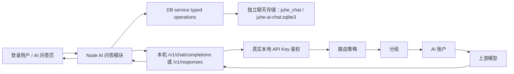

# AI 问答设计

> 本文定义 `juhe-ai` 第一版 AI 问答功能的目标架构、页面交互、接口、存储、流式协议、安全边界和验收口径。
> 当前状态：AI 问答 MVP、Tiptap 输入、Responses/Chat Completions 双协议、有序助手时间线、版本化系统提示、Markdown/代码高亮/LaTeX/Mermaid/SVG、multipart 图片资产、按需会话加载、统一内部工具 Registry/Orchestrator、development/test Demo、`generate_image` 生成/编辑、图像谱系和 WebP 原图/预览双资产均已在隔离工作树实现；本地专项与真实浏览器验收由 [PLAN-0150-20260722T022751000Z](../plans/计划-0150-20260722T022751000Z-AI问答有序过程生图与按需加载.md) 追踪。真实账户与 Codex 浏览器验收只在本地进行，禁止未经用户批准上线。详细上下文验收见 [AI 问答上下文管理设计](AI问答上下文管理设计.md) 和 PLAN-0104。

## 1. 功能定位

AI 问答是登录用户使用自己 API Key 的平台内置客户端，不是第二套网关、第二套调度系统或独立 Agent 平台。聊天负责客户端体验，审计负责网关调用留痕，两者是相互独立的模块边界。

模型请求必须携带会话绑定的本地 API Key，重新进入现有 `/v1/chat/completions` 或 `/v1/responses` 网关入口，并继续遵守：

- `API Key -> 路由策略 -> 分组 -> AI 账户 -> 供应商 / 协议能力`。
- API Key 状态、过期、时间计划、额度和并发限制。
- 分组与账户调度、模型限制、代理、切号、错误处理和响应语义检查。
- 使用记录、计费、原始审计、来源 IP 和 trace 追踪。

AI 问答模块只新增登录用户会话、消息持久化、上下文组装、站内流式传输和前端展示，不复制网关调度与用量统计。从网关视角看，AI 问答就是一个使用真实 API Key 的普通 OpenAI Chat 客户端。

## 2. 已确认决策

| 事项 | 决策 |
| --- | --- |
| 后端范围 | 第一版只在现有 Node 后端实现，不等待 Go 迁移，也不为 Go 写兼容分支 |
| 模型协议 | 普通模型按能力使用 Chat Completions 或 Responses；站内工具循环协议无关，`generate_image` 执行器通过本机 `/v1/images/generations` 使用固定 `gpt-image-2` provider |
| API Key | 新建会话时选择当前用户自己的 API Key，会话创建后固定且不可更换 |
| 模型 | 每轮都可以切换，但只能选择该 API Key 当前可用模型 |
| 上下文 | 服务端使用独立 checkpoint + recent suffix；软水位异步压缩、硬水位发送前压缩，并始终使用模型目录最大有效输入窗口 |
| 上游缓存 | 首期只为模型目录明确支持的 OpenAI 请求生成会话级稳定 opaque `prompt_cache_key`；保持 canonical prefix，并复用网关软亲和，未知兼容上游不发送 |
| 输入 | 使用 Tiptap 3 最小编辑器，支持 Markdown 文本、撤销/重做、图片粘贴预览和 `/` 命令入口 |
| 输出 | 支持 Markdown、列表、表格、代码块、LaTeX、Mermaid、fenced SVG 隔离预览、HTTPS Markdown 图片和私有生成图片 |
| 消息列表 | 必须使用支持动态高度的虚拟列表和游标分页 |
| 工具 | 上游联网等原生工具按协议透传；本站工具统一经过 Registry/Orchestrator，串行执行、有限轮次/调用数/结果大小、取消和精确重复调用复用 |
| 历史操作 | 只支持重新编辑最近一个完整用户轮次；不支持任意历史分支、分享或多人会话 |
| 数据模式 | standalone 使用独立 `juhe-ai-chat.sqlite3`，performance 使用独立 `juhe_chat` schema；两者使用同一业务契约 |
| 会话门禁 | 每用户最多 50 个现存会话，每会话最多接受 50 个用户轮次；均可通过运行配置调整，达到上限返回稳定 409 机器码 |
| 容量门禁 | 每个用户当前聊天保留窗口（默认 3 天）正文默认最多 2 GiB；超限后禁止继续发送，但允许读取、停止和删除 |

## 3. MVP 范围

### 3.1 本次包含

- 用户侧菜单“AI 问答”和路由 `/my-chat`。
- 新建、查看、分页加载和删除自己的会话。
- 会话绑定自己的一个 API Key，绑定后不可更换。
- 按 API Key 获取可用模型，并允许每轮切换模型。
- Markdown 编辑、撤销/重做、图片原位粘贴与 multipart 上传、图文提问、流式回答、停止生成和中文错误提示。
- Responses 内置工具事件透传与工具过程展示；站内 `diagnostic_echo` 仅在 development/test 显式开关下可用，`generate_image` 只有图像权限、provider 和可调度模型账户同时满足时才注入。
- 当前配置保留期（默认 3 天）的渲染历史、图片资产、上下文 checkpoint 和后台有界清理。
- 上游真实 input usage、本地 tokenizer 兜底、最终 JSON 字节预检和只读上下文圆环。
- Markdown、GFM 列表 / 表格、代码高亮、LaTeX、Mermaid 和 HTTPS 图片展示。
- 动态高度虚拟列表、顶部加载历史、底部跟随和滚动位置保持。
- 幂等发送、同会话单生成、异常流恢复和 trace 关联。

### 3.2 本次不包含

- 文件附件、知识库、本站自建联网搜索和语音输入；Responses 可使用上游实际支持的 Hosted Web Search。
- MCP、Skill、第三方工具热加载和完整工具审批平台；PLAN-0150-20260722T022751000Z 只包含受控的本站 function tool 首段、开发 Demo、图片执行器和 worker 可迁移边界。
- system prompt 不开放给用户编辑；生成参数仅开放温度、Top P、频率惩罚、存在惩罚、最大输出 Tokens 与随机种子，且必须由当前模型、协议和候选路由共同明确支持。
- 跨会话长期记忆和超过当前配置保留期的聊天保留；当前结构化摘要只服务当前会话的 当前配置保留边界。
- 任意历史消息编辑、消息分支、指定旧回答重新生成、会话分享、多人协作。
- 管理员读取其他用户聊天正文的管理页面或接口。
- Go 后端实现或 Node / Go 双写。

站内工具的通用执行边界与首个图片工具已由 [内部工具运行时与生图设计](../superpowers/specs/2026-07-20-AI问答内部工具运行时与生图设计.md) 固化并落地。Chat/Responses 都使用同一编排器，模型继续通过真实 API Key 进入现有网关；MCP、Skill 和第三方 Agent 运行时仍是独立范围。

图片二次编辑采用“主会话 + 有界图像谱系索引”，不创建供应商私有的长期子会话，也不提供把生成图重新插入输入框的专用编辑流程。用户只需在原会话继续输入普通文本；主模型读取完整文本上下文和最近 12 条不可信谱系元数据，选择明确的 `assetId` 后调用内部图像工具。`chat_conversations.default_image_model` 保存会话默认图像模型，当前只允许 `gpt-image-2`；`chat_image_generations` 为每个助手生成资产保存 `generate/edit`、模型、提示词、来源 `assetId`、根图、尺寸、质量和格式。主上下文不注入图片 Base64；工具执行时才按同会话 `assetId` 读取最多 5 张、合计最多 48 MiB 的有效处理后图片。生成使用 JSON `/v1/images/generations`，编辑使用 multipart `/v1/images/edits` 和重复 `image[]`；网关从 multipart 受限解析 `model` 用于模型感知路由，正文仍原样透传。生成图在聊天页内预览原图并支持下载，不跳离当前页面。完整决策见 [图像编辑与子上下文设计](../superpowers/specs/2026-07-20-AI问答图像编辑与子上下文设计.md)。

## 4. 总体架构



### 4.1 进程边界

- DB service 的 System API 进程承载 AI 问答 HTTP / SSE 路由、上下文组装和本机网关流转发，以复用现有登录 session、权限和 SQLite 单写者边界；该进程在一轮生成期间持有上游 SSE，但不直接绕过网关访问供应商。
- 主 Node Web 进程在通用 System API 代理之前为 `/my-chat` 挂载独立代理池，使用独立 128 路准入和 15 分钟流超时；聊天长连接不占用普通管理接口的 256 路 / 30 秒代理池。
- 主进程不直接读写数据库。登录会话校验、会话 CRUD、消息事务和清理全部通过 DB service typed operations 完成。
- DB service 的数据库 typed operation 不持有上游 SSE；长连接只存在于 System API 的 Chat route，数据库事务在上游请求前后分别短时执行。
- `ops-worker` 执行过期消息清理和异常 `streaming` 状态恢复；主 Web 进程不启动定时任务。

### 4.2 网关边界

- AI 问答是平台内置客户端；loopback HTTP 只是服务端代客户端发起请求的传输方式，不代表网关内部特权调用。
- Chat 模块从受控存储读取会话绑定 API Key 的完整密钥，仅在服务端内存中短暂使用。
- 前端只接触 API Key ID、名称、前后缀和状态，不接触完整密钥。
- 模型请求通过 loopback HTTP 调用当前主服务 `/v1/chat/completions` 或 `/v1/responses`，不得直接调用供应商 Base URL。协议选择必须以候选账户的实际端点模式和本轮模型映射为准，不能只凭候选查询返回非空判断支持。
- 内部请求仍使用真实 `Authorization: Bearer <本地 API Key>`，不得使用内部 identity 绕过网关鉴权。
- 网关是模型可用性、额度、路由、账户候选、代理和错误切换的最终裁决者；Chat 模块不重复实现或缓存第二套调度规则。
- 认证、额度、并发、调度、计费、使用记录、原始审计和错误处理与其他客户端完全一致；不得因请求来自 AI 问答而跳过或弱化其中任何环节。

## 5. 身份、权限与 API Key

### 5.1 登录身份

- 所有 `/__aisys__/api/my-chat/*` 接口使用现有登录 Cookie。
- 主进程通过 DB service 的窄 typed operation 校验登录 session，得到当前 `systemAccountId` 和角色摘要。
- 所有 repository 操作都必须显式携带当前 `systemAccountId`，不能只凭会话 ID 查询。
- `admin` 和 `super_admin` 在 AI 问答页面也只操作自己的会话，不获得跨用户读取能力。

### 5.2 API Key 规则

- 每个系统账户拥有唯一的 `purpose = chat` AI 对话专用 API Key；新账户随默认资源创建，历史账户首次新建会话时幂等补齐。
- 专用 Key 初始绑定 GPT 默认普通路由，但不属于不可变的路由默认 Key；用户可以在 API Key 页面将它切换到自己的其他启用策略路由。
- 未显式选择其他 Key 时，新会话固定使用该专用 Key。已有会话继续使用创建时绑定的 Key，不做自动迁移。
- 会话只能绑定当前登录用户拥有、已启用且未过期的 API Key。
- 创建会话时保存 `api_key_id` 和 `api_key_name_snapshot`。
- 会话创建后不支持更换 API Key；需要更换时新建会话。
- API Key 改名后列表可以显示当前名称；Key 被删除后回退显示名称快照。
- API Key 停用、过期、额度耗尽、路由不可用或被删除时，历史消息仍可读，但不能继续发送。
- API Key 刷新密钥但 ID 不变时，会话继续使用刷新后的当前密钥。

### 5.3 模型规则

- 模型下拉数据按会话 API Key 路由策略的全部 active 分组绑定聚合当前供应商模型目录，与认证 `/v1/models` 共用动态目录事实；列表项只返回 `id` 和 `name`，不把能力数组塞入下拉响应。
- 创建会话时服务端从同一动态目录返回并持久化首个可用模型引用；前端首屏可直接使用该模型，不必先打开模型列表。
- 模型可以逐轮切换，`chat_conversations.last_model` 用于恢复界面当前/最近选择，不锁定会话模型；切换后能力由独立模型 ID 接口按需读取。
- 发送时由网关对模型、路由策略和候选账户做最终校验；Chat 模块不维护第二份长期模型缓存。
- 模型已下线或当前路由不能承接时返回网关错误，不悄悄换成其他模型。

## 6. 用户体验与页面设计

### 6.1 页面布局

AI 问答路由使用沉浸布局：隐藏全局 Header、清除内容区外边距，工作区占满可用视口。桌面端使用左侧单行对话栏和右侧对话区；移动端对话列表进入抽屉，并由左上角页面级悬浮工具组中的“对话记录”按钮打开，不占用输入框。应用壳只提供悬浮工具 Teleport 容器，聊天页自己管理对话抽屉。模型、思考级别和服务等级放在输入框底部；左下角 `+` 工具箱提供“添加图片”，上下文仍只显示模型目录窗口对应的只读圆形状态。

```text
┌───────────────┬────────────────────────────────────┐
│ 新建对话       │                                    │
│ 会话 A         │        动态高度虚拟消息列表          │
│ 会话 B         │                                    │
│               │                                    │
│               ├────────────────────────────────────┤
│ 会话 C         │ 输入消息                           │
│               │ 模型 / 思考 / 服务              发送 │
└───────────────┴────────────────────────────────────┘
```

### 6.2 新建会话

1. 用户点击“新建对话”；默认使用 AI 对话专用 API Key，兼容入口仍可显式选择当前用户的其他可用 Key。
2. `POST /conversations` 立即创建会话，绑定后不允许更换 API Key。
3. 创建成功后使用响应中的默认模型引用；用户首次展开模型下拉时才读取 `id/name` 列表，切换模型时再按 ID 读取能力。
4. 空会话属于正常可删除会话，不为其引入请求路径扫描或特殊兼容逻辑。

### 6.3 发送与停止

- 普通段落中 `Enter` 发送，`Shift + Enter` 换行；列表、引用和代码块等结构块中的 `Enter` 交给编辑器继续当前结构，`Ctrl + Enter` / `Cmd + Enter` 在任意块中发送。输入法组合输入期间不得误发送。
- 用户点击发送后，前端立即投影本地用户消息和助手生成中占位；`message.started` 到达后用服务端消息 ID 和轮次原位确权，失败时按提交状态恢复或收口，不能追加重复气泡。
- 助手占位尚无正文、思考、工具或内容块时显示带跳动点和秒级耗时的“思考中”；10 秒静默确权时改为“正在确认生成状态”，重附着时改为“正在恢复连接”。进入正文或过程块后立即让位给真实内容，减少动态效果偏好的系统关闭动画。
- 生成、停止或待确认期间禁止在同一会话再次发送或编辑；允许切换到其他会话。生成 runtime、停止目标、SSE 订阅和失败对账按 `systemAccountId + conversationId` 隔离，旧会话的慢回调不得清理或覆盖当前会话消息与草稿。
- 点击停止时先中止当前 `fetch`，再携带当前 `clientMessageId` 和已知 `turnId` 调用 `POST /conversations/:id/stop`；服务端只允许条件命中的准备或轮次收口，停止 HTTP 与旧发送对账完成前保持门禁。停止请求失败时 runtime 恢复同轮附着，页面必须显示明确中文错误，不能吞掉拒绝或伪造已停止。
- 客户端断流或终态不确定时按 `clientMessageId` 刷新对账；无法确认时进入后台重试的待确认状态，不能直接恢复草稿造成重复计费。
- 单次前台探活默认最多执行 180 次状态确认。轮次尚未被服务端接受且持续处于 `preparing` / `not_found` 时，达到上限后必须以明确的客户端确认超时失败收口并允许人工重试；已经接受且服务端仍报告 `running` 时释放停滞 SSE，只执行一次最终权威消息同步，不伪造服务端失败终态。同版本 streaming 快照不能解除耗尽状态，只有更高 `eventVersion` 或真实终态才能开启新的有界探活周期。页面级待确认恢复最多自动调度 8 轮，之后保留“重新确认”人工入口。
- 输入框底部的“生成参数”只显示模型能力接口返回的项目。能力按供应商、精确模型和 Chat Completions / Responses 请求协议取保守交集，并在模型详情和实际发送时按 API Key 命中的账户端点模式、模型映射及账户类型再次收敛；OAuth 归一化和跨协议桥接只保留明确可保真转发的参数。未知、兼容层会静默忽略、或任一候选路径不能保真转发的参数一律隐藏且不发送。温度与 Top P 互斥，最大输出 Tokens 受模型目录上限约束；服务端对每一轮请求重复校验，不信任前端状态。

### 6.4 会话列表

- 按 `last_message_at DESC, id DESC` 稳定排序。
- 会话标题取第一条仍在保留期内的用户消息首个非空行，去除控制字符并压缩空白，最多 60 个字符。
- 会话列表只显示单行标题并省略超长内容，不显示日期分组或时间。
- 右键菜单提供重命名、置顶 / 取消置顶、详情和删除；详情承载 API Key、最近模型、状态与时间等低频信息。
- 删除会话需要二次确认；删除聊天表中的会话和消息，不删除 API Key、使用记录或原始审计。
- 进入 AI 问答先读取有界会话摘要页（当前首批 30 条），没有激活会话时默认选择第一项；消息、模型和上下文只为当前激活会话异步加载。若本地待确认记录指向已删除会话，清理该记录并回退首个可用摘要，不能停留在无激活会话的空白页。
- 单个会话正文按最近消息页和 `beforeSequenceNo` 游标加载，虚拟列表只渲染可视项；重上下文必须显示独立加载态，不能阻塞会话列表或首页壳。
- `/clear` 清空当前对话时必须保留对话 ID、API Key、置顶和最近模型偏好，由服务端事务处理容量账本、消息、上下文和资产；成功前页面和缓存不能提前清空。
- 重命名、置顶和清空按会话串行提交；重命名/置顶只合并目标字段，失败回滚到该字段最后一次服务端确认值。清空成功后提升消息加载代次与请求 lifecycle 代次，按服务端 `messageRevision` 失效并排空同步 flight，再删除 IndexedDB 窗口；清空前的直接消息刷新、提交失败协程和草稿恢复都不得修改清空后的页面或新请求。

## 7. 前端虚拟列表

### 7.1 选型

MVP 使用 `@tanstack/vue-virtual`，不复制参考客户端中与 Agent 状态深度耦合的自研虚拟列表。

参考项目可借鉴：

- 动态高度测量和稳定 item key。
- 流式消息增长时的底部锚定。
- prepend 历史后的可见位置恢复。
- 未闭合 Markdown 尾部稳定化和异步渲染序号。
- Markdown、表格、代码、LaTeX、Mermaid 的样式与回归用例。

不直接复制的原因：

- 参考组件与原项目滚动容器、Agent 消息类型和大量内部工具状态耦合。
- 当前只需要原生工具的低噪投影、Tiptap 输入和结构化消息块，不引入完整 Agent 运行时。
- 引入成熟虚拟化库能缩小维护面，但仍需为聊天动态高度补自己的锚定控制。

### 7.2 行为约束

- 每条消息使用稳定 `messageId` 作为虚拟项 key。
- 使用 `ResizeObserver` 测量 Markdown、图片、KaTeX 和 Mermaid 异步渲染后的真实高度。
- 只重新测量发生变化的流式助手消息，不重建全部列表。
- 流式 delta 先进入内存 buffer，按动画帧或约 50ms 合批更新 Vue 状态。
- Markdown 渲染按约 100ms 节流；消息完成后立即做一次最终渲染。
- 用户位于底部容差范围内时自动跟随；主动向上滚动后停止抢占滚动，并显示“回到底部”图标按钮。
- 顶部加载前记录首个可见 `messageId` 和像素偏移，prepend 后恢复锚点。
- 历史消息使用 `beforeSequenceNo` 游标分页，不能一次加载当前保留期全部消息。
- 会话摘要首屏默认 30 条并按游标加载更多；单个激活会话最多先读取最新 100 条消息，顶部继续按 `beforeSequenceNo` 分页，不能一次加载保留期全部正文。IndexedDB 展示缓存只读取有界最近窗口。

## 8. 富文本渲染

### 8.1 依赖

- `marked`：Markdown 与 GFM 基础解析。
- `DOMPurify`：最终 HTML 清洗。
- `highlight.js`：常用代码语言高亮，按需注册语言。
- `katex`：行内和块级 LaTeX。
- `mermaid`：流程图、时序图等图表。
- `@tiptap/core`、`@tiptap/vue-3`：输入编辑器内核和 Vue 绑定。
- Tiptap 最小扩展集：StarterKit（含基础 History）、Placeholder 和自定义行内图片附件节点；命令列表由本地轻量状态驱动，不引入 Suggestion、CharacterCount 或通用 Image 扩展。

不引入 LangChain、Mastra、完整 Chat 平台或 Agent UI 运行时。Tiptap 只负责编辑状态，不负责模型调用、工具执行或会话持久化。

### 8.2 支持范围

- 标题、段落、粗体、斜体、删除线、引用和水平线。
- 有序列表、无序列表、任务列表和表格。
- 行内代码、围栏代码块、语言标识、高亮、复制和代码区横向滚动。
- 行内与块级 LaTeX；兼容 `$...$`、`$$...$$`、`\(...\)` 和 `\[...\]`，且不改写 fenced code 内的同形文本。
- Mermaid 流程图、时序图、状态图等 Mermaid 自身支持的安全图表。
- HTTPS Markdown 图片、懒加载和安全替代文本；原生 HTML 图片也必须经过同一 HTTPS-only 策略。

### 8.3 流式稳定化

- 未闭合代码围栏、LaTeX 块、链接或 Mermaid 围栏不做破坏性猜测。
- Mermaid 只在代码围栏闭合或消息终态后渲染；生成中显示源码占位。
- 每次异步渲染携带递增序号，旧任务完成后不得覆盖新文本的结果。
- 渲染失败回退为已转义的纯文本或源码，不显示空白消息。

### 8.4 安全策略

- Markdown 原始 HTML 不作为可信内容，最终输出始终经过 DOMPurify。
- 链接只允许 `http`、`https` 和 `mailto`，外链使用新窗口并附加 `noopener noreferrer`。
- 图片只允许 HTTPS，设置 `loading=lazy`、`decoding=async` 和 `referrerpolicy=no-referrer`。

### 8.5 AIComposer 编辑器

输入区改为独立 `AIComposer.vue`，不再继续扩展 `a-textarea`。编辑器使用 Tiptap 3 / ProseMirror 的事务和历史栈，业务层只维护聊天需要的内容投影。

- 普通段落中 `Enter` 发送，`Shift+Enter` 换行；无序列表、有序列表、引用和代码块中的 `Enter` 遵循编辑器原生结构编辑，`Ctrl+Enter` / `Cmd+Enter` 在任意状态发送。输入法组合状态期间不发送。
- 撤销、重做、选区、粘贴和拖放由编辑器内核处理。
- 文本以 Markdown 语义输入；在块首输入 `- `、`1. `、`> `、代码围栏等 Markdown 前缀时由 StarterKit 输入规则创建真实列表、引用或代码块，后续 `Enter` 按该块的编辑器规则处理。图片是行内编辑节点，保持“文字、图片、文字”的原始顺序。
- 图片选择或粘贴后立即使用原始 Blob URL 显示本地预览，压缩准备最多并发 2 张，再走 multipart 资产上传；编辑器节点只保存 `assetId` 和私有预览 URL，发送请求只传资产引用，不把 Data URL 放入聊天 JSON。删除图片会取消排队、压缩或上传任务；被取消的 active 任务继续占物理并发槽直至真实结束，但不阻塞新会话发送，被取消的 queued 任务不得保留原图强引用。迟到结果只有在节点仍属于当前文档且任务代次未失效时才能写回。提交成功后释放原始 `File`、压缩结果与临时 Blob URL，暂存记录同时按原图和压缩文件计入内存边界。
- 同一次富文本粘贴同时含文字和图片时，必须使用浏览器 DOM 结构按“文字、图片、文字”的原顺序插入，不能把全部文字移到图片前面；图片大小/数量过滤保留原剪贴板文件槽位，远程装饰图不消耗本地图片槽位，避免后一张合法图片错绑到前一个 HTML 图片位置。只有剪贴板没有 HTML 图片位置时才回退为文字后追加图片。图片节点通过 Backspace/Delete 或按钮离开文档后统一取消仍在进行的上传；切换会话、清空或离开页面会删除已上传但未提交的资产，上传响应晚于卸载时也要补偿删除。有序列表编号和嵌套层级在 Tiptap JSON 转 Markdown 时必须保持，并通过标准 Markdown 解析器验证。
- `/` 只在当前普通文本块的光标前触发命令建议菜单；命令固定包含 `/clear-input` 清空输入、`/code` 插入代码块、`/image` 添加图片、`/image-model` 设置当前会话默认图像模型、`/compact` 手动压缩上下文和 `/clear` 清空当前对话。`/image-model` 打开中文单选弹窗并可回滚乐观更新；`/compact` 与 `/clear` 是页面级动作，必须确认并等待服务端接受，不能作为文本插入或乐观完成。列表通过 Markdown 输入规则创建，不再提供独立 `/list` 命令。
- 斜杠查询没有候选项时，Enter 回到普通发送语义，不能被空命令菜单吞掉。
- 发送前保存 Tiptap JSON 快照；发送成功清空编辑器，失败恢复快照，停止生成不恢复已经提交的用户消息。
- 编辑器输出转换为 `input_text` / `input_image` 内容块；纯文本请求仍可降级为现有 `content` 字段。
- 输入框不显示富文本格式工具栏；撤销/重做使用编辑器原生快捷键，图片可以通过粘贴、`/image` 或左下角 `+ -> 添加图片` 进入同一隐藏文件输入和上传链路。`+` 是可扩展输入工具箱，不承载页面全局对话能力。
- 模型、思考级别和服务等级放在输入框底部左侧，发送/停止放在右侧。选项只来自服务端模型目录；未知能力不按模型名猜测，也不补“自动”选项。
- 思考级别不提供“无思考”和“自动”；目录默认值只用于能力说明，页面初始不选择任何档位。用户可以清除已选值回到空状态；未显式选择时不发送思考级别。
- 服务等级不提供“自动”；模型声明服务等级能力时显示真实可选项，但页面初始不选择任何档位。用户可以清除已选值回到空状态；未显式选择时省略 `service_tier` 并由上游决定。
- 思考级别、服务等级、输入/输出模态和工具按“上游可用模型 ID 与本地官方能力快照”返回；同名模型存在多个可达供应商候选时取共同能力。模型未声明对应能力时不显示控件，也不发送字段。
- 图片命令、粘贴提示和服务端验收同时读取模型 `inputModalities`；仅凭 Responses 协议可用不能推导图片能力。
- 上下文不再由客户端提交 `contextWindowTokens`；服务端区分模型目录的总窗口、最大输入和最大输出。官方没有独立最大输入时，按 `contextWindowTokens - maxOutputTokens` 派生保守输入预算。

### 8.6 模型原生工具协议

- 发送前按 API Key 可达账户、模型映射和协议桥接结果选择 Chat Completions 或 Responses；模型目录里的原生协议用于能力说明，不能覆盖显式的 source endpoint mapping。
- Responses 请求保留上游支持的 `tools`、`tool_choice`、`parallel_tool_calls` 等字段，由网关做协议适配和安全校验。
- 用户选择 reasoning effort 时，Responses 请求发送 `reasoning: { effort, summary: "auto" }`；前端只展示上游公开的 reasoning summary 事件，不展示或伪造隐藏思维链。
- Chat 模块解析 `response.output_item.added`、`response.function_call_arguments.delta`、`response.output_text.delta`、`response.completed` 等事件，并将工具过程投影为消息时间线中的 `tool_call` / `tool_result` 内容块。
- 只有模型目录明确声明 `web_search` 且最终走 Responses 时才注入联网搜索；不能因为使用 Responses 就给所有模型强塞工具。
- 文本模型明确需要位图时调用本站 `generate_image` function tool；结构图、流程图、时序图、架构图、Mermaid、LaTeX 和 SVG 继续优先使用结构化输出。工具执行器固定 `gpt-image-2`，文本模型根据用户意图填写尺寸、质量和格式；执行器只按公开协议约束做确定性校验，合法参数原样传递、非法参数在调用上游前失败，不读取用户原话做关键词放行、静默缩放或提示词优化。工具循环对 Chat/Responses 都可用，不依赖上游 `image_generation` 托管工具。`chatImageGenerationTotalTimeoutSeconds` 控制一次图片工具调用从网关选号到资产提交的整体时限，默认 `900` 秒、范围 `60..86400`；每个新聊天任务冻结当次系统设置快照，不能与网关 image lane 的单账户首响应超时混为一个字段。通用边界见 [AI 工具创建规范](../architecture/backend/AI工具创建规范.md)。
- 对话模型与图像模型职责严格分离：`gpt-5.5`、GPT-5.6 等普通模型只负责回答和选择 `generate_image` / 编辑工具，工具适配器才使用当前会话默认图像模型，当前固定为 `gpt-image-2`。图像账户后台健康检查使用上游 `GET /v1/models` 精确确认模型 ID，不得把普通对话模型写进 Images 请求，也不得用文本 `/v1/responses` 探测纯图像模型；真实生成和编辑仍分别走 Images generations / edits。
- `generate_image` 完成后通过 artifact sink 原子写入同一个 `assetId` 的 original/preview 两个对象：original 保留 provider 实际 WebP/PNG/JPEG，preview 统一 WebP、最长边约 640；消息只加载 `?variant=preview`；点击预览通过页面内 Ant Design Vue 图片灯箱按需请求 `?variant=original`，下载通过 fetch + blob 保存本地文件，避免普通链接把当前聊天页导航到图片 URL。资产响应默认 `Content-Disposition: inline`，可选 `download=1` 时改为 attachment；两个版本分别使用 SHA-256 ETag、`private, max-age=86400, immutable` 和条件请求 304；对象提交成功后才解除补偿删除。
- Images、Chat Completions、Responses 和前端 SSE 的 body reader 在协议错误、大小拒绝、回调异常或消费者提前结束时必须调用 `cancel()`；只有自然读到 `done` 才直接释放 reader lock，避免旧连接在重附着或失败后继续占用资源。
- OpenAI Chat / Responses 映射到 Gemini native 时，思考级别转换为 `generationConfig.thinkingConfig.thinkingLevel`，服务等级转换为 Gemini 顶层 `service_tier`；不能只在下游请求保留无效的 OpenAI 字段。
- 上游自行执行的内置工具只展示状态和结果；Chat 模块不重复执行、不伪造工具结果。
- 模型要求本地未注册的 function tool 时，返回明确的“不支持此工具”状态并结束本轮，不能静默当作普通文本。
- 工具调用参数、结果和错误均有字节上限、超时和审计 trace；不得把工具原始 JSON 无界写入 SSE 或聊天正文。

### 8.7 消息信息层级

- 用户和助手正文都使用同一安全 Markdown 渲染器；用户消息在右侧，助手消息在左侧。
- 用户和助手都不显示头像、角色名或模型名；左右位置是角色的稳定视觉信号。
- 用户消息保留轻量浅灰内容块。桌面端悬浮、键盘聚焦时显示发送时间、复制和编辑；触屏设备必须提供可触达入口，不能只依赖 hover。
- 助手消息不使用气泡、卡片、边框或背景，正文占用消息列可用宽度；长代码、表格和图表不再被窄气泡二次压缩。
- 最终回答始终是视觉主体。列表、表格、代码、公式和 Mermaid 按正文语义渲染，不降级为纯文本。
- 思考摘要默认折叠、低强调显示；过程块在执行时渐进展开，完成后自动折叠，失败后默认展开诊断详情，不能把完整内部推理当正文展示。
- 助手按照 `content_blocks_json` 的首次观察顺序渲染思考、联网搜索 1、联网搜索 2、正文、其他工具和图片；同一工具 ID 的 updated/completed 只更新原位置。只有相邻工具块进入同一投影段，正文、思考或图片会切断聚合边界，禁止为去重而全局重排时间线。
- 实际助手消息树必须挂载低噪工具投影；展开工具过程只显示去重后的查询摘要、重复次数和失败状态，不直接展示 call ID 或原始 JSON。未知工具没有可读摘要时只显示不可展开状态行，完整事实保存在有界结构化内容和审计链路中。
- 流式工具和思考事件直接更新当前助手消息，不刷新整个消息列表；完成后保持折叠状态。
- Markdown 普通 HTML 仍禁止 `javascript:`、`data:`、`file:`、表单和外部资源；fenced `svg` 使用隔离 iframe `srcdoc` 预览，按用户决策允许 SVG 原型脚本和事件在 iframe 沙箱内运行，不进入聊天主 DOM。
- Mermaid 使用安全模式并关闭 HTML 标签，输出原生 SVG 文本，避免 `foreignObject` 经严格清洗后丢失节点标签；fenced SVG 仅在围栏闭合后渲染，失败时显示转义源码和中文失败状态。
- 表格、代码和长公式在窄屏横向滚动，不能撑破消息列。
- 围栏代码块显示语言和复制按钮；复制操作不改变消息内容，也不触发重新渲染。
- 外部图片即使不带 referrer 仍会向图片服务器暴露用户出口 IP；MVP 文档明确该边界，不把 聊天保留承诺解释为网络匿名。

### 8.8 默认 Markdown 回答提示

本轮改造为聊天请求增加代码内版本化的产品提示，不再完全依赖模型自行选择回答格式。当前版本固定为 `chat-system-v2`，由纯函数按实际能力组合以下小模块：

1. **指令优先级**：用户明确要求的语言、格式、长度和交付形态优先于默认偏好。
2. **默认回答**：使用用户当前语言；无法判断时使用简体中文。在有助于阅读时使用 Markdown，简单回答不强制标题、表格或代码块。
3. **严格格式**：用户明确要求 JSON、CSV、XML、YAML、纯文本、仅代码、完整文件或补丁时严格按该格式输出，不增加无关说明，也不擅自套 Markdown 围栏。
4. **可靠性**：所有结论只依据当前对话、用户提供信息、可用工具或环境证据以及可验证可靠知识；严格区分事实、推断、假设和未知，禁止猜测、伪造或脑补未知内容。
5. **信息不足**：缺少关键条件时明确说明无法完成，逐条列明缺失信息及影响，引导用户补齐；不得强行拼凑、模糊敷衍或把未经确认的假设写成事实。
6. **图形偏好**：流程、时序、状态和结构关系优先 Mermaid，数学表达使用 LaTeX；需要矢量原型时输出 fenced SVG，需要位图时优先调用真实图片工具，不用文本字符画替代。
7. **工具纪律**：仅在本轮实际启用工具时加入；联网和生图过程必须按真实事件顺序展示，不伪造工具结果。

- Chat Completions 把该提示作为第一条 `system` message。
- Responses 使用顶层 `instructions`，历史 `input` 仍只包含用户和助手消息。
- 内置提示不保存为聊天消息、不出现在前端、不计入用户可编辑草稿。
- Chat Completions 与 Responses 使用同一个构建结果；网关和协议桥接不得再次拼接，避免重复注入。
- 只把实际启用的工具规则放入提示；Chat-only 回退不能收到虚假的联网能力说明。
- 记录稳定版本和内容 hash 供回归与排障使用，但第一版不开放管理员或用户编辑任意 system prompt。
- Hosted tool 是否真正重复执行仍由上游模型决定；本站无法在工具已由上游执行后追回成本，只能用提示降低概率并在展示层聚合真实事件。

设计只借鉴 [prompts.chat](https://github.com/f/prompts.chat) 的任务提示结构，以及 [system_prompts_leaks](https://github.com/asgeirtj/system_prompts_leaks) 中可观察到的模块隔离、工具条件和优先级模式；不复制社区角色模板、厂商品牌身份、泄露提示原文、未实现工具或内部权限规则。Prompt 只提供行为默认值，不能替代代码侧鉴权、工具 allowlist、参数校验和副作用确认。

### 8.9 最近一轮重新编辑

只允许编辑当前会话最近一个完整成功、失败或已停止轮次的用户消息，不建设任意历史分支：

1. 用户悬浮或聚焦最近一条可编辑用户消息，点击编辑。
2. 前端把该用户消息的 Tiptap 内容块恢复到输入框，原用户消息与对应助手回答降低强调，并显示“取消编辑”。
3. 此时后端不删除数据；用户取消、切换会话或关闭页面时，原轮次保持不变。
4. 用户重新发送时携带 `replaceTurnId` 和新的 `clientMessageId`。
5. 后端在单个 DB service 事务中确认目标仍是最近完整轮次、会话没有活动生成，然后删除旧轮次幂等记录与两条旧消息，并用相同的两个 `sequence_no` 接受新轮次。
6. 新助手占位消息进入 `streaming` 后继续走现有网关、SSE、终态和错误处理链路；不会把旧助手回答加入新请求上下文。

约束：

- 生成中、已过期或已经不是最近轮次的消息不能编辑；最近失败或已停止尾轮可以由用户显式编辑，也可以点击用户消息操作区的“重新发送/重新生成”原位替换。传输探测、状态查询和重附着只恢复同一服务端 runner，不创建第二次模型请求；只有用户显式点击重新发送才生成新 `clientMessageId`，产品不自动重试模型请求。
- 编辑入口只出现在最近一个可编辑用户轮次，旧消息不显示编辑按钮。
- 文本和已提交图片资产都可恢复到编辑器；用户输入图片继续引用原 `assetId`，替换事务会原子解绑旧轮次并绑定新轮次，不复制二进制或回退到 Data URL。旧助手消息产生的 `assistant_generated` 资产不能继续指向被删除消息；替换事务先删除旧输出引用并解除来源轮次/消息。明确出现在新用户消息 `input_image` 中的生成资产必须保持有效，再绑定为新用户输入并延长保留期；其他生成资产立即进入清理队列，物理对象删除成功后释放资产额度。编辑开始前暂存的草稿若引用这些已失效的旧回答图片，替换接受后前端只移除未随新用户消息保留的失效附件并明确提示，不能恢复一个下一次必然发送失败的草稿。
- 复用 `assistant_generated` 后，`chat_assets.turn_id/message_id` 仍表示原始生成来源并在来源回答被替换时清空；当前输入归属、图片说明认领和有效期以匹配新用户轮次/消息的有效 `user_input` 引用为准。已有有效引用的生成资产不属于“未提交草稿”，不能占用每消息 5 张的新上传槽位，也不能被草稿删除接口认领。替换只删除目标消息的引用：仍有原 `assistant_output` 或其他有效 `user_input` 引用时必须保留全局资产；只有无来源且最后一个有效引用已删除、又未随新消息保留时才立即过期。引用删除按账号、会话和消息归属清理，即使资产在同一事务中刚被置为过期也不能留下悬空记录。
- 后端在构造模型请求和触发可能计费的压缩前先校验 `replaceTurnId`，并从本次 history 显式排除旧用户消息与旧助手回答；单 DB service 进程还会先取得会话级发送准备占用，使另一标签页不能在预检与最终事务之间插入新轮次或制造无效收费压缩。多模态替换同时失效旧问答生成的图片说明。
- 替换事务成功后旧轮次立即不可恢复；如果随后模型请求失败，保留新的失败轮次，不自动找回旧回答。
- 替换第一轮且它仍是标题来源时，使用新用户文本重新生成会话标题。
- 并发提交、目标轮次变化或会话正在生成统一返回 `409 chat_replace_conflict`，前端重新加载消息并保留当前草稿。

### 8.10 会话列表与滚动

- 对话主区不显示会话标题、API Key 快照和顶部模型工具条，垂直空间全部让给消息窗口。
- 会话列表每项只显示一行标题，超长省略；重命名、置顶/取消置顶、详情和删除放在右键菜单。
- 会话详情按需展示 API Key 快照、最近模型、活动状态、置顶状态、创建时间和更新时间，不在列表重复展示。
- 重命名和置顶 / 取消置顶允许先更新当前列表，再以服务端返回覆盖；失败时只在当前值仍等于本次乐观值时回滚，避免旧请求覆盖用户后续操作。创建、删除、手动压缩和清空会话继续等待服务端成功，不伪造完成态。
- 用户位于底部附近时，文本、工具、思考和异步高度变化自动跟随；用户向上滚轮、触摸、键盘或拖动滚动条离开底部后立即解除跟随，流式输出不得抢回滚动位置。
- 距离底部超过 72px 时，在输入框上方中央显示“回到底部”按钮；点击后恢复跟随并滚到最新消息。
- 加载更早历史时使用虚拟列表尺寸差恢复原锚点，不能把用户跳到顶部或底部。

## 9. 后端模块划分

```text
backend/src/modules/chat/
  chat.routes.ts
  chat-transport.ts
  chat-system-instructions.ts
  chat-context-budget.ts
  chat-gateway-sse.ts
  chat-responses-sse.ts
  chat-active-streams.ts
  chat-bounded-json.ts
  chat-content-blocks.ts
  chat-model-options.ts
  chat-turn-initialization.ts

backend/src/storage/
  chat-client.ts
  chat.repository.ts
  schema/chat-schema.ts
  postgres-chat-message-partitions.ts
```

职责边界：

- `chat.routes.ts`：HTTP 参数、登录态、会话归属、SSE 生命周期、停止门禁、对账错误和本机网关调用。
- `chat-transport.ts`：按账户实际端点和模型映射选择 Chat / Responses，构造对应请求体。
- `chat-system-instructions.ts`：纯函数构建版本化产品提示、版本与 hash。
- `chat-context-budget.ts`：为 system instructions、历史、当前输入、图片和工具预留统一上下文预算。
- Chat / Responses SSE parser：有界解析跨 chunk UTF-8、文本、reasoning、工具事件、完成和流内失败。
- `chat-active-streams.ts`：按会话和 turn ID 条件删除停止句柄，防止旧流清理误删新流。
- `chat-bounded-json.ts`：模型目录和上游错误的普通 JSON 流式限长读取，超限立即取消 reader；聊天与生图流的消费者提前退出同样必须取消 reader。
- `chat-content-blocks.ts`：完成、取消和失败终态写库前先把仍处于 `started/updated` 的 reasoning、tool 和 output image 块复制收敛到消息终态，再执行有界序列化降级；不能出现 SSE 已终态但刷新后过程块仍显示“执行中”。
- `chat-turn-initialization.ts`：接受轮次后的初始化失败终结；初始化与终结同时失败时保留两个错误。
- repository：会话、消息、幂等、容量窗口、最近轮次事务替换和清理，全部通过 DB service typed operations；替换助手生成图片轮次时同步清除引用、来源绑定并推进即时过期清理。

## 10. API 契约

所有接口位于 `/__aisys__/api/my-chat`，只操作当前登录用户数据。成功响应遵循 System API `{ data, message? }` 包装；流式发送接口除外。

### 10.1 会话与模型

```http
POST /__aisys__/api/my-chat/conversations
GET /__aisys__/api/my-chat/conversations?beforeLastMessageAt=...&beforeId=...&limit=30
GET /__aisys__/api/my-chat/conversations/:id
PATCH /__aisys__/api/my-chat/conversations/:id
GET /__aisys__/api/my-chat/conversations/:id/models
DELETE /__aisys__/api/my-chat/conversations/:id
```

- 创建请求允许省略 `apiKeyId`；省略时服务端幂等确保并绑定当前用户唯一的 AI 对话专用 API Key，成功返回 `201`。该 Key 初始绑定 GPT 默认普通路由，用户之后可在 API Key 页面更换它的策略路由。显式传入 `apiKeyId` 仍用于受控调用和回归测试；会话绑定后不提供更换 API Key 的接口。
- 页面新建会话不加载 API Key 选项，也不显示 Key 选择框；未被页面调用且会重复读取 API Key 管理数据的旧 `GET /my-chat/api-keys` 已删除，前后端不再保留该 HTTP 契约。专用 Key 只在服务端创建会话链路内部确保和选择。
- 会话列表使用 `(last_message_at, id)` 复合游标，默认 30、最大 50，只返回摘要。
- PATCH 只接受 `title` 和 `isPinned`，至少提供一个字段；标题最长 60 字符。
- 模型列表先校验会话归属和绑定 Key，再按该 Key 路由策略的全部 active 分组绑定汇总供应商，并调用客户端动态模型目录服务；禁止通过内部 `/v1/models` 重走网关预检，也禁止为下拉列表加载账户快照。列表只返回 `id/name`，请求成本只与供应商数和必须返回的模型数有关，不随账户数增长。
- 模型能力使用 `/conversations/:conversationId/models/:modelId` 按相同供应商合集从当前目录定点读取，同名模型能力取保守交集；运行路径不再读取 `chat_list:*` 或 `chat_model:*` 发布快照。
- `gateway_model_catalog_snapshots` 中的旧聊天快照属于可清理历史数据，不再是发布门禁、模型列表或能力详情的事实来源。
- 模型列表表达稳定配置能力，不因账户临时冷却、并发占满或短时不可用而抖动；实际发送仍由网关按实时账户状态、模型限制和协议能力完成最终校验与调度。
- 前端首屏不加载模型列表；只有用户展开模型下拉时才按 API Key 缓存轻量列表。当前模型能力按会话和模型 ID 缓存、并发去重，切换模型、切换会话或卸载页面会取消旧请求。未重新选择时优先沿用会话 `lastModel` 或创建响应中的默认模型引用。
- 能力摘要只保留模型目录真实声明：思考列表移除产品不开放的 `none`；服务列表在模型声明 Priority/Flex 能力时显式加入可供用户手动选择的标准 `default`；上下文返回 `maxInputTokens`，缺少时才使用 `contextWindowTokens`。思考级别和服务等级有可用能力时，页面默认选择列表第一项；切换模型后保留仍有效的用户选择，否则回落新模型第一项；能力列表为空时不显示对应下拉。
- 同一模型 ID 可命中多个实际供应商时，思考级别和服务档位取能力交集，最大输入窗口取所有候选的最小值；任一候选缺少窗口事实时不伪造窗口。这样切号后仍不会把某个账户不支持的字段发送给上游。
- 发送接口按最新能力摘要再次校验用户显式提交的值，不能只信前端，也不得在字段缺失时补默认值；不支持的思考/服务值返回 `422 chat_model_capability_mismatch`。
- DELETE 返回 `204`，不删除网关使用记录或原始审计。

### 10.3 消息列表

```http
GET /__aisys__/api/my-chat/conversations/:id/messages?beforeSequenceNo=120&limit=100
```

- 默认从最新消息向前读取 100 条，最大 100，返回前按 `sequenceNo ASC` 排列。
- `beforeSequenceNo` 必须在 PostgreSQL `integer` 范围内；缺少游标时不绑定超范围哨兵值。
- 已过期并清理的消息不可恢复。

### 10.4 流式发送与停止

```http
POST /__aisys__/api/my-chat/conversations/:id/stream
Accept: text/event-stream
Content-Type: application/json

{
  "clientMessageId": "client_uuid",
  "replaceTurnId": "turn_xxx",
  "content": "用户问题",
  "contentBlocks": [{ "type": "input_text", "text": "用户问题" }],
  "model": "gpt-xxx"
}
```

`reasoningEffort` 与 `serviceTier` 都是可选字段，仅在用户明确选择后提交。

- `clientMessageId` 必填且最长 100 字符；重复 ID 返回 `409 chat_message_already_exists`，不得再次请求上游。
- `replaceTurnId` 可选，只允许最近完整成功、失败或已停止的成对轮次；生成中或旧轮次冲突返回 `409 chat_replace_conflict`。
- `content` 最大 `192 KiB`；相邻文本在图片边界之间合并，结构块最多 11 个（5 张图片与 6 段交错文本），当前支持 `input_text` / `input_image`，图片只允许 Responses 路径。
- 单条用户消息最多 5 张图片。前端选择、连续粘贴、编辑重发和文档序列化共享同一数量边界；后端 HTTP 契约、资产解析/绑定和未绑定草稿资产创建事务独立复核，第 6 张返回明确 4xx，不能创建或绑定额外资产。
- 前端使用 Compressor.js 在插入输入框前完成首层压缩，后端使用 Sharp 重新解码校验；两层都应用 EXIF 方向、最长边不超过 `1024 px`、透明区域铺白底、固定 `image/jpeg` 质量 `85`。压缩结果必须不超过 `1 MiB`，否则前端不插入、不上传，后端也按 `1 MiB` 请求体与处理结果硬拒绝；不得为了通过门禁逐级降到 80 以下。聊天 JSON、本地渲染缓存和模型持久上下文只保存 `assetId`，不保存 base64。
- 图片使用独立 multipart 资产接口，聊天 JSON 不承载 Data URL；请求仍必须先经过 session 鉴权、登录用户限流和 DB service 准入控制。
- 同一会话同时只允许一个生成任务。服务端接受后才发送 `message.started`；接受后的初始化失败必须把占位助手消息终结为失败。

```http
POST /__aisys__/api/my-chat/conversations/:id/stop
Content-Type: application/json

{
  "clientMessageId": "client_uuid",
  "turnId": "turn_xxx"
}
```

- 仅会话所有者可以停止匹配的准备请求或活动轮次；`turnId` 与 `clientMessageId` 至少提供一个，接受停止返回 `202`。
- preparing 阶段按 `clientMessageId` 中断当前请求等待，客户端断开也从首个数据库等待前开始记录取消；已启动的共享压缩任务可按 CAS / 租约在后台完成或失效，但被取消的主请求不得继续进入流式上游。进入 accepting 边界后同步登记可取消句柄，即使已经落库，任何后续异常也必须收口为明确终态。
- 已接受轮次按期望 `turnId` 原子取消；旧轮次 stop 遇到新轮次时不得误杀新轮次，并发或重复 stop 对已终态轮次保持幂等。
- 没有匹配的准备或轮次返回 `404`，期望轮次已变化返回 `409 chat_turn_mismatch`；页面仍需完成旧请求对账后再解除发送门禁。

### 10.5 提交状态确权

```http
GET /__aisys__/api/my-chat/conversations/:id/submissions/:clientMessageId
```

- 该接口是发送断流后的权威事实入口，不通过最近 100 条消息列表反查幂等状态。
- `preparing` 表示同一 `clientMessageId` 已进入服务端预检但尚未接受轮次；自动确权只能等待，用户停止时必须按该 `clientMessageId` 精确取消，不能恢复草稿后重复提交。
- `accepted` 返回 `turnId`、`assistantMessageId`、`assistantStatus`、`runnerState=running|missing|terminal` 和 `serverTime`；匹配活动 runner 时附带 `eventVersion`、`lastSemanticActivityAt`，终态附带安全 `errorCode/errorMessage` 与 `completedAt`。它是跨 SSE、页面重载和多轮后台确权的单调事实；`message.started`、持久化 started turn 和上一轮状态都必须作为下一轮的初始 accepted 事实，后续临时错误、`preparing` 或 `not_found` 不能把它降级为未接受。`streaming` 必须按该 `turnId` 条件 stop 并持续确权到 `completed`、`failed` 或 `canceled`。
- `not_found` 表示当前进程没有对应准备状态且幂等登记不存在，并仍返回 `serverTime`；前端至少连续确认三次且跨越 1 秒 grace 后才能恢复草稿，任何临时错误或 preparing 都重置连续计数。
- 请求上下文在 POST 前写入当前标签页的 `sessionStorage`，页面重载后继续按相同 `clientMessageId` 确权；记录使用 v2 账号分区 key 并严格校验 `systemAccountId`，防止同标签页切换账号泄露上一账号草稿。
- 待确认会话不在首屏 50 条时按 ID 定向读取，不能把分页未命中误判为删除，也不能自动把图片资产草稿迁移到其他会话。
- 只保存有界编辑器 JSON 和定位字段，不保存凭据、图片二进制或上游请求体；明确终态应用完成前持续保持发送、编辑和会话切换门禁。
- 服务重启后若幂等登记已存在但进程内 stream 句柄丢失，stop 在事务中按期望 `turnId` 原子收口为 `canceled`，不依赖较晚的保留清理任务。
- 本地请求上下文另带不持久化的会话加载代次和发送 lifecycle 代次；`/clear` 或同会话新发送会使旧代次失效。旧提交失败协程失效后不得清理新请求的 `generating`、stop target、pending confirmation 或 sessionStorage，也不得恢复旧草稿。
- `message.snapshot` 是当前消息的权威全量投影；允许它使用与客户端当前值相同的 `eventVersion` 覆盖不完整本地内容。其他增量事件仍必须严格递增；watchdog 已耗尽时，同版本 streaming snapshot 只用于保持现状，不能借此重新附着或重置探活预算。

## 11. 内部 SSE 协议

页面不直接依赖上游 OpenAI SSE，而是读取稳定的站内事件。

### 11.1 事件

```text
event: message.started
data: {"turnId":"turn_xxx","userMessage":{...},"assistantMessage":{...}}

event: message.delta
data: {"messageId":"msg_xxx","delta":"新增文本"}

event: reasoning.delta
data: {"messageId":"msg_xxx","delta":"思考增量"}

event: tool.started | tool.updated | tool.completed
  data: {"messageId":"msg_xxx","item":{...}}

event: content_block.started | content_block.delta | content_block.updated | content_block.completed
data: {"messageId":"msg_xxx","blockId":"block_xxx","block":{...},"patch":{...},"eventVersion":12}

event: message.completed
data: {"messageId":"msg_xxx","finishReason":"stop","traceId":"trace_xxx"}

event: message.failed
data: {"messageId":"msg_xxx","code":"upstream_stream_failed","message":"模型响应中断，请重新发送"}
```

- SSE 建立后每 5 秒发送 comment heartbeat；初次流与重附着流复用同一实现。前端把任意 chunk 和 comment 记为传输活动，但 heartbeat 不进入业务事件、`eventVersion` 或消息内容。
- 从请求开始 10 秒没有传输活动时，前端只进入“正在确认生成状态”并查询 submission status；`preparing` 继续等待，runner 存活时重附着同一轮，权威终态刷新当前消息，runner 缺失时由服务端收口为 `stream_interrupted`。10 秒静默本身不能直接标记失败。
- `not_found` 必须连续确认 3 次且跨越至少 1 秒 grace 才能结束未接受请求；submission status 连续 5 次网络失败后停止自动查询并请求页面权威同步，新传输活动会重置计数。前台 watchdog 默认最多 180 次，页面级待确认最多 8 轮，普通 runtime reconciliation 最多 4 次，watchdog 耗尽后的最终权威同步最多 1 次；达到上限后停止定时器并保留人工操作，禁止永久轮询。
- Chat Completions 以 `[DONE]` 与 finish reason 收口；Responses 必须收到 `response.completed` 才能成功。HTTP EOF 不能替代协议终态。
- Chat Completions 与 Responses 的单事件和 pending block 最大 `64 KiB`；图像最终结果走独立分块临时文件路径，共享的单轮事件预算默认 `65536`，可通过 `JUHE_AI_CHAT_UPSTREAM_SSE_MAX_EVENTS` 在 `2048..262144` 内调整。Responses reasoning/tool 辅助过程累计最大 `192 KiB`。collector 只保留事件计数和既有有界内容，空间复杂度不随事件数量增长；任一边界超限都进入失败终态，不能把无界过程写入内存或消息结构。
- 非 SSE 的模型目录响应最大 `4 MiB`，上游错误响应最大 `64 KiB`；必须边读流边计数并在超限时取消 reader，不能先完整 `response.text()` 后再截断。
- 用户主动取消后浏览器连接已经关闭，不依赖 `message.canceled` 送达；服务端落库状态为 `canceled`，页面刷新后以存储状态为准。
- 工具过程只持久化有界、可展示的结构化投影；原始上游 payload 不进入浏览器缓存或普通消息正文，审计链路按现有权限保留必要排障事实。
- 模型、内部工具、流式解析、编排和持久化失败都必须把真实 `Error.message` 或上游错误消息经过统一脱敏、单行化和长度限制后返回前端；API Key、Authorization、Cookie、Token、URL 凭据参数和服务端绝对路径必须替换。服务端日志继续记录完整异常对象，并携带 conversation/turn/trace 定位字段。

### 11.2 解析要求

- 正确处理 SSE 数据跨 TCP chunk，并用流式 `TextDecoder` 处理 UTF-8 字符在字节中间切分。
- 支持多行 `data:`、comment heartbeat、Chat `[DONE]` 与 Responses 事件序列。
- 识别文本、reasoning、工具生命周期、完成、流内失败和无终止事件断流。
- 解析器设置单事件、事件数和累计正文字节上限，禁止无界拼接。
- Chat Completions 和 Responses 使用相同的运行时事件预算与固定 pending 上限基线；提高事件预算只用于容纳合法长输出，不取消 `64 KiB` 单事件、`192 KiB` 累计内容和严格配置范围形成的 DoS 防护。任何协议新增解析器时都必须同时补无分隔大块、默认高事件流、显式低预算拒绝、截断终态和 UTF-8 跨 chunk 回归。

## 12. 数据模型与存储拓扑

当前聊天存储包含会话、消息、发送幂等登记、紧凑容量窗口、用户上传资产和助手生成资产引用；不新增站内工具执行 worker 或永久产物库。聊天正文属于高增长、短保留数据，不能继续放入 `juhe_business`：

- standalone：新增独立 `juhe-ai-chat.sqlite3`，由 DB service 维持单写者边界；不得因为上线重建其他非业务数据库。
- performance：在现有 PostgreSQL 集群新增独立 `juhe_chat` schema；会话元数据使用普通表，消息事实表按 UTC `created_at` 日分区。
- Redis 只承担短期取消信号、SSE 协调或瞬时门禁，不保存聊天正文，也不是会话事实来源。
- 聊天与业务库保持逻辑隔离，但 `system_account_id`、`api_key_id` 仍引用现有业务身份语义；跨库关联由受控 repository 查询完成，不在聊天请求路径扫描业务表。
- 100 用户、每用户每月约 1 GiB 的估算下，默认 3 天原始正文约 10 GiB；连同索引、WAL、膨胀和增长余量，生产磁盘按 60–80 GiB 起步并设置 70%/85% 容量告警。

### 12.1 `chat_conversations`

| 字段 | 规则 |
| --- | --- |
| `id` | 会话 ID |
| `system_account_id` | 所属登录用户，非空 |
| `api_key_id` | 当前 API Key；Key 删除后置空 |
| `api_key_name_snapshot` | Key 删除或改名后的历史展示兜底，非敏感 |
| `title` | 当前标题，默认“新对话” |
| `title_source_message_id` | 当前标题来源用户消息，可空 |
| `is_pinned` | 当前用户是否置顶，默认 false |
| `last_model` | 当前/最近一次已接受发送所选模型；创建会话时写入首个可用默认模型 |
| `next_sequence_no` | 下一消息序号，默认 1 |
| `user_turn_count` | 已接受的普通用户轮次数，默认 0；替换不增加，失败和取消仍计数 |
| `active_turn_id` | 当前生成轮次；空表示无生成任务 |
| `active_started_at` | 当前生成开始时间，用于崩溃恢复 |
| `last_message_at` | 稳定列表排序时间 |
| `created_at`、`updated_at` | UTC 时间 |

索引：

- `(system_account_id, last_message_at DESC, id DESC)`。
- `(system_account_id, api_key_id)`。
- `(active_started_at, id)`，用于恢复异常流。

PostgreSQL 中 `chat_conversations` 不分区；它是小型元数据表。会话没有保留期内消息且没有活动轮次后才删除。

### 12.2 `chat_messages`

| 字段 | 规则 |
| --- | --- |
| `id` | 消息 ID |
| `conversation_id` | 所属会话 |
| `system_account_id` | 冗余用户隔离字段，非空 |
| `turn_id` | 一次用户提问与助手回答共享的轮次 ID |
| `sequence_no` | 会话内稳定顺序 |
| `client_message_id` | 仅用户消息非空，用于发送幂等；助手消息为空 |
| `role` | 仅 `user`、`assistant` |
| `status` | `completed`、`streaming`、`failed`、`canceled` |
| `content_text` | 纯文本 Markdown；不保存渲染 HTML |
| `content_blocks_json` | 有界结构块：用户输入类型标记、助手 reasoning 和工具生命周期；不保存用户图片 Data URL |
| `model` | 本轮实际请求模型 |
| `trace_id` | 关联网关使用记录和审计 |
| `finish_reason` | 正常完成原因，可空 |
| `error_code` | 失败摘要码，可空 |
| `error_message` | 统一脱敏后的可诊断失败详情，可空；失败终态应写入，刷新后继续展示 |
| `created_at`、`completed_at` | UTC 时间 |
| `content_bytes` | `content_text` 与已序列化 `content_blocks_json` 的实际 UTF-8 字节数 |
| `storage_reserved_bytes` | 仅 `streaming` 助手消息非 0，记录本轮已原子占用的助手持久化上界；任何终态必须为 0 |
| `expires_at` | 创建时间加配置的保留天数 |

约束和索引：

- `(conversation_id, sequence_no DESC)`。
- `(conversation_id, turn_id)`。
- `(expires_at, id)`。
- `role=user` 时 `client_message_id` 非空且状态只能是 `completed`；`role=assistant` 时 `client_message_id` 为空。
- `role=assistant,status=streaming` 时 `storage_reserved_bytes > 0`；用户消息和所有助手终态的 `storage_reserved_bytes = 0`。
- 同一轮用户和助手占位消息在同一事务中使用相同 `created_at` 与 `expires_at`，保证保留窗口一致。

PostgreSQL 约束：

- `chat_messages` 按 UTC `created_at` 创建每日 range partition，写入前确保当天和下一天分区存在。
- 主键包含分区键；PostgreSQL 不能在日分区表上直接建立不含分区键的跨分区唯一约束，因此会话序号由锁定 `chat_conversations` 后原子分配，发送幂等由非分区登记表保证。
- 清理时先直接 drop 已完全早于当前配置保留窗口的日分区；最老的部分重叠分区再按 `(expires_at, id)` 游标小批删除，保证精确滚动 `retentionDays × 24` 小时。
- SQLite 不模拟分区，使用 `(expires_at, id)` 覆盖索引和固定小批删除；不能在线执行阻塞式全库 `VACUUM`。

### 12.3 `chat_message_idempotency`

这是小型、非分区登记表，只保存幂等键和消息定位，不保存正文：

| 字段 | 规则 |
| --- | --- |
| `conversation_id`、`client_message_id` | 联合主键 |
| `system_account_id` | 用户隔离字段 |
| `turn_id`、`user_message_id`、`assistant_message_id` | 已创建轮次定位 |
| `created_at`、`expires_at` | 与轮次保留窗口一致 |

- 接受发送时先锁定会话，再插入幂等登记和两条消息；冲突时返回已有轮次，不再次调用网关。
- 清理完整轮次时同步删除登记；兜底任务按 `(expires_at, conversation_id, client_message_id)` 小批删除孤立过期登记。
- SQLite 使用同一契约和联合主键。

### 12.4 `chat_user_storage_windows`

容量门禁使用按用户、按 UTC 日的紧凑窗口表，不在发送请求中实时 `SUM(chat_messages)`：

| 字段 | 规则 |
| --- | --- |
| `system_account_id` | 用户 ID |
| `bucket_date` | UTC 日期 |
| `content_bytes` | 当日已持久化聊天正文 UTF-8 字节数 |
| `reserved_bytes` | 当日仍在生成的助手消息已预留字节数 |
| `updated_at` | UTC 时间 |

- 主键 `(system_account_id, bucket_date)`。
- 接受轮次时在用户配额锁内同时增加用户消息 `content_bytes` 和助手 `reserved_bytes`；容量判断始终使用 `SUM(content_bytes + reserved_bytes)`。
- 助手正常完成、失败或取消时，在同一事务内将预留结算为实际 `content_bytes` 并释放差额；条件 stop、崩溃恢复、替换轮次和 retention 也必须同步释放或重建 reservation。
- 发送门禁只读取当前用户当前保留窗口对应的有界日桶，最多 8 行，默认硬上限 `2 GiB`；不扫描消息明细。
- 超限返回 `409 chat_storage_quota_exceeded`，允许用户继续读取、停止生成和删除会话；清理或删除释放容量后可继续发送。
- 用户估算明显偏离时再通过系统设置调整上限；MVP 不做按租户分库分表和复杂计费套餐。

不保存 token、成本、命中账户或分组快照，这些事实继续由网关使用记录维护，聊天消息只通过 `trace_id` 关联。

## 13. 消息事务、幂等与并发

### 13.1 一次发送

1. 校验登录用户、会话归属、API Key 当前状态和输入大小。
2. 在 DB service 单个事务中检查 `active_turn_id` 和 `clientMessageId`。
3. 按当前配置保留窗口的 `content_bytes + reserved_bytes` 检查硬配额；在同一事务中分配两个连续 `sequence_no`，写入已完成用户消息和带 448 KiB reservation 的 `streaming` 助手占位消息。
4. 设置会话 `active_turn_id`、`active_started_at`、`last_model` 和 `last_message_at`。
5. 按完整成功轮次组装上下文。
6. 使用绑定的真实 API Key 调用本机网关。
7. delta 在内存中有界合批并向页面流式发送，不按 token 写数据库。
8. 正常结束时先验证助手实际持久化字节不超过 reservation，再在单事务中结算窗口、更新为 `completed` 并清除 `active_turn_id`。
9. 用户停止时保存有界部分正文为 `canceled`，结算预留并清除 `active_turn_id`。
10. 失败时保存有界部分正文和错误码为 `failed`，结算预留并清除 `active_turn_id`；若序列化或实际字节超过 reservation，先提交安全 `failed` 终态与预留释放，再在事务外向调用方返回稳定错误，不得遗留 `streaming`。

### 13.2 幂等

- 同会话同 `clientMessageId` 只允许产生一个用户消息和一次网关请求。
- 重复请求不自动重新调用模型，返回 `409 chat_message_already_exists` 和已有轮次摘要，前端重新读取消息。
- 原请求仍在生成时返回 `409 chat_message_in_progress`。
- 不同会话允许并发，最终仍受 API Key 和网关并发限制。

### 13.3 崩溃恢复

- `ops-worker` 扫描超过“网关最大响应时限 + 宽限时间”的 `active_started_at`。
- 对应助手消息改为 `failed`，错误码 `stream_interrupted`，并清除会话活动轮次。
- 恢复操作按游标和固定小批执行，必须幂等。
- 页面刷新不尝试恢复原 SSE，也不自动重发可能已经计费的请求。

## 14. 上下文组装

### 14.1 完整轮次

上下文的最小单位是一个完整成功轮次，而不是单条 `status=completed` 消息。

一个轮次只有同时满足以下条件才可进入下一次模型请求：

- 同一 `turn_id` 存在一条 `role=user,status=completed` 消息。
- 同一 `turn_id` 存在一条 `role=assistant,status=completed` 消息。
- 两条消息都未过期。

因此助手失败或取消后，虽然用户问题可以在页面回看，但该用户问题不会孤立进入下一轮上下文。

### 14.2 当前有界模型上下文

- 只查当前 `system_account_id` 和当前 `conversation_id`。
- 只查 `expires_at > now` 的完整成功轮次。
- 优先读取最新成功 checkpoint，再按游标分页读取 checkpoint 后的 recent suffix；页面消息继续独立分页。
- 本地读取每页、总行数和总字节均有上限；达到装载上限时先触发一次紧急压缩再重新读取，不能把整个保留窗口读入内存。
- 完整轮次按 `turn_id` 配对，失败或取消助手不会让后续成功轮次数组错位。
- 结果按模型入口还原为 OpenAI Chat messages 或 Responses input；图片说明仍保持原图文顺序。
- 当前用户问题始终保留，不计入历史轮次数量。

checkpoint 安装不删除或改写 当前保留期页面历史；重复压缩必须继承上一代全部结构化记忆，失败则继续使用旧 checkpoint。

### 14.3 当前 Token 预算与替换目标

每轮按当前选择模型重新计算预算：

```text
可用历史输入预算 = 有效模型最大输入窗口
  - 协议与工具安全空间
  - 固定提示估算
  - 当前内容块估算
  - 消息结构开销
```

- 上下文窗口从本地模型目录元数据读取，不从标准 `/v1/models` 响应猜测。
- 客户端不提交上下文窗口；有效输入上限优先读取 `maxInputTokens`，否则用 `contextWindowTokens - maxOutputTokens` 派生。
- 模型目录未返回 `maxInputTokens` / `contextWindowTokens` 时不伪造 16K 或其他窗口，当前请求交由上游执行真实窗口校验。
- `maxInputTokens` 已经是输入上限，不能再次扣减固定输出预留；只有从总上下文派生时才扣除模型最大输出。协议安全空间同时覆盖实际工具定义，固定提示单独估算，不能与当前问题混在一起忽略。
- 图片输入按张使用保守预留，后续有可靠模型元数据时再替换为能力级估算。
- 上游真实 input usage 优先，本地 tokenizer / 保守估算兜底并标记 estimated；不能把累计计费用量当当前 active context。
- 超出软/硬水位时按完整轮次生成结构化 checkpoint 并保留 recent suffix，不能留下半轮消息或静默删除页面历史。
- 固定提示加当前输入已经超过预算时，在调用网关前返回明确中文错误，不能只清空历史后继续发送。
- 自动压缩和图片隐藏说明使用会话绑定的真实 API Key 进入现有网关，继续遵守路由、额度、并发、计费、审计和 当前配置保留边界。

客户端窗口选择、64K 历史上限、64 轮查询和 16K 未知模型回退已经删除；当前请求使用 checkpoint + recent suffix、真实 usage 优先的 token 预算和最终 JSON 字节预检。压缩成功后原子安装 checkpoint，失败保留旧上下文；完整边界见 [AI 问答上下文管理设计](AI问答上下文管理设计.md)。

### 14.4 上游 Prompt Cache 契约

Prompt Cache 是网关调用成本与延迟优化，不替代本站 checkpoint，也不改变页面历史。当前实现对能力明确的模型生成会话级稳定 opaque `prompt_cache_key`，并让 Responses 的当前文本与历史文本始终保持 `input_text` block 形态。

- canonical instructions 和稳定工具 schema 在前，checkpoint / 历史与新增轮次在后；普通轮次只追加，不重排前缀。
- Responses 同一种语义始终使用同一种 block 表示；工具顺序、对象字段和空字段确定化。
- 服务端按固定版本、系统账户、API Key 和会话生成 SHA-256 base64url opaque key；普通轮次不混入具体上游账户、分组、turn、trace、时间或 `context_revision`。
- 当前只向模型目录明确声明支持的 OpenAI 目标发送该 key。Anthropic 的显式 `cache_control` breakpoint 必须等待独立模型能力字段并由供应商驱动插入；Gemini implicit / explicit cache 也由其驱动承接。未知 OpenAI-compatible 上游不能收到猜测字段。
- key 继续走现有网关软亲和；账户异常、并发满或不可用时优先按既有规则回退，不能为保缓存硬绑账户。
- 图片 observation、主动压缩、checkpoint 安装和图片 projection 换代会自然形成新的精确前缀，允许一次预期冷缓存；无需为此新增数据库 cache epoch。
- 命中只以上游明确的 cached / cache read / cache write usage 为事实。自动化回归只证明 key、prefix、能力过滤和回退稳定，不等于真实命中或固定成本倍率。

真实应用连续轮次第二轮输入 `10948` token，其中 `9856` token 为上游明确返回的缓存读取，命中率约 `90.0%`。供应商阈值、TTL、价格倍率和缓存形态均不统一，不能把本次比例或“节省十倍”写成全局常量。官方资料见 [OpenAI Prompt caching](https://developers.openai.com/api/docs/guides/prompt-caching)、[Anthropic Prompt caching](https://platform.claude.com/docs/en/build-with-claude/prompt-caching) 和 [Gemini Context caching](https://ai.google.dev/gemini-api/docs/caching)；完整设计与真实验收矩阵见 [AI 问答上下文管理设计](AI问答上下文管理设计.md)。

## 15. 可配置聊天保留与审计边界

### 15.1 聊天数据保留

聊天窗口固定定义为滚动 `retentionDays × 24` 小时，数据库统一使用 UTC。

- 每条聊天消息 `expires_at = created_at + retentionDays`（默认 3 天）。
- 活跃会话可以持续超过当前配置保留期，但页面和模型只能读取仍在保留期内的消息。
- 标题来源消息过期后，从仍保留的最早用户消息重新生成标题。
- 会话已无消息时删除会话。
- 没有消息的空会话超过 24 小时后删除。
- 手动删除会话立即删除聊天表中的会话和消息。
- PostgreSQL 先 drop 完全过期的日分区，再对部分重叠的最老分区按 `(expires_at, id)` 游标选择到期候选；SQLite 直接按同一游标固定小批推进。删除按候选 `turn_id` 成对执行，禁止全表读入内存，也不能在批次边界留下孤立的一问或一答。

### 15.2 聊天与审计相互独立

聊天保留规则只约束 `chat_conversations`、`chat_messages`、容量窗口、页面历史和后续模型上下文，不自动改变现有网关原始审计策略。

- 聊天模块按客户端身份使用网关；审计模块按网关统一规则记录该客户端调用。
- AI 问答请求仍按普通网关请求记录使用记录和原始审计。
- 删除会话或消息不会级联删除使用记录、原始审计和计费事实。
- 不增加“内部请求可关闭审计正文”的签名开关，避免形成能绕过当前审计保全政策的特殊通道。
- 如果未来产品要承诺“保留期结束后任何位置都不存在对话正文”，必须单独修改 [安全与日志策略](安全与日志策略.md) 和 [原始审计日志设计](原始审计日志设计.md)，并明确合规、排障和保全代价。

这是对原会话方案的重要修正：不能仅凭聊天上下文保留期，暗中改变全局审计规则。

## 16. 内置客户端来源边界

MVP 不新增内部来源 header、HMAC 签名或 `trafficSource=ai_chat`，避免让来源标记误入现有网关调度语义。Chat 模块只使用会话绑定的真实 Bearer API Key 调用 loopback 网关，因此鉴权、额度、限流、调度、计费、使用记录与审计均按普通客户端执行。

- 网关网络层看到的请求来源是 loopback；MVP 不把浏览器原始 IP 写入网关调用事实。
- 登录用户归属由 Chat repository 的 `system_account_id` 和真实 API Key 所有权保证，不能由客户端 header 覆盖。
- 后续确需区分站内问答时，应新增独立的“客户端来源”事实字段，不能复用会影响路由分支的 `trafficSource`，并需单独设计防伪与审计契约。

## 17. 错误、重试与取消

| HTTP / 事件 | 页面文案 | 是否可重试 |
| --- | --- | --- |
| `400` | 消息或模型参数无效 | 修正后可重试 |
| `401` | 当前 API Key 已失效 | 更换新会话或修复 Key |
| `403` | 无权使用该 API Key 或模型 | 否 |
| `404` | 会话不存在或历史已过期 | 否 |
| `409` | 当前会话正在生成，或本条消息已经提交 | 刷新状态 |
| `413` | 消息内容过长 | 缩短后重试 |
| `429` | 已达到额度、频率或并发限制 | 稍后或调整额度 |
| `503` | 当前没有可用的 AI 账户 | 稍后重试 |
| `504` | 模型响应超时 | 可人工重试 |

- 网关已经负责建流前的安全切号和路由回退，Chat 模块不重复重试模型请求。
- 一旦已有可见输出，Chat 模块绝不自动重新提交请求，避免重复回答和重复计费。
- 网络错误、`408`、`425`、`429` 和 `5xx` 才进入后台提交状态重试；其他确定性 `4xx` 立即按未接受处理并恢复草稿，`chat_message_already_exists` 例外，必须先查询提交状态。
- 后台确权使用有上限的指数退避；`accepted + streaming` 和 `preparing` 始终保留门禁，只有消息列表已刷新到终态，或满足连续次数与时间 grace 的权威 `not_found` 才解除。
- 用户在输入框普通重发会创建新轮次；只有通过最近失败轮次的“编辑并重新生成”入口，才携带 `replaceTurnId` 原位替换该失败轮次。
- `finish_reason=length` 显示“回答达到长度限制”。
- 内容策略终止显示明确中文状态，但不暴露上游敏感正文。
- 助手失败消息优先显示服务端白名单 `errorMessage`，缺失时才回退错误码映射。未被服务端接受的乐观失败轮次使用新 `clientMessageId` 重新提交，不发送本地 `optimistic-turn`；只有已接受的失败或停止尾轮才携带真实 `replaceTurnId` 原位替换。模型目录仍在加载时隐藏并拒绝重试。
- 内部工具不得把具体失败统一压成“工具执行失败”或“图片生成失败”。稳定错误码负责分类，统一脱敏后的真实错误消息负责诊断；工具事件、模型纠错续答、聊天终态、SSE、提交状态查询和持久化消息必须沿用同一诊断文本。例如图片候选耗尽时使用 `image_generation_not_enabled`，并保留脱敏后的上游说明。未知失败也展示脱敏后的 `Error.message`，只有完全无法提取详情时才回退通用文案。
- 图片请求仍先完整经过网关账户切换。单个账户返回可切换失败时不得由 Chat 模块提前终止；只有网关耗尽候选并返回最终失败后，Chat 模块才归类和展示该终态原因。

## 18. 性能与容量边界

- 用户输入和单条助手正文都设置 `192 KiB` 上限；超过上限主动中断并保存明确错误。
- 每个活动助手轮次的单一持久化 reservation 常量为 `448 KiB`：`192 KiB` 可见回答 + `192 KiB` 持久结构块目标 + `64 KiB` 序列化/安全余量。`2 GiB` 用户窗口理论上可容纳约 4681 个同时预留，不会先于实际网关并发限制成为瓶颈。
- 网关流解析、页面 delta buffer 和最终消息 buffer 都必须有累计字节上限。
- 消息列表只用游标分页和虚拟化，不支持深 offset 或整会话加载。
- Chat API 不扫描使用记录做统计；成本、Token 和账户命中继续读取现有预聚合或使用记录页面。
- 清理 worker 每批最多 1000 条过期消息，并限制每轮批次数；涉及会话标题重算时按本批去重会话 ID 批量处理，避免逐消息 N+1。
- 容量判断只读取 `chat_user_storage_windows` 当前保留窗口对应的有界日桶的 `content_bytes + reserved_bytes`；PostgreSQL 接受轮次时按 `system_account_id` 持有事务级配额锁，使跨会话“读取、判断、占用”原子化。禁止请求路径对消息表执行 `SUM`、`COUNT` 或全会话正文累计。
- 图片容量读取 `chat_user_asset_usage` 单行预聚合，当前限制每用户 2 GiB / 1024 个活动资产；创建和删除分别原子增减，未提交草稿不能绕过配额持续占盘。
- 100 用户规模不做分库分表；当聊天物理数据持续达到 200–300 GiB，或聊天 I/O 已影响业务 schema 延迟时，优先迁移到独立 PostgreSQL database / cluster，再评估按 `system_account_id` 哈希分片。
- AI 问答路由加载 KaTeX；Mermaid 仅在消息实际包含图表时动态加载。其他业务路由不加载两者。
- 代码高亮只注册常用语言，未知语言按纯文本代码块展示。

## 19. 验证矩阵

### 19.1 后端与存储

- 用户只能读取、发送和删除自己的会话。
- 管理角色使用个人接口时也不能读取他人会话。
- 会话创建后不能修改 API Key；Key 删除后历史只读。
- Key 停用、过期、额度耗尽和路由不可用时不能继续发送。
- 同一 `clientMessageId` 不产生第二次网关请求。
- 同会话并发发送返回 `409`，不同会话允许并发。
- 同一用户不同会话并发占用容量时，配额检查串行化且最终窗口不得超过上限。
- 只有最近一个完整成功、失败或已停止轮次可以携带 `replaceTurnId`；文本与已提交图片资产均支持，旧轮次、生成中和并发替换返回 `409 chat_replace_conflict`。
- 替换事务复用原轮次序号、删除旧幂等登记，且新请求上下文不包含被替换的旧轮次。
- SQLite standalone 与 PostgreSQL performance 使用相同契约。
- 模型上下文只读取当前保留期内的 active checkpoint + recent suffix，并用行数、字节和请求体预算触发预压缩。
- 失败、取消和崩溃遗留轮次不进入上下文。
- 清理按索引和游标推进，活跃会话只保留窗口内消息。

### 19.2 网关链路

- 使用真实本地 API Key 进入 `/v1/models` 和 `/v1/chat/completions`。
- Chat Completions 收到首条 Markdown 默认 `system` message，Responses 收到等价 `instructions`；两者不写入聊天消息历史。
- 用户明确要求完整文件时不被 Markdown 默认偏好覆盖；相同工具参数的重复调用提示只降低概率，不伪造执行结果。
- `chat-system-v1` 构建结果稳定且有 hash；Chat-only 请求不含工具纪律段，Responses 工具请求只注入一次。
- 严格 JSON、CSV、XML、YAML、纯文本、仅代码和补丁请求保持用户原文与格式优先级，不被默认 Markdown 偏好覆盖。
- API Key 对应路由策略、分组和账户命中正常。
- 模型逐轮切换不改变会话 API Key 和网关调度边界。
- 账户代理、错误切换、额度、并发和响应检查继续生效。
- 使用记录包含正确用户、Key、分组、账户、模型和 trace；MVP 不伪造独立 `ai_chat` 来源字段。
- Chat 模块不存在直接请求公共上游的代码路径。
- 支持 Prompt Cache 的同一会话普通追加轮次具有稳定 opaque key 和 canonical prefix；system/tool/checkpoint/image projection 换代由精确前缀自然冷启动。
- 未知 OpenAI-compatible、Anthropic 和 Gemini 目标不接收 OpenAI `prompt_cache_key`；Anthropic 显式 breakpoint 在模型能力字段落地前不发送。
- 现有 session affinity 只优先上次成功账户；账户不可用时仍按网关错误切换，不为缓存命中破坏失败回退。
- 使用记录保留上游明确返回的 cached / cache read / cache write；真实连续轮次已验证缓存读取和账户亲和，后续继续观察换代与失败回退后的 usage。

### 19.3 流式

- SSE 数据跨 chunk、多行 `data:` 和 UTF-8 中间切分。
- 正常 `[DONE]` / `response.completed`、缺少终止事件、超大/过多 Responses 辅助事件、建流前 JSON 错误和建流后中断。
- 用户主动停止、客户端断网和主进程异常退出。
- 同版本 `message.snapshot` 权威替换、watchdog 耗尽粘性、更高事件版本恢复和所有自动确权上限。
- `finish_reason=length`、429、503、504 和流内错误。
- 部分输出后不会自动重放。
- 助手消息正文达到上限时有界终止，不无限占用内存。

### 19.4 前端

- Markdown 标题、列表、任务列表、表格、引用、链接、代码复制。
- 用户和助手无头像、无角色名；用户右侧浅灰内容块，助手左侧无边框正文流。
- 用户消息悬浮、键盘聚焦和触屏操作入口可用；只有最近可编辑轮次显示编辑按钮。
- 编辑态恢复文本到 AIComposer，旧轮次降低强调；取消不改后端，重新发送后替换旧轮次。
- 提交清空不进入 UndoRedo 历史；模型未选中或仍在加载时不清空草稿；图片读取任务跨清空/恢复代次后不得写回旧文档。
- 会话列表使用 `(is_pinned, last_message_at, id)` 完整游标并提供加载更多，置顶会话不能使普通会话漏页。
- 相同联网搜索聚合为一行并显示真实次数，展开只显示可读查询摘要，不显示原始 JSON。
- 行内 / 块级 LaTeX、Mermaid 成功与错误回退、HTTPS 图片失败占位。
- `script`、事件属性、`javascript:`、恶意 SVG 和 Mermaid 安全用例。
- 未闭合围栏、公式、链接和表格的流式状态不闪空或破坏布局。
- 至少 5000 条合成消息时 DOM 只保留可视窗口附近节点。
- 文本、代码、表格、图片、Mermaid 混合动态高度不重叠。
- 用户在底部时跟随，向上阅读时不抢滚动，prepend 历史后不跳动。
- 离底超过阈值时显示回到底部按钮，点击后按钮消失并恢复流式跟随。
- 会话列表单行省略，右键重命名、置顶、详情和删除均可用。
- 重命名/置顶/清空同会话串行、字段级回滚；清空后旧同步、直接刷新或失败协程不能复活消息和草稿，也不能清除新请求生命周期。
- 图片预处理最多 2 路并发；排队图片可取消且不泄漏原图，切换会话后的 canceled active 不阻塞文本发送或突破物理并发上限。
- 本地缓存与服务端相差超过 100 条时回退读取最新 100 条，未覆盖 `lastSequenceNo` 前不得推进本地 revision。
- 移动端抽屉、输入区和长内容不遮挡、不溢出。
- 所有业务提示、空态和错误文案保持中文。

## 20. 实施顺序

1. 固定表结构、API、SSE、权限、可配置保留、会话/轮次上限和容量门禁规则。
2. 实现 business schema、PostgreSQL schema、repository 和 DB service typed operations。
3. 实现会话 CRUD、消息事务、幂等、上下文和清理恢复任务。
4. 实现主进程 Chat Router、本机网关 client、内部元数据签名和 SSE 解析。
5. 实现会话列表、Key / 模型选择、输入、发送、停止和普通文本流式展示。
6. 实现 Markdown、代码、KaTeX、Mermaid、图片和动态虚拟列表。
7. 完成 Mock AI、SQLite、PostgreSQL、网关使用记录、安全和浏览器验收。

## 21. 后续规划

### 已完成第二阶段：多模态输入与上下文隔离

- 按 PLAN-0104 实现 multipart 图片资产、缩放压缩、视觉问答、隐藏图片说明和生命周期。
- 同步实现渲染历史与模型上下文隔离、主动压缩和圆形上下文状态。
- 直接使用当前最优字段结构，不为旧 Data URL 请求写兼容分支。

### 第三版：受控工具

- 已完成：协议无关 Registry、Responses/Chat Completions 工具循环、明确工具调用状态和有界结果回灌。
- 已完成：development/test `diagnostic_echo` Demo，以及通过现有网关执行的 `generate_image` 图片工具。
- 已完成：权限与 provider/账户能力门禁、超时、大小、并发、取消、精确去重、审计摘要、原图/预览双对象、WebP 优化图、ETag/304 缓存和失败恢复。
- PDF、Word、Excel 后续按相同执行器契约进入独立子计划，不在本阶段预先实现业务工具。

### 第四版：MCP 与 Skill

- 使用官方 MCP SDK 接入服务端 MCP Client。
- Skill 注册、版本、启停、允许工具范围和凭据引用。
- 独立工具执行 worker 或沙箱。
- 工具产物存储、下载和清理。

无论后续增加什么能力，模型调用仍必须携带会话绑定的本地 API Key 进入现有网关；工具运行时不能直接替代网关连接模型供应商。

## 22. 设计复核结论

原会话总体方向可行，但以下细节已在本文修正：

1. 聊天保留期不等于修改全局审计保全；MVP 不增加关闭审计正文的内部特权。
2. 上下文按完整成功轮次筛选，不按单条 `completed` 消息筛选。
3. 当前只为已落地的文本、图片资产、reasoning 投影和工具生命周期保存有界内容块，不为 MCP、Skill 或未实现附件类型预设计兼容结构。
4. API Key 选择使用独立轻量 options 接口，不拉完整管理列表充当下拉数据。
5. 新建对话先保留为前端草稿，第一次发送才持久化，降低空会话垃圾。
6. 用户取消后不依赖已经断开的 SSE 再收到 canceled 事件，页面和存储各自收敛状态。
7. System API 进程承载流式模型请求并维持 SQLite 单写者；主进程使用独立聊天代理池隔离长连接，避免占用普通 System API 准入槽。
8. AI 问答明确作为平台内置客户端接入网关，聊天数据生命周期与网关审计生命周期各自独立。
9. 高频聊天正文从业务库拆出：standalone 使用独立 SQLite，performance 使用独立 `juhe_chat` schema 和 PostgreSQL 日分区。
10. 每用户当前保留窗口默认 2 GiB 容量门禁由日窗口增量维护；超限不阻断读取、停止与删除。

以上修正不改变用户确认的产品方向，只移除会造成安全例外、孤立上下文、重复体系或不必要预设计的实现风险。
