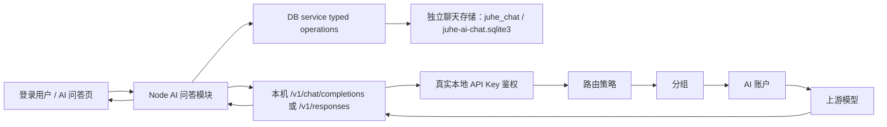

# AI 问答设计

> 本文定义 `juhe-ai` 第一版 AI 问答功能的目标架构、页面交互、接口、存储、流式协议、安全边界和验收口径。
> 当前状态：AI 问答 MVP 已完成；输入编辑器与模型内置工具能力进入 PLAN-0092 增量阶段。

## 1. 功能定位

AI 问答是登录用户使用自己 API Key 的平台内置客户端，不是第二套网关、第二套调度系统或独立 Agent 平台。聊天负责客户端体验，审计负责网关调用留痕，两者是相互独立的模块边界。

模型请求必须携带会话绑定的本地 API Key，重新进入现有 `/v1/chat/completions` 或 `/v1/responses` 网关入口，并继续遵守：

- `API Key -> 路由策略 -> 分组 -> AI 账户 -> 供应商 / 协议能力`。
- API Key 状态、过期、时间计划、额度和并发限制。
- 分组与账户调度、模型限制、代理、切号、错误处理和响应语义检查。
- 使用记录、计费、原始审计、来源 IP 和 trace 追踪。

AI 问答模块只新增登录用户会话、消息持久化、上下文组装、站内流式传输和前端展示，不复制网关调度与用量统计。从网关视角看，AI 问答就是一个使用真实 API Key 的普通 OpenAI Chat 客户端。

## 2. 已确认决策

| 事项 | 决策 |
| --- | --- |
| 后端范围 | 第一版只在现有 Node 后端实现，不等待 Go 迁移，也不为 Go 写兼容分支 |
| 模型协议 | 普通模型使用 Chat Completions；具备 Responses 能力的模型使用 `/v1/responses`，工具字段由网关透传 |
| API Key | 新建会话时选择当前用户自己的 API Key，会话创建后固定且不可更换 |
| 模型 | 每轮都可以切换，但只能选择该 API Key 当前可用模型 |
| 上下文 | 服务端管理，只使用最近滚动 7 天内的完整成功轮次 |
| 输入 | 使用 Tiptap 3 最小编辑器，支持 Markdown 文本、撤销/重做、图片粘贴预览和 `/` 命令入口 |
| 输出 | 支持安全 Markdown、列表、表格、代码块、LaTeX、Mermaid 和 HTTPS Markdown 图片 |
| 消息列表 | 必须使用支持动态高度的虚拟列表和游标分页 |
| 工具 | 不手写搜索、天气或 Shell；透传模型/上游原生 Responses tools，并展示工具事件 |
| 历史操作 | 第一版不支持编辑消息、分支、指定回答重新生成、分享或多人会话 |
| 数据模式 | standalone 使用独立 `juhe-ai-chat.sqlite3`，performance 使用独立 `juhe_chat` schema；两者使用同一业务契约 |
| 容量门禁 | 每个用户最近 7 天聊天正文默认最多 2 GiB；超限后禁止继续发送，但允许读取、停止和删除 |

## 3. MVP 范围

### 3.1 本次包含

- 用户侧菜单“AI 问答”和路由 `/my-chat`。
- 新建、查看、分页加载和删除自己的会话。
- 会话绑定自己的一个 API Key，绑定后不可更换。
- 按 API Key 获取可用模型，并允许每轮切换模型。
- Markdown 编辑、撤销/重做、图片粘贴预览、纯文本提问、流式回答、停止生成和中文错误提示。
- Responses 内置工具事件透传与工具过程展示；不在本模块执行未注册的本地工具。
- 最近 7 天消息存储、完整轮次上下文和后台有界清理。
- Markdown、GFM 列表 / 表格、代码高亮、LaTeX、Mermaid 和 HTTPS 图片展示。
- 动态高度虚拟列表、顶部加载历史、底部跟随和滚动位置保持。
- 幂等发送、同会话单生成、异常流恢复和 trace 关联。

### 3.2 本次不包含

- 图片资产上传、视觉问答、图片生成和生成产物下载；本阶段只做粘贴预览和资产协议占位。
- 文件附件、知识库、联网搜索、语音输入。
- MCP、Skill、站内 Function Tool、工具审批和工具执行 worker。
- system prompt、temperature、top_p 等高级模型参数的用户配置。
- 自动摘要、长期记忆和跨 7 天上下文。
- 消息编辑、消息分支、指定回答重新生成、会话分享、多人协作。
- 管理员读取其他用户聊天正文的管理页面或接口。
- Go 后端实现或 Node / Go 双写。

站内工具执行、MCP、Skill 和产物进入后续独立计划；模型原生工具事件使用当前聊天消息的结构化内容字段，不把第三方 Agent 运行时引入本项目。

## 4. 总体架构



### 4.1 进程边界

- DB service 的 System API 进程承载 AI 问答 HTTP / SSE 路由和本机网关流转发，以复用现有登录 session、权限和 SQLite 单写者边界。
- 主 Node Web 进程在通用 System API 代理之前为 `/my-chat` 挂载独立代理池，使用独立 128 路准入和 15 分钟流超时；聊天长连接不占用普通管理接口的 256 路 / 30 秒代理池。
- 主进程不直接读写数据库。登录会话校验、会话 CRUD、消息事务和清理全部通过 DB service typed operations 完成。
- DB service 不发起长时间模型请求，不持有上游 SSE。
- `ops-worker` 执行过期消息清理和异常 `streaming` 状态恢复；主 Web 进程不启动定时任务。

### 4.2 网关边界

- AI 问答是平台内置客户端；loopback HTTP 只是服务端代客户端发起请求的传输方式，不代表网关内部特权调用。
- Chat 模块从受控存储读取会话绑定 API Key 的完整密钥，仅在服务端内存中短暂使用。
- 前端只接触 API Key ID、名称、前后缀和状态，不接触完整密钥。
- 模型请求通过 loopback HTTP 调用当前主服务 `/v1/chat/completions`，不得直接调用供应商 Base URL。
- 内部请求仍使用真实 `Authorization: Bearer <本地 API Key>`，不得使用内部 identity 绕过网关鉴权。
- 网关是模型可用性、额度、路由、账户候选、代理和错误切换的最终裁决者；Chat 模块不重复实现或缓存第二套调度规则。
- 认证、额度、并发、调度、计费、使用记录、原始审计和错误处理与其他客户端完全一致；不得因请求来自 AI 问答而跳过或弱化其中任何环节。

## 5. 身份、权限与 API Key

### 5.1 登录身份

- 所有 `/__aisys__/api/my-chat/*` 接口使用现有登录 Cookie。
- 主进程通过 DB service 的窄 typed operation 校验登录 session，得到当前 `systemAccountId` 和角色摘要。
- 所有 repository 操作都必须显式携带当前 `systemAccountId`，不能只凭会话 ID 查询。
- `admin` 和 `super_admin` 在 AI 问答页面也只操作自己的会话，不获得跨用户读取能力。

### 5.2 API Key 规则

- 会话只能绑定当前登录用户拥有、已启用且未过期的 API Key。
- 创建会话时保存 `api_key_id` 和 `api_key_name_snapshot`。
- 会话创建后不支持更换 API Key；需要更换时新建会话。
- API Key 改名后列表可以显示当前名称；Key 被删除后回退显示名称快照。
- API Key 停用、过期、额度耗尽、路由不可用或被删除时，历史消息仍可读，但不能继续发送。
- API Key 刷新密钥但 ID 不变时，会话继续使用刷新后的当前密钥。

### 5.3 模型规则

- 模型下拉数据来自该 API Key 进入本地 `/v1/models` 后的实际结果。
- 模型可以逐轮切换，`chat_conversations.last_model` 只用于恢复界面最近选择，不锁定会话模型。
- 发送时由网关对模型、路由策略和候选账户做最终校验；Chat 模块不维护第二份长期模型缓存。
- 模型已下线或当前路由不能承接时返回网关错误，不悄悄换成其他模型。

## 6. 用户体验与页面设计

### 6.1 页面布局

桌面端使用左侧会话栏和右侧对话区；移动端会话列表进入抽屉。页面是工作台，不增加营销式说明区或嵌套卡片。

```text
┌───────────────┬────────────────────────────────────┐
│ 新建对话       │ API Key：工作 Key   模型：gpt-xxx │
│               ├────────────────────────────────────┤
│ 今天           │                                    │
│ 会话 A         │        动态高度虚拟消息列表          │
│ 会话 B         │                                    │
│               │                                    │
│ 更早           ├────────────────────────────────────┤
│ 会话 C         │ 输入消息                 停止 / 发送 │
└───────────────┴────────────────────────────────────┘
```

### 6.2 新建会话

1. 用户点击“新建对话”，前端创建本地草稿，不立即写数据库。
2. 用户选择自己的 API Key；没有可用 Key 时提供进入“我的 API Key”的明确入口。
3. 前端读取该 Key 的模型列表并选择模型。
4. 用户第一次发送时，先创建会话，再提交消息流请求。
5. 如果会话已创建但消息请求未到达，后台清理超过 24 小时且没有消息的空会话。

### 6.3 发送与停止

- `Enter` 发送，`Shift + Enter` 换行；输入法组合输入期间不得误发送。
- 发送后立即显示本地用户消息和助手生成中状态。
- 同一会话生成期间禁用再次发送，但允许切换到其他会话并在其他会话发送。
- 点击停止时调用当前 `fetch` 的 `AbortController.abort()`，不增加单独 stop 接口。
- 浏览器主动取消后，页面立即显示“已停止”；服务端保存已接收部分并标记 `canceled`。

### 6.4 会话列表

- 按 `last_message_at DESC, id DESC` 稳定排序。
- 会话标题取第一条仍在保留期内的用户消息首个非空行，去除控制字符并压缩空白，最多 60 个字符。
- 列表按“今天 / 近 7 天 / 更早”仅做前端展示分组，不改变后端分页口径。
- 删除会话需要二次确认；删除聊天表中的会话和消息，不删除 API Key、使用记录或原始审计。

## 7. 前端虚拟列表

### 7.1 选型

MVP 使用 `@tanstack/vue-virtual`，不直接复制 `F:\go-project\go-ee-work-tool` 的完整自研 `DynamicVirtualList`。

参考项目可借鉴：

- 动态高度测量和稳定 item key。
- 流式消息增长时的底部锚定。
- prepend 历史后的可见位置恢复。
- 未闭合 Markdown 尾部稳定化和异步渲染序号。
- Markdown、表格、代码、LaTeX、Mermaid 的样式与回归用例。

不直接复制的原因：

- 参考组件与原项目滚动容器、Agent 消息类型和大量内部工具状态耦合。
- 第一版没有 Agent、工具卡片、Tiptap 编辑器和复杂消息分段需求。
- 引入成熟虚拟化库能缩小维护面，但仍需为聊天动态高度补自己的锚定控制。

### 7.2 行为约束

- 每条消息使用稳定 `messageId` 作为虚拟项 key。
- 使用 `ResizeObserver` 测量 Markdown、图片、KaTeX 和 Mermaid 异步渲染后的真实高度。
- 只重新测量发生变化的流式助手消息，不重建全部列表。
- 流式 delta 先进入内存 buffer，按动画帧或约 50ms 合批更新 Vue 状态。
- Markdown 渲染按约 100ms 节流；消息完成后立即做一次最终渲染。
- 用户位于底部容差范围内时自动跟随；主动向上滚动后停止抢占滚动，并显示“回到底部”图标按钮。
- 顶部加载前记录首个可见 `messageId` 和像素偏移，prepend 后恢复锚点。
- 历史消息使用 `beforeSequenceNo` 游标分页，不能一次加载最近 7 天全部消息。
- 首屏默认读取最新 30 条，单页最大 50 条，虚拟列表 overscan 保持有界。

## 8. 富文本渲染

### 8.1 依赖

- `marked`：Markdown 与 GFM 基础解析。
- `DOMPurify`：最终 HTML 清洗。
- `highlight.js`：常用代码语言高亮，按需注册语言。
- `katex`：行内和块级 LaTeX。
- `mermaid`：流程图、时序图等图表。
- `@tiptap/core`、`@tiptap/vue-3`：输入编辑器内核和 Vue 绑定。
- Tiptap 最小扩展集：StarterKit、History、Placeholder、CharacterCount、Image、自定义附件节点和 Suggestion。

不引入 LangChain、Mastra、完整 Chat 平台或 Agent UI 运行时。Tiptap 只负责编辑状态，不负责模型调用、工具执行或会话持久化。

### 8.2 支持范围

- 标题、段落、粗体、斜体、删除线、引用和水平线。
- 有序列表、无序列表、任务列表和表格。
- 行内代码、围栏代码块、语言标识、高亮、复制和自动换行开关。
- 行内与块级 LaTeX。
- Mermaid 流程图、时序图、状态图等 Mermaid 自身支持的安全图表。
- HTTPS Markdown 图片、懒加载、预览和加载失败占位。

### 8.3 流式稳定化

- 未闭合代码围栏、LaTeX 块、链接或 Mermaid 围栏不做破坏性猜测。
- Mermaid 只在代码围栏闭合或消息终态后渲染；生成中显示源码占位。
- 每次异步渲染携带递增序号，旧任务完成后不得覆盖新文本的结果。
- 渲染失败回退为已转义的纯文本或源码，不显示空白消息。

### 8.4 安全策略

- Markdown 原始 HTML 不作为可信内容，最终输出始终经过 DOMPurify。
- 链接只允许 `http`、`https` 和 `mailto`，外链使用新窗口并附加 `noopener noreferrer`。
- 图片只允许 HTTPS，设置 `loading=lazy`、`decoding=async` 和 `referrerpolicy=no-referrer`。

### 8.5 AIComposer 编辑器

输入区改为独立 `AIComposer.vue`，不再继续扩展 `a-textarea`。编辑器使用 Tiptap 3 / ProseMirror 的事务和历史栈，业务层只维护聊天需要的内容投影。

- `Enter` 发送，`Shift+Enter` 换行；输入法组合状态期间不发送。
- 撤销、重做、选区、粘贴和拖放由编辑器内核处理。
- 文本以 Markdown 语义输入；图片粘贴先生成受限本地预览节点，不把 Data URL 写入聊天正文。
- `/` 触发命令建议菜单；第一阶段命令只产生结构化输入意图，不执行本地命令。
- 发送前保存 Tiptap JSON 快照；发送成功清空编辑器，失败恢复快照，停止生成不恢复已经提交的用户消息。
- 编辑器输出转换为 `input_text` / `input_image` 内容块；纯文本请求仍可降级为现有 `content` 字段。

### 8.6 模型原生工具协议

- 发送前根据 API Key 对应模型能力选择 Chat Completions 或 Responses；不能仅根据模型名称猜测能力。
- Responses 请求保留上游支持的 `tools`、`tool_choice`、`parallel_tool_calls` 等字段，由网关做协议适配和安全校验。
- Chat 模块解析 `response.output_item.added`、`response.function_call_arguments.delta`、`response.output_text.delta`、`response.completed` 等事件，并将工具过程投影为消息时间线中的 `tool_call` / `tool_result` 内容块。
- 上游自行执行的内置工具只展示状态和结果；Chat 模块不重复执行、不伪造工具结果。
- 模型要求本地未注册的 function tool 时，返回明确的“不支持此工具”状态并结束本轮，不能静默当作普通文本。
- 工具调用参数、结果和错误均有字节上限、超时和审计 trace；不得把工具原始 JSON 无界写入 SSE 或聊天正文。
- 禁止 `javascript:`、`data:`、`file:`、iframe、表单、事件属性和任意外部 SVG。
- Mermaid 使用严格安全模式；生成 SVG 再经过允许 SVG profile 的清洗。
- 表格、代码和长公式在窄屏横向滚动，不能撑破消息列。
- 外部图片即使不带 referrer 仍会向图片服务器暴露用户出口 IP；MVP 文档明确该边界，不把 7 天保留承诺解释为网络匿名。

## 9. 后端模块划分

```text
backend/src/modules/ai-chat/
  ai-chat.routes.ts
  ai-chat.schemas.ts
  ai-chat.types.ts
  ai-chat-auth.middleware.ts
  conversation.service.ts
  message.service.ts
  context-builder.service.ts
  gateway-chat-client.service.ts
  gateway-chat-stream-parser.ts
  chat-stream.service.ts
  internal-gateway-metadata.ts
  chat-error-mapper.ts

backend/src/storage/
  ai-chat.repository.ts
  ai-chat-mappers.ts
```

职责边界：

- routes：HTTP 参数、登录态、SSE 生命周期和错误返回。
- conversation service：会话创建、列表、删除、归属和 API Key 固定规则。
- message service：消息事务、幂等、同会话并发和终态转换。
- context builder：7 天、完整轮次、数量上限和模型预算。
- gateway client：只调用本机 `/v1/models` 和 `/v1/chat/completions`。
- stream parser：解析 OpenAI Chat SSE 的跨 chunk UTF-8、事件和 `[DONE]`。
- stream service：转换内部事件、合批文本、取消和最终落库。
- repository：只通过 DB service typed operations 暴露有界读写。

## 10. API 契约

所有接口位于 `/__aisys__/api/my-chat`，只操作当前登录用户数据。成功响应继续遵循当前 System API `{ data, message? }` 包装；流式发送接口除外。

### 10.1 API Key 选项

```http
GET /__aisys__/api/my-chat/api-keys/options?query=...&cursor=...&limit=30
```

- 只返回当前用户已启用、未过期且未业务删除的 API Key 摘要；额度和路由运行态仍在发送时由网关最终校验。
- 支持名称搜索和游标分页，最大 50 条。
- 返回 `id`、`name`、状态、过期摘要、前后缀和是否当前可发送。
- 不返回完整密钥。

使用独立轻量 options 接口，不让页面为了一个选择器分页拉取完整“我的 API Key”管理列表。

### 10.2 可用模型

```http
GET /__aisys__/api/my-chat/api-keys/:apiKeyId/models
```

1. 校验 API Key 属于当前用户。
2. 服务端读取完整本地 API Key。
3. 使用真实 Bearer Key 调用本机 `/v1/models`。
4. 只返回模型 `id` 和必要展示摘要。
5. 不把完整 Key 返回前端。

### 10.3 创建会话

```http
POST /__aisys__/api/my-chat/conversations
Content-Type: application/json

{
  "apiKeyId": "key_xxx"
}
```

返回会话 ID、标题“新对话”、API Key 摘要和空 `lastModel`。会话创建后不提供修改 API Key 接口。

### 10.4 会话列表

```http
GET /__aisys__/api/my-chat/conversations?cursor=...&limit=30
```

- 游标由 `(last_message_at, id)` 组成。
- 默认 30，最大 50。
- 只返回摘要，不携带消息正文集合。
- 只查当前 `systemAccountId`。

### 10.5 消息列表

```http
GET /__aisys__/api/my-chat/conversations/:id/messages?beforeSequenceNo=120&limit=30
```

- 默认从最新消息向前读取。
- 返回前按 `sequenceNo ASC` 排列。
- 默认 30，最大 50。
- 已过期并清理的消息不可恢复。

### 10.6 发送消息

```http
POST /__aisys__/api/my-chat/conversations/:id/messages
Accept: text/event-stream
Content-Type: application/json

{
  "clientMessageId": "client_uuid",
  "model": "gpt-xxx",
  "content": "用户问题"
}
```

- `clientMessageId` 由前端生成，用于防止重复点击和网络重试。
- `content` 必须是非空纯文本，UTF-8 正文最大 `192 KiB`。
- System API JSON 总上限继续为 `256 KiB`。
- 同一会话同时只允许一个生成任务。

### 10.7 删除会话

```http
DELETE /__aisys__/api/my-chat/conversations/:id
```

幂等返回 `204`。只删除聊天业务表数据，不删除网关使用记录和原始审计数据。

## 11. 内部 SSE 协议

页面不直接依赖上游 OpenAI SSE，而是读取稳定的站内事件。

### 11.1 事件

```text
event: message.started
data: {"conversationId":"chat_xxx","turnId":"turn_xxx","userMessageId":"msg_xxx","assistantMessageId":"msg_xxx","traceId":"trace_xxx","model":"gpt-xxx"}

event: message.delta
data: {"messageId":"msg_xxx","delta":"新增文本"}

event: message.completed
data: {"messageId":"msg_xxx","finishReason":"stop","traceId":"trace_xxx"}

event: message.failed
data: {"messageId":"msg_xxx","code":"gateway_unavailable","message":"当前没有可用的 AI 账户，请稍后重试","retryable":true}
```

- 每 15 秒发送 SSE comment heartbeat。
- 只有收到网关 `[DONE]` 才判定正常完成。
- HTTP 正常关闭但没有 `[DONE]` 仍按流中断处理。
- 用户主动取消后浏览器连接已经关闭，不依赖 `message.canceled` 送达；服务端落库状态为 `canceled`，页面刷新后以存储状态为准。
- 不把上游堆栈、内部 URL、账号凭据或完整内部错误返回前端。

### 11.2 解析要求

- 正确处理 SSE 数据跨 TCP chunk。
- 使用流式 `TextDecoder` 处理 UTF-8 汉字在字节中间切分。
- 支持多行 `data:` 和 comment heartbeat。
- 识别 `[DONE]`、`finish_reason`、流内错误和无终止事件断流。
- 解析器设置事件数、单事件和累计正文上限，禁止无界拼接。

## 12. 数据模型与存储拓扑

MVP 只新增会话、消息、发送幂等登记和紧凑容量窗口四类聊天数据，不新增附件、产物、工具执行或消息内容块表。聊天正文属于高增长、短保留数据，不能继续放入 `juhe_business`：

- standalone：新增独立 `juhe-ai-chat.sqlite3`，由 DB service 维持单写者边界；不得因为上线重建其他非业务数据库。
- performance：在现有 PostgreSQL 集群新增独立 `juhe_chat` schema；会话元数据使用普通表，消息事实表按 UTC `created_at` 日分区。
- Redis 只承担短期取消信号、SSE 协调或瞬时门禁，不保存聊天正文，也不是会话事实来源。
- 聊天与业务库保持逻辑隔离，但 `system_account_id`、`api_key_id` 仍引用现有业务身份语义；跨库关联由受控 repository 查询完成，不在聊天请求路径扫描业务表。
- 100 用户、每用户每月约 1 GiB 的估算下，7 天原始正文约 23 GiB；连同索引、WAL、膨胀和增长余量，生产磁盘按 60–80 GiB 起步并设置 70%/85% 容量告警。

### 12.1 `chat_conversations`

| 字段 | 规则 |
| --- | --- |
| `id` | 会话 ID |
| `system_account_id` | 所属登录用户，非空 |
| `api_key_id` | 当前 API Key；Key 删除后置空 |
| `api_key_name_snapshot` | Key 删除或改名后的历史展示兜底，非敏感 |
| `title` | 当前标题，默认“新对话” |
| `title_source_message_id` | 当前标题来源用户消息，可空 |
| `last_model` | 最近一次已接受发送所选模型，可空 |
| `next_sequence_no` | 下一消息序号，默认 1 |
| `active_turn_id` | 当前生成轮次；空表示无生成任务 |
| `active_started_at` | 当前生成开始时间，用于崩溃恢复 |
| `last_message_at` | 稳定列表排序时间 |
| `created_at`、`updated_at` | UTC 时间 |

索引：

- `(system_account_id, last_message_at DESC, id DESC)`。
- `(system_account_id, api_key_id)`。
- `(active_started_at, id)`，用于恢复异常流。

PostgreSQL 中 `chat_conversations` 不分区；它是小型元数据表。会话没有保留期内消息且没有活动轮次后才删除。

### 12.2 `chat_messages`

| 字段 | 规则 |
| --- | --- |
| `id` | 消息 ID |
| `conversation_id` | 所属会话 |
| `system_account_id` | 冗余用户隔离字段，非空 |
| `turn_id` | 一次用户提问与助手回答共享的轮次 ID |
| `sequence_no` | 会话内稳定顺序 |
| `client_message_id` | 仅用户消息非空，用于发送幂等；助手消息为空 |
| `role` | 仅 `user`、`assistant` |
| `status` | `completed`、`streaming`、`failed`、`canceled` |
| `content_text` | 纯文本 Markdown；不保存渲染 HTML |
| `model` | 本轮实际请求模型 |
| `trace_id` | 关联网关使用记录和审计 |
| `finish_reason` | 正常完成原因，可空 |
| `error_code` | 失败摘要码，可空 |
| `created_at`、`completed_at` | UTC 时间 |
| `content_bytes` | `content_text` 的 UTF-8 字节数，用于容量窗口增量维护 |
| `expires_at` | 创建时间加 7 天 |

约束和索引：

- `(conversation_id, sequence_no DESC)`。
- `(conversation_id, turn_id)`。
- `(expires_at, id)`。
- `role=user` 时 `client_message_id` 非空且状态只能是 `completed`；`role=assistant` 时 `client_message_id` 为空。
- 同一轮用户和助手占位消息在同一事务中使用相同 `created_at` 与 `expires_at`，保证保留窗口一致。

PostgreSQL 约束：

- `chat_messages` 按 UTC `created_at` 创建每日 range partition，写入前确保当天和下一天分区存在。
- 主键包含分区键；PostgreSQL 不能在日分区表上直接建立不含分区键的跨分区唯一约束，因此会话序号由锁定 `chat_conversations` 后原子分配，发送幂等由非分区登记表保证。
- 清理时先直接 drop 已完全早于 7 天窗口的日分区；最老的部分重叠分区再按 `(expires_at, id)` 游标小批删除，保证精确滚动 `7 × 24` 小时。
- SQLite 不模拟分区，使用 `(expires_at, id)` 覆盖索引和固定小批删除；不能在线执行阻塞式全库 `VACUUM`。

### 12.3 `chat_message_idempotency`

这是小型、非分区登记表，只保存幂等键和消息定位，不保存正文：

| 字段 | 规则 |
| --- | --- |
| `conversation_id`、`client_message_id` | 联合主键 |
| `system_account_id` | 用户隔离字段 |
| `turn_id`、`user_message_id`、`assistant_message_id` | 已创建轮次定位 |
| `created_at`、`expires_at` | 与轮次保留窗口一致 |

- 接受发送时先锁定会话，再插入幂等登记和两条消息；冲突时返回已有轮次，不再次调用网关。
- 清理完整轮次时同步删除登记；兜底任务按 `(expires_at, conversation_id, client_message_id)` 小批删除孤立过期登记。
- SQLite 使用同一契约和联合主键。

### 12.4 `chat_user_storage_windows`

容量门禁使用按用户、按 UTC 日的紧凑窗口表，不在发送请求中实时 `SUM(chat_messages)`：

| 字段 | 规则 |
| --- | --- |
| `system_account_id` | 用户 ID |
| `bucket_date` | UTC 日期 |
| `content_bytes` | 当日已持久化聊天正文 UTF-8 字节数 |
| `updated_at` | UTC 时间 |

- 主键 `(system_account_id, bucket_date)`。
- 消息最终落库、取消、失败截断和删除时在同一 DB service 事务内增量调整对应窗口。
- 发送门禁只读取当前用户最近 7 个日桶，最多 8 行，默认硬上限 `2 GiB`；不扫描消息明细。
- 超限返回 `409 chat_storage_quota_exceeded`，允许用户继续读取、停止生成和删除会话；清理或删除释放容量后可继续发送。
- 用户估算明显偏离时再通过系统设置调整上限；MVP 不做按租户分库分表和复杂计费套餐。

不保存 token、成本、命中账户或分组快照，这些事实继续由网关使用记录维护，聊天消息只通过 `trace_id` 关联。

## 13. 消息事务、幂等与并发

### 13.1 一次发送

1. 校验登录用户、会话归属、API Key 当前状态和输入大小。
2. 在 DB service 单个事务中检查 `active_turn_id` 和 `clientMessageId`。
3. 分配两个连续 `sequence_no`，写入已完成用户消息和 `streaming` 助手占位消息。
4. 设置会话 `active_turn_id`、`active_started_at`、`last_model` 和 `last_message_at`。
5. 按完整成功轮次组装上下文。
6. 使用绑定的真实 API Key 调用本机网关。
7. delta 在内存中有界合批并向页面流式发送，不按 token 写数据库。
8. 正常结束时一次更新助手消息为 `completed` 并清除 `active_turn_id`。
9. 用户停止时保存已收到正文为 `canceled`，清除 `active_turn_id`。
10. 失败时保存有界部分正文和错误码为 `failed`，清除 `active_turn_id`。

### 13.2 幂等

- 同会话同 `clientMessageId` 只允许产生一个用户消息和一次网关请求。
- 重复请求不自动重新调用模型，返回 `409 chat_message_already_exists` 和已有轮次摘要，前端重新读取消息。
- 原请求仍在生成时返回 `409 chat_message_in_progress`。
- 不同会话允许并发，最终仍受 API Key 和网关并发限制。

### 13.3 崩溃恢复

- `ops-worker` 扫描超过“网关最大响应时限 + 宽限时间”的 `active_started_at`。
- 对应助手消息改为 `failed`，错误码 `stream_interrupted`，并清除会话活动轮次。
- 恢复操作按游标和固定小批执行，必须幂等。
- 页面刷新不尝试恢复原 SSE，也不自动重发可能已经计费的请求。

## 14. 上下文组装

### 14.1 完整轮次

上下文的最小单位是一个完整成功轮次，而不是单条 `status=completed` 消息。

一个轮次只有同时满足以下条件才可进入下一次模型请求：

- 同一 `turn_id` 存在一条 `role=user,status=completed` 消息。
- 同一 `turn_id` 存在一条 `role=assistant,status=completed` 消息。
- 两条消息都未过期。

因此助手失败或取消后，虽然用户问题可以在页面回看，但该用户问题不会孤立进入下一轮上下文。

### 14.2 有界查询

- 只查当前 `system_account_id` 和当前 `conversation_id`。
- 只查 `expires_at > now` 的完整成功轮次。
- 从最新向前最多读取 64 个完整轮次、128 条消息。
- 查询必须使用会话、状态、时间和数量上限，不能读取整个保留窗口后再在内存截断。
- 结果从旧到新还原为 OpenAI Chat `messages`。
- 当前用户问题始终保留，不计入历史轮次数量。

### 14.3 Token 预算

每轮按当前选择模型重新计算预算：

```text
可用历史输入预算 = min(
  64K MVP 历史上限,
  模型上下文窗口 - 输出预留 - 协议安全空间 - 当前问题估算
)
```

- 上下文窗口从本地模型目录元数据读取，不从标准 `/v1/models` 响应猜测。
- 模型元数据未知时采用保守 16K 总输入预算。
- 输出最多预留 8K token，并额外保留 4K 协议安全空间。
- MVP 使用保守 UTF-8 字节估算并留安全余量，不引入按供应商维护的重型 tokenizer。
- 超出预算时只从最旧完整轮次开始删除，不能留下半轮消息。
- 第一版不自动摘要，避免额外模型调用和跨 7 天内容延续。

## 15. 7 天保留与审计边界

### 15.1 聊天数据保留

聊天窗口固定定义为滚动 `7 × 24` 小时，数据库统一使用 UTC。

- 每条聊天消息 `expires_at = created_at + 7 天`。
- 活跃会话可以持续超过 7 天，但页面和模型只能读取仍在保留期内的消息。
- 标题来源消息过期后，从仍保留的最早用户消息重新生成标题。
- 会话已无消息时删除会话。
- 没有消息的空会话超过 24 小时后删除。
- 手动删除会话立即删除聊天表中的会话和消息。
- PostgreSQL 先 drop 完全过期的日分区，再对部分重叠的最老分区按 `(expires_at, id)` 游标选择到期候选；SQLite 直接按同一游标固定小批推进。删除按候选 `turn_id` 成对执行，禁止全表读入内存，也不能在批次边界留下孤立的一问或一答。

### 15.2 聊天与审计相互独立

聊天 7 天规则只约束 `chat_conversations`、`chat_messages`、容量窗口、页面历史和后续模型上下文，不自动改变现有网关原始审计策略。

- 聊天模块按客户端身份使用网关；审计模块按网关统一规则记录该客户端调用。
- AI 问答请求仍按普通网关请求记录使用记录和原始审计。
- 删除会话或消息不会级联删除使用记录、原始审计和计费事实。
- 不增加“内部请求可关闭审计正文”的签名开关，避免形成能绕过当前审计保全政策的特殊通道。
- 如果未来产品要承诺“7 天后任何位置都不存在对话正文”，必须单独修改 [安全与日志策略](安全与日志策略.md) 和 [原始审计日志设计](原始审计日志设计.md)，并明确合规、排障和保全代价。

这是对原会话方案的重要修正：不能仅凭聊天上下文保留期，暗中改变全局审计规则。

## 16. 内置客户端来源边界

MVP 不新增内部来源 header、HMAC 签名或 `trafficSource=ai_chat`，避免让来源标记误入现有网关调度语义。Chat 模块只使用会话绑定的真实 Bearer API Key 调用 loopback 网关，因此鉴权、额度、限流、调度、计费、使用记录与审计均按普通客户端执行。

- 网关网络层看到的请求来源是 loopback；MVP 不把浏览器原始 IP 写入网关调用事实。
- 登录用户归属由 Chat repository 的 `system_account_id` 和真实 API Key 所有权保证，不能由客户端 header 覆盖。
- 后续确需区分站内问答时，应新增独立的“客户端来源”事实字段，不能复用会影响路由分支的 `trafficSource`，并需单独设计防伪与审计契约。

## 17. 错误、重试与取消

| HTTP / 事件 | 页面文案 | 是否可重试 |
| --- | --- | --- |
| `400` | 消息或模型参数无效 | 修正后可重试 |
| `401` | 当前 API Key 已失效 | 更换新会话或修复 Key |
| `403` | 无权使用该 API Key 或模型 | 否 |
| `404` | 会话不存在或历史已过期 | 否 |
| `409` | 当前会话正在生成，或本条消息已经提交 | 刷新状态 |
| `413` | 消息内容过长 | 缩短后重试 |
| `429` | 已达到额度、频率或并发限制 | 稍后或调整额度 |
| `503` | 当前没有可用的 AI 账户 | 稍后重试 |
| `504` | 模型响应超时 | 可人工重试 |

- 网关已经负责建流前的安全切号和路由回退，Chat 模块不重复重试模型请求。
- 一旦已有可见输出，Chat 模块绝不自动重新提交请求，避免重复回答和重复计费。
- 用户人工重新发送会创建新轮次，不覆盖失败轮次。
- `finish_reason=length` 显示“回答达到长度限制”。
- 内容策略终止显示明确中文状态，但不暴露上游敏感正文。

## 18. 性能与容量边界

- 用户输入和单条助手正文都设置 `192 KiB` 上限；超过上限主动中断并保存明确错误。
- 网关流解析、页面 delta buffer 和最终消息 buffer 都必须有累计字节上限。
- 消息列表只用游标分页和虚拟化，不支持深 offset 或整会话加载。
- Chat API 不扫描使用记录做统计；成本、Token 和账户命中继续读取现有预聚合或使用记录页面。
- 清理 worker 每批最多 1000 条过期消息，并限制每轮批次数；涉及会话标题重算时按本批去重会话 ID 批量处理，避免逐消息 N+1。
- 容量判断只读取 `chat_user_storage_windows` 最近 7 个日桶；禁止请求路径对消息表执行 `SUM`、`COUNT` 或全会话正文累计。
- 100 用户规模不做分库分表；当聊天物理数据持续达到 200–300 GiB，或聊天 I/O 已影响业务 schema 延迟时，优先迁移到独立 PostgreSQL database / cluster，再评估按 `system_account_id` 哈希分片。
- AI 问答路由加载 KaTeX；Mermaid 仅在消息实际包含图表时动态加载。其他业务路由不加载两者。
- 代码高亮只注册常用语言，未知语言按纯文本代码块展示。

## 19. 验证矩阵

### 19.1 后端与存储

- 用户只能读取、发送和删除自己的会话。
- 管理角色使用个人接口时也不能读取他人会话。
- 会话创建后不能修改 API Key；Key 删除后历史只读。
- Key 停用、过期、额度耗尽和路由不可用时不能继续发送。
- 同一 `clientMessageId` 不产生第二次网关请求。
- 同会话并发发送返回 `409`，不同会话允许并发。
- SQLite standalone 与 PostgreSQL performance 使用相同契约。
- 查询只读取最近 7 天、最多 64 个完整轮次。
- 失败、取消和崩溃遗留轮次不进入上下文。
- 清理按索引和游标推进，活跃会话只保留窗口内消息。

### 19.2 网关链路

- 使用真实本地 API Key 进入 `/v1/models` 和 `/v1/chat/completions`。
- API Key 对应路由策略、分组和账户命中正常。
- 模型逐轮切换不改变会话 API Key 和网关调度边界。
- 账户代理、错误切换、额度、并发和响应检查继续生效。
- 使用记录包含正确用户、Key、分组、账户、模型、trace 和 `ai_chat` 来源。
- Chat 模块不存在直接请求公共上游的代码路径。
- 外部请求伪造内部 IP / trace 元数据不会被网关采信。

### 19.3 流式

- SSE 数据跨 chunk、多行 `data:` 和 UTF-8 中间切分。
- 正常 `[DONE]`、缺少 `[DONE]`、建流前 JSON 错误和建流后中断。
- 用户主动停止、客户端断网和主进程异常退出。
- `finish_reason=length`、429、503、504 和流内错误。
- 部分输出后不会自动重放。
- 助手消息正文达到上限时有界终止，不无限占用内存。

### 19.4 前端

- Markdown 标题、列表、任务列表、表格、引用、链接、代码复制。
- 行内 / 块级 LaTeX、Mermaid 成功与错误回退、HTTPS 图片失败占位。
- `script`、事件属性、`javascript:`、恶意 SVG 和 Mermaid 安全用例。
- 未闭合围栏、公式、链接和表格的流式状态不闪空或破坏布局。
- 至少 5000 条合成消息时 DOM 只保留可视窗口附近节点。
- 文本、代码、表格、图片、Mermaid 混合动态高度不重叠。
- 用户在底部时跟随，向上阅读时不抢滚动，prepend 历史后不跳动。
- 移动端抽屉、输入区和长内容不遮挡、不溢出。
- 所有业务提示、空态和错误文案保持中文。

## 20. 实施顺序

1. 固定表结构、API、SSE、权限、7 天保留和容量门禁规则。
2. 实现 business schema、PostgreSQL schema、repository 和 DB service typed operations。
3. 实现会话 CRUD、消息事务、幂等、上下文和清理恢复任务。
4. 实现主进程 Chat Router、本机网关 client、内部元数据签名和 SSE 解析。
5. 实现会话列表、Key / 模型选择、输入、发送、停止和普通文本流式展示。
6. 实现 Markdown、代码、KaTeX、Mermaid、图片和动态虚拟列表。
7. 完成 Mock AI、SQLite、PostgreSQL、网关使用记录、安全和浏览器验收。

## 21. 后续规划

### 第二版：多模态输入

- 图片上传与视觉问答。
- 同源图片资产、预览、下载和生命周期。
- 按当前最优模型升级消息内容结构，不在 MVP 预埋空字段。

### 第三版：受控工具

- 服务端工具循环和明确的工具调用状态。
- 一个受控图片生成工具及产物下载。
- 工具审批、超时、大小限制、审计和失败恢复。

### 第四版：MCP 与 Skill

- 使用官方 MCP SDK 接入服务端 MCP Client。
- Skill 注册、版本、启停、允许工具范围和凭据引用。
- 独立工具执行 worker 或沙箱。
- 工具产物存储、下载和清理。

无论后续增加什么能力，模型调用仍必须携带会话绑定的本地 API Key 进入现有网关；工具运行时不能直接替代网关连接模型供应商。

## 22. 设计复核结论

原会话总体方向可行，但以下细节已在本文修正：

1. 7 天聊天保留不等于修改全局审计保全；MVP 不增加关闭审计正文的内部特权。
2. 上下文按完整成功轮次筛选，不按单条 `completed` 消息筛选。
3. MVP 只保存纯文本 Markdown，不为 MCP、Skill 和附件提前设计版本化内容块。
4. API Key 选择使用独立轻量 options 接口，不拉完整管理列表充当下拉数据。
5. 新建对话先保留为前端草稿，第一次发送才持久化，降低空会话垃圾。
6. 用户取消后不依赖已经断开的 SSE 再收到 canceled 事件，页面和存储各自收敛状态。
7. System API 进程承载流式模型请求并维持 SQLite 单写者；主进程使用独立聊天代理池隔离长连接，避免占用普通 System API 准入槽。
8. AI 问答明确作为平台内置客户端接入网关，聊天数据生命周期与网关审计生命周期各自独立。
9. 高频聊天正文从业务库拆出：standalone 使用独立 SQLite，performance 使用独立 `juhe_chat` schema 和 PostgreSQL 日分区。
10. 每用户最近 7 天默认 2 GiB 容量门禁由日窗口增量维护；超限不阻断读取、停止与删除。

以上修正不改变用户确认的产品方向，只移除会造成安全例外、孤立上下文、重复体系或不必要预设计的实现风险。
