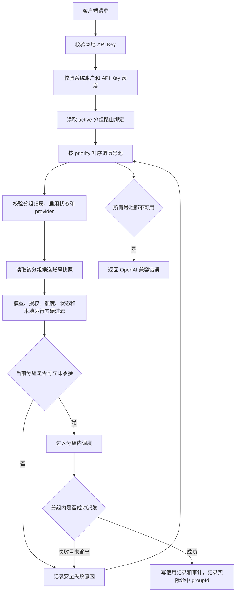

# API Key 多分组路由设计

> 本文定义一个 API Key 绑定多个分组号池后的路由、故障切换、存储、接口和前端规则。
> 目标是让调用方继续只使用一个本地 API Key，在首选分组不可承接时自动切到后续分组，而不是让用户手动切换 Key 或 Base URL。

## 背景

当前 API Key 只能绑定一个分组。这个模型足够轻量，但在实际使用中有两个问题：

- 一个分组就是一个号池；首选号池暂时不可用、全部账号繁忙、模型不匹配或授权账户失效时，调用方只能失败，不能自动尝试备用号池。
- 用户需要把多个号池挂到同一个 Key 下，并按优先级表达“先用 A，A 不行再用 B，再不行用 C”。

新增能力应保持现有边界：

- API Key 仍是客户端入口、调用方身份和额度边界。
- 分组仍是账号池和分组内调度边界。
- 多分组能力只解决“先选择哪个分组号池”，不把多个分组里的账号打散成一个全局大池。

## 概念定义

| 概念 | 定义 |
| --- | --- |
| API Key | 对外访问凭据，决定调用方系统账户、Key 状态、Key 额度和审计归属 |
| 号池 | 一个分组内的账户集合，包含自有账户和已经加入该用户本地分组的授权账户 |
| 分组路由绑定 | API Key 与某个本地分组之间的候选关系，包含优先级和启停状态 |
| 分组路由 | 网关在多个绑定号池之间按优先级选择一个可承接分组 |
| 分组内调度 | 选定分组后，继续使用个人分组或高并发分组已有账号调度逻辑 |

第一版固定采用“优先级故障切换”：

- 不做跨分组负载均衡。
- 不把 A 分组和 B 分组账号混排。
- 只有当前优先级分组无法承接本次请求时，才尝试下一优先级分组。

## 核心规则

- 一个 API Key 可以绑定一个或多个调用方自己的本地分组。
- 绑定的分组必须全部属于 API Key 所属系统账户；管理员代某个用户维护 Key 时，也只能绑定该被管理用户自己的分组。
- 授权方的分组不能直接作为被授权方 API Key 的号池；被授权账户必须先进入调用方自己的本地分组，再由该本地分组参与 Key 路由。
- 第一版要求同一个 API Key 下所有绑定分组的 `provider_code` 一致。当前只有 OpenAI 供应商，但先把规则固定下来，避免未来多供应商时同一个 Key 的 `/models`、路径能力和错误语义变得含糊。
- 至少保留一个 `active` 绑定。前端和后端都要阻止移除或停用最后一个 active 号池。
- 优先级数字越小越靠前，建议 UI 展示为“主号池、备 1、备 2”。同一个 API Key 下 active 绑定的优先级必须唯一；保存时后端可以归一化为 `1, 2, 3...`。
- disabled 绑定只作为配置保留和列表展示，不参与网关路由。
- API Key 的美元成本额度在所有绑定号池之间共享，不因绑定多个分组而拆成多份额度。

## 混合分组专项规则

这里的“混合”必须拆开判断，不能笼统允许或禁止。

| 混合类型 | 第一版规则 | 处理方式 |
| --- | --- | --- |
| 跨供应商混合 | 禁止 | 同一个 API Key 下不能同时绑定 OpenAI、Claude 等不同 `provider_code` 分组。未来如果要支持，需要先设计跨供应商模型目录、路径能力和错误语义，不在本轮做隐式兼容 |
| 分组类型混合 | 允许 | 同一个 Key 可以同时绑定个人分组和高并发分组，例如主号池是个人分组、备号池是高并发分组。路由层只决定选哪个分组，选中后使用该分组自己的调度策略 |
| 账号类型混合 | 允许 | 同一个 OpenAI 分组里可以同时有 OpenAI API Key 账户和 OpenAI OAuth 账户。请求进入后先按路径、模型和账号类型能力过滤候选账号，不支持该请求的账号直接跳过 |
| 自有 / 授权账户混合 | 允许 | 一个本地分组可同时包含自有账户和授权账户。授权账户只在最终用户授权、授权额度、来源态和本地绑定状态都可用时进入候选 |
| 绑定状态混合 | 允许 | active 绑定参与路由，disabled 绑定只展示和保留配置，不参与运行时 |

### 跨供应商混合

跨供应商混合先禁止，原因不是数据库做不到，而是网关语义会变得不清楚：

- `/models` 应该返回哪个供应商目录不明确。
- 同名模型在不同供应商可能不是同一能力。
- 路径、请求体、响应体和错误结构可能需要不同 adapter。
- Key 额度虽然可以共享，但授权额度、价格目录和审计解释会变复杂。

因此第一版写接口必须校验所有绑定分组 `provider_code` 一致。运行时如果发现脏数据导致 provider 不一致，应跳过该绑定并记录 `provider_mismatch`，同时建议在管理列表给出修复提示。

### 分组类型混合

个人分组和高并发分组可以混合绑定，但跨分组路由优先级高于分组内排队：

- 如果 A 是高并发分组且当前没有立即可派发账号，路由层应先看 B、C 是否能立即承接，而不是直接让请求在 A 队列里等待。
- 如果所有 active 号池都不能立即承接，再选择最高优先级且允许排队的分组进入有界短等待。
- 如果 A 是个人分组且账号都被硬过滤或本地屏蔽，直接尝试 B。
- 分组类型不参与跨分组评分；`priority = 1` 的个人分组仍优先于 `priority = 2` 的高并发分组，除非个人分组无法承接。

这样可以避免“主号池排队很久，备号池明明空闲却不用”的体验问题，也避免把高并发策略扩散成跨分组全局调度器。

### OpenAI 账号类型混合

OpenAI 分组内允许混合 OAuth 账户和 API Key 账户，但每个账号类型的上游能力不同：

- OpenAI API Key 账户按公开 OpenAI-compatible `/v1` 能力透传。
- OpenAI OAuth 账户走 Codex adapter，只支持该 adapter 明确列出的 Responses / Codex 路径。
- `/models` 这类本地目录接口不应为了某个账号类型额外发上游请求，仍按本地供应商模型目录返回。

运行时需要在分组内账号硬过滤前增加“请求能力过滤”：

| 请求类型 | 候选账号处理 |
| --- | --- |
| 公开 `/chat/completions` | OAuth 账号不参与，API Key 账号可参与 |
| 公开 `/responses` | API Key 账号可按公开 API 透传；OAuth 账号只有在命中 Codex adapter 支持范围时参与 |
| Codex 专属 Responses / compact | 只允许支持 Codex adapter 的 OAuth 账号或后续显式支持该 profile 的账号参与 |
| Images API / 图像工具 | 先校验系统账户图像生成权限，再只保留支持对应图像能力的账号 |
| 不支持路径 | 当前分组内没有可支持账号时，按 `request_capability_mismatch` 记录并尝试下一号池 |

如果 A 分组只有 OAuth 账号，而当前请求是 OAuth 不支持的公开路径，A 不算“可承接”，应尝试 B 分组。如果 B 分组里有 API Key 账号，则由 B 承接。这样混合账号类型不会把请求打到明知不支持的上游，也不会因为 A 号池账号多但能力不匹配而阻断后续号池。

### 自有与授权账户混合

自有账户和授权账户可以混在同一个本地分组里。有效候选按账户逐个判断：

- 自有账户只看调用方自己的账户状态、套餐到期、调度开关、代理、模型和并发等条件。
- 授权账户还要额外看最终用户授权状态、来源有效性、授权额度、团队成员状态、资源归属人账号状态和当前使用方 `group_accounts.local_*` 本地运行态。
- 如果授权账户失效，但同组自有账户可用，当前分组仍可承接。
- 如果同组所有账户都因授权、来源态、本地态或额度被过滤，当前分组不可承接，路由尝试下一号池。

这条规则能覆盖“主号池里授权账号被回收了，但还有自有账号”“主号池全部是授权账号且授权暂停了，切到备号池”两类实际场景。

## 路由触发矩阵

### 会切到下一个号池

| 场景 | 说明 |
| --- | --- |
| 绑定被停用 | `api_key_group_bindings.status = disabled`，直接跳过 |
| 分组不可用 | 分组不存在、已删除、被停用或归属不匹配 |
| 供应商不匹配 | 分组 `provider_code` 和本 Key 其他绑定不一致，应在写入时阻止；运行时发现则跳过并记诊断 |
| 请求能力不匹配 | 当前请求路径、客户端 profile、图像能力或账号类型能力在该分组内没有可承接账号 |
| 模型不匹配 | 当前分组内没有任何可调度账号支持请求模型 |
| 授权或绑定失效 | 分组内授权账户暂停、过期、回收、归还、额度耗尽、本地绑定停用或来源态不可用，导致无候选账号 |
| 账号池无可用账号 | 硬过滤后没有候选账号，例如账号停用、异常、限流、冷却、套餐到期、凭据不可用、代理不可用 |
| 本地容量不可承接 | 所有候选账号硬并发已满、短 TTL 本地屏蔽中、分组队列满或当前分组不能立即接单 |
| 分组等待超时 | 进入选定分组短队列后超过等待预算仍无账号释放 |
| 上游未输出前全部失败 | 当前分组内候选账号已经按统一失败流水线尝试完，且客户端还没有收到可见输出 |

### 不会切到下一个号池

| 场景 | 说明 |
| --- | --- |
| API Key 无效 | Key 不存在、停用、删除、过期或系统账户不可用，直接拒绝 |
| API Key 额度耗尽 | Key 额度是入口级共享边界，命中后不尝试任何号池 |
| 请求本身无效 | JSON 解析失败、路径不支持、缺少必要字段或客户端协议错误，不进入号池路由 |
| 图像生成权限关闭 | 调用方系统账户未开启图像生成权限时直接返回权限错误 |
| 已有可见流式输出 | 一旦已经向客户端写出可见 assistant 内容、reasoning 或工具参数，就不能服务端透明切到其他号池重放 |
| 非幂等或客户端续写敏感 | 可能造成重复副作用、重复工具调用或破坏客户端 turn 状态的场景，不做跨号池重试 |

## 调度流程



高并发分组需要额外注意队列语义：多号池路由不能让请求在 A 分组长时间排队，同时 B 分组有空闲账号。建议第一轮按优先级尝试“立即承接”；如果所有绑定号池都没有立即承接能力，再进入最高优先级可排队分组的短等待。等待期间释放、取消、超时和客户端断开仍复用高并发分组的队列边界。

## 存储设计

新增业务库表 `api_key_group_bindings`：

```sql
CREATE TABLE api_key_group_bindings (
  id TEXT PRIMARY KEY,
  api_key_id TEXT NOT NULL,
  system_account_id TEXT NOT NULL,
  group_id TEXT NOT NULL,
  priority INTEGER NOT NULL,
  status TEXT NOT NULL DEFAULT 'active',
  created_at TEXT NOT NULL,
  updated_at TEXT NOT NULL
);
```

建议约束和索引：

```sql
CREATE UNIQUE INDEX idx_api_key_group_bindings_unique
  ON api_key_group_bindings(api_key_id, group_id);

CREATE UNIQUE INDEX idx_api_key_group_bindings_priority
  ON api_key_group_bindings(api_key_id, priority)
  WHERE status = 'active';

CREATE INDEX idx_api_key_group_bindings_route
  ON api_key_group_bindings(api_key_id, status, priority);

CREATE INDEX idx_api_key_group_bindings_group
  ON api_key_group_bindings(group_id);

CREATE INDEX idx_api_key_group_bindings_owner
  ON api_key_group_bindings(system_account_id, api_key_id);
```

字段说明：

| 字段 | 说明 |
| --- | --- |
| `api_key_id` | 所属 API Key |
| `system_account_id` | 冗余 Key 所属系统账户，用于隔离、列表筛选和越权校验 |
| `group_id` | 候选号池分组，只能是该系统账户自己的本地分组 |
| `priority` | 路由优先级，小值优先 |
| `status` | `active` / `disabled`，disabled 不参与路由 |

保留 `api_keys.group_id` 作为兼容主号池字段：

- 现有单分组 Key 迁移时，按 `api_keys.group_id` 生成一条 `priority = 1`、`status = active` 的绑定。
- 新建或更新 Key 时，`api_keys.group_id` 始终写入当前 active 绑定中优先级最小的分组，用于旧查询、旧展示和渐进改造。
- 网关和新列表以 `api_key_group_bindings` 为准；只有绑定表缺失时，才把 `api_keys.group_id` 视为单绑定数据修复入口。
- 后续如果确认所有代码都改为绑定表，再单独评估是否移除 `api_keys.group_id`，不在本轮同时清理。

分组删除规则：

- 默认分组仍不允许删除。
- 删除非默认分组前，如果该分组是某个 API Key 的最后一个 active 绑定，后端应拒绝并提示先调整该 Key 的号池。
- 如果该分组不是最后一个 active 绑定，删除分组时同步删除相关绑定、刷新 Key 校验缓存并写操作日志。

API Key 删除规则：

- 业务删除 API Key 时同步删除 `api_key_group_bindings`。
- 历史使用记录、审计、统计扣减和记录物理清理仍按现有 API Key 删除流程投递后台 worker。

## API 契约

创建和更新 API Key 建议支持新字段：

```ts
type ApiKeyGroupBindingInput = {
  groupId: string
  priority: number
  status?: 'active' | 'disabled'
}

type ApiKeyCreateOrUpdateInput = {
  name: string
  description?: string
  groupId?: string
  groupBindings?: ApiKeyGroupBindingInput[]
  expiresAt?: string | null
  quotaLimits?: Record<string, unknown> | null
}
```

写入规则：

- 新前端提交 `groupBindings`。
- 旧前端只提交 `groupId` 时，后端自动转为单条 active 绑定。
- 同一个请求同时提交 `groupId` 和 `groupBindings` 时，`groupBindings` 为准；如果 `groupId` 不等于 active 绑定中的最高优先级分组，后端应返回中文校验错误，避免两个入口表达冲突。
- 后端校验重复分组、active 绑定数量、优先级唯一、分组归属、分组启用状态和 provider 一致性。
- 后端允许个人分组和高并发分组混合绑定；分组类型不影响写入校验，只影响运行时选中该分组后的内部调度。

列表和详情返回：

```ts
type ApiKeyGroupBindingSummary = {
  id: string
  groupId: string
  groupName: string
  providerCode: string
  priority: number
  status: 'active' | 'disabled'
  enabled: boolean
}

type ApiKeySummary = {
  id: string
  name: string
  groupId: string
  groupName: string
  primaryGroupId: string
  primaryGroupName: string
  groupBindings: ApiKeyGroupBindingSummary[]
}
```

筛选规则：

- `keyword` 仍只按 API Key 名称精确 / 前缀匹配。
- `status` 仍筛选 API Key 自身状态。
- `groupId` 改为匹配任意绑定关系，不只匹配 `api_keys.group_id`；返回结果中应带出绑定状态，让用户能看出该组是 active 还是 disabled。

操作日志：

- 创建、移除、停用、启用、调整优先级和整体替换绑定都应写操作日志。
- 操作日志不需要变成授权流水表；它只记录谁改了 API Key 的号池配置、改了哪些分组、优先级和状态。

## 前端设计

API Key 表单新增“绑定号池”配置区：

- 默认至少一行，选择当前用户自己的分组。
- 第一行展示为“主号池”，后续展示“备 1”“备 2”。
- 支持添加号池、移除号池、上移、下移和启停。
- 分组选项只返回当前作用域自有分组；授权分组不出现在 API Key 绑定选项里。
- 选中第一个分组后，后续选项按相同 `provider_code` 过滤。
- 分组选项需要展示分组类型，允许个人分组和高并发分组混排；用户通过优先级决定谁是主号池、谁是备号池。
- 同一个 Key 内不能重复选择同一个分组。
- 至少保留一个 active 号池；禁用或移除最后一个 active 行时前端直接提示。

API Key 列表建议：

- “绑定分组”列改为展示多个标签：`主：A`、`备 1：B`、`备 2：C`。
- disabled 绑定用灰色标签展示“已停用”，但不参与调用。
- 如果主号池分组已停用或异常，列表给出轻量提示，避免用户以为 Key 会优先命中它。
- 分组筛选命中任意绑定关系，筛选后仍展示完整绑定列表。

错误提示建议：

- 所有绑定号池都不可用：`所有绑定号池均不可用，请检查分组账号、授权状态或号池优先级。`
- 最后一个 active 号池不能停用：`至少需要保留一个启用的号池。`
- 分组归属不匹配：`只能绑定该 API Key 所属用户自己的分组。`
- provider 不一致：`同一个 API Key 的绑定号池必须属于同一供应商。`

## 网关运行态与缓存

DB service 的 API Key 运行时快照应一次性带出：

- API Key 基础状态、系统账户状态和图像生成权限。
- API Key 额度缓存。
- active 分组绑定列表，按 `priority` 升序。
- 每个绑定分组的基础状态、provider、分组类型和调度策略。
- 每个分组内候选账号、绑定本地运行态、授权有效性和额度摘要。

热路径要求：

- 多号池路由不能按分组逐个增加数据库往返；一次运行时快照要覆盖本次路由需要的候选数据。
- 路由计算只在绑定分组数量和分组候选账号集合内做有界遍历。
- API Key 校验缓存必须把绑定表版本或 `updated_at` 摘要纳入失效条件。
- 创建、更新、移除绑定、调整优先级、分组启停、分组删除、分组账号变化和授权状态变化都要清理相关网关 runtime cache。

会话亲和：

- 会话亲和键继续包含 `systemAccountId + apiKeyId + groupId`。
- 如果历史亲和指向的分组仍是 active 且可承接，可以优先在该分组内复用。
- 如果历史亲和分组被停用、降级、删除、无候选账号或当前不可承接，路由层必须重新按优先级选择号池。
- 不能为了亲和绕过 Key 状态、分组绑定、授权、模型、额度或账号硬状态。

## 使用记录、统计与审计

- `usage_records.group_id` 继续写实际命中的分组 ID。
- API Key 维度统计不新增 scope，仍按 `scope_type = api_key` 聚合该 Key 的所有号池调用。
- 分组维度统计按实际命中的 `group_id` 聚合；A 失败后命中 B，本次成功和用量属于 B 分组。
- 授权账户消耗仍按实际命中的授权账户和最终用户授权 ID 写入。
- 原始审计和使用记录元数据可以记录安全摘要，例如尝试过的分组 ID、最终选中分组、每个分组的本地失败 reason code；不要保存完整请求体或敏感凭据。
- 列表统计、额度判断和趋势仍读取后台 worker 预聚合结果，不因为多号池路由在请求链路现场汇总明细。

建议 reason code：

| code | 含义 |
| --- | --- |
| `binding_disabled` | 绑定停用 |
| `group_unavailable` | 分组不存在、停用或已删除 |
| `provider_mismatch` | 供应商不一致 |
| `request_capability_mismatch` | 请求路径、客户端 profile、图像能力或账号类型能力不匹配 |
| `model_not_supported` | 当前分组账号均不支持请求模型 |
| `no_schedulable_accounts` | 硬过滤后没有可调度账号 |
| `authorization_unavailable` | 授权、团队成员或授权额度不可用 |
| `local_capacity_unavailable` | 并发、队列或本地屏蔽导致当前不可承接 |
| `group_queue_timeout` | 分组等待超时 |
| `upstream_exhausted_before_output` | 分组内上游尝试全部失败且未输出 |

## 权限与安全

- 用户侧接口完全忽略前端传入的 `systemAccountId`，只允许维护当前登录用户自己的 Key 和分组绑定。
- 管理侧接口如果代某个系统账户创建或编辑 Key，`api_keys.system_account_id`、`api_key_group_bindings.system_account_id` 和所有绑定分组的 `groups.system_account_id` 必须一致。
- 分组选项接口可以用于 API Key 表单，但必须支持 `manageableOnly` 或等价参数，确保只返回可绑定的自有分组。
- 绑定关系不授予额外资源使用权；它只引用已经属于调用方本地分组的号池。
- 完整 API Key 明文展示规则不变；多号池信息不包含敏感凭据。

## 兼容与落地阶段

建议分三步落地，避免一次性改动过大：

1. Schema 与数据读写：新增 `api_key_group_bindings`，迁移现有 `api_keys.group_id`，API Key 创建 / 编辑 / 列表同时支持 `groupBindings` 和旧 `groupId`。
2. 网关路由：DB service 运行时快照带出多号池候选，网关按优先级故障切换，使用记录写实际命中 `group_id`。
3. 前端体验与诊断：API Key 表单支持多号池排序和启停，列表展示主备标签，审计 / 使用记录补安全路由摘要。

第一步完成后，旧单分组 Key 的页面和网关行为应保持不变；第二步完成后，配置了多个 active 绑定的 Key 才开始获得自动切换能力。

## 验收清单

- 旧 API Key 只有一个绑定时行为不变。
- 创建 API Key 时可以绑定 A、B、C 三个同供应商自有分组，并按 `1, 2, 3` 保存优先级。
- 不能绑定其他用户分组，也不能绑定授权方分组。
- 不能提交重复分组、混合 provider 或没有 active 号池的配置。
- 可以提交个人分组和高并发分组混合的绑定配置，运行时按优先级路由，选中后使用各自分组内调度策略。
- A 分组只有 OAuth 账号且不支持当前公开路径时，应跳过 A 并尝试包含 API Key 账号的 B 分组。
- A 分组内授权账户失效但自有账户可用时，仍可由 A 分组承接；如果 A 分组所有账户都被授权或本地状态过滤，则尝试 B 分组。
- A 分组停用、无候选账号、模型不匹配、授权账户失效或本地容量不可承接时，会尝试 B 分组。
- API Key 停用、过期或额度耗尽时，不尝试任何分组。
- 流式响应已有可见输出后失败，不跨号池服务端重放。
- A 失败后最终命中 B，使用记录里的 `group_id` 是 B，API Key 统计仍归属同一个 Key。
- 分组筛选能查到绑定了该分组的 Key，并展示完整 `groupBindings`。
- 调整绑定优先级、停用绑定、删除分组和删除 API Key 都会清理网关缓存并写操作日志。
- 高并发分组作为 A 不可立即承接时，优先尝试 B；所有号池都不可立即承接时，才进入有界短等待或返回本地容量错误。
