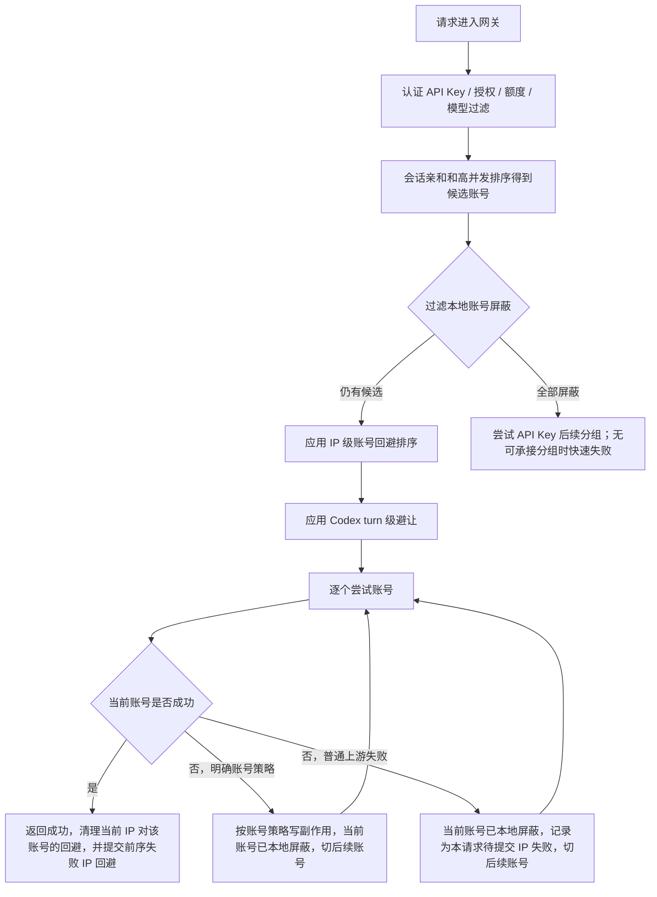

# IP级账号回避与自动切号设计

## 背景

同一个本地 API Key 被多人共享时，单个客户端来源可能在短时间内反复触发上游失败。当前网关已经把普通上游失败收敛到统一流水线：失败账号先进入当前进程短暂避让屏障，然后切换同分组后续账号；如果后续账号成功，前序失败账号不写 `temporary_unavailable`，只保留短期调度隔离。

本地账号屏蔽是账号维度的进程内保护，会影响同进程后续来源；IP 级账号回避是更窄的来源级排序辅助。它的目标是在不扩大持久账号惩罚范围的前提下，让同一客户端 IP 短时间内优先避开近期对它失败过且已被后续账号成功绕开的账号。

## 目标

- 优先保证客户端可用：遇到单账号失败时继续尝试当前路由候选中的其他可调度账号，只有实在没有可用结果时才返回客户端失败。
- 隔离单个来源的影响：某个客户端 IP 对某个账号失败后，只影响这个 `clientIp + API Key + 账号` 的短 TTL 调度顺序，不影响其他 IP。
- 不扩大账号冷却：IP 级回避不写账号 `temporary_unavailable`、`rate_limited`、`error`，也不修改账号全局 `schedulable`。
- 不解释状态码：状态码只作为规则输入、使用记录、审计和排障字段；默认调度逻辑不能用固定状态码判断账号失败性质。
- 保持轻量：使用单进程内有界 TTL 状态，不引入新表、分布式队列或多实例一致性假设。

## 非目标

- 不根据客户端 IP 识别真实自然人用户。NAT、办公网和代理出口可能共享 IP，系统只把 IP 当作本地调度隔离维度。
- 不改变上游出口 IP。客户端传入的 `X-Forwarded-For` 只用于本地请求来源识别和审计，不能影响服务器访问上游时的出口地址。
- 不替代 Codex turn 级切号。Codex 策略仍只由 `clientProfile = codex` 和精确 `x-codex-turn-metadata.turn_id` 触发。
- 不替代高并发单 IP 并发保护。单 IP 并发保护是容量闸口；IP 级账号回避是失败后的候选账号排序辅助。
- 不替代 IP 级错误熔断。错误熔断用于同一认证后来源短窗口内高置信本地请求错误过多时本地短路；IP 级账号回避只负责来源级候选排序和自动切号。
- 不把未知失败升级成账号健康结论。账号是否冷却只交给明确账户错误处理策略、流熔断、后台复测等强证据链路。

## 核心原则

### 不判断状态码

网关默认层不能维护 `>=500`、`429`、`408`、`502` 等状态码白名单或黑名单，也不能因为某个状态码就判定账号应该冷却或 IP 应该避让。

IP 级账号回避只接受这些事实来源：

- 上游账号错误：由账户错误处理策略、OAuth token 刷新失败、后台复测等明确规则确认。上游账号错误按既有账号状态链路处理，不依赖 IP 级回避。
- 本地失败隔离：当前账号出现上游请求异常或非 2xx 响应，调度决定短期屏蔽该账号并继续尝试后续账号。
- 调度事实：前序账号失败，后续账号在同一次请求链路中完整成功，说明本次请求可以通过切号救回来。

IP 级账号回避只基于“失败账号被后续成功账号证明可以绕开”这个调度事实，不基于状态码本身。

### 先救请求

单个账号失败不是最终失败。网关应该先在当前 API Key 已选分组内尝试其他可调度账号；如果当前号池在写下游前耗尽，再按 API Key 的 `groupBindings` 路由顺序尝试后续分组，直到：

- 某个后续账号成功，直接把成功结果返回客户端。
- 所有候选账号都失败或不可用，返回网关统一失败。
- 后续请求如果发现当前分组所有候选都在本地屏蔽中，先尝试 API Key 后续可承接分组；没有后续分组时快速失败，而不是旁路屏蔽继续打失败账号。

IP 级回避只能帮助下一次请求更快绕开近期失败账号，不能在当前请求中提前放弃其他账号。

### 只做局部避让

回避状态键建议为：

```text
systemAccountId + apiKeyId + clientIp + accountId
```

说明：

- `systemAccountId` 隔离调用方系统账户。
- `apiKeyId` 隔离同一出口 IP 下不同 API Key。
- `clientIp` 隔离客户端来源。
- `accountId` 表示该来源短期内应优先避开的账号。

`groupId` 不参与 IP 级账号回避键。同一个 API Key 绑定多个分组时，分组只是路由容器，来源对某个账号的短期失败经验应跟随账号和 API Key，不应被分组切碎；不同 API Key 仍保持隔离。

缺少 `clientIp` 时不启用 IP 级账号回避，避免把未知来源混进同一个全局桶。

## 调度流程



排序时不把账号池筛空：如果当前 IP 的回避状态命中部分账号，则把这些账号排到候选列表后面；如果所有候选账号都被当前 IP 回避，则旁路回避并保留原候选列表，保证仍有机会尝试。

## 失败记录规则

### 记录为待提交 IP 失败

满足以下条件时，可以把当前账号加入本请求的待提交 IP 失败列表：

- 当前请求有可用 `clientIp`。
- 当前账号已因上游请求异常或非 2xx 响应决定 `skip_account`。
- 失败不是客户端取消、本地认证、额度、授权、模型过滤、账号并发满、代理预检跳过或本地请求适配校验失败。

待提交列表只存在于当前请求生命周期中，不立即写入长期或 TTL 回避状态。列表必须按 `accountId` 去重，重复失败只保留同账号最新失败信息；单请求待提交失败上限固定为 `256`，超过上限的新账号失败不再扩容，避免一次异常请求链路在线性增长时阻塞 Node 主线程。

API Key 绑定多个分组并触发 fallback 切组时，待提交列表只能通过有界转移函数传给新分组上下文。转移过程继续按目标 tracker 的 `accountId` 索引去重并受 `256` 上限约束，来源 tracker 转移后立即清空；路由层禁止展开复制待提交数组或使用 `unshift(...pendingFailures)` 头插搬移。

### 提交为 IP 级回避

只有当同一次请求中后续账号完整成功时，才把前序待提交 IP 失败提交到短 TTL 回避状态：

```text
账号 A 上游失败并被跳过
账号 B 完整成功
=> 当前 clientIp 短期避让账号 A
=> 不冷却账号 A
```

如果所有账号都失败且没有成功结果，不提交 IP 回避，避免在没有成功样本时扩大误判；失败账号仍由本地短 TTL 屏蔽负责临时隔离。

### 成功清理

当前 IP 对某个账号后续完整成功时，应清理该 `clientIp + accountId` 的回避状态。这表示该账号对这个来源已经重新可用。

流式响应必须等完整终止后才算成功；收到 2xx + SSE 但后续流失败不能提前清理。

## 不记录回避的场景

| 场景 | 原因 |
| --- | --- |
| 认证失败、API Key 不可用、授权不可用、额度不足 | 未进入账号调度或不是账号问题 |
| 请求体 JSON 非法、本地模型不支持 | 本地请求校验失败 |
| 命中账户错误处理策略 | 已有账户级规则处理 |
| 客户端取消或连接断开 | 客户端生命周期问题 |
| 账号并发满、分组队列满、单 IP 并发闸口失败 | 本地容量问题，不代表账号对该 IP 失败 |
| 代理不可用或同代理失败跳过 | 代理链路问题，不应写成 IP-账号关系 |
| 所有账号都失败且没有后续成功样本 | 不能证明某个失败账号可被当前来源稳定绕开 |
| 普通流式可见输出后失败 | 服务端不能透明重放，继续走既有流熔断；IP 回避只影响后续可安全调度链路 |

## 与现有策略关系

| 机制 | 作用范围 | 与 IP 级回避的关系 |
| --- | --- | --- |
| 账户错误处理策略 | 账户级上游错误规则 | 优先于 IP 回避；命中后按策略冷却、限流或停用 |
| 本地账号屏蔽 | 当前进程短期避让刚失败的账号 | 优先于 IP 回避；全部候选屏蔽时先尝试 API Key 后续分组，无可承接分组则快速失败 |
| 待提交 IP 失败 | 单次请求内失败账号记录 | IP 回避只在后续账号成功后消费 |
| Codex turn 级避让 | 同一 Codex turn 的客户端专属切号 | 比 IP 回避更窄；不能由 IP、UA 或 body hash 触发 Codex |
| 高并发单 IP 并发保护 | 同 IP 并发容量闸口 | 与失败无关；开启后先过 IP 槽，再进入账号调度 |
| IP 级错误熔断 | 同认证后来源高置信错误风暴止损 | 与候选排序无关；命中后本地短 TTL 429，不进入账号调度 |
| 流式失败熔断 | 可见输出后多次流失败冷却账号 | 保留现有行为；IP 回避不替代流熔断 |
| 冷却复测 | 验证临时不可调用账号是否恢复 | 只处理账号级冷却，不处理 IP 回避状态 |

## 运行态与默认值

运行态使用进程内有界 TTL 缓存：

| 参数 | 建议值 | 说明 |
| --- | --- | --- |
| TTL | `defaultTemporaryUnschedulableMinutes`，上限 `10` 分钟 | 来源级排序回避使用分钟级上限；账号短暂避让另走 `3s -> 5s -> 10s` 半开屏障 |
| 容量 | `5000` 个 scope 或 entry 量级 | 防止大量 IP / 账号组合导致内存无界增长 |
| 单请求待提交失败 | `256` 个账号 | 只在当前请求上下文内存在，按账号去重；fallback 切组有界转移 |
| 触发阈值 | `1` 次已确认切号成功 | 因为提交条件已经需要后续账号成功确认，不再叠加复杂阈值 |
| 缺失 IP | 关闭 | 不把未知来源混入全局状态 |
| 全部候选命中回避 | 旁路回避 | 保证客户端仍有机会尝试 |

这类状态属于易失运行态：服务重启、进程重启、缓存淘汰后可以丢失；丢失后回到普通调度，不影响业务事实和审计事实。

## 观测与审计

建议新增日志或审计 metadata：

- `gateway_client_ip_account_avoidance_applied`：候选列表应用 IP 级账号回避。
- `gateway_client_ip_account_avoidance_bypassed`：所有候选账号都被当前 IP 回避，系统旁路以保持可用性。
- `gateway_client_ip_account_failure_confirmed`：后续账号成功后，提交前序待确认 IP 失败。
- `gateway_client_ip_account_avoidance_cleared`：当前 IP 对账号成功后清理回避。

日志和审计中可以记录 `clientIp` 的现有字段；如后续新增管理页面展示，应遵循安全与日志策略，避免把 IP 维度误描述成真实用户身份。

## 实现落点

- 新增 `backend/src/modules/gateway/openai-gateway-client-ip-account-avoidance.service.ts`：维护短 TTL 状态、候选排序、待提交失败提交和测试辅助清理。
- `ClientIpAccountAvoidanceTracker`：维护 `pendingFailures` 和 `pendingFailureIndexByAccountId`，保证同请求失败按账号去重、固定上限和 fallback 切组有界转移。
- `openai-gateway-request-preflight.ts`：在全局本地账号屏蔽后、Codex turn 避让前应用 IP 级账号回避排序，并写入审计 metadata。
- `openai-gateway-upstream-dispatch.ts` / `openai-gateway-failure-dispatch.ts`：在上游失败并决定跳账号后登记本请求待提交 IP 失败；没有后续成功样本时不提交为 IP 回避。
- `openai-gateway-response-finalization.ts`：只有完整成功后清理当前账号回避，并提交前序待确认 IP 失败；流式失败不提前清理。
- 回归脚本：新增 `gateway-client-ip-account-avoidance-regression.ts`，覆盖同 IP 自动切号、不同 IP 不互相影响、同一 API Key 不同分组共享回避、不同 API Key 隔离、账号仍 active、全部候选回避时旁路。

## 验收标准

- 同一个 `clientIp + API Key` 下，账号 A 未确认失败、账号 B 成功后，后续请求优先避开账号 A。
- 同一 API Key 下不同分组共享这份回避状态，不同 API Key 和另一个 `clientIp` 不受影响，仍按原候选顺序调度。
- IP 级回避不写账号 `temporary_unavailable`、`rate_limited`、`error`、`cooldown_until` 或全局 `schedulable`。
- 账号策略命中、客户端取消、本地校验失败和没有后续成功样本的全失败请求不记录 IP 级账号回避。
- 所有候选账号都被当前 IP 回避时，系统旁路回避，仍尝试原候选列表。
- 单请求待提交失败按账号去重且最多 `256` 条；fallback 切组不复制数组、不头插数组，转移后来源 tracker 清空。
- 不新增请求链路数据库查询，不扫描使用记录、审计日志或统计缓存明细。
