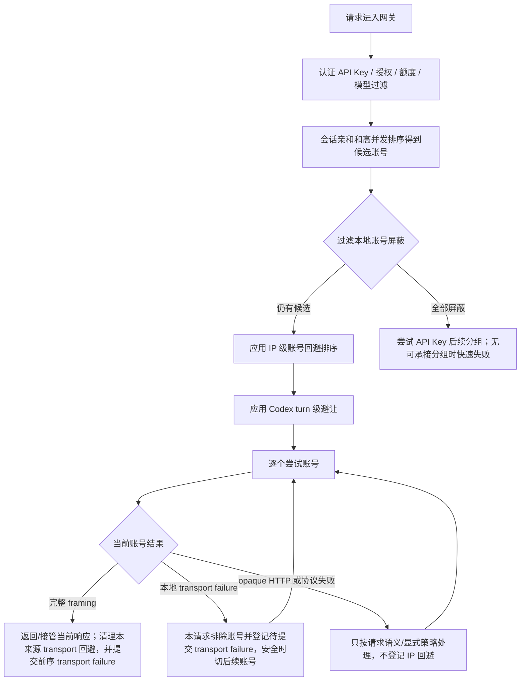

# IP级账号回避与自动切号设计

## 背景

同一个本地 API Key 被多人共享时，单个客户端来源可能在短时间内反复遇到本地可验证的上游 transport failure。当前网关把这类连接失败、lane hard timeout、读取中断等事实收敛到统一传输流水线：当前请求先排除失败账号并切换同分组后续账号；后续账号形成完整 framing 后，前序 transport failure 不写 `temporary_unavailable`，只允许保留短期来源级调度隔离。完整 HTTP 状态、错误正文和精确客户端协议结构失败不进入该共享隔离。

本地账号屏蔽是账号维度的进程内保护，会影响同进程后续来源；IP 级账号回避是更窄的来源级排序辅助。它的目标是在不扩大持久账号惩罚范围的前提下，让同一客户端 IP 短时间内优先避开近期对它失败过且已被后续账号成功绕开的账号。

## 目标

- 优先保证客户端可用：安全文本请求遇到可安全切换的单账号失败时继续尝试当前路由候选中的其他可调度账号，只有实在没有可用结果时才返回客户端失败；是否切换当前请求与是否建立跨请求 IP 回避必须分开判断。
- 隔离单个来源的影响：某个客户端 IP 对某个账号失败后，只影响这个 `clientIp + API Key + 账号` 的短 TTL 调度顺序，不影响其他 IP。
- 不破坏账号调度优先级：IP 级回避只能在同一模型匹配和账号调度优先级层内把近期失败账号后置，不能把低模型匹配等级、低优先级、备用或非超级优先账号提前到更高优先级层前面。
- 不扩大账号冷却：IP 级回避不写账号 `temporary_unavailable`、`rate_limited`、`error`，也不修改账号全局 `schedulable`。
- 不解释状态码：状态码只作为规则输入、使用记录、审计和排障字段；默认调度逻辑不能用固定状态码判断账号失败性质。
- 保持轻量：使用单进程内有界 TTL 状态，不引入新表、分布式队列或多实例一致性假设。

## 非目标

- 不根据客户端 IP 识别真实自然人用户。NAT、办公网和代理出口可能共享 IP，系统只把 IP 当作本地调度隔离维度。
- 不改变上游出口 IP。本地 `clientIp` 来自受信任反向代理链路解析后的请求来源，只用于本地请求来源识别和审计，不能影响服务器访问上游时的出口地址。
- 不替代 Codex turn 级切号。Codex 策略仍只由 `clientProfile = codex` 和精确 `x-codex-turn-metadata.turn_id` 触发。
- 不替代高并发单 IP 并发保护。单 IP 并发保护是容量闸口；IP 级账号回避是失败后的候选账号排序辅助。
- 不替代 IP 级错误熔断。错误熔断用于同一认证后来源短窗口内高置信本地请求错误过多时本地短路；IP 级账号回避只负责来源级候选排序和自动切号。
- 不把未知失败升级成账号健康结论。账号是否冷却只交给用户显式账户错误处理策略、本地传输电路、独立后台复测或人工操作等有来源证据链路；协议字段和上游业务响应不提供系统默认结论。

## 核心原则

### 不判断状态码

网关默认层不能维护 `>=500`、`429`、`408`、`502` 等状态码白名单或黑名单，也不能因为某个状态码就判定账号应该冷却或 IP 应该避让。

IP 级账号回避只接受以下本地事实组合：

- 失败事实必须是当前账号的建连失败、lane hard timeout、真实读取中断或未完成 framing 等本地可验证 transport failure；路由配置截止主动取消、完整非 `2xx`、`2xx + error`、精确客户端协议结构失败、上游 `code/type/message` 和用户坏会话都不能登记待提交 IP 失败。
- 调度确认只作用于已经登记的 transport failure：同一请求的后续账号形成完整 HTTP/SSE framing，证明当前来源可以绕开前序传输路径；或者这些 transport failure 耗尽候选并已经返回最终失败。后续成功或最终失败本身不能把其他失败类别转换成 transport 事实。
- 用户显式账户错误策略、OAuth token 刷新、独立后台探针和人工操作各自走账户/Key 权威状态链路，不借 IP 回避扩大或改写作用域。

因此，IP 级账号回避基于“已确认可绕开的来源级 transport failure”，不基于状态码、错误正文、协议字段或客户端画像。任意 lane 的精确客户端协议失败都可以在语义提交前救当前请求，但这种协议失败仍不得形成跨请求 IP 回避；请求类型不改变候选切换准入。

### 先救请求

单个账号失败不是最终失败。网关应该先在当前策略路由已选分组内尝试其他可调度账号；如果当前号池在写下游前耗尽，再按策略路由的分组候选顺序尝试后续分组，直到：

- 某个后续账号成功，直接把成功结果返回客户端。
- 所有候选账号都失败或不可用，返回网关统一失败。
- 后续请求如果发现当前分组所有候选都在本地屏蔽中，先尝试 API Key 后续可承接分组；没有后续分组时快速失败，而不是旁路屏蔽继续打失败账号。

IP 级回避只能帮助下一次请求更快绕开近期失败账号，不能在当前请求中提前放弃其他账号。

任意请求因 opaque `response.ok=false` 在当前请求内切 Key/账号时，只扩大本请求排除集合；即使后续候选成功或最终失败已经返回客户端，也不提交 IP 回避。图片、音频、文件和其他请求使用同一规则。

### 不跨优先级层

IP 级账号回避不是账号优先级重算器。基础候选已经按模型能力、备用标记、超级优先、`priority`、绑定创建顺序和账号 ID 得到稳定顺序后，IP 回避只允许在相同调度优先级层内移动账号。

同一层的判定以当前候选账号上的调度事实为准：模型直连匹配优先于模型映射匹配，映射匹配优先于不限模型账号；非备用优先于备用，超级优先优先于普通账号，`priority` 数值小的优先于数值大的。命中 IP 回避的账号只能排到同层其他账号之后；如果后面只有更低优先级层账号，则不能因为 IP 回避把低层账号提前。`qualityScore` 只作为候选排序信号，不作为 IP 回避、Codex turn 避让、上游桶避让、容量后置和运行态降级的统一硬边界。账号已被本地短暂屏蔽、状态冷却、授权 / 模型 / 并发硬过滤移出候选时，不属于排序后置，而是不可调度过滤。

### 只做局部避让

回避状态键建议为：

```text
systemAccountId + apiKeyId + clientIp + accountId
```

说明：

- `systemAccountId` 隔离调用方系统账户。
- `apiKeyId` 隔离同一出口 IP 下不同 API Key。
- `clientIp` 隔离客户端来源。
- `accountId` 表示该来源短期内应优先避开的账号。

`groupId` 不参与 IP 级账号回避键。同一个 API Key 所选路由策略绑定多个分组时，分组只是路由容器，来源对某个账号的短期失败经验应跟随账号和 API Key，不应被分组切碎；不同 API Key 仍保持隔离。

缺少 `clientIp` 时不启用 IP 级账号回避，避免把未知来源混进同一个全局桶。

## 调度流程



排序时不把账号池筛空：如果当前 IP 的回避状态命中部分账号，则把这些账号排到同一模型匹配和账号调度优先级层的后面；如果所有候选账号都被当前 IP 回避，则旁路回避并保留原候选列表，保证仍有机会尝试。排序后置不能跨越更高或更低的模型匹配和账号优先级层。

## 失败记录规则

### 记录为待提交 IP 失败

满足以下条件时，可以把当前账号加入本请求的待提交 IP 失败列表：

- 当前请求有可用 `clientIp`。
- 当前账号已经形成本地可验证的建连失败、lane hard timeout、读取中断或未完成 framing，并且请求仍处于可安全切换窗口。
- 失败不是客户端取消、本地认证、额度、授权、模型过滤、账号并发满、代理预检跳过或本地请求适配校验失败。
- 失败不是路由配置截止、完整 HTTP 响应、上游业务语义、精确客户端协议结构失败或用户显式策略动作。

待提交列表只存在于当前请求生命周期中，不立即写入长期或 TTL 回避状态。列表必须按 `accountId` 去重，重复失败只保留同账号最新失败信息；tracker 防御容量保持 `256`，但整请求最多 64 次真实上游 attempt，因此新增 pending 不能成为绕过 64-attempt 派发硬上限的入口。

路由策略绑定多个分组并触发 fallback 切组时，待提交列表只能通过有界转移函数传给新分组上下文。转移过程继续按目标 tracker 的 `accountId` 索引去重并受 `256` 防御容量约束，来源 tracker 转移后立即清空；路由层禁止展开复制待提交数组或使用 `unshift(...pendingFailures)` 头插搬移。

### 提交为 IP 级回避

同一次请求中后续账号形成完整 HTTP framing，或 SSE 在没有读取中断时正常结束，会把前序已登记的 transport failure 提交到短 TTL 回避状态。其 HTTP 状态和业务正文不参与判断：

```text
账号 A 上游失败并被跳过
账号 B 完整成功
=> 当前 clientIp 短期避让账号 A
=> 不冷却账号 A
```

如果所有账号都因 transport failure 耗尽，并且最终失败已经返回客户端，也会确认本次待提交 transport failure，但需要达到触发阈值后才真正参与后续排序。包含完整 HTTP/协议失败的全失败请求不能借“已经返回客户端”把这些失败加入待提交列表。首次 transport 确认后仍给该账号一次机会，第二次确认后第三次同 IP 请求才开始回避。

### 成功清理

当前 IP 对某个账号后续形成完整 HTTP/SSE framing 时，应清理该 `clientIp + accountId` 的 transport 回避状态。这只表示来源到该账号的传输路径恢复，不确认业务成功，也不清账户电路、Key 状态或持久账户状态。

流式响应必须等完整终止后才算成功；收到 2xx + SSE 但后续流失败不能提前清理。

## 不记录回避的场景

| 场景 | 原因 |
| --- | --- |
| 认证失败、API Key 不可用、授权不可用、额度不足 | 未进入账号调度或不是账号问题 |
| 请求体 JSON 非法、本地模型不支持 | 本地请求校验失败 |
| 命中账户错误处理策略 | 已有账户级规则处理 |
| 完整非 `2xx`、`2xx + error` 或上游自定义错误正文 | 只能按安全端点做请求级 opaque 接管或按用户显式策略处理，不能形成 transport IP 证据 |
| 精确客户端协议结构/语义失败 | 任意 lane 可在未语义提交且预算允许时按客户端契约救当前请求；不证明来源到账号的传输路径坏，也不能形成跨请求 IP 回避 |
| 客户端取消或连接断开 | 客户端生命周期问题 |
| 账号并发满、分组队列满、单 IP 并发闸口失败 | 本地容量问题，不代表账号对该 IP 失败 |
| 代理不可用或同代理失败跳过 | 代理链路问题，不应写成 IP-账号关系 |
| 普通流式可见输出后仅出现协议失败 | 服务端不能透明重放，且协议失败不形成 IP 回避；若同时存在真实读取中断，只记录该独立 transport 事实 |

## 与现有策略关系

| 机制 | 作用范围 | 与 IP 级回避的关系 |
| --- | --- | --- |
| 账户错误处理策略 | 账户级上游错误规则 | 优先于 IP 回避；命中后按策略冷却、限流或停用 |
| 本地 transport 屏蔽 | 当前进程短期避让刚发生 transport failure 的账号/作用域 | 优先于 IP 回避，是有界传输保护；opaque HTTP/协议失败不得进入 |
| 待提交 IP 失败 | 单次请求内 transport failure 账号记录 | 后续完整 framing 或 transport 耗尽最终返回时确认；其他失败类别始终不得混入 |
| Codex turn 级避让 | 同一 Codex turn 的客户端专属切号 | 比 IP 回避更窄；不能由 IP、UA 或 body hash 触发 Codex；排序后置同样不能跨模型匹配和账号调度优先级层 |
| 高并发单 IP 并发保护 | 同 IP 并发容量闸口 | 与失败无关；开启后先过 IP 槽，再进入账号调度 |
| IP 级错误熔断 | 同认证后来源高置信错误风暴止损 | 与候选排序无关；命中后本地短 TTL 429，不进入账号调度 |
| 流式传输电路 | 可见输出后的真实读取中断/未完成 framing | 仅消费本地 transport 事实；协议事件、正文和终止字段不进入 IP 回避 |
| 冷却复测 | 验证临时不可调用账号是否恢复 | 只处理账号级冷却，不处理 IP 回避状态 |

## 运行态与默认值

运行态使用进程内有界 TTL 缓存：

| 参数 | 建议值 | 说明 |
| --- | --- | --- |
| TTL | `defaultTemporaryUnschedulableMinutes`，上限 `10` 分钟 | 来源级排序回避使用分钟级上限；账号短暂避让另走 `3s -> 5s -> 10s` 半开屏障 |
| 容量 | `5000` 个 scope 或 entry 量级 | 防止大量 IP / 账号组合导致内存无界增长 |
| 单请求待提交失败 | `256` 个账号防御容量 | 只在当前请求上下文内存在并按账号去重；真实派发仍受全请求 64-attempt 硬上限，fallback 切组有界转移 |
| 触发阈值 | `2` 次已确认失败 | 首次确认后仍给同 IP 同账号一次机会；第二次确认后第三次请求开始在同优先级层内后置 |
| 缺失 IP | 关闭 | 不把未知来源混入全局状态 |
| 全部候选命中回避 | 旁路回避 | 保证客户端仍有机会尝试 |

这类状态属于易失运行态：服务重启、进程重启、缓存淘汰后可以丢失；丢失后回到普通调度，不影响业务事实和审计事实。

## 观测与审计

建议新增日志或审计 metadata：

- `gateway_client_ip_account_avoidance_applied`：候选列表应用 IP 级账号回避。
- `gateway_client_ip_account_avoidance_bypassed`：所有候选账号都被当前 IP 回避，系统旁路以保持可用性。
- `gateway_client_ip_account_failure_confirmed`：后续账号形成完整 framing 或 transport 候选耗尽并返回后，提交前序待确认 transport failure；metadata 必须保留 transport 类别，禁止状态码/正文类别。
- `gateway_client_ip_account_avoidance_cleared`：当前 IP 到账号形成完整 framing 后清理 transport 回避；不表达业务成功或账户恢复。

日志和审计中可以记录 `clientIp` 的现有字段；如后续新增管理页面展示，应遵循安全与日志策略，避免把 IP 维度误描述成真实用户身份。

## 实现落点

- 新增 `backend/src/modules/gateway/runtime/client-ip-account-avoidance.service.ts`：维护短 TTL 状态、候选排序、待提交失败提交和测试辅助清理。
- `ClientIpAccountAvoidanceTracker`：维护 `pendingFailures` 和 `pendingFailureIndexByAccountId`，保证同请求失败按账号去重、固定上限和 fallback 切组有界转移。
- `dispatch/preparation.ts`：在全局本地账号屏蔽后、Codex turn 避让前应用 IP 级账号回避排序，并写入审计 metadata。
- `dispatch/upstream-dispatch.ts` / `response/failure-dispatch.ts`：仅在本地 transport failure 且决定跳账号后登记本请求待提交 IP 失败；同请求形成完整 framing 或 transport 耗尽返回客户端时再确认。
- `response/finalization.ts` / `routes.ts`：完整 framing 后清理当前账号 transport 回避，并提交前序待确认 transport failure；最终失败返回客户端前也只能确认已经登记的 transport pending，协议/业务失败不能补登记。
- 回归脚本：新增 `gateway-client-ip-account-avoidance-regression.ts`，覆盖同 IP 自动切号、不同 IP 不互相影响、同一 API Key 不同分组共享回避、不同 API Key 隔离、账号仍 active、模型匹配和账号优先级边界、全部候选回避时旁路。

## 验收标准

- 同一个 `clientIp + API Key` 下，账号 A 两次确认失败后，第三次请求在同一模型匹配和账号调度优先级层内优先避开账号 A。
- 同一 API Key 下不同分组共享这份回避状态，不同 API Key 和另一个 `clientIp` 不受影响，仍按原候选顺序调度。
- IP 级回避不能把低模型匹配等级、低优先级、备用或非超级优先账号提前到更高账号调度优先级层前面。
- IP 级回避不写账号 `temporary_unavailable`、`rate_limited`、`error`、`cooldown_until` 或全局 `schedulable`。
- 账号策略命中、opaque HTTP/协议失败、配置路由截止、客户端取消和本地校验失败不记录 IP 级账号回避；全 transport 失败请求只有在最终失败已经返回客户端时才确认已有 pending，且达到阈值后才参与排序。
- 所有候选账号都被当前 IP 回避时，系统旁路回避，仍尝试原候选列表。
- 单请求待提交失败按账号去重且 tracker 防御容量最多 `256` 条；真实派发仍最多 64 次，fallback 切组不复制数组、不头插数组，转移后来源 tracker 清空。
- 不新增请求链路数据库查询，不扫描使用记录、审计日志或统计缓存明细。
