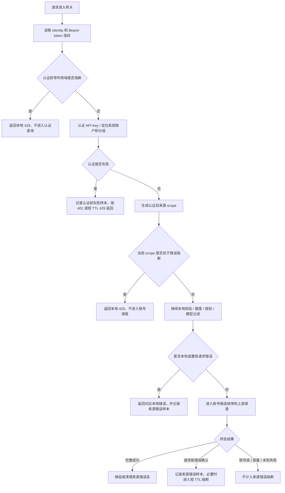

# IP级错误熔断与恶意请求保护设计

## 背景

当前网关已经具备两类客户端 IP 相关保护：

- **IP 级账号回避**：当前序账号未确认失败、后续账号成功后，让同一 `clientIp + API Key + 分组` 短期优先避让前序失败账号。
- **单 IP 并发保护**：高并发分组可按同一 `系统账户 + 分组 + API Key + 客户端 IP` 限制同时进入调度的请求数量。

这两类能力都不是“错误频率拦截”。如果某个客户端 IP 使用有效 API Key 持续构造错误请求，或者在认证前反复缺少 Bearer / 使用无效 API Key 探测，当前系统主要依赖 API Key 额度、账号并发、高并发分组队列和可选单 IP 并发限制来间接保护。它不会因为“这个来源短时间错误过多”就自动短路后续请求。

IP 级错误熔断的目标是补上这一层：当同一来源在短窗口内反复产生高置信的认证失败或请求级错误时，网关可以短 TTL 返回本地 OpenAI-compatible `429`，避免继续消耗认证校验、账号池、上游请求、重试链路、审计队列和日志写入成本。

## 目标

- 保护账号池：恶意或故障客户端不能通过持续错误请求反复扫账号、触发重试或消耗账号调度资源。
- 保护网关热路径：对已确认的错误风暴短路处理，减少重复上游调用、重复审计和重复错误处理。
- 保持来源隔离：熔断只作用于当前 `systemAccountId + apiKeyId + groupId + clientIp`，不影响其他 API Key、分组、系统账户或客户端 IP。
- 不扩大账号惩罚：错误熔断不写账号冷却、不写账号异常、不改变账号 `schedulable`，也不进入后台账号复测。
- 不按状态码定罪：默认逻辑不维护状态码白名单或黑名单，只消费既有请求级错误事实和本地校验事实。
- 不做区域性封禁：不按国家、地区、ASN、运营商、IP 段归属或代理标签做默认拒绝。
- 保持轻量：使用进程内短 TTL、有界运行态，不新增数据库表，不在请求链路扫描使用记录、审计日志或统计缓存。

## 非目标

- 不替代 WAF、DDoS 防护、反向代理限流或操作系统防火墙。
- 不根据客户端 IP 识别真实自然人用户。NAT、代理出口和办公网都可能共享 IP。
- 不建立永久封禁、黑名单或跨重启持久处罚。
- 不处理多实例共享熔断状态。当前项目仍按单机轻量部署设计。
- 不把有效账号池整体不可用归咎于某个 IP。上游故障、账号池故障、代理故障和本地容量问题必须与来源错误分开。
- 不把认证前保护做成粗粒度 IP 封禁。认证前只做缺失 Bearer、重复同一无效 token 和高频随机无效 token 的短 TTL 软保护，且不能挡同出口的有效 Bearer 请求。

## 核心原则

### 与 IP 级账号回避分层

IP 级账号回避是“救请求”的策略：它尽量把当前来源切到其他可用账号。

IP 级错误熔断是“止损”的策略：当当前来源持续制造高置信请求级错误时，短时间拒绝继续消耗账号池。

两者不能混用：

- 回避只改变候选账号排序，不直接拒绝请求。
- 熔断直接返回本地 `429`，但不记录账号失败。
- 回避的键包含 `accountId`，熔断的主键不包含 `accountId`。

### 认证前与认证后分层

认证前保护和认证后错误熔断共用“短 TTL、易失、客户体验优先”的安全原则，但作用点不同：

- 认证前还没有 `apiKeyId` 和 `groupId`，只能使用 `clientIp + Bearer token 指纹` 或 `clientIp + missing_bearer` 这样的窄作用域。
- 重复同一无效 token 可以在进入 DB service / runtime cache 前短路，减少重复校验成本。
- 随机无效 token 探测不能在认证前直接按 IP 拦截，因为这会误伤同 NAT 下的有效用户；它只能在“已经验证为无效 token”之后返回短 TTL `429`。
- 缺少 Bearer 的高频请求可以按 `clientIp + missing_bearer` 短路，但阈值必须高于正常误配和浏览器误访问。
- 认证后已经有 `systemAccountId + apiKeyId + groupId`，可以使用更精确的来源 scope 做错误熔断。

### 不解释状态码

熔断不能因为 `400`、`401`、`403`、`429`、`500`、`502` 等状态码本身就判定来源恶意。

可以作为熔断输入的是已经被系统确认过的事实：

- 认证前缺少 Bearer Token 高频重复。
- 认证前同一无效 Bearer token 高频重复。
- 认证前同一 IP 高频随机无效 Bearer token，但只能在该请求已经确认 token 无效后短路，不能挡有效 token。
- 本地请求校验失败，例如 JSON 非法、模型过滤失败、适配器本地校验失败。
- 上游错误响应特征规则命中的请求级错误，例如 OpenAI `invalid_request_error`。
- 多账号同一错误签名确认的请求级失败。
- 同一来源在短窗口内高比例产生上述高置信来源错误。

状态码只能进入审计、使用记录、日志和错误签名摘要，不能作为默认熔断依据。

### 只消费高置信信号

错误熔断只把“更像客户端请求问题”的失败计入来源错误窗口。

不能计入或不能直接触发熔断的场景包括：

- 账号错误策略命中。
- 账号并发满、分组队列满、单 IP 并发闸口失败。
- 上游连接失败、代理不可用、所有账号都失败但没有请求级确认。
- 客户端取消或连接断开。
- 流式已输出后失败。
- API Key 额度不足、授权不可用或本地容量不足。

这些场景可能需要其他保护，但不能证明“这个 IP 的请求本身有问题”。

### 短 TTL 和可恢复

错误熔断只做短期止损，默认应具备这些恢复路径：

- 熔断 TTL 到期后自动恢复。
- 当前来源后续完整成功后降低失败分或清理轻度熔断态。
- 连续触发可以小幅退避，但必须有最大上限。
- 服务重启、缓存淘汰或达到容量上限后可以丢失状态，回到普通调度。

### 不把池子问题归咎给 IP

如果多个来源、多个 API Key 或多个分组同时出现相似未知失败，更可能是上游或系统问题。IP 级错误熔断只在当前来源已经产生高置信请求级错误时触发，不能把公共故障错误算到某个 IP 头上。

## 作用范围

认证后主作用域为：

```text
systemAccountId + apiKeyId + groupId + clientIp
```

补充维度：

```text
endpoint + normalizedErrorSignature
```

说明：

- `systemAccountId` 隔离调用方系统账户。
- `apiKeyId` 隔离同一出口 IP 下不同 API Key。
- `groupId` 隔离不同账号池。
- `clientIp` 隔离客户端来源。
- `endpoint` 用于区分 `/v1/responses`、`/v1/chat/completions`、`/v1/models` 等请求类型。
- `normalizedErrorSignature` 用于识别同一类错误风暴，但不能保存完整请求体或完整上游错误正文。

缺少 `clientIp` 时，认证前入口保护和认证后错误熔断都不启用。无法定位 API Key / 分组时，只能保留认证前窄作用域保护，不能把未知来源混入认证后网关调度态。

认证前作用域为：

```text
clientIp + missing_bearer
clientIp + bearerTokenFingerprint
clientIp + invalid_token_spray
```

说明：

- `bearerTokenFingerprint` 只能保存 token 的不可逆 hash 截断值，不能保存 token 原文。
- `invalid_token_spray` 只用于“已验证为无效 token 后”的软拦截，不参与认证前有效 token 的提前拒绝。
- 认证前不使用地理位置、IP 段、ASN、User-Agent 黑名单或固定错误码名单。

## 信号分层

| 信号 | 是否计入 | 原因 |
| --- | --- | --- |
| 认证前缺少 Bearer 高频重复 | 是 | 不进入业务认证，阈值较高，只挡异常噪声 |
| 认证前同一无效 token 高频重复 | 是 | 作用域包含 token 指纹，不影响同 IP 其他 token |
| 认证前随机无效 token 高频探测 | 是，验证失败后 | 不提前挡有效 token，只减少持续无效探测响应成本 |
| 本地 JSON 非法 | 是 | 请求体无法解析，属于高置信请求问题 |
| 本地模型不支持或模型过滤失败 | 是 | 当前 API Key / 分组无法承接该请求，重复高频会消耗本地链路 |
| OAuth / Codex adapter 本地校验失败 | 是 | 请求在进入上游前已被确认不可转发 |
| 上游错误响应特征规则命中请求级错误 | 是 | 已由既有规则确认更像请求问题 |
| 多账号同一错误签名确认 | 是 | 已确认不是单账号问题 |
| 未知失败后续账号成功 | 否，交给 IP 级账号回避 | 这是账号候选排序问题，不是来源错误熔断依据 |
| 未知失败所有账号都失败 | 否 | 可能是账号池、代理、网络或上游公共问题 |
| 账号错误策略命中 | 否 | 已归属账号级处理，不能重复处罚来源 |
| 账号并发满、分组队列满、单 IP 并发满 | 否 | 本地容量问题，不代表请求错误 |
| 额度不足、授权不可用、API Key 停用 | 否 | 属于授权或状态拒绝路径，不证明请求体错误；不进入来源错误熔断 |
| 客户端取消或连接断开 | 否 | 客户端生命周期问题，应单独观察取消率 |
| 流式已输出后失败 | 否 | 可能是长连接、网络或上游流稳定性问题 |
| 地区、国家、ASN、运营商、IP 段归属 | 否 | 禁止区域性默认封禁，避免误伤正常用户 |

## 计数模型

运行态维护认证前入口保护窗口和认证后来源错误窗口：

| 窗口 | 作用域 | 默认阈值 | 动作 |
| --- | --- | --- | --- |
| 缺失 Bearer 窗口 | `clientIp + missing_bearer` | 60 秒内 >= 40 次 | 短路缺失 Bearer 请求，初始 30 秒 |
| 重复无效 token 窗口 | `clientIp + bearerTokenFingerprint` | 60 秒内 >= 8 次 | 短路同一无效 token，初始 30 秒 |
| 随机无效 token 窗口 | `clientIp + invalid_token_spray` | 60 秒内验证失败 >= 120 次 | 仅对已验证无效 token 返回 429，初始 30 秒 |
| 同签名错误窗口 | `scope + endpoint + normalizedErrorSignature` | 30 秒内同签名高置信错误 >= 5 次 | 短路该来源，初始 30 秒 |
| 总高置信错误窗口 | `scope` | 60 秒内高置信错误 >= 20 次，或样本 >= 10 且失败率 >= 90% | 短路该来源，初始 30 秒 |

连续触发时可以退避：

| 连续触发次数 | 熔断时长 |
| --- | --- |
| 第 1 次 | 30 秒 |
| 第 2 次 | 60 秒 |
| 第 3 次 | 120 秒 |
| 第 4 次及以上 | 最高 10 分钟 |

这些阈值是运行默认值，通过后端常量集中维护，不暴露前端运行时开关。调整阈值必须经过代码审查、回归验证和共享 IP 误伤风险复核。

运行态约束：

- 最大 scope 数：`10000` 级别。
- 最大 TTL：`15` 分钟。
- 每个 scope 内错误签名数量有上限，例如最近 `20` 个签名。
- 不保存完整请求体、完整响应体或完整错误正文。
- `normalizedErrorSignature` 只保存错误类型、错误码、截断摘要 hash、endpoint 和模型等低敏摘要。

## 网关流程



认证后熔断检查应位于认证后、账号调度前。这样既能拿到 `apiKeyId`、`groupId` 和 `systemAccountId`，又能在继续扫账号池前快速止损。

本地 JSON 非法这类错误可能发生在更早的请求体解析阶段；当前请求按原始校验语义返回 `400`，同时记录来源错误样本，后续请求按窗口状态熔断。

认证前保护应位于读取 raw body 前，优先挡重复缺失 Bearer 和重复同一无效 token；随机无效 token 探测为了避免误伤有效用户，只在 API Key 已确认无效之后返回短 TTL `429`。

## 响应语义

命中熔断时返回 OpenAI-compatible `429`：

```json
{
  "error": {
    "message": "当前来源短时间错误过多，请稍后重试。",
    "type": "rate_limit_exceeded",
    "code": "client_ip_error_circuit_open"
  }
}
```

认证前命中熔断时使用同一 `rate_limit_exceeded` 类型，但错误码区分为 `client_ip_pre_auth_circuit_open`。

响应头：

- `Retry-After`: 熔断剩余秒数。
- `x-trace-id`: 保持现有链路追踪。

记录规则：

- 使用记录写网关本地失败，不关联上游账号。
- 原始审计按失败 / 异常策略保留终态摘要。
- 普通日志只记录 scope 摘要、原因、计数、熔断剩余时间和 trace ID，不记录完整请求体或完整错误正文。

## 与现有策略关系

| 机制 | 作用范围 | 与错误熔断关系 |
| --- | --- | --- |
| 认证前入口保护 | 缺失 Bearer、重复无效 token、随机无效 token 探测 | 不使用 API Key / 分组 scope；优先保护认证校验路径且不能挡有效 token |
| API Key 额度 | API Key 成本额度 | 额度是账务边界；错误熔断是高置信错误风暴止损 |
| 高并发单 IP 并发保护 | 同 IP 同时进入调度的请求数量 | 并发保护挡瞬时并发；错误熔断挡连续错误 |
| IP 级账号回避 | 同来源对单账号的候选排序 | 回避负责切号救请求；错误熔断负责错误过多时短路 |
| 上游错误响应特征规则 | 请求级错误识别 | 错误熔断消费其“请求级确认”结果，不重复维护状态码规则 |
| 账号错误处理策略 | 账号级强规则 | 优先归属账号处理，不计入来源熔断 |
| 待确认失败 | 单次请求内未知失败确认 | 后续成功时交给 IP 级账号回避；不直接熔断来源 |
| 流熔断 | 账号流式失败计数 | 流熔断处理账号稳定性；来源错误熔断不处理已输出后的流失败 |

## 观测与审计

日志 / 审计事件：

- `gateway_pre_auth_error_circuit_opened`：认证前缺失 Bearer 或无效 token 探测进入短 TTL 熔断。
- `gateway_pre_auth_error_circuit_blocked`：认证前请求被短 TTL 熔断短路。
- `gateway_client_ip_error_circuit_sample_recorded`：记录一次来源高置信错误样本。
- `gateway_client_ip_error_circuit_opened`：来源进入短 TTL 错误熔断。
- `gateway_client_ip_error_circuit_blocked`：请求因来源错误熔断被本地短路。
- `gateway_client_ip_error_circuit_recovered`：成功请求降低或清理来源错误态。
- `gateway_client_ip_error_circuit_bypassed`：缺少 IP、缺少认证 scope 或策略关闭，未启用错误熔断。

元数据包含：

- `systemAccountId`
- `apiKeyId`
- `groupId`
- `clientIp`
- `tokenFingerprint`，仅认证前且不可逆截断 hash
- `endpoint`
- `reason`
- `failureCount`
- `sampleWindowMs`
- `blockedUntilMs`
- `retryAfterSeconds`

不要记录完整请求体、完整响应体、完整上游错误正文、完整 API Key 或 token。

## 实现落点

- 新增 `backend/src/modules/gateway/openai-gateway-client-ip-error-circuit.service.ts`：维护进程内窗口、熔断状态、采样和测试辅助清理。
- `openai-gateway-request.ts`：认证前检查缺失 Bearer / 重复无效 token 的窄作用域熔断；随机无效 token 只在验证失败后软熔断，不挡有效 token。
- `openai-gateway-request-preflight.ts`：认证后、账号调度前检查当前来源是否已熔断；命中后返回本地 `429`。
- `openai-gateway-failure-response.ts` / `openai-gateway-request-error-response.ts`：本地校验失败、已确认请求级错误和同签名请求级失败收口时记录来源错误样本。
- `openai-gateway-response-finalization.ts`：完整成功后降低或清理当前来源错误态。
- `openai-gateway-upstream-dispatch.ts` / `openai-gateway-failure-dispatch.ts`：只把已确认请求级错误结果交给错误熔断，不把账号级、容量级和未知账号池失败计入来源错误。
- 回归脚本：新增 `client-ip-error-circuit-regression.ts`，覆盖认证前缺失 Bearer 熔断、重复无效 token 熔断、随机无效 token 不挡有效 token、同签名错误熔断、成功恢复、不同 IP / API Key / 分组隔离、账号失败不触发、容量失败不触发。

## 深度思考与风险

### 共享 IP 和共享 API Key

办公网、NAT 和代理出口会让多个真实用户共享同一客户端 IP；共享 API Key 又会让多人落在同一个 `apiKeyId + groupId`。因此错误熔断必须短 TTL、阈值保守，并且优先用同签名错误风暴触发，避免一次偶然错误影响同出口的其他正常请求。

### 恶意请求随机化

攻击者可以随机化请求体、模型名或错误类型来规避同签名窗口。总高置信错误窗口用于覆盖这种情况，但阈值应比同签名窗口更高，避免误伤真实调试场景。

### 上游或账号池公共故障

如果账号池整体不可用，很多正常来源都会失败。系统不把“所有账号未知失败”计入来源熔断，避免在上游故障时把用户逐个熔断。

### 认证前攻击

无效 API Key、缺失 Bearer Token 和路径扫描发生在 API Key / 分组定位之前，无法使用认证后 scope。认证前入口保护必须遵守两条体验边界：

- 重复同一无效 token 只熔断该 token 指纹，不影响同 IP 下其他 token。
- 随机无效 token 的 IP 级喷洒保护只在 token 已确认无效后返回 `429`，不能在认证前拦截同 IP 下的有效 token。

### 成功恢复

如果某个来源在熔断后恢复正常，系统应尽快放行。完整成功可以降低失败计数或清理轻度熔断态，但不能清理其他错误签名的历史样本到完全不可观测；实现时应保留短窗口自然过期。

### 多实例部署

进程内熔断状态在多实例下不共享。在横向扩容形态下，每个实例只保护本实例收到的请求，不承诺跨实例一致熔断。

## 验收标准

- 同一 `systemAccountId + apiKeyId + groupId + clientIp` 在短窗口内重复触发高置信请求级错误后，后续请求被本地 `429` 短路。
- 同一错误来源的短路不写账号冷却、账号异常或账号不可调度状态。
- 不同 IP、不同 API Key、不同分组、不同系统账户之间互不影响。
- 未知账号池失败、账号策略命中、账号并发满、分组队列满、单 IP 并发满和客户端取消不触发来源错误熔断。
- 缺失 Bearer、重复同一无效 token 和随机无效 token 探测在短窗口高频时被短 TTL 保护，且不影响同出口的有效 Bearer 请求。
- 不存在地区、国家、ASN、运营商、IP 段或固定状态码 / 错误码黑名单判断。
- 完整成功可以让来源错误态恢复或衰减。
- 请求热路径不新增数据库查询，不扫描使用记录、审计日志或统计缓存明细。
- 日志、审计和使用记录只保存安全摘要，不保存完整请求体、完整响应体或敏感凭据。
