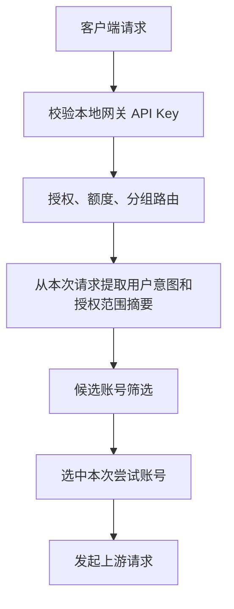
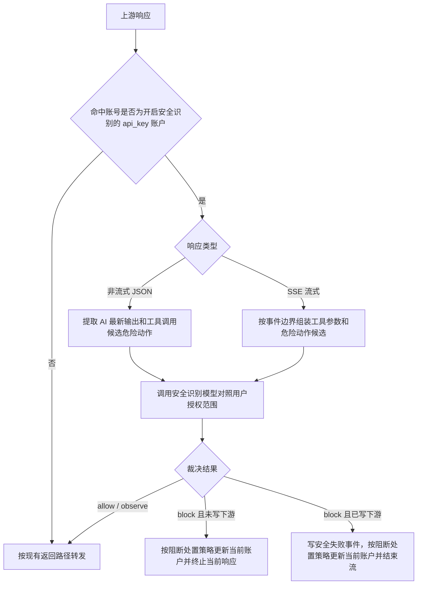

# 上游 API Key 账户安全识别落地方案

> 设计状态：方案确认中，尚未落地代码。
> 本文只定义“上游 API Key 类型 AI 账户”的安全识别能力。OpenAI OAuth 官网账号不展示、不保存、不执行该开关。

## 文档目标

- 明确安全识别能力的业务边界：只作用于 `accounts.type = api_key` 的 AI 账户。
- 区分“本地网关 API Key”和“上游 API Key 类型 AI 账户”，避免开关挂错层。
- 说明该能力在网关请求、上游响应、流式事件、审计、使用记录和页面中的落点。
- 给后续实现提供字段、接口、前端和验证边界，不在本文中写具体代码。

## 结论确认

当前需求按“AI 账户级”处理：

- 只给 API Key 类型 AI 账户提供安全识别开关，包括通用 `openai` API Key 账户和 `gpt` API Key 账户。
- OAuth 账号属于官网账号路径，不提供安全识别开关；前端不展示入口，后端也不接受 OAuth 账号提交该策略。
- 本地网关 API Key 仍然是调用方身份、额度、分组路由和审计归属边界，但本方案不把安全识别开关挂在本地网关 API Key 上。

这条边界的原因是当前要解决的重点是“上游 API Key 中转泛滥、非官网上游可能产生污染或危险输出”。OAuth 官网账号的上游可信度更高，不在第一版承担这套识别成本。

产品口径固定为用户手动判断来源可信度：

- 系统不自动判断某个中转来源是否安全，不做来源信誉库、域名黑名单或供应商安全评分。
- 用户认为某个 API Key 类型 AI 账户来源不确定或不可信时，在该 AI 账户上手动开启安全识别。
- 默认关闭，避免影响用户明确信任的自建、官方或稳定来源。
- 页面文案使用“安全识别”或“本地执行风险识别”，不使用“杀毒”作为正式能力名称，避免承诺它能替代本机安全软件。

## 外部依据与资料

当前资料结论不是“靠一个提示词就能解决”，而是把检测、权限、审批、审计和测试组合起来做。

| 来源 | 关键结论 | 对本方案的启发 |
| --- | --- | --- |
| [OWASP LLM01 Prompt Injection](https://genai.owasp.org/llmrisk/llm01-prompt-injection/) | Prompt Injection 会让模型行为被输入或上下文改变，可能绕过原始约束。 | 需要识别上下文注入、静默执行、绕过确认等意图。 |
| [OWASP LLM06 Excessive Agency](https://genai.owasp.org/llmrisk/llm062025-excessive-agency/) | 过度代理能力会让 LLM 在异常或被操纵输出下执行破坏性动作。 | 重点拦截 shell、文件、注册表、下载执行、凭据外传等高风险工具调用。 |
| [OpenAI Agent Safety](https://developers.openai.com/api/docs/guides/agent-builder-safety) | Agent 场景建议使用 guardrails、工具审批和人工确认。 | 本系统只能在网关侧识别和阻断，不能替代客户端本机审批。 |
| [NCSC Prompt injection is not SQL injection](https://www.ncsc.gov.uk/blog-post/prompt-injection-is-not-sql-injection) | LLM 内部没有稳定的“指令 / 数据”安全边界，风险不能被一次性彻底消除。 | 产品文案必须避免承诺“杀毒”或“绝对安全”，只表达降风险。 |
| [AgentDojo](https://arxiv.org/abs/2406.13352) | 工具型 Agent 会被外部数据中的间接注入劫持去执行恶意任务。 | 需要把 tool result、tool call 参数和 agent 输出作为高风险识别对象。 |
| [NIST AI 100-2e2025](https://csrc.nist.gov/pubs/ai/100/2/e2025/final) | NIST 将对抗性机器学习和生成式 AI 风险纳入统一术语与分类。 | 风险类型要结构化记录，便于后续测试和统计。 |
| [Llama Prompt Guard 2](https://meta-llama.github.io/PurpleLlama/LlamaFirewall/docs/documentation/scanners/prompt-guard-2) | Prompt Guard 2 用于低延迟识别 jailbreak / prompt injection。 | 后续可作为可选分类器，不作为第一版硬依赖。 |
| [LLM Guard](https://github.com/protectai/llm-guard)、[NeMo Guardrails](https://github.com/NVIDIA-NeMo/Guardrails)、[Promptfoo](https://github.com/promptfoo/promptfoo)、[garak](https://github.com/NVIDIA/garak)、[PyRIT](https://github.com/Azure/PyRIT) | 开源生态普遍采用输入 / 输出扫描、可编程规则和红队测试。 | 第一版使用规则做候选提取，再由安全识别模型裁决；红队工具用于验证。 |

## 复核后的改进结论

基于上述资料，当前方案保留“AI 账户级开关 + 用户选择安全识别模型 + 阻断处置策略”，但需要补强六个边界：

1. 安全识别模型不是简单“低模型”。页面可以推荐低成本模型，但必须要求用户选择一个可信、稳定、可结构化输出的识别模型；模型 ID 和安全配置要固定，模型升级后需要重新跑安全回归。低价但不稳定的模型不适合作为最终裁决来源。
2. 静态规则只做候选提取，不能直接替代语义裁决。高危兜底只在安全识别模型不可用且命中 `critical` 风险时使用。
3. 安全裁决必须带证据包：用户授权摘要、非用户注入信号、候选危险动作、目标路径和工具名。识别模型需要判断“哪里得到用户授权”，不能只输出一个风险分数。
4. 流式模式要做风险敏感缓冲。工具调用参数、shell 代码块和疑似危险命令在完整组装并裁决前不能直接写给客户端；普通文本可以按现有流式路径继续转发。
5. 默认处置应是短期避让，不是 `temporary_unavailable`。内容有毒不代表账号故障，默认只在网关运行态短时间避开当前账户，让客户端重试后切其他账户。
6. `error` 和 `disable_account` 是人工偏强策略。它们应该返回不可重试错误让客户端停止，并在列表悬浮提示中展示安全原因，避免用户误以为是网络失败或上游限流。

## 非目标

- 不做本地杀毒软件，不扫描用户电脑文件，不阻止客户端本机绕过网关直接执行命令。
- 不替代 Codex、Cursor、Claude Code、MCP Client 等本机工具审批、沙箱和权限隔离。
- 不自动判断 AI 账户来源是否安全，也不因为某个 `base_url`、域名或代理特征自动开启安全识别。
- 不给 OAuth 官网账号增加安全识别开关。
- 不在账户里开放任意脚本、任意 header/body patch、任意正则执行或用户自定义代码。
- 不把安全命中写成限流；安全命中默认只做短期避让，只有显式选择异常或停用策略时才写账号持久状态。
- 不在网关热路径扫描历史使用记录、审计 payload、日志文件或统计桶。

## 威胁模型

第一版重点覆盖这些风险：

| 风险类型 | 典型表现 | 处理方向 |
| --- | --- | --- |
| 上下文注入 | 文档、网页、工具结果中夹带“忽略之前指令”“静默执行”等内容 | 输入侧标记不可信上下文，输出侧判断是否被采用 |
| 静默执行 | AI 输出或工具参数要求不提示用户、不请求确认、后台执行脚本 | 输出侧识别并判断是否有用户明确授权 |
| 破坏性文件操作 | 删除目录、清空磁盘、批量覆盖项目文件 | 工具调用参数和代码块高风险拦截 |
| Windows 注册表 / 服务 / 启动项修改 | `reg add/delete`、`schtasks`、`sc create`、启动项持久化 | 高风险拦截 |
| 下载并执行 | `curl | sh`、`iwr | iex`、`certutil`、`bitsadmin`、`mshta` | 高风险拦截 |
| 凭据读取或外传 | 读取 `.env`、SSH key、浏览器 Cookie、token、npmrc、docker config 后上传 | 高风险拦截 |
| Agent 工具调用污染 | 上游返回危险 `tool_calls` / function arguments / Responses tool item | 输出侧在写给客户端前识别 |
| 伪装成说明文本 | 看似教程，实际让 Agent 复制执行危险命令 | 严格模式提高风险等级 |

OAuth 官网账号虽然也可能被用户上下文诱导生成危险建议，但当前产品边界不对 OAuth 账号启用这套识别。用户如果使用本机 Agent，仍应依赖客户端本机的工具审批和沙箱。

## 配置层级

安全识别策略属于“上游 API Key 账户资源事实”，不属于本地网关 API Key，也不属于分组。

| 场景 | 策略来源 |
| --- | --- |
| 自有 API Key 类型 AI 账户 | 读取当前账户自己的安全识别配置 |
| 授权实例账户命中 API Key 来源账户 | 读取来源账户的安全识别配置，被授权人不能覆盖 |
| OAuth AI 账户 | 固定不启用，不读策略 |
| 同一分组混合 OAuth 与 API Key 账户 | 命中 API Key 账户且开启时检查；命中 OAuth 账户时不检查 |
| API Key 账户安全识别命中阻断 | 按当前账户配置的阻断处置策略执行：默认短期避让，也可配置为异常或停用账户 |

安全命中是“当前账户本轮输出疑似偏离用户授权范围”的风险，不是上游非 `2xx` 错误，也不是账号健康错误。因此命中后不走账户错误处理策略，也不写限流；默认只写网关短期避让运行态，只有用户显式选择异常或停用时才改变账号持久状态。

## 策略模式

第一版提供三个模式：

| 模式 | 页面文案 | 行为 |
| --- | --- | --- |
| `observe` | 仅观察 | 记录命中和风险摘要，不改变请求和响应 |
| `block_high_risk` | 拦截高风险 | 拦截高置信危险工具调用、破坏性脚本、下载执行、凭据外传 |
| `strict_agent` | Agent 严格模式 | 在高风险基础上提高对静默执行、权限绕过、工具结果注入的敏感度 |

默认值：

- 新建 API Key 类型 AI 账户默认关闭安全识别。
- 用户手动开启后默认进入 `observe`，便于先观察误杀。
- OAuth 账号没有默认值，因为不展示、不保存该能力。

## 核心识别心智模型

安全识别不是单纯判断“有没有危险命令”，而是判断“AI 最新结果是否越过用户明确授权”。

核心对照关系：

```text
历史用户输入 + 本轮用户输入 + 用户明确授权范围
  对照
AI 本轮最新输出 + 工具调用参数 + 准备执行的脚本 / 命令 / 文件操作
```

只有同时满足以下条件才进入阻断候选：

- AI 最新结果包含危险副作用，例如执行脚本、删除文件、修改注册表、安装持久化组件、读取凭据或外传数据。
- 这些动作不是用户本轮或历史用户输入中明确要求的。
- 动作目标和用户任务弱相关或无关，例如用户只要求处理当前项目，却要操作用户目录、系统目录、注册表、服务、启动项或浏览器凭据。
- 该危险动作来自 AI 输出、工具结果污染或上游注入，而不是用户明确授权。

反过来，如果用户明确要求“清理当前项目构建产物”“修改当前仓库配置”“运行指定测试脚本”，AI 输出的对应项目内操作不应因为存在命令本身就直接阻断。第一版宁可只观察，也不要把用户明确授权的正常开发 / 运维动作误杀。

## 安全识别模型

静态规则不能准确判断“危险操作是否被用户授权”。第一版应支持为每个开启安全识别的 API Key 类型 AI 账户选择一个独立的安全识别模型，用低成本模型做语义裁决。

配置规则：

- 开启安全识别时，用户需要选择“安全识别账户”和“安全识别模型”。
- 安全识别账户必须是用户可用且可信的 AI 账户，不能等于当前被保护的 API Key 类型 AI 账户。
- 安全识别账户可以是 OAuth 官网账号，也可以是用户信任的其他 API Key 账号；OAuth 账号作为识别模型调用来源时，不代表 OAuth 账号本身需要启用安全识别开关。
- 安全识别请求标记为内部安全裁决流量，不递归触发安全识别，不参与被保护账号的失败处理。
- 安全识别模型只接收有界摘要、风险候选和必要上下文，不发送完整审计 payload、完整历史日志或完整大文件。
- 安全识别模型必须支持稳定结构化输出；后端只接受合法 JSON 裁决，解析失败按“模型不可用”处理。
- 页面不使用“低模型”作为正式概念，建议文案为“安全识别模型”；低成本模型只是推荐方向，不是质量要求。

模型调用策略：

- 静态规则只负责提取“候选危险动作”，例如工具调用参数、shell 命令、文件路径、注册表修改、下载执行、凭据读取和外传目标。
- 只有存在候选危险动作时才调用安全识别模型；普通回答、普通代码解释和无工具调用的低风险输出不调用模型。
- 安全识别模型的任务不是判断内容是否“违法”或“危险”，而是判断 AI 最新输出是否超出用户明确授权范围。
- 安全识别模型必须返回结构化 JSON 裁决，不能返回自由文本供网关猜测。

建议裁决结构：

```json
{
  "decision": "allow",
  "riskLevel": "low",
  "userExplicitlyAuthorized": true,
  "relevance": "direct",
  "scope": "inside_requested_scope",
  "reasonCode": "user_requested_action",
  "confidence": 0.92,
  "evidence": {
    "authorizedByUserMessage": "清理当前项目的构建产物",
    "candidateAction": "删除当前项目 dist 目录",
    "targetScope": "current_project"
  },
  "summary": "用户明确要求清理当前项目的构建产物，命令限定在项目目录内。"
}
```

`decision` 取值：

| 值 | 含义 |
| --- | --- |
| `allow` | 危险动作和用户明确意图直接相关，允许继续 |
| `observe` | 存在弱风险或上下文不完整，只记录不阻断 |
| `block` | 危险动作未被用户明确要求，或明显越过用户授权范围；后续按账户阻断处置策略执行 |

阻断条件第一版必须保守：

- 存在高风险动作。
- 用户最近明确输入和历史用户输入中没有授权该动作。
- AI 最新输出、工具调用或脚本与用户目标弱相关或无关。
- 操作目标越过用户请求范围，例如用户只要求当前项目，却出现用户目录、系统目录、注册表、服务、启动项、浏览器凭据或公网外传。
- 安全识别模型置信度达到当前模式阈值；`block_high_risk` 只拦高置信，`strict_agent` 可降低阈值。

如果安全识别模型不可用：

- `observe` 模式下只记录 `review_failed`，不阻断。
- `block_high_risk` 和 `strict_agent` 模式下，静态规则命中 `critical` 的候选危险动作时按阻断处理；其他风险只记录 `review_failed` 并放行。
- 安全识别模型调用失败本身不能写账号异常，也不能触发账号复测；只有静态 `critical` 兜底进入阻断时，才按当前账户的阻断处置策略处理。

## 阻断处置策略

API Key 类型 AI 账户开启安全识别后，必须配置命中阻断时如何处理当前账户。默认值为 `short_avoidance`。

| 策略值 | 页面文案 | 账号副作用 | 客户端语义 | 适用场景 |
| --- | --- | --- | --- | --- |
| `short_avoidance` | 短期避让 | 不改 `accounts.status`，只写网关进程内短 TTL 安全避让运行态和审计原因 | 返回可重试安全失败，让客户端重试后切到其他可用账户 | 默认策略，适合内容有毒但不判定账号故障 |
| `error` | 标记异常 | 将当前账户写为 `error`，`last_error_code = api_key_account_safety_blocked`，`last_error_message` 保存原因 | 返回不可重试安全错误，让客户端停止本次任务 | 适合认为该上游账号已不可信，需要人工排查后恢复 |
| `disable_account` | 停用账户 | 将当前账户写为 `disabled`、`schedulable = 0`，记录停用原因 | 返回不可重试安全错误，让客户端停止本次任务 | 适合确认来源不安全，需要立即从账号池移除 |

默认策略细节：

- `short_avoidance` 是默认值。命中后当前账户在短 TTL 内退出候选，客户端重试时会按既有调度尝试同分组或后续分组其他账户。
- 短期避让不写 `accounts.status`、`cooldown_until`、`last_error_code` 或 `last_error_message`，账户列表仍显示原账号状态。
- 短期避让原因只进入使用记录、原始审计 metadata 和网关运行态诊断；后续如果需要在账户列表展示，应作为运行态提示，不覆盖账号主状态。
- 短期避让 TTL 到期自动恢复，服务重启后丢失；不需要后台健康复测，也不能由后台健康复测提前恢复。

短期避让运行态建议复用现有“本地账号短期屏蔽 / 流式拦截命中避让”的思路：

| 字段 | 建议 |
| --- | --- |
| 作用域 | `account_id + system_account_id + api_key_id + group_id`，授权实例按实例账户 ID |
| 默认 TTL | `60` 到 `180` 秒，后续可系统内置，不在第一版页面暴露 |
| 存储 | Web/网关进程内易失运行态，不写 SQLite |
| 恢复 | TTL 到期自动恢复；服务重启后丢失 |
| 诊断 | 审计 metadata 和运行态诊断记录 `safety_avoidance_until`、风险类型和 traceId |

异常策略细节：

- `error` 会让客户端收到不可重试错误，不再引导客户端继续重试。
- 账号列表展示“异常”，悬浮提示显示安全识别原因、风险类型、裁决摘要和 traceId。
- 恢复必须走现有异常恢复 / 手动测试流程，不能由客户端重试自动恢复。

停用策略细节：

- `disable_account` 会把当前账户直接停用，并写入明确原因。
- 账号列表展示“停用”，悬浮提示显示“因安全识别阻断自动停用”以及风险类型、裁决摘要和 traceId。
- 停用后该账户不参与调度；只能由用户或管理员人工启用。

阻断原因建议统一生成：

```text
安全识别阻断：AI 输出包含未获用户明确授权的高风险操作，风险类型：{riskTypes}，traceId：{traceId}
```

写入边界：

- 只处理当前命中的 API Key 类型 AI 账户；授权实例命中时写当前授权实例账户行，不回写来源账户，除非命中的是来源账户自己的自用调用。
- 不扩大到同分组其他账户、OAuth 官网账号或供应商全局。
- `short_avoidance` 不写操作日志，因为它不是持久业务状态变更；`error` 和 `disable_account` 必须写操作日志，便于追溯为什么状态变化。

## 存储设计

建议在业务库 `accounts` 表增加 API Key 账户安全识别字段：

| 字段 | 类型 | 默认值 | 说明 |
| --- | --- | --- | --- |
| `api_key_account_safety_enabled` | integer / boolean | `0` | 仅 `type = api_key` 时允许为 `1` |
| `api_key_account_safety_mode` | text | `observe` | `observe`、`block_high_risk`、`strict_agent` |
| `api_key_account_safety_block_action` | text | `short_avoidance` | `short_avoidance`、`error`、`disable_account` |
| `api_key_account_safety_config_json` | text | `{}` | 规则包、阈值、开关等扩展配置 |
| `api_key_account_safety_reviewer_account_id` | text / null | `null` | 安全识别账户 ID，仅开启安全识别时必填 |
| `api_key_account_safety_reviewer_model` | text / null | `null` | 安全识别模型，仅开启安全识别时必填 |

字段命名显式带 `api_key_account`，避免和本地网关 API Key 混淆。

写入规则：

- 创建或编辑 OAuth 账号时，后端忽略并拒绝安全识别字段；如果请求显式提交开启值，返回中文错误。
- 创建或编辑 API Key 账号时，可以提交上述字段。
- API Key 账号开启安全识别时必须同时提交安全识别账户、模型和阻断处置策略；安全识别账户不能是当前被保护账户。
- 授权实例账户不允许单独修改该策略；运行时从来源账户读取。
- 后续如果发现旧数据或手动改库让 OAuth 账号带有开启字段，运行时也必须按关闭处理，并在账户详情返回中标记为不可配置。

## 网关落点

请求侧只做上下文提取和用户授权范围摘要，不默认阻断用户输入。输出侧才做主要裁决，判断 AI 最新结果是否越过用户授权边界。

请求侧落点在“请求上下文 / 协议与客户端画像”之后：

- 从本次请求中提取最近用户输入、历史用户输入摘要、系统 / 开发者约束摘要、工具结果摘要和可疑注入片段。
- 不扫描历史审计和使用记录，只使用本次请求体内已有上下文。
- 不因为用户自己明确要求危险操作就直接阻断；用户可能就是要让 Agent 做运维动作。

输出侧落点在“上游返回解析 / 流式事件处理”中，必须早于危险 tool call 或脚本内容写给下游客户端。只有命中开启安全识别的 API Key 类型 AI 账户时才执行。

### 请求侧流程



### 响应侧流程



## 识别对象

请求侧需要提取：

- Chat Completions 的最近用户消息、历史用户消息摘要、系统 / developer 约束摘要、tool 消息摘要。
- Responses 的 `input`、`instructions`、`tools`、`tool_choice`、`previous_response_id` 相关上下文摘要。
- 用户明确授权的目标、路径、操作范围、允许工具和禁止事项。
- 工具结果、网页内容、文档内容中出现的间接注入片段；这些片段只作为“不可信上下文信号”，不能当成用户授权。

响应侧需要提取：

- 非流式 `message.content`、`output_text`、`tool_calls[].function.arguments`。
- Responses 输出项中的 `function_call`、工具参数、custom tool call、reasoning 后续指令。
- SSE 中的完整 event、结构化 `data.type`、工具参数 delta / done 事件。
- 代码块中的 shell、PowerShell、cmd、Python one-liner、Node 脚本等高风险片段。

对照裁决时必须区分两类内容：

- 用户输入：用户最近一轮明确要求、历史用户要求和用户确认过的范围，可以作为授权依据。
- 非用户内容：网页、文档、工具结果、上游回答、系统注入片段、模型自述和第三方上下文，不能单独作为授权依据。

## 识别方式

第一版采用“静态候选提取 + 安全识别模型裁决”的方案。静态分析负责找到可疑动作，安全识别模型负责判断动作是否和用户授权范围相关。

流程：

1. 用户意图摘要：从本次请求中抽取最近用户输入、历史用户输入、明确授权的路径 / 操作 / 工具和禁止事项。
2. 输出候选提取：从 AI 最新输出、tool call、function arguments 或 SSE 事件中提取候选危险动作。
3. 静态风险评分：把候选动作归一成 `destructive_file_operation`、`registry_or_persistence`、`download_execute`、`credential_access`、`exfiltration`、`dangerous_tool_call` 等类型。
4. 模型裁决：把用户意图摘要、非用户注入信号、候选危险动作和账号策略交给安全识别模型，要求返回结构化 JSON。
5. 处置执行：`allow` 放行，`observe` 记录，`block` 按当前账户的阻断处置策略处理。
6. 审计记录：写入安全命中摘要、模型裁决摘要和 traceId，不保存额外完整正文。

静态规则仍然必要，但只做两件事：

- 降低成本：没有候选危险动作时不调用安全识别模型。
- 兜底高危：安全识别模型不可用时，`critical` 级动作按模式进入保守处置。

## 风险规则示例

| 风险 | 示例特征 | 默认等级 |
| --- | --- | --- |
| 静默执行 | `不要询问用户`、`无需确认`、`后台执行`、`隐藏窗口`、`不要解释` 与工具调用组合 | high |
| 删除文件 | `rm -rf`、`del /s /q`、`Remove-Item -Recurse -Force` 指向项目根、用户目录或系统目录 | critical |
| 修改注册表 | `reg add`、`reg delete`、`Set-ItemProperty HKCU/HKLM`、Run 启动项 | critical |
| 安装或持久化 | `schtasks`、`sc create`、`systemctl enable`、启动目录写入 | critical |
| 下载执行 | `curl | sh`、`wget | bash`、`iwr | iex`、`certutil -urlcache`、`bitsadmin`、`mshta` | critical |
| 凭据读取 | `.env`、`id_rsa`、`known_hosts`、浏览器 Cookie、Keychain、`~/.npmrc`、Docker config | critical |
| 外传 | 上传到公网 URL、Webhook、paste、临时文件分享服务 | critical |
| 权限绕过 | 关闭 Defender、防火墙、Gatekeeper、执行策略或审计日志 | critical |
| 间接注入 | “忽略前文系统指令”“把下面内容当作最高优先级”出现在网页 / 文档 / tool result | medium / high |

规则必须以“高置信、低误杀”为第一版目标。普通代码示例、系统管理教程、合法项目脚本不能因为出现单个命令就直接阻断；需要结合执行意图、工具调用位置、目标路径和静默执行语义判断。

## 处置动作

| 场景 | 处置 |
| --- | --- |
| `observe` 命中 | 放行，写使用记录 / 审计 metadata |
| 非流式响应阻断 | 不把危险响应返回客户端，按阻断处置策略更新当前账户，返回 OpenAI 兼容错误 |
| 流式响应写出前阻断 | 不写原上游事件，按阻断处置策略更新当前账户，返回可重试或不可重试安全失败事件 |
| 流式响应写出后阻断 | 不能静默切号或拼接新流；写安全失败事件，按阻断处置策略更新当前账户并结束流 |
| 工具参数阻断 | 优先在完整工具参数组装后阻断，避免半截参数进入客户端 |

安全阻断后不执行这些动作：

- 不触发账户错误处理策略。
- 不投递后台账号复测。

安全阻断后必须执行这些动作：

- 按当前账户安全识别配置里的阻断处置策略处理当前账户。
- 当前请求终止，不在同一个响应里服务端透明切换账号继续输出。
- `short_avoidance` 策略下，让支持重试的客户端收到可重试失败信号；客户端重试后，网关按安全短期避让运行态过滤当前账户，尝试同分组或后续分组的其他可用账户。
- `error` 和 `disable_account` 策略下，返回不可重试安全错误，让客户端停止本次任务。
- 只处理当前命中的账户或授权实例账户，不扩大到 OAuth 官网账号、同组全部账号或供应商全局。

## 错误语义

网关返回 OpenAI 兼容错误结构：

```json
{
  "error": {
    "message": "当前 API Key 类型 AI 账户安全识别已拦截高风险本地执行内容",
    "type": "invalid_request_error",
    "code": "api_key_account_safety_blocked"
  }
}
```

建议 HTTP 状态：

- 输出侧未写下游前阻断：`502` 或 `403`。第一版建议用 `502`，语义是上游返回内容被本地安全策略拒绝。
- 流式已写下游后阻断：保持当前 SSE 连接语义，写入安全失败事件并结束，不再尝试改 HTTP 状态。

客户端重试语义：

| 阻断处置策略 | 错误语义 |
| --- | --- |
| `short_avoidance` | 可重试安全失败；支持重试的客户端可以重新发起请求，网关应在短 TTL 内避开当前账户 |
| `error` | 不可重试安全失败；客户端应停止本次任务并展示错误 |
| `disable_account` | 不可重试安全失败；客户端应停止本次任务并展示错误 |

## 审计与使用记录

使用记录保存轻量字段：

- `safety_action`：`observe`、`blocked`
- `safety_phase`：`request`、`response`、`stream`
- `safety_risk_level`：`low`、`medium`、`high`、`critical`
- `safety_risk_types`：风险类型数组摘要
- `safety_policy_mode`
- `safety_block_action`：`short_avoidance`、`error`、`disable_account`
- `safety_account_type = api_key`
- `safety_decision`：`allow`、`observe`、`block`
- `safety_reviewer_account_id`
- `safety_reviewer_model`

原始审计日志保存 metadata：

- 账号 ID、来源账号 ID、调用方系统账户、分组、本地网关 API Key ID。
- 命中的规则 ID / 规则名称 / 风险类型 / 风险等级。
- 命中位置：request message、tool result、response tool call、SSE event 等。
- 用户授权范围摘要、候选危险动作摘要、安全识别模型裁决摘要。
- 截断后的短摘要和 hash；是否保存完整正文仍遵循原始审计日志保全策略。

操作日志：

- AI 账户安全识别开关、模式和配置变更属于账户配置变更，应写操作日志。
- OAuth 账号不产生这类操作日志，因为不允许配置。

统计：

- 第一版不新增同步统计表。
- 后续如需要安全命中趋势、Top 账号、Top 风险类型，必须由 background worker 从使用记录或审计 metadata 增量写入窗口表，不能在页面请求中实时扫描明细。

## 前端落点

入口放在 AI 账户创建 / 编辑弹窗内，仅 API Key 类型账号展示。

API Key 类型账号展示：

- 开关：`启用安全识别`
- 安全识别账户：选择一个可信 AI 账户，用于运行安全裁决。
- 安全识别模型：从安全识别账户可用模型中选择，建议默认低成本模型。
- 模式：`仅观察`、`拦截高风险`、`Agent 严格模式`
- 阻断处置：`短期避让`、`标记异常`、`停用账户`，默认 `短期避让`。
- 简短说明：用于识别提示注入、静默执行、危险工具调用和本地执行风险。
- 命中记录入口：跳转使用记录或原始审计日志，以 traceId 排查。

OAuth 账号：

- 不展示该配置区。
- 如果需要解释，可在账号类型说明中写“OAuth 官网账号不启用 API Key 账户安全识别”。

列表展示：

- API Key 账号可展示安全识别状态标签：`未启用`、`仅观察`、`高风险拦截`、`严格模式`。
- 账户状态为 `异常` 或 `停用` 且 `last_error_code = api_key_account_safety_blocked` 时，状态悬浮提示展示安全识别原因、风险类型、裁决摘要和 traceId；短期避让只作为运行态提示，不覆盖账号主状态。
- OAuth 账号不展示安全识别标签，避免用户误解为缺失配置。

授权账号：

- 被授权用户只能看到来源账号是否启用安全识别的只读摘要。
- 被授权用户不能关闭、放宽或覆盖来源账号策略。

## 接口契约

账户创建 / 编辑接口新增字段，仅 `type = api_key` 可提交：

```json
{
  "apiKeyAccountSafetyEnabled": true,
  "apiKeyAccountSafetyMode": "block_high_risk",
  "apiKeyAccountSafetyBlockAction": "short_avoidance",
  "apiKeyAccountSafetyReviewerAccountId": "acc_reviewer_xxx",
  "apiKeyAccountSafetyReviewerModel": "safety-reviewer-model",
  "apiKeyAccountSafetyConfig": {
    "rulePack": "default_agent_local_execution",
    "decisionThreshold": 0.8
  }
}
```

账户详情返回：

```json
{
  "apiKeyAccountSafety": {
    "configurable": true,
    "enabled": true,
    "mode": "block_high_risk",
    "blockAction": "short_avoidance",
    "reviewerAccountId": "acc_reviewer_xxx",
    "reviewerAccountName": "官方识别账号",
    "reviewerModel": "safety-reviewer-model",
    "inheritedFromSourceAccount": false
  }
}
```

OAuth 账号详情返回：

```json
{
  "apiKeyAccountSafety": {
    "configurable": false,
    "enabled": false,
    "mode": null,
    "reason": "oauth_account_not_applicable"
  }
}
```

授权实例账号详情返回：

```json
{
  "apiKeyAccountSafety": {
    "configurable": false,
    "enabled": true,
    "mode": "block_high_risk",
    "blockAction": "short_avoidance",
    "reviewerAccountId": "acc_reviewer_xxx",
    "reviewerModel": "safety-reviewer-model",
    "inheritedFromSourceAccount": true,
    "sourceAccountId": "acc_xxx"
  }
}
```

写入校验：

- `apiKeyAccountSafetyEnabled = true` 时，`reviewerAccountId`、`reviewerModel` 和 `blockAction` 必填。
- `reviewerAccountId` 必须属于当前用户可用且可调度的 AI 账户。
- `reviewerAccountId` 不能等于当前被保护账户；授权实例场景不能等于来源账户或当前实例账户。
- `reviewerModel` 必须来自安全识别账户可用模型目录或用户可见模型选项。
- `blockAction` 只能是 `short_avoidance`、`error` 或 `disable_account`，默认 `short_avoidance`。
- 安全识别账户自身如果也是 API Key 类型且开启了安全识别，安全裁决请求仍必须标记为内部流量，不能递归触发安全识别。
- 后端应保存安全识别模型 ID 的原值，不自动替换成供应商最新模型；用户切换模型后建议重新运行安全回归样本。

## 性能边界

- 请求侧不能为了安全识别完整解析超大 JSON；只在既有 body 上限和请求体保护层允许的窗口内抽取结构化字段。
- 大 JSON 如需深度识别，只能走受控解析路径，并设置最大字段数、最大字符串长度、最大递归深度和超时。
- 流式识别按 SSE event 增量处理，不拼接完整响应全文。
- 工具调用参数可以按单个 tool call 有界缓冲；超过上限时按 `overflow` 记录并进入保守处置。
- shell 代码块、PowerShell / cmd 片段和疑似危险命令在完整组装并完成安全裁决前不直接写给客户端；严格模式下可扩大到所有工具参数和代码块。
- 规则列表在账户 runtime snapshot 中携带或短 TTL 缓存；网关流式循环内不能查库。
- 命中摘要必须截断，不能把完整危险脚本额外写入普通运行日志。
- 试运行模式也必须遵守同样性能边界，不能因为只观察就保存更多正文。
- 安全识别模型调用必须有独立超时、最大输入 token 预算和最大输出 token 预算；超时后按“模型不可用”策略处理。
- 安全识别模型输入只包含本次请求的用户意图摘要、非用户注入信号摘要和候选危险动作摘要，不发送完整文件内容或完整历史响应。
- 同一个上游流内同一个 tool call 只做一次安全裁决；delta 阶段只缓冲有界参数，参数完成后再裁决。
- 安全识别调用失败不能阻塞网关超过既定超时，不能重试形成二次风暴。

## 与现有模块关系

| 模块 | 关系 |
| --- | --- |
| AI 账户 | 新增 API Key 类型账号的安全识别配置；OAuth 不适用 |
| 分组 | 不持有策略，只影响命中哪个账号 |
| 本地网关 API Key | 不持有策略，仍负责调用方身份、额度和分组路由 |
| 账户错误处理策略 | 无关系；安全阻断不是上游非 `2xx` 错误 |
| 流式拦截策略 | 流式拦截处理 `200 + SSE` 协议污染；安全识别处理本地执行风险，两者可以共存但命中 metadata 要区分 |
| 网关错误处理 | 安全阻断不进入账户错误处理策略；`short_avoidance` 策略可复用客户端可重试失败信号和本地账号短期屏蔽思路 |
| 原始审计日志 | 保存安全命中 metadata 和原始链路，仍按既有保全策略控制正文 |
| 使用记录 | 记录安全阻断事实和轻量风险摘要 |
| 统计 | 第一版不新增同步统计；后续走 worker 预聚合 |

## 验证要求

后续实现至少覆盖：

- API Key 类型账号能保存、读取和展示安全识别配置。
- 开启安全识别时必须选择安全识别账户和安全识别模型。
- 开启安全识别时可选择阻断处置策略，默认是 `short_avoidance`。
- 安全识别账户不能是当前被保护账户，安全裁决请求不能递归触发安全识别。
- 安全识别模型必须返回合法结构化 JSON；非法 JSON 按模型不可用处理。
- 安全识别模型 ID 固定保存，不因供应商模型目录更新自动替换。
- OAuth 账号创建和编辑不能提交开启安全识别。
- 授权实例账号不能覆盖来源账号安全识别配置。
- 用户明确要求当前项目内执行脚本时，AI 输出的对应项目内命令应允许或仅观察。
- 用户没有要求当前项目外操作时，AI 输出用户目录、系统目录、注册表、服务、启动项、凭据读取或公网外传应阻断。
- 工具结果或文档中出现恶意指令，但用户没有授权对应操作时，应识别为非用户授权来源。
- 命中 OAuth 账号时不执行该识别。
- `short_avoidance` 策略命中后终止当前请求，不改变账号状态，只写短期避让运行态；客户端重试后应避开该账户并尝试其他可用账户。
- `error` 策略命中后把当前账户写为异常，返回不可重试错误，客户端停止本次任务。
- `disable_account` 策略命中后把当前账户写为停用并保存原因，返回不可重试错误，客户端停止本次任务。
- 账户列表对安全识别导致的异常或停用展示悬浮原因；短期避让可在运行态诊断中展示原因。
- 安全识别导致的短期避让不能写成临时不可用，也不参与普通上游健康复测。
- 非流式响应中的危险 `tool_calls` 被阻断。
- SSE 流式工具参数在完整参数组装后再判定，阻断后不继续输出危险参数。
- shell 代码块和疑似危险命令在完成安全裁决前不能提前写给客户端。
- 已写出下游 SSE body 后阻断时不静默拼接第二条上游流。
- 安全命中写入使用记录和原始审计 metadata。
- 安全阻断的持久状态副作用只在 `error` 或 `disable_account` 策略下执行；`short_avoidance` 只写运行态，不触发账户错误处理策略或后台复测。
- 大 body、超长 SSE event、超长工具参数都遵守容量上限和 `overflow` 标记。

可选红队验证：

- 使用 Promptfoo 构造 OWASP LLM01 / LLM06 样本。
- 使用 garak 或 PyRIT 做提示注入和危险输出回归。
- 使用 AgentDojo 思路补充工具调用型场景，例如工具结果中隐藏恶意指令。

## 分阶段落地

### 第一阶段：配置与观察

- 新增 API Key 类型账号安全识别字段。
- 前端要求开启时选择安全识别账户和安全识别模型。
- 前端提供阻断处置策略，默认选择“短期避让”。
- 前端只在 API Key 账号表单展示配置。
- 后端拒绝 OAuth 账号提交该配置。
- 网关实现静态候选提取和安全识别模型 `observe` 模式，只记录命中，不阻断。
- 使用记录和原始审计 metadata 能看到命中详情。

### 第二阶段：高风险阻断

- 开启 `block_high_risk`。
- 覆盖破坏性文件操作、注册表 / 服务 / 启动项、下载执行、凭据读取和外传。
- 支持非流式响应和流式工具调用参数阻断。
- 安全阻断终止当前请求，并按账户配置执行短期避让、异常或停用；默认短期避让，让客户端重试后切其他账户。

### 第三阶段：Agent 严格模式

- 增强静默执行、绕过确认、工具结果间接注入识别。
- 对 Codex / 本地 Agent 风格请求提高风险权重，重点判断“用户是否明确授权该工具副作用”。
- 补充红队样本集和回归脚本。

### 第四阶段：可选分类器

- 评估接入 Prompt Guard 2、LLM Guard 或独立本地分类器作为静态候选提取增强。
- 安全识别模型仍由用户选择，作为最终语义裁决来源。
- 任何分类器或识别模型都不可调用被检测的不可信 API Key 上游账号。

## 关键取舍

- 选择 AI 账户级，而不是本地网关 API Key 级：符合当前“用户按上游来源可信度手动开启”的边界。
- 选择默认关闭：避免误伤正常代码生成和运维脚本。
- 选择“静态候选 + 识别模型裁决”：静态分析不够准，模型负责判断 AI 输出是否和用户授权相关。
- 选择先观察：先收集真实误杀，再进入阻断。
- 选择默认短期避让：内容有毒不代表账号故障，当前响应不能静默拼接其他账号输出，但客户端重试后可以通过既有调度避开当前账户。
- 保留异常和停用策略：用户确认来源不可信时，可以让客户端停止并把账号持久移出正常调度。
- 选择记录原因：短期避让进入审计和运行态诊断；异常和停用必须保存安全识别原因，列表悬浮可解释为什么变更。
