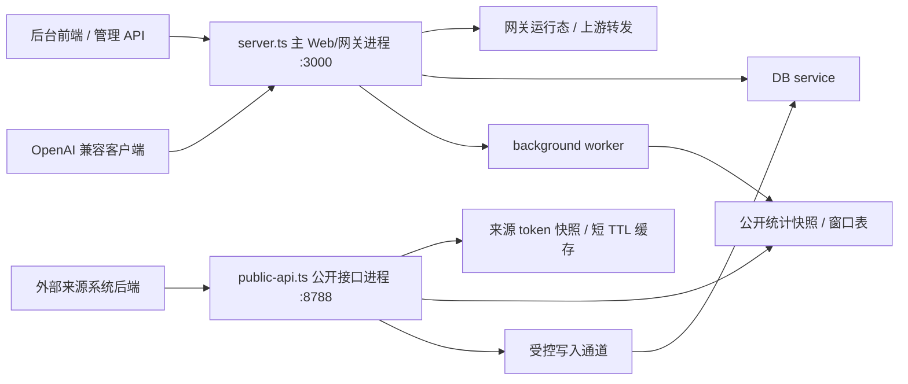

# 公开接口独立进程设计

> 面向 `juhe-ai` 后端、部署维护者和后续 AI 维护者。
> 本文是已评估但暂不实施的备选设计。现状仍是主 Web/网关进程代理 `/__aipublic__` 到 DB service；独立进程方案因改造成本和部署复杂度较高，当前不进入实施计划，仅作为后续公开接口流量明显增大时的参考。

## 背景

公开接口面向外部来源系统，调用方和流量形态与后台管理、OpenAI 兼容网关不同。它可能被第三方后端定时拉取、重试、压测，也可能暴露在单独公网域名下。即使当前业务逻辑在 DB service 中执行，只要入口还挂在主 Web/网关进程，公开接口就会占用主进程 socket、代理 in-flight、请求上下文、CORS 和超时处理资源。

核心网关是项目主业务入口，必须优先保证稳定。公开接口应按“外部集成边界”处理，不能让调用方异常影响后台登录、管理 API、网关转发、API Key 校验和账号调度。

## 评估结论

- 暂不把 `/__aipublic__` 从主 Web/网关进程中剥离。
- 暂不新增 `public-api` 独立进程、独立端口和额外常驻部署要求。
- 当前优先维持既有 DB service 代理边界，通过代理 in-flight、来源 token 限频、请求体上限、公开接口日志和查询 guard 控制风险。
- 后续只有在公开接口流量、调用方数量或公网暴露强度明显上升时，再重新打开本方案。

## 备选目标

- 新增独立 `public-api` 进程，单独监听公开接口端口。
- 主 Web/网关进程不再挂载 `/__aipublic__`，也不代理公开接口请求。
- 公开接口鉴权、限频、请求体解析、超时、日志和错误返回全部在 `public-api` 进程内完成。
- 公开读接口只读预聚合或公开快照，不在请求路径扫描 `usage_records`、usage shard、审计表或统计缓存桶。
- 公开写接口使用严格的来源 scope、低并发上限、短超时和有界队列 / DB service 调用，不能无限等待或拖慢核心请求。
- `public-api` 进程崩溃、被打满或重启，不影响主 Web/网关进程已经建立的请求和运行态。

## 不目标

- 不引入 Redis、Kafka、BullMQ 或重型网关。
- 不支持多实例共享限频状态；当前仍按单机多进程边界设计。
- 不让浏览器直接持有来源 token。来源 token 仍只放第三方后端配置。
- 不把公益站用户、排行榜业务快照、IP 到用户归属放进 `sub2api-lite`。
- 不在运行时代码里保留旧入口兼容分支。切换完成后主端口访问 `/__aipublic__` 应返回 404 或由反向代理层明确拒绝。

## 备选目标拓扑



若未来实施，设计要点：

- `server.ts` 将继续承载 `/__aisys__`、`/*`、`/v1/*`、静态资源、DB service 和 worker 看护，但不再代理 `/__aipublic__`。
- `public-api.ts` 将只承载 `/__aipublic__/*`，默认不提供后台页面和网关入口。
- `public-api` 不由主 Web/网关进程看护，常驻运行由部署层负责，例如 PM2、systemd、NSSM 或任务计划程序。
- 公开接口和主业务可以通过反向代理拆成不同域名，也可以同机不同端口部署。

## 进程职责

| 进程 | 职责 | 禁止事项 |
| --- | --- | --- |
| 主 Web/网关进程 | 后台静态资源、`/__aisys__/api/*` 代理、网关请求、网关运行态、DB service / worker 看护 | 若实施独立进程，则不挂载 `/__aipublic__`，不解析公开接口 body，不执行公开接口鉴权 |
| DB service | 管理 API、受控业务库读写、系统内部 API、低频诊断入口 | 不承担公开接口入口流量排队；公开写入必须有独立上限 |
| background worker | 使用记录聚合、统计窗口、公开快照刷新、审计和日志批量落库 | 不接收无界公开请求任务 |
| public-api | 来源 token 鉴权、公开接口限频、公开读快照、公开写入调度、公开接口日志 | 不承载网关转发，不访问上游 OpenAI，不执行后台管理登录态接口 |

## 端口与配置

新增配置建议：

```env
JUHE_AI_PUBLIC_API_ENABLED=false
JUHE_AI_PUBLIC_HOST=127.0.0.1
JUHE_AI_PUBLIC_PORT=8788
JUHE_AI_PUBLIC_REQUEST_BODY_LIMIT=256kb
JUHE_AI_PUBLIC_REQUEST_TIMEOUT_MS=10000
JUHE_AI_PUBLIC_MAX_IN_FLIGHT=64
JUHE_AI_PUBLIC_WRITE_MAX_IN_FLIGHT=8
JUHE_AI_PUBLIC_AUTH_CACHE_TTL_SECONDS=60
JUHE_AI_PUBLIC_BAD_TOKEN_CACHE_TTL_SECONDS=30
JUHE_AI_PUBLIC_SNAPSHOT_MAX_STALENESS_SECONDS=300
```

配置规则：

- 默认关闭独立公开接口进程，避免升级后意外开放新端口；实施完成后由部署文档明确开启方式。
- `JUHE_AI_PUBLIC_HOST` 生产默认建议绑定 `127.0.0.1`，公网暴露交给 Nginx / Caddy / 隧道服务。
- `JUHE_AI_PUBLIC_PORT` 必须不同于 `JUHE_AI_PORT`。
- 公开接口请求体上限默认跟系统 API 一致或更低；公开资源写入不允许大 payload。
- 公开写入并发上限必须显著低于读取上限，避免外部来源批量写入拖慢业务库。

## 路由边界

目标状态：

```text
主端口：
GET  /__aisys__/health
ANY  /__aisys__/api/*
ANY  /v1/*
ANY  /*

公开端口：
GET  /__aipublic__/demo/source-auth
GET  /__aipublic__/account/usage
GET  /__aipublic__/ip/usage
GET  /__aipublic__/consumption/ranking
GET  /__aipublic__/access/info
GET  /__aipublic__/group/list
GET  /__aipublic__/api-key/list
GET  /__aipublic__/account/list
POST /__aipublic__/group/add|update|del
POST /__aipublic__/api-key/add|update|del
POST /__aipublic__/account/add|update|del
```

主端口不再保留 `/__aipublic__` 代理。需要同时对外提供后台和公开接口时，由反向代理显式分流：

```nginx
location /__aisys__/ {
    proxy_pass http://127.0.0.1:3000;
}

location /v1/ {
    proxy_pass http://127.0.0.1:3000;
}

location /__aipublic__/ {
    proxy_pass http://127.0.0.1:8788;
}
```

如果使用独立域名，推荐：

```text
后台和网关：api.example.com -> 127.0.0.1:3000
公开接口：public-api.example.com -> 127.0.0.1:8788
```

## 来源鉴权运行时

公开接口仍只认：

```http
Authorization: Bearer <source_token>
```

鉴权目标状态：

1. `public-api` 读取 Bearer token。
2. 先查坏 token 负缓存，命中直接返回 `401 external_source_unauthorized`。
3. 对 token 做 hash，查来源 token 正缓存。
4. 缓存 miss 时通过受控读路径加载来源、token、scope、过期时间和限频配置。
5. 校验来源和 token 状态、过期时间、接口 scope。
6. 执行 `public-api` 进程内来源限频。
7. 进入具体公开接口。

缓存策略：

- 正缓存只保存脱敏的来源上下文、scope、过期时间、限频规则和 token ID，不保存明文 token。
- 无效 token 必须有短 TTL 负缓存，避免被扫时放大成数据库点查。
- 来源授权和 token 增删改后，后台管理写路径需要通知 public 运行态失效，通知失败时最多等待 TTL 自然过期。
- `last_used_at` 继续低频更新，不能每次公开请求都写业务库。

## 数据读取边界

公开读接口必须优先读取公开快照或已成形窗口表：

| 接口 | 数据来源 | 请求路径禁止 |
| --- | --- | --- |
| `/account/usage` | `usage_scope_range_windows` 或后续公开账号快照 | 扫 usage shard、临时 `SUM/GROUP BY` |
| `/ip/usage` | `client_ip_usage_range_windows`、`client_ip_registry` 或后续公开 IP 快照 | 搜索 IP hash、回扫明细 |
| `/consumption/ranking` | IP 范围窗口 TopN 或公开排行快照 | 请求时现场计算全量 TopN |
| `/access/info` | 静态契约 + 公开快照状态 | 返回内部凭据、普通 API Key、系统账户关系 |
| 资源列表 | 当前用户控制面索引查询或后续公开对账快照 | 返回上游凭据、API Key 明文、加密字段 |

推荐演进：

- 第一阶段：独立 `public-api` 进程仍复用现有 repository，但必须保持查询窗口、分页上限和索引约束。
- 第二阶段：worker 刷新 `public_*` 快照表或独立公开快照 SQLite 文件，`public-api` 读快照，不直接读统计结果库的大范围窗口。
- 第三阶段：公开接口读路径具备可丢弃重建能力，公开快照损坏时可清空并由 worker 重建。

## 公开写入边界

公开资源写接口会改变系统账户、分组、API Key 和 AI 账户，无法做到数据库层面完全零影响。因此它们必须比读接口更严格：

- 每个写接口必须有独立 `write` scope。
- `public-api` 写入并发使用独立上限，例如 `JUHE_AI_PUBLIC_WRITE_MAX_IN_FLIGHT=8`。
- 写入请求超时必须短于管理 API 长任务，超时后返回明确错误，不在 public 进程中无限等待。
- 写入逻辑通过 DB service 的受控内部接口或专用 public-write handler 执行，不能在 public 进程里绕过 repository 直接写 SQL。
- 写成功后需要投递操作日志和缓存失效；投递失败不能让 public 进程无限重试。
- 批量导入、大量账号轮换、全量对账修复不放在公开接口；需要单独维护脚本或后台任务。

如果后续公开接口的主要调用场景是公网高频展示，建议公开端口默认只开放读接口；写接口放在更受控的内网 integration 端口或反向代理白名单下。

## 限流与过载保护

`public-api` 至少需要四层保护：

| 保护层 | 策略 |
| --- | --- |
| 进程总并发 | `JUHE_AI_PUBLIC_MAX_IN_FLIGHT`，超过直接 `503` 和 `Retry-After` |
| 写接口并发 | `JUHE_AI_PUBLIC_WRITE_MAX_IN_FLIGHT`，只作用于 POST 写入 |
| 来源授权限频 | 复用来源配置的 `rate_limits_json`，按来源 / token / window 计数 |
| 坏 token 负缓存 | 重复无效 Bearer token 在短 TTL 内不反复查库 |

反向代理层仍建议独立限流公开域名，尤其是 `/__aipublic__/account/*`、`/__aipublic__/api-key/*` 和 `POST` 写入路径。

## 日志与观测

公开接口日志使用独立事件名和必要字段：

- `public_api_started`
- `public_api_request_completed`
- `public_api_auth_failed`
- `public_api_rate_limited`
- `public_api_overloaded`
- `public_api_snapshot_stale`
- `public_api_write_rejected`

日志要求：

- 不记录完整 `Authorization`、明文来源 token、普通 API Key、上游 API Key、OAuth token 或代理密码。
- 来源只记录 `sourceRefId`、来源名称、token 前缀 / 后缀和 scope 摘要。
- 公开接口错误可以记录错误码、接口路径、耗时、状态码和 traceId。
- 系统监控应能区分主进程、DB service、worker 和 public-api 的进程指标。

## 故障边界

| 故障 | 目标行为 |
| --- | --- |
| public-api 进程崩溃 | 公开接口不可用；主 Web/网关进程继续服务 |
| public-api 并发打满 | 公开接口快速返回 503；不占用主进程代理池 |
| 来源 token 被扫 | 命中负缓存和限频；不持续放大 DB 查询 |
| 公开统计快照滞后 | 返回 `rangeReady=false` 或快照滞后字段；不现场扫描明细 |
| DB service 短暂不可用 | 公开写入失败或只读接口降级；主网关已有运行态请求不被 public 入口拖住 |
| worker 滞后 | 公开读接口展示滞后，不在请求中补聚合 |

## 实施步骤

建议按下面顺序落地：

1. 新增 `public-api.ts` 入口和独立启动脚本，不迁移业务逻辑。
2. 抽取 `createPublicApiApp()`，从 `system-api-app.ts` 中移出 `/__aipublic__` 路由挂载。
3. 从 `server.ts` 删除 `app.use('/__aipublic__', dbServiceHttpProxy)`。
4. 新增公开进程配置和 `.env.example` 说明。
5. 为 public 进程补独立并发、超时、请求体上限、坏 token 负缓存和来源限频指标。
6. 更新部署脚本和部署文档，明确主进程与 public 进程分别常驻。
7. 补回归测试：主端口不再响应 `/__aipublic__`，公开端口可正常鉴权和调用。
8. 评估并落地公开快照表 / 快照文件，逐步减少 public 进程直接访问核心统计表。

## 验证清单

- 主端口 `http://127.0.0.1:3000/__aipublic__/demo/source-auth` 返回 404 或明确不可用。
- 公开端口 `http://127.0.0.1:8788/__aipublic__/demo/source-auth` 使用正确来源 token 返回成功。
- 无 token、错误 token、scope 不足、来源停用、token 过期仍返回既有错误语义。
- public 总并发超过上限时返回 503，不影响 `http://127.0.0.1:3000/__aisys__/health`。
- public 写接口超过写并发上限时返回 503 或 429，不影响网关 `/v1/*` 请求。
- `account/usage`、`ip/usage` 和 `consumption/ranking` 不扫描明细，不临时聚合。
- public 进程崩溃后，主进程、DB service 和 worker 继续存活。
- 部署文档包含两个端口的健康检查、反向代理和常驻运行方式。

## 关联文档

- [外部来源系统鉴权设计](外部来源系统鉴权设计.md)
- [公益榜公开聚合接口设计](公益榜公开聚合接口设计.md)
- [接口契约与权限矩阵](接口契约与权限矩阵.md)
- [安全与日志策略](安全与日志策略.md)
- [统计指标与分层聚合设计](统计指标与分层聚合设计.md)
- [后端架构设计](../architecture/backend/README.md)
- [部署指南](../deploy/部署指南.md)
