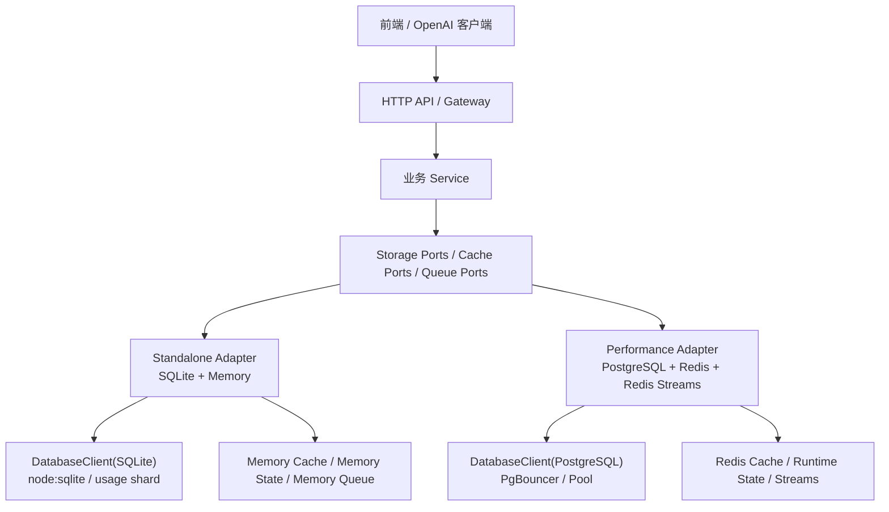

# 存储适配接口设计

> 本文定义当前 Node 过渡阶段 `juhe-ai` 数据库、缓存、运行态和队列的适配边界。
> 执行计划见 [PLAN-0071 存储适配接口收敛](../plans/计划-0071-存储适配接口收敛.md)。

> 迁移方向更新：自 [PLAN-0081 Node 转 Go 渐进减法迁移](../plans/计划-0081-Node转Go渐进减法迁移.md) 起，Go 后端目标不再做 SQLite / PostgreSQL 双 adapter 长期收敛，而是直接收敛到 PostgreSQL + Redis 单模式。本文中的 standalone、SQLite adapter、memory driver 和双模式验证描述只适用于当前 Node 过渡事实；新 Go 迁移规则以 [存储目标与 SQLite 移除](../migration/存储目标与SQLite移除.md) 为准。

## 背景

当前高性能模式已经引入 PostgreSQL、Redis 和 Redis Streams，并通过 `DatabaseClient` / `SqlDialect` 处理了一部分 SQLite 与 PostgreSQL 的 SQL 差异。但现有代码仍存在大量函数级分支：

- repository 内部散落 `runtimeConfig.databaseDriver === 'postgres'`。
- 部分业务函数同时包含 SQLite 同步逻辑和 PostgreSQL 异步逻辑。
- DB service handler 需要按 operation 手工选择 PG 或 SQLite 路径。
- 缓存、运行态和队列虽然已有 driver，但调用点还没有统一到一个清晰的业务 Port 边界。

这种方式可以支撑阶段性落地，但继续扩大会让业务层逐渐知道太多底层细节。后续如果再加入其他数据库、独立队列、分布式状态或新的存储方案，硬写 `if postgres` 会继续扩散。

因此存储访问需要从“SQL 执行适配”进一步收敛到“业务语义适配”。

## 目标

- 前端和 HTTP API 契约稳定：请求路径、参数、响应结构不因 SQLite / PostgreSQL / Redis 切换而变化。
- 业务 service 只依赖业务语义接口，例如 `systemAccounts.findById()`、`apiKeys.create()`、`gatewayRuntime.load()`，不直接感知 SQL 方言、连接池、Redis key 或 SQLite 文件。
- 运行模式只在装配层选择实现：`standalone = SQLite + memory`，`performance = PostgreSQL + Redis + Redis Streams`。
- SQLite adapter 和 PostgreSQL adapter 可以使用各自最优 SQL、事务和索引策略，不强行复用同一段 SQL，也不通过字符串翻译模拟数据库能力。
- Redis 只作为缓存、运行态和队列，不成为账务、授权、权限、审计或使用记录事实源。
- 不在运行时代码里保留旧 schema、旧字段、旧 API、旧逻辑或历史数据迁移分支；所有实现只面向当前 schema 和当前业务契约。

## 不做什么

- 不做通用 SQL 翻译层。`SqlDialect` 只处理占位符、标识符和少量 SQL 片段，不承诺把任意 SQLite SQL 自动变成 PostgreSQL SQL。
- 不让业务 service 调用 `getBusinessDatabase()`、`getDatasetDatabase()`、`getStatsDatabase()`、`getUsageCatalogDatabase()`、`getPostgresPool()` 或 Redis client。
- 不在 repository 内继续新增成对的 `syncFunction()` / `syncFunctionAsync()` 分支作为长期模式。
- 不做 SQLite 和 PostgreSQL 双读、双写、回退读、自动迁移或旧结构兜底。
- 不为了未来数据库提前做泛化到失去业务语义的 DAO。接口按当前业务域定义，未来新数据库实现同一业务 Port。

## 分层模型



### 业务层

`routes` 负责 HTTP 边界，`service` 负责业务流程和副作用编排。业务层可以知道“要查系统账户”“要创建 API Key”“要写入使用记录”，但不能知道数据来自 SQLite 表、PostgreSQL schema、Redis key 还是本地 Map。

业务层只调用 Port：

```ts
interface SystemAccountStore {
  findById(id: string): Promise<SystemAccount | undefined>
  findByUsername(username: string): Promise<SystemAccount | undefined>
  create(input: CreateSystemAccountInput): Promise<SystemAccount>
  update(id: string, input: UpdateSystemAccountInput): Promise<SystemAccount>
  listPage(query: SystemAccountListQuery): Promise<SystemAccountPage>
}
```

### Port 层

Port 是业务语义接口，不暴露 SQL、表名、schema 名、连接、事务对象或 Redis key。Port 入参使用当前后端领域类型，返回当前 API / service 需要的 DTO 或领域对象。

同一业务域可以拆成多个 Port，避免一个接口越来越大：

| Port | 职责 |
| --- | --- |
| `SystemAccountStore` | 系统账户、登录凭据、会话 |
| `ProviderCatalogStore` | 供应商、协议档案、模型目录 |
| `AccountStore` | AI 账户 CRUD、凭据、标签、模型能力 |
| `GroupStore` | 分组、分组账号绑定、策略路由绑定读取 |
| `ApiKeyStore` | API Key 管理、密钥校验、路由绑定 |
| `AuthorizationStore` | 统一授权、团队授权、授权实例 |
| `GatewayRuntimeStore` | 网关运行时读取所需的 Key、分组、账号、策略快照 |
| `UsageRecordStore` | 使用记录写入、列表、详情和 usage catalog |
| `AuditLogStore` | 原始审计、payload blob、错误聚合和保留清理 |
| `StatsStore` | 统计桶、范围窗口、TopN、额度窗口、系统指标 |
| `MaintenanceStore` | 删除记录清理、保留期清理、后台游标 |
| `RuntimeStateStore` | 并发槽、限流、锁、短 TTL 调度态 |
| `SharedCacheStore` | 可丢弃 read-through / shared JSON cache |
| `QueueStore` | usage、audit、operation、runtime log、record maintenance 队列 |

### Adapter 层

每个 Port 至少有两套实现：

- `sqlite-memory`：只允许使用 SQLite、usage shard、本地 Map / LRU 和内存队列。
- `postgres-redis`：只允许使用 PostgreSQL、Redis shared cache、Redis runtime state 和 Redis Streams。

Adapter 可以使用各自数据库的最优写法：

- SQLite adapter 可以保持当前多库、usage shard、单写者和短事务策略。
- PostgreSQL adapter 可以使用 schema、事务、`RETURNING`、`FOR UPDATE SKIP LOCKED`、CTE、分区、表达式索引和批量写入。
- Redis adapter 可以使用 Lua、`GETDEL`、原子 `INCR`、TTL、Stream consumer group 和可恢复 pending 处理。

Adapter 内不能为了旧数据或旧逻辑保留运行时分支；只能实现当前 Port 契约。

### 基础设施层

`DatabaseClient`、`SqlDialect`、PostgreSQL pool、SQLite lazy open、Redis client 和 Redis Stream queue 都属于基础设施。它们只服务 adapter，不直接给业务 service 使用。

当前已有的 `DatabaseClient` 继续保留，但定位调整为底层工具：

- 允许 adapter 复用它执行 SQL。
- 不把它作为业务层依赖。
- 不要求所有数据库共用一段 SQL。
- 不把 `bindPlaceholders()` 扩展成通用 SQL 翻译器。

## 装配方式

运行时创建一个统一的存储运行时对象：

```ts
interface StorageRuntime {
  systemAccounts: SystemAccountStore
  providers: ProviderCatalogStore
  accounts: AccountStore
  groups: GroupStore
  apiKeys: ApiKeyStore
  authorizations: AuthorizationStore
  gatewayRuntime: GatewayRuntimeStore
  usageRecords: UsageRecordStore
  auditLogs: AuditLogStore
  stats: StatsStore
  maintenance: MaintenanceStore
  cache: SharedCacheStore
  runtimeState: RuntimeStateStore
  queue: QueueStore
}
```

装配层按运行模式选择实现：

```ts
export function createStorageRuntime(): StorageRuntime {
  if (runtimeConfig.runtimeMode === 'performance') {
    return createPostgresRedisStorageRuntime()
  }
  return createSqliteMemoryStorageRuntime()
}
```

规则：

- 只有装配层允许读取 `runtimeConfig.runtimeMode`、`databaseDriver`、`cacheDriver`、`runtimeStateDriver` 和 `queueDriver` 来选择实现。
- 业务 service、routes、DB service operation handler 不新增数据库类型分支。
- 旧 repository 函数在迁移期可以作为 Port adapter 内部实现细节复用，但对外只暴露 Port。
- 完成收敛后，`runtimeConfig.databaseDriver` 在 storage 业务文件中只允许出现在装配、静态守卫和明确的 fail-fast 边界。

## 代码落点

建议目录：

```text
backend/src/storage/
  runtime/
    storage-runtime.ts              # StorageRuntime 类型与装配入口
    sqlite-memory-runtime.ts        # standalone 装配
    postgres-redis-runtime.ts       # performance 装配
  ports/
    system-account-store.ts
    account-store.ts
    api-key-store.ts
    gateway-runtime-store.ts
    usage-record-store.ts
    audit-log-store.ts
    stats-store.ts
    maintenance-store.ts
    cache-store.ts
    queue-store.ts
  adapters/
    sqlite-memory/
      system-account.store.ts
      ...
    postgres-redis/
      system-account.store.ts
      ...
  database-client.ts                # 继续作为 SQL 执行基础设施
  database.ts                       # SQLite 基础设施，只由 sqlite-memory adapter 触达
  postgres-client.ts                # PostgreSQL 基础设施，只由 postgres-redis adapter 触达
```

迁移期允许保留现有 repository 文件，但新增业务入口必须优先写 Port。旧文件逐步变成 adapter 内部 helper，最终按业务域拆入 adapter 目录。

## 事务边界

事务必须在 Port 或 Adapter 层表达业务原子性，不向 service 暴露具体数据库事务对象。

允许的方式：

```ts
interface StorageRuntime {
  transaction<T>(scope: StorageTransactionScope, operation: (stores: StorageRuntime) => Promise<T>): Promise<T>
}
```

或在具体 Port 上提供语义化事务方法：

```ts
interface AccountStore {
  createWithBindings(input: CreateAccountWithBindingsInput): Promise<AccountSummary>
  updateCredentialsAndRuntime(input: UpdateAccountRuntimeInput): Promise<void>
}
```

不建议把 `DatabaseClient.transaction()` 直接传给业务 service。不同数据库的事务隔离、锁等待、唯一冲突和重试策略不同，应该留在 adapter 内处理。

## 缓存和运行态边界

缓存同样按 Port 化处理：

- `SharedCacheStore`：可丢弃、可重建、跨进程共享的 JSON 缓存。standalone 用内存，performance 用 Redis cache。
- `RuntimeStateStore`：短 TTL 运行态、限流、并发槽、锁和版本广播。standalone 用内存，performance 用 Redis state。
- `QueueStore`：可恢复队列和本地队列。standalone 用内存 / IPC / 本地 writer，performance 用 Redis Streams。

业务代码不能拼 Redis key。Redis key、TTL、容量、Lua 脚本和 Stream consumer group 都属于 adapter 内部。

Redis 不是事实源。事实数据必须落到 SQLite 或 PostgreSQL；Redis 丢失后系统应能从事实库和预聚合表恢复到保守可用状态。

## 静态守卫

需要新增或扩展静态守卫，逐步把违规访问变成测试失败：

| 守卫 | 目标 |
| --- | --- |
| `storage-adapter-boundary-regression` | 禁止 `modules/**` 直接导入 `database.ts`、`postgres-client.ts` 或 Redis client |
| `sqlite-infrastructure-boundary-regression` | 禁止非 `adapters/sqlite-memory/**` 文件调用 `getBusinessDatabase()` 等 SQLite 句柄 |
| `postgres-infrastructure-boundary-regression` | 禁止非 `adapters/postgres-redis/**` 文件调用 `getPostgresPool()` / `createPostgresDatabaseClient()` |
| `mode-isolation-regression` | performance smoke 不加载 `node:sqlite`，standalone smoke 不加载 PostgreSQL / Redis driver |
| `store-port-coverage-regression` | 新增 DB service operation 必须绑定到 Store Port，而不是在 handler 内写数据库分支 |

迁移期可以维护白名单，但白名单必须逐阶段减少，不允许新增无计划例外。

## 迁移顺序

不要一次性重写全仓库。按风险和收益分阶段迁移：

1. **清单阶段**：生成所有数据库 / Redis / 队列直接调用点清单，按业务域分组。
2. **装配阶段**：新增 `StorageRuntime`、Port 类型和两套 runtime 装配，不改业务行为。
3. **网关阶段**：优先迁移 API Key 校验、网关运行态、候选账号、额度、usage / audit 入队等高频路径。
4. **管理端阶段**：迁移系统账户、供应商、账号、分组、API Key、授权、代理、设置等 CRUD。
5. **后台阶段**：迁移账号探测、健康检测、冷却复测、记录维护、保留清理和任务游标。
6. **统计阶段**：迁移 usage、IP、AI 性能、TopN、范围窗口、系统指标和表监控。
7. **收敛阶段**：删除或封存散落的 driver 分支，扩大静态守卫，文档和测试矩阵改以 Store Port 为单位。

每个阶段完成后必须同时验证：

- standalone 模式仍只触达 SQLite + memory。
- performance 模式仍只触达 PostgreSQL + Redis。
- API 契约和前端调用不变化。
- 新增或迁移的 Port 有 SQLite / PostgreSQL 双实现验证，缓存和运行态有 memory / Redis 双实现验证。

## 验收标准

- 业务 service 不再新增数据库类型判断。
- 新 DB 操作默认先定义 Port，再实现两套 adapter。
- `DatabaseClient` 只出现在 adapter 或基础设施层。
- `node:sqlite` 只在 standalone 实际打开 SQLite 时加载。
- performance 模式 smoke、PG/Redis smoke、Redis Stream smoke、系统 API smoke 和网关压测通过。
- standalone 模式 SQLite 回归通过，且不要求安装 PostgreSQL / Redis。
- 文档、计划、测试说明和部署说明保持同步。
