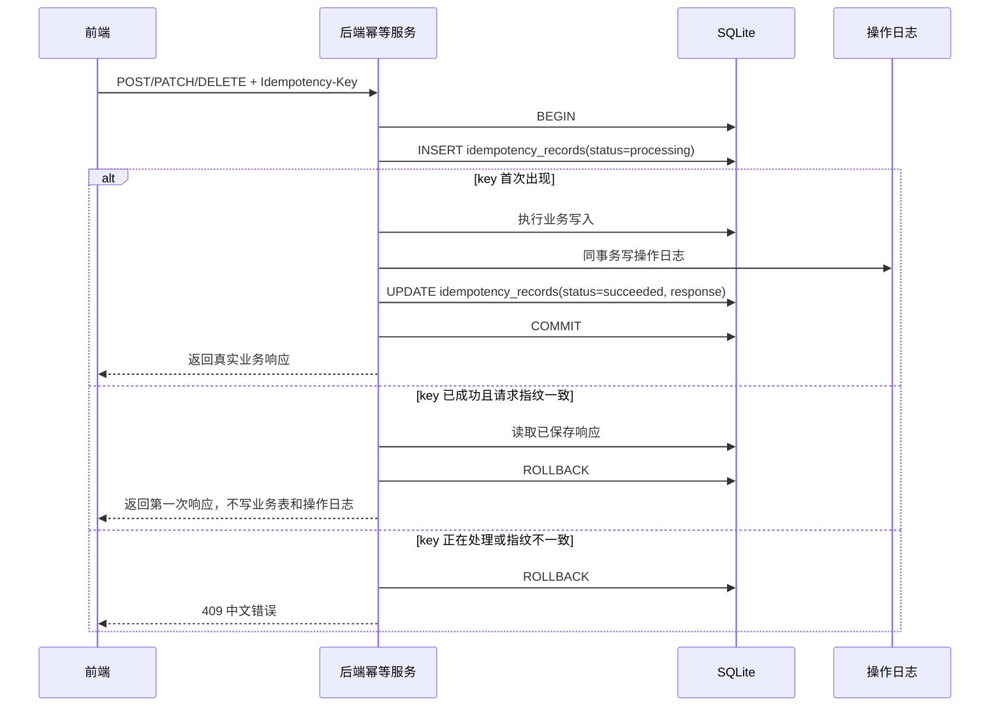

# 幂等与唯一约束设计

> 面向后端、前端、存储和 AI 维护者。
> 本文定义 `juhe-ai` 的统一幂等与业务唯一约束方案，用于避免前端重复点击、网络抖动重试或外部调用重放导致重复创建、重复授权、重复绑定或重复写入错误业务状态。

## 文档目标

- 固定“前端猛点、网络卡顿、客户端重试”时的服务端防重复策略。
- 明确业务唯一键、请求幂等键和前端防重复提交的职责边界。
- 给每类表定义唯一性原则：实体表、关系表、配置表、事实流水表、统计缓存表分别处理。
- 让操作日志只记录第一次真实成功变更，幂等重放不生成第二条操作日志。
- 避免把幂等逻辑写死在每个按钮或每个路由里，统一收敛到后端服务和前端请求层。

## 背景问题

用户在创建 AI 账户、分组、API Key、代理、系统账户、团队、公告或授权时，如果前端卡顿后连续点击，当前部分接口可能会执行多次 `POST`。已有数据库约束能拦住一部分重复，例如系统账户用户名、账号凭据指纹、API Key 密钥 hash、团队名称和授权关系；但仍存在这些风险：

- 随机 ID 类资源在没有业务唯一约束时会产生多条相似记录，例如重复创建同名分组、API Key、代理或公告草稿。
- 外部调用类创建如果重复提交，可能重复兑换授权码、重复刷新 token，或第一次已经成功但响应丢失，第二次返回上游错误。
- 操作日志如果只按路由写入，重复请求会产生多条看似真实的变更记录。
- 仅靠前端按钮 loading 禁用无法作为安全边界，刷新页面、网络重试、多个标签页或脚本调用仍可能重复提交。

## 主流实践结论

参考资料：

- [RFC 9110: HTTP Semantics](https://www.rfc-editor.org/rfc/rfc9110)：HTTP 语义中，幂等方法的核心是多次相同请求对服务端目标状态的影响与一次请求相同；`GET`、`PUT`、`DELETE` 和安全方法天然具备幂等语义，`POST` 不天然幂等。
- [IETF HTTPAPI Idempotency-Key 草案](https://datatracker.ietf.org/doc/draft-ietf-httpapi-idempotency-key-header/)：客户端为一次非幂等请求提供 `Idempotency-Key`，服务端用它识别同一次请求的重试；同一个 key 不能复用于不同请求内容。
- [Stripe Idempotent requests](https://docs.stripe.com/api/idempotent_requests)：创建或更新对象时使用幂等键，服务端保存第一次请求的状态码和响应体，后续相同 key 返回同一结果，并校验参数是否一致。
- [SQLite Partial Indexes](https://www.sqlite.org/partialindex.html)：SQLite 支持部分索引和唯一部分索引，适合表达“只允许一个 active 关系”“非空字段唯一”等业务约束。

本项目按这些实践落地为三层防线：

1. 数据库唯一约束是最终安全边界，防止任何入口写出重复实体或重复关系。
2. 后端请求幂等记录解决“同一次请求重试”的响应重放和外部调用保护。
3. 前端禁用重复提交只改善体验，不能替代后端和数据库约束。

## 核心概念

### 业务唯一键

业务唯一键表达“这个业务世界里不应该出现第二份相同资源”。它可以是单字段，也可以是多个业务参数组合，还可以是敏感值的 hash。

示例：

- 系统账户：`lower(username)`。
- AI 账户凭据：`credential_fingerprint`。
- 分组：`system_account_id + provider_code + lower(name)`。
- 团队成员：`team_id + system_account_id` 且仅约束 `status = active`。
- 授权关系：`resource_type + resource_id + grantee_system_account_id`。

### 请求幂等键

请求幂等键表达“这是同一次提交的重试”。它不等于业务唯一键，也不能替代业务唯一约束。

建议使用 HTTP Header：

```http
Idempotency-Key: "0f9e3e36-6c49-4a1f-8bcb-90c684ce2af1"
```

同一个登录用户、同一个接口、同一个 key、同一个请求指纹，只执行一次真实业务写入。后续重复提交直接返回第一次成功响应，不再次写业务表，也不再次写操作日志。

### 表级唯一性

“每张表都要有唯一键”在本项目中拆成两层：

- 每张表必须至少有主键或组合主键，这是数据行身份。
- 每张实体表和关系表必须有业务唯一约束，这是业务安全。

事实流水表不能强行按内容唯一。`usage_records`、`audit_logs`、`operation_logs`、`runtime_logs` 这类表记录真实发生的事件，同一用户在同一秒做两次相似操作也可能是真实事件。它们必须有唯一 `id`，并在存在上游事件 ID、trace ID 或幂等记录 ID 时按对应字段去重；不能用摘要、时间、资源名称这类不稳定字段做全局唯一。

## 设计原则

- `GET` 查询不生成幂等记录，也不写操作日志。
- 创建类 `POST` 默认需要前端传 `Idempotency-Key`，后端也应接受管理 API 调用方显式传入。
- 修改类 `PATCH` 如果只是把资源设置成目标状态，可以天然接近幂等；但仍建议支持 `Idempotency-Key`，便于网络失败后重放相同响应。
- 删除类 `DELETE` 对目标状态应幂等：首次删除返回成功；重复删除同一请求 key 返回首次响应；不同请求删除已不存在资源可返回 `404` 或业务约定的成功，但不能写第二条操作日志。
- 外部网络调用不能放进 SQLite 长事务；应先占用幂等 key，再执行外部调用，最后把本地写入、操作日志和幂等结果同事务提交。
- 业务唯一冲突返回 `409`，不写操作日志。
- 同一个幂等 key 对应不同请求指纹时返回 `409`，提示“幂等键已被不同请求使用”。
- 正在处理中的同 key 请求返回 `409` 或 `425` 类语义错误，建议当前项目使用 `409` 并返回中文提示“请求正在处理中，请稍后刷新结果”。
- 幂等记录设置短保留期，默认 24 小时；过期后清理，避免表无限增长。

## 统一请求流程

### 本地事务类写操作

适用于创建分组、创建 API Key、创建团队、添加成员、创建授权、编辑配置等不依赖外部网络成功的操作。



### 外部调用类写操作

适用于 OAuth 授权码换 token、Refresh Token 创建账号、代理测试状态写入、账号测试状态写入等。

流程：

1. 在短事务里创建 `idempotency_records(status = processing, locked_until = now + lease)` 后提交。
2. 在事务外执行外部网络调用，避免占用 SQLite 写锁。
3. 外部成功后，再开启事务写业务数据、操作日志和幂等成功响应。
4. 外部失败时，记录失败响应或释放幂等记录，具体按接口决定：
   - 上游授权码兑换这类不可重放动作，建议记录失败短 TTL，避免同一个 key 被并发重复兑换。
   - 普通代理检测、账号测试这类可重试动作，可标记失败并允许用户用新 key 重新发起。
5. 如果进程在 `processing` 中崩溃，`locked_until` 到期后允许同 key 重新接管或返回明确的“上次请求未完成，请重新提交”错误。

## 存储设计

### `idempotency_records`

建议新增表：

- `id`
- `actor_system_account_id`：真实登录用户。
- `operation_scope_system_account_id`：管理员代操作时的业务作用域，可为空。
- `idempotency_key`：客户端提交的 key。
- `method`：HTTP 方法。
- `route_key`：稳定路由键，例如 `POST /api/accounts` 或注册表里的 `accounts.create`。
- `request_hash`：规范化请求指纹 hash，不保存原始请求体。
- `status`：`processing`、`succeeded`、`failed`、`expired`。
- `response_status_code`
- `response_body_encrypted`：加密保存第一次响应；涉及 API Key 明文、凭据摘要等敏感字段时不能明文保存。
- `resource_type`
- `resource_id`
- `operation_log_id`
- `locked_until`
- `expires_at`
- `created_at`
- `updated_at`

唯一约束：

- `actor_system_account_id + method + route_key + idempotency_key` 唯一。

建议索引：

- `idempotency_records(expires_at)`：清理过期记录。
- `idempotency_records(status, locked_until)`：恢复或处理卡住的请求。
- `idempotency_records(resource_type, resource_id, created_at)`：排查某个资源的幂等来源。

字段规则：

- `request_hash` 应包含规范化后的 body、必要 query 参数、业务作用域和 route key。
- 不把 `Authorization`、Cookie、token、密码、完整上游凭据、完整 API Key、验证码或原始请求体写入幂等记录。
- `response_body_encrypted` 复用项目现有加密能力；如果后续确定某些响应完全不敏感，也仍可统一加密，降低分类成本。

## 当前表唯一性盘点与建议

| 表 | 当前唯一性 | 建议 |
| --- | --- | --- |
| `system_accounts` | `id`、`username`、`lower(username)`、`lower(display_name)` | 保持；创建接口叠加幂等 key，重复用户名返回 `409`。 |
| `system_sessions` | `id`、`token_hash` | 保持；会话不是业务实体创建入口。 |
| `global_settings` | `key` | 保持；设置更新走 upsert，天然按 key 幂等。 |
| `system_settings` | `system_account_id + key` | 保持；设置更新走 upsert，幂等 key 用于响应重放和操作日志去重。 |
| `providers` | `id`、`code` | 保持；当前供应商内置，不开放重复创建。 |
| `accounts` | `id`、非空 `credential_fingerprint` | 保持凭据全局唯一；建议补 `system_account_id + provider_code + lower(name)` 或至少在页面提示名称唯一，避免同一用户创建多个同名账号。 |
| `groups` | `id` | 建议补 `system_account_id + provider_code + lower(name)`；默认分组建议补 `system_account_id + provider_code WHERE is_default = 1` 的部分唯一索引。 |
| `group_accounts` | `group_id + account_id` | 建议补 `system_account_id + account_id`，对齐“一个账户同一时间归属零个或一个分组”的现有业务规则。 |
| `api_keys` | `id`、`key_hash` | `key_hash` 只能保证密钥不重复，不能防重复点击创建多把 Key；建议补 `system_account_id + lower(name)`，创建接口必须支持幂等 key。 |
| `proxy_profiles` | `id` | 建议补 `lower(name)`，并增加 `identity_fingerprint` 或等价唯一索引表达 `type + host + port + username + password摘要`，避免重复配置同一代理。 |
| `error_policies` | `id` | 建议补 `system_account_id + lower(name)`。 |
| `system_teams` | `id`、`name`、`lower(name)` | 保持；创建接口叠加幂等 key。 |
| `system_team_members` | `id`、`team_id + system_account_id WHERE status = active` | 保持；添加成员重复时应返回幂等成功或 `409`，不能创建第二条 active 成员。 |
| `resource_authorizations` | `id`、`resource_type + resource_id + grantee_system_account_id` | 保持；这是最终用户授权的稳定业务唯一键。 |
| `resource_authorization_sources` | active manual/team 部分唯一索引 | 保持；来源重复应按幂等成功处理。 |
| `team_resource_authorization_grants` | active `resource_type + resource_id + team_id` | 保持；团队授权重复应复用或更新同一授权来源。 |
| `announcements` | `id` | 公告标题和正文不建议做业务唯一，允许管理员发布相似公告；创建接口必须依赖幂等 key 防重复提交。 |
| `announcement_reads` | `announcement_id + system_account_id` | 保持；已读操作 upsert，天然幂等。 |
| `operation_logs` | `id` | 保持事件表语义；不按摘要或资源做唯一。幂等重放通过 `idempotency_records.operation_log_id` 避免重复写。 |
| `operation_log_targets` | `id` | 保持；作为日志子表随主事件写入。 |
| `operation_log_viewers` | `operation_log_id + system_account_id + visibility_reason` | 保持；可见原因天然去重。 |
| `usage_records` | `id` | 保持事实源语义；同一客户端请求可能产生多条上游尝试，不能按 trace 或内容强唯一。 |
| `audit_logs` / `audit_log_attempts` / `audit_log_payloads` | `id` | 保持审计事实语义；批量落库可按外部审计 id 做 `ON CONFLICT DO NOTHING`。 |
| `runtime_logs` | `id` | 保持运行日志语义；可按文件 offset 做批量导入去重，但不按文本内容唯一。 |
| 统计缓存表 | 多数已有组合主键 | 保持；统计写入使用 upsert，允许重建时覆盖缓存。 |

## 接口接入策略

### 第一批必须接入

这些接口最容易因为前端猛点产生重复资源，优先接入统一幂等：

- `POST /api/accounts`
- `POST /api/openai-oauth/create-from-code`
- `POST /api/openai-oauth/create-from-refresh-token`
- `POST /api/groups`
- `POST /api/api-keys`
- `POST /api/proxies`
- `POST /api/system-accounts`
- `POST /api/system-teams`
- `POST /api/system-teams/:id/members`
- `POST /api/authorizations`
- `POST /api/announcements`

### 第二批建议接入

这些接口多数是设置目标状态，天然重复执行影响较小，但为了响应重放和操作日志去重，仍建议接入：

- `PATCH /api/accounts/:id`
- `POST /api/accounts/:id/group`
- `POST /api/accounts/:id/traffic-migration`
- `PATCH /api/groups/:id`
- `PATCH /api/api-keys/:id`
- `PATCH /api/proxies/:id`
- `PATCH /api/system-accounts/:id`
- `PATCH /api/system-teams/:id`
- `PATCH /api/authorizations/:id`
- `PATCH /api/authorizations/:id/expire`
- `PATCH /api/settings/global`
- `PATCH /api/settings`
- `PATCH /api/announcements/:id`
- `POST /api/announcements/:id/publish`
- `POST /api/announcements/:id/unpublish`

### 可以不接入

- 所有 `GET` 查询。
- 登录、验证码和会话刷新这类认证流程，优先由登录限频、验证码一次性和 session token 唯一控制。
- 网关 `/v1/*` 对外请求暂不复用管理端幂等记录。OpenAI API Key 账号透传会保留客户端传入的 `Idempotency-Key` 给上游；后续如果实现跨账号自动重试，需要单独设计网关侧幂等命名空间，避免同一个上游幂等 key 被打到不同账号。

## 前端接入策略

前端需要提供统一请求能力，而不是每个按钮手写。

建议：

- 在 `frontend/src/api/` 的请求封装中支持 `idempotencyKey` 参数，并写入 `Idempotency-Key` header。
- 在表单提交组合逻辑里生成一次提交 key；同一个 pending 状态下重复点击复用同一个 key。
- 请求失败但页面仍保留同一表单内容时，用户点击“重试”继续复用同一个 key；用户修改表单字段后生成新 key。
- 创建和外部调用类按钮在 pending 时禁用并展示 loading。
- 查询、分页、筛选、打开详情不生成 idempotency key。

前端防重复提交只是体验层。后端不能因为前端已经禁用按钮就省略幂等 key 校验和数据库唯一约束。

## 操作日志衔接

幂等与操作日志必须共享同一个事务边界：

- 首次成功写入业务数据时，同事务写入操作日志和 `idempotency_records` 成功结果。
- 幂等重放直接返回第一次响应，不执行 `runLoggedOperation()`，不写第二条操作日志。
- 业务唯一冲突、参数校验失败、权限失败和资源不存在不写操作日志。
- 幂等记录可以保存 `operation_log_id`，便于排查“这个响应来自哪次真实操作”。

这能保证用户看到的操作日志是真实业务变更，而不是前端重复点击的技术噪声。

## 错误语义

| 场景 | HTTP 状态 | 文案建议 | 是否写操作日志 |
| --- | --- | --- | --- |
| 缺少必需幂等 key | `400` | `当前操作需要幂等键，请刷新后重试` | 否 |
| 同 key 请求指纹不一致 | `409` | `幂等键已被不同请求使用，请重新提交` | 否 |
| 同 key 请求仍在处理 | `409` | `请求正在处理中，请稍后刷新结果` | 否 |
| 同 key 已成功 | 首次状态码 | 返回第一次响应，可加 `Idempotency-Replayed: true` | 否 |
| 业务唯一冲突 | `409` | 具体中文冲突原因 | 否 |
| 处理失败且未提交 | `400` / `500` | 按原接口错误 | 否 |

## 数据清理

建议新增系统设置：

- `idempotencyRecordRetentionHours = 24`：幂等记录保留 24 小时。
- `idempotencyProcessingLeaseSeconds = 120`：处理中的请求默认占用 120 秒；外部调用类接口可按场景延长。

清理任务：

- 接入统一数据保留清理 worker。
- 每次按 `expires_at < now` 批量删除，受 `dataRetentionCleanupBatchSize` 和 `dataRetentionCleanupMaxBatchesPerRun` 控制。
- 清理幂等记录不能删除业务数据和操作日志，只删除重放能力。

## 性能与可用性

- 幂等记录只覆盖管理面低频写操作，不进入高频网关主链路。
- 本地事务类写操作只增加一次唯一索引插入和一次响应更新，成本可控。
- 外部调用类接口先短事务占 key，再执行网络调用，避免长事务占用 SQLite 写锁。
- `idempotency_records` 有保留期和清理任务，不会无限增长。
- 业务唯一索引优先加在低频实体和关系表；高频事实表不增加内容唯一索引，避免影响使用记录、审计日志和运行日志写入性能。
- 正式新增唯一索引前必须先跑重复数据检查；当前预上线本地库可以备份后清理或重建。

## 实现落点建议

后端：

- `backend/src/storage/idempotency.repository.ts`：幂等记录读写、claim、complete、replay、cleanup。
- `backend/src/modules/idempotency/idempotency.service.ts`：请求指纹、header 校验、重放响应、处理中冲突处理。
- `backend/src/modules/operation-logs/operation-log.service.ts`：让 `runLoggedOperation()` 可接收幂等上下文，或提供更外层 `runIdempotentLoggedOperation()`。
- `backend/src/storage/schema.ts`：新增 `idempotency_records` 表、索引和必要业务唯一索引。
- `backend/src/storage/schema-defaults.ts`：新增幂等保留期和 lease 默认设置。
- 各业务路由只声明 `routeKey`、是否必需幂等、是否外部调用，不拼接重复逻辑。

前端：

- `frontend/src/api/http.ts` 或现有请求封装：支持传入 `idempotencyKey`。
- `frontend/src/composables/`：新增表单提交幂等 key 管理，pending 内复用，内容变更后刷新。
- 各创建 / 提交弹窗只调用统一提交能力，不自行生成 header。

文档：

- 同步更新 [接口契约与权限矩阵](接口契约与权限矩阵.md)、[SQLite 存储说明](SQLite存储说明.md)、[操作日志设计](操作日志设计.md) 和需求计划。

## 验收标准

- [ ] 同一用户同一创建接口、同一 `Idempotency-Key`、同一请求体并发提交，只创建一条业务数据。
- [ ] 同一 key 重放返回第一次成功响应，响应可标记 `Idempotency-Replayed: true`。
- [ ] 同一 key 携带不同请求体返回 `409`，不执行业务写入。
- [ ] 不同 key 但相同业务唯一键的重复创建返回 `409`，不创建第二条。
- [ ] 首次成功写操作只产生一条操作日志；幂等重放不产生第二条。
- [ ] `GET` 查询、列表、筛选、详情、日志查看不生成幂等记录，也不写操作日志。
- [ ] OAuth 授权码创建、Refresh Token 创建这类外部调用不会因重复点击重复兑换或重复落库。
- [ ] API Key 创建重放能安全返回第一次明文或等价安全响应，且幂等记录不明文保存敏感响应。
- [ ] 幂等记录过期清理不影响业务数据、操作日志和后续新请求。
- [ ] 新增业务唯一索引前完成重复数据检查，重复数据处理策略有记录。
