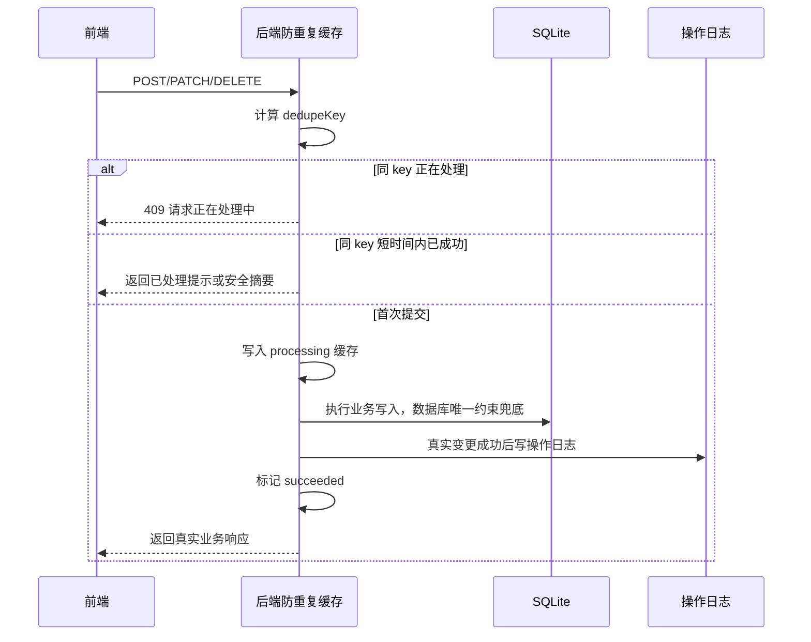

# 幂等与唯一约束设计

> 面向后端、前端、存储和 AI 维护者。
> 本文定义 `juhe-ai` 第一版防重复提交和业务唯一约束方案，用于避免前端重复点击、网络抖动重试或脚本重复提交导致重复创建、重复授权、重复绑定或重复写入错误业务状态。

## 文档目标

- 固定“前端猛点、网络卡顿、客户端重试”时的轻量防重复策略。
- 明确前端防连点、后端内存短 TTL 缓存、数据库唯一约束的职责边界。
- 给每个创建功能定义服务端可计算的业务唯一键或提交指纹，避免把逻辑写死在按钮里。
- 让操作日志只记录真实成功变更，重复提交被拦截或被数据库唯一约束拒绝时不生成第二条操作日志。
- 保持当前单机 SQLite 项目的轻量边界，不把第一版做成重型持久化防重复系统。

## 核心结论

第一版采用三层防线：

1. 前端按钮和表单 pending 状态防连点，改善用户体验。
2. 后端进程内短 TTL 防重复提交缓存，拦截同一用户、同一接口、同一资源指纹在短时间内的重复提交。
3. 数据库主键、业务唯一索引和组合唯一约束兜底数据安全，保证绕过前端或缓存失效时也不能写出重复业务数据。

本项目不设计独立的泛用防重复表。后台管理端的重复点击、网络抖动和脚本重复提交，先用短 TTL 内存缓存挡住，最终由业务表自己的唯一键兜底。

如果未来出现更强副作用的业务，也优先由对应业务表承载幂等边界，例如业务流水号、外部请求号、任务号、资源唯一指纹或订单号，并在业务表上建立唯一约束。不要把所有业务统一塞进一张泛用记录表。

## 当前落地状态

截至 2026-05-10，第一版已按轻量方案落地：

- 后端新增 `backend/src/modules/deduplication/deduplication.service.ts`，使用进程内 `Map` 保存短 TTL 的 `processing / succeeded / failed` 状态，并设置容量上限。
- 后端新增 `backend/src/modules/deduplication/mutation-guard.middleware.ts`，由路由声明 `operationKey`、业务作用域和服务端指纹字段，统一拦截短时间重复写提交。
- 首批创建类接口已接入 `mutationGuard`：账户、OpenAI OAuth 创建账户、分组、API Key、代理、系统账户、系统团队、团队成员、资源授权和公告。
- 前端新增 `frontend/src/directives/submitLock.ts` 和 `frontend/src/composables/useSubmitAction.ts`，通过全局指令与统一提交函数承接按钮、弹窗 OK 和表单提交防连点。
- 数据库已补第一批业务唯一索引：账户同 owner + provider 下名称唯一、分组同 owner + provider 下名称唯一、同 owner + provider 仅一个默认分组、API Key 同 owner 下名称唯一、代理名称全局唯一。
- 写入仓储已增加友好查重与数据库唯一冲突兜底，重复名称返回中文冲突提示，不写第二条操作日志。
- 本地 SQLite 直接按当前 schema 使用第一批业务唯一索引；源码不在启动时执行数据清理或跳过索引。

## 为什么第一版用内存缓存

当前项目是轻量单机优先，管理端写操作低频，重复点击通常发生在几秒内。用内存缓存可以解决主要问题：

- 不新增表，不增加数据清理任务。
- 不把 API Key 明文、OAuth 返回等敏感响应放进幂等表。
- 不增加 SQLite 写锁压力。
- 和“数据库唯一键兜底数据安全”的原则配合清晰。

内存缓存不是最终数据安全边界。它只负责降低重复提交进入业务层的概率；真正保证数据不重复的是数据库唯一约束。

## 边界说明

### 不记录查询

- `GET`、列表、筛选、分页、详情查看、日志查看和审计查看不进入防重复提交缓存。
- 查询不写操作日志。

### 不强行给流水表做内容唯一

“每张表都要有唯一键”在本项目中拆成两层：

- 每张表必须至少有主键或组合主键，这是数据行身份。
- 每个创建功能必须有服务端可计算的业务唯一键或提交指纹，用于防重复提交和唯一约束设计。

事实流水表不能强行按内容唯一。`usage_records`、`audit_logs`、`operation_logs`、`runtime_logs` 记录真实发生的事件，同一用户在同一秒做两次相似操作也可能是真实事件。它们必须有唯一 `id`，但不能用摘要、时间、资源名称这类不稳定字段做全局唯一。

## 后端内存防重复提交

### AOP-like 接入方式

后端采用“路由元信息 + 统一切面”的方式接入防重复提交，效果类似 Java AOP，但不引入 TypeScript decorator、反射或重型控制器框架。

第一阶段推荐使用 `mutationGuard(config)` 中间件：

```ts
apiKeysRouter.post(
  '/',
  mutationGuard({
    operationKey: 'api_keys.create',
    fingerprint: (req) => ({
      owner: req.accessScope.systemAccountId,
      name: normalizeName(req.body.name)
    })
  }),
  (req, res) => {
    // 原业务逻辑
  }
)
```

长期可以演进为 `defineMutationRoute()`，把方法、路径、权限作用域、防重复指纹、操作日志元信息和错误映射放进同一份声明：

```ts
defineMutationRoute(apiKeysRouter, {
  method: 'post',
  path: '/',
  operationKey: 'api_keys.create',
  dedupe: {
    fingerprint: (ctx) => ({
      owner: ctx.accessScope.systemAccountId,
      name: normalizeName(ctx.body.name)
    })
  },
  log: {
    module: 'api_keys',
    action: 'create'
  }
}, async (ctx) => {
  return createApiKey(ctx)
})
```

接入规则：

- 查询接口不配置 `mutationGuard`，也不进入防重复缓存。
- 写接口只声明 `operationKey`、业务作用域和指纹字段，不在路由里手写缓存判断。
- `mutationGuard` 只负责重复提交切入、缓存状态和统一错误语义，不替代业务校验和数据库唯一约束；内存缓存过期维护只做固定小批量轮转，容量超限按最早条目淘汰，不在写请求路径展开全部缓存或排序。
- 操作日志仍以真实业务变更为准；第一阶段可继续在业务内使用 `runLoggedOperation()`，后续再由 `defineMutationRoute()` 统一传递日志上下文。
- 不采用 `@Deduplicate()`、`@OperationLog()` 这类装饰器，除非未来整体迁移到 class controller / NestJS 风格架构。

### 缓存键

后端为写接口统一计算 `dedupeKey`：

```text
actor_system_account_id + operation_scope_system_account_id + method + route_key + operation_fingerprint
```

字段说明：

- `actor_system_account_id`：真实登录用户。
- `operation_scope_system_account_id`：管理员代操作时的业务作用域；没有则为空。
- `method`：HTTP 方法。
- `route_key`：稳定接口键，例如 `accounts.create`、`groups.create`。
- `operation_fingerprint`：服务端规范化后的业务参数 hash，不保存原始请求体。

`operation_fingerprint` 不直接使用完整 body 字符串，而是由每个操作定义声明参与去重的业务字段，统一规范化、裁剪空白、大小写归一后 hash。

### 缓存值

建议缓存值：

- `status`：`processing`、`succeeded`、`failed`。
- `started_at`
- `finished_at`
- `expires_at`
- `resource_type`
- `resource_id`
- `operation_log_id`
- `request_hash`
- `safe_result_summary`：可选，只保存资源 ID、名称、状态等安全摘要，不保存敏感响应。

TTL 建议：

- `processing`：默认 120 秒，外部调用类接口可按需要延长。
- `succeeded`：默认 30 到 120 秒，只用于短时间内重复点击时返回已处理提示或安全摘要。
- `failed`：默认 5 到 30 秒，避免同一瞬间连点打爆外部服务；用户重新提交可生成新请求。

缓存容量需要有上限，例如最多 5000 条；超出后按 `expires_at` 或 LRU 清理。

### 处理流程



### 并发语义

- 同一个 `dedupeKey` 已处于 `processing` 时，后续请求直接返回 `409` 和“请求正在处理中，请勿重复提交”。
- 同一个 `dedupeKey` 已处于 `succeeded` 且仍在短 TTL 内时，可以返回 `200` 安全摘要，也可以返回 `409` “该操作刚刚已处理，请刷新列表查看结果”。第一版推荐返回 `409`，实现更简单且不需要缓存完整响应。
- 缓存失效后，同样请求再次进入业务层时，由数据库业务唯一约束兜底；如果资源已存在，返回 `409` 或复用已有资源，按具体业务决定。
- 进程重启会丢失内存缓存，这是第一版可接受边界；重启后的重复提交仍由数据库唯一约束保护。

## 数据库唯一约束

数据库是最终安全边界。所有实体表和关系表都应明确业务唯一约束，避免绕过前端或内存缓存后写出重复数据。

| 表 | 当前唯一性 | 建议 |
| --- | --- | --- |
| `system_accounts` | `id`、`username`、`lower(username)`、`lower(display_name)` | 保持；重复用户名或显示名返回 `409`。 |
| `system_sessions` | `id`、`token_hash` | 保持；会话不是业务实体创建入口。 |
| `global_settings` | `key` | 保持；按 key upsert。 |
| `system_settings` | `system_account_id + key` | 保持；按 key upsert。 |
| `providers` | `id`、`code` | 保持；当前供应商内置。 |
| `accounts` | `id`、`system_account_id + lower(name)` | 同一用户账号名称唯一；凭据指纹只做普通排查索引，API Key 和 OAuth 凭据允许重复添加。 |
| `groups` | `id`、`system_account_id + provider_code + lower(name)`、`system_account_id + provider_code WHERE is_default = 1` | 已补同一用户同供应商分组名称唯一，并限制每个用户每个供应商只有一个默认分组。 |
| `group_accounts` | `group_id + account_id` | 建议补 `system_account_id + account_id`，对齐“一个账户同一时间归属零个或一个分组”的业务规则。 |
| `route_strategies` | `id`、`system_account_id + lower(name)` | 同一用户策略路由名称唯一；系统会为除“默认混合供应商分组”以外的每个默认分组补齐默认普通路由，`is_default` 路由不可删除。 |
| `api_keys` | `id`、`key_hash`、`system_account_id + lower(name)`、`route_strategy_id WHERE is_default = 1` | 已补同一用户 API Key 名称唯一；`key_hash` 继续保证密钥不重复；系统会为每条非混合默认普通路由补齐一个默认 API Key，`is_default` Key 不可删除。 |
| `proxy_profiles` | `id`、`lower(name)` | 已补代理名称全局唯一；是否再增加代理连接身份指纹后续按实际需要评估。 |
| `system_teams` | `id`、`name`、`lower(name)` | 保持。 |
| `system_team_members` | `id`、`team_id + system_account_id WHERE status = active` | 保持。 |
| `resource_authorization_grants` | active `resource_type + resource_id + grantee_system_account_id WHERE grantee_type = system_account`、active `resource_type + resource_id + grantee_team_id WHERE grantee_type = team` | 新增统一授权操作业务主表，人员和团队通过 `grantee_type` 区分。 |
| `resource_authorizations` | `id`、`resource_type + resource_id + grantee_system_account_id` | 保持。 |
| `resource_authorization_sources` | active manual/team 部分唯一索引 | 保持。 |
| `announcements` | `id` | 公告允许相似标题和正文；防重复提交靠内存缓存的创建指纹，不能按标题全局唯一。 |
| `announcement_reads` | `announcement_id + system_account_id` | 保持；已读 upsert。 |
| `operation_logs` | `id` | 保持事件表语义；不按摘要或资源唯一。 |
| `operation_log_viewers` | `operation_log_id + system_account_id + visibility_reason` | 保持。 |
| `usage_records` / `audit_logs` / `runtime_logs` | `id` | 保持事实流水语义，不按内容唯一。 |
| 统计缓存表 | 多数已有组合主键 | 保持；统计写入使用 upsert。 |

## 操作指纹建议

每个创建功能都要定义服务端操作指纹，避免所有接口把完整 body 当 key。

| 操作 | route key | 操作指纹建议 |
| --- | --- | --- |
| 创建系统账户 | `system_accounts.create` | `lower(username)` |
| 创建 AI 账户 | `accounts.create` | `owner + provider_protocol_profile_id + type + name + credential_fingerprint`；数据库最终以同一用户账号名称唯一约束兜底 |
| OAuth 授权回调创建账户 | `openai_oauth.create_from_code` | `callbackUrl fingerprint` |
| Refresh Token 创建账户 | `openai_oauth.create_from_refresh_token` | `name + refresh_token fingerprint`；同一 Refresh Token 不同账户名允许创建 |
| 创建分组 | `groups.create` | `owner + provider_code + lower(name)` |
| 创建 API Key | `api_keys.create` | `owner + lower(name)` |
| 创建代理 | `proxies.create` | `lower(name)` 或 `type + host + port + username + password摘要` |
| 创建团队 | `system_teams.create` | `lower(name)` |
| 添加团队成员 | `system_teams.add_member` | `team_id + system_account_id` |
| 创建授权 | `authorizations.create` | `resource_type + resource_id + grantee_type + grantee_id` |
| 创建公告 | `announcements.create` | `actor + title + content_hash + level + status`，只用于短期防重复，不做数据库唯一 |

## 接口接入范围

### 第一批必须接入内存防重复

- `POST /__aisys__/api/accounts`
- `POST /__aisys__/api/openai-oauth/create-from-code`
- `POST /__aisys__/api/openai-oauth/create-from-refresh-token`
- `POST /__aisys__/api/groups`
- `POST /__aisys__/api/api-keys`
- `POST /__aisys__/api/proxies`
- `POST /__aisys__/api/system-accounts`
- `POST /__aisys__/api/system-teams`
- `POST /__aisys__/api/system-teams/:id/members`
- `POST /__aisys__/api/authorizations`
- `POST /__aisys__/api/announcements`

### 第二批建议接入

这些接口多数是设置目标状态，天然重复执行影响较小，但为了避免短时间重复写操作日志，仍建议接入内存防重复：

- `PATCH /__aisys__/api/accounts/:id`
- `POST /__aisys__/api/accounts/:id/group`
- `POST /__aisys__/api/accounts/:id/traffic-migration`
- `PATCH /__aisys__/api/groups/:id`
- `PATCH /__aisys__/api/api-keys/:id`
- `PATCH /__aisys__/api/proxies/:id`
- `PATCH /__aisys__/api/system-accounts/:id`
- `PATCH /__aisys__/api/system-teams/:id`
- `PATCH /__aisys__/api/authorizations/:id`
- `PATCH /__aisys__/api/settings/global`
- `PATCH /__aisys__/api/settings`
- `PATCH /__aisys__/api/announcements/:id`
- `POST /__aisys__/api/announcements/:id/publish`
- `POST /__aisys__/api/announcements/:id/unpublish`

## 前端接入策略

- 表单提交时使用统一 pending 状态，提交中按钮禁用并展示 loading。
- 显式按钮优先通过 Vue 全局自定义指令接入，例如 `v-submit-lock`，页面只在按钮属性上声明防重复参数。
- 提交函数再通过统一 `useSubmitAction()` 或等价封装执行，避免回车提交、弹窗 OK、快捷键或脚本触发绕过按钮指令。
- 同一个弹窗同一次提交期间，重复点击不再发请求。
- 请求失败后，如果用户未改表单，可以允许重新提交；后端内存缓存会挡住仍在处理中的重复请求。
- 用户修改表单字段后，视为新的提交。
- 查询、分页、筛选、打开详情不做防重复提交处理。

第一版后台管理端不依赖 `Idempotency-Key`。后端以服务端操作指纹为准，避免依赖前端正确传 key。

### Vue 指令方案

前端新增全局指令建议放在 `frontend/src/directives/submit-lock.ts`，并在 `frontend/src/main.ts` 注册：

```ts
const app = createApp(App)
app.directive('submit-lock', submitLockDirective)
app.use(router).mount('#app')
```

按钮使用示例：

```vue
<a-button
  type="primary"
  :loading="saving"
  v-submit-lock="{ key: 'api_keys.create', pending: saving }"
  @click="saveApiKey"
>
  保存
</a-button>
```

指令职责：

- 根据 `key` 和 `pending` 拦截短时间重复点击。
- 自动给原生按钮设置 `disabled` 或阻止 click 继续冒泡。
- 可选支持 `cooldownMs`，默认只覆盖同一事件循环或短时间连续点击。
- 不读取表单完整内容，不生成后端提交指纹，不保存敏感字段。

指令边界：

- `v-submit-lock` 是体验层，不是数据安全边界。
- 弹窗 `a-modal` 内置 OK 按钮无法直接挂普通按钮指令时，使用 `confirmLoading`、`okButtonProps.disabled` 和统一提交函数承接。
- 表单回车提交必须走同一个提交函数，不能只依赖按钮 click。
- 防重复 key 只使用稳定动作名和页面局部实例标识，例如 `api_keys.create`、`accounts.update:<id>`，不要拼接 API Key 明文、OAuth token、密码或完整表单 JSON。

### 统一提交函数

建议新增 `frontend/src/composables/useSubmitAction.ts`，提供类似能力：

```ts
const { isSubmitting, submitAction } = useSubmitAction()

const saveApiKey = submitAction('api_keys.create', async () => {
  await api.apiKeys.create(form)
  await loadData()
})
```

统一提交函数负责：

- 同一个 key 处理中时直接忽略后续触发。
- 自动维护 `isSubmitting(key)`，供按钮 `loading` 和 `disabled` 使用。
- finally 中释放 pending，避免接口失败后按钮永久不可用。
- 支持页面卸载时清理局部 pending。

推荐组合：

- 普通按钮：`v-submit-lock` + `submitAction()`。
- 表单 `@submit.prevent`：只调用 `submitAction()` 包装后的函数。
- Ant Design Vue Modal：`confirmLoading` / `okButtonProps` + `submitAction()`。
- 列表行操作：按 `operationKey + resourceId` 做 key，避免点击一行时锁住所有行。

## 操作日志衔接

- 被内存缓存拦截为 `processing` 或短期 `succeeded` 的重复提交，不执行业务写入，不写操作日志。
- 数据库唯一约束冲突、参数校验失败、权限失败和资源不存在，不写操作日志。
- 修改类接口如果重复提交后业务字段没有变化，应返回成功或无变化提示，但不写新的操作日志。
- 操作日志只表示真实业务状态变化，不表示重复 HTTP 请求。

## 错误语义

| 场景 | HTTP 状态 | 文案建议 | 是否写操作日志 |
| --- | --- | --- | --- |
| 同资源指纹请求正在处理 | `409` | `请求正在处理中，请勿重复提交` | 否 |
| 同资源指纹刚刚已成功 | `409` 或 `200` | `该操作刚刚已处理，请刷新列表查看结果` | 否 |
| 数据库业务唯一冲突 | `409` | 具体中文冲突原因 | 否 |
| 参数或权限失败 | `400` / `403` / `404` | 按原接口错误 | 否 |
| 首次真实成功 | `200` / `201` / `204` | 按原接口响应 | 是 |

## 性能与可用性

- 内存缓存只覆盖管理面低频写操作，不进入高频网关主链路。
- 缓存 key 和 value 都不保存完整请求体、完整响应体或敏感凭据。
- 缓存有 TTL 和容量上限，避免内存无限增长。
- 外部调用类接口不把网络请求放进 SQLite 事务。
- 新增业务唯一索引前必须先离线检查并清理本地重复数据；源码只保留最新 schema，不在正常启动路径里做数据清理或跳过索引。

## 实现落点建议

后端：

- `backend/src/modules/deduplication/deduplication.service.ts`：已落地进程内防重复提交缓存、稳定 hash、TTL 固定批量清理和容量上限。
- `backend/src/modules/deduplication/mutation-guard.middleware.ts`：已落地 Express AOP-like 写操作切面，读取路由元信息并调用防重复服务。
- `backend/src/modules/deduplication/operation-fingerprint.ts`：长期可选；如果指纹规则继续增多，再从路由中抽到注册表。
- `backend/src/shared/define-mutation-route.ts`：长期可选的路由声明封装，把写操作元信息集中到一处。
- `backend/src/storage/schema/business-schema.ts`：已补充第一批业务唯一索引，`backend/src/storage/schema.ts` 只作为当前 schema 模块的统一导出口。
- `backend/src/modules/operation-logs/operation-log.service.ts`：确保无变化或重复拦截不写操作日志。
- 各业务路由只声明 `routeKey` 和指纹字段，不手写缓存逻辑。

前端：

- `frontend/src/directives/submit-lock.ts`：全局按钮防重复点击指令。
- `frontend/src/composables/useSubmitAction.ts`：统一提交函数和 pending 状态。
- `frontend/src/main.ts`：注册 `v-submit-lock` 指令。
- 创建 / 提交弹窗复用同一套防连点逻辑，显式按钮通过属性声明接入。
- 不为查询、筛选、分页生成提交指纹。

文档：

- 同步更新 [接口契约与权限矩阵](接口契约与权限矩阵.md)、[SQLite 存储说明](SQLite存储说明.md)、[操作日志设计](操作日志设计.md) 和需求计划。

## 验收标准

- [ ] 同一用户同一创建接口、同一资源指纹并发提交，只允许一个请求进入业务写入。
- [ ] 正在处理中的重复提交返回中文提示，不写业务数据和操作日志。
- [ ] 内存缓存失效或进程重启后，数据库唯一约束仍能阻止重复业务数据。
- [ ] 不同资源指纹的两个真实创建请求不会被误拦截。
- [ ] 业务唯一冲突返回 `409`，不写操作日志。
- [ ] 修改类接口重复提交且字段无变化时，不写新的操作日志。
- [ ] `GET` 查询、列表、筛选、详情、日志查看不进入防重复提交缓存，也不写操作日志。
- [ ] 后端写接口通过 `mutationGuard` 或 `defineMutationRoute` 声明接入，不在业务路由里散落手写缓存判断。
- [ ] 前端显式提交按钮可以通过 `v-submit-lock` 属性接入；表单提交和弹窗 OK 通过统一提交函数接入。
- [ ] 新增业务唯一索引前完成重复数据检查，重复数据处理策略有记录。
