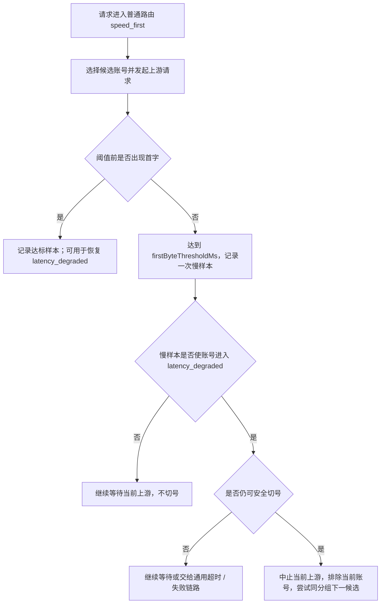

# 普通路由速度优先延迟切换设计

> 状态：已落地。
> 创建时间：2026-07-05。
> 本文细化普通路由 `speed_first` 的慢样本观察和确认慢后切号语义，避免首字阈值被误用成所有请求的硬中断。

## 1. 背景

普通路由速度优先的目标是减少真实交互请求被近期慢账号拖住的概率。但首字观察阈值不能直接等价于“当前请求必须切号”：

- `Responses` compact、上下文摘要、token counting、embedding 等请求天然可能没有快速首字，如果靠端点白名单维护豁免，供应商和协议越多成本越高。
- 不同供应商和协议对“首字”的语义不同，不能用复杂请求分类在网关主链路里提前穷举。
- 首次慢样本可能只是上游短暂波动，立刻中断当前请求会放大重试、连接和计费成本。

因此速度优先只保留两层：软观察、确认慢后切号。

## 2. 核心结论

- 普通路由配置为速度优先后，不再维护 endpoint / body 级请求分类豁免。
- `firstByteThresholdMs` 首先是软观察阈值；超过阈值先记录慢样本，不等于当前请求必须切号。
- 只有同一运行态键在 `slowWindowSeconds` 内达到 `slowTriggerCount`，进入 `latency_degraded` 后，才允许当前请求或后续请求执行速度优先切号。
- `maxFirstByteRetriesPerRequest` 只限制确认慢后的隐藏切号次数，不再表示“任何首次超阈值都可切号”。
- 速度优先不能绕过账户硬过滤、模型能力、授权、并发、超级优先和账号调度优先级层；它只在允许的候选层内后置已确认慢账号。

## 3. 观察入口

速度优先观察入口保持简单：

- 只要 API Key 绑定的普通路由启用 `speed_first`，网关就可以对当前上游 attempt 启动首字软观察。
- 观察结果只写短 TTL 运行态，不写账号持久状态。
- 单次超阈值只说明“本次慢”，不会立刻切号。
- 长耗时请求可能贡献慢样本，但必须达到慢样本窗口和触发次数后才影响调度。
- 不在普通路由主链路解析供应商私有字段、compact trigger、token counting、embedding 或未知控制端点。

## 4. 延迟切换状态机

“仍可安全切号”必须同时满足：

- 下游尚未写出任何可见内容。
- 当前请求仍有未尝试的可承接候选账号。
- 未超过 `maxFirstByteRetriesPerRequest`。
- 未超过客户端总等待上限。
- 候选切换不会打破模型匹配、超级优先和账号调度优先级层的硬边界。

## 5. 计时细节

速度优先需要把首字阈值从硬超时改为可决策的软 deadline：

- 每个上游 attempt 只允许记录一次速度优先慢样本，避免同一个请求在等待过程中重复累计。
- 流式请求按首个可见语义输出计算首字；SSE comment、空心跳、半截 JSON、仅协议占位事件不算达标。
- 非流式生成请求按上游 `2xx` 后首个 body 字节计算首字。
- 如果慢样本未触发 `latency_degraded`，当前上游继续读取，直到正常首字、通用上游超时、客户端取消或通用失败链路接管。
- 如果慢样本触发 `latency_degraded` 且满足安全切号条件，当前请求才可以隐藏切号。
- 如果首字最终返回但超过阈值，并且本 attempt 已经在软 deadline 处记录过慢样本，不再重复记录。

通用 `streamRequestTimeoutSeconds`、`streamClientTotalWaitTimeoutSeconds` 和 `streamMaxLifetimeSeconds` 仍然保留。它们是请求生命周期保护，不是速度优先慢样本规则。

## 6. 候选排序和优先级

速度优先只处理 `latency_degraded` 的后置，不负责提升低优先级账号：

- 硬过滤仍优先于速度优先，包括账户状态、授权、时间计划、模型能力、协议能力、账号并发、分组可用性和本地屏蔽。
- 模型匹配层和账号调度优先级层必须保持稳定；速度优先不能把低模型匹配或低优先级账号提到高层账号前面。
- 超级优先和账号优先级属于调度层硬边界。已确认慢的高优先级账号只能在同一优先级层内后置；不能让低层账号因为速度优先越级。
- 如果当前层所有候选都已 `latency_degraded`，应旁路速度降级排序，保留原顺序兜底，避免把号池筛空。

## 7. 并发风暴处理

延迟切换会降低误判，但并发下仍有两个风险：

- 同一慢账号被多个请求同时命中，前几批请求会一起等待。
- 多个请求几乎同时超过软阈值，可能快速累计到 `slowTriggerCount`。

初始实现可以接受第二个风险，因为它说明当前账号在同一窗口内确实对多请求表现慢。但实现时必须避免同一个 attempt 重复计数。后续如需更保守，可以增加“同波慢样本合并”：

- 以 `accountRuntimeKey + routeStrategyId + groupId` 为键。
- 在很短的 merge window 内，多个重叠 attempt 的软阈值命中最多计为一到两次。
- merge window 不作为用户配置，避免页面复杂化。

该合并不是第一版必需能力，除非真实压测证明并发误判明显。

## 8. 边界

速度优先观察只影响普通路由内部的候选排序和确认慢后的安全切号，不绕过其他网关能力：

- 仍然执行认证、额度、授权、模型过滤、账号状态、并发和协议能力校验。
- 仍然执行普通上游请求超时、客户端取消处理和响应语义检查。
- Codex compact 仍然执行 compact 契约检查。
- Chat-only compact 仍然执行网关 summary compact 的边界校验、摘要生成和 snapshot 保存。
- 仍然写使用记录和审计，只是不再写速度优先请求分类豁免 metadata。

审计 metadata：

- `normal_route_speed_first_slow_observed`：软阈值命中但未切号，包含 `slowCount`、`degraded`、`cutoverAllowed`。
- `normal_route_speed_first_slow_observed.retryBlockedReason`：未达到切号条件而继续等待时记录原因，例如未确认慢、没有候选、达到重试上限或客户端总等待到期。
- `normal_route_speed_first_confirmed_cutover`：已确认慢并执行当前请求切号。

## 9. 实现落点

目标代码落点：

- `preflight.ts` 只按普通路由配置决定是否启用速度优先，不做请求分类豁免。
- `routes.ts` 只消费速度优先运行态和切号决策，不直接解析各协议 body。
- 流式和非流式读取层需要支持软 deadline 回调，由上层决定继续等待还是中止切号。
- 速度降级运行态继续使用现有短 TTL state，不写 `accounts.status`、`cooldown_until` 或健康检测失败次数。

## 10. 回归测试

至少覆盖：

- 普通生成请求前两次超过阈值只记录慢样本，不切号。
- 第 `slowTriggerCount` 次超过阈值后，若仍未写下游且存在候选，才执行切号。
- 已经 `latency_degraded` 的账号再次命中时，可以在阈值处切号。
- 所有候选都降级时不无限切号，保留原顺序兜底。
- 长耗时请求首次超过阈值时只记录观察，不因单次慢立即切号。
- 客户端取消、通用上游失败、响应检查切号仍走原有失败链路。
- 超级优先和账号优先级层不被速度优先越级打破。

## 11. 风险和取舍

- 延迟切换会让前几次慢请求承担等待成本，这是降低误判的代价。
- 第一版不做并发抢跑，不会同时请求多个上游取最快结果，避免双倍计费。
- 长耗时请求也可能累计慢样本，这是取消请求分类豁免后的取舍；默认 30 秒阈值、慢样本窗口和触发次数用于降低误判。
- 软 deadline 需要改造流式和非流式读取层，不能只在路由层事后判断。
- 速度优先不是账号健康判断。慢首字只影响短 TTL 调度态，不写持久账号状态。
