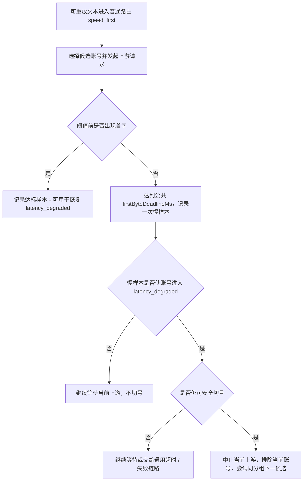

# 普通路由速度优先延迟切换设计

> 状态：已按新语义落地。2026-07-06 已实现“路由级临时覆盖账户偏好、恢复后回账户排序”，并补充“已降级候选不切换”边界回归。
> 创建时间：2026-07-05。
> 本文细化普通路由 `speed_first` 的慢样本观察和确认慢后切号语义，避免公共首字截止被误用成速度模式专属的硬中断。

## 1. 背景

普通路由速度优先的目标是减少真实交互请求被近期慢账号拖住的概率。但首字观察阈值不能直接等价于“当前请求必须切号”：

- `Responses` compact、上下文摘要、token counting、embedding 等请求天然可能没有快速首字，如果靠端点白名单维护豁免，供应商和协议越多成本越高。
- 不同供应商和协议对“首字”的语义不同，不能用复杂请求分类在网关主链路里提前穷举。
- 首次慢样本可能只是上游短暂波动，立刻中断当前请求会放大重试、连接和计费成本。

因此速度优先只保留两层：软观察、确认慢后切号。

## 2. 核心结论

- 普通路由配置为速度优先后，不再维护 endpoint / body 级请求分类豁免。
- `normalRoutingConfig.firstByteDeadlineMs` 只作用于可重放文本，是普通路由成本优先与速度优先共用的首字软截止，默认 `10000` 毫秒、范围 `10000..60000`；速度优先在这个统一事件上先记录慢样本，不等于当前请求必须切号。图片和其他副作用请求永久排除。
- 只有可重放文本的同一运行态键在 `slowWindowSeconds` 内达到 `slowTriggerCount`，进入 `latency_degraded` 后，才允许当前请求或后续请求执行速度优先切号。
- `maxFirstByteRetriesPerRequest` 只限制可重放文本确认慢后的隐藏切号次数，不再表示“任何首次超阈值都可切号”。
- 已能从请求路径确认的 `/images/*` 请求不进入 `speed_first` 专用正文 admission；图片不会因路由选择了快速模式而占用、等待或耗尽该 lease。
- 速度优先不能绕过路由硬约束，包括分组范围、账户状态、授权、时间计划、模型能力、协议能力、额度、账号硬并发、分组队列和写出安全窗口。
- 账号确认进入 `latency_degraded` 后，速度优先可以临时覆盖账户超级优先、账号优先级、备用层、会话亲和和质量排序等账户偏好，把未降级且硬可承接的账号排到前面。
- 当前请求确认慢后，只能切到同分组内未降级且硬可承接候选；如果剩余候选也已 `latency_degraded`，不切到该候选，继续等待当前响应或进入通用兜底。
- `latency_degraded` 被后台探针、真实达标请求、手动恢复、配置变更或 TTL 清理后，后续请求必须重新回到账户配置排序，避免主账号恢复后饿死或替补账号被长期打满。

## 3. 观察入口

普通路由首字入口保持统一，速度优先只增加慢样本状态机：

- 可重放文本的普通路由 `cost_first` 与 `speed_first` 在请求开始时只解析一次公共 `firstByteDeadlineMs`，同请求的所有业务 attempt 复用，不创建第二个速度模式 timer；confirmation 使用 lane hard timeout，不把该配置截止当传输失败。
- 可重放文本的 `cost_first` 在公共截止时仍无首字可形成一次中性请求级调度结果并推进候选；只有 `speed_first` 把相同事件写入慢样本运行态。
- 观察结果不写 transport 电路、Key 失败、共享可靠性或账号持久状态；速度优先只有确认慢后才写短 TTL `latency_degraded`。
- 单次超阈值只说明“本次慢”，不会立刻切号。
- 可重放文本长耗时请求可能贡献慢样本，但必须达到慢样本窗口和触发次数后才影响调度；图像和其他副作用请求永久退出首字软截止、慢样本、`latency_degraded` 和速度 cutover。
- 不在普通路由主链路解析供应商私有字段、compact trigger、token counting、embedding 或未知控制端点。

## 4. 延迟切换状态机

“仍可安全切号”必须同时满足：

- 下游尚未写出任何可见内容。
- 当前请求仍有未尝试、未降级且可承接的候选账号。
- 未超过 `maxFirstByteRetriesPerRequest`。
- 未超过独立固定默认 270 秒的 `GatewayRequestWallBudget`。
- 候选切换不会越过分组范围、账户可调度状态、授权、模型 / 协议可承接能力、额度、账号硬并发、分组队列和响应写出边界等硬约束。

## 5. 计时细节

普通路由只允许一个公共首字 timer；速度优先把该 timer 的截止结果作为可决策的慢事件：

- 每个上游 attempt 只允许记录一次速度优先慢样本，避免同一个请求在等待过程中重复累计。
- 流式请求按首个可见语义输出计算首字；SSE comment、空心跳、半截 JSON、仅协议占位事件不算达标。
- 非流式生成请求按上游 `2xx` 后首个 body 字节计算首字。
- 如果慢样本未触发 `latency_degraded`，当前上游继续读取，直到正常首字、通用上游超时、客户端取消或通用失败链路接管。
- 如果慢样本触发 `latency_degraded` 且满足安全切号条件，当前请求才可以隐藏切号。
- 如果首字最终返回但超过阈值，并且本 attempt 已经在软 deadline 处记录过慢样本，不再重复记录。

公共首字软截止与 lane timeout profile 分开：文本使用 `textFirstResponseTimeoutSeconds / textStreamIdleTimeoutSeconds / textUncommittedAttemptMaxLifetimeSeconds` 和固定默认 270 秒 `GatewayRequestWallBudget`；图片使用独立 `image*` 单次时限与 `imageRequestWallTimeoutSeconds`（默认 3600 秒）整请求墙钟，并永久不启用首字软截止、慢样本或速度 cutover。`noAvailableAccountWaitTimeoutSeconds` 只控制另一套累计等待预算。

旧 `speedFirstConfig.firstByteThresholdMs` 只在配置读取时作为兼容别名映射到公共字段。规范化 API 响应、前端提交和 `route_strategies.config_json` 只使用 `normalRoutingConfig.firstByteDeadlineMs`；新旧字段同时出现必须拒绝，不能让两个值并行生效。

## 6. 候选排序、账户偏好和恢复回归

普通路由速度优先采用三层裁决：

- 路由硬约束最高：普通路由只能在绑定分组内选择账号，并且必须满足账户状态、授权、时间计划、模型能力、协议能力、额度、账号硬并发、分组队列、本地短暂屏蔽和下游未写出等硬条件。
- 路由策略目标其次：启用 `speed_first` 后，已确认慢的账号违反当前路由的速度目标；在 `latency_degraded` 有效期内，未降级且硬可承接的账号整体排在降级账号前面。
- 账户配置偏好最后：没有账号降级时，仍按分组内账户配置选择，包括超级优先、账号优先级、备用层、会话亲和、质量分和稳定排序；未降级候选内部、降级候选内部也继续保持这套账户排序。

这意味着已确认慢的主账号可以被同分组未降级的替补账号越过，即使主账号配置了超级优先或更高账号优先级。这个越过只在 `latency_degraded` 有效期内成立，不写回账户配置，也不形成更强的长期亲和。

如果当前分组所有硬可承接候选都处于 `latency_degraded`，应旁路速度降级排序，保留原候选顺序兜底，避免保护机制把号池筛空。当前请求的确认慢切号也必须过滤掉已降级候选，避免从一个已确认慢账号切到另一个已确认慢账号。后台探针或真实达标请求清理某个账号的 `latency_degraded` 后，下一次选号必须重新按账户配置排序，让恢复的主账号重新获得应有流量。

## 7. 并发风暴处理

延迟切换会降低误判，但并发下仍有两个风险：

- 同一慢账号被多个请求同时命中，前几批请求会一起等待。
- 多个请求几乎同时超过软阈值，可能快速累计到 `slowTriggerCount`。

初始实现可以接受第二个风险，因为它说明当前账号在同一窗口内确实对多请求表现慢。但实现时必须避免同一个 attempt 重复计数。后续如需更保守，可以增加“同波慢样本合并”：

- 以 `accountRuntimeKey + routeStrategyId + groupId` 为键。
- 在很短的 merge window 内，多个重叠 attempt 的软阈值命中最多计为一到两次。
- merge window 不作为用户配置，避免页面复杂化。

该合并不是第一版必需能力，除非真实压测证明并发误判明显。

快速模式还必须具备以下固定保护，不增加用户配置项：

- 高并发分组的文本 admission 排队位于完整 raw body 读取之前；等待中的文本请求只保留认证和路由轻量上下文，通过连接背压限制正文进入进程内存。获得 admission lease 后才读取正文，lease 持续到响应完成或连接关闭。路径已明确为 `/images/*` 的请求直接绕过这套 `speed_first` 专用 admission。
- 确认慢切号执行“无坑不跳”：先为目标账户立即占到真实并发槽，再中止原上游；没有可用目标槽时继续等待原请求，不能先断开再进入目标账户队列。
- 同一 `systemAccountId + routeStrategyId + groupId + slowAccountRuntimeKey` 使用固定共享切换预算，限制同一慢账户触发的并发迁移放大。预算与预占目标槽都必须在成功、失败、取消和未消费路径幂等释放。
- API Key 美元额度在统计快照之外维护进程内在途成本预留；并发请求以当前模型价格和有界 token 估算原子占用额度窗口，响应结束后保留覆盖统计快照延迟的短暂时间，再自动释放。无价格事实的模型不虚构费用。

## 8. 边界

速度优先观察只影响普通路由内部的候选排序和确认慢后的安全切号，不绕过其他网关能力：

- 仍然执行认证、额度、授权、模型过滤、账号状态、并发和协议能力校验。
- 仍然执行普通上游请求超时、客户端取消处理和响应语义检查。
- Codex compact 仍然执行 compact 契约检查。
- Chat-only compact 仍然执行网关 summary compact 的边界校验、摘要生成和 snapshot 保存。
- 仍然写使用记录和审计，只是不再写速度优先请求分类豁免 metadata。

审计 metadata：

- `normal_route_speed_first_slow_observed`：软阈值命中但未切号，包含 `slowCount`、`degraded`、`cutoverAllowed`。
- `normal_route_speed_first_slow_observed.retryBlockedReason`：未达到切号条件而继续等待时记录原因，例如未确认慢、没有候选、达到重试上限或客户端总等待到期。
- `normal_route_speed_first_confirmed_cutover`：已确认慢并执行当前请求切号。

## 9. 实现落点

目标代码落点：

- `preflight.ts` 只按普通路由配置决定是否启用速度优先，不做请求分类豁免。
- `routes.ts` 只消费速度优先运行态和切号决策，不直接解析各协议 body。
- 流式和非流式读取层需要支持软 deadline 回调，由上层决定继续等待还是中止切号。
- 速度降级运行态继续使用现有短 TTL state，不写 `accounts.status`、`cooldown_until` 或健康检测失败次数。

## 10. 回归测试

至少覆盖：

- 普通生成请求前两次超过阈值只记录慢样本，不切号。
- 成本优先和速度优先针对同一配置解析出相同公共首字截止，且每个 attempt 只有一个首字 timer。
- 可重放文本的成本优先在公共截止事件上按中性调度结果切号，不写速度降级运行态，也不把主动取消反写为 transport failure。
- 第 `slowTriggerCount` 次超过阈值后，若仍未写下游且存在候选，才执行切号。
- 已经 `latency_degraded` 的账号再次命中时，可以在阈值处切号。
- 所有候选都降级时不无限切号，保留原顺序兜底。
- 文本长耗时请求首次超过阈值时只记录观察，不因单次慢立即切号；图像请求完全不记录该观察。
- 高并发分组已有文本占用正文 admission lease 时，直接 `/images/generations` 仍立即进入后续处理；图片绕过不得破坏后续文本请求的 FIFO 唤醒与 lease 释放。
- 客户端取消、通用上游失败、响应检查切号仍走原有失败链路。
- 超级优先账号 A 确认慢后，可在同分组内切到硬可承接的普通或备用账号 B。
- A 被后台探针或真实达标请求确认恢复后，后续请求重新按账户配置回到 A，不因之前切到 B 而长期粘在 B。
- B 被速度切号命中不会写入比账户配置和恢复状态更强的长期亲和。
- 全部硬可承接候选都降级时旁路速度排序，保留原顺序兜底。
- 当前请求确认主号慢，但剩余候选也已降级时，不切到已降级候选，继续等待当前响应或进入通用兜底。

## 11. 风险和取舍

- 延迟切换会让前几次慢请求承担等待成本，这是降低误判的代价。
- 第一版不做并发抢跑，不会同时请求多个上游取最快结果，避免双倍计费。
- 可重放文本长耗时请求仍可能累计慢样本；图像生成和其他副作用请求可能重复计费，因此永久不启用公共首字观测、慢样本或 cutover，不能通过调整普通路由默认 10 秒截止绕过该边界。
- 软 deadline 需要改造流式和非流式读取层，不能只在路由层事后判断。
- 速度优先不是账号健康判断。慢首字只影响短 TTL 调度态，不写持久账号状态。
- 恢复回归风险：如果探针成功或真实达标后没有及时清理 `latency_degraded`，主账号会被饿死，替补账号可能被长期耗费额度；实现必须把恢复清理和候选排序回归作为同一闭环验证。
- 探针误判风险：旧 generation 探针结果不能覆盖真实成功或新慢样本；多实例 Redis runtime state 下允许短暂不一致，但必须靠 TTL、generation 和真实达标信号收敛。
- 成本风险：确认慢后的隐藏切号可能消耗额外请求；必须受 `maxFirstByteRetriesPerRequest`、客户端总等待上限、账户额度和并发保护共同约束。
