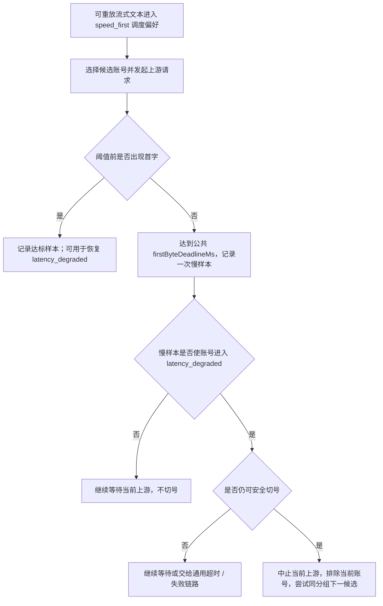

# 普通路由速度优先延迟切换设计

> 状态：已按新语义落地。2026-07-06 已实现“路由级临时覆盖账户偏好、恢复后回账户排序”，并补充“已降级候选不切换”边界回归。
> 2026-10-03 新增第 6 节“总时间兜底截止”设计（双维度观察：首字 + attempt 总时间，含压缩档），待评审后实施。
> 创建时间：2026-07-05。
> 本文细化调度偏好速度优先（普通 / 权重 / 故障回退 / 轮询 / 合并路由共用）的首字截止慢样本观察与确认慢后切号语义，避免软截止被误用成传输层硬中断。合并路由的“分组”边界即全部绑定分组合并成的合并池，慢样本作用域见第 7 节。

## 1. 背景

调度偏好速度优先的目标是减少真实交互请求被近期慢账号拖住的概率。但首字观察阈值不能直接等价于“当前请求必须切号”：

- `Responses` compact、上下文摘要、token counting、embedding 等请求天然可能没有快速首字，如果靠端点白名单维护豁免，供应商和协议越多成本越高。
- 不同供应商和协议对“首字”的语义不同，不能用复杂请求分类在网关主链路里提前穷举。
- 首次慢样本可能只是上游短暂波动，立刻中断当前请求会放大重试、连接和计费成本。

因此速度优先只保留两层：软观察、确认慢后切号。

## 2. 核心结论

- 路由策略配置为速度优先后，不再维护 endpoint / body 级请求分类豁免。
- `normalRoutingConfig.firstByteDeadlineMs` 只作用于速度优先的可重放流式文本，默认 `30000` 毫秒、范围 `10000..60000`；到期先记录慢样本，不等于当前请求必须切号。非流式文本请求豁免的是首字维度的该截止：不安装首字截止 timer、响应面不竞速、不触发快速切换，等待上限就是 `textNonStreamFirstResponseTimeoutSeconds`（默认 600 秒）；总时间维度对非流式不豁免（见第 6 节）。成本优先、图片和其他副作用请求永久排除。
- 只有可重放文本的同一运行态键在 `slowWindowSeconds` 内达到 `slowTriggerCount`（流式按截止到期记录，非流式按响应完成补记），进入 `latency_degraded` 后，才允许当前请求或后续请求执行速度优先切号。
- `maxFirstByteRetriesPerRequest` 只限制可重放流式文本确认慢后的隐藏切号次数，不再表示“任何首次超阈值都可切号”。
- 已能从请求路径确认的 `/images/*` 请求不进入 `speed_first` 专用正文 admission；图片不会因路由选择了快速模式而占用、等待或耗尽该 lease。
- 速度优先不能绕过路由硬约束，包括分组范围、账户状态、授权、时间计划、模型能力、协议能力、额度、账号硬并发、分组队列和写出安全窗口。
- 账号确认进入 `latency_degraded` 后，速度优先可以临时覆盖账户超级优先、账号优先级、备用层、会话亲和和质量排序等账户偏好，把未降级且硬可承接的账号排到前面。
- 当前请求确认慢后，只能切到同分组内未降级且硬可承接候选；如果剩余候选也已 `latency_degraded`，不切到该候选，继续等待当前响应或进入通用兜底。
- `latency_degraded` 被后台探针、真实达标请求、手动恢复、配置变更或 TTL 清理后，后续请求必须重新回到账户配置排序，避免主账号恢复后饿死或替补账号被长期打满。
- 速度优先还在首字维度之外提供第二个观察维度：attempt 总时间兜底截止（见第 6 节）。首字只反映链路连通质量（网络层数、代理、丢包），连通后的生成吞吐与上游容量（如上游号池内部排队）只有总时间能反映；压缩等大输入请求落入排队账户时总时间可达 10 分钟级。总时间维度与首字维度共用同一套慢样本状态机、降级沉底和安全切号链，不改变候选排序主键，不绕过账户优先级等配置偏好，仅在账户确认总时间慢时作为兜底降级。
- 总时间维度由两个数值参数承载（不设功能开关，交付即生效）：`speedFirstConfig.totalTimeDeadlineSeconds`（普通可重放文本，默认 120，范围 60..270）与 `speedFirstConfig.compactionTotalTimeDeadlineSeconds`（压缩请求，默认 300，范围 300..900）。压缩请求原本完全免超时（见 `docs/bug/问题-0266`），总时间截止补上该场景的总时长兜底，lane 硬超时豁免不变。

## 3. 观察入口

五种调度模式（普通 / 权重 / 故障回退 / 轮询 / 合并）的首字入口保持统一，速度优先只增加慢样本状态机：

- 可重放流式文本请求仅在 `speed_first` 时于请求开始解析一次 `firstByteDeadlineMs`，同请求的所有业务 attempt 复用，不创建第二个 timer；非流式文本请求和 `cost_first` 不创建该截止。confirmation 使用 lane hard timeout，不把该配置截止当传输失败。
- `speed_first` 在截止时仍无首字可形成一次中性请求级调度结果并写入慢样本运行态；`cost_first` 只沿用通用上游失败切号链路。
- 观察结果不写 transport 电路、Key 失败、共享可靠性或账号持久状态；速度优先只有确认慢后才写短 TTL `latency_degraded`。
- 单次超阈值只说明“本次慢”，不会立刻切号。
- 可重放文本长耗时请求可能贡献慢样本：流式在请求级截止到期时记录，非流式在响应完成时按首响应阈值补记；样本必须达到慢样本窗口和触发次数后才影响调度。图像和其他副作用请求永久退出首字软截止、慢样本、`latency_degraded` 和速度 cutover。
- 不在路由主链路解析供应商私有字段、compact trigger、token counting、embedding 或未知控制端点。

## 4. 延迟切换状态机

```mermaid
flowchart TD
  A["可重放流式文本进入 speed_first 调度偏好"] --> D["选择候选账号并发起上游请求"]
  D --> E{"阈值前是否出现首字"}
  E -- "是" --> F["记录达标样本；可用于恢复 latency_degraded"]
  E -- "否" --> G["达到公共 firstByteDeadlineMs，记录一次慢样本"]
  G --> H{"慢样本是否使账号进入 latency_degraded"}
  H -- "否" --> I["继续等待当前上游，不切号"]
  H -- "是" --> J{"是否仍可安全切号"}
  J -- "否" --> K["继续等待或交给通用超时 / 失败链路"]
  J -- "是" --> L["中止当前上游，排除当前账号，尝试同分组下一候选"]
```

“仍可安全切号”必须同时满足：

- 下游尚未写出任何可见内容。
- 当前请求仍有未尝试、未降级且可承接的候选账号。
- 未超过 `maxFirstByteRetriesPerRequest`。
- 未超过独立固定默认 270 秒的 `GatewayRequestWallBudget`。
- 候选切换不会越过分组范围、账户可调度状态、授权、模型 / 协议可承接能力、额度、账号硬并发、分组队列和响应写出边界等硬约束。

## 5. 计时细节

速度优先每个 attempt 只允许一个首字 timer，并把该 timer 的截止结果作为可决策的慢事件：

- 每个上游 attempt 只允许记录一次速度优先慢样本，避免同一个请求在等待过程中重复累计。
- 流式请求按首个可见语义输出计算首字；SSE comment、空心跳、半截 JSON、仅协议占位事件不算达标。
- 非流式生成请求豁免的是首字维度的请求级首字截止：不安装首字截止 timer、响应面不竞速、不触发快速切换；但响应完成时仍按首响应阈值补记慢样本（采样点从“截止时刻”变为“响应完成时刻”），超阈值结果照常用于慢账户识别与 `latency_degraded` 标记。其等待上限就是 `textNonStreamFirstResponseTimeoutSeconds`（默认 600 秒），超时终止当前尝试进入候选接管。总时间维度对非流式不豁免 timer（见第 6 节）。
- 如果慢样本未触发 `latency_degraded`，当前上游继续读取，直到正常首字、通用上游超时、客户端取消或通用失败链路接管。
- 如果慢样本触发 `latency_degraded` 且满足安全切号条件，当前请求才可以隐藏切号。
- 如果首字最终返回但超过阈值，并且本 attempt 已经在软 deadline 处记录过慢样本，不再重复记录。

速度优先首字软截止与 lane timeout profile 分开，且只作用于流式请求：文本流式使用 `textFirstResponseTimeoutSeconds / textStreamIdleTimeoutSeconds / textUncommittedAttemptMaxLifetimeSeconds` 和固定默认 270 秒 `GatewayRequestWallBudget`；文本非流式豁免首字软截止，等待上限就是 `textNonStreamFirstResponseTimeoutSeconds`（默认 600 秒）；图片使用独立 `image*` 单次时限与 `imageRequestWallTimeoutSeconds`（默认 3600 秒）整请求墙钟，并永久不启用首字软截止、慢样本或速度 cutover。`noAvailableAccountWaitTimeoutSeconds` 只控制另一套累计等待预算。

旧 `speedFirstConfig.firstByteThresholdMs` 只在配置读取时作为兼容别名映射到公共字段。规范化 API 响应、前端提交和 `route_strategies.config_json` 只使用 `normalRoutingConfig.firstByteDeadlineMs`；新旧字段同时出现必须拒绝，不能让两个值并行生效。

## 6. 总时间兜底截止

> 状态：设计稿（2026-10-03），待评审后实施。

### 6.1 背景与非目标

首字时间只反映“链路连通”质量：网络层数、代理链路、TLS、丢包。首字之后的剩余耗时反映的是“上游容量与吞吐”：prefill 速度、生成吞吐、上游号池内部排队（上游池化账户的并发受限时，后来请求只能等前面请求完成）。上游内部排队机制对网关不可见、不可干预，唯一可观察的结果是 attempt 总时间。

压缩（Codex compact）等大输入请求落入排队账户时总时间可达 10 分钟级；而压缩请求在 BUG-0266 语义下完全免超时（lane 硬超时禁用、wall budget 无界，仅保留流空闲超时），当前没有任何总时长兜底。

本节设计把首字截止的状态机（软观察 → 慢样本 → 确认慢 `latency_degraded` → 降级沉底 → 安全切号 → 恢复）镜像扩展到 attempt 总时间维度：

- 非目标：不改变候选排序主键（热质量首字 EWMA / 质量分排序、账户超级优先、优先级、备用层全部保持），不绕过任何路由硬约束与账户配置偏好；总时间慢只通过既有 `latency_degraded` 降级机制产生“确认慢的账户沉底”效果。
- 非目标：不做吞吐归一化（按输出 token 折算）或输入规模分桶统计评估；压缩场景由独立压缩档阈值隔离，普通档接受统一阈值（取舍见 6.10）。
- 非目标：不中断已对下游写出内容的请求；总时间截止对已写出请求只是软观察。

### 6.2 配置契约

`normalRoutingConfig.speedFirstConfig` 新增两个数值字段，仅 `schedulingPreference = speed_first` 时生效，成本优先、图片和其他副作用请求不适用：

| 字段 | 默认 | 录入范围 | 作用对象 |
| --- | --- | --- | --- |
| `totalTimeDeadlineSeconds` | `120` | `60..270` | 速度优先可重放文本（流式与非流式），估算输入 < `100000` token 的请求 |
| `compactionTotalTimeDeadlineSeconds` | `300` | `300..900` | 压缩请求（`CodexCompactionExpectedForRequest` 识别）与估算输入 ≥ `100000` token 的大输入请求 |

- 不设功能开关：字段缺省（未提交）时按默认值生效，交付即生效；写侧归一化按上表范围校验，显式 `0` 或超出范围拒绝。
- **大输入请求自动套用压缩档**：请求体估算输入 token ≥ `100000`（硬编码契约常量）的非压缩请求，总时间阈值自动套用 `compactionTotalTimeDeadlineSeconds`，不受普通档约束；已被 `CodexCompactionExpectedForRequest` 识别的压缩请求恒用压缩档。压缩档实质是"大输入请求档"——总时间的归因困境是"账户慢"与"请求本身大"不可区分：小请求跑出长总时间必然是账户排队（该记慢样本），大输入请求的天然耗时不该进普通档判据。该规则不加新参数、不加开关。
- `totalTimeDeadlineSeconds` 上限 270 与流式 `GatewayRequestWallBudget`（270 秒，请求级锚点）对齐：首个 attempt 的总时间软截止不晚于硬墙；换号后的后续 attempt 以 attempt 级锚点重新起算，其软截止可能晚于请求级硬墙到期时刻，此时由硬墙先裁决中止，软截止不再有采样机会。非流式等待上限仍是 `textNonStreamFirstResponseTimeoutSeconds`（默认 600 秒），软截止先于它生效。
- 压缩档下限即默认 300：压缩是已知大输入场景，最短兜底不低于 300 秒，与 BUG-0266 的“压缩不做 lane 级硬中断”立场一致——本截止是调度层软观察，不是 lane 超时。
- 两个新字段不纳入 Redis 存量降级状态的配置合法性校验（该校验维持原有七字段全正），存量状态无需迁移；运行态解码时新字段缺省零值视为“未设置”，回落到策略当前配置值（与写侧“缺省=默认、显式 0 拒绝”是两个层面：前者是存量状态与旧配置的兼容读，后者是管理 API 写入校验）。

### 6.3 计时口径与采样点

总时间按 attempt 级计时，锚点与首字档一致（`AttemptStartedAt`），观察对象是“该 attempt 从发起到响应完成（或截止时刻）的耗时”：

- 阈值选档在 attempt 装配时解析一次：压缩识别优先（恒压缩档）；非压缩请求按请求体估算输入 token（复用 `EstimateRequestInputTokens` 字符加权估算——转发前没有精确值）与 `100000` 分界选档，估算 ≥ 界值套压缩档，否则普通档。终态完成补记沿用该 attempt 已选定的档位，不因完成时的 usage 精确值换档（同一样本只用一把尺）。估算误差落在边界带（约 8 万~12 万）的请求可能选错档：两档阈值都是合理兜底，慢样本需累计确认，边界误档不改变收敛方向。

- 每个上游 attempt 只允许记录一次总时间慢样本，同一 attempt 不因截止到期与完成补记重复计数（与首字档“每 attempt 一次”原则一致）。
- 采样点三处：
  1. 截止 timer 到期且响应未完成 → 记一次总时间慢样本。
  2. 响应完成时 elapsed 超过阈值且本 attempt 未记过 → 补记一次总时间慢样本。
  3. 响应完成时 elapsed 未超过阈值 → 记一次总时间达标（恢复）样本。
- 流式请求在总时间截止到期时通常已对下游写出内容：只记慢样本，不中断当前响应（软观察），由降级影响后续请求选号。
- 非流式请求天然在完成前不写出内容，截止到期时满足 pre-commit 条件，进入与首字档相同的确认慢安全切号裁决；这是与首字档“非流式豁免 timer、仅完成补记”的差异点——总时间在非流式上有完整语义（请求耗时本身），且切号前提是账户已被确认慢，单次超阈值只记样本不切号，不会误杀正常长生成。
- 慢样本与达标样本的排除条件与首字档一致：客户端取消、本地认证 / 额度 / 授权 / 模型过滤、本地请求体非法、账号并发满或分组队列满的上游等待不记样本；副作用 lane 始终不记。速度优先正文 admission 排队位于 attempt 锚点之前，排队等待不计入总时间。
- 总时间 timer 是 attempt 级资源，与首字 timer 并存互不替代：attempt 中止（含首字切号）、完成或客户端取消即随 attempt 销毁，该 attempt 不再补记；换号后的新 attempt 重新起算并重新去重。去重标记按维度独立（首字慢样本与总时间慢样本各记各的，互不吞并）。
- 压缩请求：首字维度维持既有豁免——不装首字 timer、不参与首字竞速、**响应完成观测也不走首字分支**（不补记首字慢样本、不记首字恢复样本；成功压缩的首输出可达 125 秒以上，属正常形态，不得进入首字慢样本通道）。lane 硬超时与 wall budget 豁免不变，仅总时间维度生效，timer 取压缩档阈值，完成观测只按总时间档记慢样本或达标样本。

### 6.4 慢样本状态机：双通道共享降级

`latencyState` 在现有首字通道（`SlowCount` / `FirstSlowAtMs` / `LastSlowAtMs`）之外新增总时间通道计数（`TotalTimeSlowCount` / `FirstTotalTimeSlowAtMs` / `LastTotalTimeSlowAtMs`）：

- 两通道各自在 `slowWindowSeconds` 滑窗内计数，各自对比 `slowTriggerCount`；确认节奏复用现有两参数，不新增旋钮。
- **观察期跨通道计数保留**（2026-10-04 端到端实测发现的缺陷修正）：观察期（未降级）的达标样本只清**自己维度**的慢样本计数——首字快但总时长慢的请求上，一个维度的达标与另一维度的慢样本并存是常态，达标样本顺手删除整个 state 会把另一维度正在累计的观察期计数一起清零，该维度永远攒不满 `slowTriggerCount`。两通道计数都归零才删除观察期 state（单通道场景行为与既有语义一致）。已过期降级的达标清理仍与维度无关（兜底防残留）。
- 任一通道达标即触发共享的 `DegradedUntilMs` 与 `NextProbeAtMs`（已降级则保持原值不续期，语义同首字档）；`latencyState` 新增独立的 `dimension` 字段记录触发维度（`first_byte` | `total_time`），既有 `reason` 字段保持人类可读文案语义不变（管理运行态展示与既有 JSON 契约不动），jobs 侧状态结构同步新增 `dimension` 且失败续租不覆写它。注意双维度并存时的展示语义：两通道几乎同时达标时 `dimension`/`reason` 显示**最后写入**的触发维度（如非流式请求总时间 60s 先触发、首字完成补记 65s 随后覆盖展示为 `first_byte`），降级本身由先到者建立，审计 metadata（含逐次 `dimension` 与 `elapsedMs`）是判定首次触发维度的权威证据。
- 降级沉底排序复用现有 `OrderGatewayAccountsByNormalRouteLatencyDegradation`（只读 `DegradedUntilMs`），无新增排序逻辑；全池降级时旁路降级保序兜底，语义同第 7 节。

### 6.5 恢复

恢复入口按触发维度双向过滤，避免两个方向的误恢复——`first_byte` 降级被总时间达标样本清除、`total_time` 降级被首字快样本清除：

- 成功样本按维度中性化：`dimension = first_byte` 的降级只累计首字达标完成（复用现有首字 success 路径），总时间达标完成对它是中性样本；`dimension = total_time` 的降级只累计总时间达标完成，首字达标对它是中性样本。两方向的另一维度样本都不推进共享 `SuccessCount`。
- `dimension = first_byte` 的降级：恢复路径不变——真实流量首字达标累计 `RecoverySuccessCount`、jobs 后台探针双窗口达标、手动恢复或 TTL 过期。
- `dimension = total_time` 的降级：只认真实流量总时间达标完成累计 `RecoverySuccessCount`，以及 TTL 过期与手动恢复；jobs 后台探针既不清理也不续租该维度——探针候选选择与 claim 阶段跳过 `dimension = total_time` 的降级状态（探针请求规模小，测不出总时间维度，探针成功对容量型慢不构成恢复证据，继续探只会空转并在失败时错误续租）。若上游仍在排队，恢复后的首个真实请求会再次累计慢样本重新降级，方向收敛。
- jobs 侧 `speedFirstState` 同步携带 `dimension`，探针 `RecordSuccess` / `RecordFailure` 按 `dimension` 过滤。

### 6.6 切号

总时间维度确认慢后的切号完全复用首字档安全切号链，不新增切号路径：

- 前提条件相同：本 attempt 的总时间慢样本（或既有状态）使账户进入 `latency_degraded`；单次超阈值未达确认慢时不切号，继续等待当前上游。
- 安全条件相同：下游未写出任何可见内容（`SemanticCommitted = false` 且 `DownstreamBytesWritten = 0`）、仍有未尝试且未降级的硬可承接候选、未超过共享的 `maxFirstByteRetriesPerRequest` 每请求切号上限、未超过 wall budget（压缩请求 wall budget 无界，仅受切号上限约束）、未命中 cross-account 锁阻断；“无坑不跳”预占目标并发槽语义不变。`maxFirstByteRetriesPerRequest` 字段名保留不改（避免存量配置迁移），语义为“确认慢切号（首字或总时间）共享的每请求换号上限”。
- 压缩请求切号时重放语义与既有 Codex compact 契约检查不冲突：压缩请求可重放，切号后重新执行 compact 契约检查。

### 6.7 审计

- `normal_route_speed_first_slow_observed` 与确认慢切号重派审计元数据新增 `dimension` 字段（`first_byte` | `total_time`）与 `elapsedMs`（总时间维度记录截止时刻或完成时刻的 elapsed）。
- `codex_compaction_timeouts_disabled` 审计保持不变（lane 超时豁免范围未收窄）；压缩请求生效总时间截止时另行记录 `dimension = total_time` 的慢样本审计。

### 6.8 实现落点

- 配置：`backend-go/projects/gateway/internal/routestrategies/config.go` `SpeedFirstConfig` 增加两字段并入 `normalizeSpeedFirstConfig` 范围校验（缺省=默认，显式 `0` / 越界拒绝）；`bodies.go` 严格键表放行新键。`config_json` 读侧（`parseStoredConfig`）一次 unmarshal 到 map 后直接归一化，不走 struct 往返——`SpeedFirstConfig` 的 json tag 均无 omitempty，struct 往返会把存量行缺失的键物化为 `0`、越过缺省回退直达越界拒绝（fail-closed 列表整页 500）；缺失键必须保持缺失、按缺省默认生效，显式 `0` / 越界仍拒绝。
- 运行态：`gatewaypreauth/preflighthelpers.go` 压缩请求的豁免对象调整为 `NormalRouteFirstByteConfig`（首字 timer 安装与首字竞速维持 nil），`speedFirstConfig` 运行态整体照常携带（含原有七字段与新两字段，`chainSpeedFirstRuntimeConfigOf` 的“首字截止缺失即 nil”短路对压缩请求需按新维度判定，否则总时间维度会被一并熄灭）；`cmd/juhe-ai-gateway/chain_dispatch.go` `chainSpeedFirstRuntimeConfigOf` 解码新键与默认值；`gatewayproxyhealth/latencydegradation.go` `SpeedFirstRuntimeConfig` 增加两字段（存量 valid 校验维持原七字段）。
- 计时：`gatewaydispatch/dispatchsingle.go` attempt 装配处按请求类型解析对应阈值（压缩识别优先；非压缩按请求体估算输入 token 与 `100000` 分界选档，复用 `EstimateRequestInputTokens`）并安装总时间 timer（流式复用 transport timer 挂载模式，非流式复用响应段竞速骨架），压缩豁免门为总时间维度放行；timer 为 attempt 级资源，随 attempt 销毁。
- 观测：`cmd/juhe-ai-gateway/chain_v1_speedfirst.go` 响应完成观测点增加总时间分支（补记 / 达标）；压缩请求完成观测只走总时间分支，首字慢样本补记与首字恢复样本对压缩禁用；去重标记 `speedFirstSlowObservedForAttempt` 按维度拆分为独立两份（否则首字慢与总时间慢高度相关的请求会丢失总时间补记）。
- 状态机：`gatewayproxyhealth/latencydegradation.go` `latencyState` 双通道计数、触发判定与新增 `dimension` 字段（`reason` 保持文案语义）；成功样本记录按 `dimension` 双向过滤；jobs `internal/speedfirstrepo` 状态结构同步 `dimension`，探针候选选择与 `RecordSuccess` / `RecordFailure` 按 `dimension` 过滤（`total_time` 不探不续不清理）。
- 前端：`frontend/src/types/domain/access.ts` `RouteStrategySpeedFirstConfig` 增加字段；`RouteStrategiesView.vue` 速度优先配置区新增两个数字输入（请求总时间截止秒、压缩总时间截止秒，含范围与默认值提示）；运行态抽屉展示总时间慢样本计数与降级维度。
- 实施时同步文档：《AI 账户运行态探针恢复设计》（探针恢复语义按维度区分）、《网关异常重试与兜底策略》（非流式豁免限定为首字维度）、《合并路由设计》（速度优先段补总时间维度说明）。

### 6.9 回归测试

至少覆盖：

- 普通请求总时间超阈值首次只记慢样本不切号；窗口内累计 `slowTriggerCount` 次后进入降级，后续请求降级沉底。
- 流式请求总时间截止到期时已写出内容：只记慢样本，当前响应不被中断，照常完成与落 usage。
- 非流式请求总时间截止到期且账户已确认慢、未写出、有候选：按安全切号链中止重试，切号次数受每请求上限约束；未确认慢时只记样本继续等待。
- 完成时 elapsed 超阈值补记且与 timer 记录去重（每 attempt 每维度恰好一次）；首字慢与总时间慢在同一 attempt 并存时两条样本各自记录（维度独立去重）；chain 同账户引擎级重试不重置去重标记，不重复计数；完成达标记恢复样本。
- 压缩请求：不装首字 timer、lane 超时豁免不回退、响应完成不走首字观测分支（成功压缩首输出 125 秒以上不产生首字慢样本），总时间 timer 按压缩档阈值生效；压缩总时间确认慢后未写出时可安全切号，切号后 compact 契约检查照常执行。
- `dimension = total_time` 降级不被 jobs 探针选中、成功清理或失败续租；真实流量总时间达标按 `RecoverySuccessCount` 恢复，TTL 过期兜底清理；`dimension = first_byte` 恢复路径（含探针）不受影响。首字降级不被总时间达标样本清除，总时间降级不被首字达标样本清除（双向过滤）。
- 存量 Redis 降级状态在新配置校验下仍合法；新字段缺省按默认值生效。
- 大输入请求（估算输入 ≥ 10 万 token）总时间超 120 秒不记普通档慢样本，自动套压缩档阈值；同请求的 timer 与完成补记保持同档（估算边界请求不因完成时精确值换档）。
- 两通道共存：同账户首字慢与总时间慢独立计数，任一达标触发降级，`dimension` 正确区分。
- 配置归一化：范围外值与显式 `0` 拒绝，缺省回落默认；成本优先不解析总时间配置。
- 存量 `config_json`（两键加入前写入）缺键行：列表 / 详情 / 编辑回显 / patch 按缺省默认（120 / 300）生效，不 500；真实编辑保存后写回完整键集自然自愈。

### 6.10 风险和取舍

- 普通档统一阈值的残余取舍：大输入请求已由"估算输入 ≥ 10 万 token 自动套压缩档"护栏隔离（小请求跑出长总时间仍照常记慢样本——排队场景的主要形态正是小请求被前面的人拖长，护栏不削弱目标场景的捕获）。剩余误记面有二：档位边界带的估算误差（约 8 万~12 万的请求可能被普通档记慢样本）、输入中等但输出超长的请求（生成耗时主导，阈值判据不含输出规模）。两者都由确认慢节奏（`slowTriggerCount` × `slowWindowSeconds`）与全池降级保序兜底缓冲；若线上证明仍有明显误伤，演进方向是完成时输出吞吐二次判据（按 `output_tokens` 区分生成耗时与排队耗时）或输入规模多档阈值，不在第一版引入。
- 总时间降级的探针恢复局限：探针无法测出容量型慢，`total_time` 降级只能靠真实流量或 TTL 恢复，最坏恢复延迟为一个 `DegradedTtlSeconds` 周期（默认 300 秒，探针不参与该维度，既不清理也不续租）。
- 上游排队的公平性：排队账户被降级后流量转移，可能把排队压力转移到承接账户；这是调度层能做的全部（上游排队不可干预），账户池整体容量不足时不由本机制负责。

## 7. 候选排序、账户偏好和恢复回归

调度偏好速度优先采用三层裁决：

- 路由硬约束最高：调度只在当前请求所落分组的绑定范围内选择账号（普通路由只绑定一个分组；合并路由为其全部绑定分组合并成的合并池，候选可来自任一绑定分组），并且必须满足账户状态、授权、时间计划、模型能力、协议能力、额度、账号硬并发、分组队列、本地短暂屏蔽和下游未写出等硬条件。
- 路由策略目标其次：启用 `speed_first` 后，已确认慢的账号违反当前路由的速度目标；在 `latency_degraded` 有效期内，未降级且硬可承接的账号整体排在降级账号前面。
- 账户配置偏好最后：没有账号降级时，仍按分组内账户配置选择，包括超级优先、账号优先级、备用层、会话亲和、质量分和稳定排序；未降级候选内部、降级候选内部也继续保持这套账户排序。

这意味着已确认慢的主账号可以被同分组未降级的替补账号越过，即使主账号配置了超级优先或更高账号优先级。这个越过只在 `latency_degraded` 有效期内成立，不写回账户配置，也不形成更强的长期亲和。

如果当前分组所有硬可承接候选都处于 `latency_degraded`，应旁路速度降级排序，保留原候选顺序兜底，避免保护机制把号池筛空。当前请求的确认慢切号也必须过滤掉已降级候选，避免从一个已确认慢账号切到另一个已确认慢账号。后台探针或真实达标请求清理某个账号的 `latency_degraded` 后，下一次选号必须重新按账户配置排序，让恢复的主账号重新获得应有流量。

合并路由下，慢样本状态键与存储作用域（`latencyState.Scope`）的分组分量统一按账号所属绑定分组解析，键与存储 Scope 同源；合并池无分组回退，速度优先候选耗尽即全池终局。后台恢复探针按存储作用域重建键并按账号分组查找凭据，恢复探针闭环保持不变。

## 8. 并发风暴处理

延迟切换会降低误判，但并发下仍有两个风险：

- 同一慢账号被多个请求同时命中，前几批请求会一起等待。
- 多个请求几乎同时超过软阈值，可能快速累计到 `slowTriggerCount`。

初始实现可以接受第二个风险，因为它说明当前账号在同一窗口内确实对多请求表现慢。但实现时必须避免同一个 attempt 重复计数。后续如需更保守，可以增加“同波慢样本合并”：

- 以 `accountRuntimeKey + routeStrategyId + groupId` 为键。
- 在很短的 merge window 内，多个重叠 attempt 的软阈值命中最多计为一到两次。
- merge window 不作为用户配置，避免页面复杂化。

该合并不是第一版必需能力，除非真实压测证明并发误判明显。

快速模式还必须具备以下固定保护，不增加用户配置项：

- 高并发分组的文本 admission 排队位于完整 raw body 读取之前；等待中的文本请求只保留认证和路由轻量上下文，通过连接背压限制正文进入进程内存。获得 admission lease 后才读取正文，lease 持续到响应完成或连接关闭。路径已明确为 `/images/*` 的请求直接绕过这套 `speed_first` 专用 admission。
- 确认慢切号执行“无坑不跳”：先为目标账户立即占到真实并发槽，再中止原上游；没有可用目标槽时继续等待原请求，不能先断开再进入目标账户队列。
- 同一 `systemAccountId + routeStrategyId + groupId + slowAccountRuntimeKey` 使用固定共享切换预算，限制同一慢账户触发的并发迁移放大。预算与预占目标槽都必须在成功、失败、取消和未消费路径幂等释放。
- API Key 美元额度在统计快照之外维护进程内在途成本预留；并发请求以当前模型价格和有界 token 估算原子占用额度窗口，响应结束后保留覆盖统计快照延迟的短暂时间，再自动释放。无价格事实的模型不虚构费用。

## 9. 边界

速度优先观察只影响当前所落分组内部的候选排序和确认慢后的安全切号，不绕过其他网关能力：

- 仍然执行认证、额度、授权、模型过滤、账号状态、并发和协议能力校验。
- 仍然执行普通上游请求超时、客户端取消处理和响应语义检查。
- Codex compact 仍然执行 compact 契约检查。
- Chat-only compact 仍然执行网关 summary compact 的边界校验、摘要生成和 snapshot 保存。
- 仍然写使用记录和审计，只是不再写速度优先请求分类豁免 metadata。

审计 metadata：

- `normal_route_speed_first_slow_observed`：软阈值命中但未切号，包含 `slowCount`、`degraded`、`cutoverAllowed`。
- `normal_route_speed_first_slow_observed.retryBlockedReason`：未达到切号条件而继续等待时记录原因，例如未确认慢、没有候选、达到重试上限或客户端总等待到期。
- `normal_route_speed_first_confirmed_cutover`：已确认慢并执行当前请求切号。

## 10. 实现落点

目标代码落点：

- `preflight.ts` 只按普通路由配置决定是否启用速度优先，不做请求分类豁免。
- `routes.ts` 只消费速度优先运行态和切号决策，不直接解析各协议 body。
- 流式和非流式读取层需要支持软 deadline 回调，由上层决定继续等待还是中止切号。
- 速度降级运行态继续使用现有短 TTL state，不写 `accounts.status`、`cooldown_until` 或健康检测失败次数。

（Go 实现以 gatewaypreauth 为准，速度优先配置解析已放开至五种调度模式。）

## 11. 回归测试

至少覆盖：

- 普通生成请求前两次超过阈值只记录慢样本，不切号。
- 成本优先不解析首字截止；速度优先每个 attempt 只有一个首字 timer。
- 成本优先只在真实上游失败、lane hard timeout 或其他通用失败链路成立时切号，不创建速度慢样本，也不因速度配置主动取消 attempt。
- 第 `slowTriggerCount` 次超过阈值后，若仍未写下游且存在候选，才执行切号。
- 已经 `latency_degraded` 的账号再次命中时，可以在阈值处切号。
- 所有候选都降级时不无限切号，保留原顺序兜底。
- 文本长耗时请求首次超过阈值时只记录观察，不因单次慢立即切号；图像请求完全不记录该观察。
- 高并发分组已有文本占用正文 admission lease 时，直接 `/images/generations` 仍立即进入后续处理；图片绕过不得破坏后续文本请求的 FIFO 唤醒与 lease 释放。
- 客户端取消、通用上游失败、响应检查切号仍走原有失败链路。
- 超级优先账号 A 确认慢后，可在同分组内切到硬可承接的普通或备用账号 B。
- A 被后台探针或真实达标请求确认恢复后，后续请求重新按账户配置回到 A，不因之前切到 B 而长期粘在 B。
- B 被速度切号命中不会写入比账户配置和恢复状态更强的长期亲和。
- 全部硬可承接候选都降级时旁路速度排序，保留原顺序兜底。
- 当前请求确认主号慢，但剩余候选也已降级时，不切到已降级候选，继续等待当前响应或进入通用兜底。

## 12. 风险和取舍

- 延迟切换会让前几次慢请求承担等待成本，这是降低误判的代价。
- 第一版不做并发抢跑，不会同时请求多个上游取最快结果，避免双倍计费。
- 速度优先可重放文本长耗时请求仍可能累计慢样本；成本优先、图像生成和其他副作用请求永久不启用首字观测、慢样本或 cutover，不能通过调整速度优先默认 30 秒截止绕过该边界。
- 软 deadline 需要改造流式和非流式读取层，不能只在路由层事后判断。
- 速度优先不是账号健康判断。慢首字只影响短 TTL 调度态，不写持久账号状态。
- 恢复回归风险：如果探针成功或真实达标后没有及时清理 `latency_degraded`，主账号会被饿死，替补账号可能被长期耗费额度；实现必须把恢复清理和候选排序回归作为同一闭环验证。
- 探针误判风险：旧 generation 探针结果不能覆盖真实成功或新慢样本；多实例 Redis runtime state 下允许短暂不一致，但必须靠 TTL、generation 和真实达标信号收敛。
- 成本风险：确认慢后的隐藏切号可能消耗额外请求；必须受 `maxFirstByteRetriesPerRequest`、客户端总等待上限、账户额度和并发保护共同约束。
