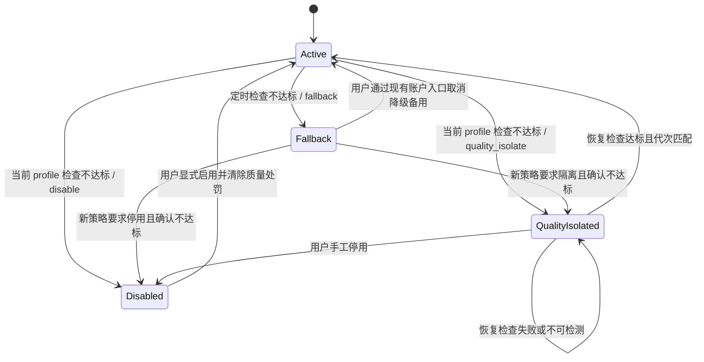

# 模型质量定时检查与处罚恢复设计

> 状态：Node 实现已完成（手工 / 定时策略职责已拆分）。本文记录当前模型检测配置、定时检查、质量处罚、健康监控联动、质量隔离状态和自动恢复契约；其他语言迁移不在本文实现范围内。

## 1. 目标与设计结论

本功能在现有模型检测上增加一个可控的生产治理闭环：

- 模型检测页新增“检测配置”图标按钮，将“深度检测”开关移入配置浮窗。
- 快速检查按钮右侧新增“定时检查”按钮，通过浮窗维护需要定时检查的自有 AI 账户。
- 检测策略增加处罚阈值、处罚方式和质量隔离恢复周期。
- 定时检查判定质量不达标时执行配置的处罚，并把健康监控当前小时直接标记为不可用。
- AI 账户增加 `quality_isolated`（质量隔离）状态，作为异常状态的明确子类和硬不可调度状态。
- `ops-worker` 增加定时质量检查调度和质量隔离恢复任务，不在 HTTP 进程中建立业务 timer。

关键安全结论：

1. 外部“手动检测配置”只作用于手工检查；每条定时计划独立保存互斥检测 profile、处罚阈值、处罚方式和质量隔离恢复周期，不继承也不回写手工配置。
2. 质量失败和普通健康检查分表保存、查询时合并；同一小时存在质量失败时强制显示不可用，普通健康检查成功不能覆盖。
3. 自动处罚与自动恢复都必须校验策略版本、账户配置版本和处罚代次，旧任务不能覆盖用户之后的编辑、停用或新一轮处罚。
4. 授权账户可以继续手工诊断，但手工处罚和定时处罚只操作检查策略所属系统账户的自有物理账户；被授权人不能处罚来源账户。

## 2. 页面与交互

### 2.1 模型检测工具栏

桌面端工具栏顺序固定为：

```text
[检测配置图标] [快速检查 / 开始深度检测] [定时检查]
```

- “手动检测配置”使用 `SettingOutlined` 图标和可读 tooltip，不只靠图标表达含义。
- 深度检测开关从主工具栏移入“检测配置”浮窗；主按钮根据已保存策略显示“快速检查”或“开始深度检测”。
- “定时检查”位于检查主按钮右侧，使用 `ClockCircleOutlined` 图标。
- 移动端三个按钮占满一行或按现有响应式规则纵向排列，不压缩账户和模型选择器。
- 管理端处于“全部系统账户”作用域时，两个配置按钮禁用并提示“请先选择具体系统账户”；避免把用户级策略误保存为平台全局策略。

### 2.2 手动检测配置浮窗

浮窗标题为“手动检测质量配置”，只影响用户从页面主动发起的检查，字段如下：

| 字段 | 类型 | 默认值 | 后端边界 | 说明 |
| --- | --- | --- | --- | --- |
| 深度检测 | 开关 | 关闭 | `profile=quick\|full` | 关闭时手工检查只使用快速模式，开启时手工检查只使用深度模式；深度模式耗时更长且消耗更多 Token。 |
| 手工检测处罚 | 开关 | 开启 | `manualEnforcementEnabled=true\|false` | 只控制手工检查是否处罚自有账户；关闭后不修改账户，但有效质量失败仍进入测试日志和健康监控。 |
| 处罚阈值 | 整数 | `70` | `40..100` | 最低只能配置 40；结果分数严格小于阈值时不达标，等于阈值视为达标。 |
| 处罚方式 | 单选 | `fallback` | `disable\|fallback\|quality_isolate` | 页面文案为“停用 / 降级备用 / 质量隔离”。 |
| 质量隔离恢复周期 | 整数分钟 | `10` | `10..10080` | 只在处罚方式为质量隔离时显示并必填；不接受秒、小时、浮点数或带单位字符串。 |

补充规则：

- 后端不存在策略记录时也必须返回 `manualEnforcementEnabled=true`，不能让前端自行猜测默认值；用户关闭开关后保存新策略 revision。
- 快速与深度是互斥 profile，不是逐级探测链路。任何一次运行只能选择其中一种；系统不得把快速失败自动升级为深度，也不得把深度失败自动降级为快速。
- 这里的“不自动降级”只描述检测 profile，不影响处罚方式中的账户现有“降级备用”能力；质量不达标后仍可按配置直接执行 `fallback`。
- 默认 `profile=quick`；只有用户在手动检测配置浮窗中显式开启深度检测并保存后，后续手工运行才使用 `profile=full`。定时计划和质量恢复不读取这份配置。
- 手工处罚开启时，检查主按钮附近显示“处罚已开启”的可读提示或 tooltip，让用户明确本次操作可能修改账户；不增加每次点击二次确认。
- 手工检测目标是授权账户时，即使开关开启也只生成诊断结果，不修改来源账户、授权实例状态或分组绑定；页面需明确提示“授权账户仅诊断”。
- 模型字段硬不匹配、协议结构硬冲突等现有 `suspicious` 硬证据不受阈值放宽影响，始终视为质量不达标。
- `unavailable` 表示未形成有效质量证据或链路不可用：健康监控记为不可用，但不直接按“造假”执行质量处罚，避免把网络、代理或余额故障误判为模型造假。
- 快速或深度检查一旦按各自完整规则形成有效不达标结论，直接执行用户配置的处罚方式；不增加自动深度确认、临时降级备用或检查 profile 回退。快速检查都无法达标时，没有必要自动追加成本更高的深度检查。
- 保存成功后返回完整策略和 `revision`；前端不以本地默认值替代后端事实。
- 页面首屏不读取质量策略；只有用户首次打开“手动检测质量配置”时才调用 `GET /model-checks/quality-policy`（用户侧为 `/my-model-checks/quality-policy`）。管理端未选择具体系统账户时不读取策略。
- 保存使用字段级 `PATCH /model-checks/quality-policy`：请求必须携带当前 `expectedRevision`，并且只提交相对已加载策略真正变化的字段。只有 `expectedRevision` 的空 PATCH 在 HTTP 边界直接拒绝；同值 PATCH 在 repository 保持零 DML、revision 不推进并返回当前策略；revision 不匹配时拒绝覆盖并提示刷新。

### 2.3 定时检查浮窗

浮窗分为“新增定时检查”和“已配置账户”两部分。

新增区：

- 账户：远程搜索，只显示当前策略所属系统账户的自有、未删除账户；授权账户不进入候选。
- 模型：默认使用账户 `healthCheckModel`，但必须属于该账户当前可检测的完整模型 ID；允许在当前账户的模型检测候选中修改。
- 账户候选接口必须返回按账户支持模型和有效模型映射计算后的 `modelCheckModels`；手工检测与定时检查都只展示这个集合，切换账户时自动切换到第一个可用完整模型 ID。保存计划时后端再次执行相同校验，禁止绕过页面写入无效账户 / 模型组合。
- 检查间隔：只接受整数分钟，默认 `60`，最小 `10`，最大 `10080`。
- 深度检测：每条计划独立配置 `profile=quick|full`，默认快速；深度模式耗时更长并消耗更多 Token。
- 处罚阈值：每条计划独立配置，默认 `70`，只接受 `40..100` 的整数。
- 处罚方式：每条计划独立配置“停用 / 降级备用 / 质量隔离”，默认降级备用。
- 质量隔离恢复周期：仅当本计划处罚方式为质量隔离时显示并必填，默认 `10` 分钟，边界 `10..10080`。
- 支持一次选择多个账户；批量新增时每个账户使用自己的默认检查模型和当前表单中的独立检测、处罚参数，创建后可逐行编辑全部计划参数。

列表列：

| 列 | 内容 |
| --- | --- |
| 账户 | 账户名、供应商和完整模型 ID |
| 检查策略 | 本计划独立保存的快速 / 深度、处罚阈值和处罚方式；质量隔离同时展示恢复周期 |
| 检查间隔 | 整数分钟 |
| 最近结果 | 时间、分数、等级、是否触发处罚 |
| 下次检查 | 后端计算的绝对时间 |
| 当前处置 | 正常、降级备用、质量隔离、因质量停用 |
| 状态 | 启用 / 暂停 |
| 操作 | 编辑、暂停 / 恢复、删除 |

列表由后端分页和稳定排序，不能加载全部账户后前端分页。编辑与暂停复用同一乐观并发保存接口；删除计划不自动清除已经生效的处罚。计划运行开始后形成不可变策略快照；保存新 revision 会阻止旧运行提交处罚，但不会改写已经生效的处罚与恢复快照。

定时计划的读取和写入遵循以下按需边界：

- 页面首屏不读取定时计划；只有用户打开“定时检查”浮窗时，才请求当前页 `GET /model-checks/quality-schedules`。
- `POST /model-checks/quality-schedules` 只用于创建，提交完整创建字段且不接受 `expectedRevision`；已有账户计划不能通过 POST 全量覆盖。
- 编辑、暂停和恢复统一使用 `PATCH /model-checks/quality-schedules/:id`，请求携带当前 `expectedRevision`，只提交相对列表行真正变化的 `model`、`intervalMinutes`、`profile`、`penaltyThreshold`、`penaltyAction`、`recoveryIntervalMinutes` 或 `enabled`。空 PATCH 在 HTTP 边界拒绝，同值 PATCH 零 DML且不推进 revision，过期 revision 拒绝覆盖。
- PATCH 成功后，前端用响应中的单条计划局部替换当前列表行，不重新请求整页；创建成功时仅在当前第一页本地插入，非第一页因分页位置不确定才重新读取当前页。
- 新增区的账户候选只在账户下拉首次展开或搜索时读取，并对搜索做短延迟合并、取消旧请求和迟到响应隔离。账户候选携带该账户可检测的 `modelCheckModels`，模型下拉优先直接使用已加载结果；编辑既有计划且当前缓存没有该账户时，只有用户展开模型下拉才通过 `selectedIds=<accountId>&limit=1` 精确补取该账户，不预取全部账户模型。

### 2.4 外部可见测试日志列表

现有模型检测历史列表升级为统一的“模型质量测试日志”外部列表，不接入“公开接口日志”或普通运行日志，也不复制第二套检测明细表。

列表采用后端普通分页，支持先按账户筛选再由用户手工翻页；默认按 `created_at DESC, id DESC` 稳定排序，新数据始终在前。账户筛选后最多只有该账户保留的 1000 条记录，允许完整翻到最后一页；不得再使用全局 1001 行查询窗口或静默钳制最大页码。未筛选账户时仍返回普通分页的最近记录，账户、触发方式、profile、状态和时间范围可以组合筛选。

以下运行无论是否处罚、成功、失败或取消，都必须先创建一条 `model_check_runs` 日志并出现在权限范围内的列表中：

- 手工快速检查和手工深度检查，包括关闭手工处罚后的无账户处罚运行；有效质量失败仍保留健康事实。
- 定时检查。
- 质量隔离恢复检查。

列表至少展示：账户、完整模型 ID、快速 / 深度、触发方式、发起人或“系统定时任务”、运行状态、分数与等级、处罚判定、实际处罚动作、开始 / 完成时间和 trace ID。

管理端继续按系统账户作用域读取；用户侧只读取自己有权查看的记录。授权账户手工检查虽然不执行处罚，仍必须保留脱敏日志并显示“授权账户仅诊断”。

### 2.5 手工检测终端的处罚反馈

手工快速 / 深度检测触发处罚时，当前终端必须实时体现完整判定和执行结果。终端内容只能来自后端进度事件，前端不能看到分数后自行推测“应该已经处罚”。

后端进度事件增加：

```ts
type ModelCheckQualityProgressEvent =
  | { type: 'quality_decision'; triggered: boolean; score: number; threshold: number; hardFailure: boolean; configuredAction: 'disable' | 'fallback' | 'quality_isolate'; message: string }
  | { type: 'quality_enforcement_started'; action: 'disable' | 'fallback' | 'quality_isolate'; message: string }
  | { type: 'quality_enforcement_completed'; action: 'disable' | 'fallback' | 'quality_isolate'; result: 'applied' | 'already_effective' | 'skipped' | 'pending_retry' | 'failed'; beforeStatus?: string; afterStatus?: string; recoveryDueAt?: string; message: string }
  | { type: 'quality_health_sync'; result: 'applied' | 'pending_retry' | 'failed'; statHour: string; message: string }
```

终端顺序固定为：

```text
探针完成
-> 质量判定（分数 / 阈值 / 硬失败）
-> 处罚开始
-> 处罚结果（实际动作和状态变化）
-> 健康监控当前小时同步结果
-> 检测终态
```

典型终端文案：

- `质量判定不达标：62 分，处罚阈值 70 分。`
- `处罚已执行：账户已设为降级备用；原超级优先已按现有互斥规则关闭。`
- `处罚已执行：账户已进入质量隔离，下次质量恢复检查时间 2026-07-26 12:30:00。`
- `处罚已执行：账户已停用。`
- `账户原本已经是降级备用，本次处罚无需重复修改。`
- `处罚写入暂未完成，已进入后台幂等重试；最终结果请查看本次检测详情。`
- `健康监控当前小时已标记为不可用。`

质量达标时也要输出一行“质量达标，未触发处罚”，关闭手工处罚时输出“手工检测处罚已关闭，本次仅生成诊断报告”，授权账户输出“授权账户仅诊断，未执行处罚”。

检测终态事件必须等待首次处罚写入尝试和健康同步写入结果后再发送，但等待必须有界。基础设施失败不篡改模型检测分数与等级：检测可以是 `completed`，同时处罚状态为 `pending_retry` 或 `failed`。用户离开页面或 SSE 断开后不依赖终端回放，持久化详情是最终权威结果。

### 2.6 定时检查详情中的处罚信息

定时检查和质量恢复的详情抽屉增加“质量判定与处罚”卡片。无论是否触发处罚都显示，不能只在失败时临时拼一段提示。

详情字段：

| 字段 | 说明 |
| --- | --- |
| 触发方式 | 手工、定时、质量恢复 |
| 计划 | `scheduleId`，支持安全跳转；记录已清理时显示明确提示 |
| 策略快照 | profile、策略 revision、手工处罚开关、处罚阈值、配置处罚方式、隔离恢复分钟数 |
| 判定 | 分数、阈值、等级、是否硬失败、是否不达标、原因码和中文说明 |
| 执行结果 | 未触发、已执行、原本已生效、跳过、待重试或失败 |
| 实际动作 | 无、停用、账户现有降级备用或质量隔离 |
| 状态变化 | 账户状态前后值；降级备用还显示 `fallbackEnabled` 和 `superPriorityEnabled` 前后值 |
| 恢复信息 | 处罚 generation、隔离开始时间、下次恢复时间和最近恢复运行 |
| 健康联动 | 当前小时、同步状态及“不可用”结论 |
| 审计信息 | actor / 系统任务、decision time、trace ID；不展示凭据或完整探针内容 |

详情中的处罚结果读取后端持久化决策，不根据当前账户状态反推。账户可能在检查后又被用户编辑，详情仍要展示当次真实前后值，同时可以额外显示“账户当前状态已变化”。

## 3. 判定与处罚语义

### 3.1 可处罚运行

模型检测运行增加来源：

```ts
type ModelCheckTriggerKind = 'manual' | 'scheduled' | 'quality_recovery'
```

- `manual`：`manualEnforcementEnabled=true` 且目标是当前策略所属系统账户的自有账户时允许处罚；开关关闭或目标是授权账户时仅诊断。
- `scheduled`：按策略判断并处罚。
- `quality_recovery`：只用于验证当前处罚是否可以解除，不创建新的并行处罚代次。

每次运行必须保存不可变策略快照：`policyRevision`、`profile`、`manualEnforcementEnabled`、`threshold`、`action`、`recoveryIntervalMinutes`、`scheduleId`、`accountConfigRevision`。运行过程中不得自动切换 `profile`。运行结束时若当前策略或账户配置版本已经变化，本次结果仍保留并按质量事实规则进入健康监控，但处罚决策记为 `stale`，不得修改账户。手工运行快照中处罚开关为关闭时不处罚；只要运行形成有效质量失败，仍进入健康监控。

### 3.2 归一化分数和硬失败

当前模型检测已经输出 `score/maxScore=100`。自动判定统一使用：

```text
hard_failure = 模型字段硬不匹配或协议硬冲突
below_threshold = score < penalty_threshold
quality_failed = hard_failure OR below_threshold
```

- 只有 `status=completed` 且 `level!=unavailable` 的可处罚运行参与处罚。
- `status=failed/canceled` 不处罚；运行基础设施失败按任务重试边界处理。
- `level=unavailable` 写健康监控不可用事实，但不执行质量处罚。
- 同一 `run_id` 最多生成一次处罚决策，重复消息和 worker 重启必须幂等。

### 3.3 三种处罚方式

#### 停用 `disable`

- 把自有物理账户改为 `disabled`，记录“模型质量自动停用”来源和触发 run。
- 账户可用时段同步、健康检查、OAuth 刷新和冷却恢复不得自动重新启用该账户。
- 用户显式启用时必须先确认并清除对应质量处罚记录，写操作日志；不由质量恢复 Job 自动恢复。

#### 降级备用 `fallback`

- 直接复用账户已经存在的“降级备用”能力，不新增质量调度覆盖、第二套备用字段或新的网关排序分支。
- 对本设计允许自动治理的自有账户，原子写现有 `accounts.fallback_enabled = 1`；复用现有账户状态更新 service、权限、校验、操作日志和网关缓存失效链路。
- 现有规则“超级优先和降级备用不能同时开启”继续生效；处罚开启降级备用时按现有账户更新语义同步关闭 `accounts.super_priority_enabled`，不能绕过原有互斥约束。
- 账户原本已经是降级备用时，本次处罚为幂等命中，不重复写配置，也不能在后续检查达标时自动取消用户原有设置。
- 作为最终处罚写入的降级备用保持生效，后续检查达标不自动取消；只有用户通过账户现有入口手工取消，或改变处罚方式后执行明确的人工处理，才修改该配置。
- 本功能没有“等待深度确认”的临时降级阶段；一旦把降级备用作为最终处罚写入，只有用户通过账户现有入口或明确的人工处置才会修改该配置。

#### 质量隔离 `quality_isolate`

- 账户状态写为 `quality_isolated`，属于异常子类和硬不可调度状态。
- 来源账户被隔离时，授权实例通过 `source_quality_isolated` 有效可用性状态同步退出候选，但不覆盖授权实例自己的持久状态。
- 质量恢复 Job 到期后发起 `quality_recovery` 检查；达标后只允许把匹配处罚代次的 `quality_isolated` 恢复为 `active`。
- 恢复失败或 `unavailable` 时保持隔离，并把下次恢复时间设置为本次完成时间加配置周期。

## 4. 状态机与并发边界



自动写状态时必须同时满足：

- 账户仍属于策略对应系统账户，未删除且不是授权实例。
- `accounts.config_revision` 等于运行快照。
- 当前策略 `revision` 等于运行快照。
- 当前处罚 `generation` 与任务 payload 匹配。
- 当前状态属于该迁移允许的来源状态。

禁止行为：

- 质量恢复把用户手工 `disabled`、`error`、`pending_test` 或更新后的账户改成 `active`。
- 旧恢复任务解除新一轮质量隔离。
- 普通健康检查、冷却复测、账户首次激活检查或 OAuth 刷新清除质量处罚。
- 为质量处罚新增第二套备用字段或网关覆盖层。
- 把自有账户处罚错误写成逐分组 `group_accounts.local_fallback_enabled` 修改；本功能只复用自有账户现有 `accounts.fallback_enabled`。

## 5. 健康监控联动

### 5.1 不采用“最后写入覆盖”

现有 `account_health_hourly` 只保存 `account_health_check` 同小时最后一条结果。直接把模型质量结果写入该表会被后续健康检查成功覆盖，因此不能复用现有最后写入胜出规则。

新增统计结果表 `account_quality_health_hourly`：

```text
account_id
system_account_id
provider_code
stat_hour
observed_at
model_check_run_id
model
profile
score
threshold
level
error_code
error_message
updated_at
PRIMARY KEY (account_id, stat_hour)
```

写入规则：

- 保存 `manual`、`scheduled` 和 `quality_recovery` 运行所产生的有效质量失败或 `unavailable` 结果；`manualEnforcementEnabled` 只决定手工运行是否处罚账户，不决定是否保存质量事实。
- 同一账户同一小时首次出现质量失败后，该小时历史保持不可用；后续普通健康成功或质量恢复成功都不删除这一事实。
- 同小时多个质量失败以 `observed_at, run_id` 较新的明细用于详情展示，但状态始终为不可用。
- 关闭手工处罚的运行仍按相同规则把有效失败同步到当前小时，只是不修改账户。授权账户手工运行不反向处罚来源账户；健康事实归属被检测账户，权限展示继续遵守授权边界。

健康监控查询对当前页账户同时批量读取两张小时表：

```text
存在 account_quality_health_hourly -> failure
否则读取 account_health_hourly -> success / failure
两者都不存在 -> unknown
```

这样普通健康检查写入路径从结构上无法覆盖质量失败。前端仍保持“可用 / 不可用 / 无记录”三态，不增加第四种颜色；详情增加来源“模型质量定时检查”、模型、分数、阈值和 run ID 的脱敏摘要。

质量小时表保存展示所需快照，不依赖测试日志长期存在；对应 run 被每账户 1000 条上限清理后，健康监控历史仍可展示当时的不可用、模型、分数和阈值，只把详情跳转标记为“测试日志已按容量清理”。

### 5.2 同步补偿与保留

- 模型检测完成时同步写 `account_quality_health_hourly`，API 请求不扫描模型检测明细。
- 同步失败时把 `healthSyncResult=failed` 固化在 run 的 `quality_decision_json`；`ops-worker` 每分钟有界扫描失败 run 并重放，成功后把 run 决策更新为 `applied`。
- 小时表按 `(account_id, stat_hour)` 幂等写入，同小时只允许更晚的 `(observed_at, run_id)` 更新详情，因此普通健康结果不能覆盖质量失败，补偿任务重复执行也不会产生多条小时事实。
- 质量小时表使用与健康小时表相同的保留期和账户删除清理边界。

## 6. 持久化模型

### 6.1 业务库

`model_quality_policies`：

```text
system_account_id PRIMARY KEY
profile
manual_enforcement_enabled
penalty_threshold
penalty_action
recovery_interval_minutes
revision
created_at
updated_at
```

`model_quality_schedules`：

```text
id PRIMARY KEY
system_account_id
account_id UNIQUE
model
interval_minutes
profile
penalty_threshold
penalty_action
recovery_interval_minutes
enabled
next_run_at
last_run_id
last_run_at
last_run_status
lease_owner
lease_until
revision
created_at
updated_at
```

`account_quality_enforcements`：

```text
account_id PRIMARY KEY
system_account_id
action                   -- fallback / quality_isolate / disable
generation
state                    -- active / cleared
enforcement_id UNIQUE
trigger_run_id
config_source             -- manual / schedule
config_source_id          -- schedule 时为计划 ID；manual 时为空
policy_revision
profile
recovery_interval_minutes
recovery_model
account_config_revision
before_status
after_status
fallback_was_enabled
super_priority_was_enabled
recovery_due_at
recovery_lease_owner
recovery_lease_until
last_recovery_run_id
cleared_at
created_at
updated_at
```

当前处罚状态机的权威事实是 `account_quality_enforcements`；它保存处罚来源和恢复所需的 profile、周期、模型快照，恢复任务不得回读当前手动配置或当前计划覆盖历史处罚。每次检测的不可变判定、处罚结果和健康同步状态直接保存在 dataset `model_check_runs.quality_decision_json`，列表与详情随 run 一次读取，不建立第二张无界 decision 历史表。

业务表需要当前 schema 的外键、检查约束和稳定索引：

- 计划扫描：`(enabled, next_run_at, id)`。
- 隔离恢复：`(state, recovery_due_at, account_id)`。
- 系统账户列表：`(system_account_id, updated_at DESC, id)`。

### 6.2 模型检测数据集

`model_check_runs` 已增加 `trigger_kind`、`schedule_id`、`policy_snapshot_json`、`quality_decision_json` 和带索引的 `quality_health_sync_status`；补偿任务不对 JSON 正文做全表扫描：

- 运行记录可以独立判断是否允许处罚和是否应进入健康监控。
- 不能依赖运行结束时再读取已经变化的策略拼接历史事实。
- 不保存凭据、完整探针题面或完整上游响应。

### 6.3 每账户日志上限与批量淘汰

模型质量测试日志按账户设置不可配置的硬上限：

```text
每个 account_id 最多 1000 条 model_check_runs
溢出时一次删除最老的 100 条终态日志
```

按最短 10 分钟一次定时检查计算，1000 条约覆盖 `1000 / 144 = 6.94` 天；检查间隔更长时自然覆盖更长时间，因此“约 7 天”是最高频率下的容量估算，不再增加独立 7 天 TTL。

精确写入规则：

1. 手工、定时和恢复统一走同一个 run 创建入口；容量统计、候选淘汰和锁都严格限定到本次 `account_id`，不同账户互不占用日志额度。
2. 获取账户级事务锁 / advisory lock 后，先统计该 `account_id` 的现有 run；少于 1000 条时直接创建新 run。
3. 已有 1000 条时，按 `created_at ASC, id ASC` 选出该账户最老的 100 条终态 run，排除 `status=running`；不能从其他账户借额度或删除其他账户日志。
4. 删除前比较这些 run 所属 observation 的最大 `(created_at, id)` 与模型可信统计聚合游标，只有候选 observation 已全部被聚合消费时才允许淘汰。
5. 若候选 observation 尚未消费，本次新 run 不得提交，保持该账户已有日志不超过 1000 条；投递统计优先消费请求、记录告警和可重试原因，待聚合游标推进后重试。不得以“暂缓清理”为由先写入第 1001 条。
6. 已确认消费后，在 dataset writer 同一事务内先删除该账户最老的 100 条终态 run，再创建新 run；`model_check_items`、可公开详情和只属于这些 run 的子记录按现有外键边界级联清理，不得留下列表无主详情。
7. 事务提交后保留约 901 条，预留后续 99 条空间；该账户在任何已提交状态下都不能观察到超过 1000 条。
8. 清理或新建失败则整个事务回滚并安全重试，不能删除成功却漏建 run，也不能静默突破账户上限。

需要增加覆盖 `(account_id, created_at DESC, id DESC)` 的索引，使账户容量检查、最老批次选择和筛选后的日志分页都走有界索引窗口。PostgreSQL 与 SQLite 必须使用等价稳定顺序。候选 run 没有 observation 时视为无需等待聚合；有 observation 时必须全部通过游标门禁。

现有 `modelCheckRetentionDays` 保留为平台级第二道保留边界：记录达到天数时可以更早删除，但任何设置都不能突破每账户 1000 条硬上限。账户逻辑 / 物理删除和全局数据维护仍按既有清理流程处理。

## 7. 后台任务

### 7.1 定时检查调度

- 归属 `ops-worker`，调度器每分钟扫描一次到期计划。
- PostgreSQL 使用有界批次、租约和 `SKIP LOCKED` 或等价 claim；SQLite standalone 由单一 ops owner 通过 DB service claim。
- 同一计划同一代次只能有一个运行；同一账户不能并行执行定时检查和质量恢复检查。
- claim 直接返回计划行内的 profile、阈值、处罚方式和恢复周期，不读取 `model_quality_policies`。
- 服务停机期间错过多轮只补跑一次，不追赶所有历史周期。
- 下一次时间从本次完成时间加 `interval_minutes` 计算，避免单次检查耗时较长时结束后立即连跑。
- 扫描、claim 或持久化失败必须保留计划并重试；上游 `unavailable` 是业务结果，不伪装成任务成功质量结论。

### 7.2 质量恢复

- 独立任务名建议为 `model-quality-recovery`，仍归属 `ops-worker`。
- 每分钟有界扫描 `state=quality_isolated AND recovery_due_at<=now`。
- claim 后生成带 `generation` 的恢复任务，并读取处罚生效时固化的 profile、恢复周期和模型；执行前后都校验处罚代次、处罚配置 revision 和账户配置版本。
- 恢复成功写账户、处罚记录、网关缓存失效和操作日志后，再标记本轮完成。
- 恢复失败固定按用户配置的整数分钟周期重新安排，不建立每账户 timer。

### 7.3 实施边界

`model-quality-health-sync-retry` 同样归属 `ops-worker`，每分钟最多重放 20 条 `healthSyncResult=failed` 的已完成 run；统计小时写入成功后再更新 run 决策。统计写成功而 run 更新失败时允许下轮幂等重放。

本功能只在当前 Node 代码中实现，包括 API、SSE、真实探针、策略与计划存储、`ops-worker` 调度、处罚、恢复、日志和健康联动。不同时编写或维护 Go 版本、第二套 worker、双写适配层或双 owner 切换逻辑。后续其他语言迁移由独立任务根据已经落地并通过测试的 Node 行为、数据库事实和接口契约处理，不属于本计划的交付范围。

## 8. API 契约

管理侧和用户侧分别复用现有 `/model-checks`、`/my-model-checks` 权限边界，当前接口为：

```text
GET    /model-checks/quality-policy
PATCH  /model-checks/quality-policy
GET    /model-checks/quality-schedules
POST   /model-checks/quality-schedules
PATCH  /model-checks/quality-schedules/:id
DELETE /model-checks/quality-schedules/:id
```

用户侧对应 `/my-model-checks/...`。管理端必须指定具体 `systemAccountId`；用户侧忽略客户端传入的系统账户 ID。质量策略 PATCH 必须携带 `expectedRevision>=0` 和至少一个可变字段；计划创建 POST 不接受 revision，计划 PATCH 必须携带 `expectedRevision>=1` 和至少一个可变字段。所有写接口只允许操作目标系统账户的自有账户，并使用 `revision` / `generation` 做乐观并发控制；CAS 失败不能回退为全量覆盖。

模型检测页的轻量静态 `GET /model-checks/options` 可以在首屏读取，但结果使用页面模块级内存缓存复用，切换 owner 或再次进入页面不重复请求；用户主动刷新时才强制更新。质量策略、定时计划和账户候选不并入该静态响应，也不得因此首屏预取。运行目标、可信对比、历史筛选和定时计划账户统一使用专用 `GET /model-checks/account-options`：只在对应下拉展开或搜索时调用，`purpose=run` 响应附带当前账户可检测的 `modelCheckModels`，`purpose=history` 不查询模型关系并返回空 `modelCheckModels`。前端不得为了填充模型下拉再拉取通用账户详情或供应商全部模型。

运行历史响应增加 `triggerKind`、`scheduleId`、`qualityDecision` 和安全的处罚摘要，便于解释“为什么健康监控变红 / 为什么账户被隔离”。

`qualityDecision` 至少包含第 2.6 节的策略快照、判定、执行结果、状态前后值、恢复和健康联动字段。SSE 使用第 2.5 节的进度事件；普通非流式 run 响应返回相同的最终 `qualityDecision`，两种入口不能出现不同处罚结果。

## 9. 可观测性

运行日志使用脱敏结构化事件名，检测详情保存 run、策略快照、状态前后值、处罚 generation、恢复时间和健康同步结果：

```text
model_quality_schedule_claimed
model_quality_schedule_run_completed
model_quality_enforcement_applied
model_quality_enforcement_skipped_stale
model_quality_health_hour_synced
model_quality_recovery_scheduled
model_quality_recovery_completed
model_quality_recovery_failed
model_quality_health_sync_retry_failed
```

日志不得包含凭据、完整 prompt、完整响应正文或可信对比账户敏感信息。

## 10. 验收标准

- 外部手动检测配置只影响手工检查；每条定时计划独立保存深度检测、处罚阈值、处罚方式，并在选择质量隔离时独立保存恢复周期。
- 手工与每条定时计划内部的快速 / 深度都严格互斥，默认快速，运行中不自动升级或降级 profile；深度模式明确提示耗时更长且消耗更多 Token。
- 阈值默认 70、最小 40、最大 100，且只接受整数；处罚默认降级备用；质量隔离恢复默认 10 分钟且最小 10 分钟，所有时间输入只接受整数分钟。
- 快速检查右侧存在定时检查按钮，可新增、编辑、暂停、删除和分页查看自有账户计划。
- 手工、定时和质量恢复全部出现在同一个外部模型质量测试日志列表，并准确展示触发方式和处罚结果；列表支持按账户筛选、普通分页和新数据优先排序。
- 手工检测触发处罚时，终端按“判定、处罚开始、实际结果、健康同步、检测终态”顺序显示后端事件；处罚待重试或失败不能显示成成功。
- 定时检查详情始终显示策略快照、判定、配置动作、实际动作、状态前后值、恢复时间和健康联动，不依赖当前账户状态反推历史。
- 每个账户已提交测试日志永不超过 1000 条；新建前按该账户选出最老 100 条终态日志，确认其 observation 已被统计游标消费后再同事务淘汰并创建，随后保留约 901 条且运行中记录不被删除。
- 授权账户不能进入自动计划或被被授权人处罚。
- “手工检测处罚”默认开启；开启时自有账户手工检测可执行处罚并联动健康监控，关闭时不修改账户，但仍保留检测日志并把有效质量失败同步到健康监控。
- 定时质量失败后，健康监控当前小时立即为不可用；随后普通健康检查成功也不能覆盖。
- `quality_isolated` 账户从网关候选中移除，并在账户列表显示“质量隔离”和恢复时间。
- 质量恢复只恢复同一处罚代次，不能覆盖人工停用、异常状态、账户编辑或新处罚。
- 降级备用直接复用账户现有 `fallback_enabled` 和更新 service，不新增备用字段或调度覆盖。
- 任务重放、worker 重启、多实例并发和重复完成事件不会重复处罚或重复恢复。
