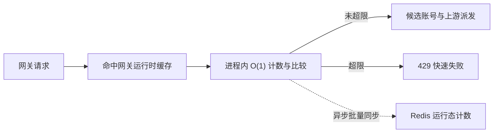

# 用户请求限制设计

## 文档边界

本文定义系统账户维度的网关请求次数限制，包括全局默认值、用户级覆盖、个人信息展示、网关快速失败和 memory / Redis 运行态计数。美元成本额度、后台管理接口限流、客户端 IP 保护、API Key 额度和统一授权额度仍按各自现有设计执行，不与本能力合并。

## 需求目标

- 系统设置提供全局每分钟、每日、每周、每月请求数限制，默认均为无限。
- 超出限制后立即返回 `429`，提示当前窗口限制值并引导联系管理员。
- 超级管理员可在系统账户编辑中为单个用户覆盖四个窗口；未填写表示继承全局，`0` 表示该用户在该窗口无限。
- 用户可在个人信息页查看四个窗口的最终生效限制，并区分全局继承和用户单独配置。
- 网关请求热路径不得查询数据库、等待 Redis、等待跨节点锁或扫描使用记录。
- 单机内存内尽量实时拦截；多节点之间允许短暂、延迟超额，以换取请求速度和系统可用性。

## 数据模型

### 全局设置

系统设置新增四个整数：

| 字段 | 含义 | 默认值 | 规则 |
| --- | --- | --- | --- |
| `gatewayUserRequestLimitPerMinute` | 每分钟请求数 | `0` | `0` 表示无限，正整数表示限制 |
| `gatewayUserRequestLimitPerDay` | 每日请求数 | `0` | `0` 表示无限，正整数表示限制 |
| `gatewayUserRequestLimitPerWeek` | 每周请求数 | `0` | `0` 表示无限，正整数表示限制 |
| `gatewayUserRequestLimitPerMonth` | 每月请求数 | `0` | `0` 表示无限，正整数表示限制 |

自然日、周和月沿用 `usageStatsTimezone`；周窗口从周一开始，月窗口从每月 1 日开始。

### 用户级覆盖

`system_accounts.request_limits_json` 保存可选覆盖对象：

```json
{
  "perMinute": 120,
  "perDay": 5000,
  "perWeek": 0,
  "expiresOn": "2026-07-31"
}
```

- 字段缺失：继承全局值。
- 字段为 `0`：用户在该窗口无限，不受全局值约束。
- 字段为正整数：使用用户值覆盖全局值。
- 空对象或 `NULL`：全部继承全局。
- `expiresOn` 为可选 `YYYY-MM-DD` 日期，作用于整组用户覆盖；所选日期当天仍有效，从 `usageStatsTimezone` 下次日 `00:00` 起整组覆盖失效并自动继承全局。
- 未填写 `expiresOn` 表示永久有效；只有到期时间而没有任何窗口覆盖时按全部继承处理，不保存空覆盖对象。
- 该字段不是敏感字段，不需要加密，也不需要索引。

## 生效值解析

后端使用同一纯函数解析最终限制，管理接口、个人信息和网关不得分别复制规则。返回结构包含：

- `limit`：最终限制，`0` 表示无限。
- `source`：`global` 或 `user`。
- `timezone`：日 / 周 / 月窗口采用的时区。
- `overrideExpiresOn`：已配置的用户覆盖到期日；未配置时省略。
- `overrideActive`：整组用户覆盖当前是否生效；已到期时四个窗口都返回全局最终值。

全局设置和用户覆盖发生变化时，必须沿用现有网关运行时失效机制，清理 API Key / gateway runtime 缓存；下一次运行时快照加载后生效。请求路径不直接查询设置表或系统账户表。

## 网关热路径



硬约束：

- 请求路径只读取已经位于 `DbServiceGatewayRuntime` 的全局设置和 API Key 所属用户覆盖值。
- 请求路径只执行进程内 Map 读取、整数加一、最多四次窗口比较和错误结构构造。
- 请求路径不得 `await` Redis，不得调用 DB service，不得读取统计表，不得扫描 `usage_records`。
- 模型目录请求不计入用户业务请求限制；内部账号测试、健康检查、冷却复测和模型检测不经过该外部网关限制。
- 被拒绝请求仍计入本地窗口，但计数达到 `limit + 1` 后封顶，避免恶意重试造成无界整数增长。

## 计数与 Redis 延迟协调

### 内存模式

- 每个 server 进程按 `systemAccountId + window + bucketKey` 保存有界计数。
- 分钟桶 TTL 至少 2 分钟，日桶至少 2 天，周桶至少 9 天，月桶至少 35 天。
- Map 默认最多保存 500,000 个桶；超过容量时以 O(1) 淘汰最早运行态并累计容量淘汰指标，不能扫描整张 Map 或让限流功能拖垮进程内存。
- 进程重启会丢失内存计数，因此 standalone 模式允许重启后的短暂超额。

### Redis 模式

- 请求仍只更新进程内计数，不同步访问 Redis。
- server 后台定时器默认每 1 秒批量同步脏桶；同步定时器必须 `unref()`，不能阻止进程退出。
- Redis 使用哈希按 `serverInstanceId` 保存各实例累计计数，并维护 `__total`。后台 Lua 只读取当前实例旧值、写入新值并把差值原子累加到 `__total`，不执行 `HVALS` 全实例扫描；重试同一累计值不会重复计数。
- 每个实例保存最近一次 Redis 总量和最近已同步本地计数。请求估算值为“最近 Redis 总量 + 本机未同步增量”。
- 多实例新增请求在下一轮后台同步前可能互相不可见，允许约 1～2 秒延迟超额。
- 单批最多同步 1,024 个脏桶；被选中的 key 轮转到脏集合末尾，避免持续热点让后续 key 永久饥饿。
- Redis 连接和命令有 3 秒后台超时，失败后断开失效客户端并指数退避，最长 30 秒；Redis 不可用时不阻塞、不拒绝全部请求，继续使用本机计数。
- server 退出前最多用 3 秒尝试排空脏桶；未排空只记录警告，不延长用户请求的等待链。

## 错误协议

超限返回：

- HTTP：`429`
- 错误码：`user_request_limit_exceeded`
- 错误类型：`rate_limit_exceeded`
- 分钟提示：`你的每分钟请求数已达到 {limit} 次，请联系管理员提升额度。`
- 日提示：`你的每日请求数已达到 {limit} 次，请联系管理员提升额度。`
- 周提示：`你的每周请求数已达到 {limit} 次，请联系管理员提升额度。`
- 月提示：`你的每月请求数已达到 {limit} 次，请联系管理员提升额度。`

同一请求同时命中多个窗口时，按分钟、日、周、月顺序返回第一个阻断原因。不同下游协议继续使用现有网关错误适配器生成兼容结构。

## 管理与用户界面

### 系统设置

- 新增“用户请求限制”分区。
- 四个输入框允许 `0..1,000,000,000`。
- `0` 明确展示为无限，不使用空值表达全局无限。
- 文案说明多节点为后台异步协调，可能出现短暂超额，但不会拖慢接口。

### 系统账户编辑

- 新增“请求限制”区域，仅超级管理员可编辑。
- 每项输入允许留空、`0` 或正整数：留空继承全局，`0` 用户无限，正整数用户覆盖。
- 提供日期选择器设置整组覆盖到期日；清空日期表示永久有效。到期日当天仍按用户配置，次日自动继承系统配置。
- 创建用户默认全部留空，即继承全局。

### 个人信息

- 在权限与能力附近新增“请求限制”展示。
- 展示四个最终生效值；无限显示“无限制”，有限值显示格式化数字和窗口单位。
- 用户覆盖项标记“单独配置”，继承项标记“全局默认”。
- 已设置到期日时展示“有效至 YYYY-MM-DD”；到期后展示“已到期，当前已继承全局”。
- 用户只能查看，不能自行修改。

## 性能验收

- 热路径限制函数必须为同步函数，不返回 `Promise`，不导入 repository、DB service 或 Redis client。
- 限流判断源文件增加静态回归门禁，禁止出现数据库调用、`await`、Redis 命令或 HTTP 调用。
- 单进程基准至少覆盖 100 万次纯内存 consume；平均单次判断目标低于 `10µs`，不包含既有 API Key 运行时读取。
- Redis 协调测试证明同步发生在后台批次，Redis 延迟或断开不会增加单个请求的 await 链。
- Browser 验证系统设置、系统账户编辑和个人信息在桌面与 390px 手机宽度无横向溢出。

## 非目标

- 不替换后台管理接口的 IP / 登录用户限流。
- 不替换 API Key 或统一授权的美元成本额度。
- 不提供用户自行申请额度或自动审批。
- 不承诺多节点严格零超额；严格同步配额会增加请求网络往返，与本设计的速度优先原则冲突。
- 本次只完成 Node.js 后端与 Vue 前端；Go 迁移、Go catalog 和 Go profile 契约不在本次范围。
