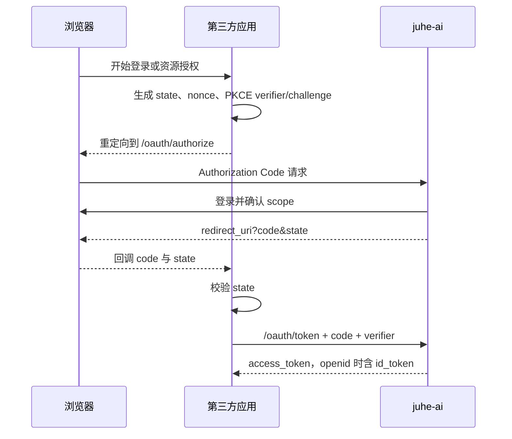
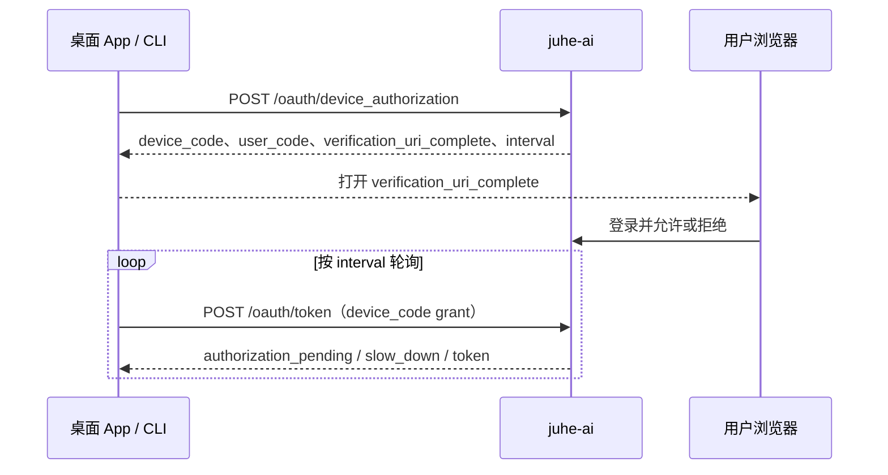

# juhe-ai 第三方 OAuth 2.1 / OIDC 对接指南

> 本仓库文档使用 `<Issuer>` 占位符，不能代替实际部署地址。管理员应在“第三方应用”列表的对应行下载绑定 Client 的动态 Markdown；下载文件已包含该应用的 Client ID、精确回调地址、允许 Scope、Discovery、JWKS 和端点地址，可直接交给第三方工程师或 AI。

## 1. 对接前准备

- 管理员登记第三方应用后，从该应用行下载绑定文档，不需要再单独提供 `Client ID`、回调地址、Scope 或服务地址。`confidential` Client 每次下载都包含当前 `client_secret`；重新签发后旧值立即失效，下载的文档自动带新值。
- `redirect_uri` 必须和登记值逐字符精确匹配，不支持通配符。浏览器和本地客户端都必须使用 PKCE `S256`。
- 浏览器授权必须生成、保存并回调校验 `state`；请求 `openid` 时还必须生成、保存并验证 `nonce`。
- juhe-ai 的 OIDC 签名私钥不会也不能提供给第三方。平台每 7 天自动轮换签名密钥，JWKS 会保留旧公钥覆盖已签发 ID Token 的验证窗口；ID Token 仅用 JWKS 公开公钥验签，建议由标准 OIDC 库从 Discovery 自动获取。
- 不支持 `refresh_token`、Implicit Flow、密码模式、用户侧已授权应用列表或用户主动撤销管理；不要假设未列出的 endpoint 已实现。

## 标准 OIDC SDK

juhe-ai 不提供私有 SDK；第三方应使用其技术栈中支持 Authorization Code + PKCE、Discovery、JWKS 和 RS256 的标准 OAuth/OIDC SDK。下载的应用专属文档已经给出 SDK 所需的 `issuer`、`client_id`、精确 `redirect_uri`、允许 `scope` 和端点。

公开 Client 不能配置 `client_secret`；机密 Client 只能由第三方服务端或 BFF 从密钥管理系统读取它。每个请求中的 `juhe:*.write` 都必须同时包含同资源的 `juhe:*.read`，否则会返回 `invalid_scope`。SDK 必须启用 PKCE `S256`，校验 `state`；使用 `openid` 时还要校验 `nonce`、`iss`、`aud`、`exp`。遇到未知 `kid` 时先刷新 JWKS 再重试验签，标准 OIDC SDK 通常会自动完成此动作；不要把单一公钥或服务端 secret 写入桌面包、浏览器或移动端。

## 2. 地址与协议边界

| 名称 | 地址或值 |
| --- | --- |
| Issuer | `<Issuer>` |
| Discovery | `<Issuer>/.well-known/openid-configuration` |
| JWKS | `<Issuer>/oauth/jwks` |
| Authorization Endpoint | `<Issuer>/oauth/authorize` |
| Token Endpoint | `<Issuer>/oauth/token` |
| UserInfo Endpoint | `<Issuer>/oauth/userinfo` |
| Device Authorization Endpoint | `<Issuer>/oauth/device_authorization` |
| Revocation Endpoint | `<Issuer>/oauth/revoke` |
| 平台扩展 Token Renewal Endpoint | `<Issuer>/oauth/token/renew` |
| ID Token 签名算法 | `RS256` |

Discovery、Authorization Code、Device Authorization、Token、UserInfo 和 Revocation 是 OAuth/OIDC 协议端点。`/oauth/token/renew` 是 juhe-ai 平台扩展，Discovery 以 `juhe_token_renewal_endpoint` 声明它；它不是 `refresh_token`，也不能延长授权硬到期。

## 3. Authorization Code + PKCE



授权请求参数：`response_type=code`、`client_id`、精确的 `redirect_uri`、空格分隔的 `scope`、`state`、`code_challenge` 和 `code_challenge_method=S256`。请求 `openid` 时添加 `nonce`。

```text
<Issuer>/oauth/authorize?response_type=code&client_id=<CLIENT_ID>&redirect_uri=<REDIRECT_URI>&scope=openid%20profile%20juhe%3Aprofile.read&state=<STATE>&nonce=<NONCE>&code_challenge=<S256_CODE_CHALLENGE>&code_challenge_method=S256
```

以下 `curl -G` 仅用于核对请求参数和 URL 编码；授权仍必须在用户浏览器中完成，不能用此命令替代登录与同意页面。

```bash
curl -G '<Issuer>/oauth/authorize' \
  --data-urlencode 'response_type=code' \
  --data-urlencode 'client_id=<CLIENT_ID>' \
  --data-urlencode 'redirect_uri=<REDIRECT_URI>' \
  --data-urlencode 'scope=openid profile juhe:profile.read' \
  --data-urlencode 'state=<STATE>' \
  --data-urlencode 'nonce=<NONCE>' \
  --data-urlencode 'code_challenge=<S256_CODE_CHALLENGE>' \
  --data-urlencode 'code_challenge_method=S256'
```

回调后先校验 `state`，再在可信环境换码。

公开 Client 示例：

```bash
curl -X POST '<Issuer>/oauth/token' \
  -H 'Content-Type: application/x-www-form-urlencoded' \
  --data-urlencode 'grant_type=authorization_code' \
  --data-urlencode 'client_id=<CLIENT_ID>' \
  --data-urlencode 'code=<AUTHORIZATION_CODE>' \
  --data-urlencode 'redirect_uri=<REDIRECT_URI>' \
  --data-urlencode 'code_verifier=<PKCE_VERIFIER>'
```

机密 Client 的服务端示例（仍必须使用 PKCE）：

```bash
curl -X POST '<Issuer>/oauth/token' \
  --user '<CLIENT_ID>:<CLIENT_SECRET>' \
  -H 'Content-Type: application/x-www-form-urlencoded' \
  --data-urlencode 'grant_type=authorization_code' \
  --data-urlencode 'code=<AUTHORIZATION_CODE>' \
  --data-urlencode 'redirect_uri=<REDIRECT_URI>' \
  --data-urlencode 'code_verifier=<PKCE_VERIFIER>'
```

## 4. Device Flow（桌面 App / CLI）



公开 Client 申请设备码：

```bash
curl -X POST '<Issuer>/oauth/device_authorization' \
  -H 'Content-Type: application/x-www-form-urlencoded' \
  --data-urlencode 'client_id=<CLIENT_ID>' \
  --data-urlencode 'scope=openid profile juhe:profile.read' \
  --data-urlencode 'nonce=<NONCE>'
```

根据响应中的 `interval` 轮询；收到 `authorization_pending` 等待该时间，收到 `slow_down` 再增大间隔。

```bash
curl -X POST '<Issuer>/oauth/token' \
  -H 'Content-Type: application/x-www-form-urlencoded' \
  --data-urlencode 'grant_type=urn:ietf:params:oauth:grant-type:device_code' \
  --data-urlencode 'client_id=<CLIENT_ID>' \
  --data-urlencode 'device_code=<DEVICE_CODE>'
```

机密 Client 调用 Token、Device Authorization、Token Renewal 或 Revocation 时，一律改用 HTTP Basic `--user '<CLIENT_ID>:<CLIENT_SECRET>'`，不再发送 body 中的 `client_id`。公开 Client 不得保管或发送 client secret。

## 5. Token、续期和撤销

- 授权自用户允许起固定 7 天（168 小时）硬到期。`access_token` 的 `expires_in` 不会超过该硬到期。
- 只有 token 已签发至少 72 小时且原授权尚未到期时，才能调用 `/oauth/token/renew`。续期会立即作废旧 token，签发 successor token，但不延长原来的 7 天硬到期；硬到期后必须重新授权。
- V1 不签发 `refresh_token`，也不接受 `refresh_token` grant。

公开 Client 续期示例：

```bash
curl -X POST '<Issuer>/oauth/token/renew' \
  -H 'Content-Type: application/x-www-form-urlencoded' \
  --data-urlencode 'client_id=<CLIENT_ID>' \
  --data-urlencode 'current_access_token=<CURRENT_ACCESS_TOKEN>'
```

第三方 Client 可撤销自己的 token：

```bash
curl -X POST '<Issuer>/oauth/revoke' \
  -H 'Content-Type: application/x-www-form-urlencoded' \
  --data-urlencode 'client_id=<CLIENT_ID>' \
  --data-urlencode 'token=<ACCESS_TOKEN>'
```

## 6. JWKS、ID Token 和个人委托 API

- ID Token 仅用于第三方自己的登录会话，只有请求 `openid` 时才返回。个人资源 API 必须使用 `access_token`。
- 用 Discovery 或 JWKS URL 获取公钥，按 `kid` 选择密钥，只接受 `RS256`，并验证签名、`iss=<Issuer>`、`aud=<CLIENT_ID>`、`exp` 和 `nonce`。平台每 7 天自动轮换密钥；本地 JWKS 缓存遇到未知 `kid` 时必须刷新一次再验签，不能把单一 JWK 固定到代码或配置中。
- 个人委托 API 基础路径是 `<Issuer>/__aidelegated__/v1`，请求头为 `Authorization: Bearer <access_token>`。资源仅代表授权用户本人。

| Scope | 可委托范围 |
| --- | --- |
| `openid`、`profile` | OIDC 身份与低敏 UserInfo claims。 |
| `juhe:profile.read`、`juhe:profile.write` | 个人资料。 |
| `juhe:api_keys.read`、`juhe:api_keys.write` | API Key 元数据，不提供明文 Key。 |
| `juhe:route_strategies.read`、`juhe:route_strategies.write` | 路由策略。 |
| `juhe:groups.read`、`juhe:groups.write` | 分组。 |
| `juhe:ai_accounts.read`、`juhe:ai_accounts.write` | AI 账户非凭据白名单字段，不提供上游凭据。 |
| `juhe:request_limits.read` | 请求限制近似快照，不保证完全精确。 |

## 7. 安全规则

- 必须校验 `state`、`nonce` 和 PKCE `S256`，并使用精确登记的 `redirect_uri`。
- 禁止在日志、错误上报、分析工具、URL、源码仓库、前端包或浏览器本地存储中记录 `code`、token、device code、PKCE verifier、state、nonce 或 `client_secret`。
- 机密 Client 的 secret 只能存在于第三方服务端；SPA、桌面 App、移动 App 与 CLI 均应作为公开 Client 处理。
- token 失效、撤销或 scope 不足时清理本地凭据并按需要重新授权，不能绕过硬到期。
