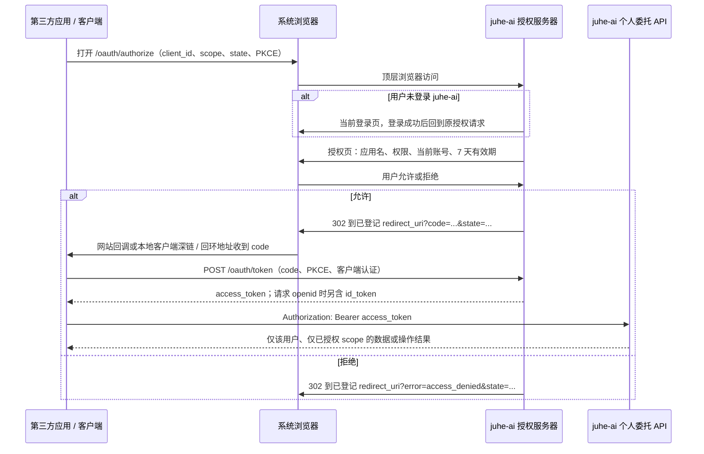
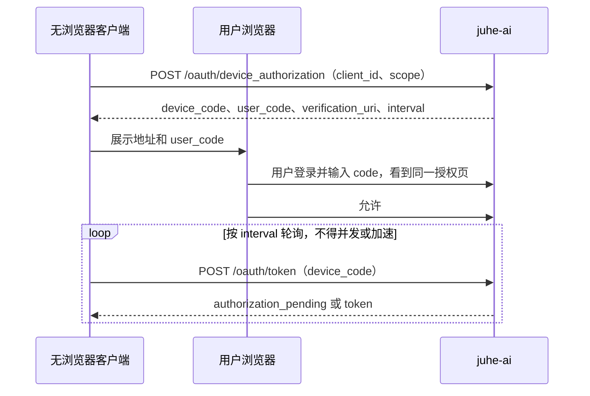
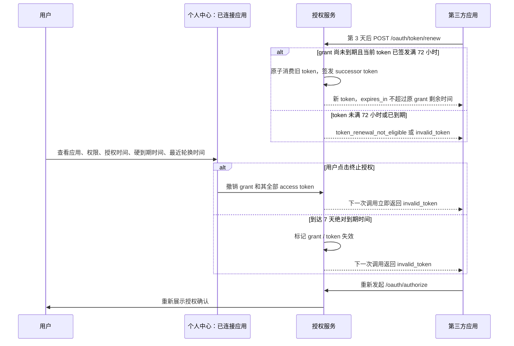

# 第三方登录与个人委托授权设计

> **状态：Node + Vue 本地实现完成，生产启用受独立门禁约束。** 已实现 OAuth 2.1 Authorization Code + PKCE、OIDC、Device Flow、个人委托 API、用户撤销和管理页面。`backend-go` 不在本次范围；当前 Node 业务库也尚未接入 PostgreSQL driver，因此不得把本实现直接作为 performance/生产模式的发布依据。

## 1. 结论与边界

本需求不是“用第三方账号登录 juhe-ai”，而是**第三方应用请求用户授权后，以该用户自己的权限使用 juhe-ai**：

1. 第三方应用把用户带到 juhe-ai 的授权页面。
2. 用户若尚未登录 juhe-ai，先完成当前 juhe-ai 登录；已登录则直接看到授权页。
3. 授权页展示应用、请求权限和 7 天授权硬到期；用户确认后，第三方取得一次性授权码并换取 token。
4. 第三方携带该 token 调用新的“个人委托 API”。服务端从 token 推导用户身份，因此只能读取或修改该用户自己的资源。
5. 用户可在个人中心的“已连接应用”随时终止授权；终止、应用被停用、账号被停用或到期后，token 立即失效。

V1 的个人委托资源范围固定为：个人信息、API Key 元数据、路由策略、分组、原始自有 AI 账户，以及用户请求限制的只读状态。除此以外的管理资源、统计、团队、授权、审计和系统设置均不对第三方开放。

协议采用 **OAuth 2.1 Authorization Code + OpenID Connect（OIDC）**。OIDC 用于“第三方登录”，OAuth scope 用于“代用户访问 juhe-ai 个人资源”。两者属于同一授权体系，但权限含义必须分开。

### 不属于本设计的能力

- 不把第三方身份反向登录并自动注册到 juhe-ai；这里的身份提供方是 juhe-ai，用户必须已有 juhe-ai 账号。
- 不复用现有 `/__aipublic__` 外部来源 Bearer token，也不复用“系统团队与统一授权”。前者是受信任外部后端维护资源的机器凭据，后者是平台内资源使用权；两者都不是用户对第三方应用的授权。
- 不支持已被淘汰的 Implicit Flow、Resource Owner Password Credentials，也不在 URL、深链或网页脚本中直接交付 access token。
- V1 不签发标准 OAuth `refresh_token`。在原授权尚未到期且当前 token 已签发满 72 小时时，Client 可通过受控轮换接口换取 successor token；轮换不延长原授权的 7 天硬到期。授权或 token 已到期后只能重新发起授权流程，让用户重新确认。

## 2. 参与方与术语

| 名称 | 含义 |
| --- | --- |
| 用户 | 已登录 juhe-ai、能够决定自己资源权限的人。 |
| 第三方应用 / Client | 需要登录或代用户操作资源的网站、服务端或本地客户端。 |
| juhe-ai 授权服务器 | 展示登录和同意页、签发授权码/token、校验撤销和有效期的一方。 |
| juhe-ai 资源服务器 | 新的个人委托 API；只接受有效 access token 并按 scope 执行。 |
| 授权码（`code`） | 仅一次可用、短时效的浏览器回调参数；不能直接调用 API。 |
| access token | 由第三方携带来调用个人委托 API 的凭据。V1 采用随机不透明 token，服务端可即时撤销。 |
| ID Token | 仅在请求 `openid` 时返回的 OIDC 身份断言，用于第三方建立自己的登录会话，不能代替 access token。 |
| 授权记录（grant） | 用户对某个第三方应用、某组 scope 在 7 天硬到期内的可撤销同意。 |

## 3. 用户可见流程

### 3.1 网站和带浏览器的本地客户端

用户始终在 juhe-ai 域名完成登录和确认。浏览器回调只携带 `code` 和调用方原样校验的 `state`，不携带 access token、用户资料或密码。

若用户尚无 juhe-ai 登录会话，授权服务必须先完成 Client 和 `redirect_uri` 校验，再创建服务端授权事务并仅把本地 `transaction_id` 交给 juhe-ai 登录页。登录成功后只允许回到本地 `/oauth/authorize?transaction_id=...`，由授权服务恢复加密保存的原始授权参数；第三方 `redirect_uri`、`state` 和 PKCE 参数不得作为前端登录页的跳转参数。

### 3.2 本地客户端的回调方式

本地客户端不是特殊的信任模型，仍是 public client，必须使用 `PKCE` 的 `S256` 方法；它没有 `client_secret`。按客户端能力选择以下一种回调：

| 场景 | 回调方式 | 要求 |
| --- | --- | --- |
| Windows/macOS/Linux 原生应用 | 自定义 URI 协议，例如 `com.example.app:/oauth/callback` | 必须使用应用所有者控制的反向域名 scheme，并在应用登记时精确登记；系统拉起本地程序后只交付 `code` 和 `state`。 |
| 本地桌面工具 | 回环地址，例如 `http://127.0.0.1:{动态端口}/callback` | 仅允许 `127.0.0.1` 或 `[::1]`；scheme、host、路径和查询参数预登记且精确匹配，只有端口可变；不接受局域网地址或任意 `localhost` 解析结果。 |
| iOS/Android | 应用声明的 HTTPS 链接 | 需要平台证明应用确实拥有该域名，防止别的 App 截获回调。 |
| 无浏览器、CLI、TV 或远程机器 | Device Authorization Grant | 客户端展示用户码和验证地址，用户在任意浏览器授权，客户端轮询 `/oauth/token` 换 token。 |

因此，“浏览器直接调用本地链接协议拉起客户端”是可行的，但只应拉起客户端并交付短时一次性 `code`。**不能把 token 放进链接协议**，否则操作系统日志、其他应用或浏览历史可能泄露它。

### 3.3 Device Flow

`device_code` 只在短时间内有效；服务端返回 `slow_down` 时客户端必须降低轮询频率。设备授权确认的账号、scope、7 天硬到期和 token 轮换规则与网页授权完全一致。

### 3.4 受控 token 轮换、7 天硬到期与主动终止

grant 从用户允许时刻起按 UTC 时间戳计算 **168 小时**，这是不能被轮换延长的硬到期。当前 access token 签发满 **72 小时**且 `now < grant.expiresAt` 时，Client 可以轮换一次；服务端原子作废旧 token、签发 scope、用户和 Client 完全相同的 successor token。successor 的 `expires_at` 固定为原 `grant.expiresAt`，因此每个 grant 最终仍在第 7 天整体失效。

轮换请求早于 72 小时必须返回 `token_renewal_not_eligible`，不得创建新 token、更新最近使用时间或消耗轮换额度；到达或超过 grant 硬到期时必须返回 `invalid_token`，且不允许通过轮换恢复。用户点击“终止授权”时，服务端按 `(systemAccountId, clientId)` 原子撤销该用户对该应用的全部有效 grant 和全部关联 access token；用户终止后不存在宽限期或缓存继续可用的情况。

## 4. 申请、同意和 token 契约

### 4.1 第三方应用登记

V1 仅允许管理员在新的“第三方应用”管理页登记 Client，暂不开放动态自助注册。每个 Client 至少记录：

- `client_id`、显示名称、官网、图标、状态和管理员说明；
- 类型：`confidential`（有服务端）或 `public`（原生/桌面/移动端）；
- 精确允许的 `redirect_uri` 清单、允许的 grant 类型和允许请求的 scope；
- confidential client 的可轮换 `client_secret`。明文只在创建或轮换时显示一次，存储和日志均不保留明文；
- 创建、修改、停用、secret 轮换和回调地址变更的审计记录。

授权请求中的 `redirect_uri` 对 HTTPS 和私有 URI scheme 必须和该 Client 已登记值**逐字符精确匹配**。回环地址是唯一例外：仅可登记 `http://127.0.0.1/{固定路径}` 或 `http://[::1]/{固定路径}`，并且 scheme、host、路径、查询参数精确匹配，运行时仅端口可变。私有 URI scheme 必须采用 Client 所有者控制的反向域名形式，例如 `com.example.app:/oauth/callback`；禁止通配符、前缀匹配、查询参数放宽、从 `Host` 推导回调地址或允许任意回调地址。

### 4.2 标准端点（目标契约）

| 端点 | 用途 | 访问边界 |
| --- | --- | --- |
| `GET /.well-known/openid-configuration` | 发布固定 issuer、端点和支持能力。 | 公开，只读取显式配置的 issuer。 |
| `GET /oauth/jwks` | 发布 ID Token 验签公钥。 | 公开。 |
| `GET /oauth/authorize` | 发起浏览器授权。 | 公开入口，内部使用 juhe-ai 登录会话。 |
| `POST /oauth/authorize/decision` | 提交允许或拒绝。 | 浏览器会话 + CSRF 防护。 |
| `POST /oauth/token` | 用授权码或 device code 换 token。 | Client 协议认证，不使用后台 Cookie。 |
| `POST /oauth/token/renew` | 在原授权有效期内受控轮换 access token。 | 表单中的当前 access token + Client 身份校验；不是标准 OAuth refresh token 端点。 |
| `GET /oauth/userinfo` | 返回 OIDC scope 允许的身份资料。 | Bearer access token。 |
| `POST /oauth/revoke` | Client 主动撤销自己的 token。 | Client 认证并受 token 归属限制。 |
| `POST /oauth/device_authorization` | 发起 Device Flow。 | 已登记 Client；public client 使用 `client_id`，confidential client 另行完成 Client 认证。 |
| `GET /oauth/device` | 用户输入 Device Flow 用户码的页面。 | 浏览器会话。 |

初期只支持 `authorization_code` 和 Device Authorization Grant；浏览器和原生客户端均属于前者。另提供平台专用的受控 token 轮换端点，但不签发或接受标准 OAuth `refresh_token`。`/oauth/token` 和 `/oauth/token/renew` 只接受表单编码的协议参数，并始终返回 `Cache-Control: no-store`。

#### 互操作字段（V1 固定）

| 场景 | 请求要求 | 成功响应 / 失败响应 |
| --- | --- | --- |
| `GET /oauth/authorize` | 固定 `response_type=code`、`client_id`、`redirect_uri`、`scope`、`state`、`code_challenge`、`code_challenge_method=S256`。`response_mode` 可省略或显式为 `query`，拒绝其他模式。请求 `openid` 时还必须给出 `nonce`；`profile` 只能与 `openid` 一起请求。 | 允许后回调 `code` 和原样 `state`；拒绝或协议错误仅在 redirect 已验证后回调 OAuth `error`、可选 `error_description` 和原样 `state`。 |
| 授权码换 token | 表单固定 `grant_type=authorization_code`、`code`、`redirect_uri`、`code_verifier`。public client 还必须带 `client_id`；confidential client 用 `client_secret_basic` 认证，且仍须提供 PKCE verifier。 | 返回 `access_token`、`token_type=Bearer`、`expires_in=floor((grant.expiresAt-now)/1000)`、实际 `scope`；含 `openid` 时返回 `id_token`；绝不返回 `refresh_token`。 |
| `POST /oauth/device_authorization` | 已登记 Client 的 `client_id` 和 `scope`；请求 `openid` 时必须带 `nonce`；confidential client 用 `client_secret_basic`。 | 返回 `device_code`、`user_code`、`verification_uri`、`verification_uri_complete`、`expires_in=600`、`interval=5`。 |
| Device 换 token | 表单固定 `grant_type=urn:ietf:params:oauth:grant-type:device_code`、`device_code`；public client 带 `client_id`，confidential client 用 `client_secret_basic`。 | 未完成返回 `authorization_pending`，过快轮询返回 `slow_down`，拒绝返回 `access_denied`，超时返回 `expired_token`；成功时返回 access token；初始请求含 `openid` 时还返回绑定初始 `nonce` 的 ID Token。 |
| `POST /oauth/token/renew` | 表单 `current_access_token`；public client 另带 `client_id`，confidential client 使用 `client_secret_basic`。token 必须属于该 Client、未撤销、签发已满 72 小时且所属 grant 未到期。 | 原子作废当前 token 后返回新的 `access_token`、`token_type=Bearer`、原 grant 剩余秒数 `expires_in` 和原 `scope`。不返回 `id_token` 或 `refresh_token`；过早返回 `token_renewal_not_eligible`，到期/撤销/已消费返回 `invalid_token`。 |
| `POST /oauth/revoke` | 表单 `token` 和可选 `token_type_hint`。public client 必须给 `client_id`；confidential client 必须用 `client_secret_basic`。 | 仅允许撤销属于当前 Client 的 token，按 RFC 7009 返回成功空响应，避免探测 token 是否存在。 |

Discovery 固定发布 `issuer`、`authorization_endpoint`、`token_endpoint`、`userinfo_endpoint`、`jwks_uri`、`revocation_endpoint`、`device_authorization_endpoint`、平台扩展 `juhe_token_renewal_endpoint`、`response_types_supported=["code"]`、`grant_types_supported=["authorization_code","urn:ietf:params:oauth:grant-type:device_code"]`、`subject_types_supported=["public"]`、`id_token_signing_alg_values_supported=["RS256"]`、`token_endpoint_auth_methods_supported=["client_secret_basic","none"]`、`code_challenge_methods_supported=["S256"]` 和完整 `scopes_supported`。V1 不支持 `prompt=none` 的无交互续期。

### 4.3 token 的格式和时效

| 凭据 | 用途 | 时效 / 一次性 | 安全策略 |
| --- | --- | --- | --- |
| `code` | 回调后换 token | 120 秒、一次性消费 | 服务端仅保存哈希；绑定 Client、redirect URI、PKCE 和授权事务。 |
| `access_token` | 调用个人委托 API 和 `userinfo` | 最长至所属 grant 的 7 天硬到期；签发满 72 小时后可轮换一次 | 高熵不透明随机值；仅保存哈希；每次调用校验 token、grant、用户和 Client 状态。 |
| `id_token` | 第三方完成 OIDC 登录 | 建议 5 分钟 | RS256 签名、可通过 JWKS 验证；包含 `iss`、`aud`、`sub`、`iat`、`exp`，有 `nonce` 时也必须包含。 |
| `device_code` | Device Flow 轮询凭据 | 建议 10 分钟 | 一次性、仅服务器可校验，不展示给用户。 |
| token 轮换 | 用当前有效 access token 取得 successor token 的受控动作 | 当前未替换 token 签发满 72 小时后、原 grant 到期前 | 原 token 立即失效；successor 继承原 grant 的剩余时长，不延长 grant。每个 successor 如仍未到 grant 硬到期，也必须重新等待 72 小时。 |

`access_token` 是访问 juhe-ai 资源的唯一凭据；`id_token` 不能调用个人委托 API。访问 token 因为需要即时撤销和一次性轮换，V1 选择不透明值而非无法即时收回的自包含 JWT。轮换不是延长授权，也不是通用 refresh token：同一个 grant 的 successor 无法超出该 grant 的原始硬到期。

## 5. Scope 和“只能操作本人”的边界

所有 Client 只能从自身登记的允许 scope 中申请，用户可以在授权页看到每一项。授权服务把用户的 `systemAccountId` 与 grant 绑定；个人委托 API 从 token 中取得该绑定，**完全忽略调用方传入的账户 ID、团队 ID 或拥有者字段**。

### 5.1 V1 scope 菜单

| Scope | 用户可见说明 | 允许范围 | 明确不允许 |
| --- | --- | --- | --- |
| `openid` | 使用 juhe-ai 账号登录第三方应用 | 稳定、不透明且永不复用的 OIDC public `sub`。 | 不能访问任何管理资源。 |
| `profile` | 读取基本身份信息 | `sub`、`preferred_username`、`name`。 | 不返回内部账户 ID、角色、状态、描述、额度、登录时间或密码。 |
| `juhe:profile.read` | 查看我的 juhe-ai 资料 | 本人可见的基础资料。 | 其他用户资料、管理员字段、会话和密码。 |
| `juhe:profile.write` | 修改我的显示资料 | 仅 `displayName` 等日后明确列出的低风险字段。 | 登录名、角色、账号状态、密码。 |
| `juhe:groups.read` / `juhe:groups.write` | 查看 / 管理我的分组 | 仅该用户拥有且个人端本来可管理的分组；删除已绑定路由策略的分组还要求 `juhe:route_strategies.write`。 | 系统分组、他人分组、成员越权、二次授权。 |
| `juhe:route_strategies.read` / `juhe:route_strategies.write` | 查看 / 管理我的路由策略 | 仅归属该用户的策略及其合法绑定。 | 系统策略、他人策略、绕过分组和账户权限。 |
| `juhe:api_keys.read` / `juhe:api_keys.write` | 查看 / 管理我的 API Key 元数据 | 名称、状态、策略绑定和脱敏摘要；写操作限于名称、状态和合法绑定。 | API Key 明文、重置密钥、创建新明文密钥。 |
| `juhe:ai_accounts.read` / `juhe:ai_accounts.write` | 查看 / 管理我拥有的 AI 账户非凭据配置 | 仅 `accounts.system_account_id = token.systemAccountId AND accounts.authorization_instance_source_account_id IS NULL` 的物理自有账户，且只限账号元数据、启停及日后明确允许的非敏感配置。该账户即使已被授权给其他用户使用，仍属于本人可委托管理的资源。 | 统一授权实例、他人拥有的来源账户、上游 API Key、OAuth refresh token、Cookie、密码、代理凭据和其他敏感原文。 |
| `juhe:request_limits.read` | 查看我的请求限制与剩余请求数 | 每分钟、每日、每周、每月的生效限制、已用量、剩余量、重置时间和配置来源。 | 修改限制、查看其他用户用量、统计明细、调用记录或系统全局设置。 |

“写”不等于不受限制的后台管理权。V1 不向第三方暴露 API Key 明文或上游认证材料，也不开放账号删除、创建 API Key、重置 API Key 或更新上游凭据。确有业务需要时，必须新增单独的高风险 scope、逐项同意文案、字段级接口契约和二次确认，不能悄悄扩大现有 scope。

### 5.2 个人委托 API 的独立边界

新增 API 使用独立前缀 `/__aidelegated__/v1`，而不是直接让 access token 调用现有 `/__aisys__/api` Cookie 管理接口。原因是前者可以稳定执行：

1. token 解析后建立“当前被授权用户”上下文；
2. 对每个资源动作检查对应 scope；
3. 强制查询和写入限定到该用户拥有的资源；
4. 返回专用、脱敏的 DTO；
5. 记录 Client、grant、scope 和结果，不记录 token 或敏感正文。

这使第三方的授权不会意外继承管理员路由、团队授权、外部来源 token 或前端 Cookie 接口的权限语义。

### 5.3 V1 个人委托 API 动作矩阵

以下是 V1 固定的 method/path、scope 和 DTO 边界。个人资料只从 token 关联的当前账户读取；分组、路由策略和 API Key 的 `{id}` 操作均先以各表的 `system_account_id = token.systemAccountId` 查询；AI 账户还必须满足 `accounts.authorization_instance_source_account_id IS NULL`。找不到时按资源不存在处理，不泄露是否属于其他用户。

| Method / Path | 所需 scope | 允许的 DTO / 动作 | 不允许的 DTO / 动作 |
| --- | --- | --- | --- |
| `GET /__aidelegated__/v1/profile` | `juhe:profile.read` | 本人基础资料的专用脱敏 DTO。 | 角色、账号状态、密码、会话、内部限制和管理员信息。 |
| `PATCH /__aidelegated__/v1/profile` | `juhe:profile.write` | 仅 `{ displayName }`。 | 修改 `username`、密码、角色、状态或任意账户 ID。 |
| `GET|POST|PATCH /__aidelegated__/v1/groups[/{id}]` | `juhe:groups.read`（GET）或 `juhe:groups.write`（其他） | `groups.system_account_id` 为本人的分组及个人端已经允许的非授权管理字段。 | 系统分组、其他用户分组、成员授权、二次授权。 |
| `DELETE /__aidelegated__/v1/groups/{id}` | `juhe:groups.write`；若该分组仍绑定任一路由策略，另需 `juhe:route_strategies.write` | 删除本人未绑定的分组；或在用户已同时授予路由策略写权限时，删除分组及受影响的本人路由策略绑定。 | 用仅有的分组 scope 间接修改路由策略、其他用户绑定、成员授权或二次授权。 |
| `GET|POST|PATCH|DELETE /__aidelegated__/v1/route-strategies[/{id}]` | `juhe:route_strategies.read`（GET）或 `juhe:route_strategies.write`（其他） | `route_strategies.system_account_id` 为本人的策略及已验证的分组绑定。 | 他人/系统策略、越权分组绑定、平台代理规则。 |
| `GET /__aidelegated__/v1/api-keys` | `juhe:api_keys.read` | `api_keys.system_account_id` 为本人的 API Key 摘要 DTO。 | Key 明文、secret 后缀以外的可重建材料、其他用户 Key。 |
| `PATCH /__aidelegated__/v1/api-keys/{id}` | `juhe:api_keys.write` | 仅 `{ name, status, routeStrategyId }`，API Key 与策略均必须属于本人。 | 创建、删除、重置、导出或返回 API Key 明文。 |
| `GET /__aidelegated__/v1/ai-accounts` | `juhe:ai_accounts.read` | `accounts.system_account_id` 为本人且 `authorization_instance_source_account_id IS NULL` 的物理自有账户的脱敏元数据。 | 统一授权实例、他人拥有的来源账户、上游认证材料。 |
| `PATCH /__aidelegated__/v1/ai-accounts/{id}` | `juhe:ai_accounts.write` | 仅上述物理自有账户的账号名称、启停等非凭据字段。该账户已产生统一授权实例时，名称或状态的既有同步/可用性影响继续按资源授权模块的现有语义执行，并必须记录受影响的授权实例数量。 | 创建、删除、修改授权实例来源、他人拥有的来源账户、上游 API Key/OAuth 凭据/Cookie/代理。 |
| `GET /__aidelegated__/v1/request-limits` | `juhe:request_limits.read` | 当前用户四个窗口的 `{ limit, limitMode, usageTracked, used, remaining, source, resetsAt }`，以及响应级 `usageStatus`、`asOf`、`timezone`、`overrideActive`、`overrideExpiresOn`。例如每日 `limit=10000`、`used=5000`、`remaining=5000`。 | 修改限制、返回其他用户数据、`usage_records` 明细、全局设置原文或管理员覆盖配置。 |

`openid` 和 `profile` 只用于 OIDC 身份端点，不能替代以上任一资源 scope。新的 method/path 必须先在本表增加对应 scope、拥有者谓词、输入字段白名单和响应 DTO，再写实现。

### 5.4 请求限制状态口径

`GET /__aidelegated__/v1/request-limits` 只读取该 token 关联用户的**最终生效**限制，沿用现有每分钟、每日、每周、每月四个窗口及 `usageStatsTimezone`。每个窗口的 `limitMode` 独立表示配置含义：`limited` 时 `limit` 为正整数、`usageTracked=true` 且 `remaining=max(0, limit-used)`；`unlimited` 时 `limit=0`、`usageTracked=false`、`used=null` 和 `remaining=null`。现有网关会跳过无限窗口计数，因此无限窗口的 `used=null` 不表示零请求，而是“不跟踪”。

这四个窗口均属于**当前用户自己的请求次数限制**，接口只读，不允许第三方修改限制配置。例如响应可以同时表达：每分钟 `limit=60 / used=12 / remaining=48`，每日 `limit=10000 / used=5000 / remaining=5000`，每周 `limit=70000 / used=21000 / remaining=49000`，每月 `limit=300000 / used=90000 / remaining=210000`。每个窗口还返回自己的 `resetsAt`；某个窗口被配置为无限时，按“不跟踪”返回，而不是返回 0 次剩余。

有限窗口的 `used` 是 Redis `__total` 聚合观察值，包含达到上限后被拒绝的计数；它不是完整请求历史。`limit + 1` 只约束每个 `serverInstanceId` 的本地内存桶，多个实例或窗口内重启实例的 `__total` 累计值可以超过 `limit + 1`。因此对外始终计算 `remaining=max(0, limit-used)`，不把聚合值人为钳制。模型目录、内部测试和健康检查不计入。

响应级 `usageStatus` 独立表示有限窗口计数的可信度，V1 取 `estimated`、`unavailable` 或 `not_tracked`，绝不与每窗口 `limitMode` 混用。当前网关以异步脏桶批量同步 Redis，不能在不改变热路径的前提下证明所有活跃实例在某一时刻都已提交某个用户窗口；因此 V1 不提供名为 `fresh` 的伪精确读数。

限额查询以性能优先：只从既有 Redis 哈希的 `__total` 读取快照，有限窗口最多四次 `HGET`，应在同一 Redis pipeline 中发出。接口**不得**等待脏桶同步、触发同步、扫描各实例字段、读取 `usage_records`、查询统计库或向 Redis 写入任何新字段；也不得修改网关实际限流的请求路径。`asOf` 仅代表本次 Redis 读取完成时刻，不代表全实例已经同步。

- `estimated`：至少一个有限窗口存在，且所有有限窗口的 Redis `__total` 都在本次 pipeline 成功读到。`used` 是当前聚合快照，缺失桶按 `0` 解释；脏桶批量上限、排队和 Redis 故障退避均可能使其他实例的增量尚未可见，因此 `remaining` 始终只是估算值。
- `unavailable`：至少一个有限窗口存在，但任一有限窗口的 Redis 读取失败或超时。此时所有有限窗口的 `used` 与 `remaining` 必须为 `null`，不得伪造为零；无限窗口仍按“不跟踪”返回 `null`。配置字段、`limitMode`、`resetsAt` 与响应 `asOf` 仍照常返回。
- `not_tracked`：四个窗口均为无限。服务端不读取 Redis；所有窗口均按 `usageTracked=false` 返回，`used` 与 `remaining` 均为 `null`。

第三方据 `limitMode`、`usageTracked` 和 `usageStatus` 可以明确区分“无限且不跟踪”“剩余为零”“余额为估算”和“余额未知”。高频轮询应由调用方自行控制，平台可以对该只读接口独立限流和短时缓存，但缓存命中时仍必须保留原始 `asOf`。

## 6. 各类调用方的实现选择

| 调用方 | 推荐模式 | token 最终落点 | 说明 |
| --- | --- | --- | --- |
| 传统网站 / SaaS | Authorization Code，confidential client | 第三方服务端 | 服务端以 `client_secret` + PKCE 换码，浏览器只保留第三方自己的会话。 |
| SPA | Authorization Code + PKCE | 内存或受保护的 BFF 会话 | 优先 BFF；不在 URL、本地存储或长期 Cookie 里保存 token。 |
| 桌面 / 移动 App | Authorization Code + PKCE | 操作系统安全凭据库 | 通过应用链接或 loopback 收 code 后换 token。 |
| CLI / 无界面设备 | Device Authorization Grant | 本地安全凭据库或受控服务端 | 用户在另一台有浏览器的设备确认。 |
| 第三方“服务端通知” | 可选业务事件，不是授权回调 | 第三方服务端 | V1 不主动 POST token 到任意 URL。后续如确有需要，只发送带签名的“授权完成事件”与事件 ID；服务端仍必须通过标准换码流程取得 token。 |

客户端 `client_secret` 不能放进桌面包、移动 App、SPA 或本地配置中；这些均是 public client，只能依赖 PKCE。服务端通知不能解决本地客户端接收问题，反而会引入回调地址验证、重放、超时重试和 SSRF 风险，所以不作为主授权方式。

## 7. 用户、管理员和第三方的管理界面

### 用户个人中心：已连接应用

每个授权记录展示应用名称、Client ID、scope 列表、授权时间、硬到期时间、最近 token 轮换时间、最近使用时间和状态。一个“应用”视图按 `(systemAccountId, clientId)` 聚合全部仍有效 grant。用户可执行：

- 终止单个应用的全部授权；
- 在到期前主动终止后重新授权；
- 看到被 Client 停用、账号状态变化或已到期造成的失效原因。

“终止授权”必须在服务端一次事务中使该 `(systemAccountId, clientId)` 的**全部**有效 grant 失效，并使其全部 access token 立即不可用；页面成功提示不能早于该操作完成。

### 管理端：第三方应用

管理员在“第三方应用”页创建、启用或停用 Client，维护其精确回调地址、可申请 scope 和 Client 类型；confidential Client 的 `client_secret` 仅在创建响应中显示一次。停用 Client 后，其新授权、换码和现有 token 都必须被拒绝。管理员还可在该页面首次生成或轮换 OIDC RS256 签名密钥；旧公钥会在最长 grant 生命周期内继续出现在 JWKS，避免已签发 ID Token 无法验证。Client 管理与既有“公开接口授权 / 外部来源系统”页面并列，名称和说明不得混淆。

### 第三方接入方

第三方只获得 `client_id`，以及 confidential client 创建时的一次性 `client_secret`。接入文档必须提供 PKCE、state、nonce、错误处理、token 保存和撤销示例，并声明不能把 token 写入前端包、日志、错误上报或 URL。

## 8. 已实现的后端模型和路由

`system_sessions` 仍只服务 juhe-ai Cookie 登录会话。OAuth/OIDC 已使用独立存储模型：

| 数据 | 关键字段 / 约束 |
| --- | --- |
| `oauth_clients`、回调地址、secret | Client 类型、状态、scope allowlist、精确 redirect URI；secret 仅哈希存储。 |
| 签名密钥 | `kid`、用途、启用/退役时间；ID Token 使用可轮换的非对称签名密钥。 |
| 授权事务与授权码 | Client、用户、scope、PKCE、nonce、可原样回送的 `state` 加密密文及校验摘要、到期时间；授权码哈希且原子一次消费。 |
| grant、OIDC subject 与 access token | grant 保存不可延长的 `expires_at`；token 保存 `issued_at`、`renewed_from_token_id`、`renewed_at` 和已消费状态。为每位用户保存稳定、不透明、永不复用的 public `sub`；token 仅哈希，grant 终止会使全部 token 无效。 |
| Device Flow 事务 | Client、用户码、设备码哈希、scope、OIDC `nonce`、轮询间隔、到期和批准状态。 |
| 审计记录 | Client、用户、动作、结果、时间、关联 ID；不写 code、token、secret、state、nonce 或 PKCE 原文。 |

OAuth/OIDC 业务路由、授权状态和业务库读写由 Node DB service 承担；主服务在网关通配路由之前把 `/.well-known/openid-configuration`、`/oauth/*` 和 `/__aidelegated__/v1/*` 流式代理给 DB service，不直接执行管理面 CRUD。issuer 固定由 `JUHE_AI_OIDC_ISSUER` 给出，生产环境必须是 HTTPS 的受控外部 origin，禁止从请求 `Host` 或转发头临时拼接。

实现默认以 `JUHE_AI_OIDC_ENABLED=false` 关闭。启用时必须配置 `JUHE_AI_OIDC_ISSUER` 和 `JUHE_AI_OIDC_KEY_ENCRYPTION_SECRET`；issuer 必须是生产 HTTPS Origin（仅测试/脚本允许本机 HTTP）。首次启用后管理员必须轮换一次签名密钥，公开 discovery/JWKS/授权端点才会可用。未满足条件时保持关闭或显式失败，不能悄悄降级为不安全的授权服务。

## 9. 必须满足的安全规则

- 所有授权码流程强制 `state` 和 `PKCE S256`；OIDC 请求 `openid` 时强制校验 `nonce`。
- `redirect_uri` 对 HTTPS 和私有 URI scheme 只允许登记值精确匹配；回环地址仅对预登记的 `127.0.0.1` / `[::1]` 固定路径放宽端口。拒绝开放重定向、片段携带 token、任意自定义协议和局域网回调。
- 同意页的允许/拒绝使用 CSRF 防护、一次性授权事务和当前真实登录会话；开发自动登录不能成为生产授权旁路。
- V1 的 `sub` 是对同一用户稳定、不透明且永不复用的 public subject，不暴露内部 `systemAccountId`。这使网站、原生客户端和 Device Flow 可以使用同一用户映射；如未来改为 pairwise subject，必须先增加并验证 OIDC Sector Identifier 的登记、域名证明和 subject 计算契约，不能改变既有 Client 的 `sub`。
- 所有授权页、token 响应和 callback 相关响应使用 `Cache-Control: no-store`，避免 token/code 进入缓存、Referer 或分析脚本。
- token 轮换按 token ID 的 compare-and-swap 原子消费：并发请求至多产生一个 successor，旧 token 在成功响应后立即失效。每个 successor 必须重新等待 72 小时才可轮换；轮换次数、失败原因和 `renew_after` 仅以脱敏审计字段记录。
- 已实现的 URL 日志清洗会对本服务的 `/oauth/authorize` 和 `/oauth/device` 请求隐藏 `state`、`nonce`、`code_challenge`、`transaction_id` 和 `user_code`。生产启用前仍须按 [安全与日志策略](安全与日志策略.md) 审核主服务、DB service、反向代理、错误收集和审计链路，证明它们不会记录 `Authorization`、Cookie、code、token、secret、完整回调 URL 或 token/device 表单正文；该审核不是本地回归可以替代的。
- `/oauth/token`、Device Flow 轮询、同意提交、回调失败和个人委托 API 已有独立的按 IP + 端点限流；授权码、device code、token 和 CSRF 具备一次性/重放防护。失败审计与异常告警仍属于生产接入门禁，不能以本地回归代替。
- Client 停用、用户账号停用、grant 撤销、token 到期和 scope 不匹配统一返回可机器处理的 OAuth/Bearer 错误，且不泄露其他用户或 Client 信息。

## 10. 实施验证与发布门禁

| 项目 | 当前证据 | 发布前仍需完成 |
| --- | --- | --- |
| 协议基础 | 隔离 SQLite + 真实 HTTP 回归覆盖 discovery/JWKS、RS256 ID Token、Authorization Code + PKCE、登录续接、CSRF、custom URI、loopback、7 天硬到期和 72 小时轮换。 | 在目标部署拓扑复验 issuer、HTTPS、反向代理和 Cookie。 |
| Device Flow | 回归覆盖 pending、slow_down、浏览器批准、拒绝、过期、一次性消费和 `nonce` 绑定。 | 配置面对外限流、告警和过期记录清理策略。 |
| 个人委托 API | 回归覆盖 token 绑定用户、scope 拒绝、四个限制窗口和 Client 停用后 token 立即失效。API Key 与 AI 账户仅有 `GET/PATCH`，不含明文、创建、删除、重置或上游凭据。 | 按第三方实际用量设置接口限流与短缓存。 |
| 管理界面 | 管理员可创建/启停 Client、一次性取得 confidential secret、生成/轮换签名密钥；用户可查看并终止自己的已连接应用。 | 完成生产角色、审计和运营流程验收。 |
| 存储与日志 | 授权码、access token、device code 和 Client secret 仅存哈希；OIDC 私钥、`state`、CSRF 和 `nonce` 加密保存。换码在真实 RS256 签名预检及 nonce 解密成功前不消费一次性 code/device code。 | Node 当前业务库仅支持 SQLite；`JUHE_AI_DATABASE_DRIVER=postgres` 会明确拒绝启动。完成 PostgreSQL driver 后，再做性能模式和生产发布验证。另需完成全链路日志脱敏审计。 |

### 启用步骤

1. 在受控 HTTPS 域名配置 `JUHE_AI_OIDC_ENABLED=true`、`JUHE_AI_OIDC_ISSUER=https://<issuer-origin>` 和稳定的 `JUHE_AI_OIDC_KEY_ENCRYPTION_SECRET`；后者变更会改变 public `sub`，不得随意轮换。
2. 以管理员身份进入 `/oauth-applications`，执行“轮换签名密钥”，再创建并审核 Client 的精确回调地址和 scope allowlist。
3. 第三方从 `/.well-known/openid-configuration` 读取 discovery。V1 的受控 token 轮换端点通过扩展字段 `juhe_token_renewal_endpoint` 声明，不伪装为标准 `refresh_token`。
4. 用户可从 `/connected-applications` 终止授权；这一操作会撤销该用户与该 Client 的全部 grant 和 token。

## 11. 已固定的 V1 边界

1. 对外个人资源固定为个人信息、API Key、路由策略、分组、AI 账户和请求限制；请求限制只读。其他资源不登记 scope、不出现在授权页，也不提供个人委托 API。
2. `juhe:ai_accounts.write` 仅允许物理自有账户的名称、状态等现有非凭据白名单字段；上游凭据永不进入本 scope。
3. 不支持第三方创建或重置 juhe-ai API Key；此能力若有需求，必须另建高风险 scope、字段契约与二次确认。
4. Client 仅由管理员人工登记，避免未审核回调地址和 scope 进入授权页。
