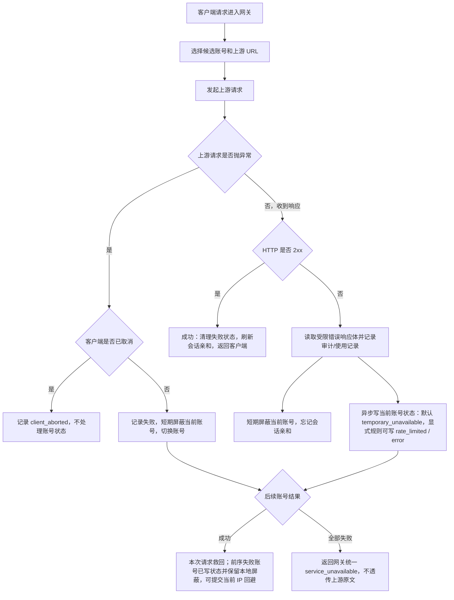
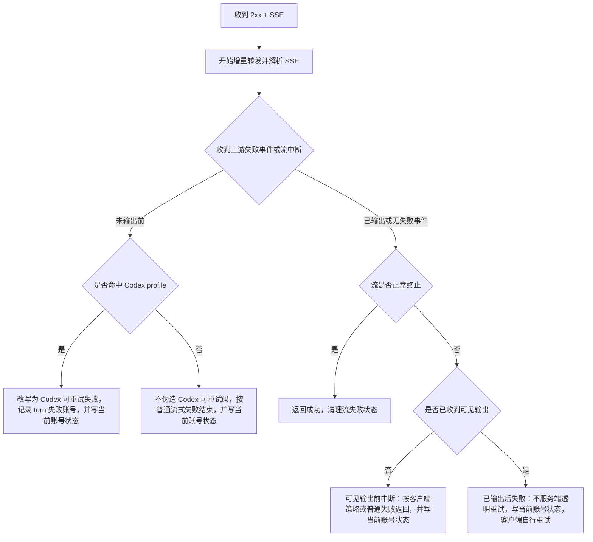
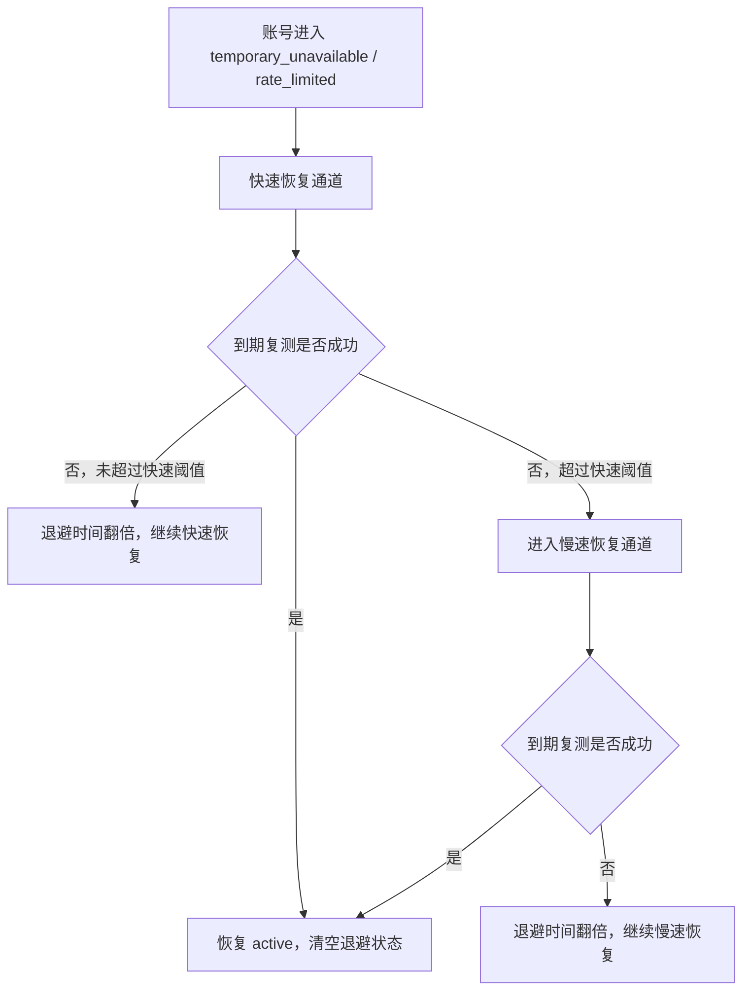

# 网关异常重试与兜底策略

## 目标

本文固定 OpenAI 兼容网关在上游异常、账号错误策略、未知失败和流式中断时的处理顺序，避免后续维护时把“账号错误策略”“本地失败隔离”“流熔断”重复实现或互相抢逻辑。

核心原则：

- 命中上游账号后的错误都写当前账号状态：上游请求异常、非 `2xx` 响应、非流式正文中断、流式失败事件或流中断都进入账号错误写入链路；默认写 `temporary_unavailable`，账号显式规则可以改写为 `rate_limited` 或 `error`。
- 兜底层不维护状态码、错误码或错误文案白名单：状态码和上游错误体只作为诊断字段、审计字段和用户显式配置规则的输入，代码不内置“余额不足”“限流”“某状态码才写状态”之类判断。
- 未知失败交给统一失败流水线：任何上游请求异常或非 `2xx` 响应都先短期屏蔽当前账号、忘记会话亲和、切换后续账号，同时异步写当前账号状态；后续账号成功只救回本次请求，不清除前序失败账号的本次错误状态。
- 当候选账号都被本地屏蔽时，请求进入短等待，等待最早屏蔽释放或等待预算耗尽；不再因为“只剩一个号”就旁路屏蔽继续打失败账号。
- IP 级账号回避只依据调度事实：前序账号失败、后续账号完整成功时，才让当前客户端 IP 短期避让前序账号；状态码只作为规则输入和排障字段，不能作为默认避让或冷却依据。
- IP 级错误熔断只依据高置信本地请求错误：认证前缺失 Bearer / 无效 token 探测、本地校验失败在短窗口内重复出现时，才允许短 TTL 本地 `429`；不能把账号池未知失败或容量失败归咎给 IP，也不能按地区、状态码或固定错误码黑名单拦截。
- 上游桶运行态失败只影响候选排序；同 `proxy`、`baseUrl` 或 `provider` 多个账号短窗失败时优先避让该桶账号，不能自动禁用代理、禁用上游或冷却账号。
- 已经向客户端输出内容的请求不做服务端透明重试：非流式不能安全替换半截 JSON，SSE 不能安全重放半段回答或工具参数；需要重试时由客户端在连接失败或协议失败事件后发起新请求。
- 客户端专属行为必须策略分层：Codex 的 `response.failed/upstream_retryable_error` 重试语义、`x-codex-turn-metadata.turn_id` 和第 4 次切号策略不能写进通用 OpenAI 兜底层。

## 关键参数

| 参数 | 默认值 | 用途 |
| --- | --- | --- |
| `temporaryUnschedulableRetryAttempts` | `3` | 临时不可调度确认重试次数设置；普通上游失败流水线不再用它决定同一账号上的重复尝试，冷却恢复复测会显式覆盖为不做同账号重试 |
| `temporaryUnschedulableRetryIntervalSeconds` | `3` | 临时不可调度确认重试间隔设置；普通上游失败流水线不再用它决定同一账号上的重复尝试间隔，冷却恢复复测会显式覆盖为不做同账号重试 |
| `defaultTemporaryUnschedulableMinutes` | `5` | 目标语义为临时不可调用最大暂停时间；账号进入恢复流程后从快速恢复通道起步，连续失败后翻倍，慢速恢复通道不超过该上限 |
| `streamCircuitBreakerEnabled` | `true` | 是否启用流式超时和流失败计数 |
| `streamRequestTimeoutSeconds` | `180` | 上游首包等待上限；非流式和流式在响应头前、非流式在首字节前超过该时间时按上游请求异常切号 |
| `streamIdleTimeoutSeconds` | `60` | 流式首段后上游 raw chunk 空闲上限；完整 SSE 事件等待只记录诊断，不再硬熔断 |
| `streamFailureThresholdCount` | `3` | 历史流失败计数参数；真实网关流式失败已改为单次失败即写账号状态 |
| `streamFailureThresholdWindowMinutes` | `10` | 历史流失败计数窗口参数；真实网关流式失败不再依赖该窗口决定是否写状态 |
| `cooldownAccountRetestMaxBackoffHours` | `24` | 冷却后台复测的最长自动恢复观察窗口；超过后转为 `cooldown_retest_max_recovery_exceeded` 异常并停止自动复测 |

## 普通响应流程



## 普通响应处理顺序

1. **上游请求抛异常**
   - 客户端取消：记录 `client_aborted`，释放资源，不写账号失败状态。
   - 连接失败、超时、unexpected EOF 等请求异常：记录失败，短期屏蔽当前账号，异步写当前账号 `temporary_unavailable`，并切换后续账号。
   - 请求异常不按错误码分类，不在同一账号上重复消耗尝试；错误摘要写入当前命中账号的最近错误字段。

2. **上游返回 HTTP 2xx**
    - 认为本次上游响应成功。
    - 刷新会话亲和。
    - 清理或衰减当前账号的可恢复软失败状态；普通成功不自动恢复 `rate_limited`。
    - 如果本请求之前已有失败账号，则这些账号已进入本地短期屏蔽并写入本次失败状态；如果当前请求有可用客户端 IP，可提交为当前 IP 对前序账号的短 TTL 回避。
   - 非流式 `2xx` 首字节前仍属于安全切号窗口；如果首字节等待超过上游首包等待上限，网关按上游请求异常切换后续账号。
   - 非流式首字节已经写给下游后，如果正文中途异常，网关记录 `upstream_body_interrupted`，忘记会话亲和并短期本地避让当前账号，然后打断下游连接；这会让客户端在读取 body 时看到网络失败，再由客户端自身重试策略发起新请求。

3. **上游返回 HTTP 非 2xx**
   - 先匹配账号 `credentials.error_handling_rules`；账号规则默认不配置，只有用户手动添加时才参与匹配。
   - 不论是否命中账号策略，都先短期屏蔽当前账号并切换后续账号。
   - 命中账号错误策略时，异步写入策略指定的限流、临时不可调用或异常状态。
   - 未命中账号规则时，异步写入通用 `temporary_unavailable`；不按状态码、错误码、错误类型或错误文案做代码内置例外分支。

## 本地账号屏蔽与等待

普通上游失败进入本地账号屏蔽：

- 每个失败账号立即进入当前 Web 进程内短 TTL 屏蔽。
- 当前请求继续尝试后续候选账号；后续账号成功时，本次请求救回。
- 前序失败账号在命中上游错误时会写入当前账号状态；本地屏蔽负责当前进程调度避让，SQLite 状态负责账户页和后台恢复流程。
- 后续请求选号时先过滤本地屏蔽账号。
- 如果过滤后仍有账号，继续后续代理避让、IP 级回避和 Codex turn 避让。
- 如果全部候选都被本地屏蔽，进入等待；等待最早屏蔽释放，或等待预算耗尽。
- 高并发分组复用 `maxQueueWaitMs` 作为等待预算；普通分组使用固定短等待预算。
- 等待超时仍无账号可用时返回网关统一 `503 service_unavailable`，不返回最后一个上游错误体。

这层屏蔽是进程内易失运行态，不写 SQLite，不作为长期账号健康事实。它解决的是“失败账号被大量后续请求继续命中”的调度风暴，而不是账号状态定性。

## IP级账号回避

IP 级账号回避是本地账号屏蔽之外的来源级排序辅助，不是账号健康判断：

- 只有当前序账号失败、后续账号完整成功时，才把前序账号记录为当前 `systemAccountId + apiKeyId + clientIp` 下的短 TTL 回避账号。
- `groupId` 不参与 IP 级账号回避键。同一个 API Key 下发生分组切换时，来源对某个账号的短期失败经验应跟随账号和 API Key，不按分组容器重新切碎。
- 回避只影响后续候选账号排序：命中回避的账号排到后面；如果所有候选账号都被当前 IP 回避，则旁路回避并保留原候选列表，避免把账号池筛空。
- 账号错误策略、客户端取消、本地校验失败、额度 / 授权 / 模型过滤失败、账号并发满、代理预检跳过和没有后续成功样本的全失败请求，都不能记录 IP 级账号回避。
- 当前 IP 后续通过某个账号完整成功时，清理该 IP 对该账号的回避状态。
- IP 级回避状态属于进程内短 TTL 运行态，服务重启或缓存淘汰后可以丢失；丢失后回到普通调度，不写入账号状态，也不作为后台复测对象。

具体设计见 [IP 级账号回避与自动切号设计](IP级账号回避与自动切号设计.md)。

## IP级错误熔断

IP 级错误熔断包含认证前窄作用域入口保护和认证后来源级止损能力，不是账号调度排序能力：

- 认证前作用域只能使用 `clientIp + missing_bearer`、`clientIp + token 指纹` 或“已验证无效 token 后”的喷洒计数；随机无效 token 不能在认证前挡住同 IP 的有效 Bearer。
- 作用域为 `systemAccountId + apiKeyId + clientIp`，缺少认证后 scope 或缺少 `clientIp` 时不启用；`groupId` 不参与错误熔断键，同一 API Key 下不同分组共享来源错误风暴状态。
- 只消费高置信本地请求错误：本地 JSON 解析失败、模型过滤失败和 OAuth/Codex adapter 本地校验失败。上游账号池失败只进入账号本地屏蔽和切号流水线，不计入来源错误熔断。
- 命中阈值后短 TTL 返回本地 OpenAI-compatible `429`，不进入账号候选排序和上游调度。
- 账号错误策略命中、未知账号池失败、代理失败、账号并发满、分组队列满、单 IP 并发满、客户端取消和流式已输出后失败，默认不计入来源错误熔断。
- 成功请求或 TTL 到期后应恢复当前来源；连续触发可以短期退避，但必须有最大上限。
- 错误熔断状态属于进程内易失运行态，不持久化为 IP 黑名单，不写账号冷却，也不作为后台复测对象。
- 禁止区域性封禁和固定状态码 / 错误码黑名单。

具体设计见 [IP 级错误熔断与恶意请求保护设计](IP级错误熔断与恶意请求保护设计.md)。

## 流式响应流程



## 流式边界

- `response.created`、`response.in_progress`、metadata、心跳和 header 类事件不算可见输出；即使这些事件已经写给下游，也不作为账号流失败计数依据。
- 文本 delta、reasoning delta、工具调用参数 delta、会改变 assistant 内容或工具状态的 output item 事件算可见输出。
- 可见输出判断必须由同一个公共函数提供，流式拦截和账号流失败副作用不能各自维护一套判断。
- 当前运行时已经把可见输出前的 `response.failed/upstream_retryable_error` 收敛到客户端策略层：只有 `clientProfile = codex` 且 `downstreamProtocol = responses_sse`、并能精确解析 `x-codex-turn-metadata.turn_id` 时才写出 Codex 可重试失败；未命中策略时按普通流式失败返回。无论是否命中 Codex profile，只要是命中上游账号后的流式失败，都会写当前账号状态。
- 可见输出前失败包含：首段前无数据、首段后上游空闲、上游读取异常 / EOF、缺少 OpenAI 终止事件、上游 `response.failed`、上游通用 `event: error`。持续有 raw chunk 但暂未形成完整 SSE 事件只记录诊断并继续转发。普通事件里的顶层 `code/message` 字段不单独视为失败。
- 已经输出后的失败默认不能由服务端伪造整轮重试；网关记录上游桶运行态用于后续排序，同时写当前账号状态，让客户端在连接失败或协议失败后自行重试。`cyber_policy` 是 Codex profile 下的显式例外，即使已输出也改写为 `upstream_retryable_error`，用于让 Codex 自行重试。
- 当前不再维护流式错误码特征白名单或 Codex 终止类白名单；`server_is_overloaded`、`slow_down`、`context_length_exceeded`、`insufficient_quota`、`usage_not_included`、`invalid_prompt`、`cyber_policy`、通用 `event: error`、未知 `response.failed` 等都按同一个可见输出边界处理。若后续需要根据客户端行为做不同失败事件，必须通过 `clientProfile` 策略进入，不能恢复成全局错误码白名单。
- 中转广告、污染文本和账户级 `200 + SSE` 拦截由 [流式拦截策略配置设计](流式拦截策略配置设计.md) 对应的运行时策略承接；它只处理完整 SSE event 边界内的策略命中、写下游前服务端重试、运行态避让和审计 metadata，不替代非 2xx 账号错误策略，也不能绕过 Codex profile 专属重试边界。

## 客户端策略边界

新增或调整流式失败处理时，先解析三个独立维度。PLAN-0023 已落地最小策略层：Codex 专属重试码和 turn 级切号只能由 `clientProfile = codex` 触发，不能再回退成通用 OpenAI 行为。

| 维度 | 示例 | 用途 |
| --- | --- | --- |
| `upstreamAdapter` | `openai_api_key`、`openai_oauth_codex` | 决定如何请求上游账号、如何归一化 body/header |
| `downstreamProtocol` | `responses_sse`、`chat_completions_sse`、`json` | 当前用于限制 Codex profile 只命中 Responses SSE；各协议失败事件格式必须由对应 clientProfile 明确声明 |
| `clientProfile` | `codex`、`generic_openai` | 决定客户端是否会自动重试、如何解释错误码、是否启用 turn 级策略 |

Codex 专属策略只允许在 `clientProfile = codex` 且请求能从普通 JSON 对象格式的 `x-codex-turn-metadata.turn_id` 精确解析出非空值时触发。`turnId`、URL 编码 JSON、数组 JSON、`session_id`、`conversation_id`、`prompt_cache_key`、`previous_response_id`、`x-client-request-id`、User-Agent、IP 或 body hash 都不能单独把请求升级为 Codex。识别不到 Codex 时保持普通 OpenAI 网关行为，不做第 4 次切号，不新增 Codex 专属可重试错误。

Codex turn 级重试状态键建议为：

```text
systemAccountId + apiKeyId + endpoint + codex.turn_id + rawBodyHash
```

该键用于同一本地 API Key 边界内的同一 Codex turn，不代表真实自然人用户身份。`groupId` 不参与状态键，同一 API Key 下发生分组切换时仍保留 turn 级失败账号避让连续性。第 4 次切号只允许在这个 turn 范围内避让已失败账号；不能写全局账号冷却，不能迁移到其他客户端，不能影响其他普通请求。

## 策略边界

| 场景 | 处理归属 | 是否同账号重试 | 是否写账号状态 |
| --- | --- | --- | --- |
| 账号配置规则命中 | 账号错误处理策略 | 否 | 按策略；写回原因保留策略名并追加真实上游 `code/message` 摘要 |
| 账号配置规则为 `retry_next` 或未命中配置规则 | 通用上游失败处理 | 否，立即切号 | 写 `temporary_unavailable`；不按状态码、错误码或文案特判 |
| 请求异常、连接失败、超时、EOF | 通用上游失败处理 | 否，立即切号 | 写 `temporary_unavailable`；当前账号进程内短期屏蔽 |
| 前序失败且后续账号成功 | 调度救回 + IP 级账号回避 | 否，已完成本次切号 | 前序失败账号已写状态；当前 IP 可短 TTL 避让前序账号 |
| 所有候选账号都失败 | 网关统一兜底 | 否，候选已扫完 | 命中过上游的账号都已写状态；返回 `service_unavailable` |
| 所有候选都在本地屏蔽中 | 本地等待 | 否，等待释放 | 不新增账号状态；等待超时返回 `service_unavailable` |
| 同上游桶多账号短窗失败 | 上游桶运行态避让 | 否，影响后续候选排序 | 已命中上游失败的账号仍按通用失败写状态；不禁用代理或上游 |
| 同账号多来源短窗口失败且事前确认连续失败 | 账号事前确认 | 否，探针独立执行 | 写 `temporary_unavailable`；原因使用探针真实上游 `HTTP/code/message` 摘要 |
| 同一认证后来源高置信本地请求错误过多 | IP 级错误熔断 | 否，直接本地短路 | 不写账号状态；当前来源短 TTL 返回 429 |
| 客户端取消 | 客户端生命周期 | 否 | 否 |
| SSE 可见输出前失败，命中 Codex profile | Codex 客户端策略 | Codex 客户端重试或第 4 次 turn 级切号 | 写 `temporary_unavailable` |
| SSE 可见输出前失败，未命中客户端策略 | 普通协议兜底 | 否，由普通失败返回决定 | 写 `temporary_unavailable` |
| SSE 可见输出后失败 | 客户端重试 + 通用上游失败处理 | 否 | 写 `temporary_unavailable`；后续可优先避让同桶账号 |

## 冷却与限流恢复通道

目标设计把 `temporary_unavailable` 和 `rate_limited` 账号恢复拆成两段：快速恢复通道和慢速恢复通道。该机制不依赖具体状态码或错误码判断账号是否还能恢复，只消费一个事实：后台复测是否成功。



- 账号刚被写入 `temporary_unavailable` 或 `rate_limited` 时进入快速恢复通道，起始退避固定为 3 秒，后续失败按 `3s -> 6s -> 12s -> 24s -> ...` 翻倍。
- 快速恢复通道用于吸收短暂波动，不把每次失败都当成异常信号；到期复测成功时立即恢复账号，不等待原来的固定分钟级冷却。
- 当退避时间超过快速通道阈值后，账号自然退化到慢速恢复通道。快速通道阈值作为代码内固定策略即可，先不暴露成系统配置。
- 慢速恢复通道继续按失败次数翻倍，但下一次 `cooldown_until` 不能超过 `defaultTemporaryUnschedulableMinutes` 表达的最大暂停时间。
- 账号进入冷却态时记录本轮自动恢复观察起点；慢速恢复持续失败时只延长下一次复测时间，并保留最近测试 HTTP 状态、错误码、错误摘要、连续失败次数和观察起点，供账户页和日志排查。
- 账号复测成功、手动恢复正常、更新凭据后恢复、停用或到期时，必须清空恢复通道状态、退避计数、当前退避时长和最近复测信息。
- `error`、`disabled` 等硬状态不进入该恢复通道；只有用户手动停用或明确硬异常才需要人工恢复。

## 恢复通道日志去噪

- 快速恢复通道是预期内的抖动吸收流程，中间失败不得逐次写 `warn` 常规日志，避免 3 秒、6 秒、12 秒这类高频复测放大运行日志。
- 快速恢复通道优先记录关键状态变化：快速恢复成功、快速通道退化为慢速通道。中间失败只更新账号字段、使用记录来源和运行态指标。
- 后台恢复探活写入使用记录时必须标记 `traffic_source = cooldown_retest`，不参与业务用量统计、账户质量统计和真实请求形态学习；统计 worker 可以推进安全游标确认这类明细，但不能写入业务聚合窗口。手动账号测试标记 `manual_account_test`，真实客户端请求标记 `gateway`。
- 恢复探活审计日志标记同一 `traffic_source`，并使用元信息捕获模式：保留 trace、账号、分组、状态码、尝试摘要和错误摘要，不保存完整请求 / 响应 payload。
- 恢复探活写回账号 `last_error_code/last_error_message` 时必须使用本次上游真实错误摘要，不能使用网关最终兜底的“没有可用上游账户 / 503”覆盖账号原因。
- 事前确认探针如果连续失败并最终写入 `temporary_unavailable`，同样只能使用探针本次完整诊断里的真实上游摘要；给调用方看的兜底 `service_unavailable` 和给授权用户看的脱敏测试文案只属于展示层，不能覆盖账号最近错误。
- 使用记录和审计日志列表必须支持按来源筛选，排障时可以只看真实网关请求、手动账号测试或恢复探活。
- 同一账号、同一恢复阶段、同一错误摘要的复测失败日志需要节流；快速通道失败落到 `debug` 级别，进入慢速通道时再输出结构化告警。
- 慢速恢复通道频率较低，可以记录持续失败摘要，但日志只包含账号 ID、阶段、连续失败次数、当前退避、下次复测时间和短错误摘要，不写完整请求 / 响应 payload。
- 转为异常时输出明确告警日志，说明账号已退出自动恢复通道，并带上最终失败次数、最后错误摘要和最后复测时间。

## 维护规则

- 新增已知账号问题时，优先加账号错误策略；不要在兜底层增加状态码、错误码或错误文案判断。
- 本地失败隔离只表达“当前账号刚失败，短时间先别继续打它”，不能承担错误分类。
- IP 级账号回避不能维护状态码白名单或黑名单；只能消费“失败账号被后续成功账号证明可绕开”的调度事实。
- IP 级错误熔断不能维护状态码白名单或黑名单；只能消费高置信本地请求错误，且不能把账号级失败、容量失败或上游公共故障计入来源处罚。
- 普通上游失败不能走请求级错误缓存短路；重复请求也应遵守本地屏蔽、等待和切号流水线。
- 上游桶运行态失败只影响后续候选排序，不能禁用代理或上游；已实际命中并失败的账号仍按通用上游失败写状态。
- 单个客户端 IP 的连续失败不能直接制造额外账号状态；只有实际命中上游账号后的错误才写该账号状态。
- 命中账号错误策略后按策略写状态；未命中或命中 `retry_next` 时仍按通用上游失败写 `temporary_unavailable`，当前调度仍按本地屏蔽后切号处理。
- 可见输出前的 `response.failed/upstream_retryable_error` 只能由客户端策略决定，当前仅 Codex profile 启用；第 4 次 turn 级账号避让也只允许放在 Codex profile。
- 不维护 Codex 终止类错误码白名单；可见输出前的流式失败只要命中 Codex profile，就改写为 `upstream_retryable_error` 并可写入 turn 级失败账号计数。`cyber_policy` 是输出后也允许改写的显式例外。
- 流式失败不再依赖错误码或阈值决定是否写账号状态；上游桶运行态只作为后续排序辅助。
- 普通上游失败全部候选失败时返回网关统一错误，不把最后一个上游错误体返回给客户端。
- 修改流程后必须补回归，至少覆盖：`invalid_request_error` 切号救回并写前序账号状态、未知失败立即切号并写账号状态、本地屏蔽生效、全部失败统一网关错误、单账号屏蔽等待释放、上游桶运行态避让、`response.created` 后缺少终止事件写账号状态、Codex profile 可见输出前 `event: error` 改写、非 Codex 不触发 Codex 改写、Codex turn 第 4 次切号、可见输出后流失败写账号状态。

## 排障日志

常用日志事件：

- `gateway_upstream_response_failed`：上游返回非成功状态，当前尝试失败。
- `gateway_upstream_request_failed`：上游请求阶段异常，当前尝试失败。
- `gateway_account_local_suppressed`：当前账号进入本进程短期屏蔽。
- `gateway_local_account_suppression_applied`：候选列表已过滤本地屏蔽账号。
- `gateway_local_account_suppression_waiting`：所有候选都在本地屏蔽中，进入等待。
- `gateway_local_account_suppression_released`：等待后已有账号可重新调度。
- `gateway_upstream_failure_bucket_opened` / `gateway_upstream_bucket_health_avoidance_applied`：上游桶运行态失败打开或应用到候选排序。
- `gateway_stream_failure_account_side_effect_enqueued`：流式失败已写入账号错误处理队列。
- `gateway_client_ip_account_avoidance_applied`：候选列表已应用当前客户端 IP 的账号回避排序。
- `gateway_client_ip_account_failure_confirmed`：后续账号成功后，前序失败账号被提交为当前 IP 短期回避。
- `gateway_client_ip_error_circuit_sample_recorded`：当前认证后来源记录了一次高置信错误样本。
- `gateway_client_ip_error_circuit_opened`：当前认证后来源进入短 TTL 错误熔断。
- `gateway_client_ip_error_circuit_blocked`：当前请求因来源错误熔断被本地 429 短路。
- `gateway_stream_intercepted`：上游 SSE 失败事件在写给下游前被改写为客户端可重试事件。
- `gateway_stream_finished_failed` / `gateway_stream_missing_terminal`：流式响应未正常完成。
- `gateway_account_local_suppressed`：账号副作用入队后，本进程短期避让该账号。
