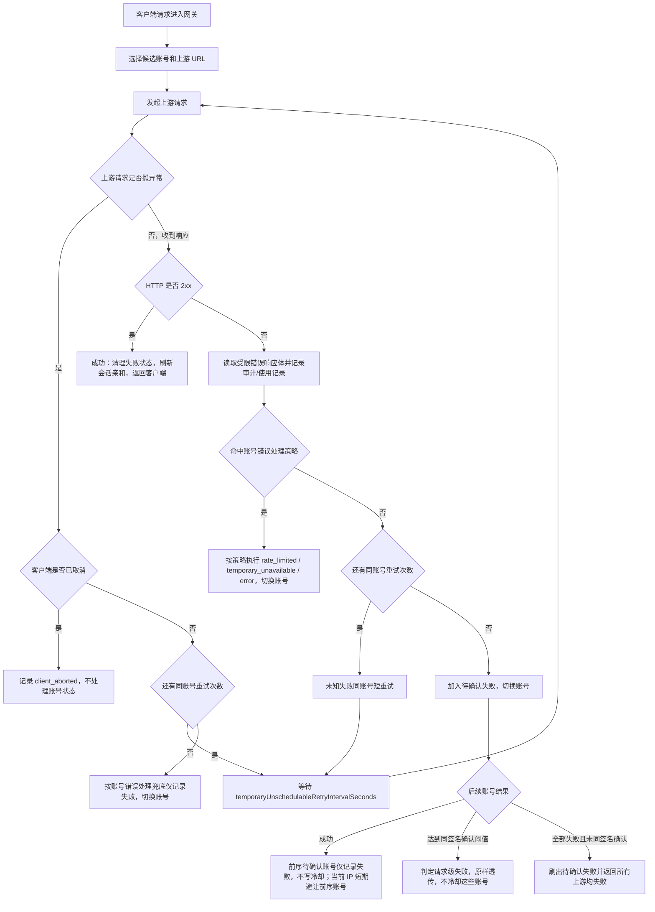
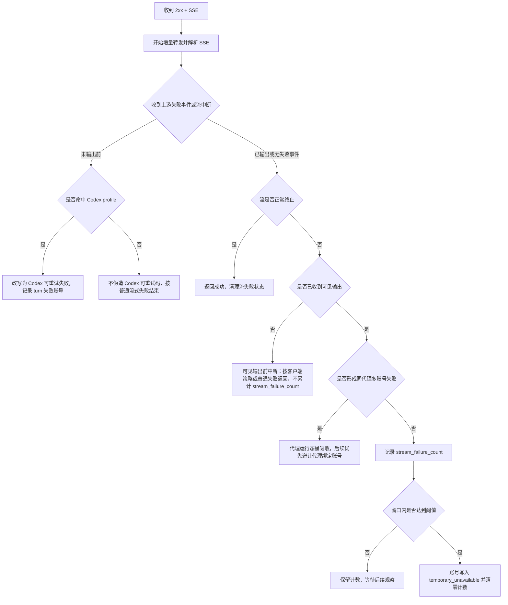
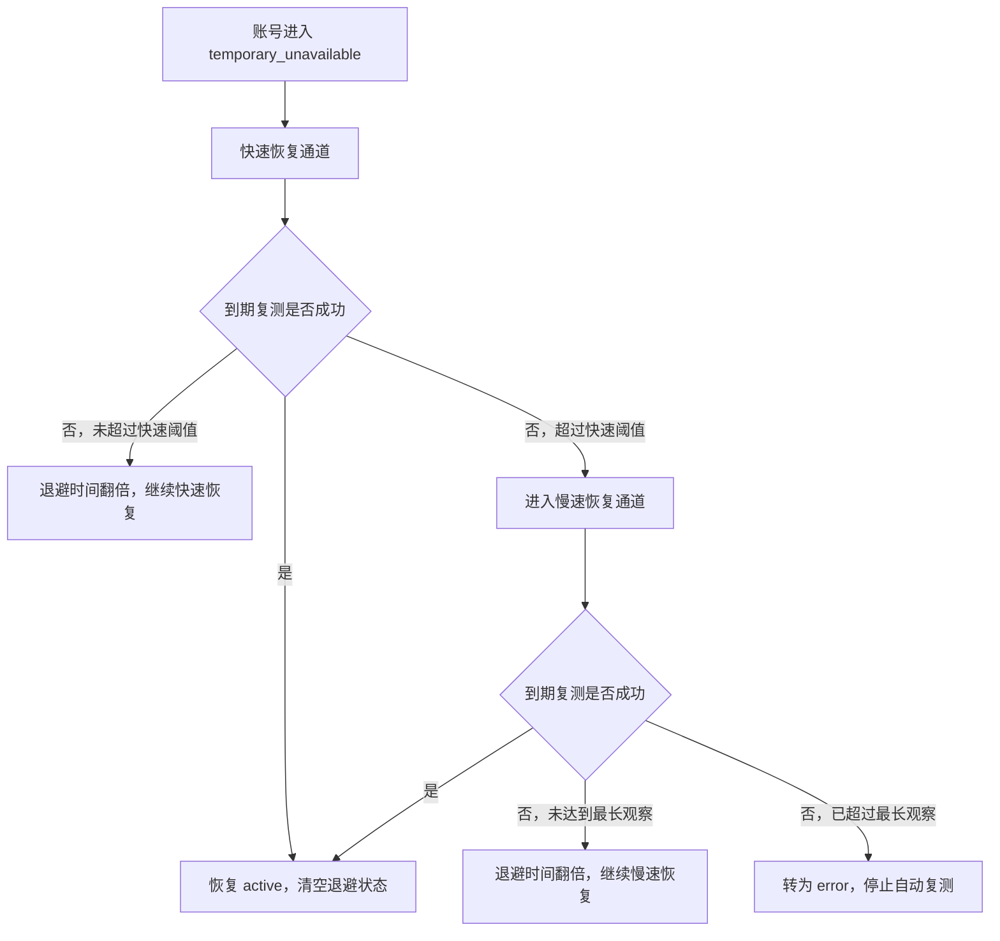

# 网关异常重试与兜底策略

## 目标

本文固定 OpenAI 兼容网关在上游异常、账号错误策略、未知失败和流式中断时的处理顺序，避免后续维护时把“账号错误策略”“兜底重试”“流熔断”重复实现或互相抢逻辑。

核心原则：

- 明确账号问题交给账号错误策略处理；其余非 2xx 上游响应先走兜底确认。
- 未知失败交给兜底处理：只要上游结果失败且没有命中任何策略，就先按系统短重试配置同账号重试；重试耗尽后只记录失败并切换账号，不再默认冷却账号。
- 兜底层不维护状态码白名单：不再用 `>=500`、`408`、`425`、`429` 这类条件决定是否重试。
- IP 级账号回避只依据调度事实：前序账号未确认失败、后续账号完整成功时，才让当前客户端 IP 短期避让前序账号；状态码只作为规则输入和排障字段，不能作为默认避让或冷却依据。
- IP 级错误熔断只依据高置信本地请求错误：认证前缺失 Bearer / 无效 token 探测、本地校验失败在短窗口内重复出现时，才允许短 TTL 本地 `429`；不能把账号池未知失败、同签名上游失败或容量失败归咎给 IP，也不能按地区、状态码或固定错误码黑名单拦截。
- 请求级错误签名缓存只处理已经由多账号同签名确认的同源同请求重复错误；它返回最近确认过的上游原始错误，不返回网关 `429`，也不写账号状态。
- 代理运行态失败桶只影响候选排序；同代理多个账号短窗失败时优先避让该代理绑定账号，不能自动禁用代理或冷却账号。
- 已经向客户端输出可见内容的 SSE 不做透明重试：服务端不能安全重放半段回答或工具参数。
- 客户端专属行为必须策略分层：Codex 的 `response.failed/upstream_retryable_error` 重试语义、`x-codex-turn-metadata.turn_id` 和第 4 次切号策略不能写进通用 OpenAI 兜底层。

## 关键参数

| 参数 | 默认值 | 用途 |
| --- | --- | --- |
| `temporaryUnschedulableRetryAttempts` | `3` | 未知失败进入账号副作用前，同账号短重试次数 |
| `temporaryUnschedulableRetryIntervalSeconds` | `3` | 同账号短重试间隔 |
| `defaultTemporaryUnschedulableMinutes` | `5` | 目标语义为临时不可调用最大暂停时间；账号进入恢复流程后从快速恢复通道起步，连续失败后翻倍，慢速恢复通道不超过该上限 |
| `streamCircuitBreakerEnabled` | `true` | 是否启用流式超时和流失败计数 |
| `streamRequestTimeoutSeconds` | `180` | 流式首段上游内容前的总等待上限 |
| `streamIdleTimeoutSeconds` | `60` | 流式首段后上游 raw chunk 空闲上限；完整 SSE 事件等待只记录诊断，不再硬熔断 |
| `streamFailureThresholdCount` | `3` | 流失败窗口内触发冷却的次数 |
| `streamFailureThresholdWindowMinutes` | `10` | 流失败计数窗口 |
| `cooldownAccountRetestMaxBackoffHours` | `24` | `temporary_unavailable` 后台复测最长自动恢复观察时间；从进入临时不可调用开始计时，慢速恢复失败发生在该窗口之后转异常并停止自动复测 |

## 普通响应流程



## 普通响应处理顺序

1. **上游请求抛异常**
   - 客户端取消：记录 `client_aborted`，释放资源，不写账号失败状态。
   - 连接失败、超时、unexpected EOF 等请求异常：先按 `temporaryUnschedulableRetryAttempts` 同账号重试。
   - 同账号重试仍失败：调用账号错误处理兜底；没有明确策略时仅记录失败并切换账号，不再默认写入 `temporary_unavailable`。

2. **上游返回 HTTP 2xx**
   - 认为本次上游响应成功。
   - 刷新会话亲和。
   - 清理或衰减当前账号的可恢复软失败状态；普通成功不自动恢复 `rate_limited`。
   - 如果本请求之前已有待确认失败账号，则这些账号仅记录失败，不写默认临时不可调用；如果当前请求有可用客户端 IP，可提交为当前 IP 对前序账号的短 TTL 回避。

3. **上游返回 HTTP 非 2xx**
   - 先匹配账号 `credentials.error_handling_rules` 和 OAuth Codex 429 特判。
   - 命中账号错误策略时，立即按策略处理账号，不进入兜底同账号重试。
   - 账号规则未命中时，进入未知失败兜底：只看“失败且还有重试次数”，不再判断状态码白名单。即使上游返回 `invalid_request_error`，也先用同账号短重试和后续账号确认，避免把账号侧限流、库存、模型通道异常误判为请求本身不可恢复。

## 待确认失败

未知非 2xx 失败在同账号重试耗尽后不会立刻写账号状态，而是进入待确认失败列表：

- 后续账号成功：说明前一个账号更可能有短期问题，前序待确认失败账号仅记录失败，不写入临时不可调用。
- 如果只有两个候选账号，两个不同账号返回同一错误签名即可确认请求级错误；如果还有第三个候选账号，两个账号同签名只作为候选证据，继续探测第三个账号。
- 第三个账号成功：说明前序失败可绕开，本次请求救回，前序账号只进入当前 IP 短 TTL 回避。
- 第三个账号仍返回同一错误签名：说明更可能是请求本身或上游公共错误，直接把后一个上游错误原样返回客户端，不冷却这些账号。
- 已确认的同源同请求短时间重复出现时，命中请求级错误签名缓存，直接返回最近确认过的上游原始错误，不进入 IP 级错误熔断。
- 全部账号都失败且没有同签名确认：刷出待确认失败，仅返回“所有上游账户均失败”，不写默认临时不可调用。

错误签名来自上游错误响应体中的 `type`、`code`、`message` 等字段。签名用于判断“多个账号是否遇到同一个请求级错误”，不是账号健康判定本身。

## IP级账号回避

IP 级账号回避是待确认失败之后的来源级调度辅助，不是账号健康判断：

- 只有当前序账号未确认失败、后续账号完整成功时，才把前序账号记录为当前 `systemAccountId + apiKeyId + groupId + clientIp` 下的短 TTL 回避账号。
- 回避只影响后续候选账号排序：命中回避的账号排到后面；如果所有候选账号都被当前 IP 回避，则旁路回避并保留原候选列表，避免把账号池筛空。
- 同签名请求级失败、请求级错误签名缓存、账号错误策略、客户端取消、本地校验失败、额度 / 授权 / 模型过滤失败、账号并发满、代理预检跳过和同账号短重试中间失败，都不能记录 IP 级账号回避。
- 当前 IP 后续通过某个账号完整成功时，清理该 IP 对该账号的回避状态。
- IP 级回避状态属于进程内短 TTL 运行态，服务重启或缓存淘汰后可以丢失；丢失后回到普通调度，不写入账号状态，也不作为后台复测对象。

具体设计见 [IP 级账号回避与自动切号设计](IP级账号回避与自动切号设计.md)。

## IP级错误熔断

IP 级错误熔断包含认证前窄作用域入口保护和认证后来源级止损能力，不是账号调度排序能力：

- 认证前作用域只能使用 `clientIp + missing_bearer`、`clientIp + token 指纹` 或“已验证无效 token 后”的喷洒计数；随机无效 token 不能在认证前挡住同 IP 的有效 Bearer。
- 作用域为 `systemAccountId + apiKeyId + groupId + clientIp`，缺少认证后 scope 或缺少 `clientIp` 时不启用。
- 只消费高置信本地请求错误：本地 JSON 解析失败、模型过滤失败和 OAuth/Codex adapter 本地校验失败。多账号同一错误签名的上游失败只按既有策略透传或进入请求级错误签名缓存，不计入来源错误熔断。
- 命中阈值后短 TTL 返回本地 OpenAI-compatible `429`，不进入账号候选排序和上游调度。
- 账号错误策略命中、未知账号池失败、代理失败、账号并发满、分组队列满、单 IP 并发满、客户端取消和流式已输出后失败，默认不计入来源错误熔断。
- 成功请求或 TTL 到期后应恢复当前来源；连续触发可以短期退避，但必须有最大上限。
- 错误熔断状态属于进程内易失运行态，不持久化为 IP 黑名单，不写账号冷却，也不作为后台复测对象。
- 禁止区域性封禁和固定状态码 / 错误码黑名单。

具体设计见 [IP 级错误熔断与恶意请求保护设计](IP级错误熔断与恶意请求保护设计.md)。

## 流式响应流程



## 流式边界

- `response.created`、`response.in_progress`、metadata、心跳和 header 类事件不算可见输出；即使这些事件已经写给下游，也不作为账号流失败计数依据。
- 文本 delta、reasoning delta、工具调用参数 delta、会改变 assistant 内容或工具状态的 output item 事件算可见输出。
- 可见输出判断必须由同一个公共函数提供，流式拦截和账号流失败副作用不能各自维护一套判断。
- 当前运行时已经把可见输出前的 `response.failed/upstream_retryable_error` 收敛到客户端策略层：只有 `clientProfile = codex` 且 `downstreamProtocol = responses_sse`、并能精确解析 `x-codex-turn-metadata.turn_id` 时才写出 Codex 可重试失败；未命中策略时按普通流式失败返回，且不累计账号流失败计数。
- 可见输出前失败包含：首段前无数据、首段后上游空闲、上游读取异常 / EOF、缺少 OpenAI 终止事件、上游 `response.failed`、上游通用 `event: error`。持续有 raw chunk 但暂未形成完整 SSE 事件只记录诊断并继续转发。普通事件里的顶层 `code/message` 字段不单独视为失败。
- 已经输出后的失败默认不能由服务端伪造整轮重试；当前先走代理运行态归因，同代理多个账号短窗失败时只避让代理绑定账号，否则记录流失败计数，达到阈值后临时冷却账号。`cyber_policy` 是 Codex profile 下的显式例外，即使已输出也改写为 `upstream_retryable_error`，用于让 Codex 自行重试。
- 当前不再维护流式错误码特征白名单或 Codex 终止类白名单；`server_is_overloaded`、`slow_down`、`context_length_exceeded`、`insufficient_quota`、`usage_not_included`、`invalid_prompt`、`cyber_policy`、通用 `event: error`、未知 `response.failed` 等都按同一个可见输出边界处理。若后续需要根据客户端行为做不同失败事件，必须通过 `clientProfile` 策略进入，不能恢复成全局错误码白名单。

## 客户端策略边界

新增或调整流式失败处理时，先解析三个独立维度。PLAN-0023 已落地最小策略层：Codex 专属重试码和 turn 级切号只能由 `clientProfile = codex` 触发，不能再回退成通用 OpenAI 行为。

| 维度 | 示例 | 用途 |
| --- | --- | --- |
| `upstreamAdapter` | `openai_api_key`、`openai_oauth_codex` | 决定如何请求上游账号、如何归一化 body/header |
| `downstreamProtocol` | `responses_sse`、`chat_completions_sse`、`json` | 当前用于限制 Codex profile 只命中 Responses SSE；各协议失败事件格式必须由对应 clientProfile 明确声明 |
| `clientProfile` | `codex`、`generic_openai` | 决定客户端是否会自动重试、如何解释错误码、是否启用 turn 级策略 |

Codex 专属策略只允许在 `clientProfile = codex` 且请求能从普通 JSON 对象格式的 `x-codex-turn-metadata.turn_id` 精确解析出非空值时触发。`turnId`、URL 编码 JSON、数组 JSON、`session_id`、`conversation_id`、`prompt_cache_key`、`previous_response_id`、`x-client-request-id`、User-Agent、IP 或 body hash 都不能单独把请求升级为 Codex。识别不到 Codex 时保持普通 OpenAI 网关行为，不做第 4 次切号，不新增 Codex 专属可重试错误。

Codex turn 级重试状态键建议为：

```text
systemAccountId + apiKeyId + groupId + endpoint + codex.turn_id + rawBodyHash
```

该键用于同一本地 API Key / 分组边界内的同一 Codex turn，不代表真实自然人用户身份。第 4 次切号只允许在这个 turn 范围内避让已失败账号；不能写全局账号冷却，不能迁移到其他客户端，不能影响同分组里的其他普通请求。

## 策略边界

| 场景 | 处理归属 | 是否同账号重试 | 是否写账号状态 |
| --- | --- | --- | --- |
| 账号配置规则命中 | 账号错误处理策略 | 否 | 按策略 |
| OAuth Codex 429 可解析 reset | 账号错误处理策略 | 否 | 写 `rate_limited` |
| 未知非 2xx 失败 | 兜底重试 | 是 | 重试耗尽后进入待确认失败 |
| 请求异常、连接失败、超时、EOF | 兜底重试 | 是 | 重试耗尽后仅记录失败，不写账号状态 |
| 前序未确认失败且后续账号成功 | IP 级账号回避 | 否，已完成本次切号 | 不写账号状态；当前 IP 短 TTL 避让前序账号 |
| 已确认同源同请求短时间重复 | 请求级错误签名缓存 | 否，直接返回最近上游错误 | 不写账号状态；不返回本地 429 |
| 同代理多账号短窗失败 | 代理运行态避让 | 否，影响后续候选排序 | 不写账号状态；不禁用代理 |
| 同一认证后来源高置信本地请求错误过多 | IP 级错误熔断 | 否，直接本地短路 | 不写账号状态；当前来源短 TTL 返回 429 |
| 客户端取消 | 客户端生命周期 | 否 | 否 |
| SSE 可见输出前失败，命中 Codex profile | Codex 客户端策略 | Codex 客户端重试或第 4 次 turn 级切号 | 否 |
| SSE 可见输出前失败，未命中客户端策略 | 普通协议兜底 | 否，由普通失败返回决定 | 否 |
| SSE 可见输出后失败，同代理多账号短窗失败 | 代理运行态避让 | 否 | 不写账号状态；后续优先避让代理 |
| SSE 可见输出后失败，未形成代理证据 | 流熔断 | 否 | 达阈值后临时不可调用 |

## 临时不可调用恢复通道

目标设计把 `temporary_unavailable` 账号恢复拆成三段：快速恢复通道、慢速恢复通道和异常终态。该机制不依赖具体状态码或错误码判断账号是否还能恢复，只消费一个事实：后台复测是否成功。



- 账号刚被写入 `temporary_unavailable` 时进入快速恢复通道，起始退避固定为 3 秒，后续失败按 `3s -> 6s -> 12s -> 24s -> ...` 翻倍。
- 快速恢复通道用于吸收短暂波动，不把每次失败都当成异常信号；到期复测成功时立即恢复账号，不等待原来的固定分钟级冷却。
- 当退避时间超过快速通道阈值后，账号自然退化到慢速恢复通道。快速通道阈值作为代码内固定策略即可，先不暴露成系统配置。
- 慢速恢复通道继续按失败次数翻倍，但下一次 `cooldown_until` 不能超过 `defaultTemporaryUnschedulableMinutes` 表达的最大暂停时间。
- 账号进入 `temporary_unavailable` 时记录本轮自动恢复观察起点；一旦慢速恢复通道中的复测失败发生在 `cooldownAccountRetestMaxBackoffHours` 表达的最长自动恢复观察之后，账号转为 `error`、`schedulable = 0`，并保留最近测试 HTTP 状态、错误码、错误摘要、连续失败次数和观察起点，供账户页和日志排查。
- 账号复测成功、手动恢复正常、更新凭据后恢复、停用或到期时，必须清空恢复通道状态、退避计数、当前退避时长和最近复测信息。
- `rate_limited`、`error`、`disabled` 等其他状态不进入该恢复通道；该通道只处理已经进入 `temporary_unavailable` 的账号。

## 恢复通道日志去噪

- 快速恢复通道是预期内的抖动吸收流程，中间失败不得逐次写 `warn` 常规日志，避免 3 秒、6 秒、12 秒这类高频复测放大运行日志。
- 快速恢复通道优先记录关键状态变化：快速恢复成功、快速通道退化为慢速通道。中间失败只更新账号字段、使用记录来源和运行态指标。
- 后台恢复探活写入使用记录时必须标记 `traffic_source = cooldown_retest`，不参与业务用量统计、账户质量统计和真实请求形态学习；统计 worker 可以推进安全游标确认这类明细，但不能写入业务聚合窗口。手动账号测试标记 `manual_account_test`，真实客户端请求标记 `gateway`。
- 恢复探活审计日志标记同一 `traffic_source`，并使用元信息捕获模式：保留 trace、账号、分组、状态码、尝试摘要和错误摘要，不保存完整请求 / 响应 payload。
- 使用记录和审计日志列表必须支持按来源筛选，排障时可以只看真实网关请求、手动账号测试或恢复探活。
- 同一账号、同一恢复阶段、同一错误摘要的复测失败日志需要节流；快速通道失败落到 `debug` 级别，进入慢速通道和最终转异常时再输出结构化告警。
- 慢速恢复通道频率较低，可以记录持续失败摘要，但日志只包含账号 ID、阶段、连续失败次数、当前退避、下次复测时间和短错误摘要，不写完整请求 / 响应 payload。
- 转为异常时输出明确告警日志，说明账号已退出自动恢复通道，并带上最终失败次数、最后错误摘要和最后复测时间。

## 维护规则

- 新增已知账号问题时，优先加账号错误策略；不要在兜底层增加状态码判断。
- 兜底重试只表达“未知失败先吸收波动”，不能承担错误分类。
- IP 级账号回避不能维护状态码白名单或黑名单；只能消费“未确认失败被后续成功账号证明可绕开”的调度事实。
- IP 级错误熔断不能维护状态码白名单或黑名单；只能消费高置信本地请求错误，且不能把账号级失败、容量失败或上游公共故障计入来源处罚。
- 请求级错误签名缓存不能返回网关自有 `429`；必须保持最近确认过的上游 status/body 语义，避免改变客户 SDK 行为。
- 代理运行态失败桶不能写账号状态；单账号单代理失败只能作为 unknown，不能直接判定代理或账号坏。
- 单个客户端 IP 的连续失败不能直接升级为账号冷却；账号冷却仍只允许由账号错误策略、流熔断或后台复测等强证据链路触发。
- 命中账号错误策略后不能再进入同账号短重试，否则会重复处理。
- 可见输出前的 `response.failed/upstream_retryable_error` 只能由客户端策略决定，当前仅 Codex profile 启用；第 4 次 turn 级账号避让也只允许放在 Codex profile。
- 不维护 Codex 终止类错误码白名单；可见输出前的流式失败只要命中 Codex profile，就改写为 `upstream_retryable_error` 并可写入 turn 级失败账号计数。`cyber_policy` 是输出后也允许改写的显式例外。
- 流式可见输出后失败先做代理运行态归因；未形成同代理多账号失败证据时才进入账号流熔断计数，不再按 `server_is_overloaded` / `slow_down` 等错误码豁免。
- 决定透传给客户端的上游错误必须保留原始状态码、响应头和响应体，不包装成网关自有错误。
- 修改流程后必须补回归，至少覆盖：`invalid_request_error` 切号救回、未知失败同账号重试、第三账号救回、三账号同签名请求级失败、请求级错误签名缓存、代理运行态避让、`response.created` 后缺少终止事件不计数、Codex profile 可见输出前 `event: error` 改写、非 Codex 不触发 Codex 改写、Codex turn 第 4 次切号、可见输出后流失败计数。

## 排障日志

常用日志事件：

- `gateway_upstream_same_account_retry_scheduled`：未知失败未命中策略，准备同账号短重试。
- `gateway_request_failure_signature_confirmed`：多个账号返回同一错误签名，按请求级失败透传。
- `gateway_request_error_signature_cache_stored` / `gateway_request_error_signature_cache_hit`：请求级错误签名缓存写入或命中。
- `gateway_proxy_failure_bucket_opened` / `gateway_proxy_health_avoidance_applied`：代理运行态失败桶打开或应用到候选排序。
- `gateway_stream_failure_proxy_bucket_absorbed`：可见输出后流失败被代理桶吸收，未累计账号流失败。
- `gateway_client_ip_account_avoidance_applied`：候选列表已应用当前客户端 IP 的账号回避排序。
- `gateway_client_ip_account_failure_confirmed`：后续账号成功后，前序待确认失败账号被提交为当前 IP 短期回避。
- `gateway_client_ip_error_circuit_sample_recorded`：当前认证后来源记录了一次高置信错误样本。
- `gateway_client_ip_error_circuit_opened`：当前认证后来源进入短 TTL 错误熔断。
- `gateway_client_ip_error_circuit_blocked`：当前请求因来源错误熔断被本地 429 短路。
- `gateway_stream_intercepted`：上游 SSE 失败事件在写给下游前被改写为客户端可重试事件。
- `gateway_stream_failure_account_side_effect_deferred`：流式失败发生在可见输出前，暂不累计账号流失败。
- `gateway_stream_finished_failed` / `gateway_stream_missing_terminal`：流式响应未正常完成。
- `gateway_account_local_suppressed`：账号副作用入队后，本进程短期避让该账号。
