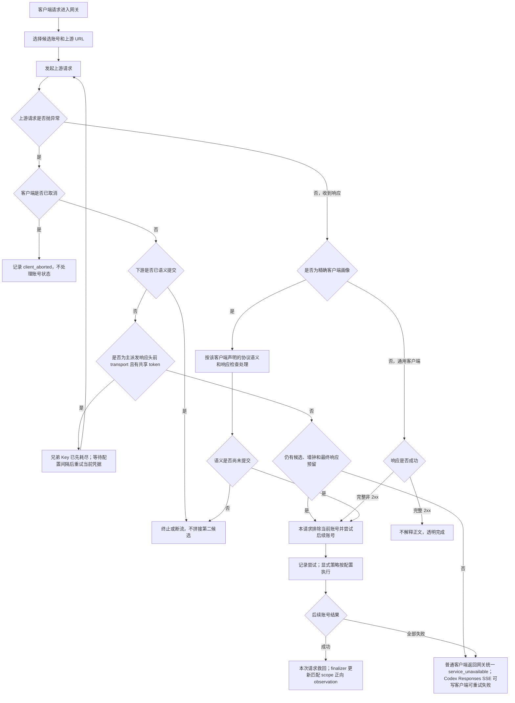
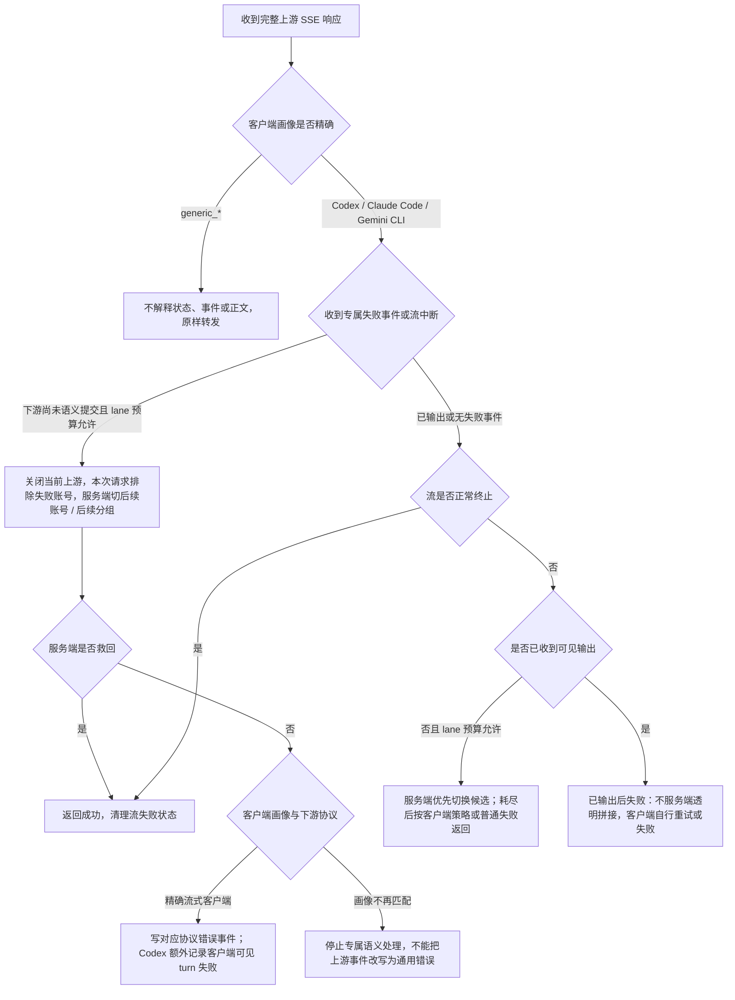
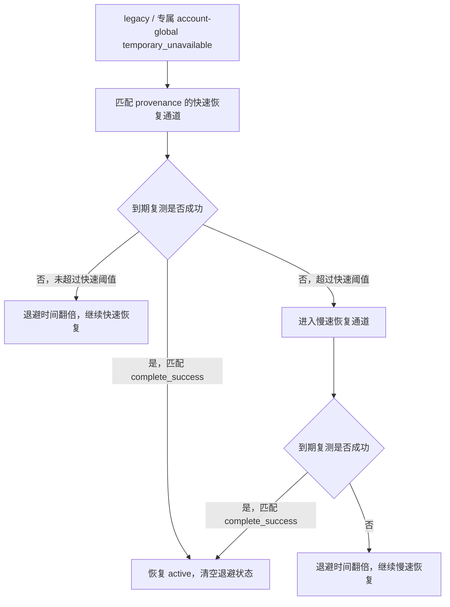

# 网关异常重试与兜底策略

## 目标

本文固定 OpenAI 兼容网关在上游异常、账户错误处理策略、未知失败和流式中断时的处理顺序，避免后续维护时把“账户错误处理策略”“本地失败隔离”“流式失败处理”重复实现或互相抢逻辑。

核心原则：

- 未命中显式策略时，完整 HTTP 业务失败只直接用于救当前请求和排除本请求已失败 Key/账号；文本、图片、音频、文件/资源、后台任务和 hosted tool 使用同一候选切换规则。该动作不得建立 API Key / IP / 会话跨请求回避、共享质量失败或 `recovery_wait`。请求终态可以收集最终上游模型、endpoint、lane、转换路径和凭据作用域的能力候选，但每个请求最多 admission 一个新 intent；普通请求不能根据状态码、错误类型或正文直接建立、续期、升级或清理账户业务运行态。
- 兜底层不维护状态码、错误码或错误文案白名单：状态码和上游错误体只作为诊断字段、审计字段和用户显式配置规则的输入，代码不内置“余额不足”“限流”“某状态码才写状态”之类判断。
- 未知 transport 失败交给统一失败流水线：当前 attempt 没有交付结果且下游尚未语义提交时，各类请求都继续兄弟 Key、账户或后备分组。普通文本另有同一凭据的受控原地 transport 重试 token；图片和其他请求不消费该 token，但这不影响它们继续下一候选。`temporaryUnschedulableRetryAttempts` 由整次请求共享，不在每个账号、Key、后备分组或 compact 预处理阶段重新发放。中间失败不写电路 confirmation、共享质量或 Key/账户状态；后续候选和后台确认仍按各自独立边界处理。
- 请求进入上游前发现当前账号目标协议不能保真承载某个合法能力时，只记录账号作用域 guidance 并跳过当前账号；它不是上游失败，不写账号状态，不进入状态码 / 错误码策略，也不能在还有同分组账号或后续可承接分组时直接返回给客户端。
- 通用客户端默认不解析上游错误对象、错误类型、错误码、完成状态和错误正文：所有请求只用 `response.ok` 做有界请求级 opaque 接管，同账户当前可执行 Key 按池顺序唯一尝试，再扫描后续账户 / 分组；不使用固定 2-Key 或 4-account 截断，整个请求仍受候选去重、墙钟和最多 64 次真实上游 attempt 的安全上限。图片、音频、文件、资源创建、后台任务和 hosted tool 不设请求类型例外。只有精确识别的 Codex、Claude Code、Gemini CLI 客户端按协议声明的结构解释本次 attempt；用户或管理员显式配置的账户错误与响应拦截策略只在声明范围内执行。
- 当健康候选和后备分组都不可承接且只剩并发占满、精确 `precheck_pending` 或其他可恢复本地运行态时，恢复调度器按 `scopeId + generation` 获取半开租约；账户、物理凭据、分组和全局限制只作为容量预算。其他请求进入有上限 FIFO 等待。`noAvailableAccountWaitTimeoutSeconds` 默认 270 秒，只累计“零可派发 Attempt”的等待时间；真实上游 attempt、已有可派发 Attempt 的扫描和活跃响应读取不消耗该预算。
- 多 Key API Key 账户的 Key 级隔离不恢复状态码 / 错误码分类：各类请求都仅按 opaque `response.ok=false` 形成当前请求内 Key 排除并按池顺序唯一耗尽，但不能因此写共享 Key 状态。跨账户物理凭据去重，整个请求最多 64 次真实 attempt；完整设计见 [账户内 API Key 故障隔离设计](账户内APIKey故障隔离设计.md)。
- DeepSeek 这类 OpenAI-compatible 第三方也遵守同一兜底层：完整非 `2xx` 只按 `response.ok=false` 做 opaque 请求级接管；不得读取 401 / 403 / 402 / 429 / 5xx、余额/限流/模型文案或 `finish_reason = insufficient_system_resource` 决定共享动作。`2xx` payload 保持透明，这些字段只可进入诊断或用户显式策略匹配。需要写 `rate_limited`、`temporary_unavailable` 或 `error` 时，只能由用户显式账户错误策略授权；统一边界见 [AI 账户错误语义与状态变更边界](AI账户错误语义与状态变更边界.md)。
- IP 级账号回避只能消费本地 transport failure 经后续候选成功证明可绕开的调度事实；opaque 完整 HTTP 业务失败、code/type/message 和坏会话结果不得写跨请求 IP 回避。达到阈值后也只在同一模型匹配和账号调度优先级层内后置该账号。
- IP 级错误熔断只依据高置信本地请求错误：认证前缺失 Bearer / 无效 token 探测、本地校验失败在短窗口内重复出现时，才允许短 TTL 本地 `429`；不能把账号池未知失败或容量失败归咎给 IP，也不能按地区、状态码或固定错误码黑名单拦截。
- 上游桶运行态失败只影响候选排序；同 `proxy`、`baseUrl` 或 `provider` 多个账号短窗失败时优先避让该桶账号，但只能在同一模型匹配和账号调度优先级层内后置，不能自动禁用代理、禁用上游或冷却账号。`qualityScore` 只作为排序信号，不作为所有运行态避让的统一硬边界。
- 普通路由 `speed_first` 的 `latency_degraded` 不属于上游失败兜底层的调度降级。只有最终 lane 为可安全重放文本的请求记录软首字样本，后台探针或后台状态评估确认持续慢后才建立该短 TTL 覆盖；后台探针恢复后必须回到账户配置排序。图片、音频、文件/资源、后台任务、hosted tool 和其他副作用 lane 不创建该 timer、慢样本或速度切换。普通上游失败不进入速度优先判断，速度模式也不能重置或绕过符合条件的整请求安全原地重试 token。

自动探针复用底层执行器但按 owner 分别解释结果：transport owner 使用 `framing_complete_neutral / transport_failed / unknown`，execution capability owner 使用 `complete_success / capability_unavailable / probe_task_failure / stale`。两者分别持匹配 scope lease 并 fenced 写回，不能互相推进；完整 HTTP 对 transport 中性，对 execution 可以归并为当前 Attempt 的通用 unavailable，但不得解释状态码、错误码或正文。`pending_test` 激活拥有账户准入；active 周期哨兵只拥有解析后的哨兵精确 Route / Attempt。用户显式 `temporary_unavailable/rate_limited` 只由 TTL、匹配来源恢复动作或人工恢复清理，普通 / 后台无 provenance 成功不得清理。人工测试和模型检测不参与任何生产状态流转。
- `normalRoutingConfig.firstByteDeadlineMs` 和速度优先 cutover 是配置的路由截止：到期只产生请求级候选推进/慢样本，对账户电路、Key 运行态、共享可靠性与 `recovery_wait` 保持中性。连接失败、读取中断和 `textFirstResponseTimeoutSeconds` 等 lane hard timeout 仍按 transport failure 处理；配置截止主动取消旧 attempt 时不得把取消回写成 hard timeout。
- 下游提交分为 `transportCommitted` 和 `semanticCommitted`：SSE 注释心跳只提交传输，不提交模型语义，因此纯 transport 失败仍可由服务端救回；真实 JSON、SSE 协议事件或模型输出一旦写出即提交语义，之后不能透明拼接第二个账号。等待心跳后若上游改为非流式响应，网关按客户端能力写可重试事件或断流，不能把 JSON 拼进 SSE。
- 客户端专属行为必须策略分层：Codex 的 Responses 失败事件和 turn 级账号避让、Claude Code 的 Messages 错误事件、Gemini CLI 的 Gemini 错误事件都由客户端策略声明；通用网关层只消费“协议事件 / HTTP 错误 / 断流”能力，不按上游错误内容决定客户端机制。

## 关键参数

| 参数 | 默认值 | 用途 |
| --- | --- | --- |
| `temporaryUnschedulableRetryAttempts` | `3` | 可重放文本主请求在已开始、响应头前 transport failure 后可消费的整请求共享 token；兄弟 Key 先行且不消费 token，兄弟 Key 耗尽后才重试当前凭据；token 不按账户、Key、分组或 compact 阶段重置 |
| `temporaryUnschedulableRetryIntervalSeconds` | `3` | 上述安全原地重试之间的等待秒数；完整 HTTP、正文中断、配置首字截止和副作用请求不消费 |
| `defaultTemporaryUnschedulableMinutes` | `2` | 只约束 provenance 明确的 legacy / 专属 account-global 冷却恢复最大暂停时间；请求派生精确 scope 不使用该账户参数 |
| 运行态调度降级观察窗口 | `5min` / 最小观察 `60s` | 本地可验证 transport failure 可 nomination 精确 transport intent；`runtime_degraded` 只影响匹配 Attempt，`latency_degraded` 继续属于独立路由速度 owner |
| `recovery_wait` | scope admission 原子 accepted | 请求终态 nomination 最终 Attempt，只有 winner 按 `scopeId + generation` 创建后台核实任务；只在 soft avoid 内避让匹配 Attempt，后续请求不得合并、续期或改写 |
| `textFirstResponseTimeoutSeconds` | `120` | 文本 lane 上游首响应和非流式首字节等待上限 |
| `textStreamIdleTimeoutSeconds` | `30` | 文本 lane 流式首段后的 raw chunk 停顿上限 |
| `textUncommittedAttemptMaxLifetimeSeconds` | `1800` | 文本 lane 单次尚未提交语义的上游尝试最大寿命；活跃且已提交语义的 SSE 不受该值机械中断 |
| `imageFirstResponseTimeoutSeconds` | `600` | 图像 lane 上游首响应和非流式首字节等待上限 |
| `imageStreamIdleTimeoutSeconds` | `120` | 图像 lane 流式首段后的 raw chunk 停顿上限 |
| `imageUncommittedAttemptMaxLifetimeSeconds` | `3600` | 图像 lane 单次尚未提交语义的上游尝试最大寿命 |
| `imageRequestWallTimeoutSeconds` | `3600` | 图像 lane 从请求接收到候选切换决策的整请求墙钟；不机械中断仍在图片单次时限内的在途 attempt，跨过文本 270 秒后失败仍可继续后备候选 |
| `noAvailableAccountWaitTimeoutSeconds` | `270` | 仅累计零可派发账号阶段的服务端等待预算；attempt、活跃读取和存在可派发账号的扫描不计入 |
| `streamFailureThresholdCount` | `3` | 历史流失败诊断计数参数；真实网关流式失败不再依赖该阈值决定是否写状态 |
| `streamFailureThresholdWindowMinutes` | `5` | 历史流失败诊断计数窗口参数；真实网关流式失败不再依赖该窗口直接决定是否写状态 |

流式超时检测固定启用，不提供系统设置开关。
| `cooldownAccountRetestMaxBackoffHours` | `12` | 冷却后台复测进入长期不可用阶段的快速恢复窗口；长期阶段固定每 1 小时复测，只有从首次独立 `transport_incomplete` 起满 7 天后的再次独立 transport 失败才转异常 |
| 全池软阻断等待 | FIFO / 单 timer | 健康和后备优先；只剩可恢复精确 scope 时按 `scopeId + generation` 单飞半开，其余请求在零可派发 Attempt 预算内有界等待；SSE 可发送注释心跳保活 |

## 请求体解析与客户端生命周期错误

- 客户端在请求体上传完成前断开、声明的 `Content-Length` 未完整到达或底层解析器判定 `request.aborted` / `request.size.invalid` 时，返回 OpenAI 兼容 HTTP `408`、错误码 `request_timeout`，归因 `client_lifecycle`，提示客户端可按标准重试策略重新发送完整请求。
- 客户端已经完整上传但 JSON 语法非法时保持 HTTP `400` 的本地请求错误语义，不能误报为上传中断或 `408`。
- 这两类错误都发生在有效上游派发前，不执行账户错误策略、响应拦截、账户 Key 轮换、账户运行态、`recovery_wait` 或后台探针副作用。

## 普通响应流程



## 普通响应处理顺序

1. **上游请求抛异常**
   - 客户端取消：记录 `client_aborted`，释放资源，不写账号失败状态。
   - 只有可安全重放的文本主请求已经开始、响应头尚未到达时发生的连接/请求 transport failure，才可消费整请求共享 token。同账户兄弟 Key 先按请求内池唯一尝试且不占 token；兄弟 Key 耗尽后才等待配置间隔并重试当前凭据。未开始的本地异常、完整 HTTP、正文中断、配置首字截止和副作用请求不进入该预算。
   - token、墙钟或最终响应保留时间不足，或者重试后仍失败时，在本请求中排除当前候选、忘记会话亲和，并按统一失败流水线尝试后续候选。安全原地重试的中间失败只写审计/使用记录，不投递 `recovery_wait`，也不写电路 confirmation、共享质量、Key/账户状态、IP 避让或代理/上游桶。
   - 请求异常不按错误码分类；最后一次失败的错误摘要只进入诊断，最终派发描述和非敏感 ProbeRecipe 才能进入 request collector。普通请求不能据此建立账户级运行态。

2. **上游返回响应**
    - 通用客户端默认不解析错误对象、错误码、错误类型、错误文案或完成状态；所有请求只按 `response.ok` 有界接管。完整非 `2xx` 或结果未知且下游未语义提交时，排除当前 Key / 账户并继续下一候选；已提交时只能结束或断流。供应商原始错误只进入有界诊断，不能作为账户状态或客户端重试指令。
    - 未配置显式策略时，通用响应不修改账号或 Key 共享状态，也不因 `200 + error`、普通事件里的 `data.error`、`418 + JSON` 的具体错误内容或任意错误码自动分类。各类请求都可以仅按完整非 `2xx` 这一 opaque 请求结果轮换本请求内 Key / 账户；这是有界可用性接管，不是上游语义判断。
    - 精确识别为 Codex、Claude Code 或 Gemini CLI 时加载该客户端画像声明的系统默认协议规则；账户所有者或管理员显式创建的策略可以在声明的端点范围内作用于 `generic_*`。显式状态动作按配置执行，但不改变统一候选切换准入。
    - finalizer 只有形成同一 `scopeId` 的 `protocolValidatedSuccess` 才申请写正向能力观察。它生成确定性 observationId，由 control owner 在 PostgreSQL scope 串行化事务内原子插入 committed observation、递增一次权威 `positiveObservationVersion` 并写连续 outbox；Redis gate 只是优化。业务路径不直接关闭 OPEN，也不清理任何账户级、Key、legacy 或用户显式策略状态；事务未提交的诊断不能充当正向 fence。
   - 上游响应体读取前必须先按 `content-encoding` 对 `gzip` / `br` / `deflate` 解码；下游复制响应头时继续过滤 `content-encoding`、`content-length` 和 `transfer-encoding`，避免客户端拿到已解码 body 却再次按压缩格式解码。
   - 各类非流式响应在首字节前都处于统一切号窗口；首字节等待超过 lane hard timeout 时，网关按 transport 边界有界切换后续账号。图片继续使用自己的长时限，但时限到期后同样继续下一候选。
    - 非流式首字节已经写给下游后，如果正文中途异常，网关记录 `upstream_body_interrupted`，忘记会话亲和并在本请求 / 来源范围内回避当前 Attempt，然后打断下游连接；终态 collector 可以 nomination 该最终 Attempt，只有 scope admission winner 才创建精确 intent。这会让客户端在读取 body 时看到网络失败，再由客户端自身重试策略发起新请求。

3. **精确客户端的上游语义失败**
   - 只有 `clientProfile = codex | claude_code | gemini_cli` 才进入该分支；运行时按精确 `clientProfile + downstreamProtocol` 选择允许的语义检查与最终失败格式。
   - 请求下游语义尚未提交时，可以关闭当前上游并切换后续账号；SSE 注释心跳只设置 `transportCommitted`，不会单独阻断统一候选切换。
   - 语义已经提交后不能透明拼接第二条响应；按客户端能力写协议失败事件或断流，由客户端发起新请求。
   - 账户状态副作用仍只能来自用户显式策略、legacy 原 owner 或未来注册的专属 account-global owner，不能从客户端专属语义或精确子 scope 后台确认反推成通用账号健康规则。

4. **HTTP 2xx 内的特殊完成值**
   - OpenAI-compatible Chat Completions 完整响应里的任意 `finish_reason` 都是不透明协议终止值，不属于 HTTP 非 `2xx` 错误，也不由系统判断为正常或异常。
   - DeepSeek 的 `finish_reason = insufficient_system_resource` 只进入原始诊断。未命中用户显式响应检查策略时，即使下游尚未写出，也不得触发服务端重试、切号或失败事件合成。
   - 已经写出可见输出时，仍遵守“已写出后不透明拼接”的边界，只能记录诊断、结束响应或依赖客户端重试。
   - 单次特殊完成值不直接写账号持久状态；未命中用户显式响应策略时也不投递故障核实或改变共享状态，命中显式策略时才按用户配置执行。

4. **后台确认与受控半开**
   - 精确 `recovery_wait` 只在 soft avoid 窗口内避让匹配 Attempt；独立后台探针形成匹配负向结果后，才按 `scopeId + generation` 建立该 Attempt 的 `precheck_pending / OPEN`。其他模型、endpoint、adapter route 和 Key 继续普通选号。
   - capability worker claim 时固化 `claimedPositiveObservationVersion`。负向 outcome 提交时当前 version 已变化，则当前 intent 以 `superseded_by_newer_success` 终结、释放预算并写 durable due，且不提交新负向 phase；原 phase 已 OPEN 时保持 OPEN。后续验证使用新 generation / TaskID，业务成功本身不直接恢复 OPEN。
   - 全池精确 Attempt 都被阻断时健康候选和后备分组优先；仍无可承接候选才进入有界 FIFO。恢复调度器以 `scopeId + generation` 取得半开 `leaseId/fencingToken`；账户、物理凭据、分组和全局限制仅作为容量预算。
   - 半开只执行 intent 固化的 ProbeRecipe。transport owner 的完整 framing 只能推进匹配 transport incident；execution owner 必须形成 `complete_success` 才能推进能力恢复。失败、超时、客户端中断或 unknown 只按 matching lease 释放或退避，不能累计普通请求轮次；headers、首字节或部分 token 不算完成。

## 后台核实、软阻断与恢复等待

本地可验证 transport failure 按自身阶段进入统一候选或终止边界；只有符合“可重放文本主派发已开始且仍在响应头前”的失败才先消费整请求安全原地重试 token，正文中断等其他 transport failure 不消费该 token。安全原地重试的中间失败、未派发异常和路由配置截止不创建共享 intent；所有真实 Attempt 终态由最外层 collector 统一去重和 flush。完整 HTTP / 协议失败可 nomination 精确 execution capability，本地 transport failure 还可 nomination 同一 Attempt 的 transport intent。admission 按规划器生成的 `scopeId` 跨实例单飞，每请求最多 accepted 一个；accepted 后开始 5 分钟冷却，后续普通请求不得合并失败计数、替换 generation、刷新 TTL 或改变 due 时间。

- 精确 `recovery_wait` 只在 soft avoid 窗口内避让匹配 Attempt，不作为账户状态展示。后台执行器未形成真实上游尝试时结论为 unknown，不得建立软阻断。
- 首次有效独立后台探针形成匹配负向结果后，通过 PostgreSQL durable ledger 按 `scopeId + definition identity + generation + leaseId/fencingToken` 写入该 Attempt 的 `precheck_pending / OPEN`；Redis / 近端缓存只应用 outbox 投影，不能退回空的进程内快照或单独推进 phase。transport 与 execution capability 各自解释 outcome，完整 HTTP 不按状态码/正文推进 transport。
- 精确 `precheck_pending` 只从普通候选中移除匹配 Attempt；后台探针和恢复调度器保留访问权，其他模型、endpoint、转换路径和 Key 不受影响。请求派生状态永远停留在子 circuit / 能力层，不能推进账户级 `runtime_degraded` 或 `temporary_unavailable`。
- 当前分组仍有健康候选时直接调度；没有健康候选时先尝试路由策略允许的后备分组。
- 当前分组与后备均只剩软阻断 Attempt 时，恢复调度器按 `scopeId + generation` 获取精确租约；accountRuntimeKey、物理凭据、`systemAccountId + groupId` 和全局限制只作为预算。其余请求按分组、模型和候选 generation 进入有上限 FIFO。
- 协调器使用单 timer、支持 AbortSignal、每次只唤醒一个等待者。`ServerRetryBudget` 只在零可派发账号或并发槽等待期间运行，派发 attempt 前暂停；默认最多累计 270 秒，账号恢复后继续当前连接。
- 半开只由独立 ProbeRecipe 探针执行。transport owner 的完整 framing 可推进匹配 transport incident；execution owner 必须形成 `complete_success`。所有写回校验 scope、generation、双 revision、owner provenance、claim 和 lease；失败、超时或客户端中断只释放匹配租约，不累计普通请求轮次。
- 同 scope 的 `protocolValidatedSuccess` 只有完成 committed observation + version + outbox 的 PostgreSQL 原子事务后才递增 `positiveObservationVersion`。`capability_unavailable` 提交还要求当前 version 等于 physical claim 时冻结的 `claimedPositiveObservationVersion`；不相等时以 `superseded_by_newer_success` 终结当前 logical intent、释放预算并写 durable due，不写新负向 phase。`complete_success` 不受该负向 fence 拒绝；后续验证使用新 generation，物理任务使用新的 physicalExecutionId，OPEN 后业务成功只提前恢复 due，仍由独立探针恢复。
- 用户显式账户错误策略或响应拦截策略建立的状态 / TTL 不进入系统自动半开，后台探针成功不能提前解除；只在策略 TTL 到期或人工恢复时清理。

capability v2 的精确探针运行态不写 SQLite 或 memory：incident、intent、due、budget、generation、claim 和 outcome 统一持久化到 PostgreSQL；performance 的 Redis runtime state 和 standalone 可选近端投影都只是可重建读模型。旧 SQLite / memory owner 仅是切换前 legacy，active epoch manifest 必须证明其已停写。已落库冷却态只可能来自用户显式策略、迁移前 legacy 或未来专属 account-global owner，并由各自匹配 provenance 的恢复路径处理；当前默认没有自动 account-global owner。完整状态机见 [AI 账户运行态探针恢复设计](AI账户运行态探针恢复设计.md)。

## IP级账号回避

IP 级账号回避是本地账号屏蔽之外的来源级排序辅助，不是账号健康判断：

- 只有前序账号形成建连失败、lane hard timeout、真实读取中断或未完成 framing 等本地 transport failure 时，才登记当前请求待提交 IP 失败；后续账号形成完整 framing 后，才把该既有 transport 事实确认到 `systemAccountId + apiKeyId + clientIp` 的短 TTL 回避。
- 只有全候选均因 transport failure 耗尽并已经向客户端返回最终失败时，才确认本次已有待回避记录；完整 HTTP、协议失败和坏会话不能因为“最终失败已返回”而补登记。同 IP 同账号需要两次 transport 确认后，第三次请求才开始应用回避。
- `groupId` 不参与 IP 级账号回避键。同一个 API Key 下发生分组切换时，来源对某个账号的短期失败经验应跟随账号和 API Key，不按分组容器重新切碎。
- 回避只影响后续候选账号排序：命中回避的账号排到同一模型匹配和账号调度优先级层后面；如果所有候选账号都被当前 IP 回避，则旁路回避并保留原候选列表，避免把账号池筛空。
- 账户错误处理策略、opaque HTTP/协议失败、路由配置截止、客户端取消、本地校验失败、额度 / 授权 / 模型过滤失败、账号并发满和代理预检跳过，都不能记录 IP 级账号回避；没有后续完整 framing 的全 transport 失败请求只有在最终失败已经返回客户端时才确认既有 pending。
- 当前 IP 后续通过某个账号形成完整 HTTP/SSE framing 时，清理该 IP 对该账号的 transport 回避；这不确认业务成功，也不恢复账户/Key 共享状态。
- IP 级回避状态属于进程内短 TTL 运行态，服务重启或缓存淘汰后可以丢失；丢失后回到普通调度，不写入账号状态，也不作为后台复测对象。

具体设计见 [IP 级账号回避与自动切号设计](IP级账号回避与自动切号设计.md)。

## IP级错误熔断

IP 级错误熔断包含认证前窄作用域入口保护和认证后来源级止损能力，不是账号调度排序能力：

- 认证前作用域只能使用 `clientIp + missing_bearer`、`clientIp + token 指纹` 或“已验证无效 token 后”的喷洒计数；随机无效 token 不能在认证前挡住同 IP 的有效 Bearer。
- 作用域为 `systemAccountId + apiKeyId + clientIp`，缺少认证后 scope 或缺少 `clientIp` 时不启用；`groupId` 不参与错误熔断键，同一 API Key 下不同分组共享来源错误风暴状态。
- 只消费高置信本地请求错误：本地 JSON 解析失败、模型过滤失败和 OAuth/Codex adapter 本地校验失败。上游结果不计入来源错误熔断；其中 opaque HTTP/协议失败不进入来源局部回避或 transport `recovery_wait`，但已形成真实 Attempt 的失败可进入精确能力 collector；本地 transport failure 还能进入来源局部回避和传输核实流水线。
- 命中阈值后短 TTL 返回本地 OpenAI-compatible `429`，不进入账号候选排序和上游调度。
- 账户错误处理策略命中、未知账号池失败、代理失败、账号并发满、分组队列满、单 IP 并发满、客户端取消和流式已输出后失败，默认不计入来源错误熔断。
- 成功请求或 TTL 到期后应恢复当前来源；连续触发可以短期退避，但必须有最大上限。
- 错误熔断状态属于进程内易失运行态，不持久化为 IP 黑名单，不写账号冷却，也不作为后台复测对象。
- 禁止区域性封禁和固定状态码 / 错误码黑名单。

具体设计见 [IP 级错误熔断与恶意请求保护设计](IP级错误熔断与恶意请求保护设计.md)。

## 流式响应流程



## 流式边界

- `response.created`、`response.in_progress`、metadata、心跳和 header 类事件不算可见输出；即使这些事件已经写给下游，也不作为账号流失败计数依据。
- 文本 delta、reasoning delta、工具调用参数 delta、会改变 assistant 内容或工具状态的 output item 事件算可见输出。
- 可见输出判断必须由同一个公共函数提供，响应语义检查和账号流失败副作用不能各自维护一套判断。
- 当前运行时只对精确命中的 Codex Responses、Claude Code Messages 和 Gemini CLI 流加载系统默认响应语义规则。系统默认规则只决定本次请求的重试和客户端错误呈现，不写账户运行态；`generic_*` 默认不解释事件类型或正文，所有端点的完整非 `2xx` 仅按 `response.ok` 有界切换候选，但账户或管理端显式创建的响应拦截策略仍可处理其声明范围内的响应。
   - 精确客户端的可见输出前失败可以包含缺少协议终止事件、专属 `response.failed` 或 SSE 事件名 `event: error` 等已定义结构；普通事件的 `data` JSON 仅带 `data.error`、`metadata.error`、`code` 或 `message` 不构成失败结构。持续有 raw chunk 但暂未形成完整 SSE 事件只记录诊断并继续读取。通用客户端不解释这些事件，只有尚未形成完整上游响应的连接失败、超时或读取中断属于 transport 边界。
- 精确客户端的最终错误只暴露对应协议定义的稳定可重试语义；底层错误细节只进入审计和账号诊断。通用客户端不能基于未知错误内容决定重试，只能依据 `response.ok`、transport 和写出边界做内容无关的有界接管。
- 是否还能由服务端切换候选同时取决于真实派发状态、下游写出边界、对应 lane 墙钟和 attempt 预算，不按上游错误内容或请求类型设置例外。同批次输出与失败仍处于预提交缓冲、下游实际语义写出为零时，各类请求都可以继续切号；一旦已有真实协议内容写给下游，就不静默拼接第二条流，按客户端策略写协议失败事件或断开连接。
- 当前不维护全局流式错误码或终止类型白名单。系统默认的 `response.failed`、`event: error`、完成状态和正文规则必须属于明确 `clientProfile` 的协议策略，通用客户端不得继承；账户或管理端显式策略除外。精确客户端只有在仍有可承接账号 / 分组且满足写出与对应 lane 预算边界时，才优先由服务端救回。
- 中转广告、污染文本和协议内 `200 + SSE` / `200 + JSON` 失败在精确客户端画像或显式管理策略下进入响应语义检查；`generic_*` 没有显式策略时跳过该管线并原样转发。响应检查只处理完整响应语义帧边界内的策略命中、写下游前服务端重试、显式状态动作和审计 metadata，不能绕过下游写出边界。

## 客户端策略边界

新增或调整流式失败处理时，先解析三个独立维度。客户端协议错误事件只能由精确 `clientProfile + downstreamProtocol` 组合触发；Codex turn 级切号只能由 `clientProfile = codex` 触发，不能回退成通用 OpenAI 行为。

| 维度 | 示例 | 用途 |
| --- | --- | --- |
| `upstreamAdapter` | `openai_api_key`、`openai_oauth_codex` | 决定如何请求上游账号、如何归一化 body/header |
| `downstreamProtocol` | `responses_sse`、`chat_completions_sse`、`messages_sse`、`gemini_stream_generate_content_sse`、`json` | 决定最终失败能否写协议错误事件；各协议事件格式必须由对应 clientProfile 明确声明 |
| `clientProfile` | `codex`、`claude_code`、`gemini_cli`、`generic_*` | 决定客户端重试信号使用协议事件、HTTP 错误还是断流；只有 Codex 启用 turn 级策略 |
| `requestClientCompatibility` | `codex_responses`、`openai_standard`、`anthropic_native`、`claude_code` | 决定当前请求需要哪种客户端兼容能力；候选账号筛选和上游请求准备都使用它 |

Codex turn 专属策略只允许在 `clientProfile = codex` 且请求能从普通 JSON 对象格式的 `x-codex-turn-metadata.turn_id` 精确解析出非空值时触发。`turnId`、URL 编码 JSON、数组 JSON、`session_id`、`conversation_id`、`prompt_cache_key`、`previous_response_id`、`x-client-request-id`、User-Agent、IP 或 body hash 都不能单独把请求升级为 Codex。识别不到 Codex 时不做 Codex turn 级账号避让，但仍执行通用账号扫描和客户端重试协调。

系统默认响应检查只在精确识别的 Codex、Claude Code、Gemini CLI 客户端画像下执行；账户所有者或管理员显式创建的策略可作用于通用推理端点，`clientProfiles` 继续作为显式适用范围维度。策略必须由错误码、错误类型、错误文案、完成状态、JSON 路径、SSE 原文或输出文本等响应语义触发。最终失败是否使用协议事件由精确 `clientProfile + downstreamProtocol` 控制；通用客户端未命中显式策略时不会因上游正文语义被改写。

`response.incomplete` 在 Codex 客户端中会被解析为可重试流式错误。网关默认把 `clientProfiles = codex` 且 `finishReasons = incomplete` 的 Responses SSE 事件纳入响应检查兜底：当前请求下游尚未语义提交且对应 lane 预算允许时，先走服务端候选切换；候选耗尽后才按 Codex 可重试失败事件结束流。

Codex turn 级重试状态键建议为：

```text
systemAccountId + apiKeyId + endpoint + codex.turn_id + rawBodyHash
```

该键用于同一本地 API Key 边界内的同一 Codex turn，不代表真实自然人用户身份。`groupId` 不参与状态键，同一 API Key 下发生分组切换时仍保留 turn 级失败账号避让连续性。Codex turn 级避让只允许在这个 turn 范围内避让已发生客户端可见失败的账号；不能写全局账号冷却，不能迁移到其他客户端，不能影响其他普通请求。

Codex turn 级切号不在正式请求热路径执行额外真实探针。后续同一 turn 到达时，网关先避让已经产生客户端可见失败的账号，直接对新候选发起正式请求；新候选全部失败后，先前避让账号仍作为最后兜底重新进入候选，保证只要还有可用账号就不漏掉。手动诊断、后台冷却复测等独立探针继续使用 `10s -> 20s -> 30s` 等待档位，但探针结果不替代真实请求调度，也不作为同步切号门槛。

## 策略边界

| 场景 | 处理归属 | 是否同账号重试 | 是否写账号状态 |
| --- | --- | --- | --- |
| 当前账号目标协议不支持请求中的合法能力 | 协议桥接 guidance + 调度救回 | 否，跳过当前账号并尝试同分组后续账号 / 后续可承接分组；全部候选耗尽后才返回协议内 guidance | 否；不写账号状态、不本地屏蔽、不进入账户错误处理策略 |
| 账户错误处理策略命中 | 账户级错误处理策略 | 按用户配置 | 用户显式管理意图直接执行；状态和 TTL 不等待系统自动探针二次确认 |
| 账户错误处理策略精确命中 `retry_next` | 用户显式策略 | 执行状态动作后仍按统一规则切后续 Key/账号 | `retry_next` 本身不推断账户死亡，也不承担自动切号授权 |
| 任意请求完整非 `2xx` 且未命中显式策略 | opaque 请求级接管 | 同账户 Key 按池顺序唯一尝试，再扫后续候选；全请求最多 64 次真实 attempt | 只直接写本请求排除集合；不写共享 Key/IP/质量/账户状态，不投递 `recovery_wait`；请求终态最多 admission 一个精确能力 intent |
| 可重放文本主派发已开始、响应头前 transport failure | 请求级安全原地重试 | 兄弟 Key 先行且不占 token；耗尽后按整请求共享次数 / 间隔重试当前凭据，token/墙钟不足则切后续候选 | 中间失败只写审计/使用事实，不写电路、质量、Key/账户、IP 或上游桶；最终失败另按独立证据处理 |
| 完整 HTTP、正文中断、配置首字截止、未派发本地异常或非文本请求异常 | 统一候选切换与各自诊断边界 | 不消费文本原地重试 token；语义未提交时继续后续候选，已提交时终止当前响应 | 未命中用户显式策略时不写业务语义状态 |
| 前序本地 transport failure 且后续账号形成完整 framing | 调度救回 + IP 级账号回避 | 否，已完成本次切号 | 当前 IP 可确认前序 transport 局部观察；opaque HTTP/协议失败不进入，不同 Attempt 的成功不改变前序精确 scope |
| 当前分组存在匹配请求的 `runtime_degraded` Attempt | 调度降级排序 | 否，只影响匹配 Attempt 排序 | 经最小观察时间、正向 fence 和后台探针确认后才激活；其他模型 / endpoint / Key 不受影响；所有匹配 Attempt 均降级时先尝试后续分组，无后续分组时兜底尝试；不写账号状态 |
| 普通路由速度优先请求超过首字观察阈值但尚未达到慢样本触发条件 | 普通路由速度优先软观察 | 否，继续等待当前上游 | 只记录慢样本和审计；不切号、不写账号状态、不进入通用失败重试 |
| 普通路由速度优先已确认慢且下游未写出 | 普通路由速度优先确认慢后切号 | 否，本次请求排除当前账号并尝试同分组未降级且硬可承接候选；确认慢期间可临时覆盖账户超级优先、账号优先级、备用层和会话亲和 | 只写 `latency_degraded` 短 TTL 调度态；不写账号持久状态；恢复清理后回到账户配置排序 |
| 普通路由配置首字截止到期 | 中性路由调度事件 | 按成本/速度偏好决定继续等待或安全切号 | 不报 transport failure，不推进 `SUSPECT/OPEN`、Key 失败、共享质量或恢复任务 |
| lane hard timeout、建连失败、读取中断 | transport failure | 各类请求语义未提交时按有界确认和候选扫描 | 可以进入传输电路；不得按状态码/正文写业务死亡状态 |
| 可安全重放的文本推理请求超过速度优先软首字阈值 | 普通路由速度优先软观察 | 否，单次超阈值只记录慢样本；必须连续确认慢且下游未写出才允许安全切号 | 图片、音频、文件/资源、后台任务、hosted tool 和其他副作用 lane 不创建该 timer、慢样本、`latency_degraded` 或速度 cutover；这些请求仍执行各自 lane hard timeout 与协议检查 |
| 所有候选都发生 transport / timeout 失败，未命中精确流式客户端策略 | 网关统一兜底 | 否，候选已扫完；下游未提交时返回 HTTP `503/upstream_retryable_error`，已提交时断流 | 最外层 collector nomination 各最终 Attempt，每请求最多 accepted 一个精确 intent；不存在可透传的完整上游响应 |
| 精确客户端请求的所有候选都发生 transport / timeout 或专属协议失败 | 客户端协议最终兜底 | Codex / Claude Code / Gemini CLI 下发各自协议错误事件，由客户端决定是否发起新请求；图片等 lane 也先完成同一有界候选扫描 | transport 与专属语义不混用；两者都可投递各自职责的独立核实，业务请求本身不直接写状态，也不把专属语义扩散到通用客户端 |
| 所有候选 Attempt 都为 `precheck_pending / OPEN` 或并发占满 | 后台软阻断保护 | 健康 / 后备优先；按 `scopeId + generation` 单飞半开，其余 FIFO 等待 | 不新增账户状态；只累计最多 270 秒零可派发 Attempt 等待预算 |
| 后台探针持续确认某 Attempt 不可用 | 精确 scope 事前确认 | 否，交给对应 intent owner | 只推进匹配 `scopeId` 的 `runtime_degraded / precheck_pending / OPEN`，不写 `accounts.status` |
| 同上游桶多账号短窗 transport failure | 上游桶运行态避让 | 否，影响后续候选排序 | 只有本地 transport failure 可形成桶证据和传输核实；opaque HTTP 仅可进入精确能力 collector；同优先级层内避让同桶账号，不禁用代理或上游 |
| 同一 Attempt 多来源 transport 失败且独立探针连续失败 | 精确 transport 事前确认 | 否，探针独立执行 | 只写匹配 transport scope；账户 / 物理凭据并发只作为预算，不根据多来源扩大成整号状态 |
| 同一认证后来源高置信本地请求错误过多 | IP 级错误熔断 | 否，直接本地短路 | 不写账号状态；当前来源短 TTL 返回 429 |
| 客户端取消 | 客户端生命周期 | 否 | 否 |
| 精确客户端 SSE 可见输出前发生专属语义失败，服务端仍有可承接账号 | 服务端内部重试 | 本次请求切后续账号 / 后续分组，客户端无感 | 当前请求排除失败账号；真实网关流量不因无可见输出直接累计账号流失败计数 |
| SSE 可见输出前失败，服务端账号耗尽且精确命中已知客户端策略 | 客户端协议最终兜底 | Codex / Claude Code / Gemini CLI 分别下发协议错误事件；Codex 可见失败才记录 turn 状态 | 不因无可见输出直接累计账号流失败计数；终态 collector 仅 nomination 精确 Attempt |
| `generic_*` 收到完整 SSE 响应，其中包含上游失败事件或非标准终止 | 通用透明转发 | 不按事件语义切号或改写；保持上游状态、响应头和正文 | 不启用专属 turn 状态，不按未知上游语义写账号状态 |
| SSE 可见输出后失败 | 客户端重试 + 通用上游失败处理 | 已写给下游后不服务端静默拼接；已知客户端写协议错误事件，通用客户端断流 | 只有真实读取中断/EOF 等本地 transport 事实才记录 transport 桶；协议/业务失败不避让同桶账号，但可登记已完成 Attempt 的精确能力候选 |

## 冷却与限流恢复通道

本通道不再接收普通请求或精确 transport / capability 子 scope。它只处理两类账户级自动恢复对象：迁移前已有且 provenance 明确的 `legacy_account_global` 状态，以及未来注册的专属 `dedicated_account_global` owner 合法建立的状态；当前默认不存在后者。两者都使用不可由 request collector 构造的版本化 account-global `scopeId + generation`。来源不明 legacy 固定为 hold，不得由通用 owner 自动认领、转换或探测清理；只有已有明确 `cooldown_until` 可按原字段 TTL 自然到期，否则只能逐账户人工 manifest + CAS。用户显式 `temporary_unavailable / rate_limited / error` 继续只按策略 TTL、匹配恢复动作或人工动作清理，不进入通用快速 / 慢速 transport 复测。手动账号测试只返回诊断，不替代来源匹配的恢复证据。



- 每个可自动复测的账户级状态必须持久化不可变 `ownerKind + provenance + sourceGeneration + configRevision`。缺失任一匹配条件时不得入队；普通 request collector 和模型 / transport 子 owner 没有写入这些账户状态的权限。
- provenance 明确的 legacy 或未来专属 owner 状态进入快速恢复通道时，起始退避固定为 3 秒，后续失败按 `3s -> 6s -> 12s -> 24s -> ...` 翻倍。
- 快速恢复通道用于吸收既有账户级状态的短暂波动，不创建新的账户状态；到期复测形成匹配来源的 `complete_success` 时立即恢复该 owner 状态。完整业务失败只证明 framing 完成，不能恢复持久业务状态。
- 当退避时间超过快速通道阈值后，账号自然退化到慢速恢复通道。快速通道阈值作为代码内固定策略即可，先不暴露成系统配置。
- 慢速恢复通道继续按失败次数翻倍，但下一次 `cooldown_until` 不能超过 `defaultTemporaryUnschedulableMinutes` 表达的最大暂停时间。
- legacy / 专属 owner 状态进入 transport 冷却态时记录本轮恢复观察起点；慢速恢复持续出现独立 `transport_incomplete` 时才延长退避并增加连续失败次数。完整 framing 中性只记录最近 HTTP / 错误诊断并有界顺延，任务失败 / stale / unknown 不计数；所有诊断字段只供账户页和日志排查。
- 匹配来源的 `complete_success`、人工恢复、更新凭据后经来源校验的恢复、停用或到期时，必须清空恢复通道状态、退避计数、当前退避时长和最近复测信息。
- 用户显式 `rate_limited / temporary_unavailable / error`、`disabled` 等状态不进入该通用恢复通道；只走各自 owner 声明的 TTL、匹配恢复动作或人工恢复。

## 恢复通道日志去噪

- 快速恢复通道是预期内的抖动吸收流程，中间失败不得逐次写 `warn` 常规日志，避免 3 秒、6 秒、12 秒这类高频复测放大运行日志。
- 快速恢复通道优先记录关键状态变化：快速恢复成功、快速通道退化为慢速通道。中间失败只更新账号字段、使用记录来源和运行态指标。
- 后台恢复探活写入使用记录时必须标记 `traffic_source = cooldown_retest`，不参与业务用量统计或账户质量统计；统计 worker 可以推进安全游标确认这类明细，但不能写入业务聚合窗口。手动账号测试标记 `manual_account_test`，真实客户端请求标记 `gateway`。
- 恢复探活审计日志标记同一 `traffic_source`，并使用元信息捕获模式：保留 trace、账号、分组、状态码、尝试摘要和错误摘要，不保存完整请求 / 响应 payload。
- 恢复探活写回账号 `last_error_code/last_error_message` 时必须使用本次上游真实错误摘要，不能使用网关最终兜底的“没有可用上游账户 / 503”覆盖账号原因。
- 精确事前确认探针无论连续多少轮，都只能推进匹配 `scopeId`，不能写账户 `temporary_unavailable`。只有 provenance 明确的 legacy 状态或未来专属 account-global owner 才能进入本恢复通道；摘要只能使用该 owner 允许的本地有界事实。给调用方看的兜底 `service_unavailable` 和给授权用户看的测试文案只属于展示层，不能覆盖 owner provenance。
- 使用记录和审计日志列表必须支持按来源筛选，排障时可以只看真实网关请求、手动账号测试或恢复探活。
- 同一账号、同一恢复阶段、同一错误摘要的复测失败日志需要节流；快速通道失败落到 `debug` 级别，进入慢速通道时再输出结构化告警。
- 慢速恢复通道频率较低，可以记录持续失败摘要，但日志只包含账号 ID、阶段、连续失败次数、当前退避、下次复测时间和短错误摘要，不写完整请求 / 响应 payload。
- 转为异常时输出明确告警日志，说明账号已退出自动恢复通道，并带上最终失败次数、最后错误摘要和最后复测时间。

## 维护规则

- 新增已知上游账号问题时，优先加账户级错误处理策略；不要在兜底层增加状态码、错误码或错误文案判断。
- opaque 完整 HTTP 失败隔离只作用于当前请求；不能建立 API Key / IP / 会话跨请求回避、账户级短暂避让，也不能承担错误分类。transport 局部保护必须与 opaque 业务失败分开。
- IP 级账号回避不能维护状态码白名单或黑名单；只能消费已经登记的本地 transport failure，并由后续完整 framing 或全 transport 耗尽最终返回确认。后续成功/最终失败不能把 opaque HTTP、协议失败或坏会话补登记成 transport；达到阈值后也只能在同模型匹配和账号调度优先级层内后置。
- IP 级错误熔断不能维护状态码白名单或黑名单；只能消费高置信本地请求错误，且不能把账号级失败、容量失败或上游公共故障计入来源处罚。
- 普通 opaque 上游失败不能走请求级错误缓存短路；客户端重试是新请求，重新按当前优先级、质量、速度、可用状态与轮换游标选号，不继承上次请求的排除集合。真实 Attempt 的失败只能在请求终态 nomination 精确 intent，是否 accepted 由 scope admission 决定。
- 上游桶运行态失败只影响候选排序；精确 `runtime_degraded` 只能由匹配 `scopeId` 的后台探针激活。两者都不能跨模型匹配和账号调度优先级层提低层账号，也不能禁用代理、上游或账号。普通路由 `speed_first` 的 `latency_degraded` 由后台确认后作为路由速度目标覆盖层，但仍不能跨分组、能力、授权、状态、额度、并发和写出安全窗口等硬约束。
- 普通路由 `speed_first` 恢复出口必须闭环：后台探针清理 `latency_degraded` 后，后续请求按超级优先、账号优先级、备用层、会话亲和和质量排序回归，不能让速度切号命中的替补账号形成长期强亲和。
- 单个客户端 IP 的连续失败不能制造账户状态；真实 Attempt 失败只 nomination 精确 scope，独立后台确认也不得扩大到整号。
- 命中账户错误处理策略或响应拦截策略时按用户配置直接执行状态动作；自动切号独立遵循“未交付结果且语义未提交”这一统一规则，并受墙钟、候选去重和 attempt 预算约束。未命中的完整 HTTP / 协议失败与 transport failure 都只经最外层 collector nomination 各自 owner 的精确 intent，不能直接投递 accountId 哨兵或账户级 `recovery_wait`。
- 对精确客户端，服务端内部重试优先于客户端重试；可见输出前只有当服务端可承接账号耗尽时，才允许按该客户端策略写最终失败。`response.failed` 事件格式只用于 Codex Responses，Claude Code 和 Gemini CLI 使用各自协议事件；turn 级账号避让仍只允许放在 Codex profile。候选耗尽后，通用客户端接收网关 `503/upstream_retryable_error`。
- 不维护上游终止类错误码白名单；精确客户端的流式语义失败在服务端重试耗尽后按对应客户端策略写协议事件。隐藏服务端重试成功时不消耗客户端重试机会，也不写 Codex turn 失败计数。通用客户端收到完整响应后不进入这条语义路径。
- 流式失败不再依赖错误码或阈值直接写账号状态；上游桶运行态和已激活的精确 scope 调度降级只作为后续排序 / 门禁，不能因此创建账户持久状态。
- 所有请求在候选耗尽时返回统一可重试错误；图片和其他可能产生副作用的请求同样执行有界 at-least-once。产品接受小概率重复生成、重复副作用或重复计费，以换取当前候选未交付结果时的可用性。
- 修改流程后必须补回归，至少覆盖：文本主派发的受控原地 retry token；各类请求的完整非 `2xx`、transport reset、timeout 和正文中断统一切后备候选；兄弟 Key 唯一尝试；3 Key、6 Key 和大 Key 池唯一穷尽；跨账户物理凭据去重；64-attempt 安全截断；客户端新请求按当前策略重新选号；普通失败不改账户状态；显式策略和 legacy 恢复仍生效；有效后台失败只建立匹配 Attempt 的 `precheck_pending / OPEN`；`scopeId + generation + leaseId` CAS；同 scope 半开单飞；A 模型正常且 B 模型阻断时 A 持续可调度；claim 后业务成功使迟到负向得到 `superseded_by_newer_success`；OPEN 后业务成功只提前恢复 due；FIFO/abort 清理；零可派发 Attempt 等待预算；SSE 心跳后的双提交边界；协议声明的 `event: error` / `response.failed` 与普通 `data.error` payload 的隔离；无显式策略时的 `2xx` JSON / SSE 透明转发；图片 lane 600/120/3600 单次 attempt 时限；可见输出后不服务端静默拼接。

## 排障日志

常用日志事件：

- `gateway_upstream_response_failed`：精确客户端语义路径识别到上游非成功响应，当前尝试失败；`generic_*` 不触发该语义事件。
- `gateway_upstream_request_failed`：上游请求阶段异常，当前尝试失败。
- `gateway_account_recovery_wait_scheduled`：历史事件名；scope admission 已接受本地 transport failure 的精确 intent，必须携带 scopeId，不能被消费为 account-global 事实。完整 HTTP/协议失败使用 capability intent 事件。
- `gateway_capability_probe_intent_accepted`：请求终态的精确 execution capability intent 已被 durable admission 接受；记录 scopeId 和 generation，不记录错误正文。
- `gateway_account_runtime_degradation_observed`：历史事件名；匹配 scope 出现后台失败观察，尚未达到精确调度降级门槛。
- `gateway_account_runtime_degraded`：历史事件名；匹配 scope 经后台探针确认后进入运行态调度降级，其他 Attempt 不受影响。
- `gateway_runtime_degradation_order_applied` / `gateway_runtime_degradation_fallback_only`：候选列表已应用调度降级排序，或当前号池全部候选都处于调度降级并准备尝试后备号池。
- `gateway_account_precheck_soft_blocked`：历史事件名；有效后台失败建立的精确 `precheck_pending` 已过滤匹配 Attempt，必须携带 scopeId。
- `gateway_recoverable_unavailable_wait_scheduled`：全池软阻断时当前请求已进入 FIFO 有界等待。
- `gateway_upstream_failure_bucket_opened` / `gateway_upstream_bucket_health_avoidance_applied`：多个账号的本地 transport failure 打开上游桶运行态或将其应用到候选排序；状态码/正文/协议字段不得进入桶证据。
- `record_account_stream_failure`：历史流失败诊断计数写入；不再触发账号冷却或异常状态。
- `gateway_client_ip_account_avoidance_applied`：候选列表已应用当前客户端 IP 的账号回避排序。
- `gateway_client_ip_account_failure_confirmed`：后续账号形成完整 framing，或全 transport 候选耗尽并返回最终失败后，前序已登记的 transport failure 被提交为当前 IP 短期回避观察；其他失败类别不得记录。
- `gateway_client_ip_error_circuit_sample_recorded`：当前认证后来源记录了一次高置信错误样本。
- `gateway_client_ip_error_circuit_opened`：当前认证后来源进入短 TTL 错误熔断。
- `gateway_client_ip_error_circuit_blocked`：当前请求因来源错误熔断被本地 429 短路。
- `pre_commit_stream_server_retry` / `stream_server_retry_dispatch`：任意 lane 在下游未语义提交前的精确 SSE 失败已进入服务端内部候选切换和下一轮账号调度。
- `stream_server_retry_exhausted`：服务端内部重试耗尽，准备按客户端能力写最终失败。
- `gateway_stream_finished_failed` / `gateway_stream_missing_terminal`：流式响应未正常完成。
- `gateway_account_half_open_lease_acquired` / `gateway_account_half_open_lease_released`：历史事件名；匹配 `scopeId + generation + leaseId` 的受控半开租约生命周期。
