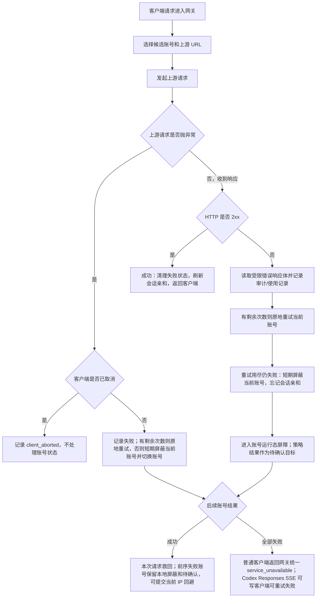
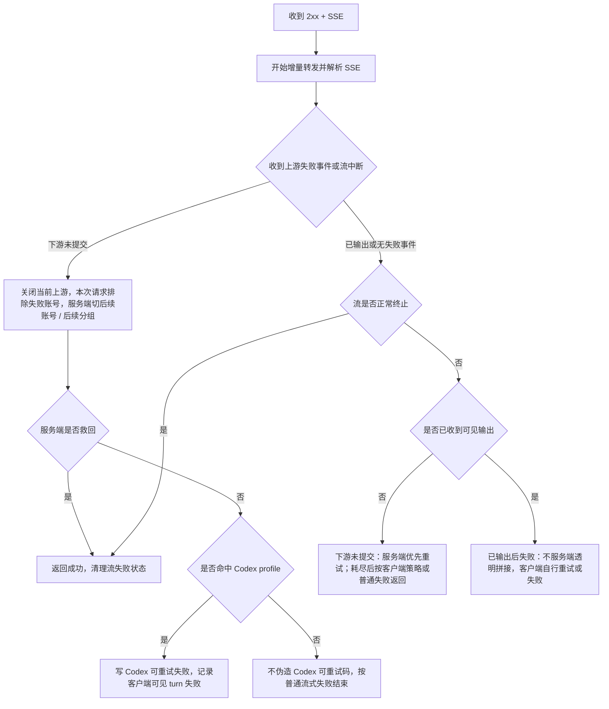
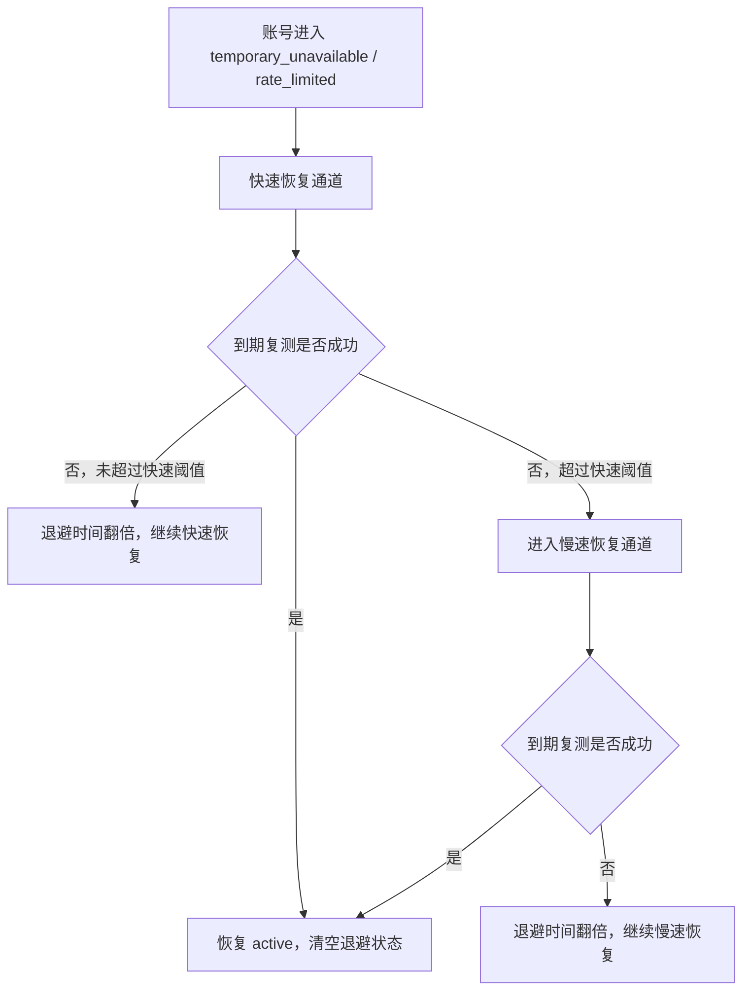

# 网关异常重试与兜底策略

## 目标

本文固定 OpenAI 兼容网关在上游异常、账户错误处理策略、未知失败和流式中断时的处理顺序，避免后续维护时把“账户错误处理策略”“本地失败隔离”“流式失败处理”重复实现或互相抢逻辑。

核心原则：

- 命中上游账号后的错误都先进入账号级短暂避让和失败采样；运行态调度降级必须经过最小观察时间、无成功证据和后台探针确认。上游请求异常、非 `2xx` 响应、非流式正文中断、流式失败事件或流中断都先用于救当前请求和降低后续命中概率；默认待确认目标为 `temporary_unavailable`，账户级错误处理策略可以把待确认目标改为 `rate_limited` 或 `error`。
- 兜底层不维护状态码、错误码或错误文案白名单：状态码和上游错误体只作为诊断字段、审计字段和用户显式配置规则的输入，代码不内置“余额不足”“限流”“某状态码才写状态”之类判断。
- 未知失败交给统一失败流水线：任何上游请求异常或非 `2xx` 响应都先按 `temporaryUnschedulableRetryAttempts` / `temporaryUnschedulableRetryIntervalSeconds` 在当前账号原地确认；重试用尽仍失败后才短期屏蔽当前账号、忘记会话亲和、切换后续账号。持久账号状态由后续成功信号、后台事前确认、后台复测或人工操作决定。
- 请求进入上游前发现当前账号目标协议不能保真承载某个合法能力时，只记录账号作用域 guidance 并跳过当前账号；它不是上游失败，不写账号状态，不进入状态码 / 错误码策略，也不能在还有同分组账号或后续可承接分组时直接返回给客户端。
- 上游 HTTP 非 `2xx` 不进入响应检查策略本体，仍归普通账户错误流水线处理；只有最终所有候选都失败且当前请求命中 Codex Responses SSE profile 时，才在最后一跳把网关失败渲染成 `200 text/event-stream` 的 `response.failed/upstream_retryable_error`，供 Codex 客户端自行重试。
- 当当前分组候选账号都被本地屏蔽时，先尝试 API Key 后续可承接分组；没有后续分组时进入本地恢复巡检窗口，最多等待 30 秒、每 5 秒或最早释放时间重新检查，仍不可用才返回 `503` 和 `Retry-After`，不再因为“只剩一个号”就旁路屏蔽继续打失败账号。
- 多 Key API Key 账户的 Key 级隔离不恢复状态码 / 错误码分类：账户内当前命中的 Key 失败后，只摘除当前 Key 并让当前请求切后续账户；同一请求不遍历该账户内其他 Key。后续再选回该账户时，账户内轮询 / 权重只在可用 Key 中执行；完整设计见 [账户内 API Key 故障隔离设计](账户内APIKey故障隔离设计.md)。
- DeepSeek 这类 OpenAI-compatible 第三方也遵守同一兜底层：401 / 403 / 402 / 429 / 5xx、余额或限流文案、模型不存在文案、`finish_reason = insufficient_system_resource` 等都只能进入诊断、响应语义检查和账户错误处理策略输入，不在兜底层恢复硬编码分类。需要把某类 DeepSeek 错误确认成 `rate_limited`、`temporary_unavailable` 或 `error` 时，应通过账户级错误处理策略和确认流程表达。
- IP 级账号回避只依据调度事实：前序账号失败、后续账号完整成功或最终失败返回客户端时，才确认当前客户端 IP 对前序账号的失败观察；达到阈值后只在同一模型匹配和账号调度优先级层内后置该账号，状态码只作为规则输入和排障字段，不能作为默认避让或冷却依据。
- IP 级错误熔断只依据高置信本地请求错误：认证前缺失 Bearer / 无效 token 探测、本地校验失败在短窗口内重复出现时，才允许短 TTL 本地 `429`；不能把账号池未知失败或容量失败归咎给 IP，也不能按地区、状态码或固定错误码黑名单拦截。
- 上游桶运行态失败只影响候选排序；同 `proxy`、`baseUrl` 或 `provider` 多个账号短窗失败时优先避让该桶账号，但只能在同一模型匹配和账号调度优先级层内后置，不能自动禁用代理、禁用上游或冷却账号。`qualityScore` 只作为排序信号，不作为所有运行态避让的统一硬边界。
- 已经向客户端输出内容的请求不做服务端透明重试：非流式不能安全替换半截 JSON，SSE 不能安全重放半段回答或工具参数；需要重试时由客户端在连接失败或协议失败事件后发起新请求。
- 客户端专属行为必须策略分层：Codex 的 `response.failed/upstream_retryable_error` 重试语义、`x-codex-turn-metadata.turn_id` 和客户端可见失败后的 turn 级账号避让不能写进通用 OpenAI 兜底层。

## 关键参数

| 参数 | 默认值 | 用途 |
| --- | --- | --- |
| `temporaryUnschedulableRetryAttempts` | `3` | 普通上游请求异常或非 `2xx` 响应切号前的同账号原地确认重试次数；冷却恢复复测会显式覆盖为不做同账号重试 |
| `temporaryUnschedulableRetryIntervalSeconds` | `3` | 普通上游请求异常或非 `2xx` 响应同账号原地确认重试之间的等待秒数；冷却恢复复测会显式覆盖为不做同账号重试 |
| `defaultTemporaryUnschedulableMinutes` | `2` | 目标语义为临时不可调用最大暂停时间；账号进入恢复流程后从快速恢复通道起步，连续失败后翻倍，慢速恢复通道不超过该上限 |
| 运行态调度降级观察窗口 | `5min` / 最小观察 `60s` | 单轮高并发残留失败只记录观察，不激活调度降级；调度降级由后台探针在时间窗口内确认近期不稳后激活；调度降级本身没有固定惩罚时长，完整成功、后台探针成功或手动恢复后清理 |
| 本地短暂避让阶梯 | `3s -> 5s -> 10s` | 普通上游失败在原地重试用尽后的进程内短暂屏蔽；每阶到期后优先由 Web 进程内后台探针验证恢复，真实请求半开只作为兜底 |
| `streamCircuitBreakerEnabled` | `true` | 是否启用流式超时检测和流失败诊断计数 |
| `streamRequestTimeoutSeconds` | `120` | 上游首包等待上限；非流式和流式在响应头前、非流式在首字节前超过该时间时按上游请求异常切号 |
| `streamIdleTimeoutSeconds` | `30` | 流式首段后上游 raw chunk 空闲上限；完整 SSE 事件等待只记录诊断，不再硬熔断 |
| `streamClientTotalWaitTimeoutSeconds` | `270` | 同一次客户端连接在服务端隐藏切号 / 重试期间的总等待上限；超过后停止继续隐藏重试并返回失败 |
| `streamMaxLifetimeSeconds` | `1800` | 单条 SSE 最大存活时间；持续心跳也会到点中断当前连接，让客户端重试 |
| `streamFailureThresholdCount` | `3` | 历史流失败诊断计数参数；真实网关流式失败不再依赖该阈值决定是否写状态 |
| `streamFailureThresholdWindowMinutes` | `5` | 历史流失败诊断计数窗口参数；真实网关流式失败不再依赖该窗口直接决定是否写状态 |
| `cooldownAccountRetestMaxBackoffHours` | `12` | 冷却后台复测进入长期不可用的观察阈值；超过后不转异常，继续低频复测 |
| `cooldownAccountRetestLongTermIntervalHours` | `1` | 长期不可用后的低频自动复测间隔；复测成功自动恢复正常 |
| 全池可恢复不可用巡检窗口 | `30s` / `5s` | 当前分组和后续可承接分组都没有可用账号时，只基于本地屏蔽释放时间或账号冷却时间做短等巡检；不识别上游状态码、错误类型或错误文案 |

## 普通响应流程



## 普通响应处理顺序

1. **上游请求抛异常**
   - 客户端取消：记录 `client_aborted`，释放资源，不写账号失败状态。
   - 连接失败、超时、unexpected EOF 等请求异常：先记录失败尝试；如果还有临时状态重试次数，等待配置间隔后原地重试当前账号。
   - 原地重试用尽仍失败时，短期屏蔽当前账号，待确认目标为 `temporary_unavailable`，并切换后续账号。
   - 请求异常不按错误码分类；最后一次失败的错误摘要进入运行态原因和后续确认写回原因。

2. **上游返回 HTTP 2xx**
    - 认为本次上游响应成功。
    - 刷新会话亲和。
    - 清理或衰减当前账号的可恢复软失败状态；普通成功不自动恢复已经持久化的 `rate_limited`。
    - 如果本请求之前已有失败账号，则这些账号已进入本地短期屏蔽和待确认状态；如果当前请求有可用客户端 IP，可提交为当前 IP 对前序账号的短 TTL 回避。
   - 上游响应体读取前必须先按 `content-encoding` 对 `gzip` / `br` / `deflate` 解码；下游复制响应头时继续过滤 `content-encoding`、`content-length` 和 `transfer-encoding`，避免客户端拿到已解码 body 却再次按压缩格式解码。
   - 非流式 `2xx` 首字节前仍属于安全切号窗口；如果首字节等待超过上游首包等待上限，网关按上游请求异常切换后续账号。
   - 非流式首字节已经写给下游后，如果正文中途异常，网关记录 `upstream_body_interrupted`，忘记会话亲和并短期本地避让当前账号，然后打断下游连接；这会让客户端在读取 body 时看到网络失败，再由客户端自身重试策略发起新请求。

3. **上游返回 HTTP 非 2xx**
   - 先按当前 `protocolCode`、`providerCode`、`clientProfile` 和下游模型匹配账户级错误处理策略；策略来自当前账号 `credentials.error_handling_rules`。
   - 不论是否命中账户错误处理策略，都先按临时状态重试配置在当前账号原地确认；确认期间只写失败使用记录和审计尝试，不写账号状态、不本地屏蔽、不记录 IP 回避。
   - 原地重试用尽仍失败后，才短期屏蔽当前账号并切换后续账号。
   - 命中账户错误处理策略时，策略指定的限流、临时不可调用或异常状态作为待确认目标；临时不可调用不带账号级时长，持久写入后统一进入后台快速 / 慢速复测恢复通道。
   - 未命中账户错误处理策略或命中 `retry_next` 时，待确认目标为通用 `temporary_unavailable`；不按状态码、错误码、错误类型或错误文案做代码内置例外分支。
   - 所有候选账号都耗尽时，普通客户端仍返回网关统一 JSON 失败；命中 `clientProfile = codex`、`downstreamProtocol = responses_sse` 且有有效 `x-codex-turn-metadata.turn_id` 的请求，最终可改写为 `response.failed/upstream_retryable_error` SSE 并立即结束连接。这个改写发生在账号流水线之后，不替代账户错误处理策略，也不把 Codex 语义扩散给普通 OpenAI-compatible 客户端。

4. **HTTP 2xx 内的异常完成状态**
   - OpenAI-compatible Chat Completions 成功体里的异常 `finish_reason` 不属于 HTTP 非 `2xx` 错误，默认不进入账户错误处理策略的非 `2xx` 分支。
   - DeepSeek 的 `finish_reason = insufficient_system_resource` 应进入响应语义检查和供应商诊断；下游尚未写出且策略允许时，可以按响应检查动作触发服务端重试 / 切号。
   - 已经写出可见输出时，仍遵守“已写出后不透明拼接”的边界，只能记录诊断、结束响应或依赖客户端重试。
   - 单次异常完成不直接写账号持久状态，是否进入运行态屏障或后台确认必须由响应检查动作和统一账号副作用链路决定。

4. **账号级屏障确认**
   - 运行态短暂避让和已激活的调度降级只影响新请求选号，不主动迁移或中断已经发往上游的存量请求。
   - 存量请求或后台探针完整成功时，清理该账号运行态屏障。
   - 如果账号已经处于运行态屏障，仍在该账号上的存量请求失败时，应减少或跳过剩余同账号原地重试，避免多个并发请求放大失败风暴。
   - 没有成功信号且后台事前确认连续失败后，仍要等当前账号并发归零，才按待确认目标写持久账号状态。
- 半开阈值不能写死为某个并发数；应由账号硬并发、分组单账户排队阈值和请求通道共同收口，同一时间只放行一个探针或真实半开请求。半开租约跟随请求并发生命周期释放，固定租约时间只用于没有在途并发时回收孤儿租约，不能让超长流式请求中途放进第二个半开请求。

## 本地账号屏蔽与恢复等待

普通上游失败在同账号原地重试用尽后进入本地账号屏蔽：

- 每个重试用尽仍失败的账号先进入当前 Web 进程内短暂避让屏障，首次避让 3 秒；同一时间窗口内的并发残留失败只合并为失败样本，不按请求数累计调度降级次数。
- 当前请求继续尝试后续候选账号；后续账号成功时，本次请求救回。
- 前序失败账号在原地重试用尽仍失败时进入当前进程运行态屏障；本地屏蔽负责当前进程短暂避让。调度降级只能由后台探针或后台状态评估在满足最小观察时间、无近期成功和探针失败证据后激活；SQLite 状态只在确认失败、后台复测、手动测试或人工操作后写入。
- 调度降级不阻断账号：当前分组仍有同模型匹配和同账号优先级层的普通候选时优先选择普通候选；排序后置不能把低模型匹配等级或低优先级层账号提前到高层账号前面。当前分组全部候选均已降级时，先尝试 API Key 后续可承接分组，没有后续分组或后续分组也不可承接时，保留原候选顺序兜底尝试降级账号。
- 后续请求选号时先过滤本地屏蔽账号；这是不可调度过滤，不属于排序后置。避让到期后的主要恢复路径是 Web 进程内后台探针，真实请求半开只作为探针未及时完成时的兜底放行约束，并且同一账号同一时间只能放行一个。
- 后台探针成功时清理运行态屏障；探针失败时按时间窗口继续短暂避让、调度降级或进入 `precheck_pending`，不能因为同一波多 IP 高并发失败直接跳过观察窗口。
- 代理 profile 已知不可用和账号准备阶段失败如果来自真实网关流量，也按同一套短暂避让和后台探针推进；不能把代理配置失败直接写成账号持久临时不可调用。
- 如果过滤后仍有账号，继续后续代理避让、IP 级回避和 Codex turn 避让。
- 如果当前分组全部候选都被本地屏蔽，先按路由策略分组绑定顺序尝试后续可承接分组。
- 没有后续可承接分组时，进入本地恢复巡检窗口：最多等待 30 秒，按 5 秒间隔或最早屏蔽释放时间重新检查；释放后继续正常调度，仍不可用才返回网关统一 `503 service_unavailable`，不返回最后一个上游错误体，并按最早屏蔽释放时间写入 `Retry-After`。
- 如果当前分组在普通候选读取阶段没有 active 账号，且后续分组也不可承接，可以额外检查 30 秒窗口内到期的本地冷却账号；该检查只看 `temporary_unavailable` / `rate_limited`、`cooldown_until`、时间计划、授权和模型能力等本地事实，不根据任何上游状态码、错误类型或错误文案判断是否可恢复。

这层降级和屏蔽都是进程内易失运行态，不写 SQLite，不作为长期账号健康事实；本地运行态由 Web 进程内后台探针恢复或确认，已落库冷却态由 ops-worker 冷却复测恢复。它解决的是“失败账号被大量后续请求继续命中”的调度风暴，而不是账号状态定性；账号状态定性必须等成功信号或后台探针确认给出结论。完整状态机见 [AI 账户运行态探针恢复设计](AI账户运行态探针恢复设计.md)。

## IP级账号回避

IP 级账号回避是本地账号屏蔽之外的来源级排序辅助，不是账号健康判断：

- 当前序账号失败、后续账号完整成功时，会把前序账号记录为当前 `systemAccountId + apiKeyId + clientIp` 下的短 TTL 回避账号。
- 已经向客户端返回最终失败的流式或普通失败也会确认本次待回避账号；同 IP 同账号需要两次确认后，第三次请求才开始应用回避。
- `groupId` 不参与 IP 级账号回避键。同一个 API Key 下发生分组切换时，来源对某个账号的短期失败经验应跟随账号和 API Key，不按分组容器重新切碎。
- 回避只影响后续候选账号排序：命中回避的账号排到同一模型匹配和账号调度优先级层后面；如果所有候选账号都被当前 IP 回避，则旁路回避并保留原候选列表，避免把账号池筛空。
- 账户错误处理策略、客户端取消、本地校验失败、额度 / 授权 / 模型过滤失败、账号并发满和代理预检跳过，都不能记录 IP 级账号回避；没有后续成功样本的全失败请求只有在最终失败已经返回客户端时才确认 pending 回避。
- 当前 IP 后续通过某个账号完整成功时，清理该 IP 对该账号的回避状态。
- IP 级回避状态属于进程内短 TTL 运行态，服务重启或缓存淘汰后可以丢失；丢失后回到普通调度，不写入账号状态，也不作为后台复测对象。

具体设计见 [IP 级账号回避与自动切号设计](IP级账号回避与自动切号设计.md)。

## IP级错误熔断

IP 级错误熔断包含认证前窄作用域入口保护和认证后来源级止损能力，不是账号调度排序能力：

- 认证前作用域只能使用 `clientIp + missing_bearer`、`clientIp + token 指纹` 或“已验证无效 token 后”的喷洒计数；随机无效 token 不能在认证前挡住同 IP 的有效 Bearer。
- 作用域为 `systemAccountId + apiKeyId + clientIp`，缺少认证后 scope 或缺少 `clientIp` 时不启用；`groupId` 不参与错误熔断键，同一 API Key 下不同分组共享来源错误风暴状态。
- 只消费高置信本地请求错误：本地 JSON 解析失败、模型过滤失败和 OAuth/Codex adapter 本地校验失败。上游账号池失败只进入账号本地屏蔽和切号流水线，不计入来源错误熔断。
- 命中阈值后短 TTL 返回本地 OpenAI-compatible `429`，不进入账号候选排序和上游调度。
- 账户错误处理策略命中、未知账号池失败、代理失败、账号并发满、分组队列满、单 IP 并发满、客户端取消和流式已输出后失败，默认不计入来源错误熔断。
- 成功请求或 TTL 到期后应恢复当前来源；连续触发可以短期退避，但必须有最大上限。
- 错误熔断状态属于进程内易失运行态，不持久化为 IP 黑名单，不写账号冷却，也不作为后台复测对象。
- 禁止区域性封禁和固定状态码 / 错误码黑名单。

具体设计见 [IP 级错误熔断与恶意请求保护设计](IP级错误熔断与恶意请求保护设计.md)。

## 流式响应流程



## 流式边界

- `response.created`、`response.in_progress`、metadata、心跳和 header 类事件不算可见输出；即使这些事件已经写给下游，也不作为账号流失败计数依据。
- 文本 delta、reasoning delta、工具调用参数 delta、会改变 assistant 内容或工具状态的 output item 事件算可见输出。
- 可见输出判断必须由同一个公共函数提供，响应语义检查和账号流失败副作用不能各自维护一套判断。
- 当前运行时已经把可见输出前的流式失败收敛成两层：第一层是服务端内部重试，只要下游尚未提交 SSE body，就先切换后续账号 / 后续分组；第二层是客户端最终兜底，只有服务端可承接账号耗尽、`clientProfile = codex`、`downstreamProtocol = responses_sse` 且能精确解析 `x-codex-turn-metadata.turn_id` 时，才写出 Codex 可重试失败。未命中 Codex profile 时按普通流式失败返回，不伪造 `upstream_retryable_error`。
- 可见输出前失败包含：首段前无数据、首段后上游空闲、上游读取异常 / EOF、上游压缩响应解码失败、缺少 OpenAI 终止事件、上游 `response.failed`、上游通用 `event: error`。持续有 raw chunk 但暂未形成完整 SSE 事件只记录诊断并继续转发。普通事件里的顶层 `code/message` 字段不单独视为失败。
- Codex profile 的最终 `response.failed/upstream_retryable_error` 只暴露统一“上游流式响应在输出前失败，请重试”文案；底层 `server_is_overloaded`、`slow_down`、`Selected model is at capacity`、`incorrect header check`、`error decoding response body`、代理断流、压缩解码细节和 Codex turn 探针摘要只进入审计和账号诊断，不直接写给 Codex 客户端。
- 已经输出后的失败默认不能由服务端伪造整轮重试；网关记录上游桶运行态用于后续排序，让客户端在连接失败或协议失败后自行重试。`cyber_policy` 是 Codex profile 下的显式例外，但只在失败事件与同批次输出仍处于预提交缓冲、尚未实际写给下游时允许服务端内部重试；已经写出下游后不静默拼接第二条流。
- 当前不再维护流式错误码特征白名单或 Codex 终止类白名单；`server_is_overloaded`、`slow_down`、`context_length_exceeded`、`insufficient_quota`、`usage_not_included`、`invalid_prompt`、`cyber_policy`、通用 `event: error`、未知 `response.failed` 等都按同一个可见输出边界处理。只要仍有可承接账号 / 分组，上游主动失败就不能成为客户端终局失败；若后续需要根据客户端行为做不同失败事件，必须通过 `clientProfile` 策略进入，不能恢复成全局错误码白名单。
- 中转广告、污染文本和账户级 `200 + SSE` / `200 + JSON` 失败由响应语义检查策略承接；它只处理完整响应语义帧边界内的策略命中、写下游前服务端重试、运行态避让和审计 metadata，不替代非 2xx 账户错误处理策略，也不能绕过 Codex profile 专属重试边界。

## 客户端策略边界

新增或调整流式失败处理时，先解析三个独立维度。PLAN-0023 已落地最小策略层：Codex 专属重试码和 turn 级切号只能由 `clientProfile = codex` 触发，不能再回退成通用 OpenAI 行为。

| 维度 | 示例 | 用途 |
| --- | --- | --- |
| `upstreamAdapter` | `openai_api_key`、`openai_oauth_codex` | 决定如何请求上游账号、如何归一化 body/header |
| `downstreamProtocol` | `responses_sse`、`chat_completions_sse`、`json` | 当前用于限制 Codex profile 只命中 Responses SSE；各协议失败事件格式必须由对应 clientProfile 明确声明 |
| `clientProfile` | `codex`、`generic_openai` | 决定客户端是否会自动重试、如何解释错误码、是否启用 turn 级策略 |
| `requestClientCompatibility` | `codex_responses`、`openai_standard`、`anthropic_native`、`claude_code` | 决定当前请求需要哪种客户端兼容能力；候选账号筛选和上游请求准备都使用它 |

Codex 专属策略只允许在 `clientProfile = codex` 且请求能从普通 JSON 对象格式的 `x-codex-turn-metadata.turn_id` 精确解析出非空值时触发。`turnId`、URL 编码 JSON、数组 JSON、`session_id`、`conversation_id`、`prompt_cache_key`、`previous_response_id`、`x-client-request-id`、User-Agent、IP 或 body hash 都不能单独把请求升级为 Codex。识别不到 Codex 时保持普通 OpenAI 网关行为，不做 Codex turn 级账号避让，不新增 Codex 专属可重试错误。

响应检查策略只保留 `clientProfiles` 作为可选适用范围维度。它只过滤策略是否适用于当前请求，不能单独构成命中；策略仍必须由错误码、错误类型、错误文案、完成状态、JSON 路径、SSE 原文或输出文本等响应语义触发。错误码和错误类型只有在策略明确声明客户端画像时才允许作为运行时命中条件；没有客户端画像的通用兜底不能根据上游状态码、错误码或错误类型结束客户端请求或写账号状态。最终是否向下游返回 `upstream_retryable_error` 必须由 `clientProfile = codex` 控制，避免普通 OpenAI-compatible 客户端收到 Codex 专属错误语义。

`response.incomplete` 在 Codex 客户端中会被解析为可重试流式错误。网关默认把 `clientProfiles = codex` 且 `finishReasons = incomplete` 的 Responses SSE 事件纳入响应检查兜底：下游尚未提交时先走服务端重试 / 切号；耗尽后才按 Codex 可重试失败事件结束流。

Codex turn 级重试状态键建议为：

```text
systemAccountId + apiKeyId + endpoint + codex.turn_id + rawBodyHash
```

该键用于同一本地 API Key 边界内的同一 Codex turn，不代表真实自然人用户身份。`groupId` 不参与状态键，同一 API Key 下发生分组切换时仍保留 turn 级失败账号避让连续性。Codex turn 级避让只允许在这个 turn 范围内避让已发生客户端可见失败的账号；不能写全局账号冷却，不能迁移到其他客户端，不能影响其他普通请求。

Codex turn 级切号在选用备用账号前会执行真实账号探针，探针固定命中当前候选账号并走同一套网关链路。等待档位复用诊断策略 `10s -> 20s -> 30s`，但它不是账号失败确认流程：只有本地超时才在同一候选账号上递进到下一档；一旦探针拿到明确失败结果，就立即淘汰该候选并尝试下一个账号，不按状态码、错误码或错误文案做原地分类重试。所有候选探针都失败时，客户端仍只能收到 Codex 统一 `response.failed/upstream_retryable_error`，不能暴露 `codex_switch_probe_failed`、探针账号名、上游错误码或上游错误文案。

## 策略边界

| 场景 | 处理归属 | 是否同账号重试 | 是否写账号状态 |
| --- | --- | --- | --- |
| 当前账号目标协议不支持请求中的合法能力 | 协议桥接 guidance + 调度救回 | 否，跳过当前账号并尝试同分组后续账号 / 后续可承接分组；全部候选耗尽后才返回协议内 guidance | 否；不写账号状态、不本地屏蔽、不进入账户错误处理策略 |
| 账户错误处理策略命中 | 账户级错误处理策略 | 否 | 策略结果作为待确认目标；确认失败且并发归零后按策略写，原因保留策略名并追加真实上游 `code/message` 摘要 |
| 账户错误处理策略为 `retry_next` 或未命中配置规则 | 通用上游失败处理 | 是，按临时状态重试次数 / 间隔原地确认，用尽后切号 | 先进入运行态屏障；确认失败且并发归零后写 `temporary_unavailable`；不按状态码、错误码或文案特判 |
| 请求异常、连接失败、超时、EOF | 通用上游失败处理 | 是，按临时状态重试次数 / 间隔原地确认，用尽后切号 | 先进入运行态屏障；确认失败且并发归零后写 `temporary_unavailable` |
| 前序失败且后续账号成功 | 调度救回 + IP 级账号回避 | 否，已完成本次切号 | 前序失败账号进入运行态屏障；当前 IP 可确认失败观察，达到阈值后在同模型匹配和同优先级层内避让前序账号 |
| 当前分组存在运行态降级账号 | 调度降级排序 | 否，只影响候选排序 | 经最小观察时间、无成功证据和后台探针确认后才激活；有同优先级普通候选时降级账号排后；全降级时先尝试后续分组，无后续分组时兜底尝试；不写账号状态 |
| 所有候选账号都失败，未命中 Codex Responses SSE profile | 网关统一兜底 | 否，候选已扫完 | 命中过上游的账号进入运行态屏障；返回 `service_unavailable` |
| 所有候选账号都失败，且命中 Codex Responses SSE profile | Codex 客户端最终兜底 | 下发 `response.failed/upstream_retryable_error`，由 Codex 客户端决定是否重试 | 命中过上游的账号进入运行态屏障；本次下游响应为 `200 text/event-stream`，不透传最后一个上游 HTTP 错误体 |
| 所有候选都在本地屏蔽中 | 本地短期调度保护 | 先尝试 API Key 后续分组；无可承接分组时最多等待 30 秒做本地恢复巡检；到期后后台探针或单请求半开兜底 | 不新增账号状态；超时后返回 `service_unavailable` 并带 `Retry-After` |
| 短暂避让持续失败且后台探针确认不可用 | 账号事前确认入口 | 否，交给事前确认探针 | 仍不直接写状态；事前确认失败且并发归零后写 `temporary_unavailable` |
| 同上游桶多账号短窗失败 | 上游桶运行态避让 | 否，影响后续候选排序 | 已命中上游失败的账号仍进入账号运行态屏障；同优先级层内避让同桶账号，不禁用代理或上游 |
| 同账号多来源短窗口失败且事前确认连续失败 | 账号事前确认 | 否，探针独立执行 | 当前账号并发归零后写 `temporary_unavailable`；原因使用探针真实上游 `HTTP/code/message` 摘要 |
| 同一认证后来源高置信本地请求错误过多 | IP 级错误熔断 | 否，直接本地短路 | 不写账号状态；当前来源短 TTL 返回 429 |
| 客户端取消 | 客户端生命周期 | 否 | 否 |
| SSE 可见输出前失败，服务端仍有可承接账号 | 服务端内部重试 | 本次请求切后续账号 / 后续分组，客户端无感 | 当前请求排除失败账号；真实网关流量不因无可见输出直接累计账号流失败计数 |
| SSE 可见输出前失败，服务端账号耗尽且命中 Codex profile | Codex 客户端最终兜底 | 下发 `upstream_retryable_error`，由 Codex 客户端决定是否重试；可见失败才记录 turn 状态 | 不因无可见输出直接累计账号流失败计数；持久状态等待确认阶段 |
| SSE 可见输出前失败，服务端账号耗尽且未命中客户端策略 | 普通协议兜底 | 否，由普通失败返回决定 | 不伪造 Codex 可重试码；持久状态等待确认阶段 |
| SSE 可见输出后失败 | 客户端重试 + 通用上游失败处理 | 已写给下游后不服务端静默拼接 | 记录上游桶运行态；后续可优先避让同桶账号 |

## 冷却与限流恢复通道

目标设计把 `temporary_unavailable` 和 `rate_limited` 账号恢复拆成两段：快速恢复通道和慢速恢复通道。该机制不依赖具体状态码或错误码判断账号是否还能恢复，只消费一个事实：后台复测是否成功。手动账号测试、后台冷却复测和账号事前确认探针都走账号配置下的真实网关请求链路，诊断等待固定为 `10s -> 20s -> 30s` 三次尝试，总等待不超过 60 秒；三次之间不按上游状态码、错误码或错误文案分类，只按成功与否继续。



- 账号刚被写入 `temporary_unavailable` 或 `rate_limited` 时进入快速恢复通道，起始退避固定为 3 秒，后续失败按 `3s -> 6s -> 12s -> 24s -> ...` 翻倍。
- 快速恢复通道用于吸收短暂波动，不把每次失败都当成异常信号；到期复测成功时立即恢复账号，不等待原来的固定分钟级冷却。
- 当退避时间超过快速通道阈值后，账号自然退化到慢速恢复通道。快速通道阈值作为代码内固定策略即可，先不暴露成系统配置。
- 慢速恢复通道继续按失败次数翻倍，但下一次 `cooldown_until` 不能超过 `defaultTemporaryUnschedulableMinutes` 表达的最大暂停时间。
- 账号进入冷却态时记录本轮自动恢复观察起点；慢速恢复持续失败时只延长下一次复测时间，并保留最近测试 HTTP 状态、错误码、错误摘要、连续失败次数和观察起点，供账户页和日志排查。
- 账号复测成功、手动恢复正常、更新凭据后恢复、停用或到期时，必须清空恢复通道状态、退避计数、当前退避时长和最近复测信息。
- `error`、`disabled` 等硬状态不进入该恢复通道；只有用户手动停用或明确硬异常才需要人工恢复。

## 恢复通道日志去噪

- 快速恢复通道是预期内的抖动吸收流程，中间失败不得逐次写 `warn` 常规日志，避免 3 秒、6 秒、12 秒这类高频复测放大运行日志。
- 快速恢复通道优先记录关键状态变化：快速恢复成功、快速通道退化为慢速通道。中间失败只更新账号字段、使用记录来源和运行态指标。
- 后台恢复探活写入使用记录时必须标记 `traffic_source = cooldown_retest`，不参与业务用量统计或账户质量统计；统计 worker 可以推进安全游标确认这类明细，但不能写入业务聚合窗口。手动账号测试标记 `manual_account_test`，真实客户端请求标记 `gateway`。
- 恢复探活审计日志标记同一 `traffic_source`，并使用元信息捕获模式：保留 trace、账号、分组、状态码、尝试摘要和错误摘要，不保存完整请求 / 响应 payload。
- 恢复探活写回账号 `last_error_code/last_error_message` 时必须使用本次上游真实错误摘要，不能使用网关最终兜底的“没有可用上游账户 / 503”覆盖账号原因。
- 事前确认探针如果连续失败并最终写入 `temporary_unavailable`，同样只能使用探针本次完整诊断里的真实上游摘要；给调用方看的兜底 `service_unavailable` 和给授权用户看的脱敏测试文案只属于展示层，不能覆盖账号最近错误。
- 使用记录和审计日志列表必须支持按来源筛选，排障时可以只看真实网关请求、手动账号测试或恢复探活。
- 同一账号、同一恢复阶段、同一错误摘要的复测失败日志需要节流；快速通道失败落到 `debug` 级别，进入慢速通道时再输出结构化告警。
- 慢速恢复通道频率较低，可以记录持续失败摘要，但日志只包含账号 ID、阶段、连续失败次数、当前退避、下次复测时间和短错误摘要，不写完整请求 / 响应 payload。
- 转为异常时输出明确告警日志，说明账号已退出自动恢复通道，并带上最终失败次数、最后错误摘要和最后复测时间。

## 维护规则

- 新增已知上游账号问题时，优先加账户级错误处理策略；不要在兜底层增加状态码、错误码或错误文案判断。
- 本地失败隔离只表达“当前账号刚失败，短时间先别继续打它”，不能承担错误分类。
- IP 级账号回避不能维护状态码白名单或黑名单；只能消费“失败账号被后续成功账号证明可绕开”或“最终失败已经返回客户端”的调度事实，达到阈值后也只能在同模型匹配和账号调度优先级层内后置。
- IP 级错误熔断不能维护状态码白名单或黑名单；只能消费高置信本地请求错误，且不能把账号级失败、容量失败或上游公共故障计入来源处罚。
- 普通上游失败不能走请求级错误缓存短路；重复请求也应遵守本地屏蔽、等待和切号流水线。
- 上游桶运行态失败和已激活的账号运行态调度降级都只影响后续候选排序，且不能跨模型匹配和账号调度优先级层提低层账号；不能禁用代理、上游或账号；已实际命中并失败的账号仍进入账号级运行态屏障。
- 单个客户端 IP 的连续失败不能直接制造额外账号状态；只有实际命中上游账号后的错误才允许进入该账号运行态屏障，持久状态仍需确认失败后写入。
- 命中账户错误处理策略后按策略形成待确认目标；未命中或命中 `retry_next` 时仍按通用上游失败形成 `temporary_unavailable` 待确认目标，当前调度仍按本地屏蔽后切号处理。
- 服务端内部重试优先于客户端重试；可见输出前只有当服务端可承接账号耗尽时，才允许按客户端策略写最终失败。`response.failed/upstream_retryable_error` 当前仅 Codex profile 启用；turn 级账号避让也只允许放在 Codex profile。
- 不维护 Codex 终止类错误码白名单；可见输出前的流式失败在服务端重试耗尽后，只要命中 Codex profile，就改写为 `upstream_retryable_error` 并可写入客户端可见 turn 失败计数。隐藏服务端重试成功时不消耗客户端 turn 失败计数。`cyber_policy` 是输出后也允许在预提交缓冲内服务端重试的显式例外。
- 流式失败不再依赖错误码或阈值直接写账号状态；上游桶运行态和已激活的账号运行态调度降级只作为后续排序辅助，持久状态仍等待确认失败。
- 普通上游失败全部候选失败时返回网关统一错误，不把最后一个上游错误体返回给客户端。
- 修改流程后必须补回归，至少覆盖：`invalid_request_error` 切号救回并让前序账号进入运行态屏障、未知失败按临时状态配置原地重试且用尽后切号并进入待确认、本地屏蔽生效、存量并发成功后清理屏障、账号仍有并发时不直接写 `temporary_unavailable`、半开探针单飞、全部失败统一网关错误、单账号屏蔽耗尽时等待释放并恢复调度、多分组主号池全屏蔽时切后续可承接分组、上游桶运行态避让、`response.created` 后缺少终止事件在下游未提交时服务端切号、Codex profile 服务端重试耗尽后才写 `upstream_retryable_error`、非 Codex 不触发 Codex 改写、Codex turn 可见失败后的账号避让、可见输出后流失败不服务端静默拼接。

## 排障日志

常用日志事件：

- `gateway_upstream_response_failed`：上游返回非成功状态，当前尝试失败。
- `gateway_upstream_request_failed`：上游请求阶段异常，当前尝试失败。
- `gateway_account_local_suppressed`：当前账号进入本进程短期屏蔽。
- `gateway_account_runtime_degradation_observed`：当前账号出现失败观察，尚未达到后台探针确认的调度降级门槛。
- `gateway_account_runtime_degraded`：当前账号经时间窗口和后台探针确认后进入运行态调度降级，仅在普通候选不足时兜底尝试。
- `gateway_runtime_degradation_order_applied` / `gateway_runtime_degradation_fallback_only`：候选列表已应用调度降级排序，或当前号池全部候选都处于调度降级并准备尝试后备号池。
- `gateway_local_account_suppression_applied`：候选列表已过滤本地屏蔽账号。
- `gateway_local_account_suppression_exhausted`：当前分组所有候选都在本地屏蔽中，已准备切后续分组或进入本地恢复巡检窗口。
- `gateway_recoverable_unavailable_wait_scheduled`：当前请求命中全池可恢复不可用，已按本地恢复窗口安排下一次重新检查。
- `gateway_upstream_failure_bucket_opened` / `gateway_upstream_bucket_health_avoidance_applied`：上游桶运行态失败打开或应用到候选排序。
- `record_account_stream_failure`：历史流失败诊断计数写入；不再触发账号冷却或异常状态。
- `gateway_client_ip_account_avoidance_applied`：候选列表已应用当前客户端 IP 的账号回避排序。
- `gateway_client_ip_account_failure_confirmed`：后续账号成功或最终失败返回客户端后，前序失败账号被提交为当前 IP 短期回避观察。
- `gateway_client_ip_error_circuit_sample_recorded`：当前认证后来源记录了一次高置信错误样本。
- `gateway_client_ip_error_circuit_opened`：当前认证后来源进入短 TTL 错误熔断。
- `gateway_client_ip_error_circuit_blocked`：当前请求因来源错误熔断被本地 429 短路。
- `pre_commit_stream_server_retry` / `stream_server_retry_dispatch`：下游未提交前的 SSE 失败已进入服务端内部重试和下一轮账号调度。
- `stream_server_retry_exhausted`：服务端内部重试耗尽，准备按客户端能力写最终失败。
- `gateway_stream_finished_failed` / `gateway_stream_missing_terminal`：流式响应未正常完成。
- `gateway_account_local_suppressed`：本进程短期避让该账号，避免失败账号被后续请求继续命中。
