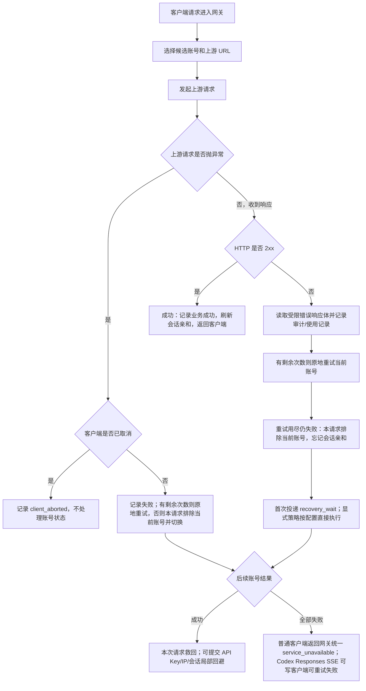
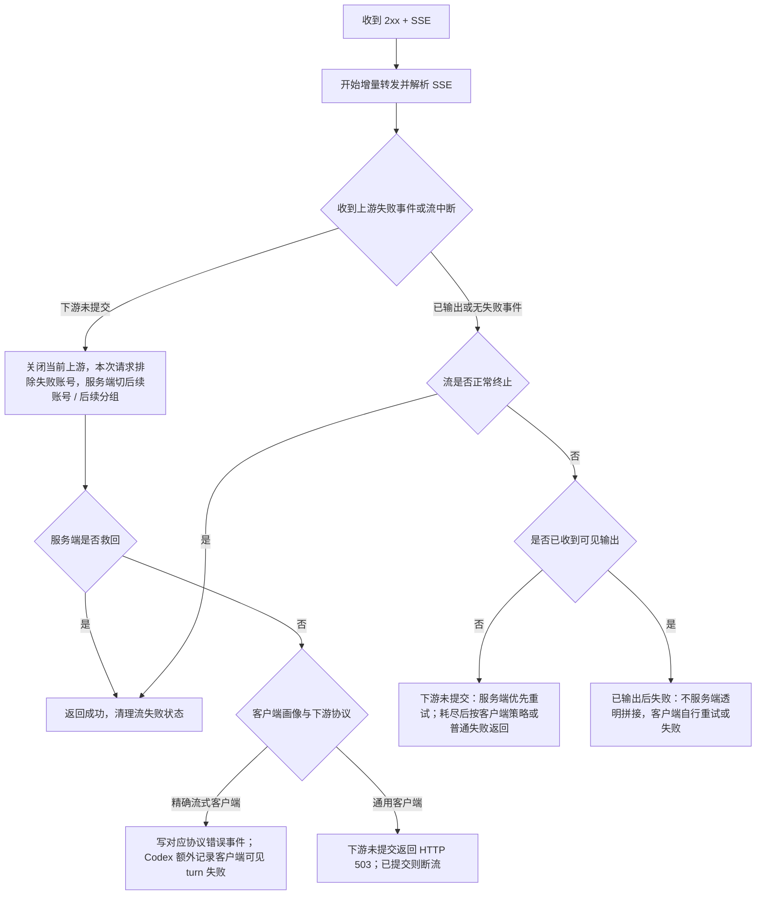
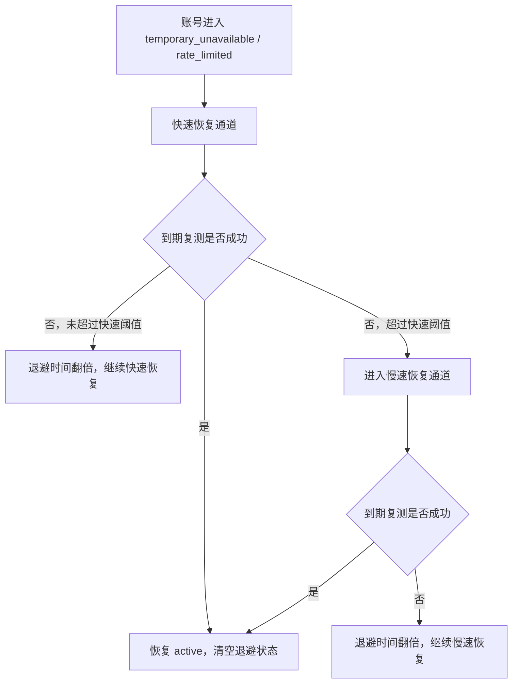

# 网关异常重试与兜底策略

## 目标

本文固定 OpenAI 兼容网关在上游异常、账户错误处理策略、未知失败和流式中断时的处理顺序，避免后续维护时把“账户错误处理策略”“本地失败隔离”“流式失败处理”重复实现或互相抢逻辑。

核心原则：

- 未命中显式策略时，命中上游账号后的错误只用于救当前请求、排除本请求已失败账号、建立 API Key / IP / 会话局部回避并原子首次投递 `recovery_wait`；普通请求不能建立、续期、升级或清理账户级运行态。独立后台探针真实失败后才进入 `precheck_pending` 软阻断，最终持久状态仍由后台确认。
- 兜底层不维护状态码、错误码或错误文案白名单：状态码和上游错误体只作为诊断字段、审计字段和用户显式配置规则的输入，代码不内置“余额不足”“限流”“某状态码才写状态”之类判断。
- 未知失败交给统一失败流水线：真实客户端请求按 `temporaryUnschedulableRetryAttempts` 建立请求级共享确认预算；当前账号失败且预算尚有剩余时，按 `temporaryUnschedulableRetryIntervalSeconds` 原地重试并消费一次。预算不在每个账号上重新发放；预算耗尽后忘记会话亲和、在当前请求中排除失败账号并切换后续账号。普通成功只记录业务事实，不能清理账户级运行态；持久账号状态由后台事前确认、后台复测或人工操作决定。
- 请求进入上游前发现当前账号目标协议不能保真承载某个合法能力时，只记录账号作用域 guidance 并跳过当前账号；它不是上游失败，不写账号状态，不进入状态码 / 错误码策略，也不能在还有同分组账号或后续可承接分组时直接返回给客户端。
- 上游 HTTP 非 `2xx` 不进入响应检查策略本体，仍归普通账户错误流水线处理；最终所有候选都失败后，按客户端画像和下游协议选择最终信号：Codex Responses、Claude Code Messages、Gemini CLI stream 使用协议失败事件，通用客户端在下游未提交时返回协议原生 HTTP `503`，下游已提交且没有可靠失败事件时直接断流。
- 当健康候选和后备分组都不可承接且只剩 `precheck_pending` 软阻断账户时，按 `runtimeKey + generation` 获取账户租约并限制同分组同时最多一个半开；其他请求进入有上限 FIFO 等待。等待、重试、换号、后备、fetch 和响应读取共用从原始 `startedAt` 起算、最多 270 秒的绝对 deadline。
- 多 Key API Key 账户的 Key 级隔离不恢复状态码 / 错误码分类：账户内当前命中的 Key 失败后，只摘除当前 Key 并让当前请求切后续账户；同一请求不遍历该账户内其他 Key。后续再选回该账户时，账户内轮询 / 权重只在可用 Key 中执行；完整设计见 [账户内 API Key 故障隔离设计](账户内APIKey故障隔离设计.md)。
- DeepSeek 这类 OpenAI-compatible 第三方也遵守同一兜底层：401 / 403 / 402 / 429 / 5xx、余额或限流文案、模型不存在文案、`finish_reason = insufficient_system_resource` 等都只能进入诊断、响应语义检查和账户错误处理策略输入，不在兜底层恢复硬编码分类。需要把某类 DeepSeek 错误确认成 `rate_limited`、`temporary_unavailable` 或 `error` 时，应通过账户级错误处理策略和确认流程表达。
- IP 级账号回避只依据调度事实：前序账号失败、后续账号完整成功或最终失败返回客户端时，才确认当前客户端 IP 对前序账号的失败观察；达到阈值后只在同一模型匹配和账号调度优先级层内后置该账号，状态码只作为规则输入和排障字段，不能作为默认避让或冷却依据。
- IP 级错误熔断只依据高置信本地请求错误：认证前缺失 Bearer / 无效 token 探测、本地校验失败在短窗口内重复出现时，才允许短 TTL 本地 `429`；不能把账号池未知失败或容量失败归咎给 IP，也不能按地区、状态码或固定错误码黑名单拦截。
- 上游桶运行态失败只影响候选排序；同 `proxy`、`baseUrl` 或 `provider` 多个账号短窗失败时优先避让该桶账号，但只能在同一模型匹配和账号调度优先级层内后置，不能自动禁用代理、禁用上游或冷却账号。`qualityScore` 只作为排序信号，不作为所有运行态避让的统一硬边界。
- 普通路由 `speed_first` 的 `latency_degraded` 不属于上游失败兜底层的调度降级。普通请求只记录首字样本，后台探针或后台状态评估确认持续慢后才建立该短 TTL 覆盖；后台探针恢复后必须回到账户配置排序。普通上游失败不进入速度优先判断，也不会因为启用快速模式而跳过请求级共享失败确认预算。
- 已经向客户端输出内容的请求不做服务端透明重试：非流式不能安全替换半截 JSON，SSE 不能安全重放半段回答或工具参数；需要重试时由客户端在连接失败或协议失败事件后发起新请求。
- 客户端专属行为必须策略分层：Codex 的 Responses 失败事件和 turn 级账号避让、Claude Code 的 Messages 错误事件、Gemini CLI 的 Gemini 错误事件都由客户端策略声明；通用网关层只消费“协议事件 / HTTP 错误 / 断流”能力，不按上游错误内容决定客户端机制。

## 关键参数

| 参数 | 默认值 | 用途 |
| --- | --- | --- |
| `temporaryUnschedulableRetryAttempts` | `3` | 同账号失败确认次数；真实客户端请求把配置值作为整个请求共享预算，不按账号重置；冷却恢复复测会显式覆盖为不做同账号重试 |
| `temporaryUnschedulableRetryIntervalSeconds` | `3` | 普通上游请求异常或非 `2xx` 响应同账号原地确认重试之间的等待秒数；冷却恢复复测会显式覆盖为不做同账号重试 |
| `defaultTemporaryUnschedulableMinutes` | `2` | 目标语义为临时不可调用最大暂停时间；账号进入恢复流程后从快速恢复通道起步，连续失败后翻倍，慢速恢复通道不超过该上限 |
| 运行态调度降级观察窗口 | `5min` / 最小观察 `60s` | 普通失败只投递核实；`runtime_degraded` 和 `latency_degraded` 都只能由后台探针或后台状态评估激活，并由后台探针或手动恢复清理 |
| `recovery_wait` | 原子首次投递 | 普通失败只首次创建后台核实任务；任务保持账户普通可调度且不展示，后续请求不得合并、续期或改写 |
| `streamRequestTimeoutSeconds` | `120` | 上游首包等待上限；非流式和流式在响应头前、非流式在首字节前超过该时间时按上游请求异常切号 |
| `streamIdleTimeoutSeconds` | `30` | 流式首段后上游 raw chunk 空闲上限；完整 SSE 事件等待只记录诊断，不再硬熔断 |
| `streamClientTotalWaitTimeoutSeconds` | `270` | 网关请求绝对总预算上限；从原始 `startedAt` 起覆盖排队、半开、切号、重试、后备、fetch 和响应读取，任何阶段不得重置 |
| `streamMaxLifetimeSeconds` | `1800` | 单条 SSE 最大存活时间；持续心跳也会到点中断当前连接，让客户端重试 |
| `streamFailureThresholdCount` | `3` | 历史流失败诊断计数参数；真实网关流式失败不再依赖该阈值决定是否写状态 |
| `streamFailureThresholdWindowMinutes` | `5` | 历史流失败诊断计数窗口参数；真实网关流式失败不再依赖该窗口直接决定是否写状态 |

流式超时检测固定启用，不提供系统设置开关。
| `cooldownAccountRetestMaxBackoffHours` | `12` | 冷却后台复测进入长期不可用阶段的快速恢复窗口；长期阶段固定每 1 小时复测，从观察起点满 7 天仍失败则转异常 |
| 全池软阻断等待 | FIFO / 单 timer | 健康和后备优先；只剩 `precheck_pending` 时同账户、同分组单飞半开，其余请求在绝对 deadline 内有界等待 |

## 请求体解析与客户端生命周期错误

- 客户端在请求体上传完成前断开、声明的 `Content-Length` 未完整到达或底层解析器判定 `request.aborted` / `request.size.invalid` 时，返回 OpenAI 兼容 HTTP `408`、错误码 `request_timeout`，归因 `client_lifecycle`，提示客户端可按标准重试策略重新发送完整请求。
- 客户端已经完整上传但 JSON 语法非法时保持 HTTP `400` 的本地请求错误语义，不能误报为上传中断或 `408`。
- 这两类错误都发生在有效上游派发前，不执行账户错误策略、响应拦截、账户 Key 轮换、账户运行态、`recovery_wait` 或后台探针副作用。

## 普通响应流程



## 普通响应处理顺序

1. **上游请求抛异常**
   - 客户端取消：记录 `client_aborted`，释放资源，不写账号失败状态。
   - 连接失败、超时、unexpected EOF 等请求异常：先记录失败尝试；如果还有临时状态重试次数，等待配置间隔后原地重试当前账号。
   - 原地重试用尽仍失败时，在本请求中排除当前账号、忘记会话亲和、首次投递 `recovery_wait` 并切换后续账号。
   - 请求异常不按错误码分类；最后一次失败的错误摘要只进入诊断和后台核实输入，普通请求不能据此建立账户级运行态。

2. **上游返回 HTTP 2xx**
    - 认为本次上游响应成功。
    - 刷新会话亲和。
    - 普通成功不清理或衰减账户级运行态，也不恢复已经持久化的状态；只可清理本请求或当前来源范围内的局部回避。
    - 如果本请求之前已有失败账号且当前请求有可用客户端 IP，可提交为当前 IP 对前序账号的短 TTL 局部回避。
   - 上游响应体读取前必须先按 `content-encoding` 对 `gzip` / `br` / `deflate` 解码；下游复制响应头时继续过滤 `content-encoding`、`content-length` 和 `transfer-encoding`，避免客户端拿到已解码 body 却再次按压缩格式解码。
   - 非流式 `2xx` 首字节前仍属于安全切号窗口；如果首字节等待超过上游首包等待上限，网关按上游请求异常切换后续账号。
    - 非流式首字节已经写给下游后，如果正文中途异常，网关记录 `upstream_body_interrupted`，忘记会话亲和、在本请求 / 来源范围内回避当前账号并首次投递 `recovery_wait`，然后打断下游连接；这会让客户端在读取 body 时看到网络失败，再由客户端自身重试策略发起新请求。

3. **上游返回 HTTP 非 2xx**
   - 先按当前 `protocolCode`、`providerCode`、`clientProfile` 和下游模型匹配账户级错误处理策略；策略来自当前账号 `credentials.error_handling_rules`。
   - 不论是否命中账户错误处理策略，都先按临时状态重试配置在当前账号原地确认；确认期间只写失败使用记录和审计尝试，不写账号状态、不本地屏蔽、不记录 IP 回避。
   - 原地重试用尽仍失败后，在本请求中排除当前账号并切换后续账号，同时首次投递 `recovery_wait`。
   - 命中账户错误处理策略时属于账户所有者主动管理行为，按策略直接执行 `retry_next`、限流、临时不可调用或异常等动作，不再等待系统自动探针二次确认。
   - 未命中账户错误处理策略或命中 `retry_next` 时，只走通用后台核实；不按状态码、错误码、错误类型或错误文案做代码内置例外分支。
   - 所有候选账号都耗尽时，才按客户端画像和下游协议发送最终失败：精确命中的 Codex Responses、Claude Code Messages 和 Gemini CLI 流分别使用对应协议错误事件；通用客户端在下游未提交时返回 HTTP `503/upstream_retryable_error`，已提交时断流。最终改写发生在账号流水线之后，不替代账户错误处理策略，也不把任一客户端专属事件格式扩散给其他客户端。

4. **HTTP 2xx 内的异常完成状态**
   - OpenAI-compatible Chat Completions 成功体里的异常 `finish_reason` 不属于 HTTP 非 `2xx` 错误，默认不进入账户错误处理策略的非 `2xx` 分支。
   - DeepSeek 的 `finish_reason = insufficient_system_resource` 应进入响应语义检查和供应商诊断；下游尚未写出且策略允许时，可以按响应检查动作触发服务端重试 / 切号。
   - 已经写出可见输出时，仍遵守“已写出后不透明拼接”的边界，只能记录诊断、结束响应或依赖客户端重试。
   - 单次异常完成不直接写账号持久状态；未命中显式响应策略时只投递后台核实，命中显式策略时按用户配置直接执行。

4. **后台确认与受控半开**
   - `recovery_wait` 不影响普通选号；独立后台探针真实失败后，才按 generation 建立 `precheck_pending` 并软阻断普通新请求。
   - 普通存量请求成功不能清理账户级运行态；后台探针、主动健康检查或持有匹配 generation 租约的半开完整成功才能 CAS 清理。
   - 全池软阻断时健康候选和后备分组优先；仍无可承接候选时，同账户和同分组都只允许一个半开，其他请求进入有上限 FIFO。
   - 半开租约使用 `phase + generation + leaseId` CAS，跟随请求生命周期释放；失败、超时和客户端中断只释放租约，不累计后台探针轮次。完整 JSON / SSE 协议成功才算恢复，headers、首字节或部分 token 不算。

## 后台核实、软阻断与恢复等待

普通上游失败在同账号原地重试用尽后，只在当前请求中排除失败账号、继续尝试后续候选，并原子首次投递 `recovery_wait`。后续普通请求不得合并失败计数、替换 generation、刷新 TTL 或改变 due 时间；普通成功也不能清理账户级事件。

- `recovery_wait` 保持普通可调度且不展示异常。后台执行器未形成真实上游尝试时结论为未知，不得建立软阻断。
- 首次有效独立后台探针真实失败后，standalone memory / performance Redis 都写入 `precheck_pending`；performance 使用 `phase + generation + leaseId` Lua CAS，不能退回空的进程内快照。
- `precheck_pending` 从普通候选中软阻断；后台探针、主动健康检查和受控半开保留访问权。后台失败后可继续推进 `runtime_degraded` 或最终持久确认，但普通请求次数不能参与状态升级。
- 当前分组仍有健康候选时直接调度；没有健康候选时先尝试路由策略允许的后备分组。
- 当前分组与后备均只剩软阻断账户时，按 `runtimeKey + generation` 获取账户租约，并按 `systemAccountId + groupId` 限制同分组同时最多一个半开；其余请求按分组、模型和候选 generation 进入有上限 FIFO。
- 协调器使用单 timer、支持 AbortSignal、每次只唤醒一个等待者。等待、重试、换号、后备、fetch 和响应读取共用从原始 `startedAt` 起算、最多 270 秒绝对 deadline。
- 半开成功必须是完整 JSON / SSE 协议成功，才能按 generation CAS 清理软阻断；失败、超时或客户端中断只释放匹配租约，不累计后台探针轮次。
- 用户显式账户错误策略或响应拦截策略建立的状态 / TTL 不进入系统自动半开，后台探针成功不能提前解除；只在策略 TTL 到期或人工恢复时清理。

账户探针运行态不写 SQLite：standalone 使用 memory，performance 使用 Redis runtime state；已落库冷却态由 ops-worker 冷却复测恢复。完整状态机见 [AI 账户运行态探针恢复设计](AI账户运行态探针恢复设计.md)。

## IP级账号回避

IP 级账号回避是本地账号屏蔽之外的来源级排序辅助，不是账号健康判断：

- 当前序账号失败、后续账号完整成功时，会把前序账号记录为当前 `systemAccountId + apiKeyId + clientIp` 下的短 TTL 回避账号。
- 已经向客户端返回最终失败的流式或普通失败也会确认本次待回避账号；同 IP 同账号需要两次确认后，第三次请求才开始应用回避。
- `groupId` 不参与 IP 级账号回避键。同一个 API Key 下发生分组切换时，来源对某个账号的短期失败经验应跟随账号和 API Key，不按分组容器重新切碎。
- 回避只影响后续候选账号排序：命中回避的账号排到同一模型匹配和账号调度优先级层后面；如果所有候选账号都被当前 IP 回避，则旁路回避并保留原候选列表，避免把账号池筛空。
- 账户错误处理策略、客户端取消、本地校验失败、额度 / 授权 / 模型过滤失败、账号并发满和代理预检跳过，都不能记录 IP 级账号回避；没有后续成功样本的全失败请求只有在最终失败已经返回客户端时才确认 pending 回避。
- 当前 IP 后续通过某个账号完整成功时，清理该 IP 对该账号的回避状态。
- IP 级回避状态属于进程内短 TTL 运行态，服务重启或缓存淘汰后可以丢失；丢失后回到普通调度，不写入账号状态，也不作为后台复测对象。

具体设计见 [IP 级账号回避与自动切号设计](IP级账号回避与自动切号设计.md)。

## IP级错误熔断

IP 级错误熔断包含认证前窄作用域入口保护和认证后来源级止损能力，不是账号调度排序能力：

- 认证前作用域只能使用 `clientIp + missing_bearer`、`clientIp + token 指纹` 或“已验证无效 token 后”的喷洒计数；随机无效 token 不能在认证前挡住同 IP 的有效 Bearer。
- 作用域为 `systemAccountId + apiKeyId + clientIp`，缺少认证后 scope 或缺少 `clientIp` 时不启用；`groupId` 不参与错误熔断键，同一 API Key 下不同分组共享来源错误风暴状态。
- 只消费高置信本地请求错误：本地 JSON 解析失败、模型过滤失败和 OAuth/Codex adapter 本地校验失败。上游账号池失败只进入当前请求切号、来源局部回避和首次后台核实流水线，不计入来源错误熔断。
- 命中阈值后短 TTL 返回本地 OpenAI-compatible `429`，不进入账号候选排序和上游调度。
- 账户错误处理策略命中、未知账号池失败、代理失败、账号并发满、分组队列满、单 IP 并发满、客户端取消和流式已输出后失败，默认不计入来源错误熔断。
- 成功请求或 TTL 到期后应恢复当前来源；连续触发可以短期退避，但必须有最大上限。
- 错误熔断状态属于进程内易失运行态，不持久化为 IP 黑名单，不写账号冷却，也不作为后台复测对象。
- 禁止区域性封禁和固定状态码 / 错误码黑名单。

具体设计见 [IP 级错误熔断与恶意请求保护设计](IP级错误熔断与恶意请求保护设计.md)。

## 流式响应流程



## 流式边界

- `response.created`、`response.in_progress`、metadata、心跳和 header 类事件不算可见输出；即使这些事件已经写给下游，也不作为账号流失败计数依据。
- 文本 delta、reasoning delta、工具调用参数 delta、会改变 assistant 内容或工具状态的 output item 事件算可见输出。
- 可见输出判断必须由同一个公共函数提供，响应语义检查和账号流失败副作用不能各自维护一套判断。
- 当前运行时已经把可见输出前的流式失败收敛成两层：第一层是服务端内部重试，只要下游尚未提交 SSE body，就先切换后续账号 / 后续分组；第二层是客户端最终兜底，只有服务端可承接账号耗尽后才触发。精确命中的 Codex Responses、Claude Code Messages 和 Gemini CLI 流分别写对应协议错误事件；通用客户端在下游未提交时返回 HTTP `503`。最终失败统一使用稳定网关码 `upstream_retryable_error` 表达“服务端候选已耗尽，建议客户端重试”，不表示对上游错误类型做了分类。
- 可见输出前失败包含：首段前无数据、首段后上游空闲、上游读取异常 / EOF、上游压缩响应解码失败、缺少 OpenAI 终止事件、上游 `response.failed`、上游通用 `event: error`。持续有 raw chunk 但暂未形成完整 SSE 事件只记录诊断并继续转发。普通事件里的顶层 `code/message` 字段不单独视为失败。
- 最终客户端错误只暴露统一“上游流式响应在输出前失败，请重试”语义；底层 `server_is_overloaded`、`slow_down`、`Selected model is at capacity`、`incorrect header check`、`error decoding response body`、代理断流、压缩解码细节和 Codex turn 诊断摘要只进入审计和账号诊断，不直接写给客户端。
- 是否还能由服务端重试只看下游实际写出边界，不按上游错误内容设置例外。同批次输出与失败仍处于预提交缓冲、下游实际写出字节数为零时可以继续切号；一旦已有内容写给下游，就不静默拼接第二条流，按客户端策略写协议失败事件或断开连接。
- 当前不再维护流式错误码特征白名单或 Codex 终止类白名单；`server_is_overloaded`、`slow_down`、`context_length_exceeded`、`insufficient_quota`、`usage_not_included`、`invalid_prompt`、`cyber_policy`、通用 `event: error`、未知 `response.failed` 等都按同一个可见输出边界处理。只要仍有可承接账号 / 分组，上游主动失败就不能成为客户端终局失败；若后续需要根据客户端行为做不同失败事件，必须通过 `clientProfile` 策略进入，不能恢复成全局错误码白名单。
- 中转广告、污染文本和账户级 `200 + SSE` / `200 + JSON` 失败由响应语义检查策略承接；它只处理完整响应语义帧边界内的策略命中、写下游前服务端重试、运行态避让和审计 metadata，不替代非 2xx 账户错误处理策略，也不能绕过客户端画像与下游协议声明的最终失败边界。

## 客户端策略边界

新增或调整流式失败处理时，先解析三个独立维度。客户端协议错误事件只能由精确 `clientProfile + downstreamProtocol` 组合触发；Codex turn 级切号只能由 `clientProfile = codex` 触发，不能回退成通用 OpenAI 行为。

| 维度 | 示例 | 用途 |
| --- | --- | --- |
| `upstreamAdapter` | `openai_api_key`、`openai_oauth_codex` | 决定如何请求上游账号、如何归一化 body/header |
| `downstreamProtocol` | `responses_sse`、`chat_completions_sse`、`messages_sse`、`gemini_stream_generate_content_sse`、`json` | 决定最终失败能否写协议错误事件；各协议事件格式必须由对应 clientProfile 明确声明 |
| `clientProfile` | `codex`、`claude_code`、`gemini_cli`、`generic_*` | 决定客户端重试信号使用协议事件、HTTP 错误还是断流；只有 Codex 启用 turn 级策略 |
| `requestClientCompatibility` | `codex_responses`、`openai_standard`、`anthropic_native`、`claude_code` | 决定当前请求需要哪种客户端兼容能力；候选账号筛选和上游请求准备都使用它 |

Codex turn 专属策略只允许在 `clientProfile = codex` 且请求能从普通 JSON 对象格式的 `x-codex-turn-metadata.turn_id` 精确解析出非空值时触发。`turnId`、URL 编码 JSON、数组 JSON、`session_id`、`conversation_id`、`prompt_cache_key`、`previous_response_id`、`x-client-request-id`、User-Agent、IP 或 body hash 都不能单独把请求升级为 Codex。识别不到 Codex 时不做 Codex turn 级账号避让，但仍执行通用账号扫描和客户端重试协调。

响应检查策略只保留 `clientProfiles` 作为可选适用范围维度。它只过滤策略是否适用于当前请求，不能单独构成命中；策略仍必须由错误码、错误类型、错误文案、完成状态、JSON 路径、SSE 原文或输出文本等响应语义触发。错误码和错误类型只有在策略明确声明客户端画像时才允许作为运行时命中条件；没有客户端画像的通用兜底不能根据上游状态码、错误码或错误类型结束客户端请求或写账号状态。最终失败是否使用协议事件由精确 `clientProfile + downstreamProtocol` 控制；通用客户端在未提交时返回 HTTP `503`，可以携带稳定网关码 `upstream_retryable_error`，但该码只表达网关已耗尽服务端候选，不继承任何上游错误语义。

`response.incomplete` 在 Codex 客户端中会被解析为可重试流式错误。网关默认把 `clientProfiles = codex` 且 `finishReasons = incomplete` 的 Responses SSE 事件纳入响应检查兜底：下游尚未提交时先走服务端重试 / 切号；耗尽后才按 Codex 可重试失败事件结束流。

Codex turn 级重试状态键建议为：

```text
systemAccountId + apiKeyId + endpoint + codex.turn_id + rawBodyHash
```

该键用于同一本地 API Key 边界内的同一 Codex turn，不代表真实自然人用户身份。`groupId` 不参与状态键，同一 API Key 下发生分组切换时仍保留 turn 级失败账号避让连续性。Codex turn 级避让只允许在这个 turn 范围内避让已发生客户端可见失败的账号；不能写全局账号冷却，不能迁移到其他客户端，不能影响其他普通请求。

Codex turn 级切号不在正式请求热路径执行额外真实探针。后续同一 turn 到达时，网关先避让已经产生客户端可见失败的账号，直接对新候选发起正式请求；新候选全部失败后，先前避让账号仍作为最后兜底重新进入候选，保证只要还有可用账号就不漏掉。手动诊断、后台冷却复测等独立探针继续使用 `10s -> 20s -> 30s` 等待档位，但探针结果不替代真实请求调度，也不作为同步切号门槛。

## 策略边界

| 场景 | 处理归属 | 是否同账号重试 | 是否写账号状态 |
| --- | --- | --- | --- |
| 当前账号目标协议不支持请求中的合法能力 | 协议桥接 guidance + 调度救回 | 否，跳过当前账号并尝试同分组后续账号 / 后续可承接分组；全部候选耗尽后才返回协议内 guidance | 否；不写账号状态、不本地屏蔽、不进入账户错误处理策略 |
| 账户错误处理策略命中 | 账户级错误处理策略 | 按用户配置 | 用户显式管理意图直接执行；状态和 TTL 不等待系统自动探针二次确认 |
| 账户错误处理策略为 `retry_next` 或未命中配置规则 | 通用上游失败处理 | 是，按临时状态重试次数 / 间隔原地确认，用尽后切号 | 只首次投递 `recovery_wait`；有效后台失败后才进入 `precheck_pending`，最终确认失败且并发归零后写 `temporary_unavailable` |
| 请求异常、连接失败、超时、EOF | 通用上游失败处理 | 是，按临时状态重试次数 / 间隔原地确认，用尽后切号 | 只首次投递 `recovery_wait`；有效后台失败后才软阻断 |
| 前序失败且后续账号成功 | 调度救回 + IP 级账号回避 | 否，已完成本次切号 | 当前 IP 可确认局部失败观察；普通成功不改变前序账户级运行态 |
| 当前分组存在运行态降级账号 | 调度降级排序 | 否，只影响候选排序 | 经最小观察时间、无成功证据和后台探针确认后才激活；有同优先级普通候选时降级账号排后；全降级时先尝试后续分组，无后续分组时兜底尝试；不写账号状态 |
| 普通路由速度优先请求超过首字观察阈值但尚未达到慢样本触发条件 | 普通路由速度优先软观察 | 否，继续等待当前上游 | 只记录慢样本和审计；不切号、不写账号状态、不进入通用失败重试 |
| 普通路由速度优先已确认慢且下游未写出 | 普通路由速度优先确认慢后切号 | 否，本次请求排除当前账号并尝试同分组未降级且硬可承接候选；确认慢期间可临时覆盖账户超级优先、账号优先级、备用层和会话亲和 | 只写 `latency_degraded` 短 TTL 调度态；不写账号持久状态；恢复清理后回到账户配置排序 |
| 长耗时、compact、token counting、embedding、后台探针等请求超过首字观察阈值 | 普通路由速度优先软观察 | 否，单次超阈值只记录慢样本；必须连续确认慢且下游未写出才允许切号 | 不维护请求分类豁免白名单；仍执行认证、额度、协议能力、上游超时和响应检查 |
| 所有候选账号都失败，未命中精确流式客户端策略 | 网关统一兜底 | 否，候选已扫完；下游未提交时返回 HTTP `503/upstream_retryable_error`，已提交时断流 | 普通请求只首次投递后台核实；不透传最后一个上游错误体 |
| 所有候选账号都失败，命中精确流式客户端策略 | 客户端协议最终兜底 | Codex / Claude Code / Gemini CLI 下发各自协议错误事件，由客户端决定是否重试 | 普通请求只首次投递后台核实；不透传最后一个上游错误体 |
| 所有候选都为 `precheck_pending` | 后台软阻断保护 | 健康 / 后备优先；同账户和同分组单飞半开，其余 FIFO 等待 | 不新增持久状态；全链路使用最多 270 秒绝对 deadline |
| 后台探针持续确认不可用 | 账号事前确认入口 | 否，交给事前确认探针 | 满足观察轮次且并发归零后写 `temporary_unavailable` |
| 同上游桶多账号短窗失败 | 上游桶运行态避让 | 否，影响后续候选排序 | 普通失败账号只投递后台核实；同优先级层内避让同桶账号，不禁用代理或上游 |
| 同账号多来源短窗口失败且事前确认连续失败 | 账号事前确认 | 否，探针独立执行 | 当前账号并发归零后写 `temporary_unavailable`；原因使用探针真实上游 `HTTP/code/message` 摘要 |
| 同一认证后来源高置信本地请求错误过多 | IP 级错误熔断 | 否，直接本地短路 | 不写账号状态；当前来源短 TTL 返回 429 |
| 客户端取消 | 客户端生命周期 | 否 | 否 |
| SSE 可见输出前失败，服务端仍有可承接账号 | 服务端内部重试 | 本次请求切后续账号 / 后续分组，客户端无感 | 当前请求排除失败账号；真实网关流量不因无可见输出直接累计账号流失败计数 |
| SSE 可见输出前失败，服务端账号耗尽且精确命中已知客户端策略 | 客户端协议最终兜底 | Codex / Claude Code / Gemini CLI 分别下发协议错误事件；Codex 可见失败才记录 turn 状态 | 不因无可见输出直接累计账号流失败计数；持久状态等待确认阶段 |
| SSE 可见输出前失败，服务端账号耗尽且未命中精确客户端策略 | 通用协议兜底 | 下游未提交时返回 HTTP `503/upstream_retryable_error`，由客户端决定是否重试 | 不启用 Codex turn 状态；持久状态等待确认阶段 |
| SSE 可见输出后失败 | 客户端重试 + 通用上游失败处理 | 已写给下游后不服务端静默拼接；已知客户端写协议错误事件，通用客户端断流 | 记录上游桶运行态；后续可优先避让同桶账号 |

## 冷却与限流恢复通道

目标设计把 `temporary_unavailable` 和 `rate_limited` 账号恢复拆成两段：快速恢复通道和慢速恢复通道。该机制不依赖具体状态码或错误码判断账号是否还能恢复，只消费一个事实：后台复测是否成功。手动账号测试、后台冷却复测和账号事前确认探针都走账号配置下的真实网关请求链路，诊断等待固定为 `10s -> 20s -> 30s` 三次尝试，总等待不超过 60 秒；三次之间不按上游状态码、错误码或错误文案分类，只按成功与否继续。



- 账号刚被写入 `temporary_unavailable` 或 `rate_limited` 时进入快速恢复通道，起始退避固定为 3 秒，后续失败按 `3s -> 6s -> 12s -> 24s -> ...` 翻倍。
- 快速恢复通道用于吸收短暂波动，不把每次失败都当成异常信号；到期复测成功时立即恢复账号，不等待原来的固定分钟级冷却。
- 当退避时间超过快速通道阈值后，账号自然退化到慢速恢复通道。快速通道阈值作为代码内固定策略即可，先不暴露成系统配置。
- 慢速恢复通道继续按失败次数翻倍，但下一次 `cooldown_until` 不能超过 `defaultTemporaryUnschedulableMinutes` 表达的最大暂停时间。
- 账号进入冷却态时记录本轮自动恢复观察起点；慢速恢复持续失败时只延长下一次复测时间，并保留最近测试 HTTP 状态、错误码、错误摘要、连续失败次数和观察起点，供账户页和日志排查。
- 账号复测成功、手动恢复正常、更新凭据后恢复、停用或到期时，必须清空恢复通道状态、退避计数、当前退避时长和最近复测信息。
- `error`、`disabled` 等硬状态不进入该恢复通道；只有用户手动停用或明确硬异常才需要人工恢复。

## 恢复通道日志去噪

- 快速恢复通道是预期内的抖动吸收流程，中间失败不得逐次写 `warn` 常规日志，避免 3 秒、6 秒、12 秒这类高频复测放大运行日志。
- 快速恢复通道优先记录关键状态变化：快速恢复成功、快速通道退化为慢速通道。中间失败只更新账号字段、使用记录来源和运行态指标。
- 后台恢复探活写入使用记录时必须标记 `traffic_source = cooldown_retest`，不参与业务用量统计或账户质量统计；统计 worker 可以推进安全游标确认这类明细，但不能写入业务聚合窗口。手动账号测试标记 `manual_account_test`，真实客户端请求标记 `gateway`。
- 恢复探活审计日志标记同一 `traffic_source`，并使用元信息捕获模式：保留 trace、账号、分组、状态码、尝试摘要和错误摘要，不保存完整请求 / 响应 payload。
- 恢复探活写回账号 `last_error_code/last_error_message` 时必须使用本次上游真实错误摘要，不能使用网关最终兜底的“没有可用上游账户 / 503”覆盖账号原因。
- 事前确认探针如果连续失败并最终写入 `temporary_unavailable`，同样只能使用探针本次完整诊断里的真实上游摘要；给调用方看的兜底 `service_unavailable` 和给授权用户看的脱敏测试文案只属于展示层，不能覆盖账号最近错误。
- 使用记录和审计日志列表必须支持按来源筛选，排障时可以只看真实网关请求、手动账号测试或恢复探活。
- 同一账号、同一恢复阶段、同一错误摘要的复测失败日志需要节流；快速通道失败落到 `debug` 级别，进入慢速通道时再输出结构化告警。
- 慢速恢复通道频率较低，可以记录持续失败摘要，但日志只包含账号 ID、阶段、连续失败次数、当前退避、下次复测时间和短错误摘要，不写完整请求 / 响应 payload。
- 转为异常时输出明确告警日志，说明账号已退出自动恢复通道，并带上最终失败次数、最后错误摘要和最后复测时间。

## 维护规则

- 新增已知上游账号问题时，优先加账户级错误处理策略；不要在兜底层增加状态码、错误码或错误文案判断。
- 普通失败隔离只作用于当前请求和 API Key / IP / 会话局部范围；不能建立账户级短暂避让，也不能承担错误分类。
- IP 级账号回避不能维护状态码白名单或黑名单；只能消费“失败账号被后续成功账号证明可绕开”或“最终失败已经返回客户端”的调度事实，达到阈值后也只能在同模型匹配和账号调度优先级层内后置。
- IP 级错误熔断不能维护状态码白名单或黑名单；只能消费高置信本地请求错误，且不能把账号级失败、容量失败或上游公共故障计入来源处罚。
- 普通上游失败不能走请求级错误缓存短路；重复请求仍遵守本请求排除、来源局部回避、首次后台核实和切号流水线。
- 上游桶运行态失败只影响候选排序；账户级 `runtime_degraded` 只能由后台探针激活。两者都不能跨模型匹配和账号调度优先级层提低层账号，也不能禁用代理、上游或账号。普通路由 `speed_first` 的 `latency_degraded` 由后台确认后作为路由速度目标覆盖层，但仍不能跨分组、能力、授权、状态、额度、并发和写出安全窗口等硬约束。
- 普通路由 `speed_first` 恢复出口必须闭环：后台探针清理 `latency_degraded` 后，后续请求按超级优先、账号优先级、备用层、会话亲和和质量排序回归，不能让速度切号命中的替补账号形成长期强亲和。
- 单个客户端 IP 的连续失败不能直接制造额外账号状态；实际命中上游账号后的错误也只能首次投递后台核实，持久状态仍需独立后台确认失败后写入。
- 命中账户错误处理策略或响应拦截策略时按用户配置直接执行；未命中或命中 `retry_next` 时只处理当前请求并首次投递 `recovery_wait`，有效后台探针失败后才形成系统自动 `precheck_pending`。
- 服务端内部重试优先于客户端重试；可见输出前只有当服务端可承接账号耗尽时，才允许按客户端策略写最终失败。`response.failed` 事件格式只用于 Codex Responses，Claude Code 和 Gemini CLI 使用各自协议事件；通用客户端在下游未提交时返回 HTTP `503/upstream_retryable_error`。turn 级账号避让仍只允许放在 Codex profile。
- 不维护上游终止类错误码白名单；可见输出前的流式失败在服务端重试耗尽后，按精确客户端策略写协议事件或 HTTP `503`。隐藏服务端重试成功时不消耗客户端重试机会，也不写 Codex turn 失败计数。是否允许服务端切号只看下游实际写出字节边界，不按任何上游错误码设置例外。
- 流式失败不再依赖错误码或阈值直接写账号状态；上游桶运行态和已激活的账号运行态调度降级只作为后续排序辅助，持久状态仍等待确认失败。
- 普通上游失败全部候选失败时返回网关统一错误，不把最后一个上游错误体返回给客户端。
- 修改流程后必须补回归，至少覆盖：任意上游失败共用请求级同账号确认预算、确认预算用尽后继续扫描所有账号、普通失败只首次投递 `recovery_wait`、普通成功不清账户级运行态、有效后台失败才 `precheck_pending`、账号仍有并发时不直接写 `temporary_unavailable`、generation / lease CAS、同账户和同分组半开单飞、FIFO/abort 清理、270 秒绝对 deadline、全部失败统一网关错误、上游桶运行态避让、`response.created` 后缺少终止事件在下游未提交时服务端切号、Codex / Claude Code / Gemini CLI 协议失败事件、通用客户端 HTTP `503` 或断流、Codex turn 可见失败后的账号避让与最后兜底、可见输出后流失败不服务端静默拼接。

## 排障日志

常用日志事件：

- `gateway_upstream_response_failed`：上游返回非成功状态，当前尝试失败。
- `gateway_upstream_request_failed`：上游请求阶段异常，当前尝试失败。
- `gateway_account_recovery_wait_scheduled`：普通失败首次投递后台核实，账户仍保持普通可调度。
- `gateway_account_runtime_degradation_observed`：当前账号出现失败观察，尚未达到后台探针确认的调度降级门槛。
- `gateway_account_runtime_degraded`：当前账号经时间窗口和后台探针确认后进入运行态调度降级，仅在普通候选不足时兜底尝试。
- `gateway_runtime_degradation_order_applied` / `gateway_runtime_degradation_fallback_only`：候选列表已应用调度降级排序，或当前号池全部候选都处于调度降级并准备尝试后备号池。
- `gateway_account_precheck_soft_blocked`：有效后台失败建立的 `precheck_pending` 已过滤普通候选。
- `gateway_recoverable_unavailable_wait_scheduled`：全池软阻断时当前请求已进入 FIFO 有界等待。
- `gateway_upstream_failure_bucket_opened` / `gateway_upstream_bucket_health_avoidance_applied`：上游桶运行态失败打开或应用到候选排序。
- `record_account_stream_failure`：历史流失败诊断计数写入；不再触发账号冷却或异常状态。
- `gateway_client_ip_account_avoidance_applied`：候选列表已应用当前客户端 IP 的账号回避排序。
- `gateway_client_ip_account_failure_confirmed`：后续账号成功或最终失败返回客户端后，前序失败账号被提交为当前 IP 短期回避观察。
- `gateway_client_ip_error_circuit_sample_recorded`：当前认证后来源记录了一次高置信错误样本。
- `gateway_client_ip_error_circuit_opened`：当前认证后来源进入短 TTL 错误熔断。
- `gateway_client_ip_error_circuit_blocked`：当前请求因来源错误熔断被本地 429 短路。
- `pre_commit_stream_server_retry` / `stream_server_retry_dispatch`：下游未提交前的 SSE 失败已进入服务端内部重试和下一轮账号调度。
- `stream_server_retry_exhausted`：服务端内部重试耗尽，准备按客户端能力写最终失败。
- `gateway_stream_finished_failed` / `gateway_stream_missing_terminal`：流式响应未正常完成。
- `gateway_account_half_open_lease_acquired` / `gateway_account_half_open_lease_released`：匹配 generation 的受控半开租约生命周期。
