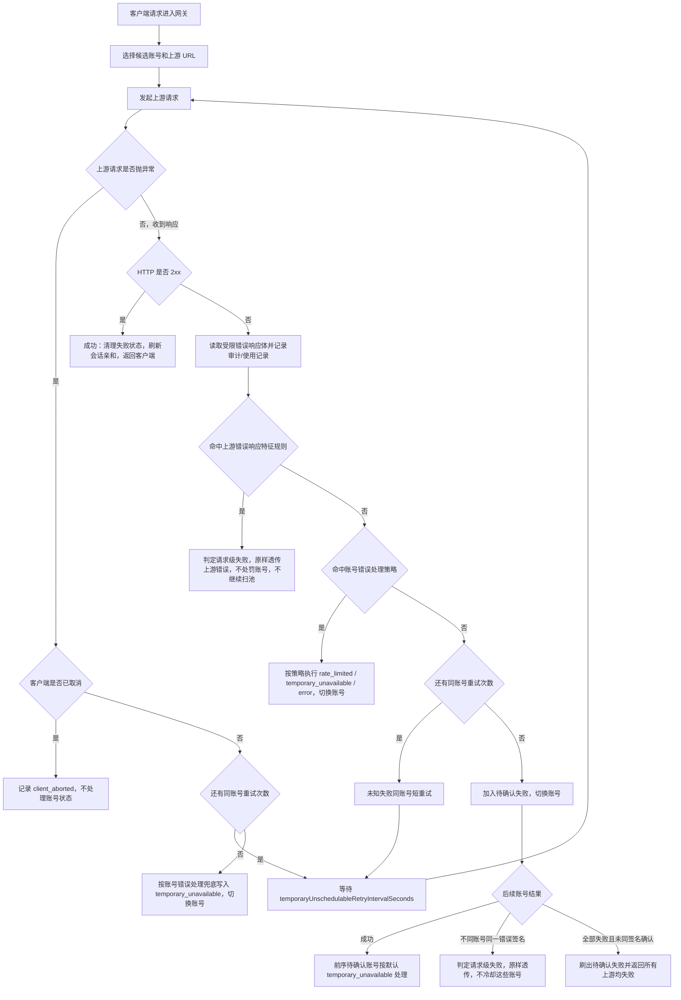
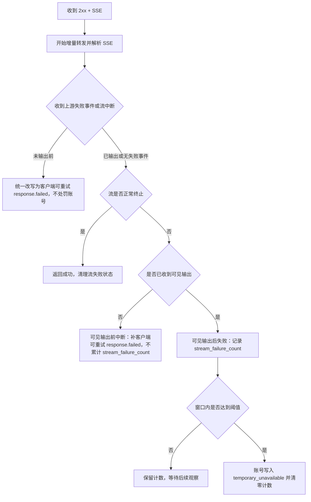

# 网关异常重试与兜底策略

## 目标

本文固定 OpenAI 兼容网关在上游异常、账号错误策略、未知失败和流式中断时的处理顺序，避免后续维护时把“上游错误响应特征规则”“账号错误策略”“兜底重试”“流熔断”重复实现或互相抢逻辑。

核心原则：

- 已知错误交给规则处理：上游错误响应特征规则和账号错误处理策略负责分类。
- 未知失败交给兜底处理：只要上游结果失败且没有命中任何策略，就先按系统短重试配置同账号重试。
- 兜底层不维护状态码白名单：不再用 `>=500`、`408`、`425`、`429` 这类条件决定是否重试。
- 已经向客户端输出可见内容的 SSE 不做透明重试：服务端不能安全重放半段回答或工具参数。

## 关键参数

| 参数 | 默认值 | 用途 |
| --- | --- | --- |
| `temporaryUnschedulableRetryAttempts` | `3` | 未知失败进入账号副作用前，同账号短重试次数 |
| `temporaryUnschedulableRetryIntervalSeconds` | `3` | 同账号短重试间隔 |
| `defaultTemporaryUnschedulableMinutes` | `5` | 默认临时不可调用时长，也是流熔断冷却默认时长 |
| `streamCircuitBreakerEnabled` | `true` | 是否启用流式超时和流失败计数 |
| `streamRequestTimeoutSeconds` | `180` | 流式首段上游内容前的总等待上限 |
| `streamIdleTimeoutSeconds` | `60` | 流式首段后上游空闲或完整 SSE 事件等待上限 |
| `streamFailureThresholdCount` | `3` | 流失败窗口内触发冷却的次数 |
| `streamFailureThresholdWindowMinutes` | `10` | 流失败计数窗口 |

## 普通响应流程

## 普通响应处理顺序

1. **上游请求抛异常**
   - 客户端取消：记录 `client_aborted`，释放资源，不写账号失败状态。
   - 连接失败、超时、unexpected EOF 等请求异常：先按 `temporaryUnschedulableRetryAttempts` 同账号重试。
   - 同账号重试仍失败：调用账号错误处理兜底；没有明确策略时写入 `temporary_unavailable`。

2. **上游返回 HTTP 2xx**
   - 认为本次上游响应成功。
   - 刷新会话亲和。
   - 清理当前账号的流失败计数、最近错误和软失败状态。
   - 如果本请求之前已有待确认失败账号，则这些账号按默认临时不可调用处理。

3. **上游返回 HTTP 非 2xx**
   - 先匹配代码内置的上游错误响应特征规则。
   - 命中特征规则时，说明这是已确认的请求级错误；网关直接把上游状态码、可透传响应头和原始响应体返回客户端，不冷却账号，不继续扫账号。
   - 未命中特征规则时，再匹配账号 `credentials.error_handling_rules` 和 OAuth Codex 429 特判。
   - 命中账号错误策略时，立即按策略处理账号，不进入兜底同账号重试。
   - 上述规则都未命中时，才进入未知失败兜底：只看“失败且还有重试次数”，不再判断状态码白名单。

## 待确认失败

未知非 2xx 失败在同账号重试耗尽后不会立刻写账号状态，而是进入待确认失败列表：

- 后续账号成功：说明前一个账号更可能有短期问题，前序待确认失败账号按 `defaultTemporaryUnschedulableMinutes` 写入临时不可调用。
- 两个不同账号返回同一错误签名：说明更可能是请求本身或上游公共错误，直接把后一个上游错误原样返回客户端，不冷却这些账号。
- 全部账号都失败且没有同签名确认：刷出待确认失败，按默认临时不可调用处理，并返回“所有上游账户均失败”。

错误签名来自上游错误响应体中的 `type`、`code`、`message` 等字段。签名用于判断“多个账号是否遇到同一个请求级错误”，不是账号健康判定本身。

## 流式响应流程

## 流式边界

- `response.created`、`response.in_progress`、metadata、心跳和 header 类事件不算可见输出；即使这些事件已经写给下游，也不作为账号流失败计数依据。
- 文本 delta、reasoning delta、工具调用参数 delta、会改变 assistant 内容或工具状态的 output item 事件算可见输出。
- 可见输出判断必须由同一个公共函数提供，流式拦截和账号流失败副作用不能各自维护一套判断。
- 可见输出前失败可以让客户端自己重试，因此统一写出错误码为 `upstream_retryable_error` 的 `response.failed`，且不累计账号流失败计数；`downstreamBytesWritten` 只用于判断未来是否有机会做服务端透明重试，不用于账号副作用判定。
- 可见输出前失败包含：首段前无数据、首段后上游空闲、长期未形成完整 SSE 事件、上游读取异常 / EOF、缺少 OpenAI 终止事件、上游 `response.failed`、上游通用 `event: error`。普通事件里的顶层 `code/message` 字段不单独视为失败。
- 已经输出后的失败不能由服务端伪造整轮重试；当前只记录流失败计数，达到阈值后临时冷却账号。
- 当前不再维护流式错误码特征白名单；`server_is_overloaded`、`slow_down`、通用 `event: error`、未知 `response.failed` 等都按同一个可见输出边界处理。

## 策略边界

| 场景 | 处理归属 | 是否同账号重试 | 是否写账号状态 |
| --- | --- | --- | --- |
| 已知请求级错误特征 | 上游错误响应特征规则 | 否 | 否 |
| 账号配置规则命中 | 账号错误处理策略 | 否 | 按策略 |
| OAuth Codex 429 可解析 reset | 账号错误处理策略 | 否 | 写 `rate_limited` |
| 未知非 2xx 失败 | 兜底重试 | 是 | 重试耗尽后进入待确认失败 |
| 请求异常、连接失败、超时、EOF | 兜底重试 | 是 | 重试耗尽后默认临时不可调用 |
| 客户端取消 | 客户端生命周期 | 否 | 否 |
| SSE 可见输出前失败 | 流式兜底 | 客户端重试 | 否 |
| SSE 可见输出后失败 | 流熔断 | 否 | 达阈值后临时不可调用 |

## 维护规则

- 新增已知非 2xx 请求级错误时，优先加上游错误响应特征规则或账号错误策略，不要在兜底层增加状态码判断。
- 兜底重试只表达“未知失败先吸收波动”，不能承担错误分类。
- 命中账号错误策略后不能再进入同账号短重试，否则会重复处理。
- 流式可见输出前失败统一走客户端可重试 `response.failed`，不要为缺少终止事件、`event: error`、某个上游错误码分别补偿。
- 流式可见输出后失败统一进入流熔断计数，不再按 `server_is_overloaded` / `slow_down` 等错误码豁免。
- 决定透传给客户端的上游错误必须保留原始状态码、响应头和响应体，不包装成网关自有错误。
- 修改流程后必须补回归，至少覆盖：请求级特征原样返回、未知失败同账号重试、同签名请求级失败、`response.created` 后缺少终止事件不计数、可见输出前通用 `event: error` 改写、可见输出后流失败计数。

## 排障日志

常用日志事件：

- `gateway_upstream_same_account_retry_scheduled`：未知失败未命中策略，准备同账号短重试。
- `gateway_upstream_error_feature_matched`：命中上游错误响应特征规则，按请求级失败透传。
- `gateway_request_failure_signature_confirmed`：多个账号返回同一错误签名，按请求级失败透传。
- `gateway_stream_intercepted`：上游 SSE 失败事件在写给下游前被改写为客户端可重试事件。
- `gateway_stream_failure_account_side_effect_deferred`：流式失败发生在可见输出前，暂不累计账号流失败。
- `gateway_stream_finished_failed` / `gateway_stream_missing_terminal`：流式响应未正常完成。
- `gateway_account_local_suppressed`：账号副作用入队后，本进程短期避让该账号。
