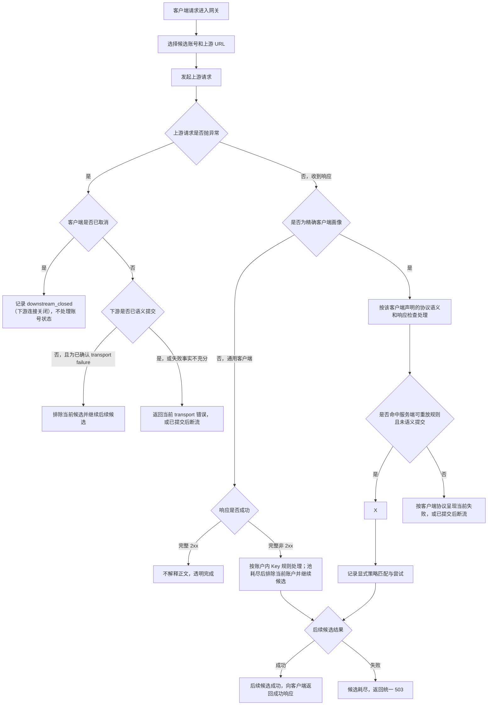
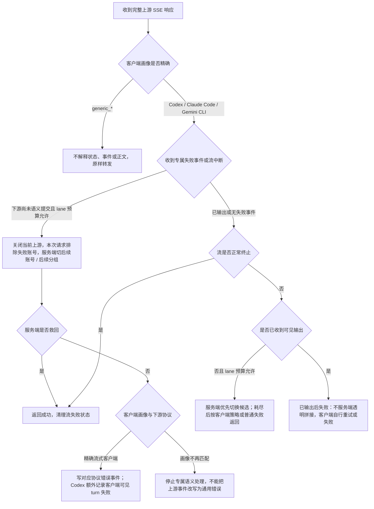
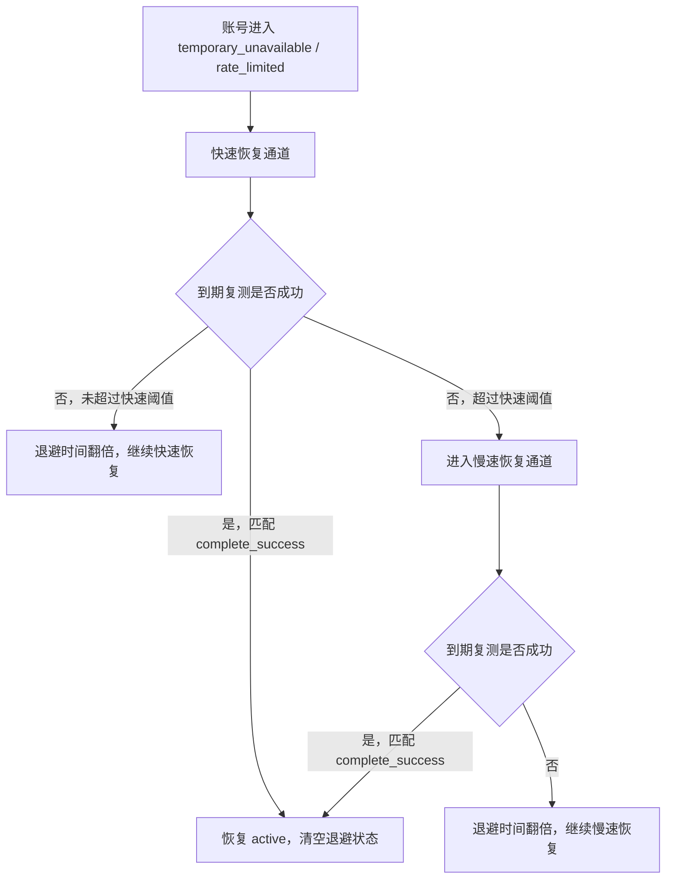

# 网关异常重试与兜底策略

> 账号“锁死”方案已在 [AI 账户锁死调度机制设计与实现前复审](AI账户锁死调度机制设计与实现前复审.md) 中确定并接入。本文的普通候选切换、同账号重试、`speed_first`、熔断、并发和客户端 handoff 仍是现行基线；锁死只在这些边界之上增加切号否决与共享限频，不能改写既有预算或响应语义。

## 目标

本文固定 OpenAI 兼容网关在上游异常、账户错误处理策略、未知失败和流式中断时的处理顺序，避免后续维护时把“账户错误处理策略”“本地失败隔离”“流式失败处理”重复实现或互相抢逻辑。

核心原则：

- 未命中显式策略时，完整 HTTP 业务失败按 `response.ok=false` 排除当前候选并继续 Key/账号/分组调度；只有候选耗尽后才返回网关统一错误。该动作不得建立 API Key / IP / 会话跨请求回避、共享质量失败或 `recovery_wait`，但每个真实请求最多可投递一个按账户限频的固定模型、固定协议健康确认。普通请求不能根据状态码、错误类型或正文直接建立、续期、升级或清理账户业务运行态。
- 兜底层不维护状态码、错误码或错误文案白名单：状态码和上游错误体只作为诊断字段、审计字段和用户显式配置规则的输入，代码不内置“余额不足”“限流”“某状态码才写状态”之类判断。
- 已确认的上游瞬态 transport / HTTP 失败先交给统一失败流水线；文本请求尚未语义提交、墙钟仍有余量且未命中排除条件时，`408/425/429/5xx` 等瞬态结果按当前物理账户最多额外重试两次，然后再继续后备账户 / 分组；其他完整 HTTP 失败先按账户内多 Key 池规则处理，Key 池耗尽后再继续后备账户 / 分组。该预算按账户独立计算，不按客户端、Codex、供应商或会话特殊化，也不把锁死设计混入既有计数。已提交正文中断仍只结束当前响应，不能拼接第二个候选。中间失败不写电路 confirmation、共享质量或 Key/账户状态；独立后台确认仍按其自身边界处理。
- 请求进入上游前发现当前账号目标协议不能保真承载某个合法能力时，只记录账号作用域 guidance 并跳过当前账号；它不是上游失败，不写账号状态，不进入状态码 / 错误码策略，也不能在还有同分组账号或后续可承接分组时直接返回给客户端。
- 通用客户端默认不解析上游错误对象、错误类型、错误码、完成状态和错误正文：完整非 `2xx` 只依据 `response.ok=false` 进入账户内多 Key 隔离；按现有 Key 池规则尝试后续 Key，Key 池耗尽后再排除当前账户并扫描后续账户 / 分组。瞬态 `408/425/429/5xx` 先复用既有同 Key 有界重试。用户显式策略的状态动作与当前请求切号彼此独立，账户错误策略 `retry_next` 仍保留其声明的同账户兄弟 Key 授权。图片、音频、文件、资源创建、后台任务和 hosted tool 不设请求类型例外。精确识别的 Codex、Claude Code、Gemini CLI 客户端只按协议声明的结构返回本次失败。
- 当健康候选和后备分组都不可承接且只剩并发占满、`precheck_pending` 或其他可恢复本地运行态时，按 `runtimeKey + generation` 获取账户租约并限制同分组同时最多一个半开；其他请求进入有上限 FIFO 等待。`noAvailableAccountWaitTimeoutSeconds` 默认 270 秒，只累计“零可派发账号”的等待时间；真实上游 attempt、已有可派发账号的扫描和活跃响应读取不消耗该预算。
- 多 Key API Key 账户的 Key 级隔离不恢复状态码 / 错误码分类：各类请求的 opaque `response.ok=false` 先在本请求排除当前 Key，并按账户内 Key 池规则继续后续 Key；Key 池耗尽后才排除当前账户并继续后续账户。失败 Key 只有在同账户后继 Key 成功确认、独立探针或用户显式 Key 动作满足来源条件时才进入共享状态；跨账户物理凭据去重。完整设计见 [账户内 API Key 故障隔离设计](账户内APIKey故障隔离设计.md)。
- DeepSeek 这类 OpenAI-compatible 第三方也遵守同一错误边界：完整非 `2xx` 不读取 401 / 403 / 402 / 429 / 5xx、余额/限流/模型文案或 `finish_reason = insufficient_system_resource` 来决定内置状态或切号分支，统一按 `response.ok=false` 切换候选。`2xx` payload 保持透明，这些字段只可进入诊断或用户显式策略匹配。需要写 `rate_limited`、`temporary_unavailable` 或 `error` 时，只能由用户显式账户错误策略授权；统一边界见 [AI 账户错误语义与状态变更边界](AI账户错误语义与状态变更边界.md)。
- IP 级账号回避只能消费本地 transport failure 经后续候选成功证明可绕开的调度事实；opaque 完整 HTTP 业务失败、code/type/message 和坏会话结果不得写跨请求 IP 回避。达到阈值后也只在同一模型匹配和账号调度优先级层内后置该账号。
- IP 级错误熔断只依据高置信本地请求错误：认证前缺失 Bearer / 无效 token 探测、本地校验失败在短窗口内重复出现时，才允许短 TTL 本地 `429`；不能把账号池未知失败或容量失败归咎给 IP，也不能按地区、状态码或固定错误码黑名单拦截。
- 上游桶运行态失败只影响候选排序；同 `proxy`、`baseUrl` 或 `provider` 多个账号短窗失败时优先避让该桶账号，但只能在同一模型匹配和账号调度优先级层内后置，不能自动禁用代理、禁用上游或冷却账号。`qualityScore` 只作为排序信号，不作为所有运行态避让的统一硬边界。
- 普通路由 `speed_first` 的 `latency_degraded` 不属于上游失败兜底层的调度降级。只有最终 lane 为可安全重放文本的请求记录软首字样本；同一作用域在 `slowWindowSeconds` 内达到 `slowTriggerCount` 后，请求链路直接建立该短 TTL 覆盖，不等待后台确认。后台恢复探针和真实请求恢复计数只负责清理或维持该状态。图片、音频、文件/资源、后台任务、hosted tool 和其他副作用 lane 不创建该 timer、慢样本或速度切换。普通上游失败不进入速度优先判断，速度模式也不能重置或绕过符合条件的整请求安全原地重试 token。

自动账户 / Key 探针统一使用三态加任务未知：`complete_success` 必须同时满足协议成功和完整 framing，并只按职责及匹配 provenance 激活 / 恢复；`framing_complete_neutral` 表示完整 HTTP/SSE 但协议或业务未成功；`upstream_failure` 仅代表连接失败、硬超时、读取中断或 framing 未完成的 `transport_incomplete`；`probe_task_failure/stale/unknown` 不计数、不改状态。传输电路、账号冷却和 Key 恢复只把 `upstream_failure` 作为负向证据；固定模型、固定协议的激活、周期健康、请求失败二次确认和质量确认还把 `framing_complete_neutral` 作为通用账户可用性失败。用户显式 `temporary_unavailable/rate_limited` 只由 TTL、匹配来源恢复动作或人工恢复清理，普通 / 后台无 provenance 成功不得清理。人工测试和模型检测不参与任何生产状态流转。
- `normalRoutingConfig.firstByteDeadlineMs` 和速度优先 cutover 是配置的路由截止：到期只产生请求级候选推进/慢样本，对账户电路、Key 运行态、共享可靠性与 `recovery_wait` 保持中性。连接失败、读取中断和 `textFirstResponseTimeoutSeconds` 等 lane hard timeout 仍按 transport failure 处理；配置截止主动取消旧 attempt 时不得把取消回写成 hard timeout。
- 下游提交分为 `transportCommitted` 和 `semanticCommitted`：SSE 注释心跳只提交传输，不提交模型语义；纯 transport 失败仍必须返回当前明确错误，不能由服务端隐式救回。真实 JSON、SSE 协议事件或模型输出一旦写出即提交语义，之后不能透明拼接第二个账号。等待心跳后若上游改为非流式响应，网关按客户端能力返回当前失败或断流，不能把 JSON 拼进 SSE。
- 客户端专属行为必须策略分层：Codex 的 Responses 失败事件和 turn 级账号避让、Claude Code 的 Messages 错误事件、Gemini CLI 的 Gemini 错误事件都由客户端策略声明；通用网关层只消费“协议事件 / HTTP 错误 / 断流”能力，不按上游错误内容决定客户端机制。

## 关键参数

| 参数 | 默认值 | 用途 |
| --- | --- | --- |
| `temporaryUnschedulableRetryAttempts` | `2` | 每个物理账户最多两次额外的瞬态失败重试；`0` 关闭该能力，服务端始终硬限制不超过 `2`，耗尽后继续候选切换 |
| `temporaryUnschedulableRetryIntervalSeconds` | `3` | 同账户瞬态重试之间的等待间隔；不改变账户上限，也不授权兄弟 Key 轮换 |
| `defaultTemporaryUnschedulableMinutes` | `2` | 目标语义为临时不可调用最大暂停时间；账号进入恢复流程后从快速恢复通道起步，连续失败后翻倍，慢速恢复通道不超过该上限 |
| 运行态调度降级观察窗口 | `5min` / 最小观察 `60s` | 本地可验证 transport failure 才可首次投递核实；`runtime_degraded` 由后台探针 / 状态评估激活，`latency_degraded` 则由速度优先首字慢样本在窗口内达到 `slowTriggerCount` 后由请求链路激活，并分别按各自恢复出口清理 |
| `recovery_wait` | 原子首次投递 | 本地可验证 transport failure 只首次创建后台核实任务；任务保持账户普通可调度且不展示，后续请求不得合并、续期或改写 |
| `textFirstResponseTimeoutSeconds` | `120` | 文本 lane 上游首响应和非流式首字节等待上限 |
| `textStreamIdleTimeoutSeconds` | `30` | 文本 lane 流式首段后的 raw chunk 停顿上限 |
| `textUncommittedAttemptMaxLifetimeSeconds` | `1800` | 文本 lane 单次尚未提交语义的上游尝试最大寿命；活跃且已提交语义的 SSE 不受该值机械中断 |
| `imageFirstResponseTimeoutSeconds` | `600` | 图像 lane 上游首响应和非流式首字节等待上限 |
| `imageStreamIdleTimeoutSeconds` | `120` | 图像 lane 流式首段后的 raw chunk 停顿上限 |
| `imageUncommittedAttemptMaxLifetimeSeconds` | `3600` | 图像 lane 单次尚未提交语义的上游尝试最大寿命 |
| `imageRequestWallTimeoutSeconds` | `3600` | 图像 lane 的整请求墙钟；不机械中断仍在图片单次时限内的在途 attempt，超时后返回当前错误，不因失败继续后备候选 |
| `noAvailableAccountWaitTimeoutSeconds` | `270` | 仅累计零可派发账号阶段的服务端等待预算；attempt、活跃读取和存在可派发账号的扫描不计入 |
| `streamFailureThresholdCount` | `3` | 历史流失败诊断计数参数；真实网关流式失败不再依赖该阈值决定是否写状态 |
| `streamFailureThresholdWindowMinutes` | `5` | 历史流失败诊断计数窗口参数；真实网关流式失败不再依赖该窗口直接决定是否写状态 |

流式超时检测固定启用，不提供系统设置开关。
| `cooldownAccountRetestMaxBackoffHours` | `12` | 冷却后台复测进入长期不可用阶段的快速恢复窗口；长期阶段固定每 1 小时复测，只有从首次独立 `transport_incomplete` 起满 7 天后的再次独立 transport 失败才转异常 |
| 全池软阻断等待 | FIFO / 单 timer | 健康和后备优先；只剩可恢复本地运行态时同账户、同分组单飞半开，其余请求在无账号等待预算内有界等待；SSE 可发送注释心跳保活 |

## 请求体解析与客户端生命周期错误

- 客户端在请求体上传完成前断开、声明的 `Content-Length` 未完整到达或底层解析器判定 `request.aborted` / `request.size.invalid` 时，返回 OpenAI 兼容 HTTP `408`、错误码 `request_timeout`，归因 `downstream_closed`，提示客户端可按标准重试策略重新发送完整请求。
- 客户端已经完整上传但 JSON 语法非法时保持 HTTP `400` 的本地请求错误语义，不能误报为上传中断或 `408`。
- 这两类错误都发生在有效上游派发前，不执行账户错误策略、响应拦截、账户 Key 轮换、账户运行态、`recovery_wait` 或后台探针副作用。

## 普通响应流程



## 普通响应处理顺序

1. **上游请求抛异常**
   - 下游关闭：记录 `downstream_closed` 和中性触发方元信息，释放资源，不写账号失败状态；不得由 Node close/aborted 事件推断客户端主动取消。
   - 连接/请求 transport failure 是当前 attempt 的明确失败；下游尚未语义提交时排除当前账户并尝试后续候选，不消费整请求共享 token，也不尝试同账户兄弟 Key。已提交后只能结束或断流。
   - 当前失败的审计/使用记录必须保留实际诊断；不投递 `recovery_wait`，也不写电路 confirmation、共享质量、Key/账户状态、IP 避让或代理/上游桶。
   - 请求异常不按错误码分类；最后一次失败的错误摘要只进入诊断和后台核实输入，普通请求不能据此建立账户级运行态。

2. **上游返回响应**
    - 通用客户端默认不解析错误对象、错误码、错误类型、错误文案或完成状态；完整非 `2xx` 统一视为 `response.ok = false`，排除当前账户并继续下一候选。已提交时只能结束或断流。供应商原始错误进入有界审计与诊断，候选耗尽后只返回统一网关错误，不能作为额外系统限制或客户端重试指令。
    - 未配置显式策略时，通用响应不修改账号或 Key 共享状态，但完整非 `2xx` 仍必须排除当前候选并继续切号；不因 `200 + error`、普通事件里的 `data.error`、`418 + JSON` 的具体错误内容或任意错误码自动分类或写入账户状态。
    - 响应检查规则按 `clientProfiles` 精确匹配；系统默认规则既可能覆盖精确客户端画像，也可能覆盖声明允许的 `generic_*` 画像。命中系统默认或显式的 `retry_next_account` / 账户避让规则，并且下游未语义提交、端点允许重放时，才可切换后续账号；账户错误处理里的 `retry_next` 仍只额外授权同账户兄弟 Key。其他显式状态动作只按配置执行，同时不改变统一候选边界。
    - 普通成功不清理或衰减账户级运行态，也不恢复已经持久化的状态。
   - 上游响应体读取前必须先按 `content-encoding` 对 `gzip` / `br` / `deflate` 解码；下游复制响应头时继续过滤 `content-encoding`、`content-length` 和 `transfer-encoding`，避免客户端拿到已解码 body 却再次按压缩格式解码。
   - 各类非流式响应在首字节前仍必须保留当前 attempt；首字节等待超过 lane hard timeout 时，未提交且已确认的 transport / timeout 按统一候选边界继续，已提交或事实不充分时返回当前错误。图片继续使用自己的长时限和相同的未提交边界。
    - 非流式首字节已经写给下游后，如果正文中途异常，网关记录 `upstream_body_interrupted`，忘记会话亲和、在本请求 / 来源范围内回避当前账号并首次投递 `recovery_wait`，然后打断下游连接；这会让客户端在读取 body 时看到网络失败，再由客户端自身重试策略发起新请求。

3. **精确客户端的上游语义失败**
   - 只有 `clientProfile = codex | claude_code | gemini_cli` 才进入该分支；运行时按精确 `clientProfile + downstreamProtocol` 选择允许的语义检查与最终失败格式。
   - 请求下游语义尚未提交时，精确客户端协议失败只有在响应检查规则明确签发可重放授权（系统默认受限规则或显式 `retry_next_account` / 避让动作）时才关闭当前上游并切换候选；否则按客户端协议呈现当前失败。SSE 注释心跳只设置 `transportCommitted`。
   - 语义已经提交后不能透明拼接第二条响应；按客户端能力写协议失败事件或断流，由客户端发起新请求。
   - 账户状态副作用仍只能来自用户显式策略或后台确认，不能从客户端专属语义反推成通用账号健康规则。

4. **HTTP 2xx 内的特殊完成值**
   - OpenAI-compatible Chat Completions 完整响应里的任意 `finish_reason` 都是不透明协议终止值，不属于 HTTP 非 `2xx` 错误，也不由系统判断为正常或异常。
   - DeepSeek 的 `finish_reason = insufficient_system_resource` 只进入原始诊断。未命中用户显式响应检查策略时，即使下游尚未写出，也不得触发服务端重试、切号或失败事件合成。
   - 已经写出可见输出时，仍遵守“已写出后不透明拼接”的边界，只能记录诊断、结束响应或依赖客户端重试。
   - 单次特殊完成值不直接写账号持久状态；未命中用户显式响应策略时也不投递故障核实或改变共享状态，命中显式策略时才按用户配置执行。

4. **后台确认与受控半开**
   - `recovery_wait` 不影响普通选号；独立后台探针形成 `upstream_failure(transport_incomplete)` 后，才按 generation 建立 `precheck_pending` 并软阻断普通新请求。`complete_success` 只按匹配 provenance 恢复，`framing_complete_neutral` 只诊断 / 顺延并最多关闭同来源 transport 怀疑，`probe_task_failure/stale/unknown` 不计数不改状态。
   - 普通存量请求成功不能清理账户级运行态；后台探针、主动健康检查或持有匹配 generation 租约的半开完整成功才能 CAS 清理。
   - 全池软阻断时健康候选和后备分组优先；仍无可承接候选时，同账户和同分组都只允许一个半开，其他请求进入有上限 FIFO。
   - 半开租约使用 `phase + generation + leaseId` CAS，跟随请求生命周期释放；失败、超时和客户端中断只释放租约，不累计后台探针轮次。完整 JSON / SSE 协议成功才算恢复，headers、首字节或部分 token 不算。

## 后台核实、软阻断与恢复等待

本地可验证 transport failure 在当前 attempt 终止；下游尚未语义提交时扫描后续账户候选，已提交后不得拼接第二个响应。不得消费整请求 token 或轮换兄弟 Key。完整 HTTP 与明确协议失败仍可每请求投递一个限频的通用账户健康确认；后续普通请求不得合并失败计数、替换 generation、刷新 TTL 或改变 due 时间。

- `recovery_wait` 保持普通可调度且不展示异常。后台执行器未形成真实上游尝试时结论为未知，不得建立软阻断。
- 首次有效独立后台探针形成 `upstream_failure(transport_incomplete)` 后，standalone memory / performance Redis 都写入 `precheck_pending`；performance 使用 `phase + generation + leaseId` Lua CAS，不能退回空的进程内快照。完整 HTTP/协议结果归 `framing_complete_neutral`，不按状态码/正文进入失败分支。
- `precheck_pending` 从普通候选中软阻断；后台探针、主动健康检查和受控半开保留访问权。后台失败后可继续推进 `runtime_degraded` 或最终持久确认，但普通请求次数不能参与状态升级。
- 当前分组仍有健康候选时直接调度；没有健康候选时先尝试路由策略允许的后备分组。
- 当前分组与后备均只剩软阻断账户时，按 `runtimeKey + generation` 获取账户租约，并按 `systemAccountId + groupId` 限制同分组同时最多一个半开；其余请求按分组、模型和候选 generation 进入有上限 FIFO。
- 协调器使用单 timer、支持 AbortSignal、每次只唤醒一个等待者。`ServerRetryBudget` 只在零可派发账号或并发槽等待期间运行，派发 attempt 前暂停；默认最多累计 270 秒，账号恢复后继续当前连接。
- 半开成功必须是完整 JSON / SSE 协议成功，才能按 generation CAS 清理软阻断；失败、超时或客户端中断只释放匹配租约，不累计后台探针轮次。
- 用户显式账户错误策略或响应拦截策略建立的状态 / TTL 不进入系统自动半开，后台探针成功不能提前解除；只在策略 TTL 到期或人工恢复时清理。

账户探针运行态不写 SQLite：standalone 使用 memory，performance 使用 Redis runtime state；已落库冷却态由 ops-worker 冷却复测恢复。完整状态机见 [AI 账户运行态探针恢复设计](AI账户运行态探针恢复设计.md)。

## IP级账号回避

IP 级账号回避是本地账号屏蔽之外的来源级排序辅助，不是账号健康判断：

- 只有前序账号形成建连失败、lane hard timeout、真实读取中断或未完成 framing 等本地 transport failure 时，才登记当前请求待提交 IP 失败；后续账号形成完整 framing 后，才把该既有 transport 事实确认到 `systemAccountId + apiKeyId + clientIp` 的短 TTL 回避。
- 只有全候选均因 transport failure 耗尽并已经向客户端返回最终失败时，才确认本次已有待回避记录；完整 HTTP、协议失败和坏会话不能因为“最终失败已返回”而补登记。同 IP 同账号需要两次 transport 确认后，第三次请求才开始应用回避。
- `groupId` 不参与 IP 级账号回避键。同一个 API Key 下发生分组切换时，来源对某个账号的短期失败经验应跟随账号和 API Key，不按分组容器重新切碎。
- 回避只影响后续候选账号排序：命中回避的账号排到同一模型匹配和账号调度优先级层后面；如果所有候选账号都被当前 IP 回避，则旁路回避并保留原候选列表，避免把账号池筛空。
- 账户错误处理策略、opaque HTTP/协议失败、路由配置截止、客户端取消、本地校验失败、额度 / 授权 / 模型过滤失败、账号并发满和代理预检跳过，都不能记录 IP 级账号回避；没有后续完整 framing 的全 transport 失败请求只有在最终失败已经返回客户端时才确认既有 pending。
- 当前 IP 后续通过某个账号形成完整 HTTP/SSE framing 时，清理该 IP 对该账号的 transport 回避；这不确认业务成功，也不恢复账户/Key 共享状态。
- IP 级回避状态属于进程内短 TTL 运行态，服务重启或缓存淘汰后可以丢失；丢失后回到普通调度，不写入账号状态，也不作为后台复测对象。

具体设计见 [IP 级账号回避与自动切号设计](IP级账号回避与自动切号设计.md)。

## IP级错误熔断

IP 级错误熔断包含认证前窄作用域入口保护和认证后来源级止损能力，不是账号调度排序能力：

- 认证前作用域只能使用 `clientIp + missing_bearer`、`clientIp + token 指纹` 或“已验证无效 token 后”的喷洒计数；随机无效 token 不能在认证前挡住同 IP 的有效 Bearer。
- 作用域为 `systemAccountId + apiKeyId + clientIp`，缺少认证后 scope 或缺少 `clientIp` 时不启用；`groupId` 不参与错误熔断键，同一 API Key 下不同分组共享来源错误风暴状态。
- 只消费高置信本地请求错误：本地 JSON 解析失败、模型过滤失败和 OAuth/Codex adapter 本地校验失败。上游结果不计入来源错误熔断；opaque HTTP/协议失败与本地 transport failure 不进入来源错误熔断，但网关失败终态可按已解析的 `clientSourceKey` 记录短 TTL 的来源级账号避让，并异步复用共享账户健康探活；transport 电路仍只消费独立的未完成 transport 证据。来源键缺失、invalid 或 conflict 时不写入来源级状态。
- 命中阈值后短 TTL 返回本地 OpenAI-compatible `429`，不进入账号候选排序和上游调度。
- 账户错误处理策略命中、未知账号池失败、代理失败、账号并发满、分组队列满、单 IP 并发满、客户端取消和流式已输出后失败，默认不计入来源错误熔断。
- 成功请求或 TTL 到期后应恢复当前来源；连续触发可以短期退避，但必须有最大上限。
- 错误熔断状态属于进程内易失运行态，不持久化为 IP 黑名单，不写账号冷却，也不作为后台复测对象。
- 禁止区域性封禁和固定状态码 / 错误码黑名单。

具体设计见 [IP 级错误熔断与恶意请求保护设计](IP级错误熔断与恶意请求保护设计.md)。

## 流式响应流程



## 流式边界

- `response.created`、`response.in_progress`、metadata、心跳和 header 类事件不算可见输出；即使这些事件已经写给下游，也不作为账号流失败计数依据。
- 文本 delta、reasoning delta、工具调用参数 delta、会改变 assistant 内容或工具状态的 output item 事件算可见输出。
- 可见输出判断必须由同一个公共函数提供，响应语义检查和账号流失败副作用不能各自维护一套判断。
- 当前运行时只对精确命中的 Codex Responses、Claude Code Messages 和 Gemini CLI 流加载系统默认响应语义规则。系统默认规则只决定本次请求的重试和客户端错误呈现，不写账户运行态；`generic_*` 默认不解释事件类型或正文，所有端点的完整非 `2xx` 仅按 `response.ok` 有界切换候选，但账户或管理端显式创建的响应拦截策略仍可处理其声明范围内的响应。
   - 精确客户端的可见输出前失败可以包含缺少协议终止事件、专属 `response.failed` 或 SSE 事件名 `event: error` 等已定义结构；普通事件的 `data` JSON 仅带 `data.error`、`metadata.error`、`code` 或 `message` 不构成失败结构。持续有 raw chunk 但暂未形成完整 SSE 事件只记录诊断并继续读取。通用客户端不解释这些事件，只有尚未形成完整上游响应的连接失败、超时或读取中断属于 transport 边界。
- 精确客户端的最终错误只暴露对应协议定义的稳定可重试语义；底层错误细节只进入审计和账号诊断。通用客户端不能基于未知错误内容决定重试，只能依据 `response.ok`、transport 和写出边界做内容无关的有界接管。
- 是否还能由服务端切换候选同时取决于真实派发状态、下游写出边界、对应 lane 墙钟和 attempt 预算，不按上游错误内容或请求类型设置例外。同批次输出与失败仍处于预提交缓冲、下游实际语义写出为零时，各类请求都可以继续切号；一旦已有真实协议内容写给下游，就不静默拼接第二条流，按客户端策略写协议失败事件或断开连接。
- 当前不维护全局流式错误码或终止类型白名单。系统默认的 `response.failed`、`event: error`、完成状态和正文规则必须属于明确 `clientProfile` 的协议策略，通用客户端不得继承；账户或管理端显式策略除外。精确客户端只有在仍有可承接账号 / 分组且满足写出与对应 lane 预算边界时，才优先由服务端救回。
- 中转广告、污染文本和协议内 `200 + SSE` / `200 + JSON` 失败在精确客户端画像或显式管理策略下进入响应语义检查；`generic_*` 没有显式策略时跳过该管线并原样转发。响应检查只处理完整响应语义帧边界内的策略命中、写下游前服务端重试、显式状态动作和审计 metadata，不能绕过下游写出边界。

## 客户端策略边界

新增或调整流式失败处理时，先解析三个独立维度。客户端协议错误事件只能由精确 `clientProfile + downstreamProtocol` 组合触发；Codex turn 级切号只能由 `clientProfile = codex` 触发，不能回退成通用 OpenAI 行为。

| 维度 | 示例 | 用途 |
| --- | --- | --- |
| `upstreamAdapter` | `openai_api_key`、`openai_oauth_codex` | 决定如何请求上游账号、如何归一化 body/header |
| `downstreamProtocol` | `responses_sse`、`chat_completions_sse`、`messages_sse`、`gemini_stream_generate_content_sse`、`json` | 决定最终失败能否写协议错误事件；各协议事件格式必须由对应 clientProfile 明确声明 |
| `clientProfile` | `codex`、`claude_code`、`gemini_cli`、`generic_*` | 决定客户端重试信号使用协议事件、HTTP 错误还是断流；只有 Codex 启用 turn 级策略 |
| `requestClientCompatibility` | `codex_responses`、`openai_standard`、`anthropic_native`、`claude_code` | 决定当前请求需要哪种客户端兼容能力；候选账号筛选和上游请求准备都使用它 |

Codex turn 专属策略只允许在 `clientProfile = codex` 且请求能从普通 JSON 对象格式的 `x-codex-turn-metadata.turn_id` 精确解析出非空值时触发。`turnId`、URL 编码 JSON、数组 JSON、`session_id`、`conversation_id`、`prompt_cache_key`、`previous_response_id`、`x-client-request-id`、User-Agent、IP 或 body hash 都不能单独把请求升级为 Codex。识别不到 Codex 时不做 Codex turn 级账号避让，但仍执行通用账号扫描和客户端重试协调。

系统默认响应检查按规则中的 `clientProfiles` 精确匹配，既包含部分精确识别的 Codex、Claude Code、Gemini CLI 画像，也包含明确列出的 `generic_*` 画像；账户所有者或管理员显式创建的策略同样可作用于通用推理端点。策略必须由错误码、错误类型、错误文案、完成状态、JSON 路径、SSE 原文或输出文本等响应语义触发。命中 `retry_next_account` / 账户避让动作且满足未语义提交和端点重放门禁时，才允许服务端切换后续账号；账户错误处理里的 `retry_next` 仍只额外授权同账户兄弟 Key。最终失败是否使用协议事件由精确 `clientProfile + downstreamProtocol` 控制；通用客户端未命中适用策略时不会因上游正文语义被改写。

`response.incomplete` 在 Codex 客户端中会被解析为流式失败终态。网关只在该事件命中允许服务端重放的响应检查规则（例如用户显式 `retry_next_account`，且下游尚未语义提交、对应 lane 预算允许）时重放；未命中规则时按 Codex 协议呈现当前失败，不自动切换候选。

来源级候选避让统一以 `clientSourceKey` 为根键；不同供应商只注册自己已验证的来源 resolver，不重复实现 HMAC、IP 降级、冲突处理或隔离规则。官方会话可以生成 `official_session`，Gemini 已存在 interaction 资源可以生成 `protocol_resource`，只有完全缺失细粒度证据时才可使用短 TTL `ip_api_key_fallback`。`invalid` / `conflict` 不得降级写入 IP 桶；这些来源都不是账户状态、传输熔断或用户身份认证。

Codex turn 级重试状态键为公共来源作用域的子键：

```text
clientSourceKey + endpoint + downstreamProtocol + codex.turn_id
```

该键用于同一 API Key 边界内的同一 Codex turn，不代表真实自然人用户身份。路由和分组不参与，以便同一来源发生路由切换时保留短期失败经验；会话亲和仍按路由/分组隔离。`rawBodyHash`、metadata 的 `session_id/thread_id`、User-Agent、request ID 都不参与。Codex turn 级避让只允许在这个 turn 范围内避让已发生客户端可见失败的账号；不能写全局账号冷却，不能迁移到其他客户端，不能影响其他普通请求。

来源级状态不在正式请求热路径执行真实探针，也不同步等待探活结果。首次达到阈值后只异步投递共享的后台健康任务；同一账户 runtime/config generation 的并发来源 join 同一 owner，不能形成探活风暴。control 拒绝、control 网络失败或 worker 未能入队时，必须按对应 fence 结算 `unknown`，不能留下无 owner 的 `dispatchPending`；来源避让保留至后续独立证据或 TTL。探活成功仅精确清理匹配来源 fence；unknown、任务失败和中性 framing 保留短避让，确认 health failure 才进入既有账户健康状态机。当前请求重放须由账户错误策略 `retry_next`、响应检查系统默认 / 显式 `retry_next_account` 或其他已声明的重放规则分别授权；后续由客户端主动发起的新请求再按当时配置独立选路。

## 策略边界

| 场景 | 处理归属 | 是否同账号重试 | 是否写账号状态 |
| --- | --- | --- | --- |
| 当前账号目标协议不支持请求中的合法能力 | 协议桥接 guidance + 调度救回 | 否，跳过当前账号并尝试同分组后续账号 / 后续可承接分组；全部候选耗尽后才返回协议内 guidance | 否；不写账号状态、不本地屏蔽、不进入账户错误处理策略 |
| 账户错误处理策略命中 | 账户级错误处理策略 | 按用户配置 | 用户显式管理意图直接执行；状态和 TTL 不等待系统自动探针二次确认 |
| 账户错误处理策略精确命中任一动作 | 用户显式策略 | 先执行配置的状态动作，再按统一路径切后续账号；同账户 Key 是否继续由既有 Key 池规则决定，`retry_next` 额外表达其声明的兄弟 Key 行为 | 用户动作不改变账户级切号准入 |
| 任意请求完整非 `2xx` 且未命中显式策略 | 当前 attempt 终态 | 先按账户内 Key 隔离规则继续后续 Key；Key 池耗尽后排除当前账户并继续后续账号 / 分组；候选耗尽后保留原状态、错误码和错误摘要返回 | 不写共享 Key/IP/质量/账户状态；失败 Key 只有在既有确认来源满足时才进入共享状态；若来源键有效，异步记录来源级短 TTL 避让并最多复用一个账户健康确认 |
| 可重放文本主派发已开始、响应头前 transport failure | 当前 attempt 终态 | 下游未语义提交且失败事实已确认时排除当前候选并继续；已提交或事实不充分时返回明确 transport 错误 | 可按有效来源键记录来源级短 TTL 避让；账户健康与 transport 电路仍只由独立探活 / 独立 transport 证据结算，不在请求回调直接写共享账户状态 |
| 完整 HTTP、正文中断、配置首字截止、未派发本地异常或非文本请求异常 | 当前 attempt 终态与各自诊断边界 | 按具体分支处理；未提交、端点允许且失败事实已确认时继续候选，已提交或不可安全重放时终止当前响应 | 未命中用户显式策略时不写业务语义状态 |
| 前序本地 transport failure | 当前 attempt 终态 | 下游未提交且失败事实已确认时继续后续候选；已提交时返回明确 transport 错误或断流 | 只记录当前失败和独立诊断；不把该失败直接写成持久账户业务状态 |
| 当前分组存在运行态降级账号 | 调度降级排序 | 否，只影响候选排序 | 经最小观察时间、无成功证据和后台探针确认后才激活；有同优先级普通候选时降级账号排后；全降级时先尝试后续分组，无后续分组时兜底尝试；不写账号状态 |
| 普通路由速度优先请求超过首字观察阈值但尚未达到慢样本触发条件 | 普通路由速度优先软观察 | 否，继续等待当前上游 | 只记录慢样本和审计；不切号、不写账号状态、不进入通用失败重试 |
| 普通路由速度优先已确认慢且下游未写出 | 普通路由速度优先确认慢后切号 | 否，本次请求排除当前账号并尝试同分组未降级且硬可承接候选；确认慢期间可临时覆盖账户超级优先、账号优先级、备用层和会话亲和 | 只写 `latency_degraded` 短 TTL 调度态；不写账号持久状态；恢复清理后回到账户配置排序 |
| 普通路由配置首字截止到期 | 中性路由调度事件 | 按成本/速度偏好决定继续等待或安全切号 | 不报 transport failure，不推进 `SUSPECT/OPEN`、Key 失败、共享质量或恢复任务 |
| lane hard timeout、建连失败、读取中断 | transport failure | 未提交时切后续候选；已提交时返回当前 timeout / transport 错误 | 可以进入独立传输诊断；不得按状态码/正文写业务死亡状态 |
| 可安全重放的文本推理请求超过速度优先软首字阈值 | 普通路由速度优先软观察 | 否，单次超阈值只记录慢样本；必须连续确认慢且下游未写出才允许安全切号 | 图片、音频、文件/资源、后台任务、hosted tool 和其他副作用 lane 不创建该 timer、慢样本、`latency_degraded` 或速度 cutover；这些请求仍执行各自 lane hard timeout 与协议检查 |
| 当前候选发生 transport / timeout，未命中精确策略 | 网关当前错误终态 | 下游未提交且失败事实已确认时排除当前候选并继续；已提交或事实不充分时返回 HTTP `502/504` 或断流 | 普通请求可投递独立核实；不按错误正文推断业务状态 |
| 精确客户端请求发生 transport / timeout 或专属协议失败 | 客户端协议当前错误终态 | transport 未提交失败按统一候选边界继续；专属协议失败仅在系统默认或显式响应检查规则签发可重放授权时切换，否则按 Codex / Claude Code / Gemini CLI 协议呈现当前失败 | transport 与专属语义不混用；账户错误策略 `retry_next` 仍只处理同账户兄弟 Key |
| 所有候选都为 `precheck_pending` 或并发占满 | 后台软阻断保护 | 健康 / 后备优先；同账户和同分组单飞半开，其余 FIFO 等待 | 不新增持久状态；只累计最多 270 秒零可派发账号等待预算 |
| 后台探针持续确认不可用 | 账号事前确认入口 | 否，交给事前确认探针 | 满足观察轮次且并发归零后写 `temporary_unavailable` |
| 同上游桶多账号短窗 transport failure | 上游桶运行态避让 | 否，影响后续候选排序 | 只有本地 transport failure 可形成桶证据和传输核实；opaque HTTP 仅可另投递通用账户健康确认；同优先级层内避让同桶账号，不禁用代理或上游 |
| 同账号多来源 transport 失败且独立事前确认连续失败 | 账号事前确认 | 否，探针独立执行 | 当前账号并发归零后才允许写传输来源的受控状态；原因使用本地有界 failure class，不使用上游 `HTTP/code/message` 推断 |
| 同一认证后来源高置信本地请求错误过多 | IP 级错误熔断 | 否，直接本地短路 | 不写账号状态；当前来源短 TTL 返回 429 |
| 客户端取消 | 客户端生命周期 | 否 | 否 |
| 精确客户端 SSE 可见输出前发生专属语义失败，且规则签发可重放授权 | 服务端内部重试 | 本次请求切后续账号 / 后续分组，客户端无感；未签发授权时返回协议失败 | 当前请求排除失败账号；真实网关流量不因无可见输出直接累计账号流失败计数 |
| SSE 可见输出前失败，服务端账号耗尽且精确命中已知客户端策略 | 客户端协议最终兜底 | Codex / Claude Code / Gemini CLI 分别下发协议错误事件；Codex 可见失败才记录 turn 状态 | 不因无可见输出直接累计账号流失败计数；持久状态等待确认阶段 |
| `generic_*` 收到完整 SSE 响应，其中包含上游失败事件或非标准终止 | 通用透明转发 | 不按事件语义切号或改写；保持上游状态、响应头和正文 | 不启用专属 turn 状态，不按未知上游语义写账号状态 |
| SSE 可见输出后失败 | 客户端重试 + 通用上游失败处理 | 已写给下游后不服务端静默拼接；已知客户端写协议错误事件，通用客户端断流 | 只有真实读取中断/EOF 等本地 transport 事实才记录 transport 桶；协议/业务失败不避让同桶账号，但可投递通用账户健康确认 |

## 冷却与限流恢复通道

目标设计把系统自动 transport 冷却态和用户显式 `temporary_unavailable / rate_limited` 的恢复拆成两段：快速恢复通道和慢速恢复通道。该机制不依赖具体状态码或错误码判断账号是否还能恢复；系统自动持久状态只接受匹配来源的 `complete_success`，`framing_complete_neutral`、任务失败和 unknown 只诊断 / 顺延，显式状态只按 TTL、匹配恢复动作或人工动作清理。手动账号测试只返回诊断，不替代来源匹配的恢复证据。



- 账号刚被写入 `temporary_unavailable` 或 `rate_limited` 时进入快速恢复通道，起始退避固定为 3 秒，后续失败按 `3s -> 6s -> 12s -> 24s -> ...` 翻倍。
- 快速恢复通道用于吸收短暂波动，不把每次失败都当成异常信号；到期复测形成匹配来源的 `complete_success` 时立即恢复系统自动状态，不等待原来的固定分钟级冷却；完整业务失败只证明 framing 完成，不能恢复持久业务状态。
- 当退避时间超过快速通道阈值后，账号自然退化到慢速恢复通道。快速通道阈值作为代码内固定策略即可，先不暴露成系统配置。
- 慢速恢复通道继续按失败次数翻倍，但下一次 `cooldown_until` 不能超过 `defaultTemporaryUnschedulableMinutes` 表达的最大暂停时间。
- 账号进入系统自动 transport 冷却态时记录本轮恢复观察起点；慢速恢复持续出现独立 `transport_incomplete` 时才延长退避并增加连续失败次数。完整 framing 中性只记录最近 HTTP / 错误诊断并有界顺延，任务失败 / stale / unknown 不计数；所有诊断字段只供账户页和日志排查。
- 匹配来源的 `complete_success`、人工恢复、更新凭据后经来源校验的恢复、停用或到期时，必须清空恢复通道状态、退避计数、当前退避时长和最近复测信息。
- `error`、`disabled` 等硬状态不进入该恢复通道；只有用户手动停用或明确硬异常才需要人工恢复。

## 恢复通道日志去噪

- 快速恢复通道是预期内的抖动吸收流程，中间失败不得逐次写 `warn` 常规日志，避免 3 秒、6 秒、12 秒这类高频复测放大运行日志。
- 快速恢复通道优先记录关键状态变化：快速恢复成功、快速通道退化为慢速通道。中间失败只更新账号字段、使用记录来源和运行态指标。
- 后台恢复探活写入使用记录时必须标记 `traffic_source = cooldown_retest`，不参与业务用量统计或账户质量统计；统计 worker 可以推进安全游标确认这类明细，但不能写入业务聚合窗口。手动账号测试标记 `manual_account_test`，真实客户端请求标记 `gateway`。
- 恢复探活审计日志标记同一 `traffic_source`，并使用元信息捕获模式：保留 trace、账号、分组、状态码、尝试摘要和错误摘要，不保存完整请求 / 响应 payload。
- 恢复探活写回账号 `last_error_code/last_error_message` 时必须使用本次上游真实错误摘要，不能使用网关最终兜底的“没有可用上游账户 / 503”覆盖账号原因。
- 事前确认探针只有连续独立 `transport_incomplete` 并满足来源、轮次、时间与并发约束时才可最终写入 transport 来源的 `temporary_unavailable`；摘要只能使用本地传输事实。给调用方看的兜底 `service_unavailable` 和给授权用户看的脱敏测试文案只属于展示层，不能覆盖账号最近错误。
- 使用记录和审计日志列表必须支持按来源筛选，排障时可以只看真实网关请求、手动账号测试或恢复探活。
- 同一账号、同一恢复阶段、同一错误摘要的复测失败日志需要节流；快速通道失败落到 `debug` 级别，进入慢速通道时再输出结构化告警。
- 慢速恢复通道频率较低，可以记录持续失败摘要，但日志只包含账号 ID、阶段、连续失败次数、当前退避、下次复测时间和短错误摘要，不写完整请求 / 响应 payload。
- 转为异常时输出明确告警日志，说明账号已退出自动恢复通道，并带上最终失败次数、最后错误摘要和最后复测时间。

## 维护规则

- 新增已知上游账号问题时，优先加账户级错误处理策略；不要在兜底层增加状态码、错误码或错误文案判断。
- opaque 完整 HTTP 失败隔离只作用于当前请求；不能建立 API Key / IP / 会话跨请求回避、账户级短暂避让，也不能承担错误分类。transport 局部保护必须与 opaque 业务失败分开。
- IP 级账号回避不能维护状态码白名单或黑名单；只能消费已经登记的本地 transport failure，并由后续完整 framing 或全 transport 耗尽最终返回确认。后续成功/最终失败不能把 opaque HTTP、协议失败或坏会话补登记成 transport；达到阈值后也只能在同模型匹配和账号调度优先级层内后置。
- IP 级错误熔断不能维护状态码白名单或黑名单；只能消费高置信本地请求错误，且不能把账号级失败、容量失败或上游公共故障计入来源处罚。
- 普通 opaque 上游失败不能走请求级错误缓存短路；客户端重试是新请求，重新按当前优先级、质量、速度、可用状态与轮换游标选号，不继承上次请求的排除集合。只有 transport failure 才允许首次后台核实。
- 上游桶运行态失败只影响候选排序；账户级 `runtime_degraded` 只能由后台探针激活。两者都不能跨模型匹配和账号调度优先级层提低层账号，也不能禁用代理、上游或账号。普通路由 `speed_first` 的 `latency_degraded` 在同一作用域的首字慢样本于窗口内达到 `slowTriggerCount` 后由请求链路直接建立，作为路由速度目标覆盖层，但仍不能跨分组、能力、授权、状态、额度、并发和写出安全窗口等硬约束。
- 普通路由 `speed_first` 恢复出口必须闭环：后台探针清理 `latency_degraded` 后，后续请求按超级优先、账号优先级、备用层、会话亲和和质量排序回归，不能让速度切号命中的替补账号形成长期强亲和。
- 单个客户端 IP 的连续失败不能直接制造额外账号状态；实际命中上游账号后的错误也只能首次投递后台核实，持久状态仍需独立后台确认失败后写入。
- 命中账户错误处理策略或响应拦截策略时按用户配置直接执行状态动作；状态动作完成后当前请求仍按统一候选规则切号，账户内 Key 隔离规则和账户错误 `retry_next` 分别决定同账户 Key 轮换，并且仍受语义提交、墙钟、候选去重和 attempt 预算约束。未命中的完整 HTTP 也必须先按账户内 Key 规则处理，Key 池耗尽后排除当前候选并继续调度。
- 对精确客户端，当前失败按其协议呈现；`response.failed` 事件格式只用于 Codex Responses，Claude Code 和 Gemini CLI 使用各自协议事件。客户端是否重试由客户端决定，新的请求重新选路；通用客户端收到当前 HTTP `4xx/5xx` 或 transport `502/504`。
- 不维护上游终止类错误码白名单，也不维护隐式重试白名单。上游状态、错误码、错误类型和错误文案只能用于精确匹配用户配置的状态策略；候选切换统一依据完整上游 `response.ok=false`，不由内置状态码或错误文案分支决定。
- 流式失败不再依赖错误码或阈值直接写账号状态；上游桶运行态和已激活的账号运行态调度降级只作为后续排序辅助，持久状态仍等待确认失败。
- 未命中显式策略时，完整非 `2xx` 请求必须扫描后续候选以避免把当前账户错误暴露给客户端；图片和其他可能产生副作用的请求只在下游尚未语义提交时按统一候选边界继续，不能拼接已提交结果。
- 修改流程后必须补回归，至少覆盖：未命中策略的完整非 `2xx` 排除当前候选并切后备账户；显式 `rate_limited`、`temp_unschedulable`、`error_disabled` 写状态后仍切后备账户且不轮换同账户兄弟 Key；未知 transport、timeout 和正文中断的既有边界；客户端新请求按当前策略重新选号；普通失败不改账户运行态；`2xx` JSON / SSE 的协议校验边界；可见输出后不服务端静默拼接。

## 排障日志

常用日志事件：

- `gateway_upstream_response_failed`：精确客户端语义路径识别到上游非成功响应，当前尝试失败；`generic_*` 不触发该语义事件。
- `gateway_upstream_request_failed`：上游请求阶段异常，当前尝试失败。
- `gateway_account_recovery_wait_scheduled`：本地可验证 transport failure 首次投递后台核实，账户仍保持普通可调度；完整 HTTP/协议失败不得记录此事件。
- `gateway_account_runtime_degradation_observed`：当前账号出现失败观察，尚未达到后台探针确认的调度降级门槛。
- `gateway_account_runtime_degraded`：当前账号经时间窗口和后台探针确认后进入运行态调度降级，仅在普通候选不足时兜底尝试。
- `gateway_runtime_degradation_order_applied` / `gateway_runtime_degradation_fallback_only`：候选列表已应用调度降级排序，或当前号池全部候选都处于调度降级并准备尝试后备号池。
- `gateway_account_precheck_soft_blocked`：有效后台失败建立的 `precheck_pending` 已过滤普通候选。
- `gateway_recoverable_unavailable_wait_scheduled`：全池软阻断时当前请求已进入 FIFO 有界等待。
- `gateway_upstream_failure_bucket_opened` / `gateway_upstream_bucket_health_avoidance_applied`：多个账号的本地 transport failure 打开上游桶运行态或将其应用到候选排序；状态码/正文/协议字段不得进入桶证据。
- `record_account_stream_failure`：历史流失败诊断计数写入；不再触发账号冷却或异常状态。
- `gateway_client_ip_account_avoidance_applied`：候选列表已应用当前客户端 IP 的账号回避排序。
- `gateway_client_ip_account_failure_confirmed`：后续账号形成完整 framing，或全 transport 候选耗尽并返回最终失败后，前序已登记的 transport failure 被提交为当前 IP 短期回避观察；其他失败类别不得记录。
- `gateway_client_ip_error_circuit_sample_recorded`：当前认证后来源记录了一次高置信错误样本。
- `gateway_client_ip_error_circuit_opened`：当前认证后来源进入短 TTL 错误熔断。
- `gateway_client_ip_error_circuit_blocked`：当前请求因来源错误熔断被本地 429 短路。
- `pre_commit_stream_server_retry` / `stream_server_retry_dispatch`：命中系统默认或显式响应检查重放规则的 SSE 失败，在下游未语义提交前进入服务端重放；账户错误策略 `retry_next` 仍只授权同账户兄弟 Key，未命中任何适用规则时不记录服务端重放事件。
- `stream_server_retry_exhausted`：显式策略授权的重放失败，准备按客户端能力写当前最终失败。
- `gateway_stream_finished_failed` / `gateway_stream_missing_terminal`：流式响应未正常完成。
- `gateway_account_half_open_lease_acquired` / `gateway_account_half_open_lease_released`：匹配 generation 的受控半开租约生命周期。
