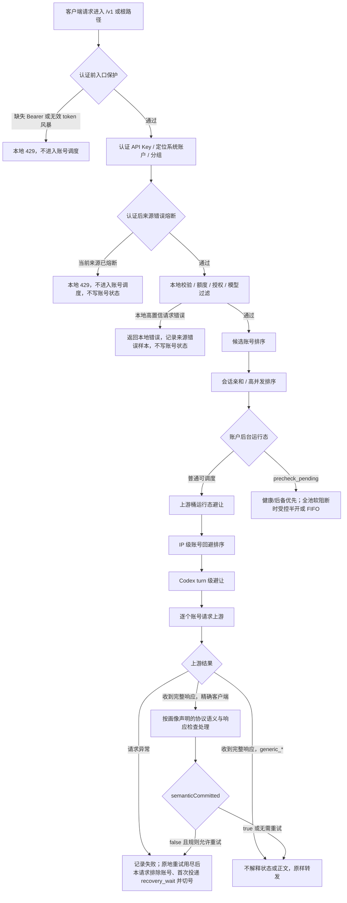

# 网关错误处理完整链路

## 文档目标

本文作为 OpenAI 兼容网关错误处理的排障总入口，回答四个问题：

- 哪些客户端允许解释 `200` 响应里的协议语义，哪些客户端必须透明转发。
- transport / timeout、非 `2xx` 完整响应和请求异常分别如何处理。
- 如何保证 `invalid_request_error`、`rate_limit_exceeded`、库存不足、代理波动等场景不靠固定错误码分支处理。
- 多 IP、共享 API Key、高并发和恶意错误请求下，哪些机制只影响来源，何时由后台探针进入账户级软阻断，哪些机制确认后才写持久账号状态。

更细的专题设计继续看：

- [网关异常重试与兜底策略](网关异常重试与兜底策略.md)
- [IP 级账号回避与自动切号设计](IP级账号回避与自动切号设计.md)
- [IP 级错误熔断与恶意请求保护设计](IP级错误熔断与恶意请求保护设计.md)
- [高并发分组调度设计](高并发分组调度设计.md)
- [账户内 API Key 故障隔离设计](账户内APIKey故障隔离设计.md)
- [流式中断与客户端重试调研](流式中断与客户端重试调研.md)
- [原始审计日志设计](原始审计日志设计.md)

## 一句话原则

真实网关流量里的 transport / timeout 失败先救当前请求，后由独立后台探针确认账号健康。单个请求按 `temporaryUnschedulableRetryAttempts` 建立共享确认预算；预算不按账号、后备分组或 compact 预处理重置。通用客户端一旦收到完整上游响应，就原样转发状态、响应头和正文，不再按状态、错误对象、错误类型、错误码、完成状态或文案继续派发。只有精确识别的 Codex、Claude Code、Gemini CLI 客户端才允许进入各自声明的协议语义和响应检查路径。

本地 transport / timeout / capacity 耗尽后的客户端最终失败同样不按上游错误内容分类。Codex Responses、Claude Code Messages 和 Gemini CLI stream 使用客户端已确认支持的协议错误事件；通用客户端在传输未提交时收到协议原生 HTTP 错误，已经提交 SSE 传输时由网关中断连接。普通路由快速模式只处理文本 lane 首字延迟，图像 lane 不参与。

允许投递后台核实的通用上游失败包括：

- 上游请求异常、连接失败、超时、EOF。
- 非流式 `2xx` 已经输出后正文中断。
- 精确客户端画像下判定的协议失败、缺少终止事件或流中断。

通用客户端的完整非 `2xx`、`200 + error`、SSE 失败事件或异常完成状态不属于网关失败事实，不投递账号副作用。

系统自动写持久账号状态只允许发生在后台确认阶段：

- 未命中用户显式策略时，普通失败只首次创建 `recovery_wait`；独立后台探针真实失败后才建立 `precheck_pending`，最终满足观察轮次且当前账号并发归零后，系统自动路径才写 `temporary_unavailable`。
- 账户所有者显式配置的账户错误策略和响应拦截策略属于主动管理意图，实际命中后按配置直接执行状态或 TTL 动作，不等待系统自动探针二次确认。
- 后台冷却复测、周期检查和管理员显式状态操作可以写持久状态，因为它们属于系统确认或明确运维操作。人工单账户测试只提供诊断，无论成功或失败都不写持久状态、冷却、健康事实或调度运行态；账户页面不提供多账户批量测试。
- 后台探针、主动健康检查或持有匹配 generation 租约的半开完整成功时，才能 CAS 清理账户级软阻断；普通存量请求成功不能清理账户级运行态，也不能恢复持久状态。

不写账号状态的路径包括：

- 未进入上游账号调度的本地错误，例如本地 JSON 非法、API Key 不可用、授权不可用、模型过滤失败、分组队列满或单 IP 并发满。
- 客户端主动断开、慢客户端背压。
- 单纯的 IP 级错误熔断、IP 级账号回避、上游桶运行态避让；这些只影响来源或候选排序，不凭空制造额外账号状态。排序型避让只能在同一模型匹配和账号调度优先级层内后置，不能把低模型匹配等级、低优先级、备用或非超级优先账号提前到更高优先级层前面。`qualityScore` 只作为排序信号，不作为所有异常避让的统一硬边界。普通路由 `speed_first` 的 `latency_degraded` 属于路由策略目标对账户偏好的短 TTL 覆盖，不归入这类来源或故障排序型避让；它仍不能越过分组、模型 / 协议能力、授权、状态、额度、并发和写出安全窗口等硬约束。

使用记录可以保留所有排障事实，但账号质量和后台频繁失败预检只接收“账号调用链路”失败。`usage_records.failure_attribution` 用于区分 `account_upstream`、`account_dependency`、`gateway_capacity`、`gateway_policy` 和 `client_lifecycle`；账号并发满、分组队列满、单 IP 并发满、网关本地策略拦截和客户端生命周期失败仍可进入使用记录 / 错误统计，但不能进入 `account_quality_minute_stats`，也不能因此把 AI 账户标为近期质量频繁失败。

## 总流程



## 请求体解析错误

- 客户端在上传完成前断开、声明的 `Content-Length` 未完整到达，或底层解析器报告 `request.aborted` / `request.size.invalid` 时，网关返回 OpenAI 兼容 HTTP `408`、错误码 `request_timeout`，归因 `client_lifecycle`，允许客户端按标准重试策略重新发送完整请求。
- 客户端已经完整上传但 JSON 语法非法时保持 HTTP `400` 本地请求错误，不得统一改写成“网关请求体无效”或 `408`。
- 两类错误均发生在有效上游派发前，不执行账户错误策略、响应拦截、账户内 Key 轮换、账户运行态、`recovery_wait` 或后台探针副作用。

## HTTP 200 里哪些算错误

### 非流式 2xx

通用客户端的非流式响应不区分 `2xx` 与非 `2xx`，默认按上游原样转发：

- 响应头前等待和非流式首字节前等待按最终 lane 使用 `textFirstResponseTimeoutSeconds` 或 `imageFirstResponseTimeoutSeconds`；超时发生在语义提交前时，按 transport 失败进入原地重试、本请求排除、首次后台核实和切号流程。
- 响应体边转发边有限捕获；大响应只截断诊断捕获，不影响客户端收到完整响应。
- usage 解析失败只影响用量解析，不把这次上游响应改成失败。
- 成功后只执行业务成功和来源级副作用：清理当前来源局部错误熔断、提交本请求中前序失败账号的 IP 级回避；普通网关成功不能清理账户级运行态或恢复持久状态，人工测试也只提供诊断，账户级恢复由后台探针、主动健康检查或人工恢复完成。

DeepSeek 这类 OpenAI-compatible 供应商可能在非流式长请求中返回空行作为 keep-alive。通用客户端不做完整 JSON 语义检查，只按分块转发；精确客户端确需有界聚合时，空行视为传输保活，不能当成本地 JSON 非法或账号失败。

非流式 `2xx` 过程中如果客户端取消或连接断开，按客户端生命周期记录 `client_aborted`，释放账号并发槽，不写账号失败状态。非流式首字节已经写给下游后，如果正文中途异常，网关不能在同一个 HTTP 响应里安全重放半个 JSON 或半段响应，因此不做服务端透明换号；网关会记录 `upstream_body_interrupted`，忘记当前会话亲和、建立来源局部回避并首次投递 `recovery_wait`，随后主动打断下游连接，让客户端按网络读取失败自行重试。

### 流式 2xx

精确客户端画像下，`200 + text/event-stream` 不等于一定成功，网关会按 SSE 事件增量解析直到得到清晰终态。`generic_*` 客户端只做传输转发，原样保留上游失败事件、未知事件和 EOF，不从事件内容推导切号或账号副作用。

| 场景 | 是否算失败 | 账号副作用 |
| --- | --- | --- |
| 收到 OpenAI 终止事件，且没有失败事件 | 成功 | 记录业务成功；不清账户级运行态 |
| 客户端在终止事件后关闭 | 按成功收尾 | 不写失败 |
| `response.created`、`response.in_progress`、metadata、心跳后中断 | 失败，但未产生可见输出 | 本请求切号并首次投递 `recovery_wait`；后台有效失败后才软阻断 |
| 首段前超时、首段后无任何上游新数据、上游 EOF、缺少终止事件 | 失败 | 本请求切号并首次投递 `recovery_wait` |
| 精确客户端收到 `response.failed` 或对应协议 `event: error` | 失败 | 语义尚未提交时按客户端策略处理；通用客户端不进入该分支 |
| 已输出文本、reasoning、工具参数或可改变 assistant 状态的 output item 后失败 | 失败 | 记录来源 / 上游桶局部运行态并首次投递后台核实；不直接写账户级状态 |
| 慢客户端导致 `res.write()` 背压 | 不是上游错误 | 记录背压日志，不写账号状态 |
| 客户端主动断开 | 客户端生命周期 | 不写账号状态 |

SSE 上游可能发送 comment 作为 keep-alive。comment 只说明连接仍活跃，不是模型语义。网关自己在零可派发账号等待期间也可写 SSE 注释心跳，此时只设置 `transportCommitted`，不设置 `semanticCommitted`；账号恢复后仍可继续同一连接。精确客户端的协议解析仍以 raw chunk 活动保护大事件碎片；通用客户端不使用“缺少语义终止”解释上游事件。

可见输出边界是避免误判的关键：

- 不可见输出：`response.created`、`response.in_progress`、metadata、心跳、header 类事件。
- 可见输出：文本 delta、reasoning delta、工具调用参数 delta、会改变 assistant 内容或工具状态的 output item。

`semanticCommitted = false` 时，transport / timeout 失败以及精确客户端允许解释的协议失败可优先服务端重试；`transportCommitted = true` 只表示已经写过 SSE 注释，后续仍只能写 SSE 帧。服务端耗尽后，精确命中的 Codex Responses、Claude Code Messages 和 Gemini CLI 流分别使用对应协议错误事件；通用客户端仅在本地 transport / capacity 耗尽时按 HTTP 错误或断流交给客户端重试。Codex turn 级切号仍只由精确 Codex profile 触发。

真实协议事件、JSON 正文或可见模型输出写给下游后，`semanticCommitted = true`，服务端不能安全重放半段回答或工具参数。是否还能服务端重试只看这个语义提交状态，不按上游状态码、错误码、错误类型或错误文案设置例外；一旦语义已提交，就不再静默拼接第二条上游流。

## 非 2xx 如何处理

通用客户端的完整非 `2xx` 上游响应与 `2xx` 使用同一透明规则：复制上游状态和安全响应头，按分块原样转发正文，然后结束本次调度。网关不能因为 `invalid_request_error`、`rate_limit_exceeded`、余额文案、未知错误 JSON 或供应商自定义状态执行以下动作：

- 不同账号重试或切号。
- 不轮换账户内 API Key。
- 不执行账户错误处理策略或响应检查策略。
- 不建立 IP / 会话 / 上游桶回避，不投递 `recovery_wait`，不写账号状态。
- 不把上游响应改写为统一 `service_unavailable`。

只有精确识别的 Codex、Claude Code、Gemini CLI 客户端才允许按各自声明的协议语义和显式策略，在 `semanticCommitted = false` 时切换账号。用户需要针对某种上游响应执行策略时，必须先把适用客户端画像明确到可验证范围；不能让 provider 或通用协议规则自行扩大到 `generic_*`。

个人分组的会话亲和只在可提升的同一模型匹配和账号调度优先级层内生效。亲和账号被提到本次候选队首后，后续兜底顺序按原位置之后继续环形扫描：例如同层候选为 `1, 2, 3, 4, 5` 且当前会话亲和到 `2`，本次顺序为 `2, 3, 4, 5, 1`；如果 `2` 失败，不会先回到 `1`。更高优先级或模型更匹配的账号仍保持在前，低优先级和备用层也不会被环形插到同层前面；`qualityScore` 不作为 IP 回避、上游桶避让、容量后置和运行态降级的统一硬边界。

审计和使用记录仍可记录上游状态和有界摘要，但 `success` 表示网关已完成透明转发，不表示网关认可上游业务结果。通用客户端收到的 `invalid_request_error` 或任意供应商错误保持原始状态和正文，由客户端自行决定是否重试。

## 请求级重试和后台账户确认

请求级原地重试只服务当前请求，且通用路径只消费 transport / timeout 失败；账户级软阻断只能由独立后台探针建立，二者不能混在一起：

- 某个请求首次命中账号 A 时，如果 A 未被后台 `precheck_pending` 软阻断，A 的建连、请求、读取或首响应 transport 失败可以按 `temporaryUnschedulableRetryAttempts` 原地重试；完整上游响应不进入此预算。
- 该请求在 A 上重试用尽后，当前请求切到后续账号、首次投递 `recovery_wait`；A 仍保持普通可调度，直到有效独立后台探针失败。
- 如果其他存量请求仍在 A 上运行，不主动中断、不主动迁移，也不因为其中一个请求失败就马上写 A 的持久状态。
- 如果存量请求在 A 上完整成功，只记录业务成功；不能清理 A 的账户级运行态。
- 如果 A 已经处于 `precheck_pending`，只有后台探针、主动健康检查和租约半开可访问；普通新请求不能命中。
- 事前确认探针连续失败后，如果 A 当前并发仍大于 0，只保持 `precheck_pending` 并等待并发释放；并发归零前不写 `temporary_unavailable`。
- 全池软阻断时按 `runtimeKey + generation` 获取账户租约，并按 `systemAccountId + groupId` 限制同分组同时最多一个真实半开；其他请求进入有上限 FIFO。租约绑定请求生命周期，使用 `phase + generation + leaseId` CAS，旧租约不能清理新状态。
- 后台探针按最小观察时间和连续探针结果推进 `degraded` 或 `precheck_pending`；同一波多 IP 高并发失败不能跳过观察窗口直接写持久 `temporary_unavailable`。
- 代理 profile 已知不可用属于账号准备阶段失败；网关真实流量触发时也只首次投递后台核实，不直接建立账户级避让或写持久临时不可调用。
- 不新增持久化的“伪正常”状态；账户数据库状态仍是 `active`，前端通过 `runtimeAvailability` 展示“短暂避让”“半开探测”“待探针确认”或“探针失败”。

## 错误归属矩阵

| 场景 | 归属 | 是否切号 | 是否写账号状态 |
| --- | --- | --- | --- |
| 本地 JSON 非法 | 请求本身 | 否 | 否 |
| 模型被当前分组账号全部过滤 | 请求 / 授权边界 | 否 | 否 |
| API Key 不可用、授权不可用、额度不足 | 本地授权 / 额度 | 否 | 否 |
| 账号并发满 | 本地容量 | 尝试其他账号 | 否 |
| 分组队列满、单 IP 并发满 | 本地容量 | 否 | 否 |
| 上游请求异常、连接失败、EOF | 上游账号调用失败 | 按临时状态重试配置原地确认，用尽后本请求排除当前账号并切号 | 首次投递 `recovery_wait`；有效后台失败后才软阻断 |
| 通用客户端收到任意完整 HTTP 响应 | 上游透明响应 | 否，原样转发状态 / 响应头 / 正文 | 否；不执行账户错误或响应检查策略 |
| 精确客户端命中显式响应 / 账户策略 | 客户端专属语义 + 用户规则 | `semanticCommitted = false` 时按策略执行 | 按用户显式配置；不得扩散到通用客户端 |
| 精确客户端命中异常完成语义 | 客户端专属响应语义 | 语义未提交且策略允许时可重试；提交后不能拼接 | 只按精确策略处理，不因单次出现形成通用状态 |
| DeepSeek keep-alive comment / 非流式空行 | 传输保活 | 否 | 否 |
| 后续账号成功 | 单账号或通道可绕开 | 已救回 | 可提交当前 IP 局部回避；普通成功不清账户级运行态 |
| 多账号 transport / timeout 均失败 | 账号池短期不可用或公共网络失败 | 已扫完候选 | 命中过上游的账号只首次投递后台核实，返回网关统一 transport 失败 |
| 所有候选都处于 `precheck_pending` 或并发占满 | 后台软阻断保护 | 健康 / 后备优先；受控半开和 FIFO 等待 | 不新增持久状态；只累计最多 270 秒零可派发账号等待 |
| 精确客户端 SSE 语义提交前失败 | 流式协议失败 | 优先服务端切后续账号 / 后续分组；耗尽后按客户端策略兜底 | 当前请求排除失败账号；持久状态仍等后台确认 |
| 通用客户端 SSE 上游失败事件 | 上游透明响应 | 否，原样转发事件 | 否 |
| `200 + SSE` 可见输出后失败 | 流式协议失败 | 已写给下游后不服务端静默拼接；`cyber_policy` 在预提交缓冲内可服务端切号 | 记录上游桶运行态；是否写持久状态仍走确认阶段 |
| 慢客户端背压 | 下游读取慢 | 否 | 否 |
| 客户端断开 | 客户端生命周期 | 否 | 否 |
| 后台复测连续失败 | 账号仍未恢复 | 否 | 继续退避复测；进入长期不可用后固定每 1 小时复测，从观察起点满 7 天仍失败则转异常 |

归属边界按“网关是否形成了本地可验证失败”判断，不按使用记录里是否有 `account_id` 判断。账号并发满使用 `gateway_capacity`，不参与账号质量分钟桶；上游连接异常、读取中断、代理准备失败和账号凭据 / 依赖不可用可归入账号质量。通用客户端已经收到并成功转发的非 `2xx` 是完整上游响应，不是网关失败，不进入账号质量失败预检。

## 多 IP 如何隔离

### IP 级账号回避

IP 级账号回避只改变候选排序，不拒绝请求、不写账号状态。

作用键：

```text
systemAccountId + apiKeyId + clientIp + accountId
```

触发条件：

- 同一次请求里，账号 A 未确认失败并被跳过。
- 后续账号 B 完整成功，或最终失败已经返回客户端。
- 当前请求有可用 `clientIp`。

结果：

- 后续同一 `systemAccountId + apiKeyId + clientIp` 的请求在账号 A 两次确认失败后，第三次开始在同一模型匹配和账号调度优先级层内优先避开账号 A。
- 其他 IP、其他 API Key、其他系统账户不受影响；同一 API Key 下不同分组共享这份来源账号回避状态。
- 如果所有候选账号都被当前 IP 回避，旁路回避，保留原候选列表，避免保护机制把池子筛空。
- IP 回避、Codex turn 避让、上游桶避让和运行态调度降级都不能跨模型匹配和账号调度优先级层提低层账号。普通路由 `speed_first` 的 `latency_degraded` 是独立的路由速度目标覆盖层；确认慢期间可临时越过账户偏好，恢复后回到账户配置排序。

### IP 级错误熔断

IP 级错误熔断用于错误风暴止损，不处理上游账号失败。

认证后作用键：

```text
systemAccountId + apiKeyId + clientIp
```

只计入高置信本地请求错误，例如：

- 本地 JSON 非法。
- 模型过滤失败。
- OAuth / Codex adapter 本地校验失败。

不计入：

- 多账号返回相同或相似上游错误。
- 账号池上游失败。
- 账户错误处理策略命中。
- 容量失败。
- 客户端取消。
- 流式已输出后失败。

命中后返回本地 OpenAI-compatible `429`，不进入账号调度，不写账号冷却。

### 后台软阻断与受控半开

普通请求失败不会创建账户级本地屏蔽，只在当前请求中排除失败账号、建立 API Key / IP / 会话局部回避并原子首次投递 `recovery_wait`。`recovery_wait` 保持普通可调度且不展示；后续普通请求不得合并、续期或改写。

独立后台探针真实失败后，standalone memory / performance Redis 按当前 generation 建立 `precheck_pending`：

- `precheck_pending` 从普通候选中软阻断；后台探针、主动健康检查和受控半开保留访问权。
- performance 使用 `phase + generation + leaseId` Lua CAS；Redis 空快照不能被当作全部正常，旧 generation / leaseId 不能覆盖或清理新状态。
- 当前分组仍有健康候选时直接调度；没有健康候选时先尝试路由策略允许的后备分组。
- 当前分组与后备均只剩软阻断账户时，按 `runtimeKey + generation` 获取账户租约，并按 `systemAccountId + groupId` 限制同分组同时最多一个半开；其他请求进入有上限 FIFO。
- FIFO 协调器使用单 timer、支持 AbortSignal、一次只唤醒一个等待者。`ServerRetryBudget` 只在零可派发账号或并发槽等待时运行，attempt 开始后暂停；默认累计最多 270 秒。
- 半开失败、超时或客户端中断只释放匹配租约，不累计后台探针轮次；只有完整 JSON / SSE 协议成功才能 CAS 清理软阻断。
- 用户显式策略建立的状态或 TTL 不进入系统自动半开；账户错误策略和响应拦截命中后按配置直接执行，TTL 只在到期或人工恢复时清理。

### 上游桶运行态失败

上游桶运行态失败只影响候选排序，不自动禁用代理、不自动禁用上游；普通请求实际命中上游并失败时只首次投递后台核实，账户级状态等待独立后台确认。桶避让只能在同一模型匹配和账号调度优先级层内后置，不能把低模型匹配等级或低优先级账号提到高层账号前面。这个同层限制只约束桶避让、IP 回避、Codex turn 避让和故障调度降级，不约束由后台确认的普通路由 `speed_first` `latency_degraded` 覆盖。

作用键：

```text
proxyProfileId / proxyUrl
baseUrl
provider
```

触发条件：

- 代理 profile 不可用。
- 上游请求阶段异常；有代理配置时先归入 `proxy` 桶，没有代理配置时归入 `baseUrl/provider` 桶，不按具体错误码或错误类型分桶。
- transport / timeout 或精确客户端协议失败在同一 `proxy`、`baseUrl` 或 `provider` 短窗口内影响多个不同账号；通用客户端的完整上游响应不建立桶失败。

结果：

- 后续调度优先避开同桶账号。
- 如果所有候选账号都被同一可疑桶命中，旁路避让，保留原候选列表，避免保护机制把池子筛空。
- 桶运行态避让 TTL 到期后进入半开，只放行一个同桶账号做真实请求探测；探测成功清理桶状态，探测失败立即重新打开桶避让。
- 任一同桶账号完整成功后，清理该账号关联的上游桶运行态。
- 单账号单桶失败只能说明 `unknown`，不能直接判定账号坏、代理坏或上游坏。

### 单 IP 并发保护

单 IP 并发保护是容量闸口，不是错误判断：

- 只限制同一高并发分组下同一来源同时进入调度的请求数量。
- 命中时返回本地 `429`。
- 不计入错误熔断，不写账号状态。

## 会不会因为不同 IP 的错误把账号打死

不同 IP 不会因为来源维度本身凭空写账号状态；某次请求实际命中上游账号并发生上游错误时，也只处理当前请求、建立来源局部回避并首次投递 `recovery_wait`。只有独立后台探针真实失败后，账户才进入共享 `precheck_pending` 软阻断。

不同 IP 反复制造未知错误，只会在各自来源范围内触发：

- 当前 IP 对某个账号的短 TTL 回避。
- 当前认证后来源的错误熔断。
- 当前上游桶运行态避让。
- 当前请求内已失败账号排除；不形成跨来源账户级短暂避让。
- 高并发单 IP 并发限制。

这些来源和排序状态本身不写账号 `status`、`schedulable`、`cooldown_until` 或 `last_error_code`。账户探针运行态按自有账户或授权实例的运行态键隔离：standalone 使用 memory，performance 使用 Redis runtime state；授权实例键包含实例账户、使用方系统账户、本地分组和最终授权 ID，不能误伤授权方原账户或其他授权实例。

候选排序状态和不可调度过滤要分开理解：本地短暂屏蔽、账号冷却、授权失效、模型不支持、硬并发满等会把账号临时移出候选；IP 回避、Codex turn 避让、上游桶避让、容量忙闲后置和运行态调度降级只是在剩余候选中换序，并且只能在当前模型匹配和账号调度优先级层内生效。普通路由 `speed_first` 的 `latency_degraded` 是路由策略速度目标覆盖层，可以在确认慢期间临时越过账户偏好，但不能越过不可调度过滤、分组边界或能力 / 授权 / 额度 / 并发等硬约束；恢复后必须回到账户配置排序。`qualityScore` 可以影响基础候选排序和会话亲和选择，但不作为这些运行态避让的统一硬边界。

系统自动路径写入持久状态的情况：

- 真实网关流量失败后，账号后台事前确认连续失败，且当前账号并发已经归零；账户授权实例只写当前命中的实例账户行，不写授权方原账户，也不写 `group_accounts.local_*`。
- 未命中显式策略时，后台探针完成最小观察和独立失败轮次，且当前账号并发归零后按通用失败写 `temporary_unavailable`。
- 账户错误处理策略或响应拦截策略显式命中时，按用户配置直接写目标状态或 TTL 运行态，不等待系统自动确认。
- 后台恢复探活只负责自动恢复和退避，不负责把冷却态升级为永久异常。
- 管理员手动操作。

也就是说，IP 维度用于隔离来源和优化排序；普通上游错误只投递后台核实，账户级软阻断由有效独立后台探针失败产生，持久账号状态只由后台确认失败或显式管理动作写入。

## 防误判检查清单

排查生产问题时按这张清单走：

1. 先区分本地校验、账号容量、上游 transport / timeout，还是已经收到完整上游响应。
2. 通用客户端收到完整响应后必须原样转发；非 `2xx`、`invalid_request_error`、`200 + error` 或 SSE 失败事件都不得触发切号或账号副作用。
3. transport / timeout 发生在 `semanticCommitted = false` 时，当前请求应排除失败账号、建立允许的局部回避、首次投递 `recovery_wait` 并继续切后续账号。
4. 精确客户端画像才允许解释协议错误；语义提交前按策略救回，提交后按协议事件或断流交给客户端重试。
5. 如果所有账号的 transport 尝试都失败，客户端收到网关统一可重试错误；这不是对最后一个上游响应的改写。
6. 如果当前分组所有候选都被 `precheck_pending` 或并发占满阻断，应先尝试健康候选和后备分组；仍只剩可恢复账户时受控半开或 FIFO，并只累计 270 秒零可派发账号等待。
7. SSE 排障必须同时看 `transportCommitted` 和 `semanticCommitted`，不能只看 `headersSent` 或可见文本。
8. 流式失败不再按状态码、错误码或错误文案直接写账号状态；未命中显式策略时只首次投递后台核实，有效后台失败后才软阻断。
9. 客户端取消、慢客户端背压、本地容量满都不代表账号坏。
10. 单 IP 错误熔断只消费高置信本地请求错误，不消费上游账号失败。
11. 普通请求投递 `recovery_wait` 的边界是“是否真实命中上游账号后发生错误”；建立 `precheck_pending` 的边界是“独立后台探针是否形成真实上游失败”；写持久状态的边界是“后台确认轮次是否完成且并发归零”，或是否命中用户显式策略 / 人工操作。人工测试只提供诊断，不能作为系统自动确认输入。

## 常用日志链路

| 日志事件 | 含义 |
| --- | --- |
| `gateway_upstream_response_failed` | 上游返回非成功状态，当前尝试失败 |
| `gateway_upstream_request_failed` | 上游请求阶段异常，当前尝试失败 |
| `gateway_account_local_suppressed` | 用户显式响应策略命中后，当前账号进入配置 TTL 避让；普通失败不触发 |
| `gateway_account_local_half_open_acquired` | `precheck_pending` 账户的匹配 generation 租约已获得受控半开资格 |
| `gateway_account_local_half_open_released` | 半开请求结束，匹配 leaseId 已释放；失败不累计后台探针轮次 |
| `gateway_account_local_suppression_precheck_required` | 后台核实已准备执行独立探针；普通请求只负责首次投递 `recovery_wait` |
| `gateway_local_account_suppression_applied` | 候选列表已过滤用户显式 TTL 避让或后台 `precheck_pending` 软阻断 |
| `gateway_local_account_suppression_exhausted` | 当前分组没有普通候选，已准备健康 / 后备优先、受控半开或 FIFO 等待 |
| `gateway_upstream_failure_bucket_opened` | 同上游桶多个账号短窗失败，上游桶运行态避让打开 |
| `gateway_upstream_bucket_health_avoidance_applied` | 候选列表已避开可疑上游桶账号 |
| `gateway_upstream_bucket_health_avoidance_bypassed` | 所有候选都被上游桶命中，旁路以保证可用性 |
| `gateway_upstream_failure_bucket_recovered` | 账号成功后清理其关联上游桶运行态 |
| `gateway_account_precheck_scheduled` | 账号失败样本达到观察条件后，进入后台事前确认运行态 |
| `gateway_account_precheck_recovered` | 后台探针、主动健康检查或匹配 generation 的半开完整成功，已 CAS 清理软阻断 |
| `gateway_account_precheck_failed_marked` | 事前确认连续失败，已写入持久临时不可调用 |
| `gateway_client_ip_account_avoidance_applied` | 当前来源候选排序已避让近期失败账号 |
| `gateway_client_ip_account_failure_confirmed` | 后续账号成功，前序未确认失败提交为当前 IP 回避 |
| `gateway_client_ip_error_circuit_sample_recorded` | 当前来源记录一次高置信本地请求错误 |
| `gateway_client_ip_error_circuit_opened` | 当前来源进入短 TTL 错误熔断 |
| `gateway_client_ip_error_circuit_blocked` | 当前请求因来源错误熔断被本地 `429` 短路 |
| `pre_commit_stream_server_retry` | 下游未提交前的流式失败已转为服务端内部重试 |
| `stream_server_retry_dispatch` | 服务端流式重试进入下一轮账号调度 |
| `stream_server_retry_exhausted` | 服务端流式重试耗尽，准备按客户端能力写最终失败 |
| `gateway_stream_failure_account_runtime_handled` | 流式失败已处理当前请求并首次投递后台核实；账户级软阻断和持久状态仍等待独立后台确认 |
| `gateway_stream_missing_terminal` | SSE 缺少 OpenAI 终止事件 |
| `gateway_stream_finished_failed` | SSE 以失败事件或失败终态结束 |
| `gateway_stream_response_backpressure` | 下游写入背压，只说明客户端读取慢 |

## 常用审计 metadata

| label | 含义 |
| --- | --- |
| `account_dispatch_candidate_window` | 本次 API Key 运行时候选窗口诊断，记录扫描窗口、可用候选、水合批次、水合丢弃、最终候选数量和是否触达扫描上限 |
| `account_model_filter` | 账号模型过滤诊断，记录请求模型、直接模型命中数、账号映射命中数、跳过数和剩余候选数 |
| `account_request_capability_filter` | 请求路径或客户端兼容能力过滤诊断，记录跳过数量和剩余候选数 |
| `local_account_suppression` | 本地短期账号屏蔽过滤结果，记录屏蔽账号、剩余候选和下次重试时间 |

## 回归验证入口

错误链路改动至少运行：

```powershell
pnpm --filter juhe-ai-backend test:upstream-request-failure
pnpm --filter juhe-ai-backend test:gateway-proxy-health
pnpm --filter juhe-ai-backend test:stream-first-output-timeout
pnpm --filter juhe-ai-backend test:codex-client-strategy
pnpm --filter juhe-ai-backend test:gateway-client-ip-account-avoidance
pnpm --filter juhe-ai-backend test:client-ip-error-circuit
pnpm --filter juhe-ai-backend test:client-ip-concurrency
pnpm --filter juhe-ai-backend typecheck
pnpm --filter juhe-ai-frontend typecheck
```

文档和残留命名清理至少检索：

```powershell
rg -n "upstream[_]error[_]feature|openAIUpstreamErrorFeatureRule[s]|matchUpstreamErrorFeature.Rule|gateway[_]upstream[_]error[_]feature[_]matched|feature[-]rules|FeatureRules.View" backend/src frontend/src docs/functions docs/architecture docs/develop
rg -n "invalid_request_error|请求级错误缓存|IP 级账号回避|IP 级错误熔断|可见输出|response.failed|event: error|终止事件" docs/functions docs/architecture docs/develop
```
