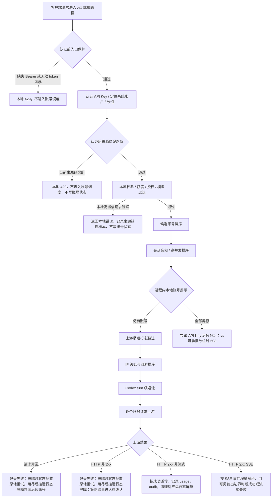

# 网关错误处理完整链路

## 文档目标

本文作为 OpenAI 兼容网关错误处理的排障总入口，回答四个问题：

- `200` 响应里哪些情况仍然会被当成错误。
- 非 `2xx` 上游响应和请求异常如何短期屏蔽当前账号、切号、等待可用账号。
- 如何保证 `invalid_request_error`、`rate_limit_exceeded`、库存不足、代理波动等场景不靠固定错误码分支处理。
- 多 IP、共享 API Key、高并发和恶意错误请求下，哪些机制只影响来源，哪些机制只进入账号级运行态屏障，哪些机制确认后才写持久账号状态。

更细的专题设计继续看：

- [网关异常重试与兜底策略](网关异常重试与兜底策略.md)
- [IP 级账号回避与自动切号设计](IP级账号回避与自动切号设计.md)
- [IP 级错误熔断与恶意请求保护设计](IP级错误熔断与恶意请求保护设计.md)
- [高并发分组调度设计](高并发分组调度设计.md)
- [账户内 API Key 故障隔离设计](账户内APIKey故障隔离设计.md)
- [流式中断与客户端重试调研](流式中断与客户端重试调研.md)
- [原始审计日志设计](原始审计日志设计.md)

## 一句话原则

真实网关流量里的上游失败先救当前请求，后确认账号健康。单个请求默认按临时状态配置在当前账号原地重试，重试用尽后切换后续账号。当前失败账号先进入进程内运行态屏障，只挡新请求，不立刻改 `accounts.status`。状态码、错误码和错误文案只用于诊断、审计和账户级错误处理策略输入，代码不再内置“余额不足”“限流”“某状态码才写状态”这类账号健康判断。

进入账号级运行态屏障的上游失败包括：

- 上游请求异常、连接失败、超时、EOF。
- 上游 HTTP 非 `2xx` 响应。
- 非流式 `2xx` 已经输出后正文中断。
- `200 + SSE` 中的失败事件、缺少终止事件或流中断。

写持久账号状态只允许发生在确认阶段：

- 账户级错误处理策略命中后，先得到“目标状态”；真实网关流量如果还有该账号存量并发，仍先走运行态屏障，等待存量成功信号或事前确认结果。
- 账号事前确认、半开探针或流失败确认连续失败后，且当前账号并发已经归零，才把自有账号或授权实例账号写为 `temporary_unavailable`、`rate_limited` 或 `error`。
- 后台冷却复测和管理员显式操作可以写持久状态，因为它们不是正在承接普通客户端并发的失败请求；手动账号测试成功可以作为人工恢复入口直接清理可恢复失败状态，手动 / 批量测试失败不能直接写持久临时不可调用，必须先进入事前确认运行态，确认仍失败后才落库。
- 存量请求或半开探针完整成功时，清理该账号运行态屏障；普通成功不自动恢复已经持久化的 `rate_limited` 或 `temporary_unavailable`。

不写账号状态的路径包括：

- 未进入上游账号调度的本地错误，例如本地 JSON 非法、API Key 不可用、授权不可用、模型过滤失败、分组队列满或单 IP 并发满。
- 客户端主动断开、慢客户端背压。
- 单纯的 IP 级错误熔断、IP 级账号回避、上游桶运行态避让；这些只影响来源或候选排序，不凭空制造额外账号状态。

使用记录可以保留所有排障事实，但账号质量和后台频繁失败预检只接收“账号调用链路”失败。`usage_records.failure_attribution` 用于区分 `account_upstream`、`account_dependency`、`gateway_capacity`、`gateway_policy` 和 `client_lifecycle`；账号并发满、分组队列满、单 IP 并发满、网关本地策略拦截和客户端生命周期失败仍可进入使用记录 / 错误统计，但不能进入 `account_quality_minute_stats`，也不能因此把 AI 账户标为近期质量频繁失败。

## 总流程



## HTTP 200 里哪些算错误

### 非流式 2xx

非流式 `2xx` 默认按成功处理：

- 响应头前等待和 `2xx` 响应首字节前等待都受 `streamRequestTimeoutSeconds` 表达的上游首包等待上限约束；超时发生在下游未收到任何响应内容前，按上游请求异常进入原地重试、运行态屏障和切号流程，持久状态等待确认阶段决定。
- 响应体边转发边有限捕获；大响应只截断诊断捕获，不影响客户端收到完整响应。
- usage 解析失败只影响用量解析，不把这次上游响应改成失败。
- 成功后执行账号成功副作用：清理或衰减可恢复软失败；清理当前来源错误熔断；提交本请求中前序失败账号的 IP 级回避。普通网关成功不会直接恢复 `rate_limited`，后台恢复探活或手动测试成功可以恢复。

DeepSeek 这类 OpenAI-compatible 供应商可能在非流式长请求中返回空行作为 keep-alive。非流式 JSON 聚合必须把这类空行视为传输保活，不能当成本地 JSON 非法、上游正文污染或账号失败；最终是否成功仍看有界 JSON 解析结果、响应语义检查和下游写出状态。

非流式 `2xx` 过程中如果客户端取消或连接断开，按客户端生命周期记录 `client_aborted`，释放账号并发槽，不写账号失败状态。非流式首字节已经写给下游后，如果正文中途异常，网关不能在同一个 HTTP 响应里安全重放半个 JSON 或半段响应，因此不做服务端透明换号；网关会记录 `upstream_body_interrupted`，忘记当前会话亲和，短期本地避让该账号，并主动打断下游连接，让客户端按网络读取失败自行重试。该账号是否写持久状态仍走运行态屏障和确认流程。

### 流式 2xx

`200 + text/event-stream` 不等于一定成功。网关会按 SSE 事件增量解析，直到得到清晰终态。

| 场景 | 是否算失败 | 账号副作用 |
| --- | --- | --- |
| 收到 OpenAI 终止事件，且没有失败事件 | 成功 | 清理成功态 |
| 客户端在终止事件后关闭 | 按成功收尾 | 不写失败 |
| `response.created`、`response.in_progress`、metadata、心跳后中断 | 失败，但未产生可见输出 | 进入运行态屏障；确认失败后才写状态 |
| 首段前超时、首段后无任何上游新数据、上游 EOF、缺少终止事件 | 失败 | 进入运行态屏障；确认失败后才写状态 |
| 上游 `response.failed` 或通用 `event: error` | 失败 | 进入运行态屏障；确认失败后才写状态 |
| 已输出文本、reasoning、工具参数或可改变 assistant 状态的 output item 后失败 | 失败 | 进入运行态屏障；同时记录上游桶运行态用于后续候选排序；确认失败后才写状态 |
| 慢客户端导致 `res.write()` 背压 | 不是上游错误 | 记录背压日志，不写账号状态 |
| 客户端主动断开 | 客户端生命周期 | 不写账号状态 |

DeepSeek SSE 可能发送 comment 作为 keep-alive。comment 只说明上游连接仍活跃，不是 OpenAI 终止事件、可见输出、错误事件或 usage 事件；不能因为只收到 comment 就认为流成功，也不能把 comment 当成缺少终止事件。只有连接结束、空闲超时、失败事件、异常完成状态或响应语义策略命中时，才进入对应失败链路。

可见输出边界是避免误判的关键：

- 不可见输出：`response.created`、`response.in_progress`、metadata、心跳、header 类事件。
- 可见输出：文本 delta、reasoning delta、工具调用参数 delta、会改变 assistant 内容或工具状态的 output item。

可见输出前且下游尚未提交任何 SSE body 时，网关优先做服务端内部重试：关闭当前上游，本次请求排除当前失败账号，继续扫同分组后续账号；当前分组耗尽时再按路由策略绑定顺序尝试后续可承接分组。服务端隐藏重试成功时，客户端只看到后续账号的完整成功流，不消耗 Codex 客户端重试次数，也不写 Codex turn 失败计数。只有所有可承接账号 / 分组都耗尽，且精确命中 Codex profile、Responses SSE、普通 JSON 对象格式的 `x-codex-turn-metadata.turn_id` 时，才把最终失败改写为 Codex 可重试的 `response.failed/upstream_retryable_error`；客户端可见文案固定为“上游流式响应在输出前失败，请重试”，不暴露 `server_is_overloaded`、`Selected model is at capacity`、探针失败摘要或最后一个上游错误原文。普通 OpenAI-compatible 客户端不伪造 Codex 可重试码，也不触发 Codex turn 级切号。当前真实网关流量的无可见输出失败不直接累计账号流失败计数，是否写持久状态仍由后续确认阶段决定。

可见输出已经写给下游后，服务端不能安全重放半段回答或工具参数。网关会把账号记入上游桶运行态：同一 `proxy`、`baseUrl` 或 `provider` 在短窗口内影响多个不同账号时，后续请求优先避开同桶账号。`cyber_policy` 是 Codex profile 下的显式例外：如果同批次输出和失败仍被预提交缓冲、尚未写给下游，可以按服务端内部重试继续切号；一旦已有可见输出实际写入下游，就不再静默拼接第二条上游流。

## 非 2xx 如何处理

非 `2xx` 上游响应不再有通用代码内置账号健康错误特征规则，也不会因为 `invalid_request_error`、状态码或错误文案直接写账号状态。上游错误体只作为账户级错误处理策略输入和排障摘要；未命中账户错误处理策略时按通用上游失败进入运行态屏障，确认仍不可用后才写当前账号 `temporary_unavailable`。

当前顺序固定如下：

1. 读取受限错误响应体，记录使用记录和审计尝试。
2. 解析上游错误体，只作为账户错误处理策略输入、审计和排障字段，不作为账号健康通用调度分支。
3. 如果还有 `temporaryUnschedulableRetryAttempts` 剩余次数，等待 `temporaryUnschedulableRetryIntervalSeconds` 后原地重试当前账号；这期间只保留失败使用记录和审计尝试，不写账号状态、不本地屏蔽、不记录 IP 回避。
4. 原地重试用尽仍失败后，立即忘记当前账号的会话亲和，并把当前账号加入本进程短暂避让屏障；屏障按 `3s -> 5s -> 10s` 阶梯退避，到期后只允许一个真实请求半开探测。
5. 读取当前账号 `credentials.error_handling_rules`，按当前上游响应状态、错误码、错误类型、错误文案、`clientProfile` 和下游模型匹配该账号自己的规则。配置入口只允许填写非 `2xx` HTTP 状态码，状态码或错误码字段都不能把 `200` 这类成功码写进账户错误处理策略；`200 + SSE` / `200 + JSON` 协议级失败由响应语义检查和客户端策略处理。
6. 命中账户错误处理策略时，策略结果作为待确认目标状态；如果目标是 `temporary_unavailable`，不读取账号级避让分钟数，持久写入后统一进入后台快速 / 慢速复测恢复通道；未命中策略或命中 `retry_next` 时，待确认目标为通用 `temporary_unavailable`。
7. 当前请求继续切后续账号，也不因多个账号返回相同上游错误而提前停止。
8. 后续账号成功时，本次请求救回；前序失败账号保留短期本地屏蔽，并可在当前 IP 维度形成短 TTL 回避。
9. 所有候选账号都失败时，返回网关统一 `service_unavailable`，不返回最后一个上游错误体。
10. 后续请求进入候选排序时会先过滤本地屏蔽账号；如果当前分组所有候选都被屏蔽，则先按路由策略分组绑定顺序尝试后续可承接分组。
11. 没有后续可承接分组时立即返回“所有上游账户正在临时隔离，请稍后重试”，并按最早屏蔽释放时间写入 `Retry-After`。
13. 运行态屏障期间，已有存量并发继续自然完成；任一存量请求或半开探针完整成功时，清理该账号运行态屏障。没有成功信号且事前确认连续失败后，仍要等该账号当前并发归零，才允许写持久账号状态。

`invalid_request_error` 的处理也遵守这套顺序：

- 如果后续账号成功，本次请求应救回，前序账号短期屏蔽并进入待确认，不因本次单请求失败立即写持久状态。
- 如果所有账号都返回失败，仍返回网关统一错误，不把上游 `invalid_request_error` 原文直接给客户端。
- 无论是否命中账户错误处理策略，只要已经命中上游账号并发生上游错误，都先进入运行态屏障；账户规则只决定确认失败后的目标状态是限流、临时不可调用还是异常。

## 请求级重试和账号级屏障

请求级原地重试只服务当前请求，账号级运行态屏障服务整个账号池，二者不能混在一起：

- 某个请求首次命中账号 A 时，如果 A 尚未进入运行态屏障，可以按 `temporaryUnschedulableRetryAttempts` 在 A 上原地重试。
- 该请求在 A 上重试用尽后，当前请求应切到后续账号；A 进入运行态屏障，新请求不再选择 A。
- 如果其他存量请求仍在 A 上运行，不主动中断、不主动迁移，也不因为其中一个请求失败就马上写 A 的持久状态。
- 如果存量请求在 A 上完整成功，说明 A 至少没有被本次失败证明为不可用，清理 A 的运行态屏障。
- 如果 A 已经处于运行态屏障，后续仍在 A 上的存量请求失败时，应避免继续放大同账号原地重试；这类请求可以减少或跳过剩余原地重试，直接切号或交给客户端重试边界。
- 事前确认探针连续失败后，如果 A 当前并发仍大于 0，只保持 `precheck_pending` 并等待并发释放；并发归零前不写 `temporary_unavailable`。
- 短暂避让到期后进入真实请求半开：同一账号同一运行态键同一时间只允许一个真实请求放行，其他请求继续避让；半开租约绑定到该请求的并发生命周期，固定租约时间只作为无并发残留时的兜底回收，不允许长流式请求中途被第二个请求穿透；半开请求完整成功时清理屏障，失败时进入下一阶避让。
- 短暂避让连续完成 `3s -> 5s -> 10s` 三轮半开仍失败后，不继续用本地 TTL 拖延，升级为 `precheck_pending` 事前确认；事前确认连续失败且当前账号并发归零后才写持久 `temporary_unavailable`。
- 代理 profile 已知不可用属于账号准备阶段失败；网关真实流量触发时也进入同一套秒级短暂避让和半开屏障，第三轮半开仍失败后进入事前确认，不直接写持久临时不可调用。
- 不新增持久化的“伪正常”状态；账户数据库状态仍是 `active`，前端通过 `runtimeAvailability` 展示“短暂避让”“半开探测”“待探针确认”或“探针失败”。

## 错误归属矩阵

| 场景 | 归属 | 是否切号 | 是否写账号状态 |
| --- | --- | --- | --- |
| 本地 JSON 非法 | 请求本身 | 否 | 否 |
| 模型被当前分组账号全部过滤 | 请求 / 授权边界 | 否 | 否 |
| API Key 不可用、授权不可用、额度不足 | 本地授权 / 额度 | 否 | 否 |
| 账号并发满 | 本地容量 | 尝试其他账号 | 否 |
| 分组队列满、单 IP 并发满 | 本地容量 | 否 | 否 |
| 上游请求异常、连接失败、EOF | 上游账号调用失败 | 按临时状态重试配置原地确认，用尽后短期屏蔽当前账号并切号 | 先不写；确认失败且并发归零后写临时不可调用 |
| 非 `2xx` 命中账户错误处理策略 | 账户规则 + 当前失败 | 按临时状态重试配置原地确认，用尽后短期屏蔽当前账号并切号 | 策略结果进入待确认；确认失败且并发归零后按策略写 |
| 非 `2xx` 未命中账户错误处理策略或命中 `retry_next` | 通用上游失败 | 按临时状态重试配置原地确认，用尽后短期屏蔽当前账号并切号 | 先不写；确认失败且并发归零后写临时不可调用 |
| `2xx` 成功体 `finish_reason = insufficient_system_resource` | 上游异常完成语义 | 未写下游且策略允许时可重试或切号；已写可见输出后不能静默拼接 | 作为响应语义诊断和策略输入；不因单次出现直接写持久状态 |
| DeepSeek keep-alive comment / 非流式空行 | 传输保活 | 否 | 否 |
| 后续账号成功 | 单账号或通道可绕开 | 已救回 | 前序失败账号进入运行态屏障；可提交当前 IP 回避 |
| 多账号均失败 | 账号池短期不可用或公共上游失败 | 已扫完候选 | 命中过上游的账号进入运行态屏障，返回网关统一错误 |
| 所有候选都处于本地屏蔽 | 本进程短期调度保护 | 先尝试 API Key 后续分组；无可承接分组时立即失败 | 不新增账号状态 |
| `200 + SSE` 可见输出前失败 | 流式协议失败 | 下游未提交时优先服务端切后续账号 / 后续分组；耗尽后才按客户端策略兜底 | 当前请求排除失败账号；真实网关流量不因无可见输出直接累计账号流失败计数，确认失败后才写持久状态 |
| `200 + SSE` 可见输出后失败 | 流式协议失败 | 已写给下游后不服务端静默拼接；`cyber_policy` 在预提交缓冲内可服务端切号 | 记录上游桶运行态；是否写持久状态仍走确认阶段 |
| 慢客户端背压 | 下游读取慢 | 否 | 否 |
| 客户端断开 | 客户端生命周期 | 否 | 否 |
| 后台复测连续失败 | 账号仍未恢复 | 否 | 继续退避复测；超过观察阈值后显示长期不可用并继续低频自动复测 |

归属边界按“是否已经进入账号调用链路”判断，不按“使用记录里是否有 `account_id`”判断。账号并发满这类本地容量失败为了排障会记录命中的账号和失败原因，但 `failure_attribution = gateway_capacity`，不参与账号质量分钟桶和 `account-quality-failure-precheck`。真实上游 HTTP 非 `2xx`、上游连接异常、代理准备失败和账号凭据 / 依赖不可用这类账号调用链路问题才允许归入账号质量，其中代理和凭据准备类问题使用 `account_dependency`，真实上游请求失败使用 `account_upstream`。

## 多 IP 如何隔离

### IP 级账号回避

IP 级账号回避只改变候选排序，不拒绝请求、不写账号状态。

作用键：

```text
systemAccountId + apiKeyId + clientIp + accountId
```

触发条件：

- 同一次请求里，账号 A 未确认失败并被跳过。
- 后续账号 B 完整成功。
- 当前请求有可用 `clientIp`。

结果：

- 后续同一 `systemAccountId + apiKeyId + clientIp` 的请求优先避开账号 A。
- 其他 IP、其他 API Key、其他系统账户不受影响；同一 API Key 下不同分组共享这份来源账号回避状态。
- 如果所有候选账号都被当前 IP 回避，旁路回避，保留原候选列表，避免保护机制把池子筛空。

### IP 级错误熔断

IP 级错误熔断用于错误风暴止损，不处理上游账号失败。

认证后作用键：

```text
systemAccountId + apiKeyId + clientIp
```

只计入高置信本地请求错误，例如：

- 本地 JSON 非法。
- 模型过滤失败。
- OAuth / Codex adapter 本地校验失败。

不计入：

- 多账号返回相同或相似上游错误。
- 账号池上游失败。
- 账户错误处理策略命中。
- 容量失败。
- 客户端取消。
- 流式已输出后失败。

命中后返回本地 OpenAI-compatible `429`，不进入账号调度，不写账号冷却。

### 本地账号屏蔽等待

本地账号屏蔽是进程内秒级调度态，用于把刚失败的账号从后续候选列表里临时拿掉。它不是账号冷却，不写 SQLite，也不由后台复测恢复。

作用键：

```text
accountId
```

触发条件：

- 上游返回非 `2xx`，且同账号原地重试用尽仍失败。
- 上游请求阶段连接失败、超时或 EOF，且同账号原地重试用尽仍失败；账号准备失败不做原地重试。
- 代理 profile 已知不可用。
- 上游失败进入待确认、账户错误处理策略命中目标状态等路径也可以同步设置本地屏蔽，加速当前进程避让。

结果：

- 仍有未屏蔽账号时，直接用未屏蔽账号继续调度。
- 所有候选都被屏蔽时，不再旁路屏蔽继续打问题账号；先按路由策略分组绑定顺序尝试后续可承接分组。
- 没有后续可承接分组时立即返回网关统一 `503 service_unavailable`，不透传上游原文，并按最早屏蔽释放时间写入 `Retry-After`。
- 短暂避让按 `3s -> 5s -> 10s` 阶梯执行；每一阶到期后只允许一个真实请求进入半开探测，其余并发继续被屏蔽。
- 半开请求完整成功时立即清理本地屏障；半开请求失败时进入下一阶避让；第三阶半开仍失败时升级为 `precheck_pending`，由事前确认决定是否写持久临时不可调用。
- 半开租约由获得放行的请求持有并在请求结束时释放；如果租约时间先到但账号仍有在途并发，其他请求仍继续避让，只有并发归零后的过期租约才允许被下一次真实探测接管。
- 该状态不写 SQLite，服务重启或进程重启后丢失；持久账号状态由账号事前确认、半开探针、账户错误处理策略确认失败、后台复测或人工操作写入；手动 / 批量账号测试失败只触发确认流程，不直接写持久临时不可调用；真实网关失败触发的确认写库还必须等当前账号并发归零。

### 上游桶运行态失败

上游桶运行态失败只影响候选排序，不自动禁用代理、不自动禁用上游；已经实际命中上游并失败的账号仍会先进入账号级运行态屏障，持久状态等待确认阶段决定。

作用键：

```text
proxyProfileId / proxyUrl
baseUrl
provider
```

触发条件：

- 代理 profile 不可用。
- 上游请求阶段异常；有代理配置时先归入 `proxy` 桶，没有代理配置时归入 `baseUrl/provider` 桶，不按具体错误码或错误类型分桶。
- 非 `2xx` 上游响应或 `2xx + SSE` 可见输出后失败时，同一 `proxy`、`baseUrl` 或 `provider` 短窗口内影响多个不同账号。

结果：

- 后续调度优先避开同桶账号。
- 如果所有候选账号都被同一可疑桶命中，旁路避让，保留原候选列表，避免保护机制把池子筛空。
- 桶运行态避让 TTL 到期后进入半开，只放行一个同桶账号做真实请求探测；探测成功清理桶状态，探测失败立即重新打开桶避让。
- 任一同桶账号完整成功后，清理该账号关联的上游桶运行态。
- 单账号单桶失败只能说明 `unknown`，不能直接判定账号坏、代理坏或上游坏。

### 单 IP 并发保护

单 IP 并发保护是容量闸口，不是错误判断：

- 只限制同一高并发分组下同一来源同时进入调度的请求数量。
- 命中时返回本地 `429`。
- 不计入错误熔断，不写账号状态。

## 会不会因为不同 IP 的错误把账号打死

不同 IP 不会因为来源维度本身凭空写账号状态；某次请求实际命中上游账号并发生上游错误时，该账号先进入运行态屏障和待确认流程。为了避免大量请求继续打到刚失败的账号，进程内本地账号屏蔽会在短 TTL 内影响同进程后续来源。

不同 IP 反复制造未知错误，只会在各自来源范围内触发：

- 当前 IP 对某个账号的短 TTL 回避。
- 当前认证后来源的错误熔断。
- 当前上游桶运行态避让。
- 当前账号的进程内秒级短暂避让屏障。
- 高并发单 IP 并发限制。

这些来源和排序状态本身不写账号 `status`、`schedulable`、`cooldown_until` 或 `last_error_code`；其中本地账号屏蔽只存在于当前 Web 进程内，短暂避让到期后必须先经过单请求半开探测，服务重启或进程重启后恢复。自有账户和分组授权账户按命中 `account_id` 屏蔽；账户授权实例也按自己的实例 `account_id + 使用方系统账户 + 本地分组 + 最终授权 ID` 屏蔽，避免授权方原账户或其他授权实例被同一个短 TTL 屏蔽误伤。

账号会被写入持久状态的情况：

- 真实网关流量失败后，账号事前确认、半开探针或流失败确认连续失败，且当前账号并发已经归零；账户授权实例只写当前命中的实例账户行，不写授权方原账户，也不写 `group_accounts.local_*`。
- 账户错误处理策略显式命中时，按规则形成待确认目标状态；确认失败且当前账号并发归零后写 `rate_limited`、`temporary_unavailable` 或 `error`。未命中规则或命中 `retry_next` 时，确认失败且当前账号并发归零后按通用失败写 `temporary_unavailable`。
- 后台恢复探活只负责自动恢复和退避，不负责把冷却态升级为永久异常。
- 管理员手动操作。

也就是说，IP 维度用于隔离来源和优化排序；账号运行态屏障由真实命中上游账号后的错误产生，持久账号状态只由确认失败或显式管理动作写入。

## 防误判检查清单

排查生产问题时按这张清单走：

1. 先看失败发生在本地校验、账号调度、上游请求、非 `2xx` 响应，还是 `200 + SSE` 内部。
2. 如果是非 `2xx` 或上游请求异常，当前账号应该先进入进程内短期屏蔽和待确认状态，并继续切后续账号。
3. 如果错误体包含 `invalid_request_error`，不要直接判断请求不可恢复，也不要把它作为特殊分支；仍按统一失败流水线处理。
4. 如果后续账号成功，本次请求应救回；前序失败账号仍应保留短期本地屏蔽，但不应仅因本次失败立即写持久状态。
5. 如果所有账号都失败，客户端应收到网关统一 `service_unavailable`，不应收到上游原始错误体。
6. 如果后续请求发现当前分组所有候选都被本地屏蔽，应先尝试 API Key 后续可承接分组；没有后续分组时快速返回，不旁路屏蔽继续打问题账号。
7. 如果是 `200 + SSE`，必须先判断是否已有可见输出。
8. 流式失败不再按状态码、错误码或错误文案直接写账号状态；只要命中上游账号后失败，就先进入运行态屏障，确认失败后才写持久状态。
9. 客户端取消、慢客户端背压、本地容量满都不代表账号坏。
10. 单 IP 错误熔断只消费高置信本地请求错误，不消费上游账号失败。
11. 进入账号运行态屏障的核心边界是“是否真实命中上游账号后发生错误”；写持久账号状态的核心边界是“是否经过策略、事前确认、半开探针、后台复测或人工动作确认仍不可用”。手动 / 批量账号测试失败只能作为事前确认输入，不能绕过确认直接写 `temporary_unavailable`。不要恢复状态码、错误码或错误文案硬编码判断。

## 常用日志链路

| 日志事件 | 含义 |
| --- | --- |
| `gateway_upstream_response_failed` | 上游返回非成功状态，当前尝试失败 |
| `gateway_upstream_request_failed` | 上游请求阶段异常，当前尝试失败 |
| `gateway_account_local_suppressed` | 当前账号进入本进程短期屏蔽 |
| `gateway_account_local_half_open_acquired` | 当前账号短暂避让到期，已有一个真实请求获得半开探测租约 |
| `gateway_account_local_half_open_released` | 半开探测请求结束，租约已释放或交给后续状态 |
| `gateway_account_local_suppression_precheck_required` | 当前账号短暂避让三轮半开仍失败，已要求进入事前确认 |
| `gateway_local_account_suppression_applied` | 候选列表已过滤本地屏蔽账号 |
| `gateway_local_account_suppression_exhausted` | 当前分组所有候选都在本地屏蔽中，已快速失败或准备切后续分组 |
| `gateway_upstream_failure_bucket_opened` | 同上游桶多个账号短窗失败，上游桶运行态避让打开 |
| `gateway_upstream_bucket_health_avoidance_applied` | 候选列表已避开可疑上游桶账号 |
| `gateway_upstream_bucket_health_avoidance_bypassed` | 所有候选都被上游桶命中，旁路以保证可用性 |
| `gateway_upstream_failure_bucket_recovered` | 账号成功后清理其关联上游桶运行态 |
| `gateway_account_precheck_scheduled` | 多来源短窗口失败后，账号进入事前确认运行态 |
| `gateway_account_precheck_recovered` | 账号事前确认或成功信号通过，已清理运行态屏障 |
| `gateway_account_precheck_failed_marked` | 事前确认连续失败，已写入持久临时不可调用 |
| `gateway_client_ip_account_avoidance_applied` | 当前来源候选排序已避让近期失败账号 |
| `gateway_client_ip_account_failure_confirmed` | 后续账号成功，前序未确认失败提交为当前 IP 回避 |
| `gateway_client_ip_error_circuit_sample_recorded` | 当前来源记录一次高置信本地请求错误 |
| `gateway_client_ip_error_circuit_opened` | 当前来源进入短 TTL 错误熔断 |
| `gateway_client_ip_error_circuit_blocked` | 当前请求因来源错误熔断被本地 `429` 短路 |
| `pre_commit_stream_server_retry` | 下游未提交前的流式失败已转为服务端内部重试 |
| `stream_server_retry_dispatch` | 服务端流式重试进入下一轮账号调度 |
| `stream_server_retry_exhausted` | 服务端流式重试耗尽，准备按客户端能力写最终失败 |
| `gateway_stream_failure_account_runtime_handled` | 流式失败已进入账号运行态处理；真实网关流量优先走调度降级和短暂避让，持久状态仍等待确认阶段 |
| `gateway_stream_missing_terminal` | SSE 缺少 OpenAI 终止事件 |
| `gateway_stream_finished_failed` | SSE 以失败事件或失败终态结束 |
| `gateway_stream_response_backpressure` | 下游写入背压，只说明客户端读取慢 |

## 常用审计 metadata

| label | 含义 |
| --- | --- |
| `account_dispatch_candidate_window` | 本次 API Key 运行时候选窗口诊断，记录扫描窗口、可用候选、水合批次、水合丢弃、最终候选数量和是否触达扫描上限 |
| `account_model_filter` | 账号模型过滤诊断，记录请求模型、直接模型命中数、账号映射命中数、跳过数和剩余候选数 |
| `account_request_capability_filter` | 请求路径或客户端兼容能力过滤诊断，记录跳过数量和剩余候选数 |
| `local_account_suppression` | 本地短期账号屏蔽过滤结果，记录屏蔽账号、剩余候选和下次重试时间 |

## 回归验证入口

错误链路改动至少运行：

```powershell
pnpm --filter juhe-ai-backend test:upstream-request-failure
pnpm --filter juhe-ai-backend test:gateway-proxy-health
pnpm --filter juhe-ai-backend test:stream-first-output-timeout
pnpm --filter juhe-ai-backend test:codex-client-strategy
pnpm --filter juhe-ai-backend test:gateway-client-ip-account-avoidance
pnpm --filter juhe-ai-backend test:client-ip-error-circuit
pnpm --filter juhe-ai-backend test:client-ip-concurrency
pnpm --filter juhe-ai-backend typecheck
pnpm --filter juhe-ai-frontend typecheck
```

文档和残留命名清理至少检索：

```powershell
rg -n "upstream[_]error[_]feature|openAIUpstreamErrorFeatureRule[s]|matchUpstreamErrorFeature.Rule|gateway[_]upstream[_]error[_]feature[_]matched|feature[-]rules|FeatureRules.View" backend/src frontend/src docs/functions docs/architecture docs/develop
rg -n "invalid_request_error|请求级错误缓存|IP 级账号回避|IP 级错误熔断|可见输出|response.failed|event: error|终止事件" docs/functions docs/architecture docs/develop
```
