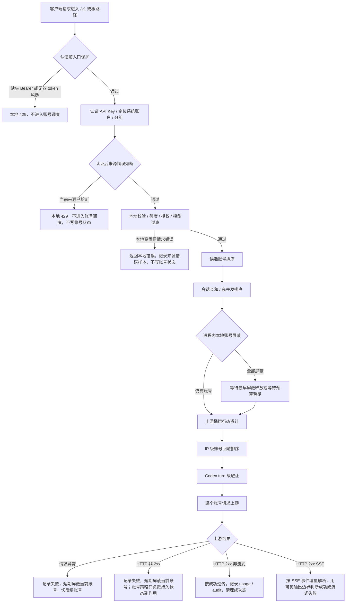

# 网关错误处理完整链路

## 文档目标

本文作为 OpenAI 兼容网关错误处理的排障总入口，回答四个问题：

- `200` 响应里哪些情况仍然会被当成错误。
- 非 `2xx` 上游响应和请求异常如何短期屏蔽当前账号、切号、等待可用账号。
- 如何保证 `invalid_request_error`、`rate_limit_exceeded`、库存不足、代理波动等场景不靠固定错误码分支处理，也不把弱证据写成持久账号状态。
- 多 IP、共享 API Key、高并发和恶意错误请求下，哪些机制只影响来源，哪些机制才允许写账号状态。

更细的专题设计继续看：

- [网关异常重试与兜底策略](网关异常重试与兜底策略.md)
- [IP 级账号回避与自动切号设计](IP级账号回避与自动切号设计.md)
- [IP 级错误熔断与恶意请求保护设计](IP级错误熔断与恶意请求保护设计.md)
- [高并发分组调度设计](高并发分组调度设计.md)
- [流式中断与客户端重试调研](流式中断与客户端重试调研.md)
- [流式拦截策略配置设计](流式拦截策略配置设计.md)
- [原始审计日志设计](原始审计日志设计.md)

## 一句话原则

网关只把强证据写成账号状态；弱证据先救请求、先隔离来源、先保留审计，不把单次错误、单个 IP 或单个状态码直接升级成全局账号结论。

强证据包括：

- 账号内嵌错误策略命中，例如明确限流、明确临时不可调用、明确异常。
- OpenAI OAuth / Codex 可解析的账号级 reset 或限流信息。
- `200 + SSE` 已经输出可见内容后持续失败，并达到流熔断阈值。
- 后台复测 `temporary_unavailable` / `rate_limited` 连续失败时继续退避复测；超过最长自动恢复观察窗口后会转为 `cooldown_retest_max_recovery_exceeded` 异常并停止自动复测。
- 管理员手动停用、恢复、迁移或清理状态。

弱证据包括：

- 单个账号返回非 `2xx`，但没有命中账号错误策略。
- `invalid_request_error`、`rate_limit_exceeded` 等上游结构化字段本身。
- 一个客户端 IP 的未知上游失败。
- 多个账号返回相同或相似上游错误。
- 进程内短 TTL 本地账号屏蔽。
- 本地容量不足、客户端取消、慢客户端背压。

弱证据不能直接写账号冷却、异常或不可调度；它只能用于本进程短期隔离、切号、等待和审计。

## 总流程



## HTTP 200 里哪些算错误

### 非流式 2xx

非流式 `2xx` 默认按成功处理：

- 响应头前等待和 `2xx` 响应首字节前等待都受 `streamRequestTimeoutSeconds` 表达的上游首包等待上限约束；超时发生在下游未收到任何响应内容前，按上游请求异常切换后续账号。
- 响应体边转发边有限捕获；大响应只截断诊断捕获，不影响客户端收到完整响应。
- usage 解析失败只影响用量解析，不把这次上游响应改成失败。
- 成功后执行账号成功副作用：清理或衰减可恢复软失败；清理当前来源错误熔断；提交本请求中前序失败账号的 IP 级回避。普通网关成功不会直接恢复 `rate_limited`，后台恢复探活或手动测试成功可以恢复。

非流式 `2xx` 过程中如果客户端取消或连接断开，按客户端生命周期记录 `client_aborted`，释放账号并发槽，不写账号失败状态。非流式首字节已经写给下游后，如果正文中途异常，网关不能在同一个 HTTP 响应里安全重放半个 JSON 或半段响应，因此不做服务端透明换号；网关会记录 `upstream_body_interrupted`，忘记当前会话亲和，短期本地避让该账号，并主动打断下游连接，让客户端按网络读取失败自行重试。

### 流式 2xx

`200 + text/event-stream` 不等于一定成功。网关会按 SSE 事件增量解析，直到得到清晰终态。

| 场景 | 是否算失败 | 账号副作用 |
| --- | --- | --- |
| 收到 OpenAI 终止事件，且没有失败事件 | 成功 | 清理成功态 |
| 客户端在终止事件后关闭 | 按成功收尾 | 不写失败 |
| `response.created`、`response.in_progress`、metadata、心跳后中断 | 失败，但未产生可见输出 | 不累计账号流失败 |
| 首段前超时、首段后无任何上游新数据、上游 EOF、缺少终止事件 | 失败 | 取决于是否已产生可见输出 |
| 上游 `response.failed` 或通用 `event: error` | 失败 | 取决于是否已产生可见输出 |
| 已输出文本、reasoning、工具参数或可改变 assistant 状态的 output item 后失败 | 失败 | 先进入上游桶运行态归因；同 `proxy/baseUrl/provider` 多账号短窗失败时由上游桶吸收，否则累计账号流失败，达到阈值后写 `temporary_unavailable` |
| 慢客户端导致 `res.write()` 背压 | 不是上游错误 | 记录背压日志，不写账号状态 |
| 客户端主动断开 | 客户端生命周期 | 不写账号状态 |

可见输出边界是避免误判的关键：

- 不可见输出：`response.created`、`response.in_progress`、metadata、心跳、header 类事件。
- 可见输出：文本 delta、reasoning delta、工具调用参数 delta、会改变 assistant 内容或工具状态的 output item。

可见输出前失败时，网关不会累计账号流失败。只有精确命中 Codex profile、Responses SSE，并解析到普通 JSON 对象格式的 `x-codex-turn-metadata.turn_id` 时，才改写为 Codex 可重试的 `response.failed/upstream_retryable_error`。普通 OpenAI-compatible 客户端不伪造 Codex 可重试码，也不触发 Codex 第 4 次 turn 级切号。

可见输出后失败时，服务端不能安全重放半段回答或工具参数。网关会先把账号记入上游桶运行态：同一 `proxy`、`baseUrl` 或 `provider` 在短窗口内影响多个不同账号时，后续请求优先避开同桶账号，不写账号全局状态；只有未形成同桶证据时才累计账号流失败计数。`cyber_policy` 是 Codex profile 下已输出后仍允许改写为客户端重试的显式例外。

## 非 2xx 如何处理

非 `2xx` 上游响应不再有代码内置错误特征规则，也不会因为 `invalid_request_error` 直接首账号短路。

当前顺序固定如下：

1. 读取受限错误响应体，记录使用记录和审计尝试。
2. 解析上游错误体，只作为账号策略输入、审计和排障字段，不作为通用调度分支。
3. 立即忘记当前账号的会话亲和，并把当前账号加入本进程短 TTL 本地屏蔽。
4. 先匹配账号错误策略，包括 OpenAI OAuth 官方限额 reset 语义和账号自带 `credentials.error_handling_rules`；账号自带规则默认不配置，只有用户手动添加时才参与匹配。配置入口只允许填写非 `2xx` HTTP 状态码，状态码或错误码字段都不能把 `200` 这类成功码写进错误策略；`200 + SSE` 协议级失败由流式失败机制处理。
5. 命中账号策略时，按策略异步写 `rate_limited`、`temporary_unavailable` 或 `error`；未命中策略时不写持久账号状态。
6. 当前请求继续切后续账号，不在同一账号上重复消耗尝试，也不因多个账号返回相同上游错误而提前停止。
7. 后续账号成功时，本次请求救回；前序失败账号保留短期本地屏蔽，并可在当前 IP 维度形成短 TTL 回避。
8. 所有候选账号都失败时，返回网关统一 `service_unavailable`，不返回最后一个上游错误体。
9. 后续请求进入候选排序时会先过滤本地屏蔽账号；如果所有候选都被屏蔽，则等待最早屏蔽释放或等待预算耗尽。
10. 等待释放后有账号可用则继续调度；等待超时仍无账号可用时，返回“所有上游账户正在临时隔离，请稍后重试”。

`invalid_request_error` 的处理也遵守这套顺序：

- 如果后续账号成功，本次请求应救回，前序账号短期屏蔽。
- 如果所有账号都返回失败，仍返回网关统一错误，不把上游 `invalid_request_error` 原文直接给客户端。
- 如果命中账号自带错误策略，才按账号策略写持久账号状态。

## 错误归属矩阵

| 场景 | 归属 | 是否切号 | 是否写账号状态 |
| --- | --- | --- | --- |
| 本地 JSON 非法 | 请求本身 | 否 | 否 |
| 模型被当前分组账号全部过滤 | 请求 / 授权边界 | 否 | 否 |
| API Key 不可用、授权不可用、额度不足 | 本地授权 / 额度 | 否 | 否 |
| 账号并发满 | 本地容量 | 尝试其他账号 | 否 |
| 分组队列满、单 IP 并发满 | 本地容量 | 否 | 否 |
| 上游请求异常、连接失败、EOF | 未知上游失败 | 立即短期屏蔽当前账号并切号 | 否 |
| 非 `2xx` 命中账号错误策略 | 账号级强证据 + 当前失败 | 立即短期屏蔽当前账号并切号 | 按策略 |
| 非 `2xx` 未命中账号策略 | 未知上游失败 | 立即短期屏蔽当前账号并切号 | 否 |
| 后续账号成功 | 单账号或通道可绕开 | 已救回 | 否；可提交当前 IP 回避 |
| 多账号均失败 | 账号池短期不可用或公共上游失败 | 已扫完候选 | 否，返回网关统一错误 |
| 所有候选都处于本地屏蔽 | 本进程短期调度保护 | 等待释放或超时 | 否 |
| `200 + SSE` 可见输出前失败 | 流式协议失败 | 不服务端换账号 | 否 |
| `200 + SSE` 可见输出后失败，同上游桶多账号短窗失败 | 上游桶运行态问题 | 不服务端换账号 | 否，优先避让同桶账号 |
| `200 + SSE` 可见输出后失败，未形成同桶证据 | 账号流稳定性问题 | 不服务端换账号 | 达阈值后临时不可调用 |
| 慢客户端背压 | 下游读取慢 | 否 | 否 |
| 客户端断开 | 客户端生命周期 | 否 | 否 |
| 后台复测连续失败 | 账号仍未恢复 | 否 | 继续退避复测；超过最长自动恢复观察窗口后转 `cooldown_retest_max_recovery_exceeded` 异常 |

## 多 IP 如何隔离

### IP 级账号回避

IP 级账号回避只改变候选排序，不拒绝请求、不写账号状态。

作用键：

```text
systemAccountId + apiKeyId + clientIp + accountId
```

触发条件：

- 同一次请求里，账号 A 未确认失败并被跳过。
- 后续账号 B 完整成功。
- 当前请求有可用 `clientIp`。

结果：

- 后续同一 `systemAccountId + apiKeyId + clientIp` 的请求优先避开账号 A。
- 其他 IP、其他 API Key、其他系统账户不受影响；同一 API Key 下不同分组共享这份来源账号回避状态。
- 如果所有候选账号都被当前 IP 回避，旁路回避，保留原候选列表，避免保护机制把池子筛空。

### IP 级错误熔断

IP 级错误熔断用于错误风暴止损，不处理上游未知失败。

认证后作用键：

```text
systemAccountId + apiKeyId + clientIp
```

只计入高置信本地请求错误，例如：

- 本地 JSON 非法。
- 模型过滤失败。
- OAuth / Codex adapter 本地校验失败。

不计入：

- 多账号返回相同或相似上游错误。
- 未知账号池失败。
- 账号错误策略命中。
- 容量失败。
- 客户端取消。
- 流式已输出后失败。

命中后返回本地 OpenAI-compatible `429`，不进入账号调度，不写账号冷却。

### 本地账号屏蔽等待

本地账号屏蔽是进程内短 TTL 调度态，用于把刚失败的账号从后续候选列表里临时拿掉。

作用键：

```text
accountId
```

触发条件：

- 上游返回非 `2xx`。
- 上游请求阶段连接失败、超时、EOF 或账号准备失败。
- 代理 profile 已知不可用。
- 流熔断、账号错误策略等强证据路径也可以同步设置本地屏蔽，加速当前进程避让。

结果：

- 仍有未屏蔽账号时，直接用未屏蔽账号继续调度。
- 所有候选都被屏蔽时，不再旁路屏蔽，而是等待最早屏蔽释放。
- 高并发分组使用分组 `maxQueueWaitMs` 作为等待预算；其他分组使用默认短等待预算。
- 等待后仍没有账号可用时，返回网关统一 `503 service_unavailable`，不透传上游原文。
- 该状态不写 SQLite，服务重启或进程重启后丢失；持久账号状态仍只由账号策略、流熔断、后台复测或人工操作写入。

### 上游桶运行态失败

上游桶运行态失败只影响候选排序，不自动禁用代理、不自动禁用上游、不写账号状态。

作用键：

```text
proxyProfileId / proxyUrl
baseUrl
provider
```

触发条件：

- 代理 profile 不可用。
- 上游请求阶段异常；有代理配置时先归入 `proxy` 桶，没有代理配置时归入 `baseUrl/provider` 桶，不按具体错误码或错误类型分桶。
- 非 `2xx` 上游响应或 `2xx + SSE` 可见输出后失败时，同一 `proxy`、`baseUrl` 或 `provider` 短窗口内影响多个不同账号。

结果：

- 后续调度优先避开同桶账号。
- 如果所有候选账号都被同一可疑桶命中，旁路避让，保留原候选列表，避免保护机制把池子筛空。
- 桶运行态避让 TTL 到期后进入半开，只放行一个同桶账号做真实请求探测；探测成功清理桶状态，探测失败立即重新打开桶避让。
- 任一同桶账号完整成功后，清理该账号关联的上游桶运行态。
- 单账号单桶失败只能说明 `unknown`，不能直接判定账号坏、代理坏或上游坏。

### 单 IP 并发保护

单 IP 并发保护是容量闸口，不是错误判断：

- 只限制同一高并发分组下同一来源同时进入调度的请求数量。
- 命中时返回本地 `429`。
- 不计入错误熔断，不写账号状态。

## 会不会因为不同 IP 的错误把账号打死

默认不会写入持久账号状态；但为了避免大量请求继续打到刚失败的账号，进程内本地账号屏蔽会在短 TTL 内影响同进程后续来源。

不同 IP 反复制造未知错误，只会在各自来源范围内触发：

- 当前 IP 对某个账号的短 TTL 回避。
- 当前认证后来源的错误熔断。
- 当前上游桶运行态避让。
- 当前账号的进程内短 TTL 本地屏蔽。
- 高并发单 IP 并发限制。

这些都不写账号 `status`、`schedulable`、`cooldown_until` 或 `last_error_code`；其中本地账号屏蔽只存在于当前 Web 进程内，TTL 到期或进程重启后恢复。自有账户和分组授权账户按命中 `account_id` 屏蔽；账户授权实例也按自己的实例 `account_id + 使用方系统账户 + 本地分组 + 最终授权 ID` 屏蔽，避免授权方原账户或其他授权实例被同一个短 TTL 屏蔽误伤。

账号会被全局影响的情况只有强证据路径：

- 账号错误策略明确命中，说明这是账号级限流、失效、异常或上游账号通道问题；账户授权实例只写当前命中的实例账户行，不写授权方原账户，也不写 `group_accounts.local_*`。
- 可见输出后流式失败达到阈值，且没有被上游桶运行态吸收，说明该账号流稳定性在窗口内持续失败；账户授权实例只累计和冷却当前命中的实例账户行。
- 后台恢复探活只负责自动恢复和退避，不负责把冷却态升级为永久异常。
- 管理员手动操作。

也就是说，IP 维度用于隔离来源和优化排序；账号维度只接受账号强证据。

## 防误判检查清单

排查生产问题时按这张清单走：

1. 先看失败发生在本地校验、账号调度、上游请求、非 `2xx` 响应，还是 `200 + SSE` 内部。
2. 如果是非 `2xx` 或上游请求异常，当前账号应该先进入进程内短期屏蔽，并继续切后续账号。
3. 如果错误体包含 `invalid_request_error`，不要直接判断请求不可恢复，也不要把它作为特殊分支；仍按统一失败流水线处理。
4. 如果后续账号成功，前序账号应保留短期本地屏蔽，并可进入当前 IP 回避；不应仅因这次失败写持久冷却。
5. 如果所有账号都失败，客户端应收到网关统一 `service_unavailable`，不应收到上游原始错误体。
6. 如果后续请求发现所有候选都被本地屏蔽，应进入等待，而不是旁路屏蔽继续打问题账号。
7. 如果是 `200 + SSE`，必须先判断是否已有可见输出。
8. 可见输出前失败不累计账号流失败；可见输出后先看是否形成同上游桶多账号失败证据，再决定进入上游桶还是账号流熔断计数。
9. 客户端取消、慢客户端背压、本地容量满都不代表账号坏。
10. 单 IP 错误熔断只消费高置信本地请求错误，不消费未知上游失败。
11. 任何写账号状态的路径，都必须能指出账号策略、流熔断、后台复测或人工操作中的一个。

## 常用日志链路

| 日志事件 | 含义 |
| --- | --- |
| `gateway_upstream_response_failed` | 上游返回非成功状态，当前尝试失败 |
| `gateway_upstream_request_failed` | 上游请求阶段异常，当前尝试失败 |
| `gateway_account_local_suppressed` | 当前账号进入本进程短期屏蔽 |
| `gateway_local_account_suppression_applied` | 候选列表已过滤本地屏蔽账号 |
| `gateway_local_account_suppression_waiting` | 所有候选都在本地屏蔽中，进入等待 |
| `gateway_local_account_suppression_released` | 等待后已有账号可重新调度 |
| `gateway_upstream_failure_bucket_opened` | 同上游桶多个账号短窗失败，上游桶运行态避让打开 |
| `gateway_upstream_bucket_health_avoidance_applied` | 候选列表已避开可疑上游桶账号 |
| `gateway_upstream_bucket_health_avoidance_bypassed` | 所有候选都被上游桶命中，旁路以保证可用性 |
| `gateway_upstream_failure_bucket_recovered` | 账号成功后清理其关联上游桶运行态 |
| `gateway_stream_failure_upstream_bucket_absorbed` | 可见输出后流失败被上游桶吸收，未累计账号流失败 |
| `gateway_client_ip_account_avoidance_applied` | 当前来源候选排序已避让近期失败账号 |
| `gateway_client_ip_account_failure_confirmed` | 后续账号成功，前序未确认失败提交为当前 IP 回避 |
| `gateway_client_ip_error_circuit_sample_recorded` | 当前来源记录一次高置信本地请求错误 |
| `gateway_client_ip_error_circuit_opened` | 当前来源进入短 TTL 错误熔断 |
| `gateway_client_ip_error_circuit_blocked` | 当前请求因来源错误熔断被本地 `429` 短路 |
| `gateway_stream_intercepted` | Codex profile 下流式失败被改写为客户端可重试事件 |
| `gateway_stream_failure_account_side_effect_deferred` | 流式失败发生在可见输出前，不累计账号流失败 |
| `gateway_stream_missing_terminal` | SSE 缺少 OpenAI 终止事件 |
| `gateway_stream_finished_failed` | SSE 以失败事件或失败终态结束 |
| `gateway_stream_response_backpressure` | 下游写入背压，只说明客户端读取慢 |

## 回归验证入口

错误链路改动至少运行：

```powershell
pnpm --filter juhe-ai-backend test:upstream-request-failure
pnpm --filter juhe-ai-backend test:gateway-proxy-health
pnpm --filter juhe-ai-backend test:stream-first-output-timeout
pnpm --filter juhe-ai-backend test:codex-client-strategy
pnpm --filter juhe-ai-backend test:gateway-client-ip-account-avoidance
pnpm --filter juhe-ai-backend test:client-ip-error-circuit
pnpm --filter juhe-ai-backend test:client-ip-concurrency
pnpm --filter juhe-ai-backend typecheck
pnpm --filter juhe-ai-frontend typecheck
```

文档和残留命名清理至少检索：

```powershell
rg -n "upstream[_]error[_]feature|openAIUpstreamErrorFeatureRule[s]|matchUpstreamErrorFeature.Rule|gateway[_]upstream[_]error[_]feature[_]matched|feature[-]rules|FeatureRules.View" backend/src frontend/src docs/functions docs/architecture docs/develop
rg -n "invalid_request_error|请求级错误缓存|IP 级账号回避|IP 级错误熔断|可见输出|response.failed|event: error|终止事件" docs/functions docs/architecture docs/develop
```
