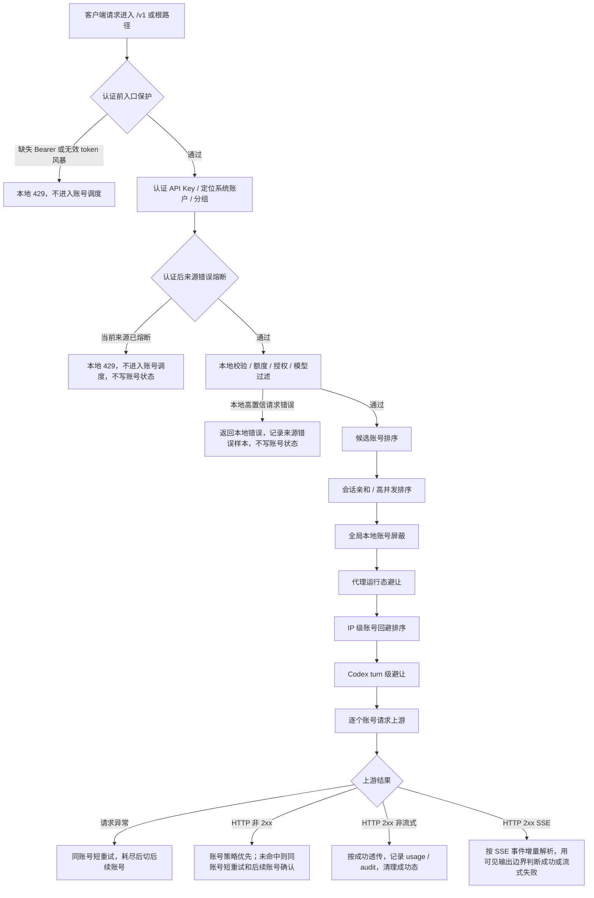

# 网关错误处理完整链路

## 文档目标

本文作为 OpenAI 兼容网关错误处理的排障总入口，回答四个问题：

- `200` 响应里哪些情况仍然会被当成错误。
- 非 `2xx` 上游响应如何重试、切号、确认请求级失败。
- 如何保证 `invalid_request_error`、`rate_limit_exceeded`、库存不足、代理波动等场景不被误判成账号坏了。
- 多 IP、共享 API Key、高并发和恶意错误请求下，哪些机制只影响来源，哪些机制才允许写账号状态。

更细的专题设计继续看：

- [网关异常重试与兜底策略](网关异常重试与兜底策略.md)
- [IP 级账号回避与自动切号设计](IP级账号回避与自动切号设计.md)
- [IP 级错误熔断与恶意请求保护设计](IP级错误熔断与恶意请求保护设计.md)
- [高并发分组调度设计](高并发分组调度设计.md)
- [流式中断与客户端重试调研](流式中断与客户端重试调研.md)
- [原始审计日志设计](原始审计日志设计.md)

## 一句话原则

网关只把强证据写成账号状态；弱证据先救请求、先隔离来源、先保留审计，不把单次错误、单个 IP 或单个状态码直接升级成全局账号结论。

强证据包括：

- 账号内嵌错误策略命中，例如明确限流、明确临时不可调用、明确异常。
- OpenAI OAuth / Codex 可解析的账号级 reset 或限流信息。
- `200 + SSE` 已经输出可见内容后持续失败，并达到流熔断阈值。
- 后台复测 `temporary_unavailable` 连续失败，超过恢复上限后转异常。
- 管理员手动停用、恢复、迁移或清理状态。

弱证据包括：

- 单个账号返回非 `2xx`，但没有命中账号错误策略。
- `invalid_request_error`、`rate_limit_exceeded` 等上游结构化字段本身。
- 一个客户端 IP 的未知上游失败。
- 达到当前候选池需要的多账号同签名确认阈值。
- 本地容量不足、客户端取消、慢客户端背压。

弱证据不能直接写账号冷却、异常或不可调度。

## 总流程



## HTTP 200 里哪些算错误

### 非流式 2xx

非流式 `2xx` 默认按成功处理：

- 响应体边转发边有限捕获；大响应只截断诊断捕获，不影响客户端收到完整响应。
- usage 解析失败只影响用量解析，不把这次上游响应改成失败。
- 成功后执行账号成功副作用：清理或衰减可恢复软失败；清理当前来源错误熔断；提交本请求中前序待确认失败账号的 IP 级回避。`rate_limited` 不会被普通网关成功自动恢复，只能由明确 reset、人工测试 / 恢复等路径处理。

非流式 `2xx` 过程中如果客户端取消或连接断开，按客户端生命周期记录 `client_aborted`，释放账号并发槽，不写账号失败状态。

### 流式 2xx

`200 + text/event-stream` 不等于一定成功。网关会按 SSE 事件增量解析，直到得到清晰终态。

| 场景 | 是否算失败 | 账号副作用 |
| --- | --- | --- |
| 收到 OpenAI 终止事件，且没有失败事件 | 成功 | 清理成功态 |
| 客户端在终止事件后关闭 | 按成功收尾 | 不写失败 |
| `response.created`、`response.in_progress`、metadata、心跳后中断 | 失败，但未产生可见输出 | 不累计账号流失败 |
| 首段前超时、首段后无任何上游新数据、上游 EOF、缺少终止事件 | 失败 | 取决于是否已产生可见输出 |
| 上游 `response.failed` 或通用 `event: error` | 失败 | 取决于是否已产生可见输出 |
| 已输出文本、reasoning、工具参数或可改变 assistant 状态的 output item 后失败 | 失败 | 先进入代理运行态归因；同代理多账号短窗失败时由代理桶吸收，否则累计账号流失败，达到阈值后写 `temporary_unavailable` |
| 慢客户端导致 `res.write()` 背压 | 不是上游错误 | 记录背压日志，不写账号状态 |
| 客户端主动断开 | 客户端生命周期 | 不写账号状态 |

可见输出边界是避免误判的关键：

- 不可见输出：`response.created`、`response.in_progress`、metadata、心跳、header 类事件。
- 可见输出：文本 delta、reasoning delta、工具调用参数 delta、会改变 assistant 内容或工具状态的 output item。

可见输出前失败时，网关不会累计账号流失败。只有精确命中 Codex profile、Responses SSE，并解析到普通 JSON 对象格式的 `x-codex-turn-metadata.turn_id` 时，才改写为 Codex 可重试的 `response.failed/upstream_retryable_error`。普通 OpenAI-compatible 客户端不伪造 Codex 可重试码，也不触发 Codex 第 4 次 turn 级切号。

可见输出后失败时，服务端不能安全重放半段回答或工具参数。网关会先把绑定代理的账号记入代理运行态失败桶：同一代理在短窗口内影响多个不同账号时，后续请求优先避开该代理绑定账号，不写账号全局状态；只有未形成代理证据时才累计账号流失败计数。`cyber_policy` 是 Codex profile 下已输出后仍允许改写为客户端重试的显式例外。

## 非 2xx 如何处理

非 `2xx` 上游响应不再有代码内置错误特征规则，也不会因为 `invalid_request_error` 直接首账号短路。

当前顺序固定如下：

1. 读取受限错误响应体，记录使用记录和审计尝试。
2. 解析上游错误体，只作为账号策略输入、错误签名和排障字段。
3. 先匹配账号错误策略，包括账号自带 `credentials.error_handling_rules` 和 OAuth / Codex 账号级 reset 语义。
4. 命中账号策略时，按策略写 `rate_limited`、`temporary_unavailable` 或 `error`，然后切后续账号。
5. 未命中账号策略时，进入未知失败兜底。
6. 兜底只判断是否还有同账号短重试次数，不判断状态码白名单。
7. 同账号短重试仍失败后，加入本请求待确认失败，切后续账号。
8. 后续账号成功时，本次请求救回；前序账号只记录失败事实，可提交当前 IP 对前序账号的短 TTL 回避，不写全局冷却。
9. 如果只有两个候选账号，两个不同账号返回同一错误签名即可确认请求级或公共失败。
10. 如果还有第三个可用候选账号，两个账号同签名只作为请求级候选证据，继续探测第三个账号。
11. 第三个账号成功时，本次请求救回；前两个失败账号只按当前来源进入短 TTL 回避，不写全局冷却。
12. 第三个账号仍返回同一错误签名时，才原样透传后一个上游状态码、响应头和响应体给客户端，不冷却这些账号。
13. 同一来源后续重复发送完全相同请求时，短 TTL 请求级错误签名缓存会直接返回最近确认过的上游错误，保持原始 status/body 语义，不改成本地 `429`。
14. 所有候选账号都失败且没有同签名确认时，返回网关“所有上游账户均失败”，刷出待确认失败，但不默认写账号冷却。

`invalid_request_error` 的处理也遵守这套顺序：

- 如果后续账号成功，说明前序账号或它的上游通道有问题，本次请求应救回。
- 如果候选池里还有第三个账号，两个账号同签名不会立刻停止；第三个也同签名才确认请求级失败。
- 已确认的同源同请求短时间重复出现时，命中请求级错误签名缓存，原样返回最近确认过的上游错误，避免反复扫账号池。
- 如果命中账号自带错误策略，才按账号策略处理账号状态。

## 错误归属矩阵

| 场景 | 归属 | 是否切号 | 是否写账号状态 |
| --- | --- | --- | --- |
| 本地 JSON 非法 | 请求本身 | 否 | 否 |
| 模型被当前分组账号全部过滤 | 请求 / 授权边界 | 否 | 否 |
| API Key 不可用、授权不可用、额度不足 | 本地授权 / 额度 | 否 | 否 |
| 账号并发满 | 本地容量 | 尝试其他账号 | 否 |
| 分组队列满、单 IP 并发满 | 本地容量 | 否 | 否 |
| 上游请求异常、连接失败、EOF | 未知上游失败 | 同账号短重试后切号 | 默认否 |
| 非 `2xx` 命中账号错误策略 | 账号级强证据 | 是 | 按策略 |
| 非 `2xx` 未命中账号策略 | 待确认失败 | 同账号短重试后切号 | 默认否 |
| 后续账号成功 | 单账号或通道可绕开 | 已救回 | 否，只做当前 IP 回避 |
| 多账号达到同签名确认阈值 | 请求级或公共失败 | 否，停止扫池 | 否 |
| `200 + SSE` 可见输出前失败 | 流式协议失败 | 不服务端换账号 | 否 |
| `200 + SSE` 可见输出后失败，同代理多账号短窗失败 | 代理运行态问题 | 不服务端换账号 | 否，优先避让该代理绑定账号 |
| `200 + SSE` 可见输出后失败，未形成代理证据 | 账号流稳定性问题 | 不服务端换账号 | 达阈值后临时不可调用 |
| 慢客户端背压 | 下游读取慢 | 否 | 否 |
| 客户端断开 | 客户端生命周期 | 否 | 否 |
| 后台复测连续失败超上限 | 账号恢复失败 | 否 | 转 `error` |

## 多 IP 如何隔离

### IP 级账号回避

IP 级账号回避只改变候选排序，不拒绝请求、不写账号状态。

作用键：

```text
systemAccountId + apiKeyId + groupId + clientIp + accountId
```

触发条件：

- 同一次请求里，账号 A 未确认失败并被跳过。
- 后续账号 B 完整成功。
- 当前请求有可用 `clientIp`。

结果：

- 后续同一 `systemAccountId + apiKeyId + groupId + clientIp` 的请求优先避开账号 A。
- 其他 IP、其他 API Key、其他分组、其他系统账户不受影响。
- 如果所有候选账号都被当前 IP 回避，旁路回避，保留原候选列表，避免保护机制把池子筛空。

### IP 级错误熔断

IP 级错误熔断用于错误风暴止损，不处理上游未知失败。

认证后作用键：

```text
systemAccountId + apiKeyId + groupId + clientIp
```

只计入高置信本地请求错误，例如：

- 本地 JSON 非法。
- 模型过滤失败。
- OAuth / Codex adapter 本地校验失败。

不计入：

- 多账号同一错误签名。
- 未知账号池失败。
- 账号错误策略命中。
- 容量失败。
- 客户端取消。
- 流式已输出后失败。

命中后返回本地 OpenAI-compatible `429`，不进入账号调度，不写账号冷却。

### 请求级错误签名缓存

请求级错误签名缓存用于处理“同一来源短时间重复提交完全相同坏请求”的场景，它不是 IP 熔断。

作用键：

```text
systemAccountId + apiKeyId + groupId + clientIp + endpoint + requestBodyHash
```

触发条件：

- 已经由多账号同签名确认过请求级错误。
- 响应体未截断，能安全缓存原始上游错误。
- 当前请求有可用 `clientIp` 和 raw body。

结果：

- 短 TTL 内重复请求直接返回最近确认过的上游 `status / headers / body`。
- 不改写成网关 `429`，不改变客户端 SDK 看到的错误语义。
- 不写账号状态，不计入 IP 级错误熔断。

### 代理运行态失败桶

代理运行态失败桶只影响候选排序，不自动禁用代理、不写账号状态。

作用键：

```text
proxyProfileId 优先；没有 profile 时使用 proxyUrl
```

触发条件：

- 代理 profile 不可用。
- 上游请求阶段出现高置信连接类错误，例如 `ECONNRESET`、`ECONNREFUSED`、`ETIMEDOUT`、`EHOSTUNREACH`、`ENETUNREACH`、`EAI_AGAIN`。
- `2xx + SSE` 可见输出后失败时，同一代理短窗口内影响多个不同账号。

结果：

- 后续调度优先避开该代理绑定账号。
- 如果所有候选账号都被同一代理桶命中，旁路避让，保留原候选列表，避免保护机制把池子筛空。
- 任一绑定账号经该代理完整成功后，清理代理运行态失败桶。
- 单账号单代理失败只能说明 `unknown`，不能直接判定账号坏或代理坏。

### 单 IP 并发保护

单 IP 并发保护是容量闸口，不是错误判断：

- 只限制同一高并发分组下同一来源同时进入调度的请求数量。
- 命中时返回本地 `429`。
- 不计入错误熔断，不写账号状态。

## 会不会因为不同 IP 的错误把账号打死

默认不会。

不同 IP 反复制造未知错误，只会在各自来源范围内触发：

- 当前 IP 对某个账号的短 TTL 回避。
- 当前认证后来源的错误熔断。
- 当前请求级错误签名缓存。
- 当前代理运行态避让。
- 高并发单 IP 并发限制。

这些都不写账号 `status`、`schedulable`、`cooldown_until` 或 `last_error_code`。

账号会被全局影响的情况只有强证据路径：

- 账号错误策略明确命中，说明这是账号级限流、失效、异常或上游账号通道问题。
- 可见输出后流式失败达到阈值，且没有被代理运行态桶吸收，说明该账号流稳定性在窗口内持续失败。
- `temporary_unavailable` 后台复测连续失败超过上限。
- 管理员手动操作。

也就是说，IP 维度用于隔离来源和优化排序；账号维度只接受账号强证据。

## 防误判检查清单

排查生产问题时按这张清单走：

1. 先看失败发生在本地校验、账号调度、上游请求、非 `2xx` 响应，还是 `200 + SSE` 内部。
2. 如果是非 `2xx`，先确认是否命中账号错误策略；没有命中就不应该直接写账号状态。
3. 如果错误体包含 `invalid_request_error`，不要直接判断请求不可恢复；看后续账号是否成功，或是否达到当前候选池的同签名确认阈值。
4. 如果后续账号成功，前序账号只应进入当前 IP 回避，不应全局冷却。
5. 如果有第三个可用账号，两个账号同签名应继续探测第三个；第三个成功则救回，第三个同签名才请求级透传。
6. 如果是 `200 + SSE`，必须先判断是否已有可见输出。
7. 可见输出前失败不累计账号流失败；可见输出后先看是否形成同代理多账号失败证据，再决定进入代理桶还是账号流熔断计数。
8. 客户端取消、慢客户端背压、本地容量满都不代表账号坏。
9. 单 IP 错误熔断只消费高置信本地请求错误，不消费未知上游失败。
10. 任何写账号状态的路径，都必须能指出账号策略、流熔断、后台复测或人工操作中的一个。

## 常用日志链路

| 日志事件 | 含义 |
| --- | --- |
| `gateway_upstream_same_account_retry_scheduled` | 未知失败未命中账号策略，准备同账号短重试 |
| `gateway_request_failure_signature_confirmed` | 多账号达到同签名确认阈值，按请求级失败透传 |
| `gateway_request_error_signature_cache_stored` | 已确认请求级错误写入短 TTL 签名缓存 |
| `gateway_request_error_signature_cache_hit` | 重复同源同请求命中签名缓存，原样返回最近上游错误 |
| `gateway_proxy_failure_bucket_opened` | 同代理多个账号短窗失败，代理运行态避让打开 |
| `gateway_proxy_health_avoidance_applied` | 候选列表已避开可疑代理绑定账号 |
| `gateway_proxy_health_avoidance_bypassed` | 所有候选都被代理桶命中，旁路以保证可用性 |
| `gateway_proxy_failure_bucket_recovered` | 绑定账号成功后清理代理运行态失败桶 |
| `gateway_stream_failure_proxy_bucket_absorbed` | 可见输出后流失败被代理桶吸收，未累计账号流失败 |
| `gateway_client_ip_account_avoidance_applied` | 当前来源候选排序已避让近期失败账号 |
| `gateway_client_ip_account_failure_confirmed` | 后续账号成功，前序未确认失败提交为当前 IP 回避 |
| `gateway_client_ip_error_circuit_sample_recorded` | 当前来源记录一次高置信本地请求错误 |
| `gateway_client_ip_error_circuit_opened` | 当前来源进入短 TTL 错误熔断 |
| `gateway_client_ip_error_circuit_blocked` | 当前请求因来源错误熔断被本地 `429` 短路 |
| `gateway_stream_intercepted` | Codex profile 下流式失败被改写为客户端可重试事件 |
| `gateway_stream_failure_account_side_effect_deferred` | 流式失败发生在可见输出前，不累计账号流失败 |
| `gateway_stream_missing_terminal` | SSE 缺少 OpenAI 终止事件 |
| `gateway_stream_finished_failed` | SSE 以失败事件或失败终态结束 |
| `gateway_stream_response_backpressure` | 下游写入背压，只说明客户端读取慢 |
| `gateway_account_local_suppressed` | 账号副作用后本进程短期避让该账号 |

## 回归验证入口

错误链路改动至少运行：

```powershell
pnpm --filter juhe-ai-backend test:upstream-request-failure
pnpm --filter juhe-ai-backend test:gateway-proxy-health
pnpm --filter juhe-ai-backend test:stream-first-output-timeout
pnpm --filter juhe-ai-backend test:codex-client-strategy
pnpm --filter juhe-ai-backend test:gateway-client-ip-account-avoidance
pnpm --filter juhe-ai-backend test:client-ip-error-circuit
pnpm --filter juhe-ai-backend test:client-ip-concurrency
pnpm --filter juhe-ai-backend typecheck
pnpm --filter juhe-ai-frontend typecheck
```

文档和旧口径清理至少检索：

```powershell
rg -n "upstream[_]error[_]feature|openAIUpstreamErrorFeatureRule[s]|matchUpstreamErrorFeature.Rule|gateway[_]upstream[_]error[_]feature[_]matched|feature[-]rules|FeatureRules.View" backend/src frontend/src docs/functions docs/architecture docs/develop
rg -n "invalid_request_error|同签名|IP 级账号回避|IP 级错误熔断|可见输出|response.failed|event: error|终止事件" docs/functions docs/architecture docs/develop
```
