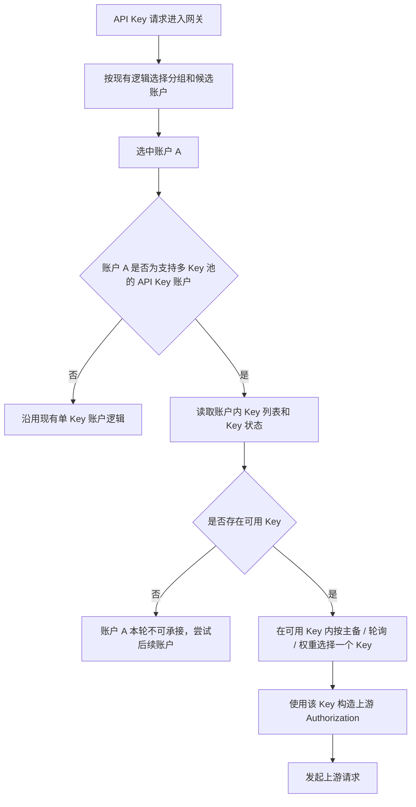
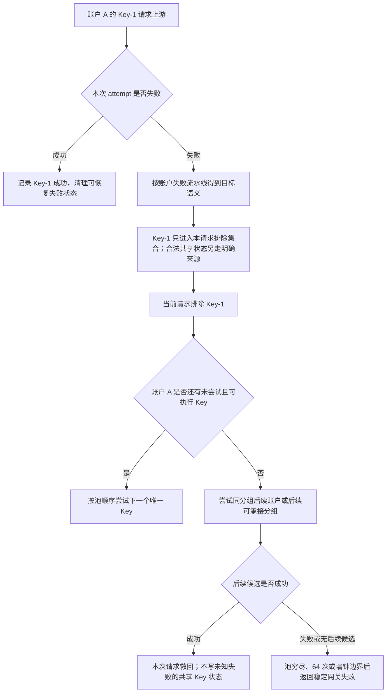

# 账户内 API Key 故障隔离设计

## 文档状态

本文用于说明 GPT API Key 和 OpenAI 兼容 API Key 账户，在同一个账户内配置多个上游 API Key 后的故障隔离、请求内唯一切换和后台恢复逻辑。当前口径是：多个上游 API Key 归属同一个账户，默认主备，也支持轮询 / 权重选择、Key 级运行态、账户内可用 Key 过滤、安全文本请求内按池顺序唯一耗尽、全请求 64 次真实上游 attempt 安全上限、后台单 Key 探测恢复和账户摘要字段；多 Key 账户打开编辑弹窗时自动加载逐 Key 运行态，刷新按钮强制重新读取；人工测试只返回 Key 诊断明细，不初始化、摘除或恢复 Key 运行态。

当前账户列表只接收公共 Key 池汇总，并在可编辑的 owner 多 Key API Key 账户存在非 `disabled` 不可用 Key 时提供“重新验证 Key 池”菜单。该操作只是把符合条件的 Key 安排为到期探测，绝不直接恢复为 `active`；真正恢复仍由后台逐 Key 探测的成功 CAS 写入。授权实例没有此菜单，且请求此动作必须返回 `403`。批量把 Key 状态直接恢复为 `active` 目前未实现，仍是后续独立能力；后续可增强的部分还包括使用记录 / 审计中的 Key 指纹排障字段，以及更完整的运维页面。

## 背景问题

一个 AI 账户内可能配置几十个甚至上百个上游 API Key。当前账户选择逻辑先按分组、授权、模型、账户状态、优先级和调度策略选中一个账户，再在账户内部按主备、轮询或权重选择一个上游 Key。

如果账户内某个 Key 在安全文本推理请求中失败，只尝试一个 Key 会让第三个及后续健康 Key 永远没有救回机会；无边界遍历又会让超大坏 Key 池拖垮请求。因此当前行为是“按池顺序唯一耗尽 + 全请求共享 64 次真实上游 attempt、墙钟和最终响应预留”，而不是固定 1-Key、2-Key 或无界重试。

目标行为应为：

```text
当前请求命中账户 A 的 Key-1
Key-1 发生 opaque 非 2xx 或本地 Key 准备失败
只在当前请求排除 Key-1，按池顺序尝试尚未命中的 Key-2
账户内当前可执行 Key 唯一耗尽后，再切后续账户或分组
真实网关流量只有在任意多 Key 策略中，同一账户另一把 Key 在该失败后返回成功 `2xx` 时，才为失败 Key 同步写短暂共享避让状态
账户 A 内所有已确认不可用 Key 都不可用时，账户 A 才整体不可承接
后台探测已写入运行态的异常 Key，成功后恢复该 Key
```

## 设计原则

账户内 API Key 策略使用 `credentials.api_key_strategy` 表达：`round_robin` 为轮询、`weighted_round_robin` 为权重、`failover` 为主备。三种策略都先过滤处于避让状态的 Key，再按各自顺序选择；完整 HTTP 失败后会在同一请求继续尝试候选 Key。仅当另一把同账户 Key 返回成功 `2xx` 时，失败 Key 才进入 `temporary_unavailable`，在恢复前后续请求直接跳过它。策略的差异只在选择顺序：主备按 `api_keys` 顺序，第一把为主、后续为备用；轮询推进可用 Key 游标；权重在可用集合内平滑加权。管理页面只有主备模式允许通过左侧拖拽调整 `api_keys` 顺序，从而把任意备用 Key 提升为主 Key；运行态状态显示在对应密码输入框的前缀区域，不再占用输入行左侧状态列。

- 适用范围按供应商能力和账户凭据类型双重判断：GPT、通用 OpenAI 兼容供应商以及声明支持账户内 Key 池的 OpenAI-compatible 第三方 `api_key` 账户，并且账户内实际存在 2 个及以上 Key 时，才启用 Key 级故障隔离。GPT OAuth、OpenAI OAuth、Codex OAuth、授权刷新失败、客户端兼容分支和未声明 Key 池能力的供应商都不进入此状态机。
- DeepSeek 第一阶段如果只开放单个 `credentials.api_key` 字段，则不启用账户内 Key 级隔离；如果后续沿用 API Key 池能力，必须由 DeepSeek provider driver 显式声明，并按当前文档只做请求内失败 Key 排除，不把单个 DeepSeek Key 的认证失败、余额不足、限流状态码或文案直接扩散为整个 DeepSeek 账户异常。
- 不新增上游错误码、错误类型、错误文案白名单或黑名单。上游不可控，代码不能假设某个状态码一定代表某种业务原因。
- Key 级共享状态只接受本地可验证的 Key 缺失 / 解密 / 装配 / 运行态读取错误、独立 Key 探针的 `transport_incomplete` 结果、用户显式策略指定的 Key 动作，或任意多 Key 策略中“失败 Key 后继同账户 Key 返回成功 `2xx`”的同账户确认；单个完整 HTTP 响应、协议结构失败和无法绑定到该 Key 的 transport failure 都不能按状态码或正文归咎 Key。
- 真实网关流量不能把未知上游失败写成共享 Key 不可用、客户端 IP 避让或质量失败；高并发、单一坏会话、单一客户端 IP、跨 IP、单类请求或短时上游波动只维护本请求唯一排除集合，避免把其他正常调用方可用的 Key 池打穿。
- 所有请求在当前候选未交付可用结果且下游尚未语义提交时，都在同一账户内按当前池顺序唯一尝试可执行 Key；每个真实发送前同时检查跨账户物理凭据去重、整个请求 64 次 attempt 上限、总墙钟和最终响应预留。图片、音频、文件/资源创建、后台任务、hosted tool 和其他请求不设切号例外，但仍使用各自 lane 的单次 attempt 时限。
- 账户仍是调度、授权、分组、并发、优先级和使用记录的主资源。账户内 Key 不是独立账户，不进入分组绑定，不参与账户候选排序，也不产生独立授权边界。
- 账户整体可用性由账户状态和账户内可用 Key 共同决定：账户本身可调度且至少有一个可用 Key 时，该账户才可承接请求。
- 后台恢复只看“探测成功或失败”这个事实，不按上游错误码分类。异常 Key 的恢复节奏复用账户冷却复测的快速 / 慢速退避语义。
- Key 状态只保存 Key 指纹、运行态和短错误摘要，禁止保存或输出上游 Key 明文。

## 调度流程

### 正常选择



Key 选择只发生在账户已经被选中之后。不可用 Key 会从账户内策略集合中过滤掉：

- 轮询：只在可用 Key 数组里推进。
- 权重：只在可用 Key 集合里做平滑加权轮询，剩余 Key 的权重自然重新归一。
- 主备：按 `api_keys` 当前顺序选择第一个可用 Key；第一个 Key 为主 Key，后续 Key 为备用。主 Key 已被同账户备用成功确认并处于 `temporary_unavailable` 时，后续请求直接从可用备用 Key 开始。
- 所有 Key 都不可用：当前账户派生为不可承接，调度继续尝试后续账户。

### Key 失败



关键边界：

- 如果已经选中 Key 并实际进入上游请求，当前请求可以把它加入请求内失败集合；只有本地 Key 准备失败、独立探针或用户显式 Key 动作才允许改变共享 Key 运行态。
- 如果账户是 OAuth 类型，或供应商未声明支持 API Key 池，失败语义仍完全沿用账户级逻辑，不写 Key 运行态。当前明确不支持 GPT OAuth 进入 Key 池隔离。
- 如果失败发生在选 Key 之前，例如账户没有凭据、账户停用、账户到期、模型过滤、授权不可用、代理配置读取失败等，仍按账户级或本地请求失败处理。
- 非流式或流式已经向下游输出内容后失败时，不能在同一个响应里静默拼接另一个 Key 的结果；本请求停止轮换。客户端下一次请求重新按当前 Key 状态和策略选号，不继承这次请求内排除集合。
- 安全文本请求在同一账户内轮换下一个尚未尝试的可执行 Key，但整个请求最多 64 次真实上游发送；达到上限不等于真实池穷尽，更不能把剩余 Key 或账户标为死亡。
- 流式失败如果尚未产生可见模型输出，只在请求语义允许重放时使用请求内集合切换；不写共享 Key 运行态，避免网络抖动或客户端侧问题误伤 Key 池。语义已经提交，或请求具有外部副作用时，不再轮换。

## 失败语义

Key 级状态不引入新的错误分类。建议规则：

| 现有账户流水线结果 | Key 级处理 |
| --- | --- |
| `complete_success`：协议校验成功且 framing 完整 | 只在与状态来源匹配且完整 generation/claim/config revision/fingerprint CAS 成功时恢复 Key；普通或无 provenance 成功不能越权清理人工 / 显式策略状态 |
| `framing_complete_neutral`：完整非 `2xx`、`2xx-invalid-body` 或 opaque 业务失败 | 先只加入本请求 Key 排除集合并记录有界诊断；任意多 Key 策略中同账户后继 Key 成功时，才将失败 Key 写为 `temporary_unavailable` 并启动恢复窗口 |
| `upstream_failure`：连接 / 硬超时 / 读取中断 / framing 未完成 | 只有独立 Key 探针能把可归因的 `transport_incomplete` 写入该 Key 自动 transport 状态；普通流量默认归入 `protocol_model` / 上游桶传输作用域，安全文本可在本请求切下一个 Key |
| `probe_task_failure` / `stale` / `unknown` | 不计数、不改变 Key 状态，只记录任务诊断并有界重排 |
| 账户错误处理策略精确命中 Key 动作 | 只执行用户明确配置的 Key 副作用；状态动作不控制候选切换准入。任意请求只要未语义提交且仍满足派发阶段、对应 lane 墙钟、候选去重和 attempt 预算，就继续兄弟 Key / 账户 / 分组 |
| 本地 Key 解密、装配或运行态读取失败 | 可建立 Key 级本地电路并在本请求切下一个可执行 Key |
| 客户端取消、慢客户端背压、本地请求错误 | 不写 Key 状态 |

这张表不新增任何状态码或错误文案判断。完整 HTTP 失败和真实 transport failure 都可以结束当前 attempt，但它们的共享作用域不同；不得因为“本请求需要换 Key”就反推“该 Key 已全局死亡”。

## 状态模型

建议新增账户内 Key 运行态表，保存到业务库：

```text
account_api_key_runtime_states
```

建议字段：

| 字段 | 说明 |
| --- | --- |
| `id` | 主键 |
| `system_account_id` | Key 所属物理账户的系统账户 |
| `account_id` | 物理来源账户 ID；授权实例使用来源账户 ID，不使用授权实例账户 ID |
| `key_fingerprint` | 上游 Key 的 HMAC 指纹，不保存明文 |
| `key_index` | 当前凭据列表中的位置，仅用于展示和排序，不能作为唯一身份 |
| `credential_revision` | 凭据版本或凭据列表摘要，用于识别旧状态 |
| `status` | `active` / `unverified` / `temporary_unavailable` / `rate_limited` / `error` / `disabled`；新增或替换后尚未完成后台验证的 Key 为 `unverified`，不可调度，只有后台逐 Key 探针成功后才恢复为 `active` |
| `failure_count` | 独立 Key 探针确认的 `transport_incomplete` 累计次数；完整 framing 中性和任务 unknown 不增加 |
| `consecutive_failures` | 连续独立 `transport_incomplete` 次数 |
| `success_count` | 累计成功次数 |
| `cooldown_until` | 冷却到期时间 |
| `next_probe_at` | 下次后台探测时间 |
| `probe_backoff_seconds` | 当前恢复退避秒数 |
| `recovery_started_at` | 本轮自动恢复观察起点 |
| `last_attempt_at` | 最近一次被真实请求或探测命中时间 |
| `last_success_at` | 最近成功时间 |
| `last_failure_at` | 最近失败时间 |
| `last_error_code` | 短错误码或内部摘要 |
| `last_error_message` | 短错误摘要，不写完整响应体 |
| `last_probe_at` | 最近后台探测时间 |
| `created_at` / `updated_at` | 创建和更新时间 |

索引建议：

- `UNIQUE(account_id, key_fingerprint)`
- `INDEX(account_id, status, cooldown_until)`
- `INDEX(next_probe_at, status)`
- `INDEX(system_account_id, account_id)`

### 指纹规则

- 使用服务端 secret 对上游 Key 做 HMAC，避免明文出现在运行态表、日志或使用记录。
- 同一账户内重复 Key 在保存凭据时应去重；如果仍出现重复，运行态以同一个指纹合并，不把重复值当成两个可调度资源。
- Key 重新排序时，状态跟随 `key_fingerprint`，不跟随 `key_index`。
- Key 被删除后，运行态可以标记为过期并由维护任务清理；同一个 Key 后续重新加入时，可以复用旧状态，也可以在保存凭据时显式重置，具体由编辑行为决定。

## 账户派生可用性

账户是否进入候选仍先看原账户事实：

- `status`
- `schedulable`
- 账户到期
- 时间计划
- 授权可用性
- 模型限制
- 并发和分组调度

在这些条件通过后，再看账户内 Key 池：

| Key 池状态 | 账户派生结果 |
| --- | --- |
| 至少 1 个 Key 可用 | 账户可承接请求 |
| 全部 Key 冷却中 | 账户本轮不可承接，按最早 `cooldown_until` 参与 `Retry-After` 计算 |
| 全部 Key 均非 `active`（包括 `unverified`、`error`、`disabled` 等） | 账户派生为 Key 池不可用，页面显示“全部 Key 不可用” |
| 部分 Key 不可用 | 账户仍可承接，请求只在可用 Key 内轮询 / 加权 |

不要在 Key 状态变化时覆盖 `accounts.status`。账户物理状态继续表达账户本身的停用、异常、到期、待检查等事实；Key 池不可用只作为 `effectiveAvailability` 的派生阻断原因返回给网关和前端。即使所有 Key 长期处于不可执行状态，也保持 Key 来源和账户业务状态分离；只有用户显式账户级动作或独立账户状态来源才允许写账户硬异常。

## 后台探测

新增默认 worker 任务：

```text
account-api-key-cooldown-retest
```

职责：

- 扫描 `temporary_unavailable`、`rate_limited` 和可自动恢复的 `error` Key。
- `unverified` 与上述非 `active`、非 `disabled` 状态同样属于可探测 Key；公共汇总的 `nextProbeAt` 取所有这类 Key 的最早 `next_probe_at`，用于准确显示全 `unverified` Key 池的最早复测时间。
- 到达 `next_probe_at` 后，固定命中该账户的该 Key 发起真实探测。
- 探测走账户自己的 Base URL、代理、账号协议能力、支持模型和当前网关请求链路。
- 探测使用统一结果：协议校验成功且 framing 完整为 `complete_success`；连接 / hard timeout / 读取中断 / framing 未完成为 `upstream_failure(transport_incomplete)`；完整 HTTP/SSE 但协议未成功为 `framing_complete_neutral`；任务、本地配置、解密、stale 或无法归因为 `probe_task_failure/unknown`。
- success 只在 claim token、fingerprint、配置 revision、凭据代次和状态来源 CAS 全部匹配时恢复为 `active`，清理退避和最近错误。
- transport failure 按账户冷却复测的快速 / 慢速退避继续延长 `next_probe_at`；neutral defer 保持状态并有界延后，不增加失败次数；任务失败 / stale / unknown 不改变状态或计数。
- 只有连续独立 `transport_incomplete` 超过 `cooldownAccountRetestMaxBackoffHours` 后，Key 才可按明确状态来源转为 `error`，等待人工恢复或更低频探测；不得用上游 status/body 推断凭据失效、授权失败、限流或服务故障。

运行保护：

- 全局并发和单账户并发都必须有限制，例如全局 5、单账户 1，避免 100 个 Key 同时探测压垮上游。
- 手动停用、账户到期、账户删除、Base URL 不合法、代理不可用、授权来源不可用时不探测 Key。
- `pending_test` 账户进入后台激活检查；激活检查按系统 Key 池策略验证账户，至少一个 Key 得到 `complete_success` 时账户可进入 `active`。只有独立 Key 探针的 `transport_incomplete` 才可写对应自动 transport 运行态并进入恢复队列；完整 HTTP / 协议失败保持中性。
- 探测使用 `traffic_source = cooldown_retest`，不进入业务用量统计或账户质量统计。
- 探测记录可以在使用记录和审计里带 `key_fingerprint`，但不写明文 Key。

## 显式账户测试

手动账户测试、账户列表里的单项测试和新增 / 编辑草稿测试都可以返回同一套 Key 池诊断明细：

- 只有 `api_key` 账户、供应商支持 Key 池隔离且账户内实际存在 2 个及以上 Key 时，才启用批测；单 Key 账户、OAuth 账户和未支持的供应商仍走原账户测试链路。
- 单个账户最多保存 10 个 API Key；超过上限的保存请求必须报错，不得静默截断或迁移已有数据。
- 批测会固定每个上游 Key 发起诊断网关测试请求（只对诊断 deadline 超时证据按阶段重试），仍使用账户自己的 Base URL、代理、协议能力、模型限制、分组上下文和请求形态。
- 账户级测试通过条件为“至少 1 个 Key 可用”，不要求全部 Key 通过。
- 多 Key 后台健康检查命中 `complete_success` 时，必须保留实际成功的 winner Key 指纹和位置；账户健康成功 CAS 完成后，仅可在同一 `config_revision` 与观测时间围栏下把该 winner 的任意非 `disabled` 运行态写为 `active`，包括 `unverified`、冷却、限流和错误态。探测候选为了固定命中目标 Key 可以绕过调度过滤，但状态写回不得携带该旁路标记；日志、审计和 UI 仍只保留 Key 指纹，绝不保留明文。
- 多 Key 人工测试按阶段执行：阶段一每 Key 10 秒，阶段二仅接收阶段一已形成真实上游尝试且诊断 deadline 超时的 Key（20 秒），阶段三同理（30 秒）；每阶段最多 3 个并发、任务完成即补位。完整 HTTP、协议、连接 / 读取、本地配置 / 任务失败和用户取消均不升级阶段。
- 任一 Key 成功即账户测试成功，立即停止派发并取消尚在运行的兄弟请求；主动取消和未启动 Key 不计为失败或超时，也不进入后续阶段。
- 已保存账户、授权实例和来源账户的人工测试都不写成功或失败 Key 运行态，不推进 Key 轮换，不修改账户派生可用性。
- 创建账户前的草稿测试只返回诊断结果；保存账户不接受测试任务 ID 作为激活或 Key 状态凭证。
- 草稿编辑已保存账户时可以诊断当前表单内的 Key 池，但保存前后都不复用人工结果更新真实账户 Key 运行态。
- 批测失败时，如果 0 个 Key 可用，则账户测试失败；该结果不直接把整个账户写成临时不可调用，由 Key 级状态和待检查 / 人工处理流程表达。
- 账户页面不提供多账户批量测试；这里的“批测”只表示单个多 Key 账户内部返回逐 Key 诊断。

### 新增 / 编辑后的 Key 探测

对已激活的多 Key 账户，Key 集合变更必须区分账户级连接变化和 Key 级增量变化：

- 仅新增、删除、替换或重排 Key 时，按 Key 指纹比较变更前后集合。只要至少一个变更前已验证为 `active` 且变更后仍存在的 Key 保留，账户继续保持原有 `status` 与 `schedulable`，不触发账户级待检查或账户级健康检查；已存在运行态行的 `key_index` 随新顺序同步，避免管理页按位置错贴状态。
- 新增或替换得到的 Key 初始为 `unverified`，在独立 Key 探测完成前不得进入生产选择器；探测成功后才转为 `active`。该 Key 的探测失败不得覆盖仍可用的账户状态。
- 只有所有此前正常 Key 都被删除或替换时，才将账户转入 `pending_test` 并执行激活检查。Base URL、代理、协议能力、检查模型或检查请求形态变化会影响全部 Key，始终属于账户级检查。
- 多 Key 账户的后台账户健康检查必须固定探测 Key 池中的当前可执行成员，任一 `complete_success` 即为账户级成功。不得把普通轮询恰好命中一个失败 Key 的结果作为账户级失败事实。

为了避免 100 个新 Key 全部异常但只能靠用户请求逐个发现，新建和关键 Key 配置变更由后台系统检查承担：

- 创建账户先保存为 `pending_test`，后台激活检查按系统策略检查 Key 池；至少一个 Key 得到 `complete_success` 后账户才进入 `active`。完整 framing 中性 Key 只保留诊断，只有独立 `transport_incomplete` Key 才写自动 transport 运行态并等待后台恢复。
- 已保存账户新增或替换 Key 后，由后台 Key 检查初始化或更新对应运行态，不使用人工测试结果。
- 关键凭据编辑保存后进入 `pending_test` 并投递后台激活检查；单纯人工测试不会改变当前账户或 Key 的生产状态。
- 真实网关请求只使用当前可执行 Key；安全文本请求可以按请求内唯一集合逐 Key 尝试，但仍共享 64 次 attempt、墙钟和最终响应预留，不能用它替代后台 Key 初始化检查。

后台新增 Key 检查必须保持低并发且不阻塞保存：

- 保存多 Key 账户后，新增 Key 初始状态为 `unverified`，不能在后台验证前直接加入生产可用 Key 池。
- 投递低并发后台检测任务，对新增或未验证 Key 做系统探测。
- 批量探测不阻塞保存，不阻塞账户编辑弹窗提交。
- 批量探测按统一三态写回：`complete_success` 可激活或按匹配来源恢复，`upstream_failure(transport_incomplete)` 可按 Key 自动 transport 状态来源进入退避，`framing_complete_neutral` 只诊断 / 顺延；`probe_task_failure/stale/unknown` 不计数不改状态。不得按状态码或正文写冷却 / 异常。
- 批量探测成功只更新 Key 成功时间和验证状态。

## 与现有能力的关系

### 账户错误处理策略

Key 级隔离复用账户错误处理策略的匹配结果，但不新增 Key 级规则编辑器。账户上配置了错误处理规则时：

- 规则匹配仍发生在账户层。
- 规则结果应用到本次命中的 Key。
- 如果账户只有一个 Key，效果近似现有账户级冷却。
- 如果账户有多个 Key，失败 Key 被摘除，账户内其他 Key 继续承接后续请求。
- DeepSeek 多 Key 场景同样遵守请求内唯一排除。401 / 403 / 余额不足 / 限流 / 资源不足等上游响应只可作为用户显式账户错误策略的匹配输入；未命中显式策略时不得写 Key 共享运行态，更不能按固定状态码把整个 DeepSeek 账户写死为异常。

### 账户内主备 / 轮询 / 权重

Key 状态过滤发生在策略选择之前：

```text
全部 Key -> 过滤不可用 Key -> 在可用 Key 内按主备 / 轮询 / 权重选择
```

高权重 Key 冷却后，剩余 Key 的权重重新计算；恢复后自动重新进入权重集合。

### 会话亲和

会话亲和仍绑定到账户，不绑定到具体 Key。上游 API Key 不承担独立会话身份，避免同一个账户内 Key 状态变化导致会话亲和碎片化。

如果某次亲和账户内选中的 Key 在安全文本请求中失败，当前请求按请求内唯一集合继续救回；后续同会话的新请求按当时轮询/权重、共享 Key 状态和全局游标重新选择，不保证机械使用“上次下一个”Key。

### 授权实例账户

授权实例账户使用来源账户的真实上游凭据。Key 运行态应绑定到来源物理账户：

```text
source_account_id + key_fingerprint
```

被授权用户的请求命中来源账户某个 Key 后，opaque HTTP/transport 失败先只影响当前请求；任意多 Key 策略中同一来源账户另一把 Key 成功时，失败 Key 才可按来源物理 Key 写入 `temporary_unavailable`。其他本地 Key 准备电路、独立 Key 探针或用户显式 Key 动作形成的合法共享状态同样归属来源物理 Key；授权实例自己的状态、授权额度和分组绑定不因此被覆盖。

分层处理规则：

- 物理来源账户：保存真实上游凭据，拥有 Key 池运行态；Key 成功、失败、探测恢复都写到来源账户。
- 授权实例账户：只表达被授权方的本地调度、授权额度、绑定状态和实例级避让；不复制 Key 池状态，也不把某个 Key 当成被授权方自己的资源。
- 分组绑定：仍只决定账户是否进入某个分组和本地优先级；不产生 Key 维度授权边界。
- 对外 API Key：只绑定路由策略和授权调用方；不绑定上游 Key，也不感知上游 Key 明文。

### 使用记录和审计

建议在使用记录或审计 metadata 中增加可选字段：

```text
account_api_key_fingerprint
account_api_key_index
```

用途：

- 排查某个账户内是否固定某个 Key 出错。
- 支持后台探测和真实请求关联。
- 不暴露上游 Key 明文。

统计聚合不需要按 Key 维度默认展示，避免增加业务统计成本。Key 维度只作为排障 metadata。

## 前端与运维展示

账户列表建议展示轻量摘要：

```text
API Key：13 个，正常 10，冷却 2，异常 1
```

编辑弹窗中每个 Key 行可展示：

- 状态标签：正常、冷却中、异常、检测中。
- 权重输入。
- 最近失败摘要。
- 最近探测时间。
- 单个 Key 恢复 / 禁用 / 删除。
- 批量删除全部 Key。
- 后续规划的批量恢复 Key 状态（当前列表“重新验证 Key 池”不等同于此动作）。
- 可选“后台检测全部 Key”按钮。

第一阶段不必做完整 Key 维度统计页面，只要让用户能看到“哪些 Key 被摘掉”和“为什么账户整体不可用了”。

## 边界情况

### 100 个 Key 全部失败

- 安全文本请求按池顺序最多发出全请求共享的 64 次唯一真实上游 attempt，不会无界尝试 100 次。
- 64 次安全截断必须记录为 budget exhaustion；未尝试的 36 个 Key 保持未知，不能被标成不可用，也不能把账户写成“全部 Key 死亡”。
- 下一次客户端请求重新按当前策略、轮换游标、Key 运行态和请求预算选择，不继承上次请求内失败集合。
- 只有后台/显式状态已经证明所有当前 Key 均不可执行时，账户才派生为不可承接；未知 HTTP 响应本身不能形成该证明。

### 账户只有一个 Key

第一阶段可以保持单 Key 账户继续走现有账户级状态，避免引入重复状态。也可以统一创建 Key 状态；但 UI 和调度上应表现为和当前账户级冷却一致。

### 只有一个账户、多个 Key

如果唯一账户的当前 Key 在安全文本请求中形成请求级失败，继续按池顺序尝试尚未命中的可执行 Key，直到成功、真实池穷尽、64 次安全上限、总墙钟或最终响应预留到期。新请求重新计算当前 Key 顺序，不机械从上次失败位置续跑。

### 坏请求导致上游失败

坏请求如果穿过本地校验并让多个上游返回错误，只能扩大本请求的 Key/账户排除集合；单个失败、池穷尽或无后继成功时不得写 Redis 短避让、跨请求 IP 避让、Key 冷却或共享质量失败。相同坏会话并发也只是一份请求语义证据，不能把整个 Key 池逐个写死。用户显式配置的 Key 状态动作是唯一例外；无论是隐式轮换还是显式 `retry_next`，都只能在同账户另一把 Key 后继成功后才将此前失败 Key 写为 `temporary_unavailable`，并保留该确认来源用于匹配恢复。任意完整 HTTP 非 2xx（无论是否命中 `retry_next`）保留请求内 Key 轮换并投递独立账户健康检查，但不得触发来源级跨请求避让；来源级避让仅接受连接、读取、超时等 transport 失败的独立证据。

### Key 删除、替换和排序

- 删除 Key 后，对应运行态不再参与调度，可由维护任务清理。
- 替换 Key 会产生新指纹，旧状态不影响新 Key。
- 重排 Key 不应重置状态，因为状态跟随指纹。
- 权重数组按当前 Key 顺序保存；状态按指纹关联。

### 并发竞态

多个请求可能在同一时刻选到同一个 Key。请求内失败集合彼此隔离，某个请求的未知 HTTP 失败不能影响其他在途或后续请求；只有本地 Key 电路、独立探针或用户显式策略形成的共享状态才参与并发可见性。

落地时应保证：

- 合法共享 Key 状态写入后立即失效网关运行时缓存；请求内排除不发布全局失效。
- 后续新请求不再选择该 Key。
- 在途请求自然完成，不主动中断。
- 在途成功只有在匹配来源的独立 Key 探针 `complete_success`、claim/generation/config revision/fingerprint CAS 全部满足时，才可以清理该 Key 的自动 transport 状态；普通或迟到网关成功不能恢复共享 Key 状态，也不能恢复已经被人工禁用的 Key。

### 上游公共故障

如果同一个 Base URL 或代理出现本地 transport 故障，只记录可归因的 transport bucket；不能因为共享地址、代理或完整上游 HTTP 结果把多个 Key 逐个标记不可用。上游桶运行态仍可在候选排序层做有界 transport 避让；Key 级状态只接受独立 Key 探针或显式 Key 动作。

### Redis 生产运行态

生产 `runtimeStateDriver=redis` 时，普通完整 HTTP 失败不写 `accountId + Key 指纹` 的 Redis 短暂避让；只有任意多 Key 策略中后继同账户 Key 成功确认时，才同时写入持久 `temporary_unavailable` 和带 generation fencing 的 Redis 短暂避让。Key 选择使用一次批量读取合并数据库持久状态与 Redis 状态，禁止逐 Key 查询 Redis，也禁止 Redis 故障时把未确认失败回退写数据库状态。

后台冷却复测按上述来源与 CAS 契约处理；人工测试、草稿测试和模型检测始终无状态。探针任务自身异常、stale、配置 / 解密错误或没有形成可归因的完整上游尝试时，不得写 Key 失败。

### 编辑页运行明细

逐 Key 运行明细通过 owner-only、`Cache-Control: no-store` 的轻量接口读取，不进入账户列表批量快照，也不向授权实例暴露。前端仅在账户 ID、配置版本和保存时 Key 顺序均一致时展示状态；编辑、增删或重排 Key 后立即隐藏旧状态，避免按位置错贴。

账户列表及其状态快照只返回 `total`、`active`、`temporaryUnavailable`、`rateLimited`、`error`、`disabled`、`unavailable`、`allUnavailable` 和可选 `nextProbeAt`。它们不得返回 Key 指纹、Key 明细、`lastFailureAt`、错误码、错误消息、trace 或任何逐 Key 诊断；诊断只属于 owner 显式展开的运行明细接口。

### 手动恢复

账户“恢复正常”需要明确是否同时恢复 Key 状态。当前列表的“重新验证 Key 池”不是状态恢复：它只让无有效 probe lease 的 `unverified`、`temporary_unavailable`、`rate_limited` 或 `error` Key 尽快进入后台探测，`active` 与 `disabled` Key 不变；账户不处于 `active`、不可调度、版本冲突或没有候选时不写入。

后续若单独实现人工 Key 状态恢复，建议：

- 默认只恢复账户级状态。
- 在多 Key 账户弹窗中提供“批量恢复 Key 状态”。
- 如果账户派生不可用原因是全部 Key 不可用，恢复账户时应提示用户同时恢复或检测 Key，否则账户仍会派生不可承接。

## 影响评估

### 正向影响

- 一个坏 Key 不再导致账户周期性失败。
- 100 个 Key 全坏时，单次用户请求不会等待 100 次失败。
- 多 Key 账户仍是一个账户，不破坏现有分组、授权、切号和统计边界。
- 后台可自动恢复误伤或短暂波动的 Key。

### 成本和风险

- 网关运行时需要读取 Key 状态，必须进入缓存快照或轻量批量查询，不能每次请求逐 Key 查库。
- Key 状态变化需要触发网关运行缓存失效。
- 不做错误分类会带来误伤风险，但符合当前账户错误处理原则，依赖后台快速恢复和手动恢复兜底。
- UI 需要展示 Key 池摘要，否则用户只看到“账户不可用”但不知道是哪些 Key 被摘除。
- 授权实例只共享具有明确来源和 CAS 的物理 Key 状态；单个被授权用户的 opaque HTTP/transport 失败不得写入该共享层。合法的本地 Key 准备电路、独立探针或用户显式动作会影响其他使用者，审计必须保留状态来源和触发实例。

## 落地阶段

### 第一阶段：核心调度和状态

- 新增 Key 指纹工具和运行态表。
- 网关运行时读取 Key 状态。
- 账户内选择器过滤不可用 Key 后再按主备 / 轮询 / 权重选择。
- 本地 Key 准备失败、独立探针、用户显式 Key 动作，或任意多 Key 策略中后继同账户 Key 成功确认，才能写共享 Key 状态；未确认的 opaque 完整 HTTP 失败只写请求内排除集合。
- 安全文本请求按池顺序唯一尝试当前可执行 Key，再切后续账户，并与所有账户共享 64 次真实 attempt 和墙钟上限。
- 所有 Key 不可用时派生账户不可承接。
- 补真实 mock AI 回归：66/100 Key 中只发送前 64 个唯一物理凭据，预算截断不把剩余 Key 或账户写死。

### 第二阶段：后台恢复

- 新增 Key 冷却复测 worker。
- 复用账户冷却快速 / 慢速退避。
- 探测成功恢复 Key，失败延长退避。
- 增加缓存失效和使用记录 / 审计 metadata。

### 第三阶段：前端可视化（后续规划）

- 账户列表展示 Key 池摘要。
- 编辑弹窗每个 Key 展示状态、最近失败、最近探测。
- 评估提供单 Key 恢复、批量恢复、批量检测；当前已实现的列表“重新验证 Key 池”不等同于批量恢复。
- 保持批量删除只删除 Key 输入，不误删账户。

## 验证要求

必须新增或扩展回归：

- 单账户 3 Key 轮询，当前安全文本请求可以从失败 Key 切到后续健康 Key；下一次请求按当前轮询/权重和状态重新计算，不继承请求内失败集合。
- 权重模式中过滤失败 Key 后，剩余 Key 权重重新生效。
- 3 Key、6 Key 和 66/100 Key 池按顺序唯一尝试；整个请求第 64 次后安全截断，未尝试 Key 保持未知。
- 跨账户重复物理凭据只发送一次；真实池穷尽、64 次安全截断和墙钟截断使用可区分终态。
- 所有 Key 不可用时账户派生不可承接。
- 后台探测成功后 Key 恢复并重新进入主备 / 轮询 / 权重集合。
- 授权实例普通请求的 opaque HTTP、协议或 transport 结果不更新来源账户共享 Key 状态，也不覆盖授权实例账户状态；只有本地 Key 准备电路、独立 Key 探针、用户显式 Key 动作，或任意多 Key 策略中同来源另一把 Key 成功确认，才能按来源、generation 与 CAS 更新来源物理 Key。
- Key 删除、重排、替换后状态关联正确。
- 使用记录和审计不出现上游 Key 明文。

## 不做范围

第一阶段不做这些能力：

- 不做上游错误码 / 错误文案分类。
- 不做 Key 级独立授权、独立分组、独立并发池。
- 不把每个上游 Key 展开成 AI 账户。
- 不按 Key 维度做业务用量聚合或额度扣减。
- 不支持同一次请求无界遍历账户内 Key；安全文本只允许在 64 次真实 attempt、物理凭据去重和墙钟边界内唯一尝试。
- 不为 Key 级状态引入 Redis 全局锁；多实例持久探针通过业务库原子 claim token、租约和完整 generation/fingerprint CAS 互斥。Redis 只承接已由同账户另一把 Key 成功确认的短暂避让，不承接未确认的 opaque HTTP 失败。
