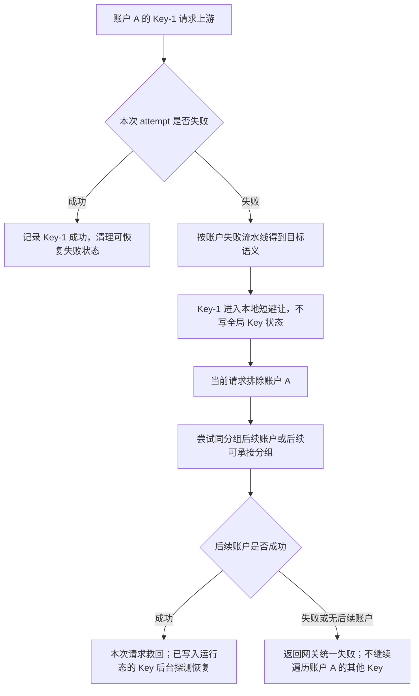

# 账户内 API Key 故障隔离设计

## 文档状态

本文用于说明 GPT API Key 和 OpenAI 兼容 API Key 账户，在同一个账户内配置多个上游 API Key 后的故障隔离、切号和后台恢复逻辑。当前第一阶段已落地：多个上游 API Key 归属同一个账户，支持轮询 / 权重选择，支持显式账户测试批量探测 Key 池，支持 Key 级运行态、失败摘除、账户内可用 Key 过滤、当前请求切后续账户、后台单次探测恢复和账户摘要字段。

后续仍可增强的部分包括：编辑弹窗逐 Key 状态展示、批量恢复 Key 状态、使用记录 / 审计中的 Key 指纹排障字段，以及更完整的运维页面。

## 背景问题

一个 AI 账户内可能配置几十个甚至上百个上游 API Key。当前账户选择逻辑先按分组、授权、模型、账户状态、优先级和调度策略选中一个账户，再在账户内部按轮询或权重选择一个上游 Key。

如果账户内某个 Key 不可用，不能在一次用户请求里把这个账户内的所有 Key 都试一遍。否则 100 个 Key 都异常时，单次请求会等待大量上游失败、重试和超时，用户体验不可接受。

目标行为应为：

```text
当前请求命中账户 A 的 Key-1
Key-1 失败
先把 Key-1 记入网关进程内短避让
当前请求切到后续账户，不继续遍历账户 A 的其他 Key
真实网关流量不因上游状态码、错误码、错误类型或跨来源失败写全局 Key 运行态
账户 A 内所有已确认不可用 Key 都不可用时，账户 A 才整体不可承接
后台探测已写入运行态的异常 Key，成功后恢复该 Key
```

## 设计原则

- 适用范围按供应商能力和账户凭据类型双重判断：GPT、通用 OpenAI 兼容供应商以及声明支持账户内 Key 池的 OpenAI-compatible 第三方 `api_key` 账户，并且账户内实际存在 2 个及以上 Key 时，才启用 Key 级故障隔离。GPT OAuth、OpenAI OAuth、Codex OAuth、授权刷新失败、客户端兼容分支和未声明 Key 池能力的供应商都不进入此状态机。
- DeepSeek 第一阶段如果只开放单个 `credentials.api_key` 字段，则不启用账户内 Key 级隔离；如果后续沿用 API Key 池能力，必须由 DeepSeek provider driver 显式声明，并按当前文档只隔离失败 Key，不把单个 DeepSeek Key 的认证失败、余额不足或限流直接扩散为整个 DeepSeek 账户异常。
- 不新增上游错误码、错误类型、错误文案白名单或黑名单。上游不可控，代码不能假设某个状态码一定代表某种业务原因。
- Key 级失败语义复用账户级失败策略：如果现有账户失败流水线会把本次命中的账户视为需要避让、冷却或待确认，那么多 Key 账户中应先把本次命中的 Key 视为失败对象。
- 真实网关流量不能把上游失败直接写成全局 Key 不可用；高并发、单一客户端 IP、跨 IP、单类请求或短时上游波动都只进入进程内短避让和来源级避让，避免把其他正常调用方可用的 Key 池打穿。
- 当前请求内一个账户最多消费一个上游 Key。Key 失败后当前请求切后续账户，不在同一账户内继续尝试剩余 99 个 Key。
- 账户仍是调度、授权、分组、并发、优先级和使用记录的主资源。账户内 Key 不是独立账户，不进入分组绑定，不参与账户候选排序，也不产生独立授权边界。
- 账户整体可用性由账户状态和账户内可用 Key 共同决定：账户本身可调度且至少有一个可用 Key 时，该账户才可承接请求。
- 后台恢复只看“探测成功或失败”这个事实，不按上游错误码分类。异常 Key 的恢复节奏复用账户冷却复测的快速 / 慢速退避语义。
- Key 状态只保存 Key 指纹、运行态和短错误摘要，禁止保存或输出上游 Key 明文。

## 调度流程

### 正常选择


Key 选择只发生在账户已经被选中之后。不可用 Key 会从账户内策略集合中过滤掉：

- 轮询：只在可用 Key 数组里推进。
- 权重：只在可用 Key 集合里做平滑加权轮询，剩余 Key 的权重自然重新归一。
- 所有 Key 都不可用：当前账户派生为不可承接，调度继续尝试后续账户。

### Key 失败



关键边界：

- 如果已经选中 Key 并实际进入上游请求，后续失败归属于当前 Key 的运行态。
- 如果账户是 OAuth 类型，或供应商未声明支持 API Key 池，失败语义仍完全沿用账户级逻辑，不写 Key 运行态。当前明确不支持 GPT OAuth 进入 Key 池隔离。
- 如果失败发生在选 Key 之前，例如账户没有凭据、账户停用、账户到期、模型过滤、授权不可用、代理配置读取失败等，仍按账户级或本地请求失败处理。
- 非流式或流式已经向下游输出内容后失败时，不能在同一个响应里静默拼接另一个 Key 的结果；只标记当前 Key 后续避让，让客户端或下一次请求重新尝试。
- 当前请求不在同一账户内轮换下一个 Key。这样 100 个 Key 全部异常时也不会把一次请求拖成 100 次上游失败。
- 流式失败如果尚未产生可见模型输出，沿用账号级“跳过副作用”边界，不写 Key 运行态，避免网络抖动或客户端侧问题误伤 Key 池。

## 失败语义

Key 级状态不引入新的错误分类。建议规则：

| 现有账户流水线结果 | Key 级处理 |
| --- | --- |
| 上游 attempt 成功 | Key 标记成功，清理该 Key 的可恢复失败计数 |
| 账户错误处理策略命中 `retry_next` 或未命中规则 | 网关真实流量只进入本地短避让，不写全局 Key 运行态 |
| 账户错误处理策略命中 `temporary_unavailable` | 网关真实流量只进入本地短避让，不写全局 Key 运行态 |
| 账户错误处理策略命中 `rate_limited` | 网关真实流量只进入本地短避让，不写全局 Key 运行态 |
| 账户错误处理策略命中 `error` | 网关真实流量仍只进入本地短避让；后台探测、人工禁用或非网关管理链路才可以写全局 Key `error` |
| 客户端取消、慢客户端背压、本地请求错误 | 不写 Key 状态 |

这张表只复用“账户流水线已经得到的结果”，不新增任何状态码或错误文案判断。上游返回什么错误不重要，重要的是现有账户流水线是否已经把这次 attempt 当成上游失败。

## 状态模型

建议新增账户内 Key 运行态表，保存到业务库：

```text
account_api_key_runtime_states
```

建议字段：

| 字段 | 说明 |
| --- | --- |
| `id` | 主键 |
| `system_account_id` | Key 所属物理账户的系统账户 |
| `account_id` | 物理来源账户 ID；授权实例使用来源账户 ID，不使用授权实例账户 ID |
| `key_fingerprint` | 上游 Key 的 HMAC 指纹，不保存明文 |
| `key_index` | 当前凭据列表中的位置，仅用于展示和排序，不能作为唯一身份 |
| `credential_revision` | 凭据版本或凭据列表摘要，用于识别旧状态 |
| `status` | `active` / `temporary_unavailable` / `rate_limited` / `error` / `disabled` |
| `failure_count` | 累计失败次数 |
| `consecutive_failures` | 连续失败次数 |
| `success_count` | 累计成功次数 |
| `cooldown_until` | 冷却到期时间 |
| `next_probe_at` | 下次后台探测时间 |
| `probe_backoff_seconds` | 当前恢复退避秒数 |
| `recovery_started_at` | 本轮自动恢复观察起点 |
| `last_attempt_at` | 最近一次被真实请求或探测命中时间 |
| `last_success_at` | 最近成功时间 |
| `last_failure_at` | 最近失败时间 |
| `last_error_code` | 短错误码或内部摘要 |
| `last_error_message` | 短错误摘要，不写完整响应体 |
| `last_probe_at` | 最近后台探测时间 |
| `created_at` / `updated_at` | 创建和更新时间 |

索引建议：

- `UNIQUE(account_id, key_fingerprint)`
- `INDEX(account_id, status, cooldown_until)`
- `INDEX(next_probe_at, status)`
- `INDEX(system_account_id, account_id)`

### 指纹规则

- 使用服务端 secret 对上游 Key 做 HMAC，避免明文出现在运行态表、日志或使用记录。
- 同一账户内重复 Key 在保存凭据时应去重；如果仍出现重复，运行态以同一个指纹合并，不把重复值当成两个可调度资源。
- Key 重新排序时，状态跟随 `key_fingerprint`，不跟随 `key_index`。
- Key 被删除后，运行态可以标记为过期并由维护任务清理；同一个 Key 后续重新加入时，可以复用旧状态，也可以在保存凭据时显式重置，具体由编辑行为决定。

## 账户派生可用性

账户是否进入候选仍先看原账户事实：

- `status`
- `schedulable`
- 账户到期
- 时间计划
- 授权可用性
- 模型限制
- 并发和分组调度

在这些条件通过后，再看账户内 Key 池：

| Key 池状态 | 账户派生结果 |
| --- | --- |
| 至少 1 个 Key 可用 | 账户可承接请求 |
| 全部 Key 冷却中 | 账户本轮不可承接，按最早 `cooldown_until` 参与 `Retry-After` 计算 |
| 全部 Key 为 `error` / `disabled` | 账户派生为 Key 池不可用，页面显示“全部 Key 不可用” |
| 部分 Key 不可用 | 账户仍可承接，请求只在可用 Key 内轮询 / 加权 |

建议不要在每次 Key 状态变化时立即覆盖 `accounts.status`。账户物理状态继续表达账户本身的停用、异常、到期、待测试等事实；Key 池不可用作为 `effectiveAvailability` 的派生阻断原因返回给网关和前端。只有当所有 Key 长时间探测失败并超过自动恢复观察窗口时，才考虑把账户标记为硬异常，且必须保证后台 Key 探测成功后可以恢复该派生阻断。

## 后台探测

新增默认 worker 任务：

```text
account-api-key-cooldown-retest
```

职责：

- 扫描 `temporary_unavailable`、`rate_limited` 和可自动恢复的 `error` Key。
- 到达 `next_probe_at` 后，固定命中该账户的该 Key 发起真实探测。
- 探测走账户自己的 Base URL、代理、账号协议能力、支持模型和当前网关请求链路。
- 探测只看成功或失败，不按状态码、错误码、错误文案分类。
- 探测成功后把 Key 恢复为 `active`，清理退避和最近错误。
- 探测失败后按账户冷却复测的快速 / 慢速退避继续延长 `next_probe_at`。
- 探测超过 `cooldownAccountRetestMaxBackoffHours` 后，Key 可转为 `error`，等待人工恢复或更低频探测。

运行保护：

- 全局并发和单账户并发都必须有限制，例如全局 5、单账户 1，避免 100 个 Key 同时探测压垮上游。
- 手动停用、账户到期、账户删除、Base URL 不合法、代理不可用、授权来源不可用时不探测 Key。
- `pending_test` 账户不进入自动恢复；待测试仍由手动账户测试或创建时成功测试决定。
- 探测使用 `traffic_source = cooldown_retest`，不进入业务用量统计或账户质量统计。
- 探测记录可以在使用记录和审计里带 `key_fingerprint`，但不写明文 Key。

## 显式账户测试

手动账户测试、账户列表里的单项测试、批量账户测试和创建账户前的草稿测试，都复用同一套 Key 池批测规则：

- 只有 `api_key` 账户、供应商支持 Key 池隔离且账户内实际存在 2 个及以上 Key 时，才启用批测；单 Key 账户、OAuth 账户和未支持的供应商仍走原账户测试链路。
- 批测会固定每个上游 Key 各发起一次真实网关测试请求，仍使用账户自己的 Base URL、代理、协议能力、模型限制、分组上下文和请求形态。
- 账户级测试通过条件为“至少 1 个 Key 可用”，不要求全部 Key 通过。
- 已保存账户测试会把成功 Key 写入 `active` 运行态，把失败 Key 写入 `temporary_unavailable` 并进入后台恢复；这样后续真实请求优先使用已验证可用的 Key。
- 创建账户前的草稿测试不提前写未保存账户的运行态；测试结果会携带 Key 池明细，保存账户并引用该成功草稿测试任务后，再把成功 / 失败状态应用到新账户真实 ID。
- 草稿编辑已保存账户时也会批测当前表单内的 Key 池，但不会在保存前直接覆盖真实账户运行态，避免未保存凭据影响线上调度。
- 批测失败时，如果 0 个 Key 可用，则账户测试失败；该结果不直接把整个账户写成临时不可调用，由 Key 级状态和待测试 / 人工处理流程表达。

### 新增 / 编辑后的 Key 探测

为了避免 100 个新 Key 全部异常但只能靠用户请求逐个发现，当前由显式账户测试承担新 Key 批量探测入口：

- 创建账户时，如果草稿里有多个 Key，必须先完成草稿测试，且至少一个 Key 可用，才可以直接创建为正常账户；失败 Key 会在保存后进入后台恢复。
- 已保存账户可以通过列表单项测试或批量测试触发 Key 池批测，失败 Key 会被摘除并等待后台恢复。
- 真实网关请求只使用当前可用 Key，不在首个用户请求里遍历账户内全部 Key。

后续如果需要“保存编辑后自动异步检测新增 Key”，可以在不阻塞保存的基础上新增低并发后台任务：

- 保存多 Key 账户后，新增 Key 初始状态为 `active` 或 `unverified`。
- 可选投递低并发后台检测任务，对新增或未验证 Key 做批量探测。
- 批量探测不阻塞保存，不阻塞账户编辑弹窗提交。
- 批量探测失败按同一 Key 级状态规则写入冷却或异常。
- 批量探测成功只更新 Key 成功时间和验证状态。

第一阶段可以只做异常 Key 的后台恢复；如果真实使用中大量导入坏 Key，再补“新增后批量检测”。

## 与现有能力的关系

### 账户错误处理策略

Key 级隔离复用账户错误处理策略的匹配结果，但不新增 Key 级规则编辑器。账户上配置了错误处理规则时：

- 规则匹配仍发生在账户层。
- 规则结果应用到本次命中的 Key。
- 如果账户只有一个 Key，效果近似现有账户级冷却。
- 如果账户有多个 Key，失败 Key 被摘除，账户内其他 Key 继续承接后续请求。
- DeepSeek 多 Key 场景同样只摘除当前命中的 Key。401 / 403 / 余额不足 / 限流 / 资源不足等上游响应仍先作为账户错误处理策略和 Key 级运行态输入；代码不能按固定状态码把整个 DeepSeek 账户写死为异常。

### 账户内轮询 / 权重

Key 状态过滤发生在策略选择之前：

```text
全部 Key -> 过滤不可用 Key -> 在可用 Key 内按轮询 / 权重选择
```

高权重 Key 冷却后，剩余 Key 的权重重新计算；恢复后自动重新进入权重集合。

### 会话亲和

会话亲和仍绑定到账户，不绑定到具体 Key。上游 API Key 不承担独立会话身份，避免同一个账户内 Key 状态变化导致会话亲和碎片化。

如果某次亲和账户内选中的 Key 失败，当前请求仍按现有切号逻辑救回；后续同会话再回到账户时使用其他可用 Key。

### 授权实例账户

授权实例账户使用来源账户的真实上游凭据。Key 运行态应绑定到来源物理账户：

```text
source_account_id + key_fingerprint
```

被授权用户的请求如果命中来源账户某个 Key 并失败，应更新来源账户的 Key 状态，因为这个 Key 对所有使用者都共享不可用风险。授权实例自己的本地状态、授权额度和分组绑定不因此被覆盖。

分层处理规则：

- 物理来源账户：保存真实上游凭据，拥有 Key 池运行态；Key 成功、失败、探测恢复都写到来源账户。
- 授权实例账户：只表达被授权方的本地调度、授权额度、绑定状态和实例级避让；不复制 Key 池状态，也不把某个 Key 当成被授权方自己的资源。
- 分组绑定：仍只决定账户是否进入某个分组和本地优先级；不产生 Key 维度授权边界。
- 对外 API Key：只绑定路由策略和授权调用方；不绑定上游 Key，也不感知上游 Key 明文。

### 使用记录和审计

建议在使用记录或审计 metadata 中增加可选字段：

```text
account_api_key_fingerprint
account_api_key_index
```

用途：

- 排查某个账户内是否固定某个 Key 出错。
- 支持后台探测和真实请求关联。
- 不暴露上游 Key 明文。

统计聚合不需要按 Key 维度默认展示，避免增加业务统计成本。Key 维度只作为排障 metadata。

## 前端与运维展示

账户列表建议展示轻量摘要：

```text
API Key：13 个，正常 10，冷却 2，异常 1
```

编辑弹窗中每个 Key 行可展示：

- 状态标签：正常、冷却中、异常、检测中。
- 权重输入。
- 最近失败摘要。
- 最近探测时间。
- 单个 Key 恢复 / 禁用 / 删除。
- 批量删除全部 Key。
- 批量恢复 Key 状态。
- 可选“后台检测全部 Key”按钮。

第一阶段不必做完整 Key 维度统计页面，只要让用户能看到“哪些 Key 被摘掉”和“为什么账户整体不可用了”。

## 边界情况

### 100 个 Key 全部失败

- 当前请求只会尝试当前账户内被选中的 1 个 Key。
- 该 Key 失败后，当前请求切后续账户。
- 后台探测异常 Key。
- 如果后续请求持续回到该账户，会逐步发现更多坏 Key，但不会在一次请求里等待 100 次。
- 当所有 Key 都进入不可用状态后，账户派生为不可承接，后续请求直接跳过该账户。

### 账户只有一个 Key

第一阶段可以保持单 Key 账户继续走现有账户级状态，避免引入重复状态。也可以统一创建 Key 状态；但 UI 和调度上应表现为和当前账户级冷却一致。

### 只有一个账户、多个 Key

如果唯一账户的当前 Key 失败，默认也不在同一请求里继续遍历其他 Key，避免长等待。该请求可能快速失败；下一次请求会跳过失败 Key，选择其他可用 Key。若业务强烈要求“唯一账户内最多再尝试 1 个备用 Key”，必须作为独立可配置策略评估，默认不启用。

### 坏请求导致上游失败

由于设计明确不新增错误码 / 错误类型分类，坏请求如果穿过本地校验并被现有账户失败流水线视为上游失败，可能会导致当前 Key 被短暂摘除。这与当前账户级失败策略的风险一致。缓解方式是：

- 尽量在本地请求校验和模型过滤阶段提前拒绝确定的本地错误。
- Key 冷却走快速恢复通道，误伤会被后台探测恢复。
- 保留手动批量恢复入口。

### Key 删除、替换和排序

- 删除 Key 后，对应运行态不再参与调度，可由维护任务清理。
- 替换 Key 会产生新指纹，旧状态不影响新 Key。
- 重排 Key 不应重置状态，因为状态跟随指纹。
- 权重数组按当前 Key 顺序保存；状态按指纹关联。

### 并发竞态

多个请求可能在同一时刻选到同一个 Key。某个请求失败并写入 Key 屏障前，其他在途请求可能已经发出。这是可接受边界，和账户级本地屏障的并发竞态类似。

落地时应保证：

- Key 失败写入后立即失效网关运行时缓存。
- 后续新请求不再选择该 Key。
- 在途请求自然完成，不主动中断。
- 在途成功可以清理或衰减该 Key 的可恢复失败状态，但不能恢复已经被人工禁用的 Key。

### 上游公共故障

如果同一个 Base URL 或代理整体故障，多个 Key 可能陆续被标记不可用。因为不做错误分类，这是预期行为。上游桶运行态仍可在账户候选排序层避让同桶账号；Key 级状态只负责不要继续打已经失败的 Key。

### 手动恢复

账户“恢复正常”需要明确是否同时恢复 Key 状态。建议：

- 默认只恢复账户级状态。
- 在多 Key 账户弹窗中提供“批量恢复 Key 状态”。
- 如果账户派生不可用原因是全部 Key 不可用，恢复账户时应提示用户同时恢复或检测 Key，否则账户仍会派生不可承接。

## 影响评估

### 正向影响

- 一个坏 Key 不再导致账户周期性失败。
- 100 个 Key 全坏时，单次用户请求不会等待 100 次失败。
- 多 Key 账户仍是一个账户，不破坏现有分组、授权、切号和统计边界。
- 后台可自动恢复误伤或短暂波动的 Key。

### 成本和风险

- 网关运行时需要读取 Key 状态，必须进入缓存快照或轻量批量查询，不能每次请求逐 Key 查库。
- Key 状态变化需要触发网关运行缓存失效。
- 不做错误分类会带来误伤风险，但符合当前账户错误处理原则，依赖后台快速恢复和手动恢复兜底。
- UI 需要展示 Key 池摘要，否则用户只看到“账户不可用”但不知道是哪些 Key 被摘除。
- 授权实例共享来源 Key 状态，会让一个被授权用户触发的来源 Key 失败影响其他使用者；这是物理资源共享的真实边界，需要在审计中保留触发来源。

## 落地阶段

### 第一阶段：核心调度和状态

- 新增 Key 指纹工具和运行态表。
- 网关运行时读取 Key 状态。
- 账户内选择器过滤不可用 Key 后再轮询 / 权重选择。
- 上游失败后写当前 Key 状态，当前请求切后续账户。
- 所有 Key 不可用时派生账户不可承接。
- 补真实 mock AI 回归：100 Key 中坏 Key 不导致单请求遍历全部 Key。

### 第二阶段：后台恢复

- 新增 Key 冷却复测 worker。
- 复用账户冷却快速 / 慢速退避。
- 探测成功恢复 Key，失败延长退避。
- 增加缓存失效和使用记录 / 审计 metadata。

### 第三阶段：前端可视化

- 账户列表展示 Key 池摘要。
- 编辑弹窗每个 Key 展示状态、最近失败、最近探测。
- 提供单 Key 恢复、批量恢复、批量检测。
- 保持批量删除只删除 Key 输入，不误删账户。

## 验证要求

必须新增或扩展回归：

- 单账户 3 Key 轮询，某个 Key 失败后下一次跳过该 Key。
- 权重模式中过滤失败 Key 后，剩余 Key 权重重新生效。
- 100 Key 全部模拟失败时，单次请求只命中 1 个 Key，然后切后续账户或快速失败。
- 当前请求不在同一账户内遍历其他 Key。
- 所有 Key 不可用时账户派生不可承接。
- 后台探测成功后 Key 恢复并重新进入轮询 / 权重集合。
- 授权实例请求触发来源账户 Key 状态更新，但不覆盖授权实例账户状态。
- Key 删除、重排、替换后状态关联正确。
- 使用记录和审计不出现上游 Key 明文。

## 不做范围

第一阶段不做这些能力：

- 不做上游错误码 / 错误文案分类。
- 不做 Key 级独立授权、独立分组、独立并发池。
- 不把每个上游 Key 展开成 AI 账户。
- 不按 Key 维度做业务用量聚合或额度扣减。
- 不支持同一次请求遍历账户内全部 Key。
- 不引入 Redis、分布式锁或跨节点共享 Key 运行态。
