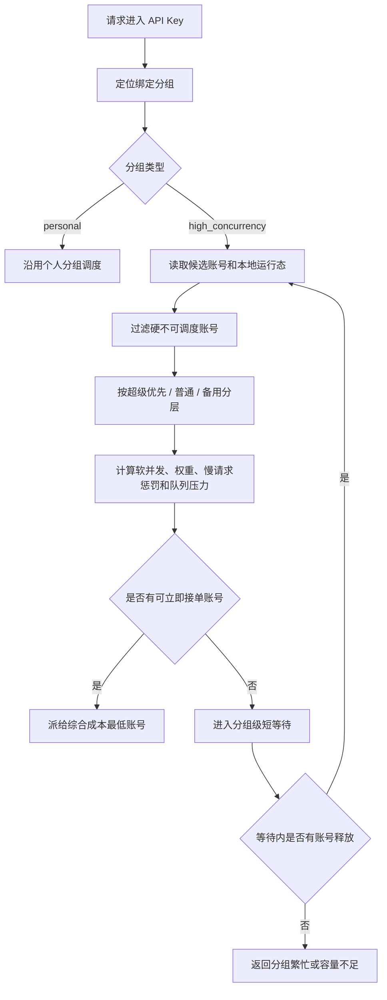

# 高并发分组调度设计

> 本文是待审设计草案，当前不代表代码已经实现。
> 目标是先固定高并发分组的产品语义、调度原则、配置边界和待验证场景，待方案确认后再进入实现计划。

## 背景

现有分组更接近个人自用场景：API Key 进入分组后，在账号仍被判断为可用时会持续命中同一个或少数账号，只有并发达到硬上限、账号不可调度、请求失败或错误策略触发后才切到后续账号。

当同一个 API Key 被大量客户端并发使用时，这种方式会带来明显体验问题：

- 大量请求会堆到同一个上游账号上，直到该账号排队、变慢、超时或被打到不可调度。
- 上游状态码不可信，不能把 `429`、`5xx` 或某类响应码当成唯一判断依据。
- 即使账号最终没有返回错误，用户侧也可能已经因为长时间等待而超时。
- 备用账号、超级优先、权重等账号配置没有形成面向高并发体验的组合调度能力。

因此需要在保留个人分组简单行为的同时，新增面向高并发 API Key 的分组类型。

## 分组类型

分组建议区分两类：

| 类型 | 建议枚举 | 适用场景 | 调度目标 |
| --- | --- | --- | --- |
| 个人分组 | `personal` | 个人使用、低并发、少量账号兜底 | 简单、稳定、可预测 |
| 高并发分组 | `high_concurrency` | 同一个 API Key 被多人或程序大量并发调用 | 降低排队等待，主动把新请求分配给更空闲、更快的账号 |

默认分组和历史分组保持 `personal`。高并发分组必须由用户显式创建或显式切换，避免默认行为突然改变。

“团队分组”这个名称容易和系统团队、团队授权混淆，前端建议展示为“高并发分组”或“协同分组”。文档和协议枚举优先使用 `high_concurrency`。

## 设计原则

- 账号配置优先：超级优先、优先级、备用、权重、并发上限仍是调度的基础事实。
- 不依赖上游状态码做默认健康判断：上游状态码只进入既有错误特征规则或账号错误策略；高并发调度主要看本地可观测现象。
- 避免账号内排队：请求不应先绑定某个账号再排队等待它释放，而应在分组层选择当前最适合接单的账号。
- 快速优先高于严格比例：一旦分组出现等待或账号变慢，应优先使用空闲账号，权重比例可以短时被打破。
- 分组级短等待：所有账号都暂时不适合接单时，允许在分组层短暂等待任意账号释放；超过阈值后快速返回“分组繁忙”类错误。
- 单机轻量实现：当前只设计单节点进程内运行态，不引入 Redis、分布式队列或多实例一致性假设。
- 热路径性能优先：高并发策略不能在每次请求里增加额外数据库往返、扫描历史明细、复杂全局锁或无界排序；调度计算必须是有界、内存内、可降级的轻量逻辑。

## 性能底线

高并发分组的目标是减少等待，不是引入新的本地瓶颈。实现时必须先设定热路径预算：

- **不增加额外 DB 往返**：网关原本就需要读取 API Key、分组、候选账号和额度缓存；高并发策略应复用同一次运行时快照，不为每次选号再查 `groups`、`group_accounts`、质量表或使用记录。
- **不扫描记录库明细**：慢请求、近期超时和质量趋势只能来自进程内运行态或 worker 预聚合缓存，不能在请求链路实时扫描 `usage_records`、审计日志或分钟桶。
- **候选集有界计算**：同一分组账号数通常有限，选号可以对当前候选数组做一次 O(n) 评分；不允许引入跨分组全局排序、全量账号池扫描或复杂组合搜索。
- **运行态 O(1) 更新**：账号 `inFlight`、分组 `queuedCount`、最近分配时间、慢请求计数等都应在请求进入、派发、完成和释放时做常量级更新。
- **无重锁设计**：Node 单进程内可以用同步 Map 和短临界区更新状态；不要为了调度引入会阻塞事件循环的互斥锁、文件锁或 SQLite 写锁。
- **不为每个等待请求创建长期定时器风暴**：分组级短队列应使用统一唤醒和 deadline 判断，队列项只保存轻量元信息，避免高并发下定时器数量和闭包数量失控。
- **快速失败优先于无限排队**：队列达到上限或等待超过 `maxQueueWaitMs` 时立即返回本地容量错误，保护网关 QPS 和事件循环。
- **可降级**：如果调度运行态缺失、异常或超过本地计算预算，高并发分组应退化为简单的有界 least-inflight / 稳定排序，而不是阻塞请求等待完整指标。

建议第一版验收性能指标：

| 指标 | 目标 |
| --- | --- |
| 额外数据库查询 | 高并发策略每次选号新增 `0` 次 |
| 调度计算复杂度 | 单分组候选账号 O(n)，不跨分组扫描 |
| 选号本地耗时 | p95 小于 `1ms`，p99 小于 `5ms`，压测后再按机器修正 |
| 队列等待上限 | 默认不超过 `3000ms`，超时快速返回 |
| 运行态内存 | 按活跃分组和活跃账号有界增长，空闲后可 TTL 清理 |
| 失败记录 | 本地队列满 / 等待超时异步入使用记录和审计，不阻塞响应 |

## 账号配置参与方式

高并发分组不是绕过账号配置，而是把账号配置组合起来：

| 配置 | 来源 | 高并发语义 |
| --- | --- | --- |
| 超级优先 | 账号或本地授权绑定 | 优先进入主候选层，但达到软并发、变慢或分组排队后可以分流 |
| `priority` | 账号 | 同层级内小值优先，作为稳定排序和初始倾向 |
| 降级备用 | 账号或本地授权绑定 | 平时不吃主流量；主池忙、慢、排队或不可用时可启用 |
| `weight` | `group_accounts` | 控制同层级账号可承担的相对并发份额和轮转频率 |
| `concurrency_limit` | 账号 | 硬并发上限，达到后不再派新请求 |
| 软并发阈值 | 分组默认或绑定覆盖 | 达到后优先切下一个账号，不等硬并发打满 |

授权账户的本地超级优先、降级备用、权重和软并发覆盖仍只影响当前使用方自己的分组绑定，不覆盖物理账号所有者配置。

## 高并发调度流程

硬过滤仍包括：账号停用、异常、限流中、临时不可调用、过期、授权失效、额度不可用、模型不支持、绑定禁用、代理配置不可用、硬并发达到上限等。

软选择只在硬过滤之后生效，主要用于决定“谁现在更适合接新请求”。

## 组合策略

### 软并发轮转

个人分组可以继续使用既有候选顺序。高并发分组应增加软并发阈值：

- `softConcurrency = 1`：账号上已经有人，就优先切下一个账号。
- `softConcurrency = 3`：账号上已有 3 个请求后，再优先切下一个账号。
- 权重可以放大软并发，例如权重 `2` 的账号可获得约两倍软并发份额。

软并发不是硬限制。所有主池账号都达到软并发但仍未达到硬并发时，可以继续按最小负载、权重欠账和最近耗时选择，而不是直接失败。

### 快速优先

高并发分组应提供“快速优先”行为：

- 如果当前分组已经出现排队，优先找空闲或低负载账号接单。
- 如果超级优先账号已经达到软并发，而普通账号空闲，可以临时让普通账号接单。
- 如果主池账号都忙或明显变慢，允许启用备用账号，避免用户长时间无响应。
- 快速优先只影响新请求，不主动迁移或中断已经发往上游的请求。

这条规则的目标是减少客户端等待时间，而不是严格维持账号权重比例。

### 慢请求分流

高并发分组不依赖上游状态码判断账号是否该分流，而是依据本地现象：

- 账号上存在超过 `slowRequestThresholdMs` 仍未完成的请求。
- 非流式请求最近总耗时明显高于分组阈值。
- 流式请求首段等待时间过长，或持续没有可见输出。
- 最近窗口内本地超时、连接异常或客户端等待超时次数过多。
- 账号近期 `latencyEwma`、首 token 耗时或质量缓存明显劣于同层级其他账号。

慢请求分流的默认动作是降低该账号新请求接单优先级或临时降低软并发，不直接把账号写成异常。只有既有账号错误策略、流熔断或明确人工操作才写入账号状态。

### 备用账号启用

备用账号仍不参与正常首轮主流量，但高并发分组下应支持这些启用条件：

- 主池无可立即接单账号。
- 分组短队列已经出现等待。
- 主池账号达到软并发且存在慢请求惩罚。
- 当前请求已超过可接受等待阈值。

备用账号启用后也遵循自己的权重、软并发、硬并发、慢请求分流和授权校验。

### 会话亲和

高并发分组需要显式处理会话亲和和快速优先之间的冲突：

- 默认先尊重仍健康、未达到软并发的亲和账号。
- 亲和账号达到硬并发、进入冷却、变慢或导致请求排队时，允许打破亲和并重新选择账号。
- 是否允许“达到软并发就打破亲和”建议作为高并发分组配置项，默认开启，以优先保证响应速度。

这不会改变 Codex 客户端专属 turn 级切号策略；Codex 策略仍按客户端 profile 和 turn 边界单独生效。

## 分组级队列

高并发分组不应让请求排在某个账号内部。建议使用分组级短队列：

- 队列只保存等待派发的请求元信息，不保存完整请求体副本。
- 只有所有候选账号都无法立即接单时才入队。
- 任意账号释放并发槽后，从分组队列中取等待最久且仍未取消的请求重新选号。
- 每个分组配置 `maxQueueSize` 和 `maxQueueWaitMs`。
- 超过等待阈值后返回明确错误，避免客户端无反馈挂到长超时。

如果一个分组绑定多个 API Key，后续实现还需要考虑 API Key 级公平性：同一个大流量 API Key 不应无限占满分组队列，至少要有每 Key 的排队上限或调度份额。

## 运行态指标

高并发分组的判断应以轻量运行态为主：

| 指标 | 作用 | 持久化要求 |
| --- | --- | --- |
| `inFlight` | 当前账号正在处理的请求数 | 进程内易失 |
| `softInFlight` | 用于软并发轮转的当前占用 | 进程内易失 |
| `queuedCount` | 分组当前等待数 | 进程内易失 |
| `oldestQueueWaitMs` | 最老等待请求时长 | 进程内易失 |
| `latencyEwma` | 最近本地完成耗时趋势 | 可先内存，后续再复用质量缓存 |
| `firstOutputEwma` | 首段或首 token 等待趋势 | 可先内存，后续再复用质量缓存 |
| `slowInFlightCount` | 当前疑似慢请求数量 | 进程内易失 |
| `recentTimeoutCount` | 最近窗口本地超时数量 | 可先内存 |
| `lastAssignedAt` | 轮转和稳定排序兜底 | 进程内易失 |

这些指标是体验辅助，不替代使用记录、统计缓存、授权额度或账号状态事实。进程重启后可以丢失，并回到保守默认。

## 建议配置

### 分组级配置

高并发分组建议保存独立调度配置，例如 `groups.scheduling_policy_json`：

| 配置 | 建议默认值 | 说明 |
| --- | --- | --- |
| `mode` | `balanced_fast` | 高并发组合策略，兼顾负载均衡和快速优先 |
| `defaultSoftConcurrency` | `1` | 单账号默认软并发阈值 |
| `weightAffectsSoftConcurrency` | `true` | 权重是否放大软并发份额 |
| `fastFirstEnabled` | `true` | 出现排队或等待风险时优先使用空闲账号 |
| `fallbackOnQueueEnabled` | `true` | 主池排队时是否启用备用账号 |
| `breakAffinityOnSoftLimit` | `true` | 亲和账号达到软阈值后是否允许重新选号 |
| `slowRequestThresholdMs` | `30000` | 未完成请求超过该时长后降低新请求优先级 |
| `firstOutputSlowThresholdMs` | `15000` | 首段或首 token 等待过长的分流阈值 |
| `recentTimeoutWindowSeconds` | `120` | 本地超时统计窗口 |
| `recentTimeoutPenaltyThreshold` | `2` | 窗口内超过几次后降权 |
| `maxQueueWaitMs` | `3000` | 分组短等待上限 |
| `maxQueueSize` | `100` | 单分组最大等待请求数 |
| `perApiKeyQueueLimit` | `50` | 单 API Key 在该分组内最大等待数 |

这些默认值只是初始建议，最终需要通过本地压测和真实使用体验校准。

### 绑定级配置

`group_accounts` 可以继续承载本地绑定调度配置，并为高并发分组扩展：

| 配置 | 说明 |
| --- | --- |
| `weight` | 当前已有字段，在高并发分组中参与软并发和轮转份额 |
| `soft_concurrency_limit` | 可选覆盖，未设置时用分组默认值乘以权重 |
| `local_super_priority_enabled` | 授权账户在当前使用方分组内的本地超级优先 |
| `local_fallback_enabled` | 授权账户在当前使用方分组内的本地备用 |
| `local_status` / `local_cooldown_until` | 授权账户当前使用方本地停调或冷却 |

账号自身的 `concurrency_limit` 仍是硬上限，绑定级软并发不能突破账号硬并发。

## 用户界面建议

- 新建分组时选择“个人分组”或“高并发分组”，默认个人分组。
- 分组列表展示分组类型、账号数量、可调度账号数量和高并发策略摘要。
- 高并发分组编辑页提供策略配置，但默认折叠高级参数。
- 绑定账号时允许维护权重、软并发覆盖、超级优先和备用。
- 所有页面文案保持中文，避免把 `high_concurrency`、`balanced_fast` 等协议枚举直接暴露给用户。

## 错误与返回

高并发分组没有可立即接单账号且队列等待超时后，应返回明确的网关错误：

- 文案建议：“当前分组繁忙，请稍后重试或增加可用账户。”
- 错误原因应区分：无可调度账号、全部账号硬并发已满、分组队列已满、等待超时、授权或额度不可用。
- 对外状态码需要实现前再确认；容量不足倾向使用 `429` 或 `503`，但必须保持 OpenAI-compatible 错误结构。
- 分组本地拒绝、队列满、等待超时和客户端等待中断都没有上游尝试，但仍应进入使用记录和原始审计的网关本地失败口径，便于后续定位“账号不报错但用户一直等”的问题。

## 不做事项

- 不用上游状态码白名单决定默认调度。
- 不在高并发分组里引入分布式队列或多实例一致性。
- 不把慢请求分流直接等同于账号异常。
- 不主动中断或迁移已经发出的请求。
- 不让前端基于使用记录自行汇总调度指标。
- 不通过分组授权把第三方授权账户继续转授权给别人。

## 复查补充

- 并发槽必须先占用再发上游请求，并在响应完成、流结束、失败退出或客户端断开时通过 `finally` 类路径释放；不能先选中账号再异步等待后补占用，否则高并发瞬间会把多个请求同时派到同一个账号。
- 分组级队列要支持取消：客户端已经断开、API Key 已停用、授权已失效或请求等待超时后，队列项必须被跳过或清理，不能继续派发到上游。
- 高并发分组的本地运行态应按 `systemAccountId + apiKeyId + groupId` 或更细边界隔离，避免不同调用方、不同授权分组或不同 API Key 互相污染排队和慢请求判断。
- 权重只表达目标份额，不应导致低权重账号长期饿死；当高权重账号变慢或软满时，低权重账号仍可按快速优先接单。
- 慢请求分流只影响新请求，已输出的流式响应仍遵循现有 SSE 边界，不做服务端透明重放。
- 如果后续实现 API Key 级公平队列，队列调度也需要稳定顺序和最大等待上限，避免一个 Key 长时间占住分组但又不被快速失败。

## 待复查问题

- 高并发分组是否默认允许达到软并发后打破会话亲和。
- 备用账号在“主池已软满但未硬满”时是否立即启用，还是等待短队列超过阈值再启用。
- 流式长请求和普通短请求是否需要不同软并发阈值。
- 分组繁忙时对外使用 `429` 还是 `503` 更符合客户端重试预期。
- 是否需要给同一分组内不同 API Key 设置公平调度，防止一个 Key 占满整个分组。
- 第一版是否只做进程内运行态，还是同步把部分短窗口质量指标复用到 `account_quality_scores`。
