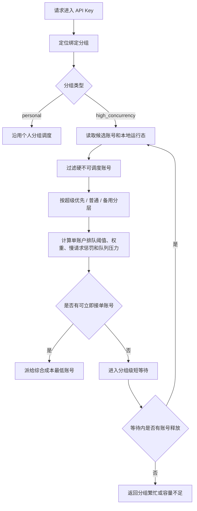

# 高并发分组调度设计

> 本文记录高并发分组调度设计和第一版实现边界。
> 当前代码已实现分组类型、策略字段、绑定级权重和单账户排队阈值覆盖、运行态并发排序、默认最大单账户排队阈值、可配置分组最大等待时间、阈值后打破亲和、备用启用、进行中慢请求降权、分组级短队列、每 API Key 队列上限、单 IP 并发保护和分组繁忙 `429`。除最大单账户排队阈值、最大等待时间和单 IP 并发保护外，高并发保护策略默认开启，不提供用户侧开关。

## 背景

现有分组更接近个人自用场景：API Key 进入分组后，在账号仍被判断为可用时会持续命中同一个或少数账号，只有并发达到硬上限、账号不可调度、请求失败或错误策略触发后才切到后续账号。

当同一个 API Key 被大量客户端并发使用时，这种方式会带来明显体验问题：

- 大量请求会堆到同一个上游账号上，直到该账号排队、变慢、超时或被打到不可调度。
- 上游状态码不可信，不能把 `429`、`5xx` 或某类响应码当成唯一判断依据。
- 即使账号最终没有返回错误，用户侧也可能已经因为长时间等待而超时。
- 备用账号、超级优先、权重等账号配置没有形成面向高并发体验的组合调度能力。

因此需要在保留个人分组简单行为的同时，新增面向高并发 API Key 的分组类型。

## 分组类型

分组建议区分两类：

| 类型 | 建议枚举 | 适用场景 | 调度目标 |
| --- | --- | --- | --- |
| 个人分组 | `personal` | 个人使用、低并发、少量账号兜底 | 简单、稳定、可预测 |
| 高并发分组 | `high_concurrency` | 同一个 API Key 被多人或程序大量并发调用 | 降低排队等待，主动把新请求分配给更空闲、更快的账号 |

默认分组和历史分组保持 `personal`。高并发分组必须由用户显式创建或显式切换，避免默认行为突然改变。

“团队分组”这个名称容易和系统团队、团队授权混淆，前端建议展示为“高并发分组”或“协同分组”。文档和协议枚举优先使用 `high_concurrency`。

## 设计原则

- 账号配置优先：超级优先、优先级、备用、权重、并发上限仍是调度的基础事实。
- 不依赖上游状态码做默认健康判断：上游状态码只进入既有错误特征规则或账号错误策略；高并发调度主要看本地可观测现象。
- 避免账号内排队：请求不应先绑定某个账号再排队等待它释放，而应在分组层选择当前最适合接单的账号。
- 快速优先高于严格比例：一旦分组出现等待或账号变慢，应优先使用空闲账号，权重比例可以短时被打破。
- 分组级短等待：所有账号都暂时不适合接单时，允许在分组层短暂等待任意账号释放；超过阈值后快速返回“分组繁忙”类错误。
- 单机轻量实现：当前只设计单节点进程内运行态，不引入 Redis、分布式队列或多实例一致性假设。
- 热路径性能优先：高并发策略不能在每次请求里增加额外数据库往返、扫描历史明细、复杂全局锁或无界排序；调度计算必须是有界、内存内、可降级的轻量逻辑。

## 性能底线

高并发分组的目标是减少等待，不是引入新的本地瓶颈。实现时必须先设定热路径预算：

- **不增加额外 DB 往返**：网关原本就需要读取 API Key、分组、候选账号和额度缓存；高并发策略应复用同一次运行时快照，不为每次选号再查 `groups`、`group_accounts`、质量表或使用记录。
- **不扫描数据集库明细**：慢请求、近期超时和质量趋势只能来自进程内运行态或 worker 预聚合缓存，不能在请求链路实时扫描 `usage_records`、审计日志或分钟桶。
- **候选集有界计算**：同一分组账号数通常有限，选号可以对当前候选数组做一次 O(n) 评分；不允许引入跨分组全局排序、全量账号池扫描或复杂组合搜索。
- **运行态 O(1) 更新**：账号 `inFlight`、分组 `queuedCount`、最近分配时间、慢请求计数等都应在请求进入、派发、完成和释放时做常量级更新。
- **无重锁设计**：Node 单进程内可以用同步 Map 和短临界区更新状态；不要为了调度引入会阻塞事件循环的互斥锁、文件锁或 SQLite 写锁。
- **不为每个等待请求创建长期定时器风暴**：分组级短队列应使用统一唤醒和 deadline 判断，队列项只保存轻量元信息，避免高并发下定时器数量和闭包数量失控。
- **快速失败优先于无限排队**：队列达到上限或等待超过 `maxQueueWaitMs` 时立即返回本地容量错误，保护网关 QPS 和事件循环。
- **可降级**：如果调度运行态缺失、异常或超过本地计算预算，高并发分组应退化为简单的有界 least-inflight / 稳定排序，而不是阻塞请求等待完整指标。

建议第一版验收性能指标：

| 指标 | 目标 |
| --- | --- |
| 额外数据库查询 | 高并发策略每次选号新增 `0` 次 |
| 调度计算复杂度 | 单分组候选账号 O(n)，不跨分组扫描 |
| 选号本地耗时 | p95 小于 `1ms`，p99 小于 `5ms`，压测后再按机器修正 |
| 队列等待上限 | 默认 `60000ms`，可按分组配置，超时快速返回 |
| 运行态内存 | 按活跃分组和活跃账号有界增长，空闲后可 TTL 清理 |
| 失败记录 | 本地队列满 / 等待超时异步入使用记录和审计，不阻塞响应 |

## 指标分层与反向缓存

高并发调度需要指标，但指标不能在请求链路现场计算。建议采用“两层指标”：

| 指标类型 | 示例 | 更新方式 | 选号读取方式 |
| --- | --- | --- | --- |
| 实时易失指标 | `inFlight`、分组等待数、最老等待时长、当前慢请求数、最近分配时间 | 网关请求生命周期内存更新 | 直接读当前进程 Map |
| 后台预计算指标 | 近期成功率、超时率、首 token 耗时、总耗时 EWMA、质量分、近期可用性摘要 | background worker 或请求终态事件增量写入紧凑缓存 | 随 DB service 运行时快照批量读入，热路径不再查库 |

后台反向缓存可以解决“选择依据不够”的问题，但要遵守边界：

- worker 从 `usage_records` 游标、`account_quality_minute_stats` 或请求终态事件增量计算账号质量，不在网关请求中现场聚合。
- worker 写入紧凑的账号 / 分组调度缓存，例如复用 `account_quality_scores`，或后续新增 `group_scheduler_score_cache` 这类小表。
- DB service 在读取 API Key 运行时快照时，把候选账号对应的缓存分批带出；网关选号只读这份快照和进程内实时指标。
- 缓存缺失或过期时不能阻塞请求重算，按保守默认参与调度，例如只用超级优先、优先级、权重、当前并发和稳定顺序。
- 跨进程不能只依赖 worker 内存。server、worker、DB service 分进程运行时，worker 计算出的共享指标必须落到紧凑 SQLite 缓存表，或通过明确 IPC 推送到 DB service / server 的运行态快照。
- 缓存刷新频率要低于请求频率，并有 TTL / 版本号 / 脏标记；写请求只标记脏或投递事件，不能同步展开所有分组或所有账号。

推荐口径：

- 当前并发、队列和慢请求进行中状态由网关内存维护，因为它们需要毫秒级实时性。
- 最近质量、超时率、首 token、总耗时、错误趋势由后台 job 反向写缓存，因为它们允许几十秒到数分钟滞后。
- 最终选号 = 硬过滤后的账号配置 + 后台质量快照 + 网关实时运行态。这样能提升选择质量，又不牺牲热路径 QPS。

## 账号配置参与方式

高并发分组不是绕过账号配置，而是把账号配置组合起来：

| 配置 | 来源 | 高并发语义 |
| --- | --- | --- |
| 超级优先 | 账号或本地授权绑定 | 优先进入主候选层，但达到单账户排队阈值、变慢或分组排队后可以分流 |
| `priority` | 账号 | 同层级内小值优先，作为稳定排序和初始倾向 |
| 降级备用 | 账号或本地授权绑定 | 平时不吃主流量；主池忙、慢、排队或不可用时可启用 |
| `weight` | `group_accounts` | 控制同层级账号可承担的相对并发份额和轮转频率 |
| `concurrency_limit` | 账号 | 硬并发上限，达到后不再派新请求 |
| 单账户排队阈值 | 分组默认或绑定覆盖 | 达到后优先切下一个账号，不等硬并发打满 |

授权账户的本地超级优先、降级备用、权重和单账户排队阈值覆盖仍只影响当前使用方自己的分组绑定，不覆盖物理账号所有者配置。

## 高并发调度流程



硬过滤仍包括：账号停用、异常、限流中、临时不可调用、过期、授权失效、额度不可用、模型不支持、绑定禁用、代理配置不可用、硬并发达到上限等。

软选择只在硬过滤之后生效，主要用于决定“谁现在更适合接新请求”。

## 组合策略

### 单账户排队阈值轮转

个人分组可以继续使用既有候选顺序。高并发分组应增加最大单账户排队阈值：

- 阈值为 `1`：账号上已经有人，就优先切下一个账号。
- 阈值为 `3`：账号上已有 3 个请求后，再优先切下一个账号。
- 第一版默认阈值为 `5`，避免账号切换过于频繁，减少会话缓存和上游 prompt cache 成本。
- 权重可以放大阈值，例如权重 `2` 的账号可获得约两倍接单份额。

单账户排队阈值不是硬限制，也不能超过账号自己的 `concurrency_limit`。有效阈值应按 `min(分组默认阈值 * 权重, 绑定级阈值覆盖, 账号硬并发上限)` 一类规则收口；所有主池账号都达到阈值但仍未达到硬并发时，可以继续按最小负载、权重欠账和最近耗时选择，而不是直接失败。

### 快速优先

高并发分组应提供“快速优先”行为：

- 如果当前分组已经出现排队，优先找空闲或低负载账号接单。
- 如果超级优先账号已经达到单账户排队阈值，而普通账号空闲，可以临时让普通账号接单。
- 如果主池账号都忙或明显变慢，允许启用备用账号，避免用户长时间无响应。
- 快速优先只影响新请求，不主动迁移或中断已经发往上游的请求。

这条规则的目标是减少客户端等待时间，而不是严格维持账号权重比例。

### 慢请求分流

高并发分组不依赖上游状态码判断账号是否该分流，而是依据本地现象：

- 账号上存在超过 `slowRequestThresholdMs` 仍未完成的请求。
- 非流式请求最近总耗时明显高于分组阈值。
- 流式请求首段等待时间过长，或持续没有可见输出。
- 最近窗口内本地超时、连接异常或客户端等待超时次数过多。
- 账号近期 `latencyEwma`、首 token 耗时或质量缓存明显劣于同层级其他账号。

慢请求分流的默认动作是降低该账号新请求接单优先级，不直接把账号写成异常。只有既有账号错误策略、流熔断或明确人工操作才写入账号状态。

### 备用账号启用

备用账号仍不参与正常首轮主流量，但高并发分组下应支持这些启用条件：

- 主池无可立即接单账号。
- 分组短队列已经出现等待。
- 主池账号达到单账户排队阈值且存在慢请求惩罚。
- 当前请求已超过可接受等待阈值。

备用账号启用后也遵循自己的权重、单账户排队阈值、硬并发、慢请求分流和授权校验。

### 会话亲和

高并发分组需要显式处理会话亲和和快速优先之间的冲突：

- 默认先尊重仍健康、未达到单账户排队阈值的亲和账号。
- 亲和账号达到单账户排队阈值后，默认允许打破亲和并重新选择账号，避免请求被锁死在一个已经排队或被上游限速的账号上。
- 亲和账号达到硬并发、进入冷却、变慢或导致请求排队时，必须允许打破亲和并重新选择账号。
- 打破亲和会降低上游上下文缓存和 prompt cache 命中率，但高并发分组的首要目标是避免用户长时间等待；个人分组继续保持更稳定的亲和语义。

这不会改变 Codex 客户端专属 turn 级切号策略；Codex 策略仍按客户端 profile 和 turn 边界单独生效。

## 分组级队列

高并发分组不应让请求排在某个账号内部。建议使用分组级短队列：

- 队列只保存等待派发的请求元信息，不保存完整请求体副本。
- 只有所有候选账号都无法立即接单时才入队。
- 任意账号释放并发槽后，从分组队列中取等待最久且仍未取消的请求重新选号。
- 分组短队列使用可配置的 `maxQueueWaitMs` 和内置默认的 `maxQueueSize`。
- 超过等待阈值后返回明确错误，避免客户端无反馈挂到长超时。

如果一个分组绑定多个 API Key，同一个大流量 API Key 不应无限占满分组队列。第一版使用每 Key 排队上限保证基础公平；更复杂的份额公平或加权公平可以在真实流量复测后再扩展。

## 单 IP 并发保护

高并发分组可以按客户端 IP 增加一层可选闸口，避免同一个出口 IP 在短时间内占满分组资源，导致其他调用方长时间无响应。

默认不启用单 IP 并发限制；只有用户在高并发分组配置中显式开启后才生效。开启时前端默认填入 `5`，表示同一个 `系统账户 + 分组 + API Key + 客户端 IP` 同时最多有 5 个请求通过 IP 闸口。计数维度包含 API Key，是为了减少办公网、代理出口或 NAT 环境下不同 API Key 被同一个出口 IP 互相误伤。

单 IP 并发闸口位于网关认证、分组授权、额度校验、模型过滤和候选账号读取之后，位于账号调度和分组短队列之前：

- 未启用限制时，请求完全按原高并发分组逻辑继续。
- 启用限制且当前 IP 并发未达到上限时，请求占用一个 IP 槽，再进入账号选择和分组短队列。
- 达到上限且模式为 `reject` 时，立即返回本地 `429`，不占用账号并发，也不进入分组短队列。
- 达到上限且模式为 `queue` 时，请求只在 IP 闸口前短暂等待；等同一 IP 的已有请求释放后，再占用 IP 槽并继续进入后续分组调度。排队等待期间不占用账号并发，也不提前进入分组短队列。
- 已通过 IP 闸口的请求如果后续进入分组短队列，仍计入该 IP 当前并发，防止同一个 IP 持续堆积等待请求。

IP 槽释放必须跟随请求生命周期：上游成功完成、上游失败、本地失败、客户端断开、流式响应结束或异常退出都要释放。该状态属于单节点进程内易失运行态，服务重启后清空并回到保守默认。

IP 排队模式也必须是有界等待，不能无限挂起：

- 等待超时复用分组 `maxQueueWaitMs`。
- 每 IP 等待队列使用内置上限，默认按 `max(20, limit * 2)` 收口。
- 队列满、等待超时或客户端断开都返回 / 记录本地失败口径，不发起上游请求。

## 运行态指标

高并发分组的判断应以轻量运行态为主：

| 指标 | 作用 | 持久化要求 |
| --- | --- | --- |
| `inFlight` | 当前账号正在处理的请求数 | 进程内易失 |
| `softInFlight` | 用于单账户排队阈值轮转的当前占用 | 进程内易失 |
| `queuedCount` | 分组当前等待数 | 进程内易失 |
| `oldestQueueWaitMs` | 最老等待请求时长 | 进程内易失 |
| `latencyEwma` | 最近本地完成耗时趋势 | 可先内存，后续再复用质量缓存 |
| `firstOutputEwma` | 首段或首 token 等待趋势 | 可先内存，后续再复用质量缓存 |
| `slowInFlightCount` | 当前疑似慢请求数量 | 进程内易失 |
| `recentTimeoutCount` | 最近窗口本地超时数量 | 可先内存 |
| `lastAssignedAt` | 轮转和稳定排序兜底 | 进程内易失 |

这些指标是体验辅助，不替代使用记录、统计缓存、授权额度或账号状态事实。进程重启后可以丢失，并回到保守默认。

## 建议配置

### 分组级配置

高并发分组建议保存独立调度配置，例如 `groups.scheduling_policy_json`：

| 配置 | 建议默认值 | 说明 |
| --- | --- | --- |
| `mode` | `balanced_fast` | 高并发组合策略，兼顾负载均衡和快速优先 |
| `defaultSoftConcurrency` | `5` | 对外展示为“最大单账户排队阈值”，最终不能超过账号硬并发上限 |
| `maxQueueWaitMs` | `60000` | 对外展示为“最大等待时间”，所有账号硬满时请求在分组短队列中的最长等待时间 |
| `clientIpConcurrencyLimit` | 不设置 | 对外展示为“单 IP 并发限制”；默认关闭，用户开启后前端默认填 `5`，最终按 `系统账户 + 分组 + API Key + 客户端 IP` 计数 |
| `clientIpConcurrencyOverflowMode` | `reject` | 对外展示为“超过限制时”；`reject` 表示立即拒绝，`queue` 表示在 IP 闸口前排队等待 |

快速优先、权重放大阈值、备用账号启用、达到阈值打破亲和、慢请求分流、分组短队列容量、每 API Key 队列上限和每 IP 队列上限都作为高并发分组内置策略默认开启或固定收口，不暴露为用户配置。对应内部默认值仍由代码统一维护，避免不同分组被配置成行为不一致。

### 绑定级配置

`group_accounts` 可以继续承载本地绑定调度配置，并为高并发分组扩展：

| 配置 | 说明 |
| --- | --- |
| `weight` | 当前已有字段，在高并发分组中参与单账户排队阈值和轮转份额 |
| `soft_concurrency_limit` | 对外展示为“绑定单账户排队阈值”，未设置时用分组默认值乘以权重 |
| `local_super_priority_enabled` | 授权账户在当前使用方分组内的本地超级优先 |
| `local_fallback_enabled` | 授权账户在当前使用方分组内的本地备用 |
| `local_status` / `local_cooldown_until` | 授权账户当前使用方本地停调或冷却 |

账号自身的 `concurrency_limit` 仍是硬上限，绑定级单账户排队阈值不能突破账号硬并发。

## 用户界面建议

- 新建分组时选择“个人分组”或“高并发分组”，默认个人分组。
- 分组列表展示分组类型、账号数量、可调度账号数量和高并发策略摘要。
- 高并发分组编辑页提供策略配置，但默认折叠高级参数。
- 高并发分组提供“限制单 IP 并发”开关；默认关闭。开启后“单 IP 并发上限”默认 `5`，“超过限制时”默认选择“立即拒绝”，也可切换为“排队等待”。
- 绑定账号时允许维护权重、单账户排队阈值覆盖、超级优先和备用。
- 所有页面文案保持中文，避免把 `high_concurrency`、`balanced_fast` 等协议枚举直接暴露给用户。

## 错误与返回

高并发分组没有可立即接单账号且队列等待超时后，应返回明确的网关错误：

- 文案建议：“当前分组繁忙，请稍后重试或增加可用账户。”
- 错误原因应区分：无可调度账号、全部账号硬并发已满、分组队列已满、等待超时、授权或额度不可用。
- 单 IP 并发达到上限且模式为立即拒绝时，文案建议：“当前 IP 并发已达到分组限制，请稍后重试。”
- 单 IP 排队模式等待超时或队列已满时，也返回本地 `429`，并在审计元数据中记录 IP 队列原因。
- 对外状态码使用 `429`，表示本地分组容量不足且客户端可重试；响应仍必须保持 OpenAI-compatible 错误结构。
- 分组本地拒绝、队列满、等待超时和客户端等待中断都没有上游尝试，但仍应进入使用记录和原始审计的网关本地失败口径，便于后续定位“账号不报错但用户一直等”的问题。

## 不做事项

- 不用上游状态码白名单决定默认调度。
- 不在高并发分组里引入分布式队列或多实例一致性。
- 不把慢请求分流直接等同于账号异常。
- 不主动中断或迁移已经发出的请求。
- 不让前端基于使用记录自行汇总调度指标。
- 不通过分组授权把第三方授权账户继续转授权给别人。

## 复查补充

- 并发槽必须先占用再发上游请求，并在响应完成、流结束、失败退出或客户端断开时通过 `finally` 类路径释放；不能先选中账号再异步等待后补占用，否则高并发瞬间会把多个请求同时派到同一个账号。
- 分组级队列要支持取消：客户端已经断开、API Key 已停用、授权已失效或请求等待超时后，队列项必须被跳过或清理，不能继续派发到上游。
- 高并发分组的本地运行态应按 `systemAccountId + apiKeyId + groupId` 或更细边界隔离，避免不同调用方、不同授权分组或不同 API Key 互相污染排队和慢请求判断。
- 权重只表达目标份额，不应导致低权重账号长期饿死；当高权重账号变慢或软满时，低权重账号仍可按快速优先接单。
- 慢请求分流只影响新请求，已输出的流式响应仍遵循现有 SSE 边界，不做服务端透明重放。
- API Key 级公平第一版使用每 Key 队列上限，队列调度保持稳定顺序和最大等待上限，避免一个 Key 长时间占住分组但又不被快速失败。

## 第一版性能方案

第一版建议选择“轻策略 + 强性能边界”，先解决单账号排队和高并发体验，不一次性做复杂调度系统。

### 热路径

1. DB service 继续用一次运行时快照返回 API Key、分组、候选账号、授权和额度缓存。
2. 高并发分组在快照里额外带出分组策略、绑定权重、绑定单账户排队阈值覆盖和账号质量缓存摘要。
3. 网关本进程维护 `schedulerRuntimeMap`，key 建议为 `systemAccountId + apiKeyId + groupId`，value 保存账号 `inFlight`、分组 `queuedCount`、慢请求计数、最近分配时间等轻量状态。
4. 请求进入后先硬过滤，再对候选账号做一次 O(n) 评分。
5. 选中账号后立即占用并发槽；占用失败则重新评分或进入短队列。
6. 请求完成、失败、客户端断开或流式结束时释放并发槽，并异步更新本地耗时 EWMA。

### 评分建议

第一版不需要复杂公式，先用可解释的成本分：

```text
score =
  priorityLayerCost
  + fallbackLayerCost
  + softConcurrencyPenalty
  + inFlightPenalty
  + slowRequestPenalty
  + qualityPenalty
  - weightCredit
```

排序只在同一分组候选数组内进行。超级优先、普通、备用先分层；层内再看单账户排队阈值、当前并发、权重和质量快照。缓存缺失时 `qualityPenalty = 0`，不触发同步查询。

### 队列策略

- 只有没有可立即接单账号时才入分组短队列。
- 默认 `maxQueueWaitMs = 60000`，`maxQueueSize = 1000`，`perApiKeyQueueLimit = 1000`。
- 队列项只保存 request resolve/reject、deadline、API Key 和分组边界，不保存完整请求体。
- 任意账号释放并发槽时唤醒队列头部，重新走硬过滤和评分。
- 队列满、等待超时或客户端断开时快速失败，并异步写本地失败使用记录 / 审计。

### 后台缓存

- 第一版优先复用 `account_quality_scores`，必要时再新增高并发专用缓存表。
- worker 通过真实请求分钟桶或终态事件刷新账号短窗口质量：成功率、超时率、首 token、总耗时和最近样本时间。
- DB service 批量读取候选账号质量缓存并放入运行时快照。
- 质量缓存 TTL 建议 24 小时；短窗口刷新频率可沿用账号质量刷新任务，后续再按压测调整。
- 缓存缺失、过期或 worker 滞后时按保守默认选号，不阻塞请求重建。

### 性能验收

| 项目 | 第一版目标 |
| --- | --- |
| 每请求额外 DB 查询 | `0` |
| 调度复杂度 | 单分组候选 O(n) |
| 本地选号耗时 | p95 `< 1ms`，p99 `< 5ms`，压测后修正 |
| 队列等待上限 | 默认 `60000ms`，可按分组配置 |
| 队列内存 | 只按活跃分组和等待请求有界增长 |
| 降级行为 | 指标缺失时继续简单调度，不同步补算 |

## 第一版采用值

| 问题 | 第一版取值 | 影响 |
| --- | --- | --- |
| 前端名称 | “高并发分组” | 避免和系统团队混淆；“协同分组”可作为说明文案 |
| 协议枚举 | `high_concurrency` | 后端、前端类型和文档统一 |
| 最大单账户排队阈值 | `5` | 减少过于频繁切号，且有效值不能超过账号硬并发上限 |
| 权重是否放大阈值 | 默认开启，不暴露配置 | 权重高的账号可承担更多并发，但不会打破硬并发上限 |
| 达到阈值是否打破会话亲和 | 默认是，不暴露配置 | 避免请求被亲和锁死在已排队或被限速账号上 |
| 备用账号启用时机 | 主池无立即接单账号或出现队列时启用 | 保持备用语义，同时避免用户等太久 |
| 慢请求是否写账号状态 | 默认否 | 只降低新请求优先级；状态仍交给错误策略 / 流熔断 / 人工操作 |
| 分组繁忙状态码 | `429` | 表达本地容量不足且客户端可重试 |
| 是否先做 API Key 级公平队列 | 第一版实现分组短队列和每 Key 队列上限 | 先防止单 Key 占满等待队列，复杂份额公平真实流量复测后再评估 |
| 质量缓存来源 | 先复用 `account_quality_scores` | 降低第一版存储复杂度，后续不足再新增专用表 |

## 待复查问题

- 高并发分组默认允许达到单账户排队阈值后打破会话亲和；第一版不提供关闭开关。
- 备用账号在“主池已软满但未硬满”时第一版立即启用，优先降低用户等待；真实流量复测后再评估是否增加更保守的等待阈值。
- 流式长请求和普通短请求第一版共用单账户排队阈值和慢请求阈值；如真实流量中流式长请求占用明显偏高，可再按 endpoint 或 stream 类型拆分配置。
- 分组繁忙时对外使用 `429`，表达本地容量不足且客户端可重试。
- 同一分组内不同 API Key 第一版使用每 Key 队列上限防止占满整个等待队列；更复杂的加权公平暂不进入轻量闭环。
- 第一版是否只做进程内运行态，还是同步把部分短窗口质量指标复用到 `account_quality_scores`。
